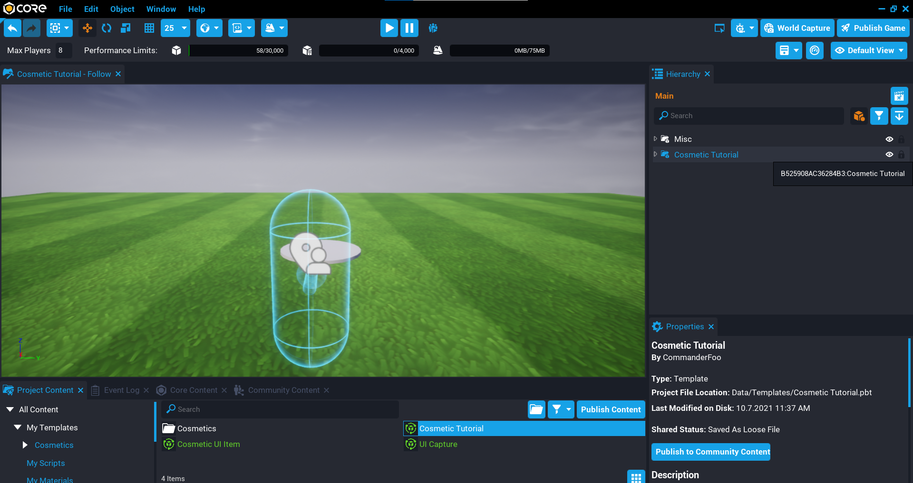
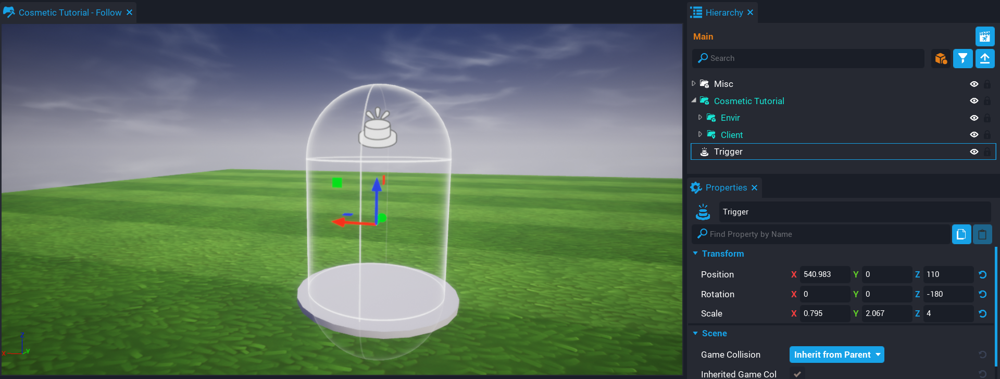
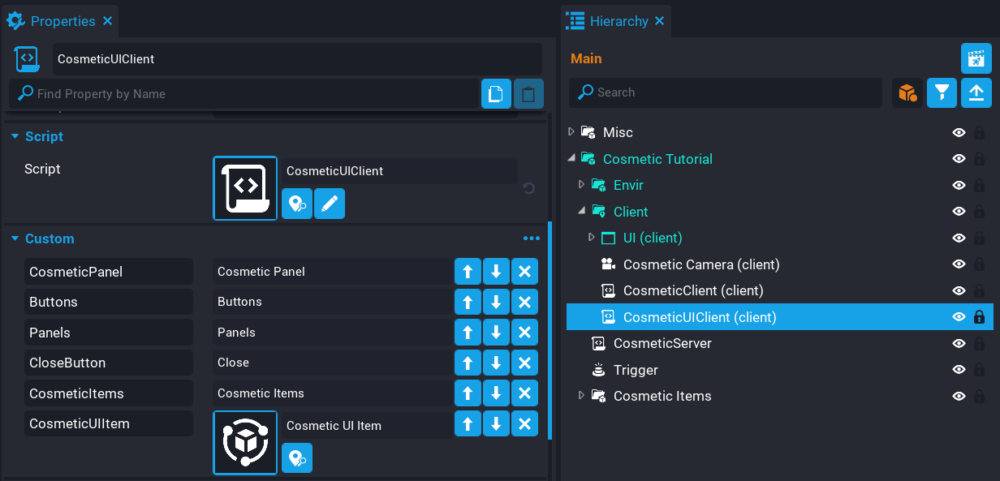

# Creating a Cosmetic System

## Overview

In this tutorial you are going to create a cosmetic system for players so they can attach different cosmetics to parts of the player's character.

<div class="mt-video" style="width:100%">
    <video autoplay muted playsinline controls loop class="center" style="width:100%">
        <source src="/img/CosmeticTutorial/preview.mp4" type="video/mp4" />
    </video>
</div>

* **Completion Time:** ~2 hours
* **Knowledge Level:** It's recommended to have completed the [Scripting Beginner](lua_basics_helloworld.md) and [Scripting Intermediate](lua_basics_lightbulb.md) tutorials.
* **Skills you will learn:**
    * Overriding the default camera.
    * Attaching objects to the character.
    * Camera capturing for UI.
    * Persistent storage.
    * Toggling UI panels.

---

## Import Asset from Community Content

You will be importing an asset from **Community Content** that will contain various components you will drop into the **Hierarchy** while you follow the tutorial.

1. Open the **Community Content** window.
2. Search for `Cosmetic System Tutorial` by **CoreAcademy**.
3. Click **Import**.

{: .center loading="lazy" }

## Add Cosmetic Template to Hierarchy

The content imported from **Community Content** contains some cosmetics and UI already set up ready to be used.

1. Click the **Project Content** tab.
2. Click **My Templates** under **All Content**.
3. Add the template **Cosmetic Tutorial** into the **Hierarchy**.
4. Deinstance the **Cosmetic Tutorial** template in the **Hierarchy**.

{: .center loading="lazy" }

## Create Cosmetic Trigger

A trigger needs to be added where the platform is to detect the player so you can override the camera and show the cosmetic UI.

When positioning the trigger, make sure it is high enough up, otherwise, the player's character will be in the ground.

1. Create new **Trigger** object.
2. Move the trigger so it is on the platform object (found in the **Envir** group).
3. Change the trigger **Shape** to **Capsule** in the **Properties** panel.
4. Scale the trigger to cover the platform.

{: .center loading="lazy" }

## Create Cosmetic Camera

When the player enters the trigger, a camera will override the default camera so players can see their character while changing cosmetic items.

1. Create a new camera and name it `Cosmetic Camera`.
2. Place the camera inside the **Client** group.
3. Disable **Use as Default**.
4. Disable **Attach to Local Player**.
5. Set **Base Rotation Mode** to **Camera**.

{: .center loading="lazy" }

## Create CosmeticServer Script

The **CosmeticServer** script will handle detecting when the player enters the trigger. This is done on the server so you can position and rotate the player's character to face the cosmetic camera.

Create a new script called `CosmeticServer` and place that script into the **Hierarchy**.

### Add Trigger Custom Property

Drag the trigger you created earlier, onto the **CosmeticServer** script as a new custom property. Name the custom property **Trigger**.

{: .center loading="lazy" }

### Edit CosmeticServer Script

Open up the **CosmeticServer** script.

#### Add Trigger Variable

```lua
local TRIGGER = script:GetCustomProperty("Trigger"):WaitForObject()
```

You need a reference to the trigger for later when connecting up the `beginOverlapEvent`.

#### Create DisablePlayer Function

```lua
local function DisablePlayer(player)
    player.isMovementEnabled = false
    player.desiredFacingMode = FacingMode.FACE_MOVEMENT
    player.canMount = false
end
```

Create the `DisablePlayer` function. This will stop the player from being able to move their character, or use their mount while the cosmetic UI is open. The `desiredFacingMode` property for the player is set to `FACE_MOVEMENT`, otherwise, the player's character can end up facing away from the camera.

#### Create EnablePlayer Function

```lua
local function EnablePlayer(player)
    player.isMovementEnabled = true
    player.desiredFacingMode = FacingMode.FACE_AIM_WHEN_ACTIVE
    player.canMount = true
end
```

Create the `EnablePlayer` function. This will give back control to the player's character so they can move around and use their mount when the cosmetic UI has been closed.

#### Create OnTriggerOverlap Function

```lua
local function OnTriggerOverlap(trigger, obj)
    if Object.IsValid(obj) and obj:IsA("Player") then
        DisablePlayer(obj)

        local triggerPos = trigger:GetWorldPosition()
        local triggerRot = trigger:GetWorldRotation()

        obj:SetWorldPosition(Vector3.New(triggerPos.x, triggerPos.y, triggerPos.z))
        obj:SetWorldRotation(Rotation.New(0, 0, triggerRot.z))

        Events.BroadcastToPlayer(obj, "EnableCosmeticChanger")
    end
end
```

Create the `OnTriggerOverlap` function. This function will check the object that entered the bounds of the trigger is a **Player** type. If it is a player that entered the trigger, then `DisablePlayer` is called to disable the player's control of their character.

```lua
obj:SetWorldPosition(Vector3.New(triggerPos.x, triggerPos.y, triggerPos.z))
obj:SetWorldRotation(Rotation.New(0, 0, triggerRot.z))
```

The position and rotation of the player need to be set. The position of the player can be set using the position of the trigger. The `z` rotation of the trigger is used for the player so the player's character faces the direction of the trigger. This will make the player's character face the cosmetic camera.

The position and rotation of the player need to be set. You can use the position and rotation of the trigger. Using the rotation gives you more flexibility in the direction a player is facing.

```lua
Events.BroadcastToPlayer(obj, "EnableCosmeticChanger")
```

A broadcast to the player that overlapped the trigger is done. A client script will listen for the event and handle overriding the camera and showing the cosmetic UI to the player.

#### Connect Events

```lua
TRIGGER.beginOverlapEvent:Connect(OnTriggerOverlap)
```

Add the above line so the `beginOverlapEvent` for the trigger is connected.

```lua
Events.ConnectForPlayer("EnablePlayer", EnablePlayer)
```

Add the above line. The `EnablePlayer` broadcast event will be called from the client, but you can set this up now.

### The CosmeticServer Script

??? "CosmeticServer"
    ```lua
    local TRIGGER = script:GetCustomProperty("Trigger"):WaitForObject()

    local function DisablePlayer(player)
        player.isMovementEnabled = false
        player.desiredFacingMode = FacingMode.FACE_MOVEMENT
        player.canMount = false
    end

    local function EnablePlayer(player)
        player.isMovementEnabled = true
        player.desiredFacingMode = FacingMode.FACE_AIM_WHEN_ACTIVE
        player.canMount = true
    end

    local function OnTriggerOverlap(trigger, obj)
        if Object.IsValid(obj) and obj:IsA("Player") then
            DisablePlayer(obj)

            local triggerPos = trigger:GetWorldPosition()
            local triggerRot = trigger:GetWorldRotation()

            obj:SetWorldPosition(Vector3.New(triggerPos.x, triggerPos.y, triggerPos.z))
            obj:SetWorldRotation(Rotation.New(0, 0, triggerRot.z))

            Events.BroadcastToPlayer(obj, "EnableCosmeticChanger")
        end
    end

    TRIGGER.beginOverlapEvent:Connect(OnTriggerOverlap)

    Events.ConnectForPlayer("EnablePlayer", EnablePlayer)
    ```

### Test the Game

Test the game and make sure the following work.

- Player is positioned when entering the trigger.
- Player is rotated to face the camera when entering the trigger.
- Movement controls are disabled, so movement inputs do not move the player.

<div class="mt-video" style="width:100%">
    <video autoplay muted playsinline controls loop class="center" style="width:100%">
        <source src="/img/CosmeticTutorial/test_game_trigger.mp4" type="video/mp4" />
    </video>
</div>

## Create CosmeticClient Script

Create a new script called `CosmeticClient` and place it into the **Client** folder. This script will handle the camera overriding.

### Add LookCamera Custom Property

Drag the **Cosmetic Camera** you created earlier, onto the **CosmeticClient** script as a new custom property. Name the custom property **LookCamera**. The **Cosmetic Camera** will be overriding the default camera so it is looking at the player.

{: .center loading="lazy" }

### Edit CosmeticClient Script

Open up the **CosmeticClient** script and add the following variables.

```lua
local LOOK_CAMERA = script:GetCustomProperty("LookCamera"):WaitForObject()
local localPlayer = Game.GetLocalPlayer()
```

#### Create EnableCosmeticChanger Function

```lua
local function EnableCosmeticChanger()
    UI.SetCursorVisible(true)
    UI.SetCanCursorInteractWithUI(true)

    localPlayer:SetOverrideCamera(LOOK_CAMERA, .2)
    Events.Broadcast("ShowCosmeticUI")
end
```

The `EnableCosmeticChanger` function will be called when the `EnableCosmeticChanger` event is fired. This function will enable the cursor and allow the player to interact with the UI.

```lua
localPlayer:SetOverrideCamera(LOOK_CAMERA, .2)
```

When the player enters the trigger on the platform, you need to override the player's camera. This can be done by using `SetOverrideCamera` for the local player by passing in the `LOOK_CAMERA` and a lerp time of `.2` for the arguments. The lerp time is the time it takes to smoothly go from the current active camera to the camera set as the override.

```lua
Events.Broadcast("ShowCosmeticUI")
```

The event broadcast `ShowCosmeticUI` is set up now. This will be broadcast to another client script that will show the cosmetic UI to the player. This will be done in a later section.

#### Create ClearCamera Function

```lua
local function ClearCamera()
    UI.SetCursorVisible(false)
    UI.SetCanCursorInteractWithUI(false)

    localPlayer:ClearOverrideCamera(.2)
end
```

When the player closes the cosmetic UI, the camera needs to be cleared so it reverts back to the default camera for the player.

```lua
localPlayer:ClearOverrideCamera(.2)
```

Clearing the override camera can be done using `ClearOverrideCamera` for the local player. Passing in a lerp time will smoothly transition back to the default camera for the player.

#### Connect Broadcast Events

```lua
Events.Connect("EnableCosmeticChanger", EnableCosmeticChanger)
Events.Connect("ClearCamera", ClearCamera)
```

Add the above lines to connect the events. The `ClearCamera` function will be called when the `ClearCamera` broadcast event is fired, and the `EnableCosmeticChange` is fired from the server when the player enters the cosmetic trigger on the platform.

### The CosmeticClient Script

??? "CosmeticClient"
    ```lua
    local LOOK_CAMERA = script:GetCustomProperty("LookCamera"):WaitForObject()

    local localPlayer = Game.GetLocalPlayer()

    local function EnableCosmeticChanger()
        UI.SetCursorVisible(true)
        UI.SetCanCursorInteractWithUI(true)

        localPlayer:SetOverrideCamera(LOOK_CAMERA, .2)
        Events.Broadcast("ShowCosmeticUI")
    end

    local function ClearCamera()
        UI.SetCursorVisible(false)
        UI.SetCanCursorInteractWithUI(false)

        localPlayer:ClearOverrideCamera(.2)
    end

    Events.Connect("EnableCosmeticChanger", EnableCosmeticChanger)
    Events.Connect("ClearCamera", ClearCamera)
    ```

### Test the Game

Test the game and make sure the following work.

- Cursor is visible.
- Override camera is looking at the player.

<div class="mt-video" style="width:100%">
    <video autoplay muted playsinline controls loop class="center" style="width:100%">
        <source src="/img/CosmeticTutorial/test_camera_override.mp4" type="video/mp4" />
    </video>
</div>

## Open Cosmetic UI for the Player

When the player enters the trigger on the platform, the cosmetic UI needs to open so the player can select cosmetic items to attach on the player's character.

The cosmetic UI has already been created for you. The **Cosmetic Panel** (found in the **UI** group) will be opened automatically for the player.

### Create CosmeticUIClient Script

Create a new script called `CosmeticUIClient` and place it into the **Client** group. This script will handle anything UI related.

#### Add Custom Properties

The `CosmeticUIClient` script needs references to a few of the UI components.

- Add **Cosmetic Panel** as a new custom property. Set the name to `CosmeticPanel`.
- Add **Buttons** as a new custom property. Set the name to `Buttons`.
- Add **Panels** as a new custom property. Set the name to `Panels`.
- Add **Close** as a new custom property. Set the name to `CloseButton`.

{: .center loading="lazy" }

### Edit CosmeticUIClient Script

Open up the **CosmeticUIClient** script and add the below code.

#### Add Variables

```lua
local COSMETIC_PANEL = script:GetCustomProperty("CosmeticPanel"):WaitForObject()
local BUTTONS = script:GetCustomProperty("Buttons"):WaitForObject()
local PANELS = script:GetCustomProperty("Panels"):WaitForObject()
local CLOSE_BUTTON = script:GetCustomProperty("CloseButton"):WaitForObject()

local activeButton = BUTTONS:FindChildByName("Head")
local activePanel = PANELS:FindChildByName("Head")

local activePanelItemButton = {}
```

Add the above variables to the script.

```lua
local activeButton = BUTTONS:FindChildByName("Head")
local activePanel = PANELS:FindChildByName("Head")
```

When the cosmetic panel is opened up for the first time, a default active button and panel need to be set up. So you need to find the **Head** button and panel, and store a reference to them for later use. This is to help with switching the state of the button and panel to show the player which cosmetic category they are currently looking at.

```lua
local activePanelItemButton = {}
```

Each cosmetic panel can have an item selected by the player. The `activePanelItemButton` table will get updated with the category and which button was clicked on by the player. This is so that each category can remember the state of the buttons just in that category. This is useful when you handle the save data for the player in a later section.

#### Create SwitchPanel Function

```lua
local function SwitchPanel(button)
    if activeButton ~= button then
        activeButton:SetButtonColor(activeButton:GetDisabledColor())
        button:SetButtonColor(button:GetHoveredColor())
        activeButton = button

        activePanel.visibility = Visibility.FORCE_OFF
        activePanel = PANELS:FindChildByName(button.name)
        activePanel.visibility = Visibility.FORCE_ON
    end
end
```

Create the `SwitchPanel` function. This function will handle switching the panels in the UI and updating the category button to show which is currently active. A color is stored in the **Disabled Color** property that will be used for the button color when it is the active button.

#### Create CreateCosmeticItemsUI Function

```lua
local function CreateCosmeticItemsUI()
    for index, button in ipairs(BUTTONS:GetChildren()) do
        button.clickedEvent:Connect(SwitchPanel)
    end
end
```

This function will loop through all the cosmetic buttons and connect a `clickedEvent` that will call the `SwitchPanel` to handle the button and panel states.

```lua
CreateCosmeticItemsUI()
```

You need to call `CreateCosmeticItemsUI` right away so that the UI can be set up. Add the above line to the end of your script.

#### Create ShowUI Function

```lua
local function ShowUI()
    COSMETIC_PANEL.visibility = Visibility.FORCE_ON
end
```

The `ShowUI` function will make the `COSMETIC_PANEL` visible to the player.

#### Create HideUI Function

```lua
local function HideUI()
    COSMETIC_PANEL.visibility = Visibility.FORCE_OFF
end
```

The `HideUI` function will make the `COSMETIC_PANEL` invisible to the player.

#### Create Close Function

```lua
local function Close()
    HideUI()

    Events.BroadcastToServer("EnablePlayer")
    Events.Broadcast("ClearCamera")
end
```

The `Close` function will hide the cosmetic UI, broadcast to the server to enable the player, and broadcast to clear the override camera.

#### Connect Events

```lua
Events.Connect("ShowCosmeticUI", ShowUI)
Events.Connect("HideCosmeticUI", HideUI)

CLOSE_BUTTON.clickedEvent:Connect(Close)
```

Add the above code to the end of the script.

### The CosmeticUIClient Script

??? "CosmeticUIClient"
    ```lua
    local COSMETIC_PANEL = script:GetCustomProperty("CosmeticPanel"):WaitForObject()
    local BUTTONS = script:GetCustomProperty("Buttons"):WaitForObject()
    local PANELS = script:GetCustomProperty("Panels"):WaitForObject()
    local CLOSE_BUTTON = script:GetCustomProperty("CloseButton"):WaitForObject()

    local activeButton = BUTTONS:FindChildByName("Head")
    local activePanel = PANELS:FindChildByName("Head")

    local activePanelItemButton = {}

    local function SwitchPanel(button)
        if activeButton ~= button then
            activeButton:SetButtonColor(activeButton:GetDisabledColor())
            button:SetButtonColor(button:GetHoveredColor())
            activeButton = button

            activePanel.visibility = Visibility.FORCE_OFF
            activePanel = PANELS:FindChildByName(button.name)
            activePanel.visibility = Visibility.FORCE_ON
        end
    end

    local function CreateCosmeticItemsUI()
        for index, button in ipairs(BUTTONS:GetChildren()) do
            button.clickedEvent:Connect(SwitchPanel)
        end
    end

    local function ShowUI()
        COSMETIC_PANEL.visibility = Visibility.FORCE_ON
    end

    local function HideUI()
        COSMETIC_PANEL.visibility = Visibility.FORCE_OFF
    end

    local function Close()
        HideUI()

        Events.BroadcastToServer("EnablePlayer")
        Events.Broadcast("ClearCamera")
    end

    Events.Connect("ShowCosmeticUI", ShowUI)
    Events.Connect("HideCosmeticUI", HideUI)

    CLOSE_BUTTON.clickedEvent:Connect(Close)

    CreateCosmeticItemsUI()
    ```

### Test the Game

Test the game and make sure the following work.

- Cosmetic UI panel shows when the player enters the trigger.
- Buttons and panels update when clicking on them.
- Clicking the **Close** button closes the UI.
- Camera override is cleared and transitions back to the default camera.

<div class="mt-video" style="width:100%">
    <video autoplay muted playsinline controls loop class="center" style="width:100%">
        <source src="/img/CosmeticTutorial/test_ui_panel.mp4" type="video/mp4" />
    </video>
</div>

## Create Item Lookup Data

The cosmetic system needs to know what items are available for the player to use and also what to display in the UI panels for each category. To do this, you will be creating scripts that are placed into the **Hierarchy** that holds data in the custom properties.

### Create Cosmetic Items Group

In the **Hierarchy** create a new group called **Cosmetic Items**. This group will hold all the categories and data scripts for the cosmetic system.

### Create Cosmetic Categories

Inside the **Cosmetic Items** group, create the following groups that will act as categories for the cosmetic system.

- Head
- Left Hand
- Right Hand
- Pelvis
- Left Foot
- Right Foot

{: .center loading="lazy" }

### Create Socket Custom Property

The cosmetic system will need to know what socket on the player's character the item should be attached to. One way to do this is to add a custom property to each category with the socket name.

For each category, add a **String** custom property called `socket`, and set the value for each one.

| Category | Socket Name |
| -------- | ----------- |
| Head | `head` |
| Left Hand | `left_wrist` |
| Right Hand | `right_wrist` |
| Pelvis | `pelvis` |
| Left Foot | `left_ankle` |
| Right Foot | `right_ankle` |

For more information on sockets, see the [Player Animations & Sockets](/api/animations.md) API.

<div class="mt-video" style="width:100%">
    <video autoplay muted playsinline controls loop class="center" style="width:100%">
        <source src="/img/CosmeticTutorial/add_sockets.mp4" type="video/mp4" />
    </video>
</div>

### Create CosmeticItem Script

Create a new script called `CosmeticItem`. This script will not contain any Lua code, it will be a script that holds data about the cosmetic item.

When adding the custom properties, make sure to select the **CosmeticItem** script in **Project Content**. This is so the script asset will have default properties already set up. So when you add the script into the **Hierarchy**, the custom properties will already be on the script and just need to be filled out.

#### Add ID Custom Property

Add an **Int** custom property to the **CosmeticItem** script, and name it `id`. This property will contain a unique ID for each cosmetic item in a category.

#### Add Template Custom Property

Add an **Asset Reference** custom property to the **CosmeticItem** script, and name it `template`. This property will contain the cosmetic item template that will be spawned in and attached to a socket on the player's character.

<div class="mt-video" style="width:100%">
    <video autoplay muted playsinline controls loop class="center" style="width:100%">
        <source src="/img/CosmeticTutorial/cosmetic_item_properties.mp4" type="video/mp4" />
    </video>
</div>

### Create Cosmetic Items

You now need to create the cosmetic items using the **CosmeticItem** script created previously. Start with the **Head** category, add the **CosmeticItem** script, and set the ID and template for that cosmetic item.

For example. Set the **id** to `1`, and drag a cosmetic item from the **Head** folder from **My Templates** in **Project Content**. Do this for all the cosmetic items, and repeat for the other categories.

!!! tip "The first item in each cosmetic category can start at **id** 1."

See the video below where some items are added to the **Head** category, and then some are added to the **Left Hand** category. Do this for all categories so the player can pick a cosmetic from each category.

<div class="mt-video" style="width:100%">
    <video autoplay muted playsinline controls loop class="center" style="width:100%">
        <source src="/img/CosmeticTutorial/add_items.mp4" type="video/mp4" />
    </video>
</div>

## Add Cosmetic Items to UI Panels

Now that you have some cosmetic items, you need to display them in the UI panel so the player can use them. In this section, the items will be added to the panels. For the moment, those items will be just white squares in the category panels, in a later section you will be capturing the images for the UI with a camera.

### Add CosmeticItems Custom Property

The **CosmeticUIClient** script needs to know about all the cosmetic items so they can be displayed in the UI panels.

Drag the **Cosmetic Items** group onto the **CosmeticUIClient** script as a new custom property. Name the custom property `CosmeticItems`.

### Add Cosmetic UI Item Template

The **CosmeticUIClient** script will loop through all the cosmetic items in the **Cosmetic Items** group, and spawn a UI item to represent the cosmetic in the panels.

Drag the **Cosmetic UI Item** template from **My Templates** in **Project Content**, onto the **CosmeticUIClient** script as a custom property. Name the custom property `CosmeticUIItem`.

{: .center loading="lazy" }

### Edit CosmeticUIClient Script

Open up the **CosmeticUIClient** script.

```lua
local COSMETIC_ITEMS = script:GetCustomProperty("CosmeticItems"):WaitForObject()
local COSMETIC_UI_ITEM = script:GetCustomProperty("CosmeticUIItem")

local local_player = Game.GetLocalPlayer()
local cosmetic_data = {}
```

Add the above lines to the top of the script. The `cosmetic_data` table will be used to store the player's data so that when they open up the cosmetic UI, it will have the items selected that were saved.

#### Create EquipCosmetic Function

```lua
local function EquipCosmetic(id, category)
    Events.BroadcastToServer("EquipCosmetic", id, category)
end
```

The `EquipCosmetic` function will be called when the player clicks on a cosmetic item in a panel. This function will then broadcast to the server and pass the id and category of the item. These will be used on the server to find the item from the **Cosmetic Items** group.

#### Create CreatePanelItemsUI Function

```lua
local function CreatePanelItemsUI(category, selected)
    local items = COSMETIC_ITEMS:FindChildByName(category)
    local panel = PANELS:FindChildByName(category)
    local list = panel:FindChildByName("List")

    local counter = 1
    local xOffset = 0
    local yOffset = 0

    for index, item in ipairs(items:GetChildren()) do
        local ui_item = World.SpawnAsset(COSMETIC_UI_ITEM, { parent = list })
        local id = item:GetCustomProperty("id")

        ui_item.name = tostring(id)

        ui_item.x = xOffset
        ui_item.y = yOffset

        if counter == 5 then
            xOffset = 0
            yOffset = yOffset + 75
            counter = 0
        else
            xOffset = xOffset + 75
        end

        counter = counter + 1

        if selected ~= nil and tostring(id) == selected then
            activePanelItemButton[category] = {

                item = ui_item,
                active = true

            }

            ui_item:SetButtonColor(ui_item:GetHoveredColor())
        end

        ui_item.clickedEvent:Connect(function()
            local has_item = false

            if activePanelItemButton[category] ~= nil then
                activePanelItemButton[category].item:SetButtonColor(ui_item:GetDisabledColor())
                has_item = true
            end

            if has_item then
                if activePanelItemButton[category].item == ui_item then
                    if activePanelItemButton[category].active then
                        ui_item:SetButtonColor(ui_item:GetDisabledColor())
                        activePanelItemButton[category].active = false
                    else
                        ui_item:SetButtonColor(ui_item:GetHoveredColor())
                        activePanelItemButton[category].active = true
                    end
                else
                    ui_item:SetButtonColor(ui_item:GetHoveredColor())
                    activePanelItemButton[category].item = ui_item
                    activePanelItemButton[category].active = true
                end
            end

            if not has_item then
                ui_item:SetButtonColor(ui_item:GetHoveredColor())

                activePanelItemButton[category] = {

                    item = ui_item,
                    active = true

                }
            end

            EquipCosmetic(id, category)
        end)
    end
end
```

The `CreatePanelItemsUI` function will set up each UI category by spawning a UI item and positioning it in the panel.

```lua
ui_item.x = xOffset
ui_item.y = yOffset

if counter == 5 then
    xOffset = 0
    yOffset = yOffset + 75
    counter = 0
else
    xOffset = xOffset + 75
end

counter = counter + 1
```

On each iteration of the loop, it checks to see if the counter is 5. It if is 5, then it resets the `xOffset` to `0`, which will place the next UI item to the left of the panel. `yOffset` gets incremented by `75`, which will place the next UI item on the next row. So think of this as columns and rows, the UI item for each cosmetic is being placed in rows of 5.

```lua
if selected ~= nil and tostring(id) == selected then
    activePanelItemButton[category] = ui_item
    ui_item:SetButtonColor(ui_item:GetHoveredColor())
end
```

If the player has saved data, then you need to compare the `id` of the cosmetic item against the id value in `selected` to see if there is a match. If there is a match, then the item for that category is set to the hovered color to indicate to the player that the item is the current item attached to the character.

```lua
ui_item.clickedEvent:Connect(function()
    local has_item = false

    if activePanelItemButton[category] ~= nil then
        activePanelItemButton[category].item:SetButtonColor(ui_item:GetDisabledColor())
        has_item = true
    end

    if has_item then
        if activePanelItemButton[category].item == ui_item then
            if activePanelItemButton[category].active then
                ui_item:SetButtonColor(ui_item:GetDisabledColor())
                activePanelItemButton[category].active = false
            else
                ui_item:SetButtonColor(ui_item:GetHoveredColor())
                activePanelItemButton[category].active = true
            end
        else
            ui_item:SetButtonColor(ui_item:GetHoveredColor())
            activePanelItemButton[category].item = ui_item
            activePanelItemButton[category].active = true
        end
    end

    if not has_item then
        ui_item:SetButtonColor(ui_item:GetHoveredColor())

        activePanelItemButton[category] = {

            item = ui_item,
            active = true

        }
    end

    EquipCosmetic(id, category)
end)
```

Each item in the panel that is clicked on will be set as the active cosmetic item unless it is the same item previously selected. If it was the same item previously selected, then it is removed from the player's character. The state of the current active item for a category is tracked to handle the visual side of it in the UI.

#### Update CreateCosmeticItemsUI Function

```lua
local function CreateCosmeticItemsUI()
    CreatePanelItemsUI("Head", cosmetic_data[1])
    CreatePanelItemsUI("Left Hand", cosmetic_data[2])
    CreatePanelItemsUI("Right Hand", cosmetic_data[3])
    CreatePanelItemsUI("Pelvis", cosmetic_data[4])
    CreatePanelItemsUI("Left Foot", cosmetic_data[5])
    CreatePanelItemsUI("Right Foot", cosmetic_data[6])

    for index, button in ipairs(BUTTONS:GetChildren()) do
        button.clickedEvent:Connect(SwitchPanel)
    end

    cosmetic_data = {}
end
```

The `CreateCosmeticItemsUI` function needs to be updated so that it creates all the items for each category.

```lua
CreatePanelItemsUI("Head", cosmetic_data[1])
```

You need to pass in the cosmetic category that matches the name in the **Cosmetic Items** group in the **Hierarchy**. This way makes it less tedious, as the script will automatically position all the UI items in each category.

The second argument will be the saved data for the player. This will be discussed in a later section.

### The CosmeticUIClient Script

??? "CosmeticUIClient"
    ```lua
    local COSMETIC_PANEL = script:GetCustomProperty("CosmeticPanel"):WaitForObject()
    local BUTTONS = script:GetCustomProperty("Buttons"):WaitForObject()
    local PANELS = script:GetCustomProperty("Panels"):WaitForObject()
    local CLOSE_BUTTON = script:GetCustomProperty("CloseButton"):WaitForObject()
    local COSMETIC_ITEMS = script:GetCustomProperty("CosmeticItems"):WaitForObject()
    local COSMETIC_UI_ITEM = script:GetCustomProperty("CosmeticUIItem")

    local activeButton = BUTTONS:FindChildByName("Head")
    local activePanel = PANELS:FindChildByName("Head")

    local activePanelItemButton = {}

    local local_player = Game.GetLocalPlayer()
    local cosmetic_data = {}

    local function EquipCosmetic(id, category)
        Events.BroadcastToServer("EquipCosmetic", id, category)
    end

    local function CreatePanelItemsUI(category, selected)
        local items = COSMETIC_ITEMS:FindChildByName(category)
        local panel = PANELS:FindChildByName(category)
        local list = panel:FindChildByName("List")

        local counter = 1
        local xOffset = 0
        local yOffset = 0

        for index, item in ipairs(items:GetChildren()) do
            local ui_item = World.SpawnAsset(COSMETIC_UI_ITEM, { parent = list })
            local id = item:GetCustomProperty("id")

            ui_item.name = tostring(id)

            ui_item.x = xOffset
            ui_item.y = yOffset

            if counter == 5 then
                xOffset = 0
                yOffset = yOffset + 75
                counter = 0
            else
                xOffset = xOffset + 75
            end

            counter = counter + 1

            if selected ~= nil and tostring(id) == selected then
                activePanelItemButton[category] = {

                    item = ui_item,
                    active = true

                }

                ui_item:SetButtonColor(ui_item:GetHoveredColor())
            end

            ui_item.clickedEvent:Connect(function()
                local has_item = false

                if activePanelItemButton[category] ~= nil then
                    activePanelItemButton[category].item:SetButtonColor(ui_item:GetDisabledColor())
                    has_item = true
                end

                if has_item then
                    if activePanelItemButton[category].item == ui_item then
                        if activePanelItemButton[category].active then
                            ui_item:SetButtonColor(ui_item:GetDisabledColor())
                            activePanelItemButton[category].active = false
                        else
                            ui_item:SetButtonColor(ui_item:GetHoveredColor())
                            activePanelItemButton[category].active = true
                        end
                    else
                        ui_item:SetButtonColor(ui_item:GetHoveredColor())
                        activePanelItemButton[category].item = ui_item
                        activePanelItemButton[category].active = true
                    end
                end

                if not has_item then
                    ui_item:SetButtonColor(ui_item:GetHoveredColor())

                    activePanelItemButton[category] = {

                        item = ui_item,
                        active = true

                    }
                end

                EquipCosmetic(id, category)
            end)
        end
    end

    local function SwitchPanel(button)
        if activeButton ~= button then
            activeButton:SetButtonColor(activeButton:GetDisabledColor())
            button:SetButtonColor(button:GetHoveredColor())
            activeButton = button

            activePanel.visibility = Visibility.FORCE_OFF
            activePanel = PANELS:FindChildByName(button.name)
            activePanel.visibility = Visibility.FORCE_ON
        end
    end

    local function CreateCosmeticItemsUI()
        CreatePanelItemsUI("Head", cosmetic_data[1])
        CreatePanelItemsUI("Left Hand", cosmetic_data[2])
        CreatePanelItemsUI("Right Hand", cosmetic_data[3])
        CreatePanelItemsUI("Pelvis", cosmetic_data[4])
        CreatePanelItemsUI("Left Foot", cosmetic_data[5])
        CreatePanelItemsUI("Right Foot", cosmetic_data[6])

        for index, button in ipairs(BUTTONS:GetChildren()) do
            button.clickedEvent:Connect(SwitchPanel)
        end

        cosmetic_data = {}
    end

    local function ShowUI()
        COSMETIC_PANEL.visibility = Visibility.FORCE_ON
    end

    local function HideUI()
        COSMETIC_PANEL.visibility = Visibility.FORCE_OFF
    end

    local function Close()
        HideUI()

        Events.BroadcastToServer("EnablePlayer")
        Events.Broadcast("ClearCamera")
    end

    Events.Connect("ShowCosmeticUI", ShowUI)
    Events.Connect("HideCosmeticUI", HideUI)

    CLOSE_BUTTON.clickedEvent:Connect(Close)

    CreateCosmeticItemsUI()
    ```

### Test the Game

Test the game and make sure the following work.

- UI items are added to each cosmetic category.
- UI items can be clicked on.
- UI item clicked on remembers the state when changing category.

The UI items in the panels will be white, this will be solved in the next section.

<div class="mt-video" style="width:100%">
    <video autoplay muted playsinline controls loop class="center" style="width:100%">
        <source src="/img/CosmeticTutorial/ui_items_clickable.mp4" type="video/mp4" />
    </video>
</div>

## Setup UI Camera Capturing
In this section, you will set up the camera capturing template and modify the **CosmeticUIClient** script so that the cosmetic items show in the UI panels for each category.

{: .center loading="lazy" }

### Add UI Capture Template

A template has been created for you that contains a camera that will grab an image of what is in front of it, and use that in the cosmetic UI for each item.

Add the **UI Capture** template into the **Client** group in the **Hierarchy**.

Expand the **UI Capture** group to see how it is set up. In the **Items** group, you will see all the cosmetics. These items are client-side objects that have been set up to display nicely in the UI. When the cosmetic items are dynamically positioned in the cosmetic panels, a camera capture will be done for each item and used in the UI.

Position the **UI Capture** object anywhere you like. Generally, this object will be hidden from view for the player. For example, this could be placed under the map.

{: .center loading="lazy" }

### Add Custom Properties

The **CosmeticUIClient** script needs references to the **Capture Camera** and **Items** to be able to capture images.

Drag **Capture Camera** that is in the **UI Capture** group, onto the **CosmeticUIClient** script as a custom property. Name the custom property `CaptureCamera`.

Drag **Items** that is in the **Capture Camera** group, onto the **CosmeticUIClient** script as a custom property. Name the custom property `CaptureItemsList`.

### Edit CosmeticUIClient Script

Open up the **CosmeticUIClient** script and add the following variables to the top.

```lua
local CAPTURE_CAMERA = script:GetCustomProperty("CaptureCamera"):WaitForObject()
local CAPTURE_ITEMS_LIST = script:GetCustomProperty("CaptureItemsList"):WaitForObject()
```

#### Create FindCaptureItem Function

```lua
local function FindCaptureItem(tpl, category)
    local container = CAPTURE_ITEMS_LIST:FindChildByName(category)

    if container == nil then
        return
    end

    for i, child in ipairs(container:GetChildren()) do
        local id, name = CoreString.Split(tpl, ":")

        if name == child.name then
            return child
        end
    end
end
```

Create the `FindCaptureItem` function just above the `CreatePanelItemsUI` function. This function will search for the item in `CAPTURE_ITEMS_LIST` based on the `category` passed in for a cosmetic that matches the template passed in. The name of the item must match the name of the template.

```lua
local id, name = CoreString.Split(tpl, ":")
```

You need to get the name of the template to compare it against the name of the item in the loop. You can do this by splitting the `tpl` string up.

For example. If the template name is `ED9709B6FF869235:Cosmetic - Head - Soccer Ball`, then the name part of it you need would be `Cosmetic - Head - Soccer Ball`.

!!! warning "Template Renaming"
    Something to be aware of when you rename templates in **Project Content**, is that the name of the template that is accessible via Lua, and the name of the spawned asset (that is using `World.SpawnAsset`), will not match the name of the template in **Project Content**. If you do come across this issue because you renamed a template, drop it into the **Hierarchy** and update the template.

#### Create CreateCameraCapture Function

```lua
local function CreateCameraCapture(tpl, category)
    local item = FindCaptureItem(tpl, category)
    local capture = nil

    if Object.IsValid(item) then
        item.visibility = Visibility.FORCE_ON
        capture = CAPTURE_CAMERA:Capture(CameraCaptureResolution.SMALL)
        item.visibility = Visibility.FORCE_OFF
    end

    return capture
end
```

Create the `CreateCameraCapture` just above the `CreatePanelItemsUI` function. This function will handle creating a capture of the cosmetic, and return it.

```lua
local item = FindCaptureItem(tpl, category)
```

The `FindCaptureItem` function will find the matching item from within the category passed in as the arguments. These items being matched against are inside the **Items** group in the **UI Capture** group.

```lua
item.visibility = Visibility.FORCE_ON
capture = CAPTURE_CAMERA:Capture(CameraCaptureResolution.SMALL)
item.visibility = Visibility.FORCE_OFF
```

The `item` visibility is turned on, then a camera capture is done, then the `item` visibility is turned off.

The capture resolution is set to small so that far more captures can be done.

See the [CameraCapture](/api/cameracapture.md) API for more information.

#### Update CreatePanelItemsUI Function

```lua
for index, item in ipairs(items:GetChildren()) do
    local ui_item = World.SpawnAsset(COSMETIC_UI_ITEM, { parent = list })
    local id = item:GetCustomProperty("id")
```

Look for the above code in the **CreatePanelItemsUI** function. Just under the `id` variable, add the following.

```lua
local capture = CreateCameraCapture(item:GetCustomProperty("template"), category)

if capture ~= nil then
    ui_item:FindChildByName("Image"):SetCameraCapture(capture)
end
```

This will set the image for the UI item to the camera capture for that specific cosmetic item.

## The CosmeticUIClient Script

??? "CosmeticUIClient"
    ```lua
    local COSMETIC_PANEL = script:GetCustomProperty("CosmeticPanel"):WaitForObject()
    local BUTTONS = script:GetCustomProperty("Buttons"):WaitForObject()
    local PANELS = script:GetCustomProperty("Panels"):WaitForObject()
    local CLOSE_BUTTON = script:GetCustomProperty("CloseButton"):WaitForObject()
    local COSMETIC_ITEMS = script:GetCustomProperty("CosmeticItems"):WaitForObject()
    local COSMETIC_UI_ITEM = script:GetCustomProperty("CosmeticUIItem")
    local CAPTURE_CAMERA = script:GetCustomProperty("CaptureCamera"):WaitForObject()
    local CAPTURE_ITEMS_LIST = script:GetCustomProperty("CaptureItemsList"):WaitForObject()

    local activeButton = BUTTONS:FindChildByName("Head")
    local activePanel = PANELS:FindChildByName("Head")

    local activePanelItemButton = {}

    local local_player = Game.GetLocalPlayer()
    local cosmetic_data = {}

    local function EquipCosmetic(id, category)
        Events.BroadcastToServer("EquipCosmetic", id, category)
    end

    local function FindCaptureItem(tpl, category)
        local container = CAPTURE_ITEMS_LIST:FindChildByName(category)

        if container == nil then
            return
        end

        for i, child in ipairs(container:GetChildren()) do
            local id, name = CoreString.Split(tpl, ":")

            if name == child.name then
                return child
            end
        end
    end

    local function CreateCameraCapture(tpl, category)
        local item = FindCaptureItem(tpl, category)
        local capture = nil

        if Object.IsValid(item) then
            item.visibility = Visibility.FORCE_ON
            capture = CAPTURE_CAMERA:Capture(CameraCaptureResolution.SMALL)
            item.visibility = Visibility.FORCE_OFF
        end

        return capture
    end

    local function CreatePanelItemsUI(category, selected)
        local items = COSMETIC_ITEMS:FindChildByName(category)
        local panel = PANELS:FindChildByName(category)
        local list = panel:FindChildByName("List")

        local counter = 1
        local xOffset = 0
        local yOffset = 0

        for index, item in ipairs(items:GetChildren()) do
            local ui_item = World.SpawnAsset(COSMETIC_UI_ITEM, { parent = list })
            local id = item:GetCustomProperty("id")
            local capture = CreateCameraCapture(item:GetCustomProperty("template"), category)

            if capture ~= nil then
                ui_item:FindChildByName("Image"):SetCameraCapture(capture)
            end

            ui_item.name = tostring(id)

            ui_item.x = xOffset
            ui_item.y = yOffset

            if counter == 5 then
                xOffset = 0
                yOffset = yOffset + 75
                counter = 0
            else
                xOffset = xOffset + 75
            end

            counter = counter + 1

            if selected ~= nil and tostring(id) == selected then
                activePanelItemButton[category] = {

                    item = ui_item,
                    active = true

                }

                ui_item:SetButtonColor(ui_item:GetHoveredColor())
            end

            ui_item.clickedEvent:Connect(function()
                local has_item = false

                if activePanelItemButton[category] ~= nil then
                    activePanelItemButton[category].item:SetButtonColor(ui_item:GetDisabledColor())
                    has_item = true
                end

                if has_item then
                    if activePanelItemButton[category].item == ui_item then
                        if activePanelItemButton[category].active then
                            ui_item:SetButtonColor(ui_item:GetDisabledColor())
                            activePanelItemButton[category].active = false
                        else
                            ui_item:SetButtonColor(ui_item:GetHoveredColor())
                            activePanelItemButton[category].active = true
                        end
                    else
                        ui_item:SetButtonColor(ui_item:GetHoveredColor())
                        activePanelItemButton[category].item = ui_item
                        activePanelItemButton[category].active = true
                    end
                end

                if not has_item then
                    ui_item:SetButtonColor(ui_item:GetHoveredColor())

                    activePanelItemButton[category] = {

                        item = ui_item,
                        active = true

                    }
                end

                EquipCosmetic(id, category)
            end)
        end
    end

    local function SwitchPanel(button)
        if activeButton ~= button then
            activeButton:SetButtonColor(activeButton:GetDisabledColor())
            button:SetButtonColor(button:GetHoveredColor())
            activeButton = button

            activePanel.visibility = Visibility.FORCE_OFF
            activePanel = PANELS:FindChildByName(button.name)
            activePanel.visibility = Visibility.FORCE_ON
        end
    end

    local function CreateCosmeticItemsUI()
        CreatePanelItemsUI("Head", cosmetic_data[1])
        CreatePanelItemsUI("Left Hand", cosmetic_data[2])
        CreatePanelItemsUI("Right Hand", cosmetic_data[3])
        CreatePanelItemsUI("Pelvis", cosmetic_data[4])
        CreatePanelItemsUI("Left Foot", cosmetic_data[5])
        CreatePanelItemsUI("Right Foot", cosmetic_data[6])

        for index, button in ipairs(BUTTONS:GetChildren()) do
            button.clickedEvent:Connect(SwitchPanel)
        end

        cosmetic_data = {}
    end

    local function ShowUI()
        COSMETIC_PANEL.visibility = Visibility.FORCE_ON
    end

    local function HideUI()
        COSMETIC_PANEL.visibility = Visibility.FORCE_OFF
    end

    local function Close()
        HideUI()

        Events.BroadcastToServer("EnablePlayer")
        Events.Broadcast("ClearCamera")
    end

    Events.Connect("ShowCosmeticUI", ShowUI)
    Events.Connect("HideCosmeticUI", HideUI)

    CLOSE_BUTTON.clickedEvent:Connect(Close)

    CreateCosmeticItemsUI()
    ```

## Test the Game

Test the game and make sure the cosmetic items show up in the UI.

<div class="mt-video" style="width:100%">
    <video autoplay muted playsinline controls loop class="center" style="width:100%">
        <source src="/img/CosmeticTutorial/cosmetic_items_in_ui.mp4" type="video/mp4" />
    </video>
</div>

## Attaching Cosmetic Items

In this section, you will be adding the code to handle attaching cosmetic items to the player's character.

### Add Cosmetic Items Custom Property

The **CosmeticServer** script needs to know about the list of cosmetic items to know which template to spawn for the player.

Drag the **Cosmetic Items** group onto the **CosmeticServer** script as a custom property. Name the custom property `CosmeticItems`.

{: .center loading="lazy" }

### Edit CosmeticServer Script

Open up the **CosmeticServer** script and add the following lines to the top.

```lua
local COSMETIC_ITEMS = script:GetCustomProperty("CosmeticItems"):WaitForObject()

local players = {}
```

The `players` variable will keep track of what items have been attached to each player. This is so that the items can be destroyed when the player changes or removes a cosmetic item, and help with cleaning up objects when the player leaves the game.

### Create GetSocket Function

```lua
local function GetSocket(category)
    local theCategory = COSMETIC_ITEMS:FindChildByName(category)

    return theCategory:GetCustomProperty("socket")
end
```

Create the `GetSocket` function just above the `DisablePlayer` function.

Each cosmetic category in the **Cosmetic Items** group in the **Hierarchy** has a custom property you added for the socket that will be used for the cosmetic the player selected.

### Create GetItem Function

```lua
local function GetItem(id, category)
    local items = COSMETIC_ITEMS:FindChildByName(category)

    for _, item in ipairs(items:GetChildren()) do
        if item:GetCustomProperty("id") == tonumber(id) then
            return item
        end
    end

    return nil
end
```

Create the `GetItem` function just above the `DisablePlayer` function. This function will look for the cosmetic item by comparing the `id` parameter with the `id` custom property of each cosmetic item in the `category` group.

### Create SpawnCosmetic Function

```lua
local function SpawnCosmetic(player, id, category)
    id = tonumber(id) or 0

    if id == 0 then
        return
    end

    local item = GetItem(id, category)

    if item == nil then
        return
    end

    local thePlayer = players[player.id]

    if not thePlayer[category] then
        thePlayer[category] = {}
    end

    thePlayer[category].obj = World.SpawnAsset(item:GetCustomProperty("template"))
    thePlayer[category].id = tostring(id)
    thePlayer[category].obj:AttachToPlayer(player, GetSocket(category))
end
```

Create the `SpawnCosmetic` function just above the `DisablePlayer` function. This function will handle spawning in the cosmetic item and attach it to a specific socket on the player's character.

```lua
id = tonumber(id) or 0

if id == 0 then
    return
end
```

You need to make sure the `id` is valid. In this case the `id` is casted to a number, but this can still return `nil` if the `id` is empty, and if that is the case it will become `0`. If the `id` is `0`, then return and do nothing.

```lua
local item = GetItem(id, category)

if item == nil then
    return
end
```

Check to make sure the item is valid, if it isn't, return, and do nothing.

```lua
if not thePlayer[category] then
    thePlayer[category] = {}
end
```

If the `players` table doesn't have the `category` key, then add it. This is used later to handle cleaning up or replacing cosmetics.

```lua
thePlayer[category].obj = World.SpawnAsset(item:GetCustomProperty("template"))
thePlayer[category].id = tostring(id)
thePlayer[category].obj:AttachToPlayer(player, GetSocket(category))
```

The cosmetic is spawned in and attached to the playing using `AttachToPlayer`. The second argument is the socket for that specific cosmetic category. So for example, if the cosmetic was the `Soccer Ball`, then the category would be `Head`, and the socket would be `head`.

### Create PlayerJoined Function

```lua
local function PlayerJoined(player)
    players[player.id] = {}
end
```

Create the `PlayerJoined` function just above the `DisablePlayer` function. This function will add the player to the `players` table. Later on, this will be modified to support player storage.

### Create PlayerLeft Function

```lua
local function PlayerLeft(player)
    if players[player.id] ~= nil then
        for key, value in pairs(players[player.id]) do
            if Object.IsValid(value.obj) then
                value.obj:Destroy()
            end
        end

        players[player.id] = nil
    end
end
```

Create the `PlayerLeft` function just above the `DisablePlayer` function. This function will handle cleaning up all the cosmetic items attached to the player when they leave the game. It will loop over the cosmetic categories, check whether the object is valid, and destroy them. If you don't do this, then when the player leaves, the cosmetic items will be left in the world.

### Create EquipCosmetic Function

```lua
local function EquipCosmetic(player, id, category)
    if players[player.id] == nil then
        return
    end

    local thePlayer = players[player.id]

    if not thePlayer[category] then
        thePlayer[category] = {}
    end

    local lastID = 0

    if thePlayer[category].obj ~= nil and Object.IsValid(thePlayer[category].obj) then
        lastID = tonumber(thePlayer[category].id)

        thePlayer[category].obj:Destroy()
        thePlayer[category] = {}
    end

    if lastID == 0 or id ~= lastID then
        SpawnCosmetic(player, id, category)
    end
end
```

Create the `EquipCosmetic` function just after the `OnTriggerOverlap` function. This function is a listener that will fire when the **CosmeticClient** script broadcasts to the server. This function will handle removing an existing cosmetic that the player may have already attached to the character.

```lua
local lastID = 0

if thePlayer[category].obj ~= nil and Object.IsValid(thePlayer[category].obj) then
    lastID = tonumber(thePlayer[category].id)

    thePlayer[category].obj:Destroy()
    thePlayer[category] = {}
end

if lastID == 0 or id ~= lastID then
    SpawnCosmetic(player, id, category)
end
```

The `lastID` is used to check if the last cosmetic the player attached is the same. If it is, then you can just remove the cosmetic from the player by destroying it. For example, if the player clicks on the soccer ball cosmetic, and then clicks on it again, it will be removed instead of just adding it again.

### Connect Events

```lua
Events.ConnectForPlayer("EquipCosmetic", EquipCosmetic)

Game.playerJoinedEvent:Connect(PlayerJoined)
Game.playerLeftEvent:Connect(PlayerLeft)
```

Add the above code to the end of the script to connect up the events.

### The CosmeticServer Script

??? "CosmeticServer"
    ```lua
    local TRIGGER = script:GetCustomProperty("Trigger"):WaitForObject()
    local COSMETIC_ITEMS = script:GetCustomProperty("CosmeticItems"):WaitForObject()

    local players = {}

    local function GetSocket(category)
        local theCategory = COSMETIC_ITEMS:FindChildByName(category)

        return theCategory:GetCustomProperty("socket")
    end

    local function GetItem(id, category)
        local items = COSMETIC_ITEMS:FindChildByName(category)

        for _, item in ipairs(items:GetChildren()) do
            if item:GetCustomProperty("id") == tonumber(id) then
                return item
            end
        end

        return nil
    end

    local function SpawnCosmetic(player, id, category)
        id = tonumber(id) or 0

        if id == 0 then
            return
        end

        local item = GetItem(id, category)

        if item == nil then
            return
        end

        local thePlayer = players[player.id]

        if not thePlayer[category] then
            thePlayer[category] = {}
        end

        thePlayer[category].obj = World.SpawnAsset(item:GetCustomProperty("template"))
        thePlayer[category].id = tostring(id)
        thePlayer[category].obj:AttachToPlayer(player, GetSocket(category))
    end

    local function PlayerJoined(player)
        players[player.id] = {}
    end

    local function PlayerLeft(player)
        if players[player.id] ~= nil then
            for key, value in pairs(players[player.id]) do
                if Object.IsValid(value.obj) then
                    value.obj:Destroy()
                end
            end

            players[player.id] = nil
        end
    end

    local function DisablePlayer(player)
        player.isMovementEnabled = false
        player.desiredFacingMode = FacingMode.FACE_MOVEMENT
        player.canMount = false
    end

    local function EnablePlayer(player)
        player.isMovementEnabled = true
        player.desiredFacingMode = FacingMode.FACE_AIM_WHEN_ACTIVE
        player.canMount = true
    end

    local function OnTriggerOverlap(trigger, obj)
        if Object.IsValid(obj) and obj:IsA("Player") then
            DisablePlayer(obj)

            local triggerPos = trigger:GetWorldPosition()
            local triggerRot = trigger:GetWorldRotation()

            obj:SetWorldPosition(Vector3.New(triggerPos.x, triggerPos.y, triggerPos.z))
            obj:SetWorldRotation(Rotation.New(0, 0, triggerRot.z))

            Events.BroadcastToPlayer(obj, "EnableCosmeticChanger")
        end
    end

    local function EquipCosmetic(player, id, category)
        if players[player.id] == nil then
            return
        end

        local thePlayer = players[player.id]

        if not thePlayer[category] then
            thePlayer[category] = {}
        end

        local lastID = 0

        if thePlayer[category].obj ~= nil and Object.IsValid(thePlayer[category].obj) then
            lastID = tonumber(thePlayer[category].id)

            thePlayer[category].obj:Destroy()
            thePlayer[category] = {}
        end

        if lastID == 0 or id ~= lastID then
            SpawnCosmetic(player, id, category)
        end
    end

    TRIGGER.beginOverlapEvent:Connect(OnTriggerOverlap)

    Events.ConnectForPlayer("EnablePlayer", EnablePlayer)
    Events.ConnectForPlayer("EquipCosmetic", EquipCosmetic)

    Game.playerJoinedEvent:Connect(PlayerJoined)
    Game.playerLeftEvent:Connect(PlayerLeft)
    ```

## Test the Game

Test the game and make sure the following work.

- Cosmetic is attached when selecting an item.
- Cosmetic is destroyed when selecting the same item.
- Each player in multiplayer preview can see each others cosmetics.
- When a player leaves, the cosmetics are removed from the world.

<div class="mt-video" style="width:100%">
    <video autoplay muted playsinline controls loop class="center" style="width:100%">
        <source src="/img/CosmeticTutorial/multiplayer_test.mp4" type="video/mp4" />
    </video>
</div>

## Saving Player Cosmetics

In this section, you will be modifying the code to add support for saving to player storage all the cosmetic items the player has selected.

!!! tip "Make sure **Enable Player Storage** is enabled on the **Game Settings** object in the **Hierarchy**."

Open the **CosmeticServer** script to add the following changes.

### Modify PlayerJoined Function

```lua
local function PlayerJoined(player)
    local data = Storage.GetPlayerData(player)

    players[player.id] = {}

    local cosmetic_data = data.c

    if cosmetic_data ~= nil then
        local items = { CoreString.Split(cosmetic_data, "|") }

        if #items > 0 then
            SpawnCosmetic(player, items[1], "Head")
            SpawnCosmetic(player, items[2], "Left Hand")
            SpawnCosmetic(player, items[3], "Right Hand")
            SpawnCosmetic(player, items[4], "Pelvis")
            SpawnCosmetic(player, items[5], "Left Foot")
            SpawnCosmetic(player, items[6], "Right Foot")

            player:SetPrivateNetworkedData("cosmetic_data", cosmetic_data)
        end
    end
end
```

Modify the `PlayerJoined` function with the above code. You will be using `SetPrivateNetworkedData` to send the cosmetic data to the player.

```lua
local items = { CoreString.Split(cosmetic_data, "|") }
```

The `cosmetic_data` is a string made up of the id of each cosmetic in a specific order and separated by the `|` character. Wrapping curly braces around the returned value from `Split` will give you back a table with all the cosmetic items.

```lua
SpawnCosmetic(player, items[1], "Head")
SpawnCosmetic(player, items[2], "Left Hand")
SpawnCosmetic(player, items[3], "Right Hand")
SpawnCosmetic(player, items[4], "Pelvis")
SpawnCosmetic(player, items[5], "Left Foot")
SpawnCosmetic(player, items[6], "Right Foot")
```

Since the order of the data is known, you can pass the id of each cosmetic item stored for the player into the `SpawnCosmetic` function. The second argument of `SpawnCosmetic` is the cosmetic category that will be used to lookup the cosmetic item.

```lua
player:SetPrivateNetworkedData("cosmetic_data", cosmetic_data)
```

The reason you need to send the `cosmetic_data` to the player is so that the cosmetic UI can be updated with which cosmetic items they already have attached to the player's character. So for example, if the player has the umbrella cosmetic for the left hand, then in the Left-Hand panel, it will be the active item in the UI.

### Create GetSelectedCosmeticID Function

```lua
local function GetSelectedCosmeticID(player, key)
    local id = 0

    if player[key] ~= nil and player[key].id ~= nil then
        id = player[key].id
    end

    return id
end
```

Create the above function just above the `PlayerLeft` function. This function will get the cosmetic ID from the `players` table.

### Create GetCosmeticString Function

```lua
local function GetCosmeticString(player)
    local str = {}
    local thePlayer = players[player.id]

    table.insert(str, GetSelectedCosmeticID(thePlayer, "Head"))
    table.insert(str, GetSelectedCosmeticID(thePlayer, "Left Hand"))
    table.insert(str, GetSelectedCosmeticID(thePlayer, "Right Hand"))
    table.insert(str, GetSelectedCosmeticID(thePlayer, "Pelvis"))
    table.insert(str, GetSelectedCosmeticID(thePlayer, "Left Foot"))
    table.insert(str, GetSelectedCosmeticID(thePlayer, "Right Foot"))

    return table.concat(str, "|")
end
```

Create the above function just above the `PlayerLeft` function. This function will return the cosmetic data string that will be stored for the player.

```lua
table.insert(str, GetSelectedCosmeticID(thePlayer, "Head"))
```

For each cosmetic category, the id of the cosmetic item is inserted into the `str` table.

```lua
return table.concat(str, "|")
```

The `GetCosmeticString` function will return a string by concatenating all the entries in the `str` table, but separate them with the `|` character.

Because you know the order of the data, you can compress it down to quite a small string without needing to store which id is for which category.

For example. A string for the player would look like this.

```lua
-- head|lefthand|righthand|pelvis|leftfoot|rightfoot

1|8|15|3|2|4
```

### Modify PlayerLeft Function

```lua
local function PlayerLeft(player)
    if players[player.id] ~= nil then
        local data = Storage.GetPlayerData(player)

        data.c = GetCosmeticString(player)
        Storage.SetPlayerData(player, data)

        for key, value in pairs(players[player.id]) do
            if Object.IsValid(value.obj) then
                value.obj:Destroy()
            end
        end

        players[player.id] = nil
    end
end
```

When the player leaves the game, the cosmetic data string is built and stored in player storage.

```lua
data.c = GetCosmeticString(player)
```

The cosmetic string is stored in the `data` table in property `c`. It's a good idea to keep property names short to save on storage space.

!!! tip "When using lots of short property names, write a comment above the property, as it can be easy to lose track of what the property is for."

### The CosmeticServer Script

??? "CosmeticServer"
    ```lua
    local TRIGGER = script:GetCustomProperty("Trigger"):WaitForObject()
    local COSMETIC_ITEMS = script:GetCustomProperty("CosmeticItems"):WaitForObject()

    local players = {}

    local function GetSocket(category)
        local theCategory = COSMETIC_ITEMS:FindChildByName(category)

        return theCategory:GetCustomProperty("socket")
    end

    local function GetItem(id, category)
        local items = COSMETIC_ITEMS:FindChildByName(category)

        for _, item in ipairs(items:GetChildren()) do
            if item:GetCustomProperty("id") == tonumber(id) then
                return item
            end
        end

        return nil
    end

    local function SpawnCosmetic(player, id, category)
        id = tonumber(id) or 0

        if id == 0 then
            return
        end

        local item = GetItem(id, category)

        if item == nil then
            return
        end

        local thePlayer = players[player.id]

        if not thePlayer[category] then
            thePlayer[category] = {}
        end

        thePlayer[category].obj = World.SpawnAsset(item:GetCustomProperty("template"))
        thePlayer[category].id = tostring(id)
        thePlayer[category].obj:AttachToPlayer(player, GetSocket(category))
    end

    local function PlayerJoined(player)
        local data = Storage.GetPlayerData(player)

        players[player.id] = {}

        local cosmetic_data = data.c

        if cosmetic_data ~= nil then
            local items = { CoreString.Split(cosmetic_data, "|") }

            if #items > 0 then
                SpawnCosmetic(player, items[1], "Head")
                SpawnCosmetic(player, items[2], "Left Hand")
                SpawnCosmetic(player, items[3], "Right Hand")
                SpawnCosmetic(player, items[4], "Pelvis")
                SpawnCosmetic(player, items[5], "Left Foot")
                SpawnCosmetic(player, items[6], "Right Foot")

                player:SetPrivateNetworkedData("cosmetic_data", cosmetic_data)
            end
        end
    end

    local function GetSelectedCosmeticID(player, key)
        local id = 0

        if player[key] ~= nil and player[key].id ~= nil then
            id = player[key].id
        end

        return id
    end

    -- head|lefthand|righthand|pelvis|leftfoot|rightfoot

    local function GetCosmeticString(player)
        local str = {}
        local thePlayer = players[player.id]

        table.insert(str, GetSelectedCosmeticID(thePlayer, "Head"))
        table.insert(str, GetSelectedCosmeticID(thePlayer, "Left Hand"))
        table.insert(str, GetSelectedCosmeticID(thePlayer, "Right Hand"))
        table.insert(str, GetSelectedCosmeticID(thePlayer, "Pelvis"))
        table.insert(str, GetSelectedCosmeticID(thePlayer, "Left Foot"))
        table.insert(str, GetSelectedCosmeticID(thePlayer, "Right Foot"))

        return table.concat(str, "|")
    end

    local function PlayerLeft(player)
        if players[player.id] ~= nil then
            local data = Storage.GetPlayerData(player)

            data.c = GetCosmeticString(player)
            Storage.SetPlayerData(player, data)

            for key, value in pairs(players[player.id]) do
                if Object.IsValid(value.obj) then
                    value.obj:Destroy()
                end
            end

            players[player.id] = nil
        end
    end

    local function DisablePlayer(player)
        player.isMovementEnabled = false
        player.desiredFacingMode = FacingMode.FACE_MOVEMENT
        player.canMount = false
    end

    local function EnablePlayer(player)
        player.isMovementEnabled = true
        player.desiredFacingMode = FacingMode.FACE_AIM_WHEN_ACTIVE
        player.canMount = true
    end

    local function OnTriggerOverlap(trigger, obj)
        if Object.IsValid(obj) and obj:IsA("Player") then
            DisablePlayer(obj)

            local triggerPos = trigger:GetWorldPosition()
            local triggerRot = trigger:GetWorldRotation()

            obj:SetWorldPosition(Vector3.New(triggerPos.x, triggerPos.y, triggerPos.z))
            obj:SetWorldRotation(Rotation.New(0, 0, triggerRot.z))

            Events.BroadcastToPlayer(obj, "EnableCosmeticChanger")
        end
    end

    local function EquipCosmetic(player, id, category)
        if players[player.id] == nil then
            return
        end

        local thePlayer = players[player.id]

        if not thePlayer[category] then
            thePlayer[category] = {}
        end

        local lastID = 0

        if thePlayer[category].obj ~= nil and Object.IsValid(thePlayer[category].obj) then
            lastID = tonumber(thePlayer[category].id)

            thePlayer[category].obj:Destroy()
            thePlayer[category] = {}
        end

        if lastID == 0 or id ~= lastID then
            SpawnCosmetic(player, id, category)
        end
    end

    TRIGGER.beginOverlapEvent:Connect(OnTriggerOverlap)

    Events.ConnectForPlayer("EnablePlayer", EnablePlayer)
    Events.ConnectForPlayer("EquipCosmetic", EquipCosmetic)

    Game.playerJoinedEvent:Connect(PlayerJoined)
    Game.playerLeftEvent:Connect(PlayerLeft)
    ```

### Test the Game

Test the game and make sure the following work.

- Selected cosmetics are saved.
- Selected cosmetics are loaded.
- Test in multiplayer preview.

<div class="mt-video" style="width:100%">
    <video autoplay muted playsinline controls loop class="center" style="width:100%">
        <source src="/img/CosmeticTutorial/saved_cosmetics.mp4" type="video/mp4" />
    </video>
</div>

## Modify CosmeticUIClient Script

The last step is to update the cosmetic UI so that if a player has saved cosmetic data, then the UI will show which cosmetic items were selected last.

Open up the **CosmeticUIClient** script.

### Create SetActiveCosmetic Function

```lua
local function SetActiveCosmetic(id, category)
    local panel = PANELS:FindChildByName(category)
    local list = panel:FindChildByName("List")

    for index, item in ipairs(list:GetChildren()) do
        if item.name == tostring(id) then
            activePanelItemButton[category] = {

                item = item,
                active = true

            }

            item:SetButtonColor(item:GetHoveredColor())

            break
        end
    end
end
```

Create the function `SetActiveCosmetic`, and place it just above the `ShowUI` function. This function is a helper function to reduce duplicate code. It will look for the cosmetic item in a specific category where the `id` matches the `item.name` value.

```lua
activePanelItemButton[category] = {

    item = item,
    active = true

}

item:SetButtonColor(item:GetHoveredColor())

break
```

The `activePanelItemButton` table for the `category` is updated with the found `item`, and `active` is marked as `true`. This is done to keep track of which cosmetic item in a specific category has been selected so the button color can be changed correctly. The last line can `break` out of the loop since the function has found the matching item.

### Create SetSelectedCosmetics Function

```lua
local function SetSelectedCosmetics(player, key)
    if key == "cosmetic_data" then
        local data = player:GetPrivateNetworkedData("cosmetic_data")

        if data ~= nil then
            cosmetic_data = { CoreString.Split(data, "|") }

            if #cosmetic_data > 0 then
                SetActiveCosmetic(cosmetic_data[1], "Head")
                SetActiveCosmetic(cosmetic_data[2], "Left Hand")
                SetActiveCosmetic(cosmetic_data[3], "Right Hand")
                SetActiveCosmetic(cosmetic_data[4], "Pelvis")
                SetActiveCosmetic(cosmetic_data[5], "Left Foot")
                SetActiveCosmetic(cosmetic_data[6], "Right Foot")
            end
        end
    end
end
```

Create the `SetSelectedCosmetics` function just above the `ShowUI` function. This function will do a similar thing to what is done in the `CosmeticServer` script, by looking at the player's cosmetic data string and setting each item in a category as the active item.

```lua
if key == "cosmetic_data" then
    local data = player:GetPrivateNetworkedData("cosmetic_data")
```

The `key` is a string that is set in the `CosmeticServer` script when sending the cosmetic data to the client using `SetPrivateNetworkedData`.

### Connect privateNetworkedDataChangedEvent

```lua
for i, key in ipairs(local_player:GetPrivateNetworkedDataKeys()) do
    SetSelectedCosmetics(local_player, key)
end

local_player.privateNetworkedDataChangedEvent:Connect(SetSelectedCosmetics)
```

Add the above code to the end of the `CosmeticUIClient` script.

The player needs to listen for when their private networked data has changed, but it is possible that the `CosmeticServer` script will set the player's private networked data before the event `privateNetworkedDataChangedEvent` has been connected. So you need to loop over all the keys to get the data from the cosmetic key.

### The CosmeticUIClient Script

??? "CosmeticUIClient"
    ```lua
    local COSMETIC_PANEL = script:GetCustomProperty("CosmeticPanel"):WaitForObject()
    local BUTTONS = script:GetCustomProperty("Buttons"):WaitForObject()
    local PANELS = script:GetCustomProperty("Panels"):WaitForObject()
    local CLOSE_BUTTON = script:GetCustomProperty("CloseButton"):WaitForObject()
    local COSMETIC_ITEMS = script:GetCustomProperty("CosmeticItems"):WaitForObject()
    local COSMETIC_UI_ITEM = script:GetCustomProperty("CosmeticUIItem")
    local CAPTURE_CAMERA = script:GetCustomProperty("CaptureCamera"):WaitForObject()
    local CAPTURE_ITEMS_LIST = script:GetCustomProperty("CaptureItemsList"):WaitForObject()

    local activeButton = BUTTONS:FindChildByName("Head")
    local activePanel = PANELS:FindChildByName("Head")

    local activePanelItemButton = {}

    local local_player = Game.GetLocalPlayer()
    local cosmetic_data = {}

    local function EquipCosmetic(id, category)
        Events.BroadcastToServer("EquipCosmetic", id, category)
    end

    local function FindCaptureItem(tpl, category)
        local container = CAPTURE_ITEMS_LIST:FindChildByName(category)

        if container == nil then
            return
        end

        for i, child in ipairs(container:GetChildren()) do
            local id, name = CoreString.Split(tpl, ":")

            if name == child.name then
                return child
            end
        end
    end

    local function CreateCameraCapture(tpl, category)
        local item = FindCaptureItem(tpl, category)
        local capture = nil

        if Object.IsValid(item) then
            item.visibility = Visibility.FORCE_ON
            capture = CAPTURE_CAMERA:Capture(CameraCaptureResolution.SMALL)
            item.visibility = Visibility.FORCE_OFF
        end

        return capture
    end

    local function CreatePanelItemsUI(category, selected)
        local items = COSMETIC_ITEMS:FindChildByName(category)
        local panel = PANELS:FindChildByName(category)
        local list = panel:FindChildByName("List")

        local counter = 1
        local xOffset = 0
        local yOffset = 0

        for index, item in ipairs(items:GetChildren()) do
            local ui_item = World.SpawnAsset(COSMETIC_UI_ITEM, { parent = list })
            local id = item:GetCustomProperty("id")
            local capture = CreateCameraCapture(item:GetCustomProperty("template"), category)

            if capture ~= nil then
                ui_item:FindChildByName("Image"):SetCameraCapture(capture)
            end

            ui_item.name = tostring(id)

            ui_item.x = xOffset
            ui_item.y = yOffset

            if counter == 5 then
                xOffset = 0
                yOffset = yOffset + 75
                counter = 0
            else
                xOffset = xOffset + 75
            end

            counter = counter + 1

            if selected ~= nil and tostring(id) == selected then
                activePanelItemButton[category] = {

                    item = ui_item,
                    active = true

                }

                ui_item:SetButtonColor(ui_item:GetHoveredColor())
            end

            ui_item.clickedEvent:Connect(function()
                local has_item = false

                if activePanelItemButton[category] ~= nil then
                    activePanelItemButton[category].item:SetButtonColor(ui_item:GetDisabledColor())
                    has_item = true
                end

                if has_item then
                    if activePanelItemButton[category].item == ui_item then
                        if activePanelItemButton[category].active then
                            ui_item:SetButtonColor(ui_item:GetDisabledColor())
                            activePanelItemButton[category].active = false
                        else
                            ui_item:SetButtonColor(ui_item:GetHoveredColor())
                            activePanelItemButton[category].active = true
                        end
                    else
                        ui_item:SetButtonColor(ui_item:GetHoveredColor())
                        activePanelItemButton[category].item = ui_item
                        activePanelItemButton[category].active = true
                    end
                end

                if not has_item then
                    ui_item:SetButtonColor(ui_item:GetHoveredColor())

                    activePanelItemButton[category] = {

                        item = ui_item,
                        active = true

                    }
                end

                EquipCosmetic(id, category)
            end)
        end
    end

    local function SwitchPanel(button)
        if activeButton ~= button then
            activeButton:SetButtonColor(activeButton:GetDisabledColor())
            button:SetButtonColor(button:GetHoveredColor())
            activeButton = button

            activePanel.visibility = Visibility.FORCE_OFF
            activePanel = PANELS:FindChildByName(button.name)
            activePanel.visibility = Visibility.FORCE_ON
        end
    end

    local function CreateCosmeticItemsUI()
        CreatePanelItemsUI("Head", cosmetic_data[1])
        CreatePanelItemsUI("Left Hand", cosmetic_data[2])
        CreatePanelItemsUI("Right Hand", cosmetic_data[3])
        CreatePanelItemsUI("Pelvis", cosmetic_data[4])
        CreatePanelItemsUI("Left Foot", cosmetic_data[5])
        CreatePanelItemsUI("Right Foot", cosmetic_data[6])

        for index, button in ipairs(BUTTONS:GetChildren()) do
            button.clickedEvent:Connect(SwitchPanel)
        end

        cosmetic_data = {}
    end

    local function SetActiveCosmetic(id, category)
        local panel = PANELS:FindChildByName(category)
        local list = panel:FindChildByName("List")

        for index, item in ipairs(list:GetChildren()) do
            if item.name == tostring(id) then
                activePanelItemButton[category] = {

                    item = item,
                    active = true

                }

                item:SetButtonColor(item:GetHoveredColor())

                break
            end
        end
    end

    local function SetSelectedCosmetics(player, key)
        if key == "cosmetic_data" then
            local data = player:GetPrivateNetworkedData("cosmetic_data")

            if data ~= nil then
                cosmetic_data = { CoreString.Split(data, "|") }

                if #cosmetic_data > 0 then
                    SetActiveCosmetic(cosmetic_data[1], "Head")
                    SetActiveCosmetic(cosmetic_data[2], "Left Hand")
                    SetActiveCosmetic(cosmetic_data[3], "Right Hand")
                    SetActiveCosmetic(cosmetic_data[4], "Pelvis")
                    SetActiveCosmetic(cosmetic_data[5], "Left Foot")
                    SetActiveCosmetic(cosmetic_data[6], "Right Foot")
                end
            end
        end
    end

    local function ShowUI()
        COSMETIC_PANEL.visibility = Visibility.FORCE_ON
    end

    local function HideUI()
        COSMETIC_PANEL.visibility = Visibility.FORCE_OFF
    end

    local function Close()
        HideUI()

        Events.BroadcastToServer("EnablePlayer")
        Events.Broadcast("ClearCamera")
    end

    Events.Connect("ShowCosmeticUI", ShowUI)
    Events.Connect("HideCosmeticUI", HideUI)

    CLOSE_BUTTON.clickedEvent:Connect(Close)

    CreateCosmeticItemsUI()

    for i, key in ipairs(local_player:GetPrivateNetworkedDataKeys()) do
        SetSelectedCosmetics(local_player, key)
    end

    local_player.privateNetworkedDataChangedEvent:Connect(SetSelectedCosmetics)
    ```

## Test the Game

Test the game and make sure the following work.

- Cosmetic UI panels update based on selected cosmetics.
- Clicking on an active cosmetic in the UI becomes inactive.

<div class="mt-video" style="width:100%">
    <video autoplay muted playsinline controls loop class="center" style="width:100%">
        <source src="/img/CosmeticTutorial/active_ui.mp4" type="video/mp4" />
    </video>
</div>

## Networked Cosmetic Items

When creating cosmetic items, the parent of the cosmetic will need to be networked so that it is replicated to all other players in the game, otherwise, they won't see it. To save on the number of networked objects used, make sure to place all the child objects inside a Client Context, this will reduce the number of networked objects for your game.

For example. Take a look at the Pumpkin cosmetic. You will see that most of the objects are inside a Client Context group. The only networked object is the parent group.

{: .center loading="lazy" }

There are other solutions that can be used if networked objects are a concern for you. One way would be to spawn and attach the cosmetics to the client. However, you would then need to replicate this to other players in the game by broadcasting to the server, then back to all the other clients. This solution is a bit more work but can work well if done correctly.

Another way would be to use [dormant](../tutorials/network_dormancy.md) networked objects. This gives you more control on when a networked object should be updated, which will make the game more performant, and you can utilize more networked behavior.

## Finished Project

The [finished project](https://www.coregames.com/games/3b7ab0/cosmetic-tutorial) for this tutorial is available to play and edit.

For feedback and questions, please reach out to us on this tutorial's [forum thread](https://forums.coregames.com/t/advanced-scripting-in-core-cosmetic-system-tutorial/2183).

## Summary

Cosmetics in games are very popular. They can be a good way to allow players to add more customization to their character, and show off to other players. Some games have cosmetics as premium items where the player will need to purchase them with real money.

There is more that you can do with a cosmetic system to make it more interesting, and have more depth to it. Here are some ideas to consider.

- Make some cosmetic items become unlocked at a certain player level.
- Add more categories/sockets.
- Add full player outfit cosmetics.
- Support multiple cosmetic booths to prevent players from overlapping and using the same one.
- Add support for coloring different cosmetic items (that is colors and materials).
- Allow players to trade cosmetics (that is unique cosmetics found in the world and not in the shop).

## Learn More

[Persistent Storage](../tutorials/persistent_storage_tutorial.md) | [UI](../references/ui.md) | [Cameras and Settings](../references/cameras_and_settings.md|)
