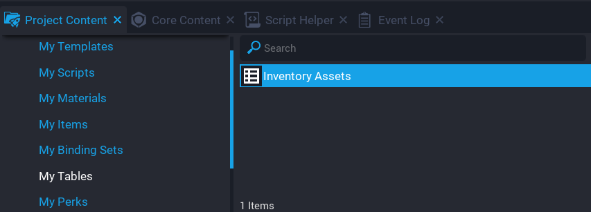
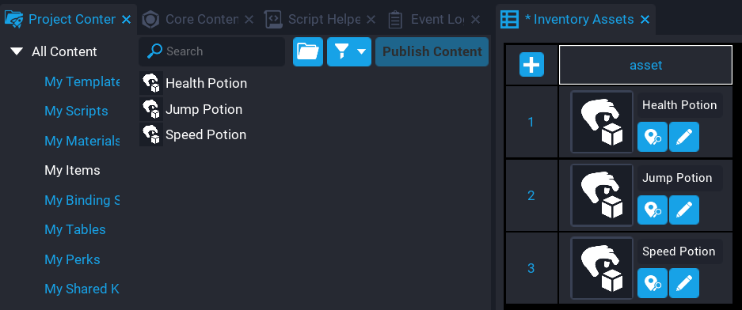
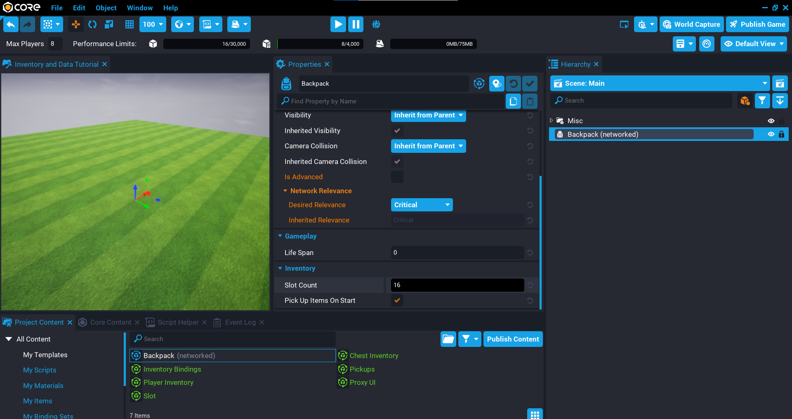
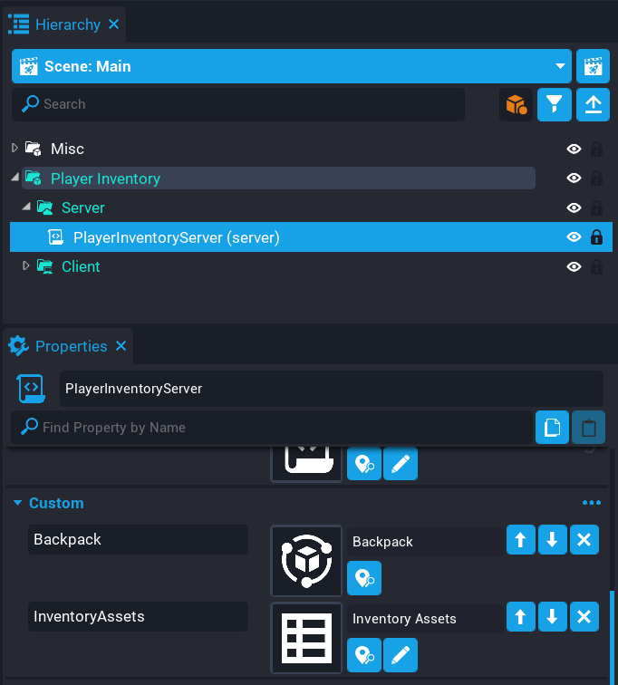
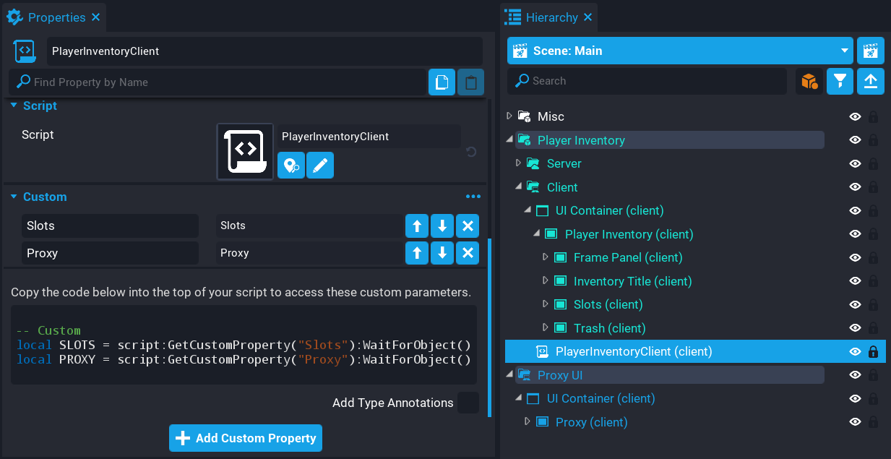
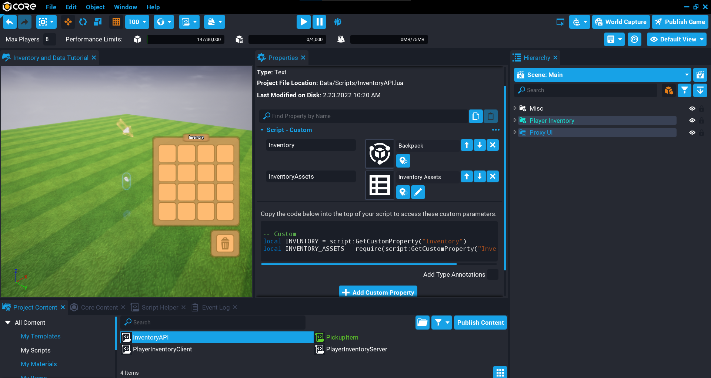
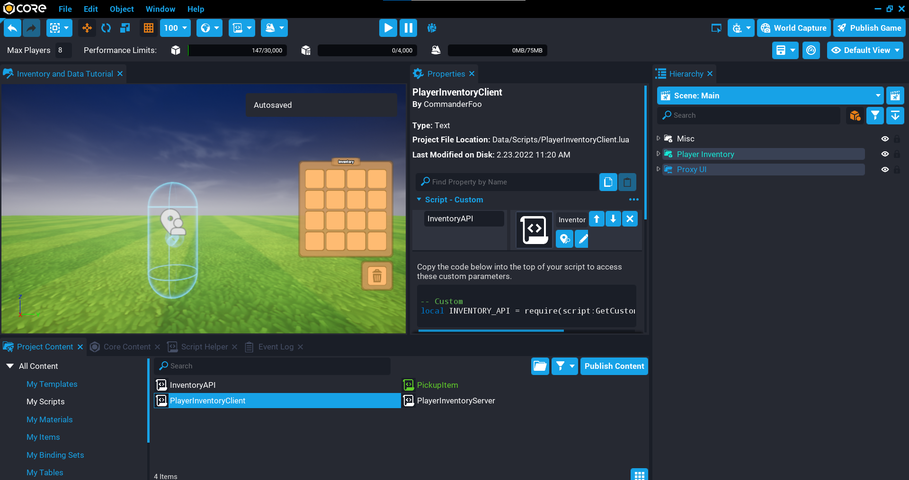
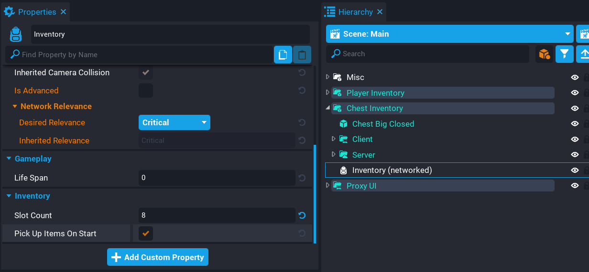
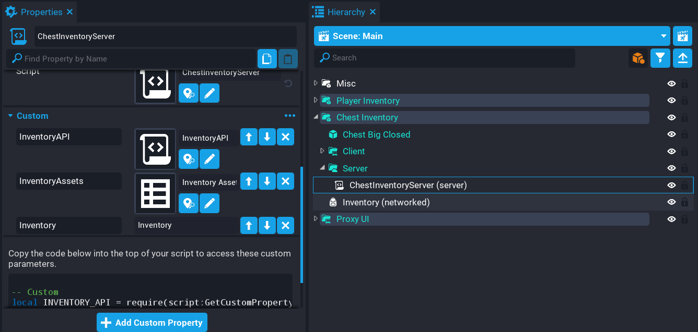

<!-- vale Google.Passive = NO -->
<!-- vale Google.Acronyms = NO -->
<!-- vale Manticore.FirstPerson = NO -->
# Creating Inventories

## Overview

In this tutorial, you will be learning how to create inventories in your game that allows players to store and transfer items between other inventories. You will gain knowledge on how to create inventories and data tables, and learn to use the [Inventory API](../api/inventory.md) to create a system seen in other games that allow players to move items, and persistently save the player's inventory.

<div class="mt-video" style="width:100%">
    <video autoplay muted playsinline controls loop class="center" style="width:100%">
        <source src="/img/Inventory/Tutorial/preview.mp4" type="video/mp4" />
    </video>
</div>

* **Completion Time:** ~2 hours
* **Knowledge Level:** It is recommended to have completed the [Scripting Beginner](lua_basics_helloworld.md) and [Scripting Intermediate](lua_basics_lightbulb.md) tutorials.
* **Skills you will learn:**
    * Creating inventories for players and world objects
    * Creating item assets and item objects
    * Using the Inventory API to move items
    * Using Data Tables to keep track of inventory assets
    * Saving and loading the player's inventory
    * Creating an API
    * Discarding Items

---

## Import Asset from Community Content

You will be importing an asset from **Community Content** that will contain assets to help build up the project. These assets have been designed for ease of use so you can focus on the inventory API and objects.

1. Open the **Community Content** window.
2. Search for `Creating Inventories Tutorial` by **CoreAcademy**.
3. Click **Import**.

{: .center loading="lazy" }

## Create Inventory Item Assets

You will need to create a few item assets which are project-level definitions of items. With an item asset, you can create and manage them in the world or between inventories.

1. In **Project Content** right-click and select **Create Item Asset**.
2. Give the item asset a name (this example will use `Health Potion`).
3. In the **Properties** window, set the **Name** of the item asset to `Health Potion`.
4. Set the **Maximum Stack Size** to `5`.
5. Add a **Core Object Reference** called `Icon`, and select an icon to use for this item.
6. Repeat this process so you have a few item assets that can be used.

{: .center loading="lazy" }

## Create Asset Data Table

You will be creating a Data Table that will have a row for each item asset you have created. This table will have 1 column for now, but in a later section, you will be modifying it.

1. In **Project Content** right-click and select **Create Data Table**.
2. Name the data table `Inventory Assets`.
3. Set the number of rows to how many item assets you have, and columns to 1.

{: .center loading="lazy" }

### Edit Asset Data Table

The item assets you created will be added to the **Inventory Assets** data table.

#### Edit Column

The data table created will only have one column for now, but will need to be edited so that it has a name and a type.

1. From **Project Content** double click on the **Inventory Assets** data table to open it.
2. Edit the single column by clicking on the warning icon.
3. Set the **Column Name** to `asset`.
4. Set the **Column Type** to **Asset Reference**.

{: .center loading="lazy" }

#### Add Rows

Now that the data table has been created and the column set, you can add all the item assets that were created earlier into the table.

1. Open up the **Inventory Assets** data table by double-clicking on it from **Project Content**.
2. In **Project Content** select **My Items** and add them to the data table.

{: .center loading="lazy" }

## Create Player Inventory

In this section, you will be creating the player inventory. You will be adding some templates to the **Hierarchy** and writing some Lua code to handle moving the items around.

### Create Inventory Backpack

Each player that joins the game will have a backpack with a size of 16 slots assigned to them. They will be allowed to view the items in their backpack and drag them around. Because the backpack needs to be created for each player when they join you will need to create a template.

1. In **Core Content** search for `inventory` and add the **Inventory** object to the **Hierarchy**.
2. Rename the **Inventory** to `Backpack`.
3. Set the **Slot Count** to `16` in the **Properties** window.
4. Create a new template from the object in the **Hierarchy**.
5. Delete the **Backpack** from the **Hierarchy**.

{: .center loading="lazy" }

### Add Player Inventory Template

The UI for the player inventory has been created already, this can be customized and more slots can be added if you like. If more slots are created, remember to update the slot count for the backpack.

1. In **Project Content** add the **Player Inventory** template to the **Hierarchy**.
2. **Deinstance** the template.

{: .center loading="lazy" }

### Create PlayerInventoryServer Script

Create a script called `PlayerInventoryServer` and place it inside the **Server** folder under the **Player Inventory** folder. This script will assign a backpack to the player that joined the game by spawning the asset into the world. At the same time, it will add some random items to the inventory.

{: .center loading="lazy" }

#### Add Custom Properties

The **PlayerInventoryServer** needs a reference to the **Backpack** template, and the **Inventory Assets** data table.

1. Add the **Backpack** template as a custom property called `Backpack`.
2. Add the **Inventory Assets** data table as a custom property called `InventoryAssets`.

{: .center loading="lazy" }

#### Edit PlayerInventoryServer Script

Open up the **PlayerInventoryServer** script and add the following code so you have references to the properties. The `players` table will keep track of each player's inventory so it can be removed when they leave the game.

```lua
local BACKPACK = script:GetCustomProperty("Backpack")
local INVENTORY_ASSETS = require(script:GetCustomProperty("InventoryAssets"))

local players = {}
```

##### Create AddRandomItems Function

Create a function called `AddRandomItems`. This function will be called when the player joins the game so random items are added to the inventory. It will loop over the total `slotCount` of the inventory, and pick a random slot for an item to be added.

When adding an item to an inventory, it is recommended to check that it can be added. The function `CanAddItem` will return `true` or `false` depending on if the item can be added to the inventory. The first argument of `CanAddItem` is the item asset that you would like to insert into the inventory. The optional second argument can be a table where you can specify the `count` and the `slot` to check.

If `CanAddItem` returns true, then you can use `AddItem` to add the item to the inventory.

```lua
local function AddRandomItems(inventory)
    for i = 1, inventory.slotCount do
        local slotIndex = math.random(inventory.slotCount)
        local asset = INVENTORY_ASSETS[math.random(#INVENTORY_ASSETS)].asset
        local amount = math.random(1, 10)

        if inventory:CanAddItem(asset, { count = amount, slot = slotIndex }) then
            inventory:AddItem(asset, { count = amount, slot = slotIndex })
        end
    end
end
```

##### Create OnPlayerJoined Function

Create a function called `OnPlayerJoined` that will be called when a player joins the game. This function will spawn a new instance of the `BACKPACK` inventory template. The options second argument of `SpawnAsset` allows you to specify the `networkContext`. This is needed in this case, because the script is in a server context.

When spawning an inventory, it can be assigned to a player using the `assign` function. This will make the inventory be owned by the player. The name of the inventory is also set, but this is optional and is used to see the owner of the inventory in the **Hierarchy** when testing.

All inventories created for players are stored in the `players` table so they can be destroyed later when the player leaves the game.

Calling `AddRandomItems` and passing the `inventory` just created will spawn random items in this player's inventory.

```lua
local function OnPlayerJoined(player)
    local inventory = World.SpawnAsset(BACKPACK, { networkContext = NetworkContextType.NETWORKED })

    inventory:Assign(player)
    inventory.name = player.name

    players[player.id] = inventory

    AddRandomItems(inventory)
end
```

##### Create OnPlayerLeft Function

Create a function called `OnPlayerLeft` that will be called when the player leaves the game. When a player leaves the game, their inventory will be left behind, so it is a good idea to clean it up by destroying it.

```lua
local function OnPlayerLeft(player)
    players[player.id]:Destroy()
    players[player.id] = nil
end
```

##### Create MoveItemHandler Function

Create a function called `MoveItemHandler` that will fetch the player's inventory, and try to move it from one slot index to another slot index by using the `MoveFromSlot` function. It is recommended to always check if the action on an inventory can be done. In this case, a check is done using `CanMoveFromSlot` to make sure the item can be moved.

```lua
local function MoveItemHandler(player, fromSlotIndex, toSlotIndex)
    local inventory = players[player.id]

    if inventory ~= nil then
        if inventory:CanMoveFromSlot(fromSlotIndex, toSlotIndex) then
            inventory:MoveFromSlot(fromSlotIndex, toSlotIndex)
        end
    end
end
```

##### Connect Events

Connect up the events so the `OnPlayerJoined` function is called when the player joins the game, and the `OnPlayerLeft` function is called when the player leaves the game.

When the player moves an item in the UI, a broadcast to the server will be done and connected for the player which will call the `MoveItemHandler` function.

```lua
Game.playerJoinedEvent:Connect(OnPlayerJoined)
Game.playerLeftEvent:Connect(OnPlayerLeft)

Events.ConnectForPlayer("inventory.moveitem", MoveItemHandler)
```

#### The PlayerInventoryServer Script

??? "PlayerInventoryServer"
    ```lua
    local BACKPACK = script:GetCustomProperty("Backpack")
    local INVENTORY_ASSETS = require(script:GetCustomProperty("InventoryAssets"))

    local players = {}

    local function AddRandomItems(inventory)
        for i = 1, inventory.slotCount do
            local slotIndex = math.random(inventory.slotCount)
            local asset = INVENTORY_ASSETS[math.random(#INVENTORY_ASSETS)].asset
            local amount = math.random(1, 10)

            if inventory:CanAddItem(asset, { count = amount, slot = slotIndex }) then
                inventory:AddItem(asset, { count = amount, slot = slotIndex })
            end
        end
    end

    local function OnPlayerJoined(player)
        local inventory = World.SpawnAsset(BACKPACK, { networkContext = NetworkContextType.NETWORKED })

        inventory:Assign(player)
        inventory.name = player.name

        players[player.id] = inventory

        AddRandomItems(inventory)
    end

    local function OnPlayerLeft(player)
        players[player.id]:Destroy()
        players[player.id] = nil
    end

    local function MoveItemHandler(player, fromSlotIndex, toSlotIndex)
        local inventory = players[player.id]

        if inventory ~= nil then
            if inventory:CanMoveFromSlot(fromSlotIndex, toSlotIndex) then
                inventory:MoveFromSlot(fromSlotIndex, toSlotIndex)
            end
        end
    end

    Game.playerJoinedEvent:Connect(OnPlayerJoined)
    Game.playerLeftEvent:Connect(OnPlayerLeft)

    Events.ConnectForPlayer("inventory.moveitem", MoveItemHandler)
    ```

### Add Drag Proxy Template

In **Project Content** find the **Proxy UI** template and add it to your **Hierarchy**. This will be used to represent the item from the inventory when it is moved around on the screen by the player.

The proxy UI should be the lowest item in the **Hierarchy** so icons appear in front of other UI. If there is UI lower down in the hierarchy, then any icon dragged around on the screen by the player will appear behind those UI objects that are lower.

{: .center loading="lazy" }

### Create PlayerInventoryClient Script

Create a new script called `PlayerInventoryClient` and place it into the client folder in the **Hierarchy**. This script will be responsible for updating the UI so the items in the inventory are displayed to the player, and showing the item that is being dragged around on the screen.

#### Add Custom Properties

The script needs to know about the slots in the inventory and the proxy UI.

1. Find the **Slots** UI panel inside the **Player Inventory** panel, and add it as a custom property called `Slots`.
2. Add the **Proxy** UI panel inside the **Proxy UI** folder as a custom property called `Proxy`.

{: .center loading="lazy" }

#### Edit PlayerInventoryClient Script

Open up the **PlayerInventoryClient** script and add the variables for the properties.

```lua
local SLOTS = script:GetCustomProperty("Slots"):WaitForObject()
local PROXY = script:GetCustomProperty("Proxy"):WaitForObject()
```

##### Add Variables

Add the following variables to the script. Some of these variables are to help keep track of what slot is the active slot to handle various conditions with the swapping of items.

```lua
local PROXY_ICON = PROXY:FindChildByName("Icon") -- (1)
local PROXY_COUNT = PROXY_ICON:FindChildByName("Count") -- (2)

local localPlayer = Game.GetLocalPlayer()
local inventory = nil -- (3)
local hasItem = false -- (4)
local activeSlot = nil -- (5)
local activeSlotIcon = nil -- (6)
local activeSlotCount = nil -- (7)
local activeSlotIndex = nil -- (8)
```

1. The child icon of the proxy will be updated when an icon is being moved around and placed.
2. The count value of the item being moved around.
3. The local player's inventory will be set later on.
4. A boolean that will change based on if the player has an item they are moving around.
5. The current active slot the player has clicked on.
6. The current active icon of the active slot.
7. The current active count of the active slot.
8. The current active slot index of the active slot.

##### Set Cursor Visibility

Add the following code so that the player's cursor is visible when they play the game, and they can interact with the UI.

```lua
UI.SetCursorVisible(true)
UI.SetCanCursorInteractWithUI(true)
```

##### Create InventoryChanged Function

Create a function called `InventoryChanged`. This function will be called anytime the player's inventory slots change. This is handy as it allows you to react to those changes to update the UI for the player.

The function has 2 parameters:

1. `inv` is the inventory that has been updated.
2. `slot` is the slot index that has changed.

Using the `GetItem` function of the inventory, you can retrieve the item from a specific slot. This will allow you to find the item in the UI as the slot index will match the order in the hierarchy.

If the item doesn't exist, then the icon in the slot in the inventory can be set to invisible. Otherwise, the icon is updated by getting the custom property **Icon** that was added to the Item Asset created earlier.

```lua
local function InventoryChanged(inv, slot)
    local item = inv:GetItem(slot)
    local childIcon = SLOTS:GetChildren()[slot]:FindChildByName("Icon")
    local childCount = childIcon:FindChildByName("Count")

    if item ~= nil then
        local icon = item:GetCustomProperty("Icon")

        childIcon:SetImage(icon)
        childIcon.visibility = Visibility.FORCE_ON
        childCount.text = tostring(item.count) -- (1)
    else
        childIcon.visibility = Visibility.FORCE_OFF
        childCount.text = ""
    end
end
```

1. Update the text of the slot with the item count in the inventory.

##### Create ClearDraggedItem Function

Created a function called `ClearDraggedItem`. This function will clear the variables at the top of the script by resetting them back to their original values. This function is called when the icon being dragged around has been placed into a slot without an existing item.

```lua
function ClearDraggedItem()
    activeSlot = nil
    activeSlotIcon = nil
    activeSlotCount = nil
    activeSlotIndex = nil
    hasItem = false
end
```

##### Created OnSlotPressed Function

Create a function called `OnSlotPressed`. This function will handle the various conditions when the player moves around items.

There are 3 conditions to be checked:

1. If the player has no existing item, then the slot they click on becomes the active slot, and the item is picked up.
2. If the player clicks on an empty slot with an active item, then the empty slot is updated based on the active item.
3. If the player clicks on an occupied slot with an active item, then it will either swap the items or add to the stack to increase the count.

For the last 2 conditions, a broadcast to the server will be done to update the player's inventory.

```lua
local function OnSlotPressedEvent(button, slot, slotIndex) -- (1)
    local icon = slot:FindChildByName("Icon")
    local isHidden = icon.visibility == Visibility.FORCE_OFF and true or false -- (2)
    local count = icon:FindChildByName("Count")

    -- Has item already.
    if hasItem then

        -- No icon, so this is an empty slot, and dropping it into it.
        if isHidden then
            icon.visibility = Visibility.FORCE_ON
            icon:SetImage(PROXY_ICON:GetImage())
            activeSlot.opacity = 1
            activeSlotIcon.visibility = Visibility.FORCE_OFF
            count.text = activeSlotCount.text
            activeSlotCount.text = "0"

        -- Slot contains existing item
        else
            local tmpImg = icon:GetImage()
            local tmpCount = count.text

            icon:SetImage(activeSlotIcon:GetImage())
            count.text = activeSlotCount.text
            activeSlotIcon:SetImage(tmpImg)
            activeSlotCount.text = tmpCount
            activeSlot.opacity = 1

            tmpCount = nil
            tmpImg = nil
        end

        Events.BroadcastToServer("inventory.moveitem", activeSlotIndex, slotIndex) -- (3)
        ClearDraggedItem() -- (4)
        PROXY.visibility = Visibility.FORCE_OFF

    -- No item, pick up from clicked slot.
    elseif not isHidden then
        PROXY.visibility = Visibility.FORCE_ON
        hasItem = true -- (5)
        PROXY_ICON:SetImage(icon:GetImage())
        PROXY_COUNT.text = tostring(inventory:GetItem(slotIndex).count) -- (6)
        slot.opacity = .6
        activeSlot = slot
        activeSlotIcon = icon
        activeSlotCount = count
        activeSlotIndex = slotIndex
    end
end
```

1. The parameters are:
    - `button` is the button clicked on by the player in the slot.
    - `slot` is the panel that contains everything.
    - `slotIndex` is the index of the child in the slots panel.
2. Check to see if the slot being clicked on contains an icon that is visible or not. This can be used to determine if the slot has an active item in it already.
3. Broadcast to the server to move the items between the `activeSlotIndex` and the current clicked on `slotIndex`.
4. Clear the dragged item as it is no longer needed because the item has been placed into a slot.
5. Set `hasItem` to true so that the proxy icon is moved around on the screen by the player.
6. Update the count of the proxy text to the amount that is in the slot the player clicked on.

##### Create ConnectSlotEvents Function

Create a function called `ConnectSlotEvents`. This function will loop over all the slots in the UI and set up the `pressedEvent` that will listen for when the player clicks on a slot. When clicked on, the `OnSlotPressedEvent` will be called. The `slot` and `index` values are passed into the function to update the active slot and index variables.

```lua
local function ConnectSlotEvents()
    for index, slot in ipairs(SLOTS:GetChildren()) do
        local button = slot:FindChildByName("Button")
        local icon = slot:FindChildByName("Icon")

        if(button ~= nil and icon ~= nil and button.isInteractable) then
            button.pressedEvent:Connect(OnSlotPressedEvent, slot, index)
        end
    end
end
```

##### Wait for Player's Inventory

Because the player's inventory is created when they join the game, there is a chance that it may not have initialized for the player. Using the code below, you can check if `inventory` is `nil`, and if so, wait. The `GetInventories` function returns a list of all the inventories the player will have. Since we know the player will only have one inventory, then we can directly access the inventory at index 1.

If you decide to support multiple inventories for each player, then it would be recommended to name your inventories and loop over them to find the one you need to modify.

```lua
while inventory == nil do
    inventory = localPlayer:GetInventories()[1]
    Task.Wait()
end
```

##### Update Inventory UI

When the player joins the game, they may already have items in their inventory and the `changedEvent` may not have connected in time to receive the inventory data. By looping over all the items in the inventory using `GetItems`, you can do a manual update of the inventory by calling the function `InventoryChanged`.

```lua
for i, item in pairs(inventory:GetItems()) do
    InventoryChanged(inventory, i)
end
```

##### Create Tick Function

Create a function called `Tick` that will handle moving the proxy around on the screen if the player has an item. The `SetAbsolutePosition` sets the absolute screen position of the pivot for the proxy UI panel. This function reduces the complexity of needing to find the absolute position of a UI element.

```lua
function Tick()
    if hasItem then
        PROXY:SetAbsolutePosition(UI.GetCursorPosition())
    end
end
```

##### Connect Changed Event

Inventories have a `changedEvent` that is fired when the contents of a slot have changed. This is useful as it allows you to respond to these changes so the UI can be updated for the player.

```lua
inventory.changedEvent:Connect(InventoryChanged)
```

##### Call Connect Slots Function

Call the `ConnectSlotEvents` to connect up the events for the slots in the UI.

```lua
ConnectSlotEvents()
```

#### The PlayerInventoryClient Script

??? "PlayerInventoryClient"
    ```lua
    local SLOTS = script:GetCustomProperty("Slots"):WaitForObject()
    local PROXY = script:GetCustomProperty("Proxy"):WaitForObject()

    local PROXY_ICON = PROXY:FindChildByName("Icon")
    local PROXY_COUNT = PROXY_ICON:FindChildByName("Count")

    local localPlayer = Game.GetLocalPlayer()
    local inventory = nil
    local hasItem = false
    local activeSlot = nil
    local activeSlotIcon = nil
    local activeSlotCount = nil
    local activeSlotIndex = nil

    UI.SetCursorVisible(true)
    UI.SetCanCursorInteractWithUI(true)

    local function InventoryChanged(inv, slot)
        local item = inv:GetItem(slot)
        local childIcon = SLOTS:GetChildren()[slot]:FindChildByName("Icon")
        local childCount = childIcon:FindChildByName("Count")

        if item ~= nil then
            local icon = item:GetCustomProperty("Icon")

            childIcon:SetImage(icon)
            childIcon.visibility = Visibility.FORCE_ON
            childCount.text = tostring(item.count)
        else
            childIcon.visibility = Visibility.FORCE_OFF
            childCount.text = ""
        end
    end

    function ClearDraggedItem()
        activeSlot = nil
        activeSlotIcon = nil
        activeSlotCount = nil
        activeSlotIndex = nil
        hasItem = false
    end

    local function OnSlotPressedEvent(button, slot, slotIndex)
        local icon = slot:FindChildByName("Icon")
        local isHidden = icon.visibility == Visibility.FORCE_OFF and true or false
        local count = icon:FindChildByName("Count")

        -- Has item already.
        if hasItem then

            -- No icon, so this is an empty slot, and dropping it into it.
            if isHidden then
                icon.visibility = Visibility.FORCE_ON
                icon:SetImage(PROXY_ICON:GetImage())
                activeSlot.opacity = 1
                activeSlotIcon.visibility = Visibility.FORCE_OFF
                count.text = activeSlotCount.text
                activeSlotCount.text = "0"

            -- Slot contains existing item
            else
                local tmpImg = icon:GetImage()
                local tmpCount = count.text

                icon:SetImage(activeSlotIcon:GetImage())
                count.text = activeSlotCount.text
                activeSlotIcon:SetImage(tmpImg)
                activeSlotCount.text = tmpCount
                activeSlot.opacity = 1

                tmpCount = nil
                tmpImg = nil
            end

            Events.BroadcastToServer("inventory.moveitem", activeSlotIndex, slotIndex)
            ClearDraggedItem()
            PROXY.visibility = Visibility.FORCE_OFF

        -- No item, pick up from clicked slot.
        elseif not isHidden then
            PROXY.visibility = Visibility.FORCE_ON
            hasItem = true
            PROXY_ICON:SetImage(icon:GetImage())
            PROXY_COUNT.text = tostring(inventory:GetItem(slotIndex).count)
            slot.opacity = .6
            activeSlot = slot
            activeSlotIcon = icon
            activeSlotCount = count
            activeSlotIndex = slotIndex
        end
    end

    local function ConnectSlotEvents()
        for index, slot in ipairs(SLOTS:GetChildren()) do
            local button = slot:FindChildByName("Button")
            local icon = slot:FindChildByName("Icon")

            if(button ~= nil and icon ~= nil and button.isInteractable) then
                button.pressedEvent:Connect(OnSlotPressedEvent, slot, index)
            end
        end
    end

    while inventory == nil do
        inventory = localPlayer:GetInventories()[1]
        Task.Wait()
    end

    for i, item in pairs(inventory:GetItems()) do
        InventoryChanged(inventory, i)
    end

    function Tick()
        if hasItem then
            PROXY:SetAbsolutePosition(UI.GetCursorPosition())
        end
    end

    inventory.changedEvent:Connect(InventoryChanged)

    ConnectSlotEvents()
    ```

#### Test the Game

Test the game to make sure the following work:

- Player receives an inventory when joining the game.
- Random items are added to the player's inventory.

<div class="mt-video" style="width:100%">
    <video autoplay muted playsinline controls loop class="center" style="width:100%">
        <source src="/img/Inventory/Tutorial/add_random_items.mp4" type="video/mp4" />
    </video>
</div>

### Saving and Loading Inventory

At the moment every time the player joins the game they are given random items in their inventory. In this section, you will be creating some functions that will save the player's inventory when they leave the game and load the player's inventory when they join the game.

!!! info "Enable Player Storage"
    Player storage will need to be enabled so you can use the Storage API to save data for the player. This can be found in the properties window when clicking on the **Game Settings** object in the **Hierarchy**.

#### Edit Data Table

The data table for the inventory assets will have a new column added that will hold the unique key for each item that will be used when saving the data to storage. A key is used because it is smaller than using the item asset id, meaning you can store more things in player storage.

Open up the **Inventory Assets** data table by finding it in **Project Content** under **My Tables**. Double click on the table to open it up for editing.

1. Add a new column called `key`.
2. Set the column type to `string`.
3. Go through each row and set the value of the key to a small string.

{: .center loading="lazy" }

#### Edit PlayerInventoryServer Script

Open up the **PlayerInventoryServer** script. You will need to modify this script to add support for loading and saving.

##### Create FindLookupItemByKey Function

Create a function called `FindLookupItemByKey`. This is a helper function that will take in a `key` that will be compared against the **key** column in the data table. If a key matches, then the row from the data table is returned.

```lua
function FindLookupItemByKey(key)
    for i, dataItem in pairs(INVENTORY_ASSETS) do
        if key == dataItem.key then
            return dataItem
        end
    end
end
```

##### Create FindLookupItemByAssetId Function

Create a function called `FindLookupItemByAssetId`. This is a helper function that will take in an `item` that will be compared against the `asset` column in the data table. If the `itemAssetId` matches the first part of the `asset`, then the row from the data table is returned.

```lua
function FindLookupItemByAssetId(item)
    for i, dataItem in pairs(INVENTORY_ASSETS) do
        local id = CoreString.Split(dataItem.asset, ":") -- (1)

        if id == item.itemAssetId then
            return dataItem
        end
    end
end
```

1. Split the asset string so you only get the asset id.

##### Create SavePlayerInventory Function

Create a function called `SavePlayerInventory`. This function will be called when the player leaves the game. It will create a table called `inv` and store all the items in the player's inventory in the table.

The loop in the function will loop iterate based on the total slots in the inventory. The reason `slotCount` is used, is that the order and slot position of each item will be retained.

Each slot item is added to the `inv` table that contains the key and count for that item.

!!! warning "Inventory Slot Count"
    The **SavePlayerInventory** function is looping over the `slotCount` of an inventory. For this tutorial it was set to `16`, however, beware that if you leave the **Slot Count** property of an inventory at `0`, then the loop will take some time to complete and will lock up the game while it is looping through all the slots.

```lua
function SavePlayerInventory(player)
    local data = Storage.GetPlayerData(player)

    data.inv = {} -- (1)

    for i = 1, players[player.id].slotCount do -- (2)
        local item = players[player.id]:GetItem(i) -- (3)
        local entry = {}

        if item then
            local lookupItem = FindLookupItemByAssetId(item) -- (4)

            if lookupItem ~= nil then
                entry = { lookupItem.key, item.count } -- (5)
            end
        end

        table.insert(data.inv, entry)
    end

    Storage.SetPlayerData(player, data)
end
```

1. Create an empty table for the inventory data.
2. Loop over the total slots in this inventory, empty or not.
3. Get the item that is in this slot.
4. Fetch the item that matches the `assetItemId` from the data table.
5. Create a new entry table with the key and item count.

##### Create LoadPlayerInventory Function

Create a function called `LoadPlayerInventory`. This function will load the player's inventory items from player storage and add them to that player's inventory at specific slot indexes.

When adding items to an inventory, it is recommended to check the item can be added by using the `CanAddItem` function. This function takes in an item asset id and an optional table with the count and slot index set. If the function returns true, then calling `AddItem` on the inventory will add that specific item.

If the player has an empty inventory, then `AddRandomItems` is called while passing in the player's inventory. This is for testing to make sure there are items in the inventory to move around.

```lua
function LoadPlayerInventory(player)
    local data = Storage.GetPlayerData(player)

    if data.inv ~= nil then
        for i, entry in ipairs(data.inv) do
            local item = FindLookupItemByKey(entry[1])

            if item ~= nil and players[player.id]:CanAddItem(item.asset, { count = entry[2], slot = i }) then
                players[player.id]:AddItem(item.asset, { count = entry[2], slot = i })
            end
        end
    else
        AddRandomItems(players[player.id])
    end
end
```

##### Edit OnPlayerJoined Function

Edit the `OnPlayerJoined` function so that a call to load the player's inventory is done.

```lua hl_lines="8"
local function OnPlayerJoined(player)
    local inventory = World.SpawnAsset(BACKPACK, { networkContext = NetworkContextType.NETWORKED })

    inventory:Assign(player)
    inventory.name = player.name

    players[player.id] = inventory
    LoadPlayerInventory(player)
end
```

##### Edit OnPlayerLeft Function

Edit the `OnPlayerLeft` function so that when the player leaves, the `SavePlayerInventory` function is called. This will then save all the items in the player's inventory to their storage.

```lua
local function OnPlayerLeft(player)
    SavePlayerInventory(player)
    players[player.id]:Destroy()
    players[player.id] = nil
end
```

#### The PlayerInventoryServer Script

??? "PlayerInventoryServer"
    ```lua
    local BACKPACK = script:GetCustomProperty("Backpack")
    local INVENTORY_ASSETS = require(script:GetCustomProperty("InventoryAssets"))

    local players = {}

    local function AddRandomItems(inventory)
        for i = 1, inventory.slotCount do
            local slotIndex = math.random(inventory.slotCount)
            local asset = INVENTORY_ASSETS[math.random(#INVENTORY_ASSETS)].asset
            local amount = math.random(1, 10)

            if inventory:CanAddItem(asset, { count = amount, slot = slotIndex }) then
                inventory:AddItem(asset, { count = amount, slot = slotIndex })
            end
        end
    end

    function FindLookupItemByKey(key)
        for i, dataItem in pairs(INVENTORY_ASSETS) do
            if key == dataItem.key then
                return dataItem
            end
        end
    end

    function FindLookupItemByAssetId(item)
        for i, dataItem in pairs(INVENTORY_ASSETS) do
            local id = CoreString.Split(dataItem.asset, ":")

            if id == item.itemAssetId then
                return dataItem
            end
        end
    end

    function SavePlayerInventory(player)
        local data = Storage.GetPlayerData(player)

        data.inv = {}

        for i = 1, players[player.id].slotCount do
            local item = players[player.id]:GetItem(i)
            local entry = {}

            if item then
                local lookupItem = FindLookupItemByAssetId(item)

                if lookupItem ~= nil then
                    entry = { lookupItem.key, item.count }
                end
            end

            table.insert(data.inv, entry)
        end

        Storage.SetPlayerData(player, data)
    end

    function LoadPlayerInventory(player)
        local data = Storage.GetPlayerData(player)

        if data.inv ~= nil then
            for i, entry in ipairs(data.inv) do
                local item = FindLookupItemByKey(entry[1])

                if item ~= nil and players[player.id]:CanAddItem(item.asset, { count = entry[2], slot = i }) then
                    players[player.id]:AddItem(item.asset, { count = entry[2], slot = i })
                end
            end
        else
            AddRandomItems(players[player.id])
        end
    end

    local function OnPlayerJoined(player)
        local inventory = World.SpawnAsset(BACKPACK, { networkContext = NetworkContextType.NETWORKED })

        inventory:Assign(player)
        inventory.name = player.name

        players[player.id] = inventory
        LoadPlayerInventory(player)
    end

    local function OnPlayerLeft(player)
        SavePlayerInventory(player)
        players[player.id]:Destroy()
        players[player.id] = nil
    end

    local function MoveItemHandler(player, fromSlotIndex, toSlotIndex)
        local inventory = players[player.id]

        if inventory ~= nil then
            if inventory:CanMoveFromSlot(fromSlotIndex, toSlotIndex) then
                inventory:MoveFromSlot(fromSlotIndex, toSlotIndex)
            end
        end
    end

    Game.playerJoinedEvent:Connect(OnPlayerJoined)
    Game.playerLeftEvent:Connect(OnPlayerLeft)

    Events.ConnectForPlayer("inventory.moveitem", MoveItemHandler)
    ```

#### Test the Game

Test the game and make sure the following work:

1. Items are saved and loaded when joining and leaving the game.
2. The position of items in the inventory is remembered when loading.

<div class="mt-video" style="width:100%">
    <video autoplay muted playsinline controls loop class="center" style="width:100%">
        <source src="/img/Inventory/Tutorial/save_load.mp4" type="video/mp4" />
    </video>
</div>

### Summary

At this point in the tutorial, you have learned to create an inventory, assign it to the player, save the player's items, and allow the player to move items around. This is a good stopping point to get a basic inventory implemented in your game.

---

## Creating an API

At the moment the code is not organized in a way that makes it easy to reuse. If you were to add an in-world inventory that players can open to take loot out of, then this would require duplicating a lot of the existing code each time.

An API (Application Programming Interface) will contain the bulk of the code that would usually be duplicated across files. This allows you to have a set of functions that are shared between your scripts.

You will create the API first, and then you will need to modify existing scripts to use the API.

Create a new script called `InventoryAPI`. This script will not be added to the **Hierarchy**, it will be required into a script using the `require` function.

### Add Custom Properties

The API will need references to the inventory template, and the inventory asset data table.

1. In **Project Content** select the **InventoryAPI** and then drag the **Backpack** template onto the script as a custom property. Name the custom property `Inventory`.
2. Add the **Inventory Assets** data table as a custom property, and name the custom property `InventoryAssets`.

{: .center loading="lazy" }

### Edit InventoryAPI Script

Open up the **InventoryAPI** script and create the references to the properties that will be used in the API.

```lua
local ASSETS = require(script:GetCustomProperty("InventoryAssets"))
local INVENTORY = script:GetCustomProperty("Inventory")
```

#### Create Variables and Properties

Create the following variables. The `API` variable is a table that will hold all the properties and functions for this API that will be accessible to other scripts when the API is required.

The API will keep track of player-created inventories in the `PLAYERS` table, this is because player inventories need to be destroyed when they leave the game.

The `INVENTORIES` variable is a table that will hold a reference to all inventories that are registered with the API. These are tracked so players can move items between different inventories. For example, move an item from their inventory to a chest in the world.

The `ACTIVE` variable is a table that contains various properties to keep track of certain objects when the player clicks a slot.

```lua
local API = {}

API.PLAYERS = {}
API.INVENTORIES = {}
API.ACTIVE = {

    slot = nil, -- (1)
    slotIcon = nil, -- (2)
    slotCount = nil, -- (3)
    slotIndex = nil, -- (4)
    inventory = nil, -- (5)
    hasItem = false -- (6)

}
```

1. The slot the player has clicked on in the inventory UI.
2. The slot icon object of the slot clicked.
3. The slot count object of the slot clicked.
4. The slot index of the slot in the UI.
5. The inventory that the slot belongs to.
6. Updates based on if the player is moving an item around or not.

#### Server Functions

You will first create all the functions that will be used on the server. This is a good way to organize the code of the API.

Prefix all functions with `API` so they are added to the `API` table.

##### Create RegisterInventory Function

Create a function called `RegisterInventory`. This function will be used to add an inventory to the `INVENTORIES` table for quick access later on.

```lua
function API.RegisterInventory(inventory)
    API.INVENTORIES[inventory.id] = inventory
end
```

##### Create CreatePlayerInventory Function

Create a function called `CreatePlayerInventory`. This function is used to create a player's inventory. It will spawn the `INVENTORY` template into the world, assign it to the player.

Each inventory that is created for a player is added to the `PLAYERS` table to keep track of it for later use. The inventory is also registered to the `INVENTORY` table by calling `RegisterInventory` and passing the `inventory` to be registered.

```lua
function API.CreatePlayerInventory(player)
    local inventory = World.SpawnAsset(INVENTORY, { networkContext = NetworkContextType.NETWORKED })

    inventory:Assign(player)
    inventory.name = player.name

    API.PLAYERS[player.id] = inventory
    API.RegisterInventory(inventory)
end
```

##### Create LoadPlayerInventory Function

Create a function called `LoadPlayerInventory`. This function is very similar to what you created in the `PlayerInventoryServer` script, the difference is the table `PLAYERS` is used instead.

The player's inventory can be accessed by passing the player's id as the key to the `PLAYERS` table.

```lua
function API.LoadPlayerInventory(player)
    local data = Storage.GetPlayerData(player)

    if data.inv ~= nil then
        for i, entry in ipairs(data.inv) do
            local item = API.FindLookupItemByKey(entry[1])

            if item ~= nil and API.PLAYERS[player.id]:CanAddItem(item.asset, { count = entry[2], slot = i }) then
                API.PLAYERS[player.id]:AddItem(item.asset, { count = entry[2], slot = i })
            end
        end
    end
end
```

##### Create SavePlayerInventory Function

Create a function called `SavePlayerInventory`. This function is very similar to the `SavePlayerInventory` function in the `PlayerInventoryServer` script. The difference is that the `inventory` variable has been replaced with the `PLAYERS` table.

The player's inventory can be accessed by passing the player's id as the key to the `PLAYERS` table.

```lua
function API.SavePlayerInventory(player)
    local data = Storage.GetPlayerData(player)

    data.inv = {}

    for i = 1, API.PLAYERS[player.id].slotCount do
        local item = API.PLAYERS[player.id]:GetItem(i)
        local entry = {}

        if item then
            local lookupItem = API.FindLookupItemByAssetId(item)

            if lookupItem ~= nil then
                entry = { lookupItem.key, item.count }
            end
        end

        table.insert(data.inv, entry)
    end

    Storage.SetPlayerData(player, data)
end
```

##### Create RemovePlayerInventory Function

Create a function called `RemovePlayerInventory`. This function will remove the entry from the `INVENTORIES` table, and also destroy the player's inventory from the `PLAYERS` table. You could ignore destroying a player's inventory and have it drop in the world as an object that other players could scavenge from.

```lua
function API.RemovePlayerInventory(player)
    API.INVENTORIES[API.PLAYERS[player.id].id] = nil
    API.PLAYERS[player.id]:Destroy()
    API.PLAYERS[player.id] = nil
end
```

##### Create MoveItemHandler Function

Create a function called `MoveItemHandler`. This function will need to do more checks compared to the function created in the `PlayerInventoryServer` script. It needs to support moving items between different inventories.

The parameters of the function will receive the inventory the item is being moved from, and where it is being moved to. The `fromSlotIndex` and `toSlotIndex` will allow you to remove or swap the item from one inventory to another inventory.

Each inventory can be pulled from the `INVENTORIES` table which will allow for each transfer between different inventories (including player to player).

When doing any inventory action, always check if the action can be done. A lot of the inventory API functions will have a `Can` version of it, which is used to check if something can be done.

The function below contains annotations that explain important parts of it. It tries to cover most edge cases to handle swapping, count stacking, cross inventory swapping, and more.

```lua
function API.MoveItemHandler(fromInventoryId, toInventoryId, fromSlotIndex, toSlotIndex)
    local fromInventory = API.INVENTORIES[fromInventoryId]
    local toInventory = API.INVENTORIES[toInventoryId]

    if fromInventory ~= nil and toInventory ~= nil then -- (1)
        if fromInventory == toInventory then -- (2)
            if fromInventory:CanMoveFromSlot(fromSlotIndex, toSlotIndex) then -- (3)
                fromInventory:MoveFromSlot(fromSlotIndex, toSlotIndex) -- (4)
            end
        else
            local fromItem = fromInventory:GetItem(fromSlotIndex) -- (5)
            local toItem = toInventory:GetItem(toSlotIndex) -- (6)

            local fromItemAssetId = fromItem.itemAssetId
            local fromItemCount = fromItem.count

            if toItem ~= nil then
                local toItemAssetId = toItem.itemAssetId
                local toItemCount = toItem.count
                local skipFromItem = false

                if toItemAssetId == fromItemAssetId then -- (7)
                    local total = toItemCount + fromItemCount

                    if total > toItem.maximumStackCount then
                        if toItemCount == toItem.maximumStackCount then
                            toItemCount = toItem.maximumStackCount
                            fromItemCount = total - toItem.maximumStackCount
                        else
                            toItemCount = total - toItem.maximumStackCount
                            fromItemCount = toItem.maximumStackCount
                        end
                    else
                        skipFromItem = true
                        fromItemCount = total
                    end
                end

                fromInventory:RemoveFromSlot(fromSlotIndex) -- (8)
                toInventory:RemoveFromSlot(toSlotIndex) -- (9)

                if not skipFromItem then -- (10)
                    fromInventory:AddItem(toItemAssetId, { count = toItemCount, slot = fromSlotIndex })
                end
            else
                fromInventory:RemoveFromSlot(fromSlotIndex)
            end

            toInventory:AddItem(fromItemAssetId, { count = fromItemCount, slot = toSlotIndex }) -- (11)
        end
    end
end
```

1. Check if both inventories exist. These variables can be the same inventory if it is an item being moved to a different slot in the same inventory.
2. Check if they are both the same.
3. Check if the item can be moved to the `toSlotIndex` place.
4. Swap the items in the slots by using the `MoveFromSlot` function.
5. Get the item that is in the inventory slot where it is coming from.
6. Get the item that is in the inventory slot where it is going too.
7. If the item asset id is the same, then a simple count change can be done on the stacks.
8. Remove the item from the inventory coming from.
9. Remove the item from the inventory going too.
10. If the item clicked on is already at the max stack count, then skip adding the item.
11. Add the item to the inventory where it is going too.

##### Create RemoveItemHandler Function

Create a function called `RemoveItemHandler`. This function will be used later to remove an item from an inventory. This is useful when players need a way to throw away items they no longer need. A discard slot will be used that allows the player to drop an item onto that slot to discard it.

```lua
function API.RemoveItemHandler(inventoryId, slotIndex)
    local inventory = API.INVENTORIES[inventoryId]

    if inventory ~= nil then
        if inventory:CanRemoveFromSlot(slotIndex) then
            inventory:RemoveFromSlot(slotIndex)
        end
    end
end
```

#### Create Client Functions

The client functions that will be used by scripts in a client context.

##### Create ClearDraggedItem Function

Create a function called `ClearDraggedItem`. This is a helper function that will clear out all information from the `ACTIVE` table. For example, this would be called when an item has been placed in a slot by the player.

```lua
function API.ClearDraggedItem()
    API.ACTIVE.slot = nil
    API.ACTIVE.slotIcon = nil
    API.ACTIVE.slotCount = nil
    API.ACTIVE.slotIndex = nil
    API.ACTIVE.inventory = nil
    API.ACTIVE.hasItem = false
end
```

##### Create SetDragProxy Function

Create a function called `SetDragProxy`. This function will be used to set the proxy for when the player moves an item around on the screen.

```lua
function API.SetDragProxy(proxy)
    API.PROXY = proxy
    API.PROXY_ICON = proxy:FindChildByName("Icon")
    API.PROXY_COUNT = API.PROXY_ICON:FindChildByName("Count")
end
```

##### Create EnableCursor Function

Create a function called `EnableCursor`. To use the inventories, the player needs to be able to use their mouse cursor to interact with the inventory UI. This function will make the cursor visible and enable UI interaction.

```lua
function API.EnableCursor()
    UI.SetCanCursorInteractWithUI(true)
    UI.SetCursorVisible(true)
end
```

##### Create DisableCursor Function

Create a function called `DisableCursor`. This will hide the cursor for the UI and turn of UI interaction.

```lua
function API.DisableCursor()
    UI.SetCanCursorInteractWithUI(false)
    UI.SetCursorVisible(false)
end
```

##### Create OnSlotPressedEvent Function

Create a function called `OnSlotPressedEvent`. This function will handle updating the proxy icon and the slot that was clicked on. It will check to see if a slot already has an item, and if so, pick it up. Otherwise, it will be ignored. If the player has an item already, then it will also check to see if it should stack or swap. This has a minor element of client prediction to it so that it feels responsive to the player. The inventory would update automatically when the `changedEvent` is fired, but it would not feel as responsive.

When an item is placed into a slot, a broadcast to the server is done which will handle the actual inventory changes.

```lua
function API.OnSlotPressedEvent(button, inventory, slot, slotIndex)
    local icon = slot:FindChildByName("Icon")
    local isHidden = icon.visibility == Visibility.FORCE_OFF and true or false
    local count = icon:FindChildByName("Count")

    -- Has item already.
    if API.ACTIVE.hasItem then

        -- No icon, so this is an empty slot, and dropping it into it.
        if isHidden then
            icon.visibility = Visibility.FORCE_ON
            icon:SetImage(API.PROXY_ICON:GetImage())
            API.ACTIVE.slot.opacity = 1
            API.ACTIVE.slotIcon.visibility = Visibility.FORCE_OFF
            count.text = API.ACTIVE.slotCount.text
            API.ACTIVE.slotCount.text = "0"

        -- Slot contains existing item
        else
            local tmpImg = icon:GetImage()
            local tmpCount = count.text

            icon:SetImage(API.ACTIVE.slotIcon:GetImage())
            count.text = API.ACTIVE.slotCount.text
            API.ACTIVE.slotIcon:SetImage(tmpImg)
            API.ACTIVE.slotCount.text = tmpCount
            API.ACTIVE.slot.opacity = 1

            tmpCount = nil
            tmpImg = nil
        end

        Events.BroadcastToServer("inventory.moveitem", API.ACTIVE.inventory.id, inventory.id, API.ACTIVE.slotIndex, slotIndex)

        API.ClearDraggedItem()
        API.PROXY.visibility = Visibility.FORCE_OFF

    -- No item, pick up from clicked slot.
    elseif not isHidden then
        API.PROXY.visibility = Visibility.FORCE_ON
        API.ACTIVE.hasItem = true
        API.PROXY_ICON:SetImage(icon:GetImage())
        API.PROXY_COUNT.text = tostring(inventory:GetItem(slotIndex).count)
        slot.opacity = .6
        API.ACTIVE.slot = slot
        API.ACTIVE.slotIcon = icon
        API.ACTIVE.slotCount = count
        API.ACTIVE.slotIndex = slotIndex
        API.ACTIVE.inventory = inventory
    end
end
```

#### Create Shared Functions

The shared functions will be helper functions that are used by the server and client functions.

##### Create FindLookupItemByKey Function

Create a function called `FindLookupItemByKey`. This is a helper function that will take in a `key` that will be compared against the **key** column in the data table. If a key matches, then the row from the data table is returned.

```lua
function API.FindLookupItemByKey(key)
    for i, dataItem in pairs(ASSETS) do
        if key == dataItem.key then
            return dataItem
        end
    end
end
```

##### Create FindLookupItemByAssetId Function

Create a function called `FindLookupItemByAssetId`. This is a helper function that will take in an `item` that will be compared against the `asset` column in the data table. If the `itemAssetId` matches the first part of the `asset`, then the row from the data table is returned.

```lua
function API.FindLookupItemByAssetId(item)
    for i, dataItem in pairs(ASSETS) do
        local id = CoreString.Split(dataItem.asset, ":")

        if id == item.itemAssetId then
            return dataItem
        end
    end
end
```

#### Connect Events

Connect up the event that will be received from the client. Because the API can be required into any script, it is good to use the `Environment` namespace to check if the environment the script is running in is the server by calling the `IsServer` function.

```lua
if Environment.IsServer() then
    Events.Connect("inventory.moveitem", API.MoveItemHandler)
end
```

#### Return the API

The API table needs to be returned so that scripts that require it can use the properties and functions inside the API.

```lua
return API
```

#### The InventoryAPI Script

??? "InventoryAPI"
    ```lua
    local ASSETS = require(script:GetCustomProperty("InventoryAssets"))
    local INVENTORY = script:GetCustomProperty("Inventory")

    local API = {}

    API.PLAYERS = {}
    API.INVENTORIES = {}
    API.ACTIVE = {

        slot = nil,
        slotIcon = nil,
        slotCount = nil,
        slotIndex = nil,
        inventory = nil,
        hasItem = false

    }

    -- Server

    function API.RegisterInventory(inventory)
        API.INVENTORIES[inventory.id] = inventory
    end

    function API.CreatePlayerInventory(player)
        local inventory = World.SpawnAsset(INVENTORY, { networkContext = NetworkContextType.NETWORKED })

        inventory:Assign(player)
        inventory.name = player.name

        API.PLAYERS[player.id] = inventory
        API.RegisterInventory(inventory)
    end

    function API.LoadPlayerInventory(player)
        local data = Storage.GetPlayerData(player)

        if data.inv ~= nil then
            for i, entry in ipairs(data.inv) do
                local item = API.FindLookupItemByKey(entry[1])

                if item ~= nil and API.PLAYERS[player.id]:CanAddItem(item.asset, { count = entry[2], slot = i }) then
                    API.PLAYERS[player.id]:AddItem(item.asset, { count = entry[2], slot = i })
                end
            end
        end
    end

    function API.SavePlayerInventory(player)
        local data = Storage.GetPlayerData(player)

        data.inv = {}

        for i = 1, API.PLAYERS[player.id].slotCount do
            local item = API.PLAYERS[player.id]:GetItem(i)
            local entry = {}

            if item then
                local lookupItem = API.FindLookupItemByAssetId(item)

                if lookupItem ~= nil then
                    entry = { lookupItem.key, item.count }
                end
            end

            table.insert(data.inv, entry)
        end

        Storage.SetPlayerData(player, data)
    end

    function API.RemovePlayerInventory(player)
        API.INVENTORIES[API.PLAYERS[player.id].id] = nil
        API.PLAYERS[player.id]:Destroy()
        API.PLAYERS[player.id] = nil
    end

    function API.MoveItemHandler(fromInventoryId, toInventoryId, fromSlotIndex, toSlotIndex)
        local fromInventory = API.INVENTORIES[fromInventoryId]
        local toInventory = API.INVENTORIES[toInventoryId]

        if fromInventory ~= nil and toInventory ~= nil then
            if fromInventory == toInventory then
                if fromInventory:CanMoveFromSlot(fromSlotIndex, toSlotIndex) then
                    fromInventory:MoveFromSlot(fromSlotIndex, toSlotIndex)
                end
            else
                local fromItem = fromInventory:GetItem(fromSlotIndex)
                local toItem = toInventory:GetItem(toSlotIndex)

                local fromItemAssetId = fromItem.itemAssetId
                local fromItemCount = fromItem.count

                if toItem ~= nil then
                    local toItemAssetId = toItem.itemAssetId
                    local toItemCount = toItem.count
                    local skipFromItem = false

                    if toItemAssetId == fromItemAssetId then
                        local total = toItemCount + fromItemCount

                        if total > toItem.maximumStackCount then
                            if toItemCount == toItem.maximumStackCount then
                                toItemCount = toItem.maximumStackCount
                                fromItemCount = total - toItem.maximumStackCount
                            else
                                toItemCount = total - toItem.maximumStackCount
                                fromItemCount = toItem.maximumStackCount
                            end
                        else
                            skipFromItem = true
                            fromItemCount = total
                        end
                    end

                    fromInventory:RemoveFromSlot(fromSlotIndex)
                    toInventory:RemoveFromSlot(toSlotIndex)

                    if not skipFromItem then
                        fromInventory:AddItem(toItemAssetId, { count = toItemCount, slot = fromSlotIndex })
                    end
                else
                    fromInventory:RemoveFromSlot(fromSlotIndex)
                end

                toInventory:AddItem(fromItemAssetId, { count = fromItemCount, slot = toSlotIndex })
            end
        end
    end

    function API.RemoveItemHandler(inventoryId, slotIndex)
        local inventory = API.INVENTORIES[inventoryId]

        if inventory ~= nil then
            if inventory:CanRemoveFromSlot(slotIndex) then
                inventory:RemoveFromSlot(slotIndex)
            end
        end
    end

    -- Client

    function API.ClearDraggedItem()
        API.ACTIVE.slot = nil
        API.ACTIVE.slotIcon = nil
        API.ACTIVE.slotCount = nil
        API.ACTIVE.slotIndex = nil
        API.ACTIVE.inventory = nil
        API.ACTIVE.hasItem = false
    end

    function API.SetDragProxy(proxy)
        API.PROXY = proxy
        API.PROXY_ICON = proxy:FindChildByName("Icon")
        API.PROXY_COUNT = API.PROXY_ICON:FindChildByName("Count")
    end

    function API.EnableCursor()
        UI.SetCanCursorInteractWithUI(true)
        UI.SetCursorVisible(true)
    end

    function API.DisableCursor()
        UI.SetCanCursorInteractWithUI(false)
        UI.SetCursorVisible(false)
    end

    function API.OnSlotPressedEvent(button, inventory, slot, slotIndex)
        local icon = slot:FindChildByName("Icon")
        local isHidden = icon.visibility == Visibility.FORCE_OFF and true or false
        local count = icon:FindChildByName("Count")

        -- Has item already.
        if API.ACTIVE.hasItem then

            -- No icon, so this is an empty slot, and dropping it into it.
            if isHidden then
                icon.visibility = Visibility.FORCE_ON
                icon:SetImage(API.PROXY_ICON:GetImage())
                API.ACTIVE.slot.opacity = 1
                API.ACTIVE.slotIcon.visibility = Visibility.FORCE_OFF
                count.text = API.ACTIVE.slotCount.text
                API.ACTIVE.slotCount.text = "0"

            -- Slot contains existing item
            else
                local tmpImg = icon:GetImage()
                local tmpCount = count.text

                icon:SetImage(API.ACTIVE.slotIcon:GetImage())
                count.text = API.ACTIVE.slotCount.text
                API.ACTIVE.slotIcon:SetImage(tmpImg)
                API.ACTIVE.slotCount.text = tmpCount
                API.ACTIVE.slot.opacity = 1

                tmpCount = nil
                tmpImg = nil
            end

            Events.BroadcastToServer("inventory.moveitem", API.ACTIVE.inventory.id, inventory.id, API.ACTIVE.slotIndex, slotIndex)

            API.ClearDraggedItem()
            API.PROXY.visibility = Visibility.FORCE_OFF

        -- No item, pick up from clicked slot.
        elseif not isHidden then
            API.PROXY.visibility = Visibility.FORCE_ON
            API.ACTIVE.hasItem = true
            API.PROXY_ICON:SetImage(icon:GetImage())
            API.PROXY_COUNT.text = tostring(inventory:GetItem(slotIndex).count)
            slot.opacity = .6
            API.ACTIVE.slot = slot
            API.ACTIVE.slotIcon = icon
            API.ACTIVE.slotCount = count
            API.ACTIVE.slotIndex = slotIndex
            API.ACTIVE.inventory = inventory
        end
    end

    -- Shared

    function API.FindLookupItemByKey(key)
        for i, dataItem in pairs(ASSETS) do
            if key == dataItem.key then
                return dataItem
            end
        end
    end

    function API.FindLookupItemByAssetId(item)
        for i, dataItem in pairs(ASSETS) do
            local id = CoreString.Split(dataItem.asset, ":")

            if id == item.itemAssetId then
                return dataItem
            end
        end
    end

    -- Events

    if Environment.IsServer() then
        Events.Connect("inventory.moveitem", API.MoveItemHandler)
    end

    return API
    ```

### Update PlayerInventoryServer Script

The **PlayerInventoryServer** script needs to be updated so that it requires the API and uses the functions from the API instead.

#### Add Custom Property

Find the **PlayerInventoryServer** script in **Project Content** and add the **InventoryAPI** script as a custom property.

{: .center loading="lazy" }

#### Edit PlayerInventoryServer Script

Open up the **PlayerInventoryServer** script and clear out all the code that is currently in there so you have an empty script. All of the code that was previously in there is now in the API can be shared amongst other scripts.

##### Require the API

Require the API at the top of the script by using the `require` function. With the API required, it will allow you to access any property or function from it.

```lua
local INVENTORY_API = require(script:GetCustomProperty("InventoryAPI"))
```

##### Create OnPlayerJoined Function

Create a function called `OnPlayerJoined`. This function will be called when the player joins. It will contain 2 API calls to create the player's inventory and to load the player's inventory.

```lua
local function OnPlayerJoined(player)
    API.CreatePlayerInventory(player)
    API.LoadPlayerInventory(player)
end
```

##### Create OnPlayerLeft Function

Create a function called `OnPlayerLeft`. This function will be called when the player leaves the game. It will contain 2 API calls to save the player's inventory and to remove the player's inventory from the world.

```lua
local function OnPlayerLeft(player)
    API.SavePlayerInventory(player)
    API.RemovePlayerInventory(player)
end
```

##### Connect Events

Connect up the `playerJoinedEvent` and `playerLeftEvent` which will be called when the player joins or leaves the game.

```lua
Game.playerJoinedEvent:Connect(OnPlayerJoined)
Game.playerLeftEvent:Connect(OnPlayerLeft)
```

#### The PlayerInventoryServer Script

??? "PlayerInventoryServer"
    ```lua
    local API = require(script:GetCustomProperty("InventoryAPI"))

    local function OnPlayerJoined(player)
        API.CreatePlayerInventory(player)
        API.LoadPlayerInventory(player)
    end

    local function OnPlayerLeft(player)
        API.SavePlayerInventory(player)
        API.RemovePlayerInventory(player)
    end

    Game.playerJoinedEvent:Connect(OnPlayerJoined)
    Game.playerLeftEvent:Connect(OnPlayerLeft)
    ```

### Update PlayerInventoryClient Script

The **PlayerInventoryClient** script needs to be updated so that it requires the API and uses the functions from the API instead.

#### Add Custom Property

Find the **PlayerInventoryClient** script in **Project Content** and add the **InventoryAPI** script as a custom property.

{: .center loading="lazy" }

#### Edit PlayerInventoryClient Script

Open up the **PlayerInventoryClient** script. A big amount of code will be removed from the script, so it might be easier to clear it all out first and follow along.

##### Require the API

Require the API at the top of the script by using the `require` function. With the API required, it will allow you to access any property or function from it.

```lua
local INVENTORY_API = require(script:GetCustomProperty("InventoryAPI"))
```

##### Add Variables

Add in the variables that were previously in the script. The `SLOTS` variable contains a reference to the **Slots** UI panel.

The `inventory` variable will hold a reference to the local player's inventory once it has been initialized.

```lua
local SLOTS = script:GetCustomProperty("Slots"):WaitForObject()

local localPlayer = Game.GetLocalPlayer()
local inventory = nil
```

##### Enable the Cursor

To allow the player to interact with the UI, the cursor needs to be visible. This is a common thing that is needed, and for the tutorial, the player will always have the cursor visible when they join. This could be changed for your game, for example, maybe the player needs to press a certain action that opens up the inventory UI.

```lua
API.EnableCursor()
```

##### Create InventoryChanged Function

Create a function called `InventoryChanged`. This function is identical to what was in the script before. The function will be called when a change has happened in the inventory. For example, the item count has increased, so the UI will be updated to reflect that change.

```lua
local function InventoryChanged(inv, slot)
    local item = inv:GetItem(slot)
    local childIcon = SLOTS:GetChildren()[slot]:FindChildByName("Icon")
    local childCount = childIcon:FindChildByName("Count")

    if item ~= nil then
        local icon = item:GetCustomProperty("Icon")

        childIcon:SetImage(icon)
        childIcon.visibility = Visibility.FORCE_ON
        childCount.text = tostring(item.count)
    else
        childIcon.visibility = Visibility.FORCE_OFF
        childCount.text = ""
    end
end
```

##### Create ConnectSlotEvents Function

Create a function called `ConnectSlotEvents`. This function is mostly the same as before, the difference is the `OnSlotPressedEvent` is now inside the API. This API function can be used on different inventories to respond to slots being pressed by the player.

```lua
local function ConnectSlotEvents()
    for index, slot in ipairs(SLOTS:GetChildren()) do
        local button = slot:FindChildByName("Button")
        local icon = slot:FindChildByName("Icon")

        if(button ~= nil and icon ~= nil and button.isInteractable) then
            button.pressedEvent:Connect(API.OnSlotPressedEvent, inventory, slot, index)
        end
    end
end
```

##### Wait for Player's Inventory

Because the player's inventory is created when they join the game, there is a chance that it may not have initialized for the player. Using the code below, you can check if `inventory` is `nil`, and if so, wait. The `GetInventories` function returns a list of all the inventories the player will have. Since we know the player will only have one inventory, then we can directly access the inventory at index 1.

If you decide to support multiple inventories for each player, then it would be recommended to name your inventories and loop over them to find the one you need to modify.

```lua
while inventory == nil do
    inventory = localPlayer:GetInventories()[1]
    Task.Wait()
end
```

##### Update Inventory UI

When the player joins the game, they may already have items in their inventory and the `changedEvent` may not have connected in time to receive the inventory data. By looping over all the items in the inventory using `GetItems`, you can do a manual update of the inventory by calling the function `InventoryChanged`.

```lua
for i, item in pairs(inventory:GetItems()) do
    InventoryChanged(inventory, i)
end
```

##### Connect Changed Event

Inventories have a `changedEvent` that is fired when the contents of a slot have changed. This is useful as it allows you to respond to these changes so the UI can be updated for the player.

```lua
inventory.changedEvent:Connect(InventoryChanged)
```

##### Call Connect Slots Function

Call the `ConnectSlotEvents` to connect up the events for the slots in the UI.

```lua
ConnectSlotEvents()
```

#### The PlayerInventoryClient Script

??? "PlayerInventoryClient"
    ```lua
    local API = require(script:GetCustomProperty("InventoryAPI"))

    local SLOTS = script:GetCustomProperty("Slots"):WaitForObject()

    local localPlayer = Game.GetLocalPlayer()
    local inventory = nil

    API.EnableCursor()

    local function InventoryChanged(inv, slot)
        local item = inv:GetItem(slot)
        local childIcon = SLOTS:GetChildren()[slot]:FindChildByName("Icon")
        local childCount = childIcon:FindChildByName("Count")

        if item ~= nil then
            local icon = item:GetCustomProperty("Icon")

            childIcon:SetImage(icon)
            childIcon.visibility = Visibility.FORCE_ON
            childCount.text = tostring(item.count)
        else
            childIcon.visibility = Visibility.FORCE_OFF
            childCount.text = ""
        end
    end

    local function ConnectSlotEvents()
        for index, slot in ipairs(SLOTS:GetChildren()) do
            local button = slot:FindChildByName("Button")
            local icon = slot:FindChildByName("Icon")

            if(button ~= nil and icon ~= nil and button.isInteractable) then
                button.pressedEvent:Connect(API.OnSlotPressedEvent, inventory, slot, index)
            end
        end
    end

    while inventory == nil do
        inventory = localPlayer:GetInventories()[1]
        Task.Wait()
    end

    for i, item in pairs(inventory:GetItems()) do
        InventoryChanged(inventory, i)
    end

    inventory.changedEvent:Connect(InventoryChanged)

    ConnectSlotEvents()
    ```

### Create DragProxyClient Script

Previously the **PlayerInventoryClient** would handle the screen position of the proxy UI when a player had picked up an inventory item from a slot. Moving this to a new script will make it universal for all scripts because the API will be responsible for updating the proxy icon.

Create a new script called `DragProxyIcon`.

1. Add the **InventoryAPI** script as a custom property called `InventoryAPI`.
2. Add the **Proxy** panel in the **Proxy** folder as a custom property called `Proxy`.

{: .center loading="lazy" }

#### Edit DragProxyClient Script

Open up the **DragProxyClient Script and add require the API.

```lua
local API = require(script:GetCustomProperty("InventoryAPI"))
```

##### Set API Proxy

The API needs to know about the proxy so it can be updated when the player clicks on a slot.

Calling the `SetDragProxy` and passing in the property for the `Proxy` will allow the API to keep a reference to the object.

```lua
API.SetDragProxy(script:GetCustomProperty("Proxy"):WaitForObject())
```

##### Create Tick Function

Create a function called `Tick`. The `Tick` function will check to see if the API has an active item that the player is moving around, and if so, set the position of the proxy panel based on the absolute position of the mouse position.

```lua
function Tick()
    if API.ACTIVE.hasItem then
        local mousePos = UI.GetCursorPosition()

        API.PROXY:SetAbsolutePosition(Vector2.New(mousePos.x, mousePos.y))
    end
end
```

#### The DragProxyClient Script

??? "DragProxyClient"
    ```lua
    local API = require(script:GetCustomProperty("InventoryAPI"))

    API.SetDragProxy(script:GetCustomProperty("Proxy"):WaitForObject())

    function Tick()
        if API.ACTIVE.hasItem then
            local mousePos = UI.GetCursorPosition()

            API.PROXY:SetAbsolutePosition(Vector2.New(mousePos.x, mousePos.y))
        end
    end
    ```

### Test the Game

Test the game to make sure the following work:

1. Player can move items around.
2. Player can place an item in an empty slot.
3. Player can swap with an existing item.
4. Player can increase the count of an item with the same item.
5. Saving and loading works.

<div class="mt-video" style="width:100%">
    <video autoplay muted playsinline controls loop class="center" style="width:100%">
        <source src="/img/Inventory/Tutorial/preview_with_api.mp4" type="video/mp4" />
    </video>
</div>

### Summary

With the above section completed, you should have a good system in place that can now be used for multiple inventories. The Inventory API is something that can be improved on in one place rather than modifying the same duplicate code in multiple scripts. This makes finding bugs easier as they will be contained inside one script.

---

## Transfer Items Between Inventories

With the way the API has now been set up, moving items between inventories should just work with minimal changes to the code. In this section, you will add a Chest template into the world that allows players to move items between inventories. The items of the chest inventory will not be saved, this will be a challenge for you to do.

### Add Chest Inventory Template

A chest template has already been created for you with the inventory UI set up. It also contains a trigger that will allow the player to interact with the chest to open up the UI to display the contents of the inventory.

1. In **Project Content** find the `Chest Inventory` template and add it to the **Hierarchy**.
2. Deinstance the template in the **Hierarchy** so it can be edited later.
3. Move the **Chest Inventory** above the **Proxy** folder, otherwise the UI will appear behind the UI for the Chest.

{: .center loading="lazy" }

### Create Chest Inventory

The chest needs an inventory in the world so it can keep track of items separate from other chests you may add.

1. Add a new **Inventory** object to the **Hierarchy** as a child of the **Chest Inventory**.
2. Set the **Slot Count** in the properties window for the inventory to `8`.

{: .center loading="lazy" }

### Create ChestInventoryServer Script

Create a new script called `ChestInventoryServer` and place it into the **Server** folder inside the **Chest Inventory** folder. This script will add random items to the chest each time the player joins the game.

#### Add Custom properties

The **ChestInventoryServer** script needs references to the **InventoryAPI**, **Inventory Assets** data table, and the **Inventory** object created earlier in the **Hierarchy**.

1. Add the *InventoryAPI** script as a custom property called `InventoryAPI`.
2. Add the **Inventory Assets** data table from **Project Content** as a custom property called `InventoryAssets`.
3. Add the **Inventory** as a custom property called `Inventory`.

{: .center loading="lazy" }

#### Edit ChestInventoryServer Script

Open up the **ChestInventoryServer** script and require the inventory API, and add references to the properties on the script.

```lua
local API = require(script:GetCustomProperty("InventoryAPI"))

local INVENTORY_ASSETS = require(script:GetCustomProperty("InventoryAssets"))
local INVENTORY = script:GetCustomProperty("Inventory"):WaitForObject()
```

##### Add Random Items

Create a for loop that will create add a random item with a random count to the chest inventory. If the `amount` value is greater than the maximum count for the slot, then no item will be added to the inventory. This is a good way to get a bit of random distribution.

Use `CanAddItem` to make sure the item can be added with the amount at the specific slot index.

```lua
for i = 1, INVENTORY.slotCount do
    local slotIndex = math.random(INVENTORY.slotCount)
    local asset = INVENTORY_ASSETS[math.random(#INVENTORY_ASSETS)].asset
    local amount = math.random(1, 10)

    if INVENTORY:CanAddItem(asset, { count = amount, slot = slotIndex }) then
        INVENTORY:AddItem(asset, { count = amount, slot = slotIndex })
    end
end
```

##### Register Inventory

Register the inventory with the API so that it allows the player to transfer items between their inventory, and the chest inventory.

```lua
API.RegisterInventory(INVENTORY)
```

#### The ChestInventoryServer Script

??? "ChestInventoryServer"
    ```lua
    local API = require(script:GetCustomProperty("InventoryAPI"))

    local INVENTORY_ASSETS = require(script:GetCustomProperty("InventoryAssets"))
    local INVENTORY = script:GetCustomProperty("Inventory"):WaitForObject()

    for i = 1, INVENTORY.slotCount do
        local slotIndex = math.random(INVENTORY.slotCount)
        local asset = INVENTORY_ASSETS[math.random(#INVENTORY_ASSETS)].asset
        local amount = math.random(1, 10 )

        if INVENTORY:CanAddItem(asset, { count = amount, slot = slotIndex }) then
            INVENTORY:AddItem(asset, { count = amount, slot = slotIndex })
        end
    end

    API.RegisterInventory(INVENTORY)
    ```

### Create ChestInventoryClient Script

The chest inventory needs a way for the player to interact with it so it can be opened and closed. A trigger has already been set up in the template so you can focus on the code. When the player approaches the chest, a trigger interaction label will appear that allows them to open the chest inventory and interact with it.

Create a new script called `ChestInventoryClient` and place it into the **Client** folder inside the **Chest Inventory** folder.

#### Add Custom Properties

The **ChestInventoryClient** needs properties for the various components.

1. Add the **InventoryAPI** as a custom property called `InventoryAPI`.
2. Add the **Trigger** from the **Hierarchy** as a custom property called `Trigger`.
3. Add the **Slots** UI panel from the **Hierarchy** that contains all the Slots as a custom property called `Slots`.
4. Add the **Inventory** object from the **Hierarchy** as a custom property called **Inventory**.

{: .center loading="lazy" }

#### Edit ChestInventoryClient Script

Open up the **ChestInventoryClient** script and add require the inventory API, and create the references for the properties.

```lua
local API = require(script:GetCustomProperty("InventoryAPI"))

local CHEST_INVENTORY = script:GetCustomProperty("ChestInventory"):WaitForObject()
local TRIGGER = script:GetCustomProperty("Trigger"):WaitForObject()
local SLOTS = script:GetCustomProperty("Slots"):WaitForObject()
local INVENTORY = script:GetCustomProperty("Inventory"):WaitForObject()
```

##### Create Variables

Create the variables below so you have a reference to the local player. The `inTrigger` variable will change from `false` to `true` depending on if the player is inside the trigger or not.

```lua
local localPlayer = Game.GetLocalPlayer()
local inTrigger = false
```

##### Create CloseUI Function

Create a function called `CloseUI` that will set the chest inventory UI to be hidden, and disable the trigger so it is not interactable.

```lua
local function CloseUI()
    CHEST_INVENTORY.visibility = Visibility.FORCE_OFF

    if inTrigger then
        TRIGGER.isInteractable = true
    else
        TRIGGER.isInteractable = false
    end
end
```

##### Create OnInteracted Function

Create a function called `OnInteracted`. This function will be called when the player has interacted with the trigger. It will check to make sure the `obj` is a `Player` type, and if the `obj` is the `localPlayer` so the UI only shows for this player that interacted with the trigger.

The trigger has the `isInteractable` property set to false so the interactable label doesn't show while the inventory UI is open.

```lua
local function OnInteracted(trigger, obj)
    if inTrigger and Object.IsValid(obj) and obj:IsA("Player") and obj == localPlayer then
        CHEST_INVENTORY.visibility = Visibility.FORCE_ON
        TRIGGER.isInteractable = false
    end
end
```

##### Create OnExitTrigger

Create a function called `OnExitTrigger`. This function will be called when the player leaves the trigger so the UI automatically closes.

```lua
local function OnExitTrigger(trigger, obj)
    if Object.IsValid(obj) and obj:IsA("Player") and obj == localPlayer then
        inTrigger = false
        CloseUI()
    end
end
```

##### Create OnEnterTrigger

Create a function called `OnEnterTrigger`. This function will be called when the player enters the trigger volume so the trigger can become interactable, allowing the player to open up the chest inventory UI.

```lua
local function OnEnterTrigger(trigger, obj)
    if Object.IsValid(obj) and obj:IsA("Player") and obj == localPlayer then
        TRIGGER.isInteractable = true
        inTrigger = true
    end
end
```

##### Create InventoryChanged Function

Create a function called `InventoryChanged`. This function will be called anytime the chest's inventory slots change. This is handy as it allows you to react to those changes to update the UI for the player.

The function has 2 parameters:

1. `inv` is the inventory that has been updated.
2. `slot` is the slot index that has changed.

Using the `GetItem` function of the inventory, you can retrieve the item from a specific slot. This will allow you to find the item in the UI as the slot index will match the order in the hierarchy.

If the item doesn't exist, then the icon in the slot in the inventory can be set to invisible. Otherwise, the icon is updated by getting the custom property **Icon** that was added to the Item Asset created earlier.

```lua
local function InventoryChanged(inv, slot)
    local item = inv:GetItem(slot)
    local childIcon = SLOTS:GetChildren()[slot]:FindChildByName("Icon")
    local childCount = childIcon:FindChildByName("Count")

    if item ~= nil then
        local icon = item:GetCustomProperty("Icon")

        childIcon:SetImage(icon)
        childIcon.visibility = Visibility.FORCE_ON
        childCount.text = tostring(item.count)
    else
        childIcon.visibility = Visibility.FORCE_OFF
        childCount.text = ""
    end
end
```

##### Create ConnectSlotEvents Function

Create a function called `ConnectSlotEvents`. This function will loop over all the slots in the UI and set up the `pressedEvent` that will listen for when the player clicks on a slot. When clicked on, the `OnSlotPressedEvent` will be called. The `slot` and `index` values are passed into the function to update the active slot and index variables.

```lua
local function ConnectSlotEvents()
    for index, slot in ipairs(SLOTS:GetChildren()) do
        local button = slot:FindChildByName("Button")
        local icon = slot:FindChildByName("Icon")

        if(button ~= nil and icon ~= nil and button.isInteractable) then
            button.pressedEvent:Connect(API.OnSlotPressedEvent, INVENTORY, slot, index)
        end
    end
end
```

##### Update Inventory UI

When the player joins the game, the chest inventory may already have items in and the `changedEvent` may not have connected in time to receive the inventory data. By looping over all the items in the inventory using `GetItems`, you can do a manual update of the inventory by calling the function `InventoryChanged`.

```lua
for i, item in pairs(INVENTORY:GetItems()) do
    InventoryChanged(INVENTORY, i)
end
```

##### Connect Events

Inventories have a `changedEvent` that is fired when the contents of a slot have changed. This is useful as it allows you to respond to these changes so the UI can be updated for the player.

Connect up the events for the `TRIGGER` that allow the player to interact with the chest.

```lua
INVENTORY.changedEvent:Connect(InventoryChanged)

TRIGGER.interactedEvent:Connect(OnInteracted)
TRIGGER.endOverlapEvent:Connect(OnExitTrigger)
TRIGGER.beginOverlapEvent:Connect(OnEnterTrigger)
```

##### Call Connect Slots Function

Call the `ConnectSlotEvents` to connect up the events for the slots in the UI.

```lua
ConnectSlotEvents()
```

#### The ChestInventoryClient Script

??? "ChestInventoryClient"
    ```lua
    local API = require(script:GetCustomProperty("InventoryAPI"))

    local CHEST_INVENTORY = script:GetCustomProperty("ChestInventory"):WaitForObject()
    local TRIGGER = script:GetCustomProperty("Trigger"):WaitForObject()
    local SLOTS = script:GetCustomProperty("Slots"):WaitForObject()
    local INVENTORY = script:GetCustomProperty("Inventory"):WaitForObject()

    local localPlayer = Game.GetLocalPlayer()
    local inTrigger = false

    local function CloseUI()
        CHEST_INVENTORY.visibility = Visibility.FORCE_OFF

        if inTrigger then
            TRIGGER.isInteractable = true
        else
            TRIGGER.isInteractable = false
        end
    end

    local function OnInteracted(trigger, obj)
        if inTrigger and Object.IsValid(obj) and obj:IsA("Player") and obj == localPlayer then
            CHEST_INVENTORY.visibility = Visibility.FORCE_ON
            TRIGGER.isInteractable = false
        end
    end

    local function OnExitTrigger(trigger, obj)
        if Object.IsValid(obj) and obj:IsA("Player") and obj == localPlayer then
            inTrigger = false
            CloseUI()
        end
    end

    local function OnEnterTrigger(trigger, obj)
        if Object.IsValid(obj) and obj:IsA("Player") and obj == localPlayer then
            TRIGGER.isInteractable = true
            inTrigger = true
        end
    end

    local function InventoryChanged(inv, slot)
        local item = inv:GetItem(slot)
        local childIcon = SLOTS:GetChildren()[slot]:FindChildByName("Icon")
        local childCount = childIcon:FindChildByName("Count")

        if item ~= nil then
            local icon = item:GetCustomProperty("Icon")

            childIcon:SetImage(icon)
            childIcon.visibility = Visibility.FORCE_ON
            childCount.text = tostring(item.count)
        else
            childIcon.visibility = Visibility.FORCE_OFF
            childCount.text = ""
        end
    end

    local function ConnectSlotEvents()
        for index, slot in ipairs(SLOTS:GetChildren()) do
            local button = slot:FindChildByName("Button")
            local icon = slot:FindChildByName("Icon")

            if(button ~= nil and icon ~= nil and button.isInteractable) then
                button.pressedEvent:Connect(API.OnSlotPressedEvent, INVENTORY, slot, index)
            end
        end
    end

    for i, item in pairs(INVENTORY:GetItems()) do
        InventoryChanged(INVENTORY, i)
    end

    INVENTORY.changedEvent:Connect(InventoryChanged)

    TRIGGER.interactedEvent:Connect(OnInteracted)
    TRIGGER.endOverlapEvent:Connect(OnExitTrigger)
    TRIGGER.beginOverlapEvent:Connect(OnEnterTrigger)

    ConnectSlotEvents()
    ```

### Test the Game

Test the game and make sure the following work:

1. Items can be moved around in the player's inventory.
2. The chest inventory can be opened.
3. The chest inventory closes when the player moves away.
4. The chest items can be moved around.
5. Items from the player's inventory and the chest inventory can be swapped.

<div class="mt-video" style="width:100%">
    <video autoplay muted playsinline controls loop class="center" style="width:100%">
        <source src="/img/Inventory/Tutorial/cross_inventories.mp4" type="video/mp4" />
    </video>
</div>

### Summary

Allowing the ability for the player to move items into other inventories is useful and opens up more options for the player. Using an API to manage all this from a central point allows for multiple in-world inventories with no extra scripting.

---

## Discarding Items

In this section, you will be adding an additional feature to the player's inventory that will give them the option to discard items they no longer wish to keep. It will allow them to move an item over the top of a special slot that will destroy the item.

The UI for the special slot has already been created and is a part of the **Player Inventory** folder.

### Create DiscardItemClient Script

Create a new script called `DiscardItemClient` and place it inside the **Discard** folder inside the **Player Inventory** folder in the **Hierarchy**.

The script will need a couple of custom properties.

1. Add the **Inventory API** script as a custom property called `InventoryAPI`.
2. Find the **Button** inside the **Discard** folder that is for the slot and add it as a custom property called `Button`.

{: .center loading="lazy" }

### Edit DiscardItemClient Script

Open up the **DiscardItemClient** script and require the inventory API and add a reference to the button property.

```lua
local API = require(script:GetCustomProperty("InventoryAPI"))

local BUTTON = script:GetCustomProperty("Button"):WaitForObject()
```

#### Connect Button Event

The button needs a `clickedEvent` so that when the button is clicked by the player, the item will be removed. At the moment there is no API function to do this, so you will need to create one in the next section.

```lua
BUTTON.clickedEvent:Connect(API.RemoveItemSlotPressed)
```

### The DiscardItemClient Script

??? "DiscardItemClient"
    ```lua
    local API = require(script:GetCustomProperty("InventoryAPI"))

    local BUTTON = script:GetCustomProperty("Button"):WaitForObject()

    BUTTON.clickedEvent:Connect(API.RemoveItemSlotPressed)
    ```

### Edit InventoryAPI Script

Open up the **InventoryAPI** script so you can add 2 new functions for the client and server to handle discarding items.

#### Create RemoveItemHandler Function

Create a new function called `RemoveItemHandler`. This is a client-side function that will be called when the player clicks on the discard item slot.

The function takes in the current inventory id and the slot index that will have the item removed. If the `CanRemoveFromSlot` returns true, then the inventory item will be removed from that player's inventory.

```lua
function API.RemoveItemHandler(inventoryId, slotIndex)
    local inventory = API.INVENTORIES[inventoryId]

    if inventory ~= nil then
        if inventory:CanRemoveFromSlot(slotIndex) then
            inventory:RemoveFromSlot(slotIndex)
        end
    end
end
```

#### Create RemoveItemSlotPressed Function

Create a new function called `RemoveItemSlotPressed`. This is a client-side function that will be called when the player clicks on the discard item slot.

If the player has an active item, then it will broadcast to the server to remove the item from the player's inventory. At the same time, it will reset the current active inventory slot and turn off the proxy.

```lua
function API.RemoveItemSlotPressed()
    if API.ACTIVE.hasItem and API.ACTIVE.inventory ~= nil then
        Events.BroadcastToServer("inventory.removeitem", API.ACTIVE.inventory.id, API.ACTIVE.slotIndex)
        API.ACTIVE.slot.opacity = 1
        API.ACTIVE.slotIcon.visibility = Visibility.FORCE_OFF
        API.ClearDraggedItem()
        API.PROXY.visibility = Visibility.FORCE_OFF
    end
end
```

#### Connect Broadcast Event

The client will send a broadcast to the server to perform the remove action on the inventory, so it needs to be connected up.

Update the events in the script to include a new one for the event.

```lua
if Environment.IsServer() then
    Events.Connect("inventory.moveitem", API.MoveItemHandler)
    Events.Connect("inventory.removeitem", API.RemoveItemHandler)
end
```

### The InventoryAPI Script

??? "InventoryAPI"
    ```lua
    local ASSETS = require(script:GetCustomProperty("InventoryAssets"))
    local INVENTORY = script:GetCustomProperty("Inventory")

    local API = {}

    API.PLAYERS = {}
    API.INVENTORIES = {}
    API.ACTIVE = {

        slot = nil,
        slotIcon = nil,
        slotCount = nil,
        slotIndex = nil,
        inventory = nil,
        hasItem = false

    }

    -- Server

    function API.RegisterInventory(inventory)
        API.INVENTORIES[inventory.id] = inventory
    end

    function API.CreatePlayerInventory(player)
        local inventory = World.SpawnAsset(INVENTORY, { networkContext = NetworkContextType.NETWORKED })

        inventory:Assign(player)
        inventory.name = player.name

        API.PLAYERS[player.id] = inventory
        API.RegisterInventory(inventory)
    end

    function API.LoadPlayerInventory(player)
        local data = Storage.GetPlayerData(player)

        if data.inv ~= nil then
            for i, entry in ipairs(data.inv) do
                local item = API.FindLookupItemByKey(entry[1])

                if item ~= nil and API.PLAYERS[player.id]:CanAddItem(item.asset, { count = entry[2], slot = i }) then
                    API.PLAYERS[player.id]:AddItem(item.asset, { count = entry[2], slot = i })
                end
            end
        end
    end

    function API.SavePlayerInventory(player)
        local data = Storage.GetPlayerData(player)

        data.inv = {}

        for i = 1, API.PLAYERS[player.id].slotCount do
            local item = API.PLAYERS[player.id]:GetItem(i)
            local entry = {}

            if item then
                local lookupItem = API.FindLookupItemByAssetId(item)

                if lookupItem ~= nil then
                    entry = { lookupItem.key, item.count }
                end
            end

            table.insert(data.inv, entry)
        end

        Storage.SetPlayerData(player, data)
    end

    function API.RemovePlayerInventory(player)
        API.INVENTORIES[API.PLAYERS[player.id].id] = nil
        API.PLAYERS[player.id]:Destroy()
        API.PLAYERS[player.id] = nil
    end

    function API.MoveItemHandler(fromInventoryId, toInventoryId, fromSlotIndex, toSlotIndex)
        local fromInventory = API.INVENTORIES[fromInventoryId]
        local toInventory = API.INVENTORIES[toInventoryId]

        if fromInventory ~= nil and toInventory ~= nil then
            if fromInventory == toInventory then
                if fromInventory:CanMoveFromSlot(fromSlotIndex, toSlotIndex) then
                    fromInventory:MoveFromSlot(fromSlotIndex, toSlotIndex)
                end
            else
                local fromItem = fromInventory:GetItem(fromSlotIndex)
                local toItem = toInventory:GetItem(toSlotIndex)

                local fromItemAssetId = fromItem.itemAssetId
                local fromItemCount = fromItem.count

                if toItem ~= nil then
                    local toItemAssetId = toItem.itemAssetId
                    local toItemCount = toItem.count
                    local skipFromItem = false

                    if toItemAssetId == fromItemAssetId then
                        local total = toItemCount + fromItemCount

                        if total > toItem.maximumStackCount then
                            if toItemCount == toItem.maximumStackCount then
                                toItemCount = toItem.maximumStackCount
                                fromItemCount = total - toItem.maximumStackCount
                            else
                                toItemCount = total - toItem.maximumStackCount
                                fromItemCount = toItem.maximumStackCount
                            end
                        else
                            skipFromItem = true
                            fromItemCount = total
                        end
                    end

                    fromInventory:RemoveFromSlot(fromSlotIndex)
                    toInventory:RemoveFromSlot(toSlotIndex)

                    if not skipFromItem then
                        fromInventory:AddItem(toItemAssetId, { count = toItemCount, slot = fromSlotIndex })
                    end
                else
                    fromInventory:RemoveFromSlot(fromSlotIndex)
                end

                toInventory:AddItem(fromItemAssetId, { count = fromItemCount, slot = toSlotIndex })
            end
        end
    end

    function API.RemoveItemHandler(inventoryId, slotIndex)
        local inventory = API.INVENTORIES[inventoryId]

        if inventory ~= nil then
            if inventory:CanRemoveFromSlot(slotIndex) then
                inventory:RemoveFromSlot(slotIndex)
            end
        end
    end

    -- Client

    function API.ClearDraggedItem()
        API.ACTIVE.slot = nil
        API.ACTIVE.slotIcon = nil
        API.ACTIVE.slotCount = nil
        API.ACTIVE.slotIndex = nil
        API.ACTIVE.inventory = nil
        API.ACTIVE.hasItem = false
    end

    function API.SetDragProxy(proxy)
        API.PROXY = proxy
        API.PROXY_ICON = proxy:FindChildByName("Icon")
        API.PROXY_COUNT = API.PROXY_ICON:FindChildByName("Count")
    end

    function API.EnableCursor()
        UI.SetCanCursorInteractWithUI(true)
        UI.SetCursorVisible(true)
    end

    function API.DisableCursor()
        UI.SetCanCursorInteractWithUI(false)
        UI.SetCursorVisible(false)
    end

    function API.OnSlotPressedEvent(button, inventory, slot, slotIndex)
        local icon = slot:FindChildByName("Icon")
        local isHidden = icon.visibility == Visibility.FORCE_OFF and true or false
        local count = icon:FindChildByName("Count")

        -- Has item already.
        if API.ACTIVE.hasItem then

            -- No icon, so this is an empty slot, and dropping it into it.
            if isHidden then
                icon.visibility = Visibility.FORCE_ON
                icon:SetImage(API.PROXY_ICON:GetImage())
                API.ACTIVE.slot.opacity = 1
                API.ACTIVE.slotIcon.visibility = Visibility.FORCE_OFF
                count.text = API.ACTIVE.slotCount.text
                API.ACTIVE.slotCount.text = "0"

            -- Slot contains existing item
            else
                local tmpImg = icon:GetImage()
                local tmpCount = count.text

                icon:SetImage(API.ACTIVE.slotIcon:GetImage())
                count.text = API.ACTIVE.slotCount.text
                API.ACTIVE.slotIcon:SetImage(tmpImg)
                API.ACTIVE.slotCount.text = tmpCount
                API.ACTIVE.slot.opacity = 1

                tmpCount = nil
                tmpImg = nil
            end

            Events.BroadcastToServer("inventory.moveitem", API.ACTIVE.inventory.id, inventory.id, API.ACTIVE.slotIndex, slotIndex)

            API.ClearDraggedItem()
            API.PROXY.visibility = Visibility.FORCE_OFF

        -- No item, pick up from clicked slot.
        elseif not isHidden then
            API.PROXY.visibility = Visibility.FORCE_ON
            API.ACTIVE.hasItem = true
            API.PROXY_ICON:SetImage(icon:GetImage())
            API.PROXY_COUNT.text = tostring(inventory:GetItem(slotIndex).count)
            slot.opacity = .6
            API.ACTIVE.slot = slot
            API.ACTIVE.slotIcon = icon
            API.ACTIVE.slotCount = count
            API.ACTIVE.slotIndex = slotIndex
            API.ACTIVE.inventory = inventory
        end
    end

    -- Shared

    function API.FindLookupItemByKey(key)
        for i, dataItem in pairs(ASSETS) do
            if key == dataItem.key then
                return dataItem
            end
        end
    end

    function API.FindLookupItemByAssetId(item)
        for i, dataItem in pairs(ASSETS) do
            local id = CoreString.Split(dataItem.asset, ":")

            if id == item.itemAssetId then
                return dataItem
            end
        end
    end

    function API.RemoveItemSlotPressed()
        if API.ACTIVE.hasItem and API.ACTIVE.inventory ~= nil then
            Events.BroadcastToServer("inventory.removeitem", API.ACTIVE.inventory.id, API.ACTIVE.slotIndex)
            API.ACTIVE.slot.opacity = 1
            API.ACTIVE.slotIcon.visibility = Visibility.FORCE_OFF
            API.ClearDraggedItem()
            API.PROXY.visibility = Visibility.FORCE_OFF
        end
    end

    -- Events

    if Environment.IsServer() then
        Events.Connect("inventory.moveitem", API.MoveItemHandler)
        Events.Connect("inventory.removeitem", API.RemoveItemHandler)
    end

    return API
    ```

### Test the Game

Test the game to make sure items can be discarded.

<div class="mt-video" style="width:100%">
    <video autoplay muted playsinline controls loop class="center" style="width:100%">
        <source src="/img/Inventory/Tutorial/discard_items.mp4" type="video/mp4" />
    </video>
</div>

## Summary

Inventories are a great feature for players to use, it allows them to see how much they have collected, order them in a specific way, and stash rare items they wish to never discard.

There are lots of use cases for using an inventory, because all that is being stored is data, and that data can be many things. For example, storing information where a block has been spawned in the world that will update for all players and those that join late.

Here are some improvements that could be added to the inventory created in this tutorial:

- Add hover and unhover effects to the slots.
- Add stack splitting, so that pressing a key will add 1 to a slot.
- Allow the player to drop items into the world which can be picked up again.
- Added sorting options to the inventory.
- Save the items in the chest inventory so they persist between sessions.

## Learn More

[Data Tables Reference](../references/data_tables.md) | [Inventories Reference](../references/inventory.md) | [Inventory API](../api/inventory.md) | [Inventory Item API](../api/inventoryitem.md) | [Inventory Item Object API](../api/itemobject.md) | [Persistent Storage Reference](../references/persistent_storage.md)
