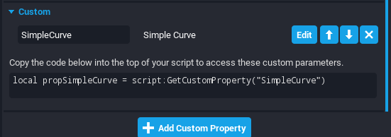
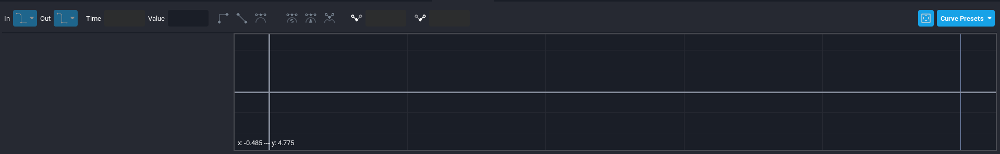
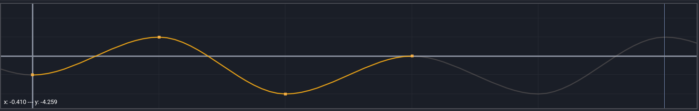
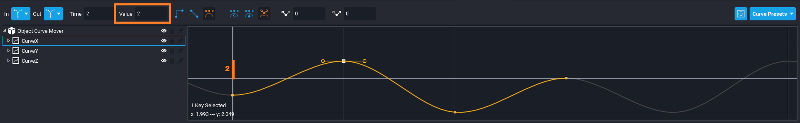
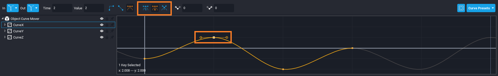
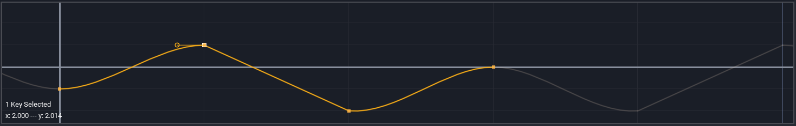
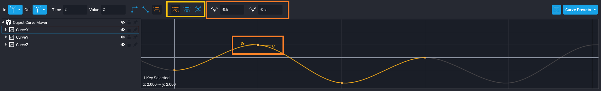

# Curves

## Summary

Curves in Core provide a variety of uses to a game creator. With curves, a creator can customize the path and speed it takes for an object to interpolate between two points, a creator can creating a bouncing coin, a creator can create fully customizable and beautiful UI interpolations, and so much more.

## Curve Custom Properties

Curves can be stored as custom properties for ease of editing and referencing.

### Adding a Curve Custom Property

1. Click on the object to add a curve to and navigate to the **Properties** window.
2. Click **Add Custom Property** in the bottom of the **Properties** window.
3. Click **Simple Curve** and name it what you want it to be referenced as.
4. Click **Edit** to edit the curve to perfection.

### Referencing a Curve in a Script

1. Copy-and-paste the provided code snippet in the **Custom** category of the **Properties** window.

It should look similar to:

```lua
local propSimpleCurve = script:GetCustomProperty("SimpleCurve")
```

{: .center loading="lazy" }

## Curve Editor

The **Curve Editor** is home to changing how a curve and its keyframes behaves.

### Opening the Curve Editor

1. In the top bar, click **Window**.
2. Find and click on **Curve Editor**.

A window like such should appear:

{: .center loading="lazy" }

### Curve Graph

The largest portion of the **Curve Editor** window is the **Curve Graph**. This is a visual representation of the curve and is used to create and edit keyframes.

{: .center loading="lazy" }

#### Creating a Keyframe

1. Move your mouse to the location on the curve you want the keyframe to be inserted.
2. Right-click and then click **Add Key(s)**.

{: .center loading="lazy" }

### Curve List

On the left of the **Curve Editor** window is the **Curve List**. The root of this is object the curves are a part of and under that is a list of all curves attached to it. This makes switch between curves easier for quickly making edits.

{: .center loading="lazy" }

### In / Out

This is the behaviour of the curve before or after the range of time respectively.

There are five different behaviours:

| Name                  | Description |
| --------------------- | ----------- |
| **Cycle**             | Repeat the curve |
| **Cycle with Offset** | Repeat the curve but start the next value where the last left value off |
| **Oscillate**         | Repeat the curve but flip the time values |
| **Linear**            | Takes the tangency from the first two (in) or last two (out) keys and extrapolates it forever before/after respectively |
| **Constant**          | Takes the value of the first (in) or last (out) key and sets a constant value before/after respectively |

### Keyframes

A keyframe is a physical representations of a point on the curve.

| Name                   | Description |
| ---------------------- | ----------- |
| **Time**               | Point in time relative to the beginning (`0`) of the curve<br/>{: .center loading="lazy" } |
| **Value**              | The position that the curve should be in at the corresponding point in time<br/>{: .center loading="lazy" } |
| **Interpolation Type** | How the curve will transition to the next keyframe<br/>{: .center loading="lazy" } |
| **Tangent Type**       | How the tangents will be determined for the previous and next keyframe<br/>{: .center loading="lazy" } |
| **Tangent Values**     | The value for the previous / next tangent if **Tangent Type** is `user-set`<br/>{: .center loading="lazy" } |

#### Interpolation Type

There are three interpolation types:

| Name                       | Description |
| -------------------------- | ----------- |
| **Constant Interpolation** | The value will remain constant until it reach the next keyframe to which it will snap to the next value<br/>{: .center loading="lazy" } |
| **Linear Interpolation**   | The value will lerp linearly to the next keyframe<br/>{: .center loading="lazy" } |
| **Cubic Interpolation**    | The value will use a cubic algorithm to transition to the next keyframe<br/>{: .center loading="lazy" } |

#### Tangent Type and Values

There are three tangent types:

| Name                      | Description |
| ------------------------- | ----------- |
| **Automatic Computation** | Core will take into account the position in time, the value, and surrounding keyframes to automatically set a tangent<br/>{: .center loading="lazy" } |
| **User-Set Aligned**      | The tangent can be set by the creator and the previous/next tangent will retain the same values<br/>{: .center loading="lazy" } |
| **User-Set Independent**  | The tangent can be set by the creator but the previous and next values can be set without changing the other<br/>{: .center loading="lazy" } |

### Viewport Settings

In the top right of the **Curve Editor** window is a blue button that opens the **Viewport Settings**. This allows you to customize how the **Curve Graph** looks by changing the range of time and the range of values that is visible.

!!! hint
    You can zoom in and out of the **Curve Graph** by holding ++Ctrl++ and then scrolling with your mouse wheel.

{: .center loading="lazy" }

### Curve Presets

In the top right of the **Curve Editor** window is a blue button that opens the **Curve Presets**. This is a list of predefined keyframes to create some common curves. Clicking on one of these will reset the curve to the preset.

!!! note
    If you need to undo this action, press ++Ctrl+Z++.

{: .center loading="lazy" }

## Getting the Value of a Curve for a Time

A main powerhouse feature of curves is to be able to get a value on a specific point in time in correlation to the beginning of the curve. For instance, if a curve has a range of `0` - `3` seconds on a liner path and you get the value at `1.5` seconds, the value returned would be `1.5`.

This can be obtained through `SimpleCurve:GetValue(time)`. More information can be found at the [SimpleCurve API](../api/simplecurve.md#getvalue).

!!! note
    Time is continuous for curves and getting the value at `100` on a curve with a range of `0` - `3` would automatically do the calculations to get the correct value based on its In/Out values.

## Sample Scripts Using Curves

Provided in the **Core Content** window are three sample scripts that can be used to explore some possibilities of using curves.

### Curve Mover

This script will continuously move an object to add the value of the three `X`, `Y`, and `Z` curves.

1. Search **"`Object Curve Mover`"** in the **Core Content** window.
2. Drag-and-drop the script into the object of choice in the **Hierarchy**.
3. In the **Properties** window, assign the object the script is in to the `Object` custom property.

| Custom Property | Description |
| --------------- | ----------- |
| **Object**      | Object to transform |
| **CurveX**      | Curve that will change the position on the `X` axis |
| **CurveY**      | Curve that will change the position on the `Y` axis |
| **CurveZ**      | Curve that will change the position on the `Z` axis |
| **Multiplier**  | Multiply curve value by this number. Set `0` to disable transform. Set `1` to only use curve values |
| **Additive**    | Whether to use the object current position as the starting point |
| **LocalSpace**  | Whether object transform is in local space. Set to `false` if it should be in world space |

### Curve Rotator

This script will continuously rotate an object to add the value of the three `X`, `Y`, and `Z` curves.

1. Search **"`Object Curve Rotator`"** in the **Core Content** window.
2. Drag-and-drop the script into the object of choice in the **Hierarchy**.
3. In the **Properties** window, assign the object the script is in to the `Object` custom property.

| Custom Property | Description |
| --------------- | ----------- |
| **Object**      | Object to transform |
| **CurveX**      | Curve that will change the rotation on the `X` axis |
| **CurveY**      | Curve that will change the rotation on the `Y` axis |
| **CurveZ**      | Curve that will change the rotation on the `Z` axis |
| **Multiplier**  | Multiply curve value by this number. Set `0` to disable transform. Set `1` to only use curve values |
| **Additive**    | Whether to use the object current position as the starting point |
| **LocalSpace**  | Whether object transform is in local space. Set to `false` if it should be in world space |

### Curve Scaler

This script will continuously move an object to add the value uniformly.

1. Search **"`Object Curve Scaler`"** in the **Core Content** window.
2. Drag-and-drop the script into the object of choice in the **Hierarchy**.
3. In the **Properties** window, assign the object the script is in to the `Object` custom property.

| Custom Property | Description |
| --------------- | ----------- |
| **Object**      | Object to transform |
| **Curve**       | Curve that will change the scale on all axes |
| **Multiplier**  | Multiply curve value by this number. Set `0` to disable transform. Set `1` to only use curve values |
| **Additive**    | Whether to use the object current position as the starting point |
| **LocalSpace**  | Whether object transform is in local space. Set to `false` if it should be in world space |

## Learn More

[SimpleCurve API](../api/simplecurve.md) |
[SimpleCurve GetValue Example](../api/simplecurve.md#getvalue)
