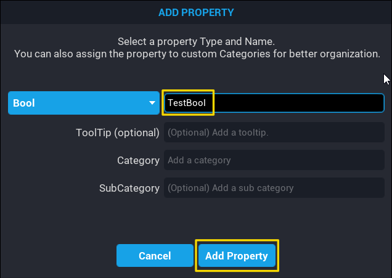
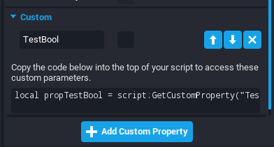
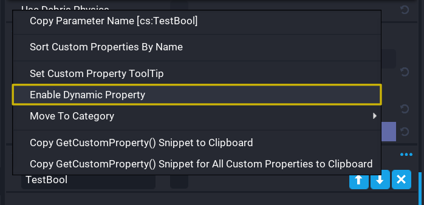

# Custom Properties

## Summary

**Custom Properties** are incredibly powerful tools that allow game creators to assign values like numbers, colors, and references to other objects as a part of one object, template, or script. These values can be edited in the editor or during runtime to allow for easy customization and to give something its own configuration or personality.

These allow for easy referencing in scripts or changing variables through the Properties window, rather than directly through code.

## Adding Custom Properties

There are two major ways to add a custom property to an object.

- **Add Custom Property** Button in the **Properties** window
- **Drag-and-Drop** from **Hierarchy** / **Core Content** window

### Add Custom Property Button

This is the best option for many simple data types like strings, numbers, and booleans.

1. Click on the object that the custom property should be assigned to.
2. Click on the **Add Custom Property** button at the bottom of the **Properties** window.
3. Click on the data type the value of the custom property will contain.
4. Type the name the custom property will be referred by.
5. Edit the value of the custom property as needed.






### Drag-and-Drop

This is the best option for complex/advanced data types like Core Object References, Asset References, and Net References.

1. Click on the object that the custom property should be assigned to.
2. Hold click on the other object that will be the custom property for the first object.
3. Drag the other object into bottom of the **Properties** window of the first object.

## Copying Custom Properties

**Custom Properties** can be copied and pasted to other objects.

1. Click on the object that the **Custom Properties** should be copied from.
2. Right-click on or around the **Add Custom Property** button at the bottom of the **Properties** window.
3. Click **Copy All Custom Properties**.
4. Click on the object that the **Custom Properties** should be pasted to.
5. Right-click on or around the **Add Custom Property** button at the bottom of the **Properties** window.
6. Click **Add Copied Custom Properties**.

!!! note
    Core will automatically copy-and-paste all of the custom properties of the original object when you duplicate it.

## Referencing Custom Properties Through Script

A custom property can be assigned to a variable in a script for easy reference and editing.

In the script, for each custom property being referenced, there are two options for referencing it:

1) Use the auto-generated line in the **Custom** section of the **Properties** window for convenience.
2) Use the `script:GetCustomProperty()` function of **CoreObject**. More information in the [CoreObject API Reference](../api/coreobject.md#getcustomproperty)


```lua
local CustomPropertyName = script:GetCustomProperty("CustomPropertyName")
```

This is automatically generated in the **Custom** section of the **Properties** window for convenience.

!!! note
    **Custom Properties** can be applied to any object, not just a script. Replace `script` with whatever object that the custom property being retrieved is on.

## Changing Custom Property Values Through Script

Custom properties can by edited during runtime through scripts if the object and custom property is networked.

### Enable Networking

Firstly, the object and the custom property must have networking enabled for the custom property to be edited during runtime. You will get an error if it is not networked.

1. Right-click on the object
2. Click **Enable Networking**. The object should have `(networked)` at the end of its name when viewed in the **Hierarchy**.
3. Right-click on the custom property that will be edited during runtime.
4. Click **Enable Property Networking**. The custom property should be orange now.





### Change the Value of the Custom Property

To change the value of the custom property of a CoreObject use the `CorObject:SetNetworkedCustomProperty()` function of **CoreObject**. More information in the [CoreObject API Reference](../api/coreobject.md#setnetworkedcustomproperty).

For example, to set the `TimeRemaining` custom property of a `Cube` to `10` (in seconds), you would type:

```lua
CubeObject:SetNetworkedCustomProperty("TimeRemaining", 10)
```

This will change the value of the custom property to be `10` and will be replicated to the client.

!!! note
    The script will error if the new value is either not the same data type as the custom property or if the custom property is not networked.

### Listening to the Custom Property Changed Event

When a custom property is changed, an event, `CoreObject.networkedCustomPropertyChangedEvent`, is fired on the object. More information can be found in the [CoreObject API Reference](../api/coreobject.md#networkedpropertychangedevent).

An example listener to this event:

```lua
function OnCustomPropertyChanged(coreObject, customPropertyName)
    local newValue = coreObject:GetCustomProperty(customPropertyName)

    print(string.format("New value of %s for %s is now %s", customPropertyName, coreObject.name, newValue))
end

CorObject.networkedPropertyChangedEvent:Connect(OnCustomPropertyChanged)
```

## Simple Data Types

For more information on simple data types such as string, number, and boolean, check out our [Data Types Reference](../tutorials/scripting_intro.md#data-types).

There are a few simple data types supported as custom properties.

| Data Type    | Description |
| ------------ | ----------- |
| **Bool**     | A **Boolean** is only ever `true` or `false`. This can be best compared to on/off, yes/no, etc.<br /><br />In custom properties, they are expressed as a check box that is either checked (`true`) or unchecked (`false`).<br /><br />**Booleans** are most often used in if-statements that allow you to write code that is only executed if certain conditions are met, such as the boolean being `true`. |
| **Color**    | A **Color** is a Core class that contains values for `red`, `green`, `blue`, and `alpha` (transparency).<br /><br />**Colors** are helpful constants that can assist in UI programming, spawning assets of different colors, etc.<br /><br />More information can be found in the [Color API](../api/color.md). |
| **Float**    | A **Float** is a number that can have decimals, such as `0.1`, `1.2`, `139.8`, etc. |
| **Int**      | An **Int** is a number that can not have decimals and must be whole, such as `0`, `1`, `139`, etc. |
| **Rotation** | A **Rotation** is a Core class that contains values for `x`, `y`, and `z` on rotation axis.<br /><br />More information can be found in the [Rotation API](../api/rotation.md). |
| **String**   | A **String** is a collection of any value you want, such as numbers, letters, punctuation, and emojis. They are represented in double quotes (`" "`) in code so that the computer does not mistake them for code. However, this is not necessary for custom properties as **String** custom properties are represented as a text box that can be typed in. |
| **Vector2**  | A **Vector2** contains values for `x` and `y` and is usually useful for storing UI positions/size or any two-dimensional structures.<br /><br />More information can be found in the [Vector2 API](../api/vector2.md). |
| **Vector3**  | A **Vector3** contains values for `x`, `y`, and `z` and is usually useful for storing 3D positions/size or any three-dimensional structures.<br /><br />More information can be found in the [Vector3 API](../api/vector3.md). |
| **Vector4**  | A **Vector4** contains values for `x`, `y`, `z`, and `w` and is useful for any four-dimensional structures.<br /><br />More information can be found in the [Vector4 API](../api/vector4.md). |
| **Simple Curve**  | A **Simple Curve** contains keyframes with a curve connecting the points to be used to get values at any point in time.<br /><br />More information can be found in the [SimpleCurve API](../api/simplecurve.md). |

## Advanced Data Types

The advanced/complex data types that are supported as custom properties are:

- Core Object Reference
- Asset Reference
- Net Reference

### Core Object Reference

A **Core Object Reference** contains a value that points to any object in the **Hierarchy**.

When getting this reference into a variable, `:WaitForObject()` needs to be added to the end of the line to make sure the the object is loaded and exists in the game.

More information can be found in the [CoreObjectReference API](../api/coreobjectreference.md) and the [CoreObject API](../api/coreobject.md).

For example, say you want to rotate a cube 45 degrees every 2 seconds. You would:

1) Add a **Core Object Reference** custom property to the script referencing Cube called `CubeObject`
2) Create a **Rotation** custom property to the script called `RotationIncrement`
3) Create a **Float** custom property to the script called `RotationSpeed`


Then, add this to the script.

```lua
local CubeObject = script:GetCustomProperty("CubeObject"):WaitForObject()

local ROTATION_INCREMENT = script:GetCustomProperty("RotationIncrement")
local ROTATION_SPEED = script:GetCustomProperty("RotationSpeed")

CubeObject:RotateContinuous(ROTATION_INCREMENT, ROTATION_SPEED, true) -- true for local space
```

!!! note
    If the cube does not rotate and produces an error, make sure it is networked by right-clicking on it then clicking **Enable Networking**

### Asset Reference

An **Asset Reference** contain a value that points to a script or template in the **Project Content** window.

This includes referencing **Templates** so that they can be spawned without having to copy-and-paste the MUID and referencing scripts to be required and used throughout the script.

#### Requiring Scripts

An **Asset Reference** can be used to `require` scripts and gain access to its properties and functions. This is commonplace for APIs/Modules created by you that include a table of values/functions to be used between scripts.

Say that there is a script **Asset Reference** custom property called `SampleAPI`, it can be included into the script by using `require`, similar to `script.context`, to get what was returned from the script.

For instance, say the contents of `SampleAPI` was:

```lua
local SampleAPI = {}

function SampleAPI.TestFunction()
    print("Hello, world!")
end

return SampleAPI
```

Then, you can use the `TestFunction` function of the `SampleAPI` script by typing:

```lua
local SampleAPI = require(script:GetCustomProperty("SampleAPI"))

SampleAPI.TestFunction() -- prints "Hello, world!"
```

#### Spawning Templates

An **Asset Reference** can be used to point to templates that can be spawned into the game. If there is a template referenced called "CubeTemplate", it can be spawned by typing:

```lua
local CubeTemplate = script:GetCustomProperty("CubeTemplate")

local spawnedCube = World.SpawnAsset(CubeTemplate)
```

### Net Reference

A **Net Reference** contains a value that points to a **Leaderboard**, a **Shared Storage Key**, or a **Perk** which are data that is stored on the Core backend and are accessible across all your projects.

More information can be found at the [Leaderboards Tutorial](../tutorials/leaderboards.md), the [Shared Storage Tutorial](../tutorials/shared_storage.md), and the [Perks Tutorial](../perks/implementing_perks.md)

## Learn More

[CoreObjectReference API](../api/coreobjectreference.md) |
[CoreObject API](../api/coreobject.md) |
[CoreObject GetCustomProperty](../api/coreobject.md#getcustomproperty) |
[CoreObject SetNetworkedCustomProperty](../api/coreobject.md#setnetworkedcustomproperty) |
[CoreObject NetworkedPropertyChangedEvent](../api/coreobject.md#networkedpropertychangedevent) |
[Data Types Reference](../tutorials/scripting_intro.md#data-types) |
[Color API](../api/color.md) |
[Rotation API](../api/rotation.md) |
[Vector2 API](../api/vector2.md) |
[Vector3 API](../api/vector3.md) |
[Vector4 API](../api/vector4.md) |
[Leaderboards Tutorial](../tutorials/leaderboards.md) |
[Shared Storage Tutorial](../tutorials/shared_storage.md) |
[Perks Tutorial](../perks/implementing_perks.md)
