# Damageable Object Basics

## Overview

In this tutorial you will be learning how to create [**Damageable Objects**](../references/damageable_objects.md) from the very basics, to creating more complex objects. You will gain the knowledge to be able to create assets that can be placed in the world which can be destroyed in many ways. For example, a training dummy that can have pieces of it be destroyed.

<div class="mt-video" style="width:100%">
    <video autoplay muted playsinline controls loop class="center" style="width:100%">
        <source src="/img/DamageableObjects/Basics/preview.mp4" type="video/mp4" />
    </video>
</div>

* **Completion Time:** ~1 hour
* **Knowledge Level:** None needed.
* **Skills you will learn:**
    * Where to find damageable objects in **Core Content**.
    * What the damageable object properties are for.
    * Creating basic damageable objects.
    * Nested damageable objects.
    * Changing damageable object properties from a Lua script.

---

## Import Asset from Community Content

You will be importing an asset from **Community Content** that will contain assets to help build up the different components for the dummies. These assets have been designed for ease of use so you can get straight in to learning all about **Damageable Objects**.

1. Open the **Community Content** window.
2. Search for `Damageable Objects` by **CoreAcademy**.
3. Click **Import**.

{: .center loading="lazy" }

## Damageable Object Templates

Before you dive into learning how to create your own damageable objects, let us take a look at the default damageable objects that **Core** provides for you in **Core Content**. This will give you an idea of what damageable objects can do.

### Add Damageable Objects

Damageable objects can be found in the **Core Content** window. All of the damageable objects can be placed into the **Hierarchy**, however, there is one damageable object that is special which we will talk about in the next section.

In the **Core Content** window, search for `damageable` to find the damageable objects. Drag any of the following into your **Hierarchy**. Make sure to spread them out so they have space between each other. Feel free to place as many as you like.

- Damageable Crate
- Damageable Hazard Barrel
- Damageable Sandbag
- Damageable Fire Hydrant

{: .center loading="lazy" }

### Damage Damageable Objects

Damageable objects from Core Content will not do anything when you play the game. Those damageable objects need to take damage so when their health reaches 0, they will be destroyed. A good way to do damage to damageable objects is by adding a weapon to the **Hierarchy** that you can pickup and use to shoot the damageable objects.

1. In **Core Content**, search for `advanced assault` to find **Advanced Assault Rifle**.
2. Drag the **Advanced Assault Rifle** template into the **Hierarchy**.

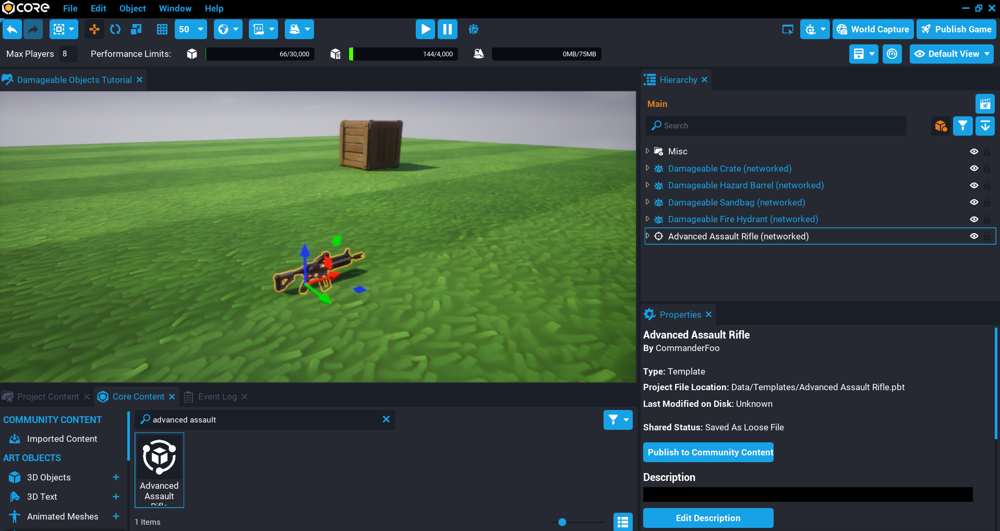{: .center loading="lazy" }

### Test the Game

Test the game by picking up the **Advanced Assault Rifle** and shooting the damageable objects. You will see they will be destroyed, and when they are destroyed, audio and effects are played.

Notice the **Damageable Sandbag** object can have the individual sandbags destroyed.

<div class="mt-video" style="width:100%">
    <video autoplay muted playsinline controls loop class="center" style="width:100%">
        <source src="/img/DamageableObjects/Basics/core_content_examples.mp4" type="video/mp4" />
    </video>
</div>

## Basic Damageable Object

In the previous section, you may have spotted the **Damageable Object** when searching for `damageable` in the **Core Content** window. This object on its own is not too useful, it will have no visual geometry, and can not be destroyed. For a damageable object to take damage and be destroyed, it requires geometry inside the damageable object that has collision. When these objects get hit (for example, by bullets, or other forms of damage), the damage is applied to the closest damageable object parent.

In this section you will learn about all the properties the damageable object has, and what they do.

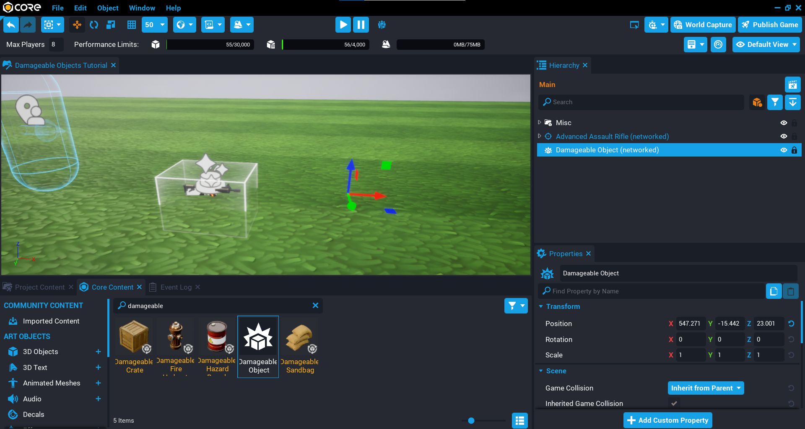{: .center loading="lazy" }

### Networked Damageable Object

For a damageable object to work correctly, it needs to be networked. By default the damageable objects in **Core Content** are networked, including the basic **Damageable Object**. A networked object means that it will be sent to other players in the game so they can also see and react to it. This keeps things in sync between players.

### Damageable Object Properties

The damageable object has a **Damageable** group in the **Properties** window that contain all the properties that apply to objects that implement the **Damageable Interface**. What this means, is that objects that have health and can be killed will have these properties. For example, **Vehicles** can be setup to be destroyed because they have the **Damageable** properties.

Understanding the properties will give you a lot of options to create damageable objects. You can do a lot of interesting things with damageable objects without any Lua knowledge, but learning even a little bit can increase the things you can do with damageable objects.

!!! tip "All damageable properties can be changed from a Lua script at runtime when the game is running."

{: .center loading="lazy" }

#### Max Hit Points

The **Max Hit Points** property determines the maximum hit points of the object. Any value that is 0 or lower will be ignored, and the damageable object will be instantly destroyed when the game is played.

#### Starting Hit Points

The **Starting Hit Points** property determines the hit points of the object when the object is spawned. This value can not be greater than the **Max Hit Points**.

This property could be useful if you want your damageable object to start at a lower health, and slowly regenerate the health until it reaches **Max Hit Points**.

#### Start Invulnerable

When the **Start Invulnerable** property is enabled (checked), the damageable object will not take any damage. Meaning, the health will not go down when it receives damage.

Notice in the video below that no matter how much the damageable object is shot, its health does not go down, and can't be destroyed.

<div class="mt-video" style="width:100%">
    <video autoplay muted playsinline controls loop class="center" style="width:100%">
        <source src="/img/DamageableObjects/Basics/start_invulnerable.mp4" type="video/mp4" />
    </video>
</div>

#### Start Immortal

When the **Start Immortal** property is enabled (checked), the damageable object does not automatically die when the hit points reach 0 or lower. So it can still receive damage, but can not be killed.

#### Destroy on Death

When the **Destroy on Death** property is enabled (checked), when the damageable object is killed (health reaches 0 or lower), then the damageable object will be destroyed. This is useful because the damageable object will take care of removing its self from the world.

#### Destroy on Death Delay

The **Destroy on Death Delay** will delay the destroying of the damageable object based on the property value that is set (in seconds).

#### Destroy on Death Client Template

The **Destroy on Death Client Template** will spawn a template on the client at the location of the damageable object after the **Destroy on Death Delay**. This is an efficient way of spawning visual effects, and anything else for the client. For example, when a damageable object is destroyed, smoke effect is spawned.

In the video below, you will see a template is set for the property that will be spawned when the damageable object is destroyed.

<div class="mt-video" style="width:100%">
    <video autoplay muted playsinline controls loop class="center" style="width:100%">
        <source src="/img/DamageableObjects/Basics/client_template_property.mp4" type="video/mp4" />
    </video>
</div>

#### Destroy on Death Networked Template

The **Destroy on Death Networked Template** will spawn a networked template at the location of the damageable object after the **Destroy on Death Delay**. This is useful for spawning other gameplay objects from a damageable object that is destroyed. For example, when a damage object is destroy, it could spawn a pickup for all players to collect.

In the video people, you will see a template is set for the property that will be spawned when the damageable object is destroyed.

!!! tip "Make sure that the template you use for this property is **Networked**."

<div class="mt-video" style="width:100%">
    <video autoplay muted playsinline controls loop class="center" style="width:100%">
        <source src="/img/DamageableObjects/Basics/networked_template_property.mp4" type="video/mp4" />
    </video>
</div>

### Template Spawn Location

When using either the **Destroy on Death Client Template** or **Destroy on Death Networked Template** properties, it is important to know where these will spawn so the templates are at the right position and rotation when the damageable object is destroyed. Both templates will spawn at the position and rotation of the nearest parent damageable object, meaning the spawned templates will inherit the transform data.

For example, in this video below, the damageable object is rotated, but the cube is moved up in the **Z** direction. This means that the template is spawned when the damageable object is destroyed, it will match the rotation and position.

<div class="mt-video" style="width:100%">
    <video autoplay muted playsinline controls loop class="center" style="width:100%">
        <source src="/img/DamageableObjects/Basics/template_position.mp4" type="video/mp4" />
    </video>
</div>

## Destructible Vase

In this section you will create a destructible vase that can be broken that will have a couple of stages, and then spawn a Gem.

### Create Vase Damageable Object

For an object to become destructible, it needs to have collision, and be a child of a **Damageable Object**. When the child of a damageable object gets hit by something that can apply damage, then this damage will be applied to the parent damageable object.

1. In **Core Content** search for `Damageable Object` and add it to your **Hierarchy**.
2. Rename **Damageable Object** to `Vase Damageable Object`.

{: .center loading="lazy" }

### Add Vase Object

You will need to add an object as a child of the **Vase Damageable Object** that has collision.

In **Core Content** search for `Vase` to find the **Porcelain Vase 03** object and place it as a child of the **Vase Damageable Object** in the **Hierarchy**. When this object takes damage (for example, from a weapon), it will look at the parent **Vase Damageable Object** and apply the damage to that.

When adding objects as children of a **Damageable Object**, you may be asked if you want to make the children **Networked**. For any object that will have collision on, then those objects should always be networked.

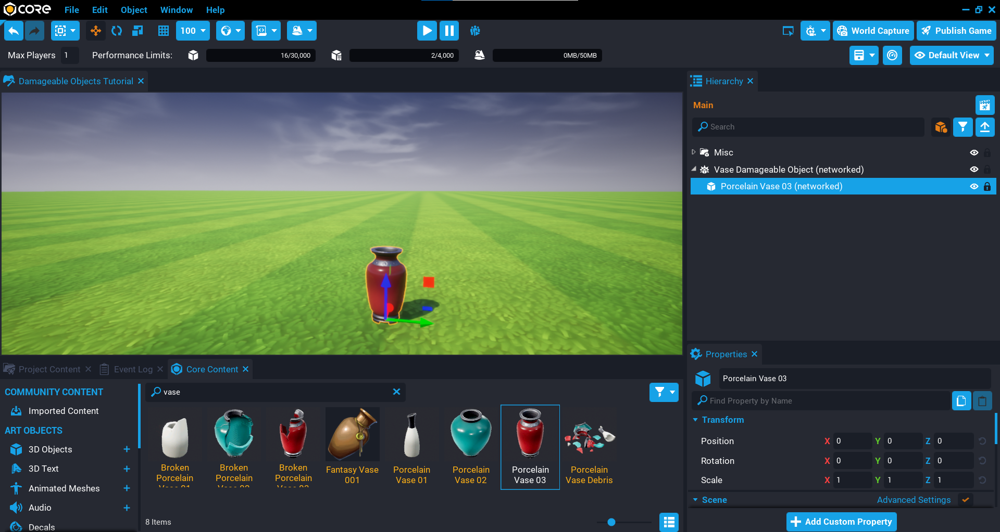{: .center loading="lazy" }

### Create Vase Broken Damageable Object

Now that you have the main vase object, you will now create another damageable object that will be the broken version of the vase. For the moment this will stay in the **Hierarchy** because you will be modifying the properties later.

1. In **Core Content** search for `Damageable Object` and add it to your **Hierarchy**.
2. Rename **Damageable Object** to `Vase Broken Damageable Object`.
3. In **Core Content** search for `Vase` to find the **Broken Porcelain Vase 03** object and place it as a child of the **Vase Broken Damageable Object** in the **Hierarchy**.
4. In the **Hierarchy**, right click on the **Vase Broken Damageable Object** and select **Create a New Template From This**.

{: .center loading="lazy" }

### Create Vase Debris Template

For the final stage of the vase, a vase debris object will be spawned.

1. In **Core Content** search for `Vase` to find the **Porcelain Vase Debris** object and place it in the **Hierarchy**.
2. In the **Hierarchy**, right click on the **Porcelain Vase Debris** object and select **Create a New Template From This**.
3. Delete the **Porcelain Vase Debris** object from the **Hierarchy**.

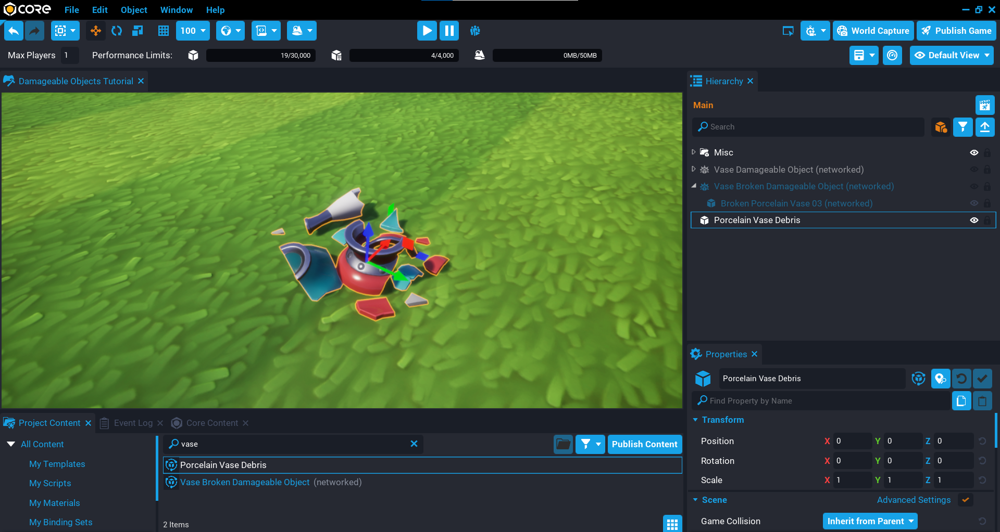{: .center loading="lazy" }

### Create Gem Object

When the **Vase Broken Damageable Object** is destroyed, it will also spawn a gem object. This could be a pickup that players in your game can collect.

Objects that are spawned when a damageable object has been destroyed will inherit the position of the damageable object. This is good for most cases, but there are times where the spawned object needs to be offset. For example, spawning a gem may be too low into the ground. This is an easy problem to solve by using a group as the parent of the object, and then positioning the object in the group.

1. Create a new **Group** in the **Hierarchy** and call it `Gem`.
2. In **Core Content** search for `Diamond Gem` to find **Gem - Diamond 6-Sided Polished**, and add it in the **Gem** group in the **Hierarchy**.
3. Move the object up on the **Z** position so it is not in the ground.
4. In the **Hierarchy**, right click on the **Gem** group and select **Enable Networking**.
5. In the **Hierarchy**, right click on the **Gem** group again and select **Create a New Template From This**.
6. Delete the **Gem** group from the **Hierarchy**.

{: .center loading="lazy" }

### Update Vase Broken Damageable Object

The broken vase template needs to be updated so that it will spawn the templates when it has been destroyed.

#### Add Destroy on Death Client Template

When the broken vase damageable is destroyed, the client template will be spawned. This will be the debris version of the vase.

1. In the **Hierarchy**, click on the **Vase Broken Damageable Object** so it is the active object.
2. In **Project Content** search for `Vase Debris` to find **Porcelain Vase Debris**.
3. Add the template **Porcelain Vase Debris** to the custom property **Destroy on Death Client Template**.

#### Add Destroy on Death Networked Template

When the broken vase damage is destroyed, the networked template will be spawned. This will be the Gem.

1. In the **Hierarchy**, click on the **Vase Broken Damageable Object** so it is the active object.
2. In **Project Content** search for `Gem`.
3. Add the template **Gem** to the custom property **Destroy on Death Networked Template**.

#### Update Template

With the client and networked templates added, the **Vase Broken Damageable Object** in the **Hierarchy** can now be updated.

1. In the **Hierarchy** select **Vase Broken Damageable Object** so it is the active object.
2. Right click on **Vase Broken Damageable Object** and select **Update Template From This**.
3. Deleted **Vase Broken Damageable Object** from the **Hierarchy**.

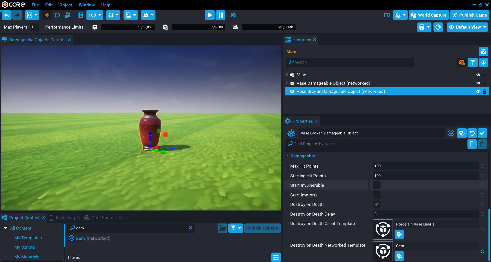{: .center loading="lazy" }

### Update Vase Damageable Object

The final thing left to do, is add the **Vase Broken Damageable Object** template to the **Vase Damageable Object** in the **Hierarchy** so that when it is destroyed, it will spawn the broken vase.

1. In the **Hierarchy**, click on the **Vase Damageable Object** so it is the active object.
2. In **Project Content** search for `Vase Broken` to find **Vase Broken Damageable Object**.
3. Add the template **Vase Broken Damageable Object** to the custom property **Destroy on Death Networked Template**.

{: .center loading="lazy" }

### Add a Weapon

You will need to add a weapon to the game so that it can be picked up and used to destroy the vase.

1. In **Core Content** search for `shotgun` to find **Advanced Shotgun**.
2. Add the **Advanced Shotgun** template to the **Hierarchy**.

{: .center loading="lazy" }

### Test the Game

Test the game to make sure the following work:

1. Broken vase is spawned when the vase has been damaged.
2. Debris vase is spawned when the broken vase has been damaged.
3. Gem is spawned.

<div class="mt-video" style="width:100%">
    <video autoplay muted playsinline controls loop class="center" style="width:100%">
        <source src="/img/DamageableObjects/Basics/vase_finished_video.mp4" type="video/mp4" />
    </video>
</div>

## Basic Dummy

In this section you will setup the most basic damageable object that will have some geometry and collision that can be destroyed, in future sections you will be adding additional layers to improve the dummy.

For the basic dummy, the properties on the damageable object will not be changed, which will show you how easy it can be to create objects that can be destroyed by the player.

!!! tip "Destroying Damageable Objects"
    To destroy any of the damageable objects throughout this tutorial, you will need to add a weapon from **Core Content**. For example, search for `advanced assault` to find the **Advanced Assault Rifle** and add it to your **Hierarchy** so you can pick it up when you play the game.

### Create Damageable Object

When you want to create your own custom damageable objects, you will want to start with the basic **Damageable Object** from **Core Content**. On its own, it is not that useful because it has no visual, and no collision. All damageable objects need some collision for it to register damage, and in most cases you will want some geometry so you can see what to damage.

1. In **Core Content** search for `Damageable Object` and add it to your **Hierarchy**.
2. Rename **Damageable Object** to `Simple Damageable Object`.
3. In **Project Content** search for `Simple Dummy` and add it as a child of **Simple Damageable Object**.
4. Move the **Simple Damageable Object** so it is not in the ground, and away from the player.

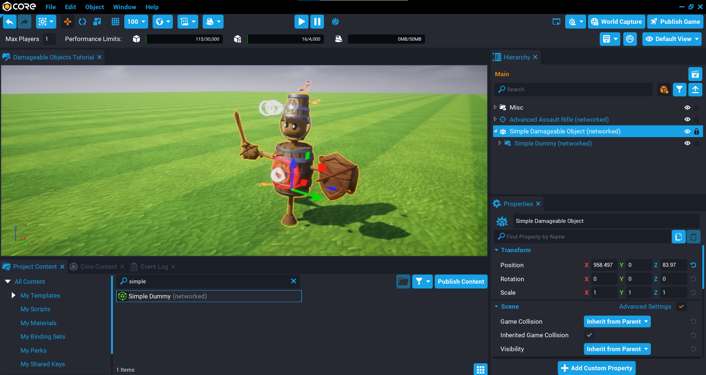{: .center loading="lazy" }

### Test the Game

Enter player mode, pickup the weapon, and shoot the dummy. The **Simple Damageable Object** has `100` health, so after a few shots you will see the dummy disappear. It is not very satisfying, but it shows you how easy it is to make objects that can be destroyed.

<div class="mt-video" style="width:100%">
    <video autoplay muted playsinline controls loop class="center" style="width:100%">
        <source src="/img/DamageableObjects/Basics/simple_dummy_video.mp4" type="video/mp4" />
    </video>
</div>

## Effects Dummy

In this section, you will be create a dummy that will spawn an effect when the dummy is destroyed. Damageable objects have a property called **Destroy on Death Client Template**, which will be spawned when the damageable object is destroyed (killed). This effect will be spawned for each player, which will make the death of the dummy far more satisfying.

1. In **Core Content** search for `Damageable Object` and add it to your **Hierarchy**.
2. Rename **Damageable Object** to `Effects Damageable Object`.
3. In **Project Content** search for `Effects Dummy` and add it as a child of **Effects Damageable Object**.
4. Move the **Effects Damageable Object** so it is not in the ground, and away from the player.

{: .center loading="lazy" }

### Add Destroy on Death Client Template

The **Destroy on Death Client Template** can be set to a template that will spawn when the dummy has been killed. You can setup your own death templates that can do anything you imagine.

1. Select the **Effects Damageable Object** in the **Hierarchy** so it becomes the active object.
2. In **Project Content** search for **General Explosion VFX** and drag it onto the **Destroy on Death Client Template** property.

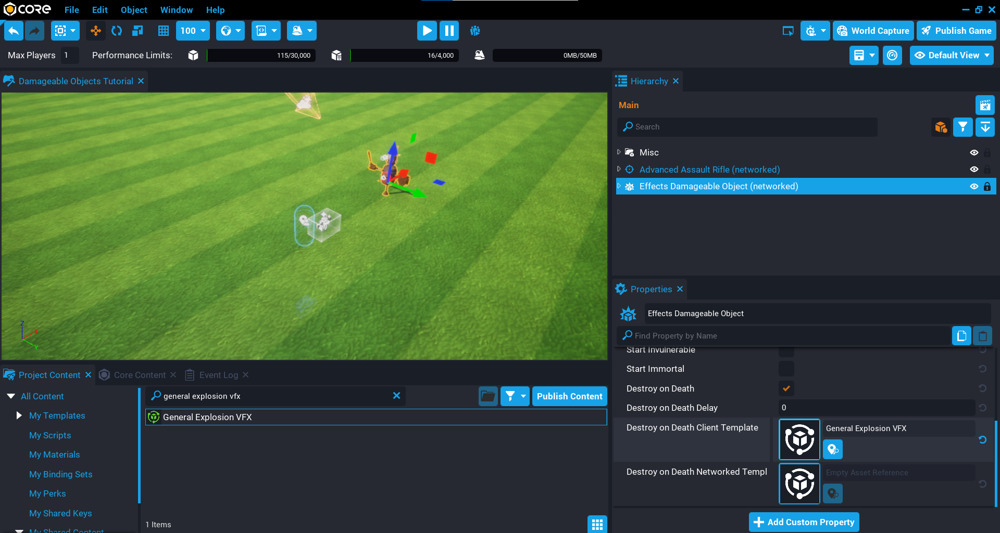{: .center loading="lazy" }

### Test the Game

Play the game and shoot the dummy. You should now see that when the dummy is killed, an explosion is played. Comparing to the Simple Dummy, it is far more satisfying to destroy, and this is done by setting one property on the damageable object.

<div class="mt-video" style="width:100%">
    <video autoplay muted playsinline controls loop class="center" style="width:100%">
        <source src="/img/DamageableObjects/Basics/effects_dummy_video.mp4" type="video/mp4" />
    </video>
</div>

## Chained Dummy

In this section you will be creating a damageable object that will spawn a level 2 dummy after the first dummy is killed. This level 2 dummy could have more health or display different effects when it is killed. This allows you to chain damageable objects that are spawned when the previous one is killed.

1. In **Core Content** search for `Damageable Object` and add it to your **Hierarchy**.
2. Rename **Damageable Object** to `Chained Damageable Object`.
3. In **Project Content** search for `Chained Level 1 Dummy` and add it as a child of **Chained Damageable Object**.
4. Move the **Chained Damageable Object** so it is not in the ground, and away from the player.

{: .center loading="lazy" }

### Add Destroy on Death Client Template

The **Destroy on Death Client Template** will spawn an effect when the first dummy is killed.

1. Select the **Chained Damageable Object** in the **Hierarchy** so it becomes the active object.
2. In **Project Content** search for **General Explosion VFX** and drag it onto the **Destroy on Death Client Template** property.

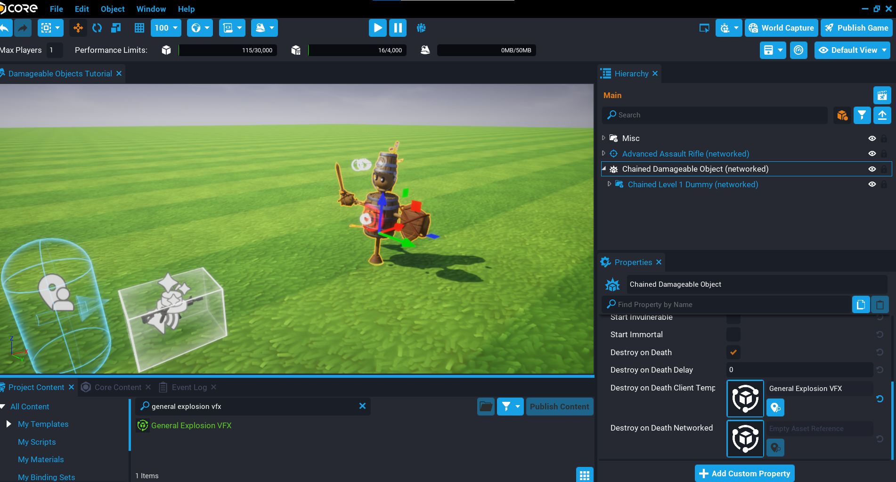{: .center loading="lazy" }

### Add Destroy on Death Networked Template

The **Destroy on Death Networked Template** property can be used to spawn templates that have additional gameplay logic. For example, spawning a loot item that all players can see and pickup. Any template that you set for this property needs to be **Networked** so all players can see the object and get updates about it.

A level 2 dummy template has been created that you will be adding into the property, this object is also a damageable object. This level 2 dummy will have a different decal color and play a different colored explosion when killed.

1. Select the **Chained Damageable Object** in the **Hierarchy** so it becomes the active object.
2. In **Project Content** search for **Chained Level 2 Dummy** and drag it onto the **Destroy on Death Networked Template** property.

{: .center loading="lazy" }

### Test the Game

Play the game and test by killing the dummy.

- Make sure the first dummy can be killed and plays the general explosion effect.
- Make sure the second dummy is spawned, and can also be killed and plays a different explosion effect.

<div class="mt-video" style="width:100%">
    <video autoplay muted playsinline controls loop class="center" style="width:100%">
        <source src="/img/DamageableObjects/Basics/chained_video.mp4" type="video/mp4" />
    </video>
</div>

## Exploding Dummy

So far the dummies have been very simple to setup, and with no Lua scripting you can create some interesting results just by using the properties. In this section you will be creating an exploding dummy. After the dummy has been killed, a networked template will be spawned using the **Destroy on Death Networked Template** property. The template that is spawned contains a dummy that is setup to be exploded into various pieces. This exploding effect is done by a small script that is inside the template, meaning it will run as soon as it is spawned.

1. In **Core Content** search for `Damageable Object` and add it to your **Hierarchy**.
2. Rename **Damageable Object** to `Exploding Damageable Object`.
3. In **Project Content** search for `Exploding Dummy` and add it as a child of **Exploding Damageable Object**.
4. Move the **Exploding Damageable Object** so it is not in the ground, and away from the player.

{: .center loading="lazy" }

### Add Destroy on Death Networked Template

When the **Exploding Damageable Object** is killed, a template will be spawned that contains a Lua script that will loop over all the meshes that support [**Debris Physics**](../references/debris_physics.md) by setting `isSimulatingDebrisPhysics` to `true`. The template that will be spawned has already been setup so that objects which support **Debris Physics** are in a **Supported** group.

1. Select the **Exploding Damageable Object** in the **Hierarchy** so it becomes the active object.
2. In **Project Content** search for **General Scatter** and drag it onto the **Destroy on Death Networked Template** property.

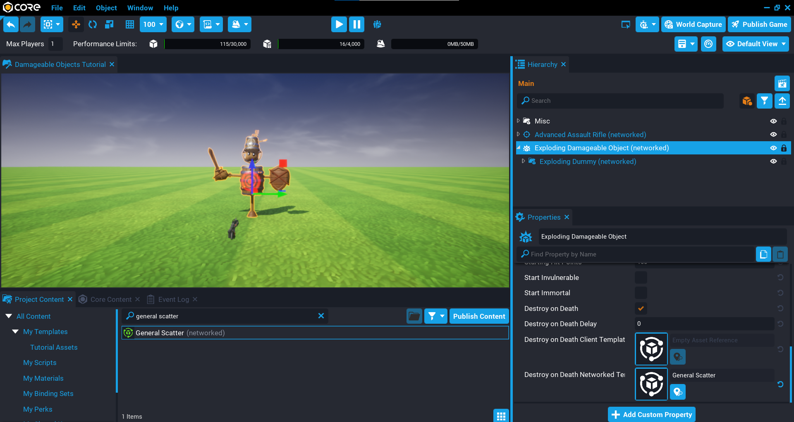{: .center loading="lazy" }

#### The ScatterClient Script

In the **General Scatter** template, there is a script called **ScatterClient**. Open up the **ScatterClient** script and take a look at the code. The code below contains annotations that briefly explain what is happening.

```lua
local SUPPORTED = script:GetCustomProperty("Supported"):WaitForObject() -- (1)
local NOT_SUPPORTED = script:GetCustomProperty("NotSupported"):WaitForObject() -- (2)

NOT_SUPPORTED:Destroy() -- (3)

local meshes = SUPPORTED:FindDescendantsByType("StaticMesh") -- (4)
local power = 800 -- (5)
local RNG = RandomStream.New() -- (6)

for _, mesh in ipairs(meshes) do -- (7)
    mesh.collision = Collision.FORCE_ON -- (8)
    mesh.cameraCollision = Collision.FORCE_OFF -- (9)
    mesh.isSimulatingDebrisPhysics = true -- (10)

    if mesh.isSimulatingDebrisPhysics then
        mesh.lifeSpan = RNG:GetNumber(2.5, 5) -- (11)
        mesh:SetVelocity(RNG:GetVector3FromCone(Vector3.UP, 45, 45) * power) -- (12)
    else
        mesh:Destroy() -- (13)
    end
end
```

1. Any mesh that supports **Debris Physics** will be in a group called **Supported**.
2. Any mesh that does not support **Debris Physic** will be in a group called **Not Supported**.
3. All the meshes not supported and destroyed instantly.
4. Store a reference to all the **StaticMesh** objects that are in the **Supported** group.
5. The amount of power to apply when setting the velocity of the objects.
6. A **RandomStream** instance they will be used to get a random **Vector3** later.
7. Looping through all the static meshes that are in the **Supported** group.
8. Debris physics needs collision to be turned on.
9. Turn off camera collision to prevent interrupting the player's camera if objects come towards them.
10. Turn on debris physic by setting `isSimulatingDebrisPhysics` to `true`.
11. Set the `lifeSpan` of the object so it is automatically cleaned up. A random number between 2.5 and 5 is used.
12. Set the velocity of the object by passing in a random Vector3 that is generated by the `GetVector3FromCone` function. Because the objects need to go in an upwards direction, the world `Vector.UP` is used.
13. If any meshes were in the **Supported** group that don't support debris physics, then destroy them. These objects will show up in the **Event Log** as a warning.

#### GetVector3FromCone Visualization

The `GetVector3FromCone` function will return a random **Vector3**. The function takes 2 inputs (arguments) that specify the angles of the cone. Below is a visual representation of how this would look when using `45` for the horizontal angle, and `45` for the vertical angle.

The horizontal angle is in blue, and the vertical angle is in red.

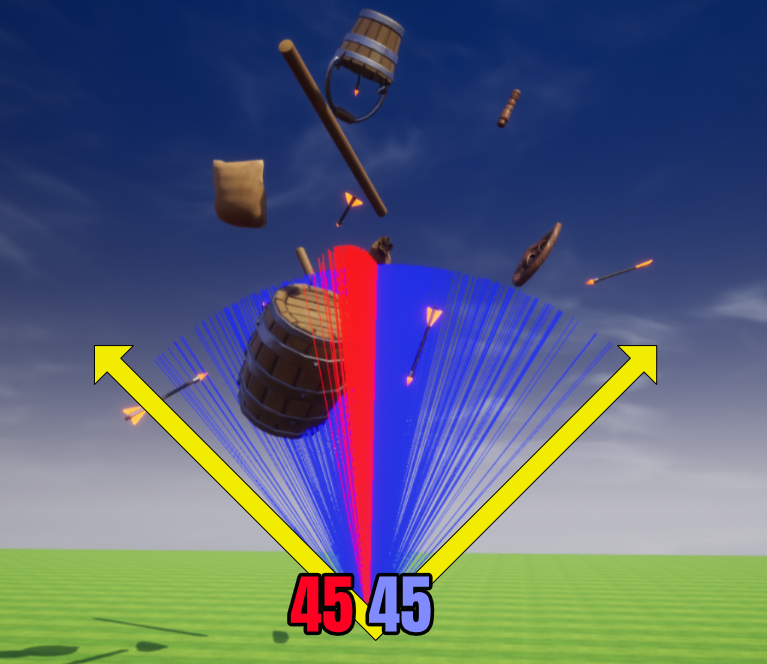{: .center loading="lazy" }

### Test the Game

Test the game to make sure when the dummy is killed, the scatter template is spawned that explodes all the pieces everywhere.

<div class="mt-video" style="width:100%">
    <video autoplay muted playsinline controls loop class="center" style="width:100%">
        <source src="/img/DamageableObjects/Basics/exploding_video.mp4" type="video/mp4" />
    </video>
</div>

## Combined Dummy

With the knowledge from the previous sections, it is now possible to layer up these effects by creating damageable objects that are far more interesting to kill by your players.

The templates have already been created for you that will play an explosion effect when the dummy is killed, explode all the static meshes over the place, and spawn a level 2 dummy that will also have the same effects from the first dummy.

1. In **Core Content** search for `Damageable Object` and add it to your **Hierarchy**.
2. Rename **Damageable Object** to `Combined Damageable Object`.
3. In **Project Content** search for `Combined Level 1 Dummy` and add it as a child of **Combined Damageable Object**.
4. Move the **Combined Damageable Object** so it is not in the ground, and away from the player.

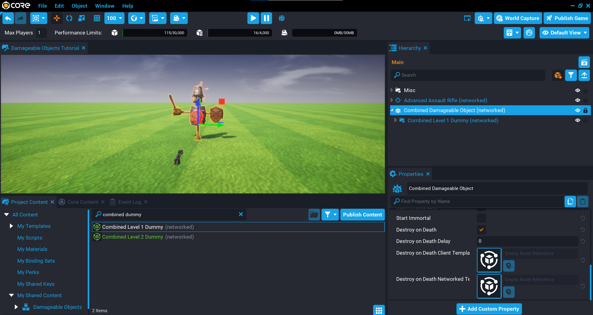{: .center loading="lazy" }

### Add Destroy on Death Client Template

The **Destroy on Death Client Template** will spawn an explosion effect when the dummy has been killed.

1. Select the **Combined Damageable Object** in the **Hierarchy** so it becomes the active object.
2. In **Project Content** search for **General Explosion VFX** and drag it onto the **Destroy on Death Client Template** property.

{: .center loading="lazy" }

### Add Destroy on Death Networked Template

The **Destroy on Death Networked Template** property will be set to template that is also a damageable object. This shows you how easy it is to create damageable objects that can be added to existing damageable objects to get far more interesting effects. This is all possible without any Lua scripting, because the **ScatterClient** script is an optional component to improve the effects when the dummy has been killed.

1. Select the **Combined Damageable Object** in the **Hierarchy** so it becomes the active object.
2. In **Project Content** search for **Combined Level 2 Dummy** and drag it onto the **Destroy on Death Networked Template** property.

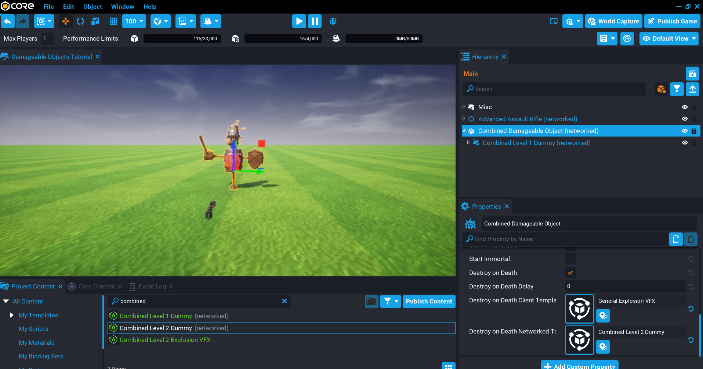{: .center loading="lazy" }

### Test the Game

Test the game to make sure the level 1 dummy can be killed, and a level 2 dummy is spawned that can also be killed.

<div class="mt-video" style="width:100%">
    <video autoplay muted playsinline controls loop class="center" style="width:100%">
        <source src="/img/DamageableObjects/Basics/combined_video.mp4" type="video/mp4" />
    </video>
</div>

## Advanced Dummy

In this section you will be creating a more advanced dummy that will require the player to destroy individual parts of the dummy first before it can be killed. You will be setting up nested damageable objects for the individual parts, and also writing some Lua code to communicate between the server and the client to show the amount of damage the player is doing to each part.

The damageable object for the advanced dummy has the **Start Invulnerable** property enabled (checked). This will be controlled from a Lua script that will keep track of how many parts of the dummy have been destroyed. Once all the parts have been destroyed, the main body (barrel) will become vulnerable.

### Add Advanced Dummy Template

The **Advanced Dummy Template** in **Project Content** has been setup for you already. The properties for the client and networked templates have been set.

1. In **Project Content** search for `Advanced Dummy` and add it to the **Hierarchy**.
2. Deinstance the **Advanced Dummy** template, and open up the folder to see the objects.

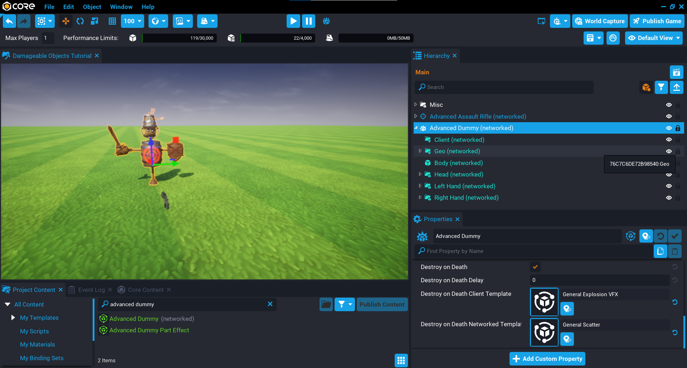{: .center loading="lazy" }

### Create Nested Damageable Objects

There are 3 areas of the dummy that need to have their own damageable object. For each object listed below, create a **Damageable Object** inside the **Advanced Dummy** and drag the part as a child of the damageable object. Make sure to copy the **Position** property of the group and set that for the damageable object, otherwise when applying damage later on the damage numbers will not show in the correct position.

#### Head Damageable Object

1. Copy the **Position** of the **Head** group from the **Properties** window.
2. Create a **Damageable Object** inside the **Advanced Dummy** and rename it to `Head`.
3. Paste the **Position** that was copied earlier on to the **Head** damageable object.
4. Drag the **Head** group onto the **Head** damageable object.

#### Left Hand Damageable Object

1. Copy the **Position** of the **Left Hand** group from the **Properties** window.
2. Create a **Damageable Object** inside the **Advanced Dummy** and rename it to `Left Hand`.
3. Paste the **Position** that was copied earlier on to the **Left Hand** damageable object.
4. Drag the **Left Hand** group onto the **Left Hand** damageable object.

#### Right Hand Damageable Object

1. Copy the **Position** of the **Right Hand** group from the **Properties** window.
2. Create a **Damageable Object** inside the **Advanced Dummy** and rename it to `Right Hand`.
3. Paste the **Position** that was copied earlier on to the **Right Hand** damageable object.
4. Drag the **Right Hand** group onto the **Right Hand** damageable object.

<div class="mt-video" style="width:100%">
    <video autoplay muted playsinline controls loop class="center" style="width:100%">
        <source src="/img/DamageableObjects/Basics/nested_damageable_objects_video.mp4" type="video/mp4" />
    </video>
</div>

### Create MakeVulnerableServer Script

A script will be created that will keep track of how many parts have been destroyed. Once all the parts of the dummy have been destroyed, the dummy will then become vulnerable and can be killed.

Create a script called **MakeVulnerableServer** and place it as a child of the **Advanced Dummy** object in the **Hierarchy**. This script is in the **Default Context**.

#### Add Custom Properties

The **MakeVulnerableServer** script needs to know about the different damageable object parts. These can be added as a custom property to the script.

1. Add the **Head** damageable object to the **MakeVulnerableServer** script as a custom property and rename it to `HeadDamageable`.
2. Add the **Left Hand** damageable object to the **MakeVulnerableServer** script as a custom property and rename it to `LeftHandDamageable`.
3. Add the **Right Hand** damageable object to the **MakeVulnerableServer** script as a custom property and rename it to `RightHandDamageable`.

{: .center loading="lazy" }

#### Add Variables

Open up the **MakeVulnerableServer** script and add the following variables.

The `ROOT` variable will be a reference to the damageable object that contains everything.

The `parts` table contains all of the nested damageable objects that will be looped over to set up the events. This is so that you can keep track of how many parts have been destroyed.

The `partsDestroyed` variable will be incremented for each part destroyed.

```lua
local ROOT = script.parent

local parts = {

    script:GetCustomProperty("HeadDamageable"):WaitForObject(),
    script:GetCustomProperty("RightHandDamageable"):WaitForObject(),
    script:GetCustomProperty("LeftHandDamageable"):WaitForObject()

}

local partsDestroyed = 0
```

#### Create Damageable Object Loop

You will need to loop over all the damageable objects in the `parts` table and connect a `destroyEvent` and `damagedEvent`. The `destroyEvent` will fire when the damageable object part is destroyed. This will also increment the `partsDestroyed` counter by `1`. If the total amount of parts destroyed is equal to the total child damageable objects, then the `isVulnerable` property on the parent damageable object is set to false, meaning it can now be damaged and killed.

The `damagedEvent` is also connected for each part, this will broadcast to the player who applied damaged so they can see how much damage they are doing to the part. The broadcast event needs to be unique for the whole dummy in case there are multiple dummies in the word. In this case you can concatenate the `ROOT.id` with the `show_damage_` string. This can then be connected on the client as the `ROOT.id` value will be the same. This prevents other dummies in the game also receiving the event.

```lua
for i, part in ipairs(parts) do
    part.destroyEvent:Connect(function()
        partsDestroyed = partsDestroyed + 1

        if partsDestroyed == #parts then
            ROOT.isInvulnerable = false
        end
    end)

    part.damagedEvent:Connect(function(obj, damage)
        Events.BroadcastToPlayer(damage.sourcePlayer, "show_damage_" .. ROOT.id, damage.amount, obj:GetWorldPosition()) -- (1)
    end)
end
```

1. Send the damage amount done and the damageable object position so the damage numbers show in the correct place.

#### Connect damagedEvent

The damageable object for the dummy also needs the `damagedEvent` connected so that the damage numbers will show up to the player.

```lua
ROOT.damagedEvent:Connect(function(obj, damage)
    Events.BroadcastToPlayer(damage.sourcePlayer,"show_damage_" .. ROOT.id, damage.amount, ROOT:GetWorldPosition())
end)
```

#### The MakeVulnerableServer Script

??? "MakeVulnerableServer"
    ```lua
    local ROOT = script.parent

    local parts = {

        script:GetCustomProperty("HeadDamageable"):WaitForObject(),
        script:GetCustomProperty("RightHandDamageable"):WaitForObject(),
        script:GetCustomProperty("LeftHandDamageable"):WaitForObject()

    }

    local partsDestroyed = 0

    for i, part in ipairs(parts) do
        part.destroyEvent:Connect(function()
            partsDestroyed = partsDestroyed + 1

            if partsDestroyed == #parts then
                ROOT.isInvulnerable = false
            end
        end)

        part.damagedEvent:Connect(function(obj, damage)
            Events.BroadcastToPlayer(damage.sourcePlayer, "show_damage_" .. ROOT.id, damage.amount, obj.id)
        end)
    end

    ROOT.damagedEvent:Connect(function(obj, damage)
        Events.BroadcastToPlayer(damage.sourcePlayer,"show_damage_" .. ROOT.id, damage.amount, root.id)
    end)
    ```

### Create ShowDamageClient Script

Create a script called `ShowDamageClient` and place it in to the **Client** folder inside the **Advanced Dummy** in the **Hierarchy**. This script will be responsible for showing the damage numbers to the player when the parts receive damage.

#### Add Variable

Open up the **ShowDamageClient** script and add the following variable that is a reference to the dummy damageable object.

```lua
local ROOT = script.parent.parent
```

#### Create ShowDamage Function

Create a function called `ShowDamage` that will receive the `damageAmount` and `position` of the damageable object that has took damage. This function will use the [`UI.ShowFlyUpText`](../api/ui.md) and setting the optional parameters for `isBig` to `true` and `color` to `Color.YELLOW`.

```lua
local function ShowDamage(damageAmount, position)
    UI.ShowFlyUpText(tostring(damageAmount), position, {

        isBig = true,
        color = Color.YELLOW

    })
end
```

#### Connect Event

Connect up the broadcast event that is sent from the server. The event name is unique for this dummy because it is using the `ROOT.id` in the event name. This prevents the event being fired for other dummies in the game.

```lua
Events.Connect("show_damage_" .. ROOT.id, ShowDamage)
```

#### The ShowDamageClient Script

??? "ShowDamageClient"
    ```lua
    local ROOT = script.parent.parent

    local function ShowDamage(damageAmount, position)
        UI.ShowFlyUpText(tostring(damageAmount), position, {

            isBig = true,
            color = Color.YELLOW

        })
    end

    Events.Connect("show_damage_" .. ROOT.id, ShowDamage)
    ```

#### Test the Game

Test the game to make sure the following work:

- Applying damage to the body of the dummy does no damage.
- Applying damage to the parts show the damage numbers.
- Each part can be destroyed.
- The dummy can be killed and plays fireworks.

<div class="mt-video" style="width:100%">
    <video autoplay muted playsinline controls loop class="center" style="width:100%">
        <source src="/img/DamageableObjects/Basics/advanced_dummy_finished.mp4" type="video/mp4" />
    </video>
</div>

## Summary

Damageable objects are a lot of fun to experiment with. You can get polished results without needing to to write any Lua code because of the custom properties that are provided to you. Being able to add layers onto the damageable objects opens up many ideas, and with a little Lua knowledge, those ideas can be endless.

## Learn More

[Damageable Objects Reference](../references/damageable_objects.md) | [Damageable Object API](../api/damageableobject.md) | [Boss Fight Tutorial](../tutorials/boss_tutorial.md) | [UI API](../api/ui.md) | [Events API](../api/events.md) | [Debris Physics Reference](../references/debris_physics.md)
