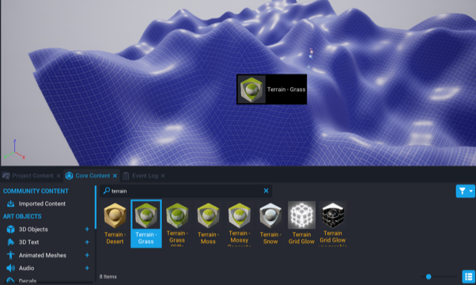
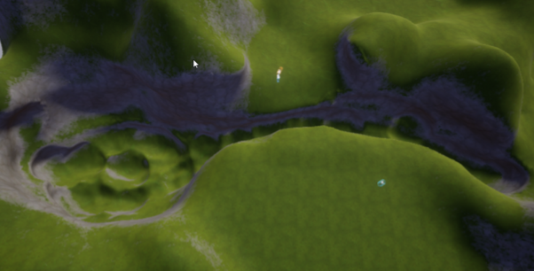
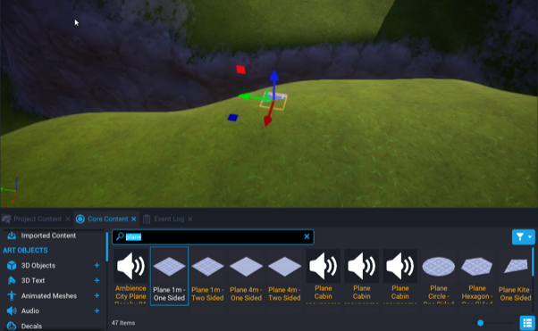
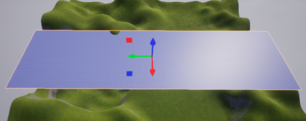
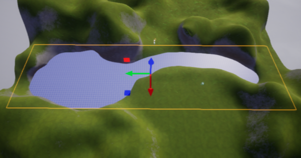
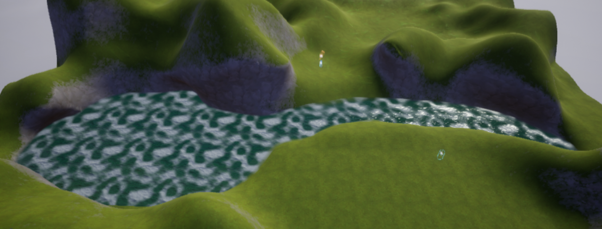
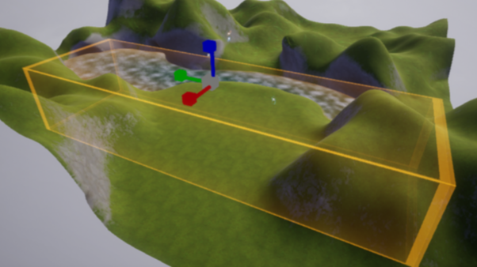
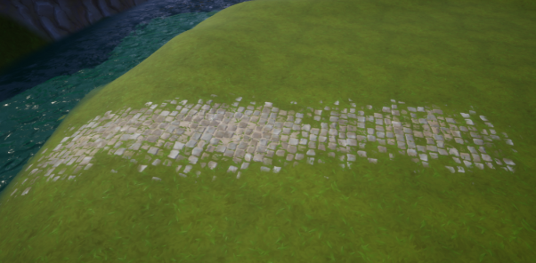
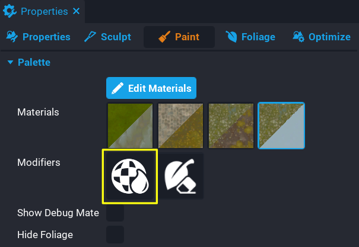

# Environment Art in Core

{: .center loading="lazy" }

## Overview

Learn how to generate, sculpt, and paint terrain, as well as adding foliage and a swimmable water post-process effect. This tutorial will focus on making a landscape with a path and river, but can be customized to build any natural environment.

- **Completion Time:** 30 minutes
- **Previous Knowledge:** [Introduction to the Core Editor](editor_intro.md)
- **Skills you will learn:**
    - Creating and sculpting terrain
    - Creating swimmable volumes
    - Painting terrain and foliage
    - Customizing sky templates
    - Adding rain visual effects

## The Terrain Creator

The Terrain Creator tool creates different landscapes using premade HeightMaps.

### Open the Terrain Creator

1. Start from a new empty project.
2. Click the  button to open the **Terrain Creator**.
 {: .image-inline-text .image-background .image-background}
3. Choose **Generate New Terrain** from the drop down menu.

{: .center}

### Generate Terrain

There are different options for types of terrain that can be generated in Core. You can click any of the terrain types to see a description of what it will generate.

1. Select **Rolling Hills**.
2. Change the **Terrain Size** to `256 x 256` and **Voxel Size** to `0.50` meters.
3. Click **Generate**.
4. Press  or ++equal++ to explore the newly generated terrain from a player perspective.
 {: .image-inline-text .image-background .image-background}

{: .center loading="lazy" }

### Rearrange the Scene

You may have fallen through your terrain, and you may see an unusually flat area where Default Floor still exists in the scene.

1. Find the **Spawn Point** in the **Hierarchy** and move it to a new spot, above the terrain.
2. Right click on **Default Floor** in the **Hierarchy** and select **Delete**.
3. Click the  **Terrain** button again to see that it now lists the **Terrain (Rolling Hills)** as **Primary**
 {: .image-inline-text .image-background .image-background}

!!! note
    Primary Terrain is the terrain in your scene with collision enabled. You can have multiple terrains, but only one that players can actually walk on.

### Apply a Material

Any material can be added to a terrain. However, materials that begin with "Terrain" are designed to be used for terrain and will apply different textures to the steeper and flatter parts of the terrain.

1. Open the **Materials** tab of **Core Content**.
2. Test out different materials by dragging them onto the terrain.
3. Search the **Core Content** tab for `terrain`.
4. Find **Terrain - Grass** and drag it onto the terrain.

{: .center loading="lazy" }

## Terrain Sculpting

### Open the Sculpt Menu

The shape of terrain can be changed using sculpting tools in the **Properties** menu.

1. Select the terrain in the **Hierarchy**.
2. Open the **Properties** window.
3. Click on the {: .image-inline-text .image-background } icon to open the **Sculpt** menu..

{: .center}

### Create a Flat Area

{ .center loading="lazy" }

1. In the **Tool** menu, select the {: .image-inline-text .image-background } **Level** tool.
2. Click on an area that is the ideal height, then drag around it to make the rest of the terrain match.

{ .center loading="lazy" }

### Carve out a Pond and Stream

1. In the **Tool** menu, select the {: .image-inline-text .image-background } **Surface** tool.
2. Change the mode from {: .image-inline-text .image-background } **Additive** to {: .image-inline-text .image-background } **Destructive**.
{: .image-inline-text .image-background}
3. Lower the **Strength** value in the **General** subcategory to `0.1`
4. Click and drag on the terrain to carve a bowl shape for a pond, and extend it to a river.

{: .center loading="lazy" }

### Smooth the Terrain

1. Change the sculpting tool from {: .image-inline-text .image-background } **Surface** to {: .image-inline-text .image-background } **Smooth**.
2. Click and drag the on the pond and river to give it a more natural appearance.

{: .center loading="lazy" }

## Water and Swimming

### Add a Plane to the Scene

1. Search for a **Plane 1m - One Sided** in the **Core Content** tab.
2. Drag the plane into the scene, above the spaces sculpted for the water.
3. Rename the plane to `Water Surface`.

{: .center loading="lazy" }

### Resize and Reposition the Plane

1. Resize the plane until it fills the pond and river.
2. Move the plane down until it fits nicely into the terrain for the pond and river.

{: .center loading="lazy" }

{: .center loading="lazy" }

### Add a Material

1. Search **Core Content** for `Water`.
2. Choose a water material, and drag it onto the plane.
3. Preview the scene to see the water in person.

{: .center loading="lazy" }

### Disable Collision on the Water

The water plane now has the appearance of water, but a player will walk over it, rather than into it, because the plane has collision by default.

{: .center loading="lazy" }

1. Select the **Water Surface**.
2. On the **Properties** window, and find the **Scene** section.
3. Change the **Collision** property to **Force Off** for **Game Collision** and **Camera Collision**.
4. Preview again to test that you can now pass through the water as a player.

### Use the Underwater Post Process

Now you can pass through the water, but once inside it looks like the water disappears. We can use the **Underwater Post Process** volume to achieve an underwater effect.

1. Find the **Underwater Post Process** volume under the **Post Processing** section of **Core Content**.
2. Drag it into your **Hierarchy** on top of the **Water Surface** object so it becomes a child..

{: .center loading="lazy" }
{: .center loading="lazy" }

### Resize the Underwater Post Process

The **Underwater Post Process** needs to be resized to match the size of the **Water Surface**.

1. Set the **Scale** of the **Underwater Post Process** to `1` for **x** and **y**.
2. Resize the **z** scale of the **Under Water Post Process** so it covers the depth of the pond and river.

{: .center loading="lazy" }

### Test Swimming

With the Underwater Post Process in the same area as the water, you should now start swimming automatically when you enter it. Press **Play** to preview and jump in the water. If it is deep enough, your character should switch to the swimming animation. You will also notice some distortion and color in the water. You can change how these work in the **Properties** menu for the Underwater Post Process.

{: .center loading="lazy" }

## Terrain Painting

### Open the Terrain Painting Tool

The terrain painting tool is also found in the terrain **Properties** tab. Terrains must have painting enabled, and this can be done through the painting menu.

1. Select the terrain in the **Hierarchy**.
2. Open the **Properties** window.
3. Click on the {: .image-inline-text .image-background } icon to open the **Paint** menu..
4. Click **Create new terrain material**

This will change the terrain's material to **Terrain Material**, but keep the grassy appearance.

### Choose Materials

To paint terrain, we need to create a palette of materials to use on the terrain. In the **Palette** section, select **Edit Materials**

Each of the Materials, labeled **Material1** through **Material4** corresponds to one of the visible materials in the **Paint** menu. Each has two Materials channels, one for flat sections of the material, **Material Base**, and another for the steeper, vertical sections of the game, **Material Side**.

### Paint a Path

1. In the Edit Materials menu, find **Material2**
2. Click the empty image next to **Material Base** to open the **Material Picker**
3. Select **Bricks Cobblestone Floor 01**
4. Close the Edit Materials menu.
5. Select the second Material in the Paint menu **Palette**
6. In the **General** section, increase the **Target Value** value to `0.4` to blend the brick material with the grass.
7. Click and drag where you want a path to create some stones coming out of the grass.

{: .center loading="lazy" }

!!! Hint "You can hold ++Alt++ while dragging on the scene to unpaint materials from areas that you recently painted."

### Paint the River Bottom

#### Choose the Materials

{: .center loading="lazy" }

1. In the Hierarchy, click the **eye** icon next to the Water Cube to hide it temporarily.
2. In the Edit Materials menu, find **Material3**
3. Set the **Material Base** to **Rocks River Bed 01**
4. Set the **Material Side** to **Grass and Soil** and close the Edit Materials menu.

#### Paint the River

1. Select the third Material in the Paint menu **Palette**
2. Click and drag along the river to cover it with the new materials.
3. Click the **eye** icon next to the Water Cube to show it again

{: .center loading="lazy" }

#### Preview the Materials Underwater

Press the **Play** button to preview the new materials under the Underwater Post Process effect by swimming through the river.

{: .center loading="lazy" }

### Paint the River Bank

#### Using a Mask

Masks allow you to use more complex shapes in applying a new material.

1. In the **Paint** panel, select material 2 that is used for the path.
2. In the **Mask** section, check the **Use Mask** box.
3. Click the image icon in the **Mask** property, and select **Cells**

{: .center loading="lazy" }

{: .center loading="lazy" }

#### Using Wetness

Terrain materials can be further customized. **Wetness** allows you to make areas look soaked by making them darker and shinier.

1. Select **Wetness** from the **Modifiers** section of the Palette.
2. Click and drag on the edge of the riverbank to give an impression that it is soaked on the edges.

{: .center loading="lazy" }

{: .center loading="lazy" }

## Foliage

In addition to painting textures, objects can be added to the terrain materials as **Foliage**. These will not have collision and will be made to work better on a machine than just adding lots of objects.

### Open the Foliage Tool

In the **Properties** window with the terrain selected, click the tab next to **Paint** called **Foliage**

### Choose Foliage

1. Click the **Add Foliage** button.
2. In the **Static Mesh Picker**, search for `grass` to find **Grass Tall**.

### Access Foliage Settings

You should have grass springing up on your terrain as soon as you add the object. Click on the object image that appears now in the **Foliage** tab to see its customizable properties.

{: .center loading="lazy" }

### Grow Grass along the River

Next, we're going to change the river to look more like a marsh by filling it with tall grasses.

{: .center loading="lazy" }

1. In the **Paint** panel, edit the materials and for **Material4** select the **Grass Basic** material for **Base**, and **Grass and Soil** for **Side**.
2. Select **Grass Tall** from the **Foliage** panel, and select **Material Channel** 4 to move the grass to that material channel.
3. Under **General**, change the **Distance Between Instances** to `2.0 m`.
4. Under **Spawn Settings**, select **Lock XY** for the **Scaling** property.
5. Set the **Min** and **Max** for **Scale XY** to `1.4 x`.
6. Set the **Scale Z** property to have a **Min** of `1.5 x`, and a **Max** of `3.5 x`.
7. In the **Paint** panel, select material 4 and paint along the river bed to add grass.

{: .center loading="lazy" }

!!! Hint
    If foliage is spawning in unexpected places, use the **Show Debug Material** option in the **Paint** terrain **Palette** menu to check which material is being applied in any area of the terrain.

## Stormy Ambience

In the next few steps, we will focus on making the scene overcast and rainy, as well as adding props. There are many options to customize for different effects.

### Change the Sky

The **Default Sky** in Core is composed of three parts, **Sun Light** and **Sky Light** which are currently the only two sources of light in the scene, and **Sky Dome** which controls the appearance of the sky. Each of these can be customized through the **Properties** menu.

There are other complete sky templates available, as well as the different versions of these individual components.

1. Search for `sky overcast` in **Core Content** and find the **Sky Overcast 01** template.
2. Drag the sky template into the scene.
3. Delete the **Default Sky** template.

{: .center loading="lazy" }

### Customize the Sky

1. Open up the **Sky Overcast 01** folder in the **Hierarchy**.
2. Select the **Environment Fog Default VFX** and open the **Properties** window.
3. In the **Smart** section, change the **Color** property to a bright white.
4. Increase the **Fog Density** property to whatever value gives the scene a misty look.

### Add Rain

1. In **Core Content** search for `rain` and add the **Rain Volume VFX** and **Rain Splash Volume VFX** objects to your scene.
2. Place the **Rain Volume VFX** object up in the sky, and expand it using the **Transform Scale** tool to cover the area with droplets falling from the sky
3. Place the **Rain Splash Volume VFX** on the ground and expand it to cover the area under the rain to create splashes on the ground.

{: .center loading="lazy" }

### Finish the Scene

The final step is to add structures and props that finish the scene. See the [Complex Modeling](modeling.md) and [Community Content](community_content.md) reference to learn about creating props and using props made by other Core creators.

## Learn More

<lite-youtube videoid="KFYlOzx7wm0" playlistid="PLiTIshJkGqBNUC2D5R24wRJWi8d6Egxbn" playlabel="Environment Art"></lite-youtube>
{: .video-container }

[Custom Materials](materials.md) | [Complex Modeling](modeling.md) | [Community Content](community_content.md) | [Visual Effects](vfx_tutorial.md)
