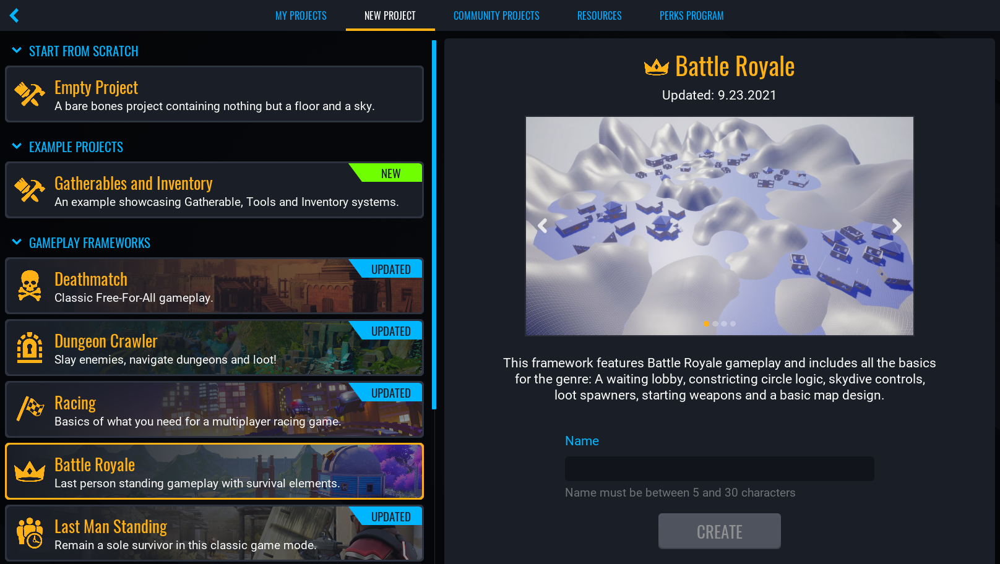
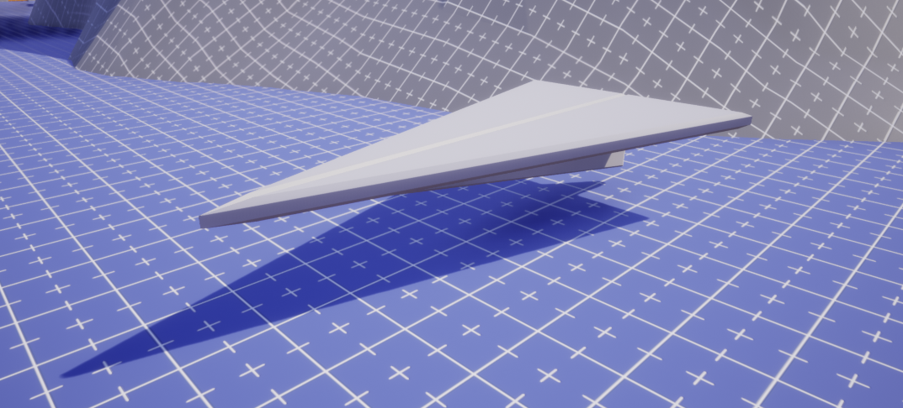
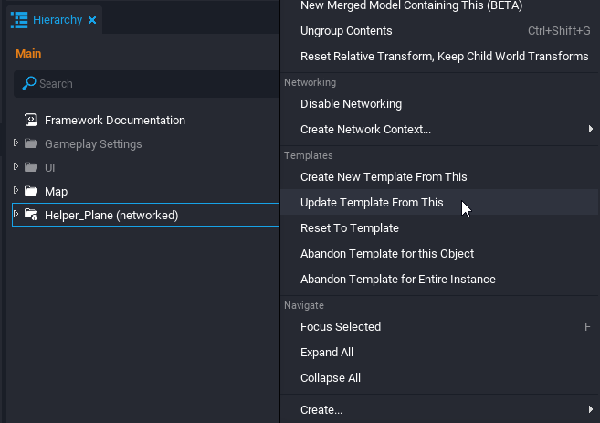
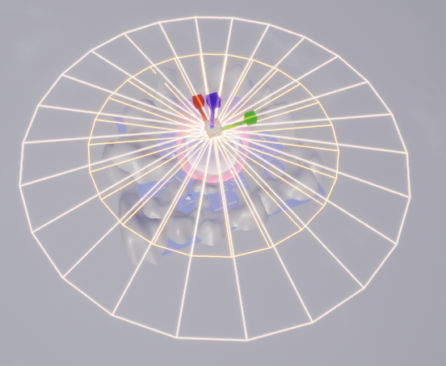
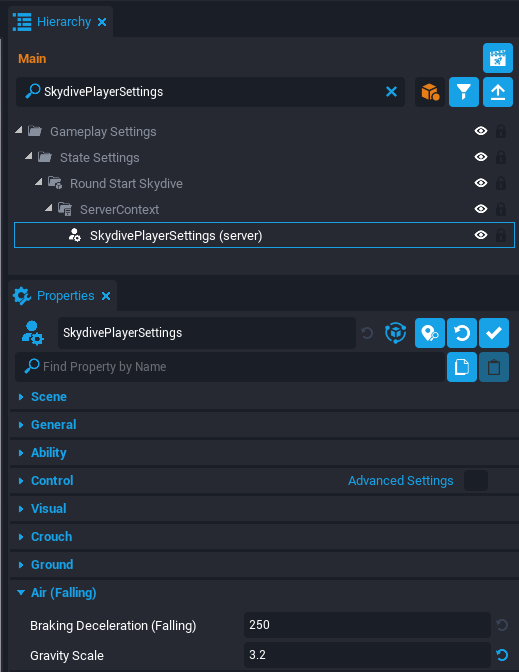
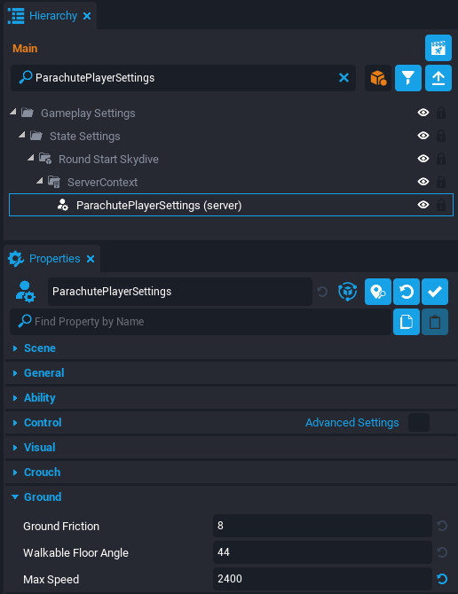
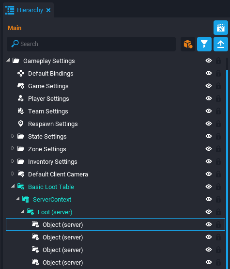
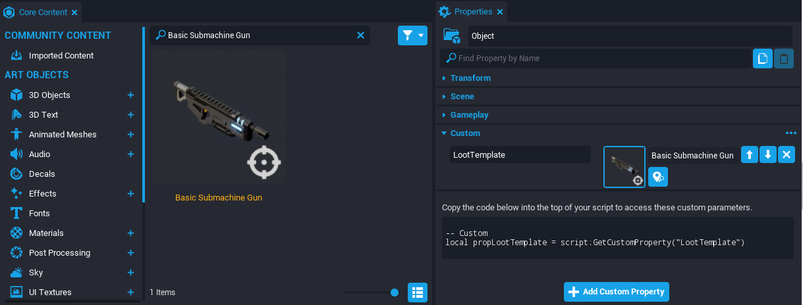

# Create an Battle Royale in Core

## Overview

The Battle Royale framework features starting logic for game where the player must skydive to a starting location, the play area shrinks over time, and the last player standing wins. It also includes random weapon spawns using a loot table.

## Creating a Framework Game

### Open the **NEW PROJECT** Menu

1. With Core open, click the **CREATE** tab in the top menu bar.
2. Click the **NEW PROJECT** tab at the top of the **CREATE** menu.

{: .center loading="lazy" }

### Select the **Battle Royale** Framework

1. In the **GAMEPLAY FRAMEWORKS** section, select **Battle Royale**.
2. In the right side panel, name your project.
3. Click **CREATE**.

{: .center loading="lazy" }

## Testing the Framework

### Preview in Multiplayer

The framework requires a minimum of two players to play, so you will need to test in **Multiplayer Preview Mode**.

{: .center loading="lazy" }

1. Click  to switch the Preview Mode to Multiplayer.
{: .image-inline-text .image-background }
2. Select the **2 Players** option for the number of players.
3. Press  to start the preview. This will open a separate game window for each player.
{: .image-inline-text .image-background }

### Test the Features

Test out the following features in the framework:

- Players spawn on the ground.
- After a couple seconds, the players will be moved inside of a Paper Plane.
- Players can drop from the plane using ++space++.
- Players can activate the parachute while dropping using ++space++.
- Players will be dealt damage if outside the Play Zone.
- The Play Zone will shrink over time.
- Loot Spawners around the map contain one of three weapons:
    - Basic Pistol
    - Basic Shotgun
    - Basic Rifle
- The round ends once there is one player remaining alive.

!!! note "The video below has modified game settings to speed up the testing, which will be covered in this tutorial."

    <video autoplay muted playsinline controls loop class="center" style="width:100%">
        <source src="/img/FrameworksBR/FrameworksBR_Testing.mp4" type="video/mp4" />
    </video>

## Modifying the Airplane Template

The frameworks starts with the players inside of a paper airplane. You can modify the appearance of the airplane by updating the **Helper Plane** template.

{: .center loading="lazy" }

### Deinstance the Original Template

1. In the **Project Content** window, search for the `Helper Plane` template.
2. Drag the template into the **Viewport** window.
3. Right click the template and select **Deinstance this Template**.

!!! tip "You can focus the camera on an object by selecting the object in the Hierarchy and pressing the ++F++ key."

    <video autoplay muted playsinline controls loop class="center" style="width:100%">
        <source src="/img/FrameworksBR/FrameworksBR_HelperPlaneAdded.mp4" type="video/mp4" />
    </video>

### Change the Colors

Inside the Hierarchy, navigate to the **Geo** group that is inside the ClientContext of the **Helper_Plane**. There are three components that make up the airplane. One at a time, select a component and change the **Color Override** property inside the **Properties** window.

{: .center loading="lazy" }

### Add a Decal

You can continue customizing the airplane by using decals. Decals can be used to display a graphic on a surface.

1. Inside the **Core Content** window, find the **Art Objects** category and **Decals** subcategory.
2. Drag and drop the **Decal Military Symbols 01** decal into the **Geo** group within the Hierarchy.
3. Position the decal onto plane.
4. Rotate and Scale the decal to your liking.

{: .center loading="lazy" }

!!! info
    Decals can also be modified such as changing the color. With the decal selected, open the **Properties** window and scroll down to the **Smart** category. Not all decals have the same properties. Some decals have a **Shape Index** property that change the graphic to different variations. For example, there are multiple military symbols available inside the **Decal Military Symbols 01** decal.

    <video autoplay muted playsinline controls loop class="center" style="width:100%">
        <source src="/img/FrameworksBR/FrameworksBR_HelperPlaneDecal.mp4" type="video/mp4" />
    </video>

### Update the Template

Once you are done adding changes to the plane model, right click the **Helper_Plane** and select **Update Template From This**. After, delete **Helper_Plane** from the **Hierarchy**.

{: .center loading="lazy" }

### Test the Game

The airplane template should now be modified in game and is ready to test. Make sure to enable **Multiplayer Preview Mode** before pressing **Play**.

{: .center loading="lazy" }

## Editing the Drop Zone

The **Drop Zone** is a cylindrical area that represents where the player can drop from the plane. The plane will spawn near the edge of the cylinder at random and then fly across to the other side.

{: .center loading="lazy" }

### Focus on the Drop Zone

Inside the **Hierarchy**, search for `DropArea`. Select the **DropArea** object and press ++F++ to focus the scene on the large cylinder mesh.

{: .center loading="lazy" }

### Scale the Drop Zone

Press ++R++ to enter scale mode. Change the X and Y scale so the Drop Zone is a different size.

{: .center loading="lazy" }

## Changing the Falling Player Movement

The player has two different falling phases. When the player drops from the plane, they enter a free fall known as the **Skydive** phase. When the player presses ++space++ while skydiving then they transition to the **Parachute** phase.

### Change Skydive Settings

In the Hierarchy, search for `SkydivePlayerSettings`. Select the **SkydivePlayerSettings** and open the Properties window. Increase the **Gravity Scale** property to `3.2` and notice how the player will fall down twice as fast with no parachute.

{: .center loading="lazy" }

### Change Parachute Settings

In the Hierarchy, search for `ParachutePlayerSettings`. Select the **ParachutePlayerSettings** and open the Properties window. In the **Ground** section, change the **Max Speed** property to `2400`. This will increase the max speed moving forward while parachuting.

{: .center loading="lazy" }

## Changing the Play Zone

A main feature in most Battle Royale games is that the area of play is shrinking to gradually increase the proximity of all players. The **Play Zone** is a cylindrical area where the player will *not* receive constant damage. The Play Zone will shrink in size for a certain amount of intervals.

### Change the Play Zone Settings

In the Hierarchy, search for `Constricting Play Zone`. Select the **Constricting Play Zone** group and open the **Properties** window. The object has many **Custom Properties** that will be described below:

| Property Name | Description |
| --- | --- |
| Phase Count | The number of phases. The Play Area will shrink in size as the phases increase. It will stop shrinking once the last phase occurs. |
| ZoneSizeRatio | The ratio for the Play Area to shrink after each phase. For example, `0.7` signifies the area will shrink down to 70% of its current phase size. |
| StaticTime | The amount of seconds each phase will last before it starts shrinking. |
| Closing Time | The amount of seconds it takes to shrink before starting the next phase. |
| BaseDamageRate | The amount of damage per second applied to the players outside the Play Zone during phase 1. |
| DamageMultiplier | The amount multiplied to BaseDamageRate after each phase. |
| UseRoundTiming | The toggle to restart the Play Zone after each round. |
| ActivationDelay | The amount of seconds until the first phase begins. |

### Change the Initial Play Zone Size

The Play Zone starts off quite large. You can decrease the starting size of the the Play Zone, which leads to an increase in the pace of battle.

1. In the Hierarchy, search for `InitialZone`.
2. Select the **InitialZone** object.
3. Focus on the cylinder mesh by pressing ++F++.
4. Press ++R++ to enter scale mode.
5. Change the X and Y scale so the initial Play Zone is a different size.

{: .center loading="lazy" }

## Changing the Loot Table

There are several **Loot Spawner** objects placed throughout the map that contain a random weapon for the player to pick up. The **Loot Table** is a group of objects and each object has a property for a weapon template. The Loot Spawners have an equally random chance of containing one of the weapons from the Loot Table.

### Add a New Object to the Loot Table

1. In the Hierarchy, navigate to **Basic Loot Table** folder inside the **Gameplay Settings**.
2. Then navigate to the **Loot** group inside the **ServerContext**.
3. Notice there are three **Object** groups inside representing the three different weapons in the Loot Table.
4. Select one of the **Object (server)**.
5. Duplicate it using the keyboard shortcut ++Ctrl++ + ++W++.

{: .center loading="lazy" }

### Change Weapon in the Loot Table

Core Content has many default weapons ready to be used. If you wish to learn how to create custom weapons, then refer to the [Weapons Reference](../references/weapons.md).

1. Select the new **Object (server)**.
2. Open the **Properties** window and find the **LootTemplate** property.
3. Now open the **Core Content** and search for `Basic Submachine Gun` template.
4. Drag and drop the submachine gun template into the **LootTemplate** property.

{: .center loading="lazy" }

## Learn More

[Weapons Reference](../references/weapons.md) | [Publishing Your Game](../getting_started/publishing.md) | [Environment Art Tutorial](../tutorial/environment_art.md) | [Abilities Tutorial](../tutorials/ability_tutorial.md)
