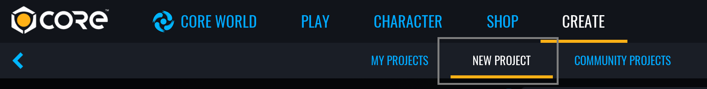

# Create an Battle Royale in Core

## Overview

The Battle Royale framework features a game where the player must skydive to a starting location, the play area shrinks over time, and the last player standing wins. It will also include random weapon spawns using a loot table.

## Create a Framework Game

To get started, use the **CREATE** menu to make a new project

### Open the **NEW PROJECT** Menu

{: .center loading="lazy" }

1. With Core open, click the **CREATE** tab in the top menu bar.
2. Click the **NEW PROJECT** tab at the top of the **CREATE** menu.

### Select the **Battle Royale** Framework

<!--- TODO image of BR framework choice --->

1. In the **GAMEPLAY FRAMEWORKS** section, select **Battle Royale**.
2. In the right side panel, name your project.
3. Click **CREATE**.

## Modify the Airplane Template

The game starts with the players inside of a paper airplane. You can modify the appearance of the airplane by updating the **Helper Plane** template.

<!--- TODO add image of default airplane --->

### Deinstance the Original Template

1. In the **Project Content** window, search for the `Helper Plane` template.
2. Drag the template into the **Hierarchy**.
3. Right click the template and select **Deinstance this Template**

<!--- TODO add image of hierarchy --->

### Change the Colors

Navigate to the **Helper_Plane > ClientContext > Geo** group in the **Hierarchy**. There are three components that make up the airplane. One at a time, select a component and change the **Color Override** property inside the **Properties** window.

<!--- TODO add image of Color Override property --->

### Add a Decal

You can also add more components to the airplane. Decals can be used to display a graphic on a surface.

1. Inside the **Core Content** window, find the **Art Objects > Decals** category.
2. Drag and drop the `Decal Military Symbols 01` decal into the **Geo** group within the **Hierarchy**.
3. Position the decal onto plane.
4. Rotate and Scale the decal to your liking.

<!--- TODO add image of decal on plane --->

!!! info
    Decals can also be modified such as changing the color. With the decal selected, open the **Properties** window and scroll down to the **Smart** category. Some decals have a **Shape Index** property that change the graphic to different variations.

<!--- TODO add image of decal properties --->

### Update the Template

Once all changes are completed, right click the **Helper_Plane** and select **Update Template From This**. After, delete **Helper_Plane** from the **Hierarchy**.

<!--- TODO add image of updating template --->

### Test the Game

The airplane template should now be modified in game and is ready to test. The game requires at least two players to begin, so make sure to enable **Multiplayer Preview Mode** before pressing **Play**.

{: .center loading="lazy" }

## Edit the Drop Zone

The "Drop Zone" is a cylindrical area that represents where the player can drop from the plane. The plane will spawn near the edge of the cylinder at random and then fly across to the other side.

<!--- TODO image of drop zone cylinder --->

### Focus on the Drop Zone

Inside the **Hierarchy**, navigate to the **Gameplay Settings > State Settings > Round Start Skydive > ServerContext** folder. Select the **DropArea** and press ++F++ to focus the scene on the large cylinder mesh.

<!--- TODO image of hierarchy --->

### Scale the Drop Zone

Press ++R++ to enter scale mode. Change the X and Y scale so the Drop Zone is a different size.

<!--- TODO image of larger drop zone --->

## Change the Falling Player Movement

The player has two different falling phases. When the player drops from the plane, it enters a free fall known as the **Skydive** phase. When the player presses ++space++ while skydiving then it will transition to **Parachute** phase.

### Change Skydive Settings

Navigate to **Gameplay Settings > State Settings > Round Start Skydive > ServerContext**. Select the **SkydivePlayerSettings** and open the Properties window. Increase the **Gravity Scale** property to `3.2` and notice how the player will fall down twice as fast with no parachute.

<!--- TODO image of properties window --->

### Change Parachute Settings

In the same **ServerContext** folder as the **SkydivePlayerSettings**, select the **ParachutePlayerSettings**. In the **Properties** window, change the **Ground > Max Speed** property to `2400`. This will increase the max speed moving forward while parachuting.

<!--- TODO image of properties window --->

## Changing the Play Zone

The "Play Zone" is a cylindrical area where the player will *not* receive constant damage. The Play Zone will shrink in size for a certain amount of intervals.

### Change the Play Zone Settings

Navigate to **Gameplay Settings > Zone Settings > Constricting Play Zone** and open the **Properties** window. The object has many **Custom Properties** that will be described below:

| Property Name | Description |
| --- | --- |
| Phase Count | The number of phases. The Play Area will shrink in size as the phases increase. It will stop shrinking once the last phase occurs. |
| ZoneSizeRatio | The ratio for the Play Area to shrink after each phase. For example, `0.7` signifies the area will shrink down to 70% of its current phase size. |
| StaticTime | The amount of seconds each phase will last before it starts shrinking. |
| Closing Time | The amount of seconds it takes to shrink before starting the next phase. |
| BaseDamageRate | The amount of damage per second applied to the players outside the Play Zone during phase 1. |
| DamageMultiplier | The amount multiplied to BaseDamageRate after each phase. |
| UseRoundTiming | The toggle to restart the Play Zone after each round. |
| ActivationDelay | The amount of seconds until the first phase begins. |

### Change the Initial Play Zone Size

1. Navigate to **Gameplay Settings > Zone Settings > Constricting Play Zone > ServerContext**.
2. Select the **InitialZone** object.
3. Focus on the cylinder mesh by pressing ++F++.
4. Press ++R++ to enter scale mode.
5. Change the X and Y scale so the initial Play Zone is a different size.

<!--- TODO image of smaller play zone --->

## Changing the Loot Tables

There are several LootSpawner object placed throughout the map that randomly roll a weapon from the Loot Table list. Each roll on the Loot Table has an equal chance to be rolled.

### Add a New Roll to the Loot Table

Navigate to **Gameplay Settings > Basic Loot Table > ServerContext > Loot** group and notice there are three objects inside representing the three different weapons in the Loot Table. Select one of the **Object (server)** and duplicate it using the keyboard shortcut ++Ctrl++ + ++W++.

<!--- TODO image of hierarchy for new object --->

### Change Weapon in the Loot Table

1. Select the new **Object (server)**.
2. Open the **Properties** window and find the **LootTemplate** property.
3. Now open the **Core Content** and search for `Basic Submachine Gun` template.
4. Drag and drop the submachine gun template into the **LootTemplate** property.

<!--- TODO image of properties for new weapon --->

## Learn More

[Publishing Your Game](publishing.md) | [Dungeon Crawler Framework Reference](dungeon_framework.md) | [Environment Art Tutorial](environment_art.md) | [Weapons Tutorial](weapons.md)
