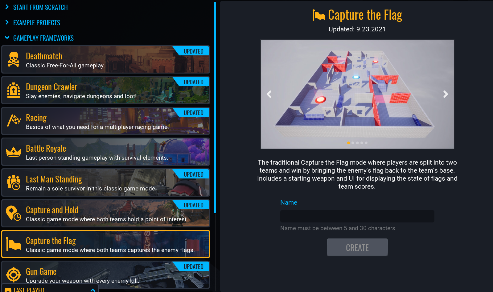
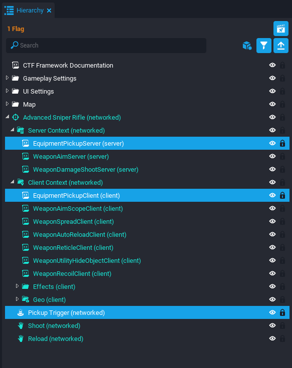
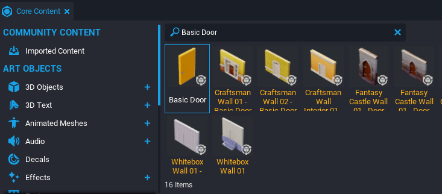

# Capture The Flag In Core

## Capture The Flag Overview

The Capture The Flag framework contains two different game variations placed in separate scenes. The first is 1 Flag where the two teams must try to capture a single neutral flag and bring it back to their home base safely. The second is 2 Flag where each base has a flag and teams focus on stealing the flag from the opposing team's base.

## Creating a Framework Game

To get started, use the **CREATE** menu to make a new project.

### Open the **NEW PROJECT** Menu

{: .center loading="lazy" }

1. With Core open, click the **CREATE** tab in the top menu bar.
2. Click the **NEW PROJECT** tab at the top of the **CREATE** menu.

### Select the **Capture the Flag** Framework

{: .center loading="lazy" }

1. In the **GAMEPLAY FRAMEWORKS** section, select **Capture the Flag**.
2. In the right side panel, name your project.
3. Click **CREATE**.

## Switching Between Scenes

The framework has two different game modes that are in different scenes. Testing both modes requires knowing how to switch scenes in Core.

### Open the Scenes Window

The **Scenes** window displays all the available scenes in the project. By default, the project should have the Scenes window open next to the Properties window. The current scene displayed is highlighted orange, which should be 1 Flag.

!!! note
    You can reopen the **Scenes** window by going to **Window > Scenes** in the top menu bar.

{: .center loading="lazy" }

### Test 1 Flag Scene

The game will not start until there are at least two players so **Multiplayer Preview Mode** must be enabled to test the game.

{: .center loading="lazy" }

1. Click  to switch the Preview Mode to Multiplayer.
    {: .image-inline-text .image-background }
2. Select the 2 Players option.
3. Press  to start the preview. This will open a separate game window for each player.
    {: .image-inline-text .image-background }
4. On one of the game windows, grab the neutral flag in the center of the map and bring it back to capture zone for your team. The score should increase by one and reset the flag to the neutral zone.

    <video autoplay muted playsinline controls loop class="center" style="width:100%">
        <source src="/img/FrameworksCTF/FrameworksCTF_1Flag.mp4" type="video/mp4" />
    </video>

### Load the Second Scene

Reopen the **Scenes** window and click on the 2 Flag scene. A prompt will display asking if you would like to continue loading a new scene. Click the Load button to continue.

    <video autoplay muted playsinline controls loop class="center" style="width:100%">
        <source src="/img/FrameworksCTF/FrameworksCTF_SwitchingScenes.mp4" type="video/mp4" />
    </video>

### Test 2 Flag Scene

With the 2 Flag scene displayed, press play to start the preview. The neutral center flag is no longer present and players must travel to the enemy's capture zone to acquire their flag. Also both flags are available to be captured at the same time.

    <video autoplay muted playsinline controls loop class="center" style="width:100%">
        <source src="/img/FrameworksCTF/FrameworksCTF_2Flag.mp4" type="video/mp4" />
    </video>

### Switch back to 1 Flag Scene

Now that both scenes have been explored, this tutorial will move forward using the 1 Flag scene. Inside the **Scenes** window, select the 1 Flag scene and click the Load button.

{: .center loading="lazy" }

!!! info You can find more information about **Scenes** in the [Scenes Reference](scenes.md)

## Change the Starting Weapon

The default starting weapon is basic rifle that does not allow the player the aim. This weapon can be easily changed using template objects from **Core Content**.

### Find a New Weapon

Inside the **Core Content** window, search the keyword `Advanced Sniper Rifle` to find a template of a long range weapon. Drag the Advanced Sniper Rifle template into the **Hierarchy** window.

{: .center loading="lazy" }

### Create a New Weapon Template

The Advanced Sniper Rifle template has children scripts and a trigger box for picking up the weapon from the ground. Since the player will spawn with the weapon in their hands, there will be no need for this functionality.

1. Right click the **Advanced Sniper Rifle (networked)** object in the **Hierarchy** and select **Deinstance This Object**.
2. Select the **Pickup Trigger (networked)** child and press ++delete++ to delete it.
3. Delete the **EquipmentPickupServer (server)** script from within the **Server Context (networked)** folder.
4. Delete the **EquipmentPickupClient (client)** script from within the **Client Context (networked)** folder.
5. Right click the **Advanced Sniper Rifle (networked)** object and select **Create New Template From This**.
6. Name the template `Sniper Rifle` and then create the new template.
7. Delete **Sniper Rifle (networked)** object from the **Hierarchy**.

{: .center loading="lazy" }

### Replace the Starting Weapon

You can now use the Sniper Rifle template to replace the starting weapon.

1. Inside the **Hierarchy**, select the **Gameplay Settings > Starting Weapon** group.
2. Open the **Properties** window and scroll down to the **Custom** section to see the custom properties.
3. Open the **Project Content** window and find the **Sniper Rifle** template within **My Templates**.
4. Drag and drop the Sniper Rifle template into the **EquipmentTemplate** custom property.

{: .center loading="lazy" }

### Test the New Weapon

Play the game and test out the new weapon. You should be able to aim using the right mouse button.

    <video autoplay muted playsinline controls loop class="center" style="width:100%">
        <source src="/img/FrameworksCTF/FrameworksCTF_SniperTest.mp4" type="video/mp4" />
    </video>

## Modify Player Movement

The **Gameplay Settings** folder contains more than just the starting weapon template. It also controls the player movement settings, such as player speed and max jumps.

### Open Player Settings

Inside the Hierarchy, expand the **Gameplay Settings** folder and then expand the **Third Person Camera Settings** group. Click on **Player Settings** and then open the **Properties** window.

{: .center loading="lazy" }

### Speed up the Player

The **Properties** window for **Player Settings** will have multiple sections for each type of setting. Within the **Ground** section, change the **Max Speed** property to `1280`. Test the game to see if the player moves twice as fast.

{: .center loading="lazy" }

### Explore Player Settings

You can continue exploring the other sections of the Property window to see all player settings. One example is changing the **Jump Max Count** to `2` which enables double jumping.

    <video autoplay muted playsinline controls loop class="center" style="width:100%">
        <source src="/img/FrameworksCTF/FrameworksCTF_PlayerSettingsJump.mp4" type="video/mp4" />
    </video>

## Increase the Score Limit

The score is capped at 3 currently but it can be changed. It will require changing the game rules and updating the UI.

### Change the Limit

Inside the Hierarchy, expand the **Gameplay Setting > Game State Settings** folder. Select the **Round Teamscore Limit** group and change the **TeamScoreLimit** custom property to `4`.

{: .center loading="lazy" }

!!! note
    Inside the **Game State Settings** folder, the **Lobby Required Players** group can be used to test the game quicker by changing the **RequiredPlayers** and **Countdown Time** custom properties to `1`. Just make sure to change it back before publishing the game.

### Update the UI

The game should now end when the score is 4; however, the UI is still displaying a max score of 3. The next steps will be changing custom properties in the **UI Settings** folder.

1. Inside the Hierarchy, expand the **UI Settings > Score UI** folder.
2. Click on the **Team 1 Score UI** group and open the **Properties** window.
3. Change the **MaxScore** custom property to `4`.
4. Click on the **Team 2 Score UI** group and also change the **MaxScore** custom property to `4`.

{: .center loading="lazy" }

### Testing the Game

Play the game and check if the score does indeed cap at 4 before ending.

    <video autoplay muted playsinline controls loop class="center" style="width:100%">
        <source src="/img/FrameworksCTF/FrameworksCTF_ScoreLimitTest.mp4" type="video/mp4" />
    </video>

## Creating a Damageable Door

An easy thing to add to any game and make it instantly cooler are **Damageable Objects**. Some examples are an exploding barrel, bursting box, or breakable door that can be destroyed with the player's weapon.

### Adding a Damageable Object

Navigate to the **Core Content** window and scroll down to the **Game Objects** section. There you will find the **Gameplay Objects** category. Drag and drop a **Damageable Object** template into the **Hierarchy**.

{: .center loading="lazy" }

### Adding an Interactive Door

Core has a prebuilt door template that can be opened from both sides.

1. Search for `Basic Door` in the **Core Content** window.
2. Drag and drop the **Basic Door** template into the **Hierarchy**.

{: .center loading="lazy" }

### Combining the Damageable Object and Door

1. Inside the Hierarchy, right click on the **Basic Door** group and select **Deinstance This Object**.
2. Drag and drop the **Basic Door** group into the **Damageable Object**.
3. Select the **Make Children Networked** option when a prompt appears.

{: .center loading="lazy" }

### Customizing the Door

The door will need to be transformed in order to be properly inside of a doorway.

1. Select the **Damageable Object** in the Hierarchy.
2. Use ++W++ to enable Translation mode and move the door to the doorway.
3. Use ++E++ to enable Rotation mode and rotate the door if needed.
4. Navigate to the **Damageable Object > Basic Door > Rotation Root > Geo_StaticContext** folder.
5. Select the **Whitebox Door 01** object inside of the folder.
6. Use ++R++ to enable Scale Mode and make door big enough to fit in the doorway.

{: .center loading="lazy" }

### Adding a Damage Effect

Currently, the door will disappear after being destroyed but it looks like it just vanishes. An effect can be added to make it more realistic.

1. In **Core Content**, search for `Damageable Crate`.
2. Drag and drop the template into the **Hierarchy**.
3. Select the **Damageable Crate** and open the **Properties** window.
4. Click the **Find in Asset Catalog** button  next to the **Destroy on Death Client Template** property. The **Project Content** window should open with the **Crate Damaged Effect** template highlighted.
   {: .image-inline-text .image-background }
5. Select the **Damageable Object** in the Hierarchy and open the **Properties** window.
6. Drag and drop the **Crate Damaged Effect** template into the **Destroy on Death Client Template** property.
7. Delete the **Damageable Crate** from the Hierarchy.

{: .center loading="lazy" }

### Test the Damageable Door

Play the game and find the door object. Get close to the door and try to open it. Then try shooting it to see the damage effect.

    <video autoplay muted playsinline controls loop class="center" style="width:100%">
        <source src="/img/FrameworksCTF/FrameworksCTF_DamageableDoorTest.mp4" type="video/mp4" />
    </video>

### Create a New Template

Right click the **Damageable Object** in the Hierarchy and select Create New Template From This. Rename it as `Damageable Door`. Now more doors can be added by dragging them from the **Project Content** window.

{: .center loading="lazy" }

## Learn More

[Publishing Your Game](../getting_started/publishing.md) | [Scenes](../reference/scenes.md) | [Damageable Objects](../reference/damageable_objects.md) | [Weapons Tutorial](../tutorials/weapons_tutorial.md)
