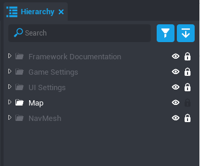
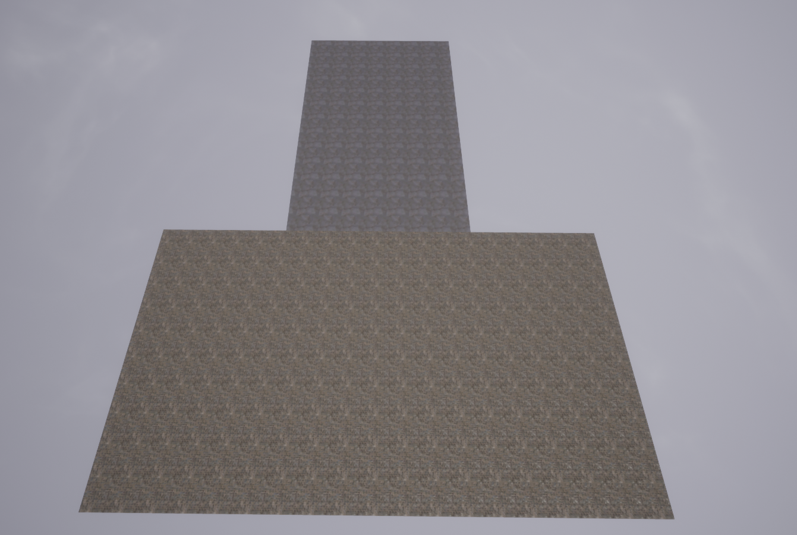
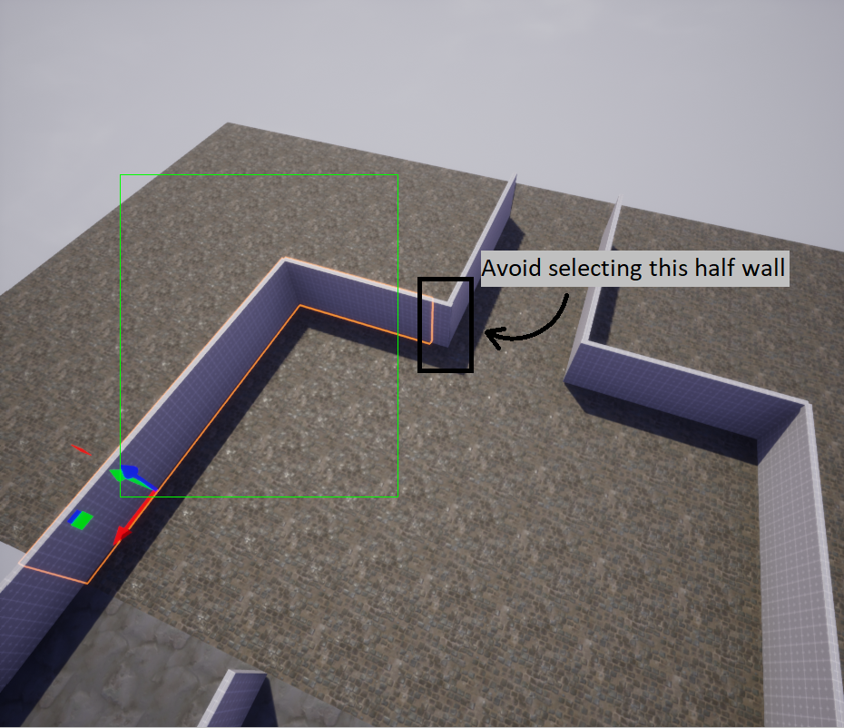
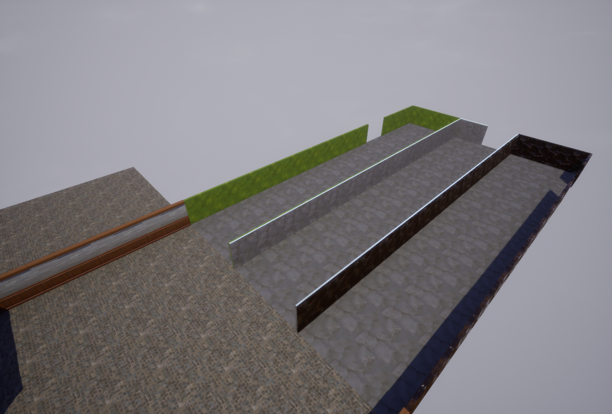
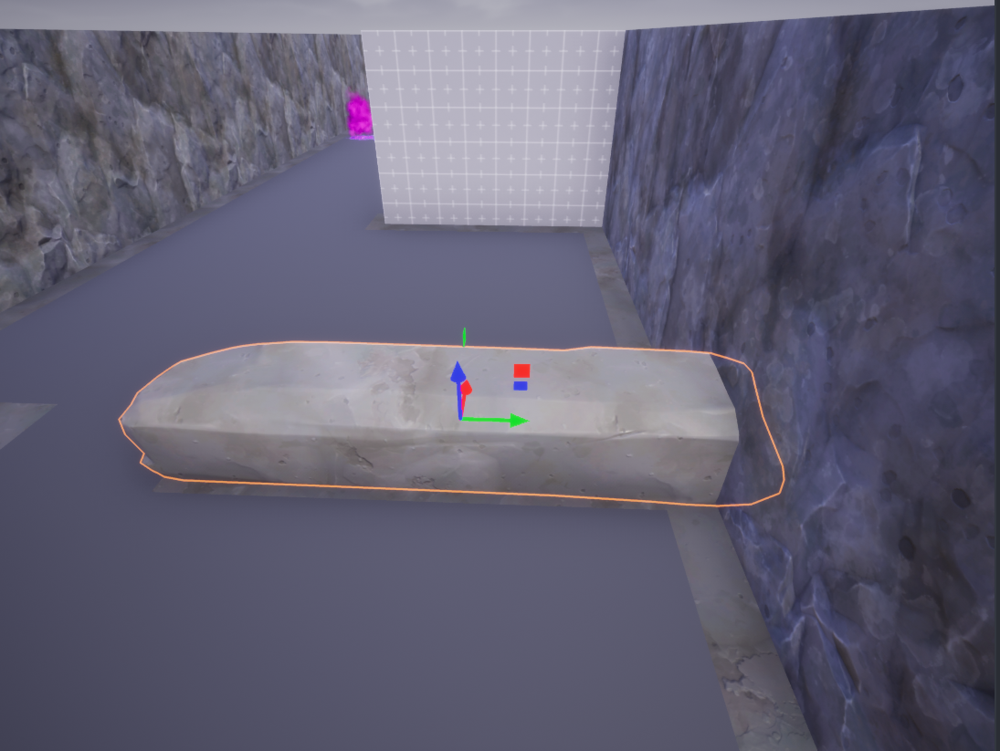
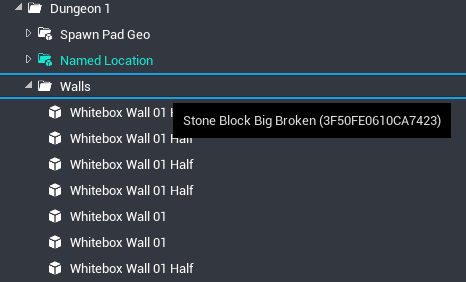
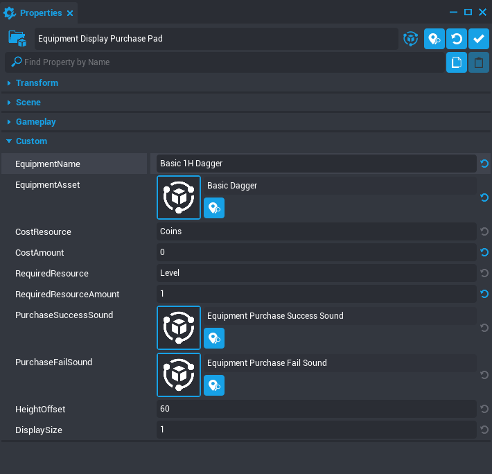
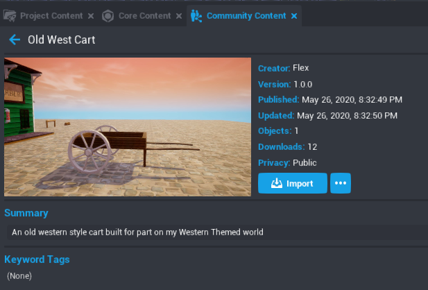
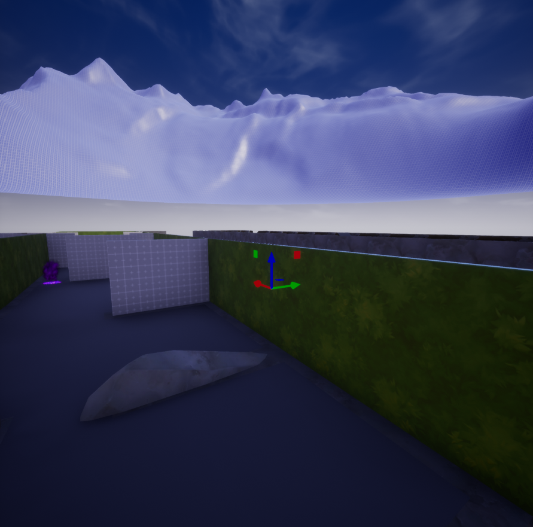

# Créer un RPG dans Core

## Créer un jeu à partir d'un modèle

Pour commencer, utilisez le menu **Créer** pour démarrer un nouveau projet.

### Cliquer sur **Créer nouveau**

1. Lorsque Core est ouvert, cliquez sur l'onglet **Créer** dans le menu de gauche.
2. Cliquer sur **Créer un nouveau jeu**

### Sélectionner le modèle **Dungeon Crawler**

1. Cliquez sur **Voir les modèles** sous l'option **Modèles de jeu Core**.
2. Cliquez sur **Dungeon Crawler**.
3. Donnez un nom à votre projet.
4. Cliquez sur **Créer**.

## Bâtir les murs et les sols

### Verrouiller le projet

Ce modèle contient de nombreux scripts et éléments essentiels qu'il serait fâcheux de modifier accidentellement. Pour empêcher cela, utilisez la fonction **Verrouiller** .
{: .image-inline-text .image-background }

1. Dans la **Hiérarchie**, appuyez sur le bouton **Réduire tout** pour fermer tous les dossiers.
2. Cliquez sur l'icône **Verrouiller**  à côté de chaque dossier, à l'exception du dossier **Carte**.
{: .image-inline-text .image-background }

{: .center loading="lazy" }

### Cacher des éléments pour se concentrer sur une seule partie

Ensuite, nous allons cacher des éléments du projet afin de travailler sur une partie à la fois. Cela présente deux avantages:

- Il est plus facile de se concentrer sur une partie de la carte à la fois.
- Vous pouvez cliquer sur des objets pour les sélectionner sans pour autant attraper des objets non désirés au passage.

1. Cliquez sur **Visible**  à côté de **UI Settings** pour cacher tous les éléments d'interface à l'écran.
{: .image-inline-text .image-background}
2. Cliquez sur la flèche à côté de **Carte** pour ouvrir le dossier **Carte**.
3. Cliquez sur  à côté des dossiers **Lobby**, **Dungeons** et **Wall** afin de ne voir que les cases grises du sol.
{: .image-inline-text .image-background }
4. Cliquez sur  à côté de **Kill Zone** pour empêcher tout changement concernant cet élément.
{: .image-inline-text .image-background }

{: .center loading="lazy" }

### Ajouter des éléments au sol

Maintenant que les autres éléments sont cachés, vous pouvez faire un clic gauche et glisser pour sélectionner plusieurs objets du décor.

{: .center loading="lazy" }

!!! hint
    Vous pouvez maintenir ++Ctrl++ et cliquer pour désélectionner les objets, ou maintenir ++Maj++ et cliquer pour sélectionner plus d'objets.

1. Assurez-vous que le **Mode sélection d'objets**  est bien activé en cliquant sur l'icône  dans la barre d'outils supérieure puis en cliquant sur **Object**, ou en appuyant sur ++C++.
{: .image-inline-text .image-background}
2. Appuyez sur le bouton gauche de la souris puis glissez le curseur sur les cases du sol à sélectionner.
3. Ouvrez le dossier **Matériaux** dans **Contenus Core** et sélectionnez le matériau à utiliser pour votre sélection.
4. Glissez le matériau sur les cases sélectionnées, ou passez par la fenêtre **Propriétés** et renseignez la matériau **Sol**.

!!! info
    Les cases de sol présentent deux faces pouvant être revêtues de matériaux différents. Vous pouvez bien sûr appliquer le même pour les deux faces, ou ignorer la face non visible.

{: .center loading="lazy" }

Sur cette image, les cases du Salon ont le matériau **Bricks Cobblestone Floor 01**, tandis que les cases du Donjon ont le matériau **Stone Basic**.

### Modifier les murs

Penchons-nous à présent sur les murs extérieurs. Vous pouvez ajouter des matériaux comme vous l'avez fait pour le sol, ou essayer d'utiliser différents revêtements, comme celui utilisé par les murs de l'ensemble Château.

Pour modifier l'objet utilisé par les murs, sélectionnez plusieurs murs utilisant actuellement le même revêtement: **Whitebox Wall 01**. Vous voudrez peut-être utiliser des motifs différents pour les murs partiels; évitez donc les murs du coin pointant vers le portail de Corehaven.

{: .center loading="lazy" }

1. Une fois les murs sélectionnés, ouvrez la fenêtre **Propriétés** et repérez la propriété **Revêtement**.
2. Double-cliquez sur l'image du revêtement (le mur mis à nu) pour ouvrir le menu **SÉLECTION DE REVÊTEMENT STATIQUE**.
3. Recherchez `mur château` pour trouver un mur à utiliser, comme **Fantasy Castle Wall Interior 01**.
4. Lorsque vous sélectionnez le nouveau revêtement, celui-ci doit immédiatement s'appliquer aux objets sélectionnés.

{: .center loading="lazy" }

!!! info
    Changer de revêtement ne modifie pas le nom de l'objet, qui aura donc toujours un nom du type "Whitebox ..." à moins que vous ne le changiez avec ++F2++

#### Murs partiels

Les murs partiels seront modifiés plus efficacement par des revêtements adaptés à leur taille. Sélectionnez les deux murs partiels du coin pour leur appliquer un revêtement différent.

{: .center loading="lazy" }

#### Terminer les murs extérieurs

Utilisez les matériaux et revêtements pour terminer la conception du mur extérieur dans le jeu.

!!! hint
    Les murs mis à nu présentent deux faces différentes pour les matériaux, ils sont donc très utiles pour habiller deux zones adjacentes.

{: .center loading="lazy" }

## Bâtir les donjons

### Rendre le premier donjon visible

1. Verrouillez le dossier **Mur** afin d'effectuer des changements sans sélectionner les murs extérieurs.
2. Cliquez sur l'icône  à côté de **Dungeons** pour afficher tous les éléments du donjon.
{: .image-inline-text .image-background }
3. Cliquez sur la flèche à côté de **Donjons** pour voir les dossiers des trois donjons.
4. Cliquez sur  à côté de **Dungeon 2** et **Dungeon 3** afin que seul le premier donjon soit visible.
{: .image-inline-text .image-background }

{: .center loading="lazy" }

### Révéler le NavMesh

Les ennemis n'obéissent pas aux mêmes règles de collision que les joueurs. Ils suivent en effet un **NavMesh** qui définit les zones dans lesquelles ils peuvent aller ou non. Pour bâtir un donjon dans lequel les ennemis ne pourront pas traverser les objets, nous devons définir ce NavMesh.

1. Sélectionnez le dossier **NavMesh** dans la Hiérarchie et cliquez sur **Lock**  pour autoriser les modifications.
{: .image-inline-text .image-background}
2. Dans la fenêtre **Propriétés**, modifiez la propriété **Visibilité** sur **Forcer**.

### Définir le NavMesh

Quand le NavMesh est visible, vous pouvez voir que toutes les zones praticables indiquent qu'elles le sont également pour les ennemis. En revanche, il ne doit pas y avoir de NavMesh à l'emplacement des murs et obstacles. Assurez-vous toujours qu'il n'y ait aucun NavMesh sous les objets que les ennemis ne sont pas censés franchir.

### Remplacer les murs à nu

Vous pouvez utiliser la même méthode que pour les murs extérieurs afin de modifier le revêtement, avant de repositionner et redimensionner le nouvel objet comme désiré. Vous pouvez également ajouter de nouveaux objets issus des Contenus Core, mais vous devrez pour cela vous assurer de les assigner au bon dossier.

{: .center loading="lazy" }

1. Sélectionnez un nouvel objet issu des Contenus Core pour remplacer l'un des murs à nu.
2. Glissez cet objet dans le décor, sur le mur.
3. Redimensionnez-le, faites-le tourner et repositionnez-le afin de le placer dans un espace non concerné par le NavMesh.
4. Glissez le nouvel objet dans le dossier **Murs** de **Donjon1**.
5. Sélectionnez l'ancien mur et appuyez sur ++Delete++.

{: .center loading="lazy" }

### Terminer les donjons

Répétez ce processus pour remplacer tous les éléments à nu du Dungeon 1. Une fois ceci fait, verrouillez le Dungeon 1 et rendez le Dungeon 2 visible, puis faites de même pour Dungeon 3.

## Personnaliser la boutique

### Créer une nouvelle arme

Chaque objet de la boutique fait partie d'un **Présentoir d'équipements**, qui combine la représentation visuelle de l'objet, son prix et le niveau requis pour l'équiper, ainsi que le script gérant le retrait d'une partie de l'or du joueur et l'octroi d'une copie de l'arme.

Vous pouvez modifier un **Présentoir d'équipements** pour vendre différents objets, ou modifier les prix et niveaux requis en sélectionnant un objet et en modifiant ses propriétés.

{: .center loading="lazy" }

Vous pouvez créer de nouveaux objets à acheter en sélectionnant le modèle **Présentoir d'équipements** de la fenêtre **Contenus du projet**, puis en le glissant dans la **Vue principale**.

### Déplacer les objets de la boutique

Pour déplacer les objets dans la boutique, assurez-vous d'activer le **Mode sélection groupée**. Vous pourrez ainsi sélectionner le modèle avec ses textes, éléments visuels et interactifs.

Cliquez sur l'icône  dans la barre d'outils supérieure et sélectionnez **Group**, ou appuyez sur ++C++ pour passer d'un mode à l'autre.
{: .image-inline-text .image-background }

À présent, vous pouvez cliquez sur les objets à déplacer dans l'environnement que vous avez conçu pour eux.

### Ajouter des Contenus de la communauté

Vous pouvez utiliser les nombreux éléments de fantasy disponibles pour votre boutique, mais sachez que d'autres éléments sont disponibles dans les **Contenus de la communauté**.

1. Utilisez la recherche dans la fenêtre **Contenus de la communauté** pour trouver des modèles.
2. Cliquez sur le bouton **Importer** pour en ajouter à votre projet.
3. Ouvrez la fenêtre **Contenus Core** et repérez la section **Contenus importés**.
4. Double-cliquez sur l'icône **Bundle** {: style="width: 32px;" } pour l'ouvrir.
{: .image-inline-text .image-background }
5. Glissez l'icône verte **Modèle** dans la **Vue principale** pour l'ajouter au décor.

### Exemple: Le forgeron

Utilisez un forgeron pour rendre une boutique plus crédible dans le monde que vous avez créé. Jetez donc un œil à ces contenus de la communauté!

#### Trellis par mjcortes782

{: .center loading="lazy" }

#### Cart, Anvil, Blacksmith Hammer Point et Blacksmith Hammer 1 par Flex

{: .center loading="lazy" }
{: .center loading="lazy" }

## Finitions

### Créer des montagnes en arrière-plan

Pour terminer le projet, nous allons ajouter un peu de terrain autour du donjon. Vous pourrez ensuite le personnaliser de différentes manières. Ce qui suit n'est qu'un exemple.

#### Générer le nouveau terrain

1. Cliquez sur l'outil **Terrain** et sélectionnez **Générer nouveau terrain**.
2. Sélectionnez **Montagnes arrière-plan** et modifiez la **Taille voxel** à `2.0m`.

{: .center loading="lazy" }

#### Positionner et peindre le terrain

{: .center loading="lazy" }

1. Déplacez le terrain généré afin qu'il s'adapte à vos donjons.
2. Dans le menu **Propriétés**, cliquez sur l'onglet **Peindre** et sélectionnez *Créer nouveau matériau de terrain**.
3. Des textures de falaises et de prairies seront automatiquement appliquées, ce qui s'accorde bien à ce décor. Vous pourrez personnaliser tout cela à l'aide des autres canaux de matériaux. Consultez le tutoriel [Décors et environnements](environment_art.md) pour en apprendre plus sur ce processus.

{: .center loading="lazy" }

### Effacer les objets inutiles

Pour finir, effacez tous les objets qui ne seront pas dans le jeu final.

1. Sélectionnez le dossier **NavMesh** et modifiez sa propriété **Visibilité** sur **Ne pas forcer**.
2. Dans le dossier **Carte**, ouvrez le dossier **Salon**.
3. Sélectionnez le dossier **Exemples d'éléments fantasy** et appuyez sur ++Delete++.
4. Sélectionnez le dossier **World Labels** et appuyez sur ++Delete++.
5. Ouvrez le dossier **Objets interactifs**. Effacez tous les dossiers se trouvant dedans SAUF **Corehaven Portal**.

{: .center loading="lazy" }

### Aperçu en multijoueur

Maintenant que votre jeu est prêt, il est temps de le tester sérieusement avant de le publier.

1. Cliquez sur  pour passer le mode Aperçu en Multijoueur.
{: .image-inline-text .image-background }
2. Appuyez sur  pour lancer l'aperçu. Cela ouvrira une fenêtre de jeu pour chaque participant.
{: .image-inline-text .image-background }

Essayez vos donjons, testez le comportement des ennemis, les objets de la boutique et assurez-vous que les joueurs ne puissent pas se retrouver bloqués dans le décor. Une fois que le jeu vous semble bon, vous pouvez passer à la [publication](publishing.fr.md)!

## En savoir plus

[Publier votre jeu](publishing.fr.md) | [Cadre de référence pour Dungeon Crawler](dungeon_framework_reference.md) | [Tutoriel Décor et environnements](environment_art.md) | [Tutoriel Armes](weapons.md)
