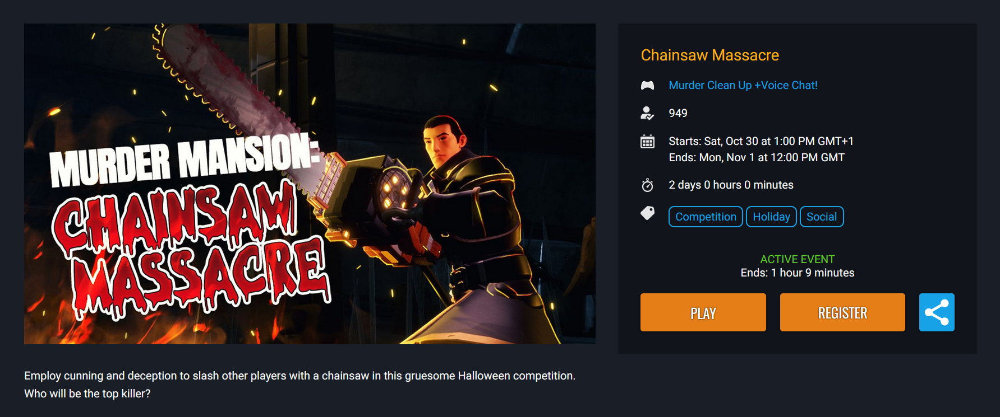
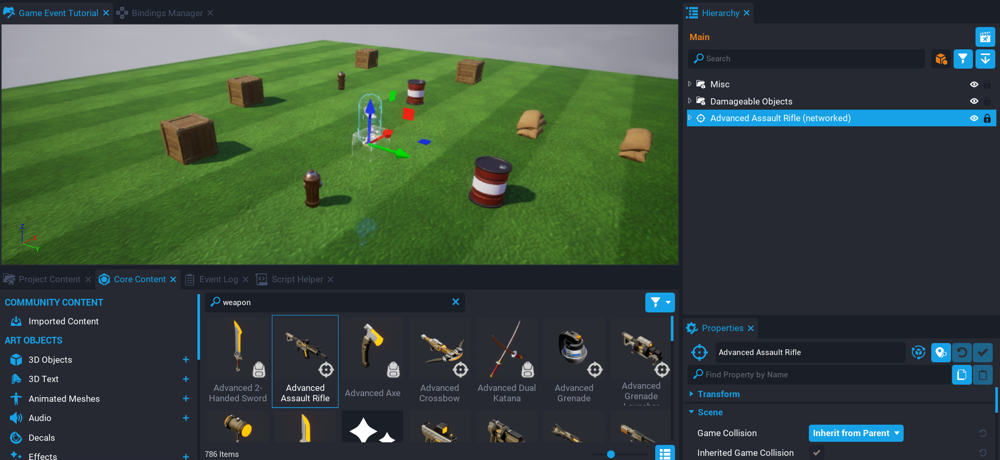
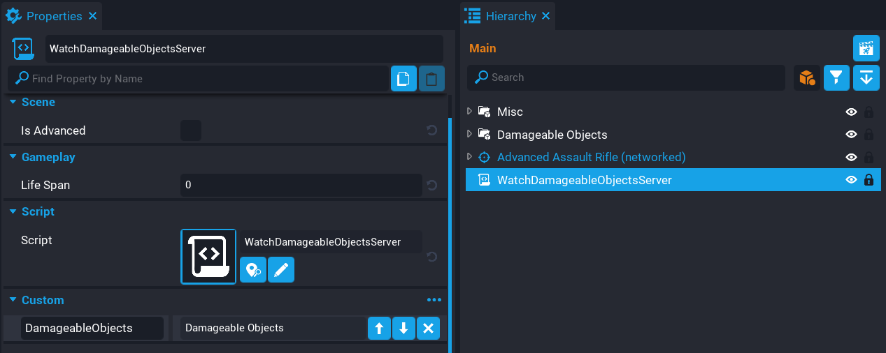
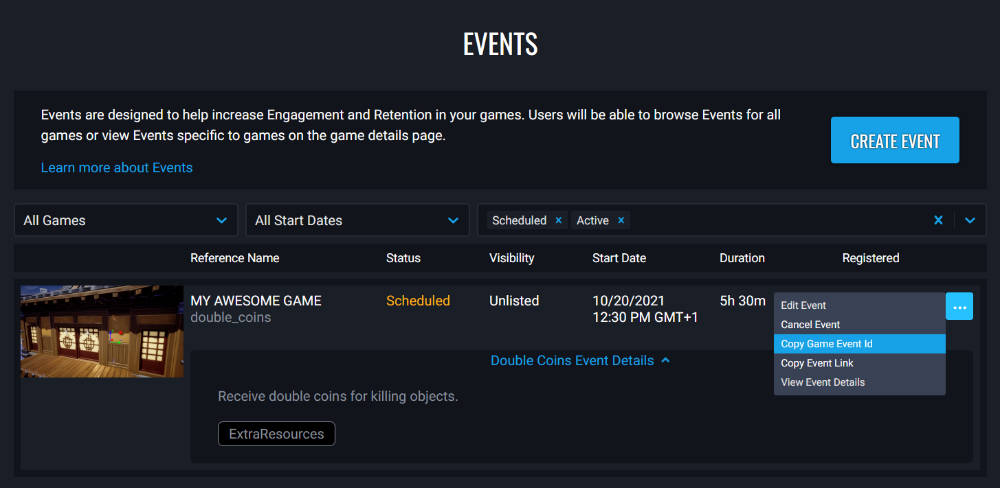
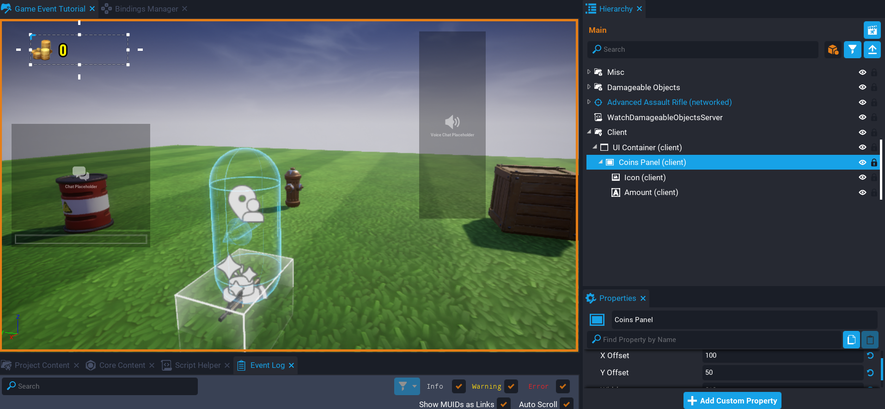

# Game Events

{: .center loading="lazy" }

## Overview

[Game Events](../references/game_events.md) are designed to help increase engagement and retention in your games. Users will be able to browse events for all games or view events created for specific games on the game details page.

In this tutorial you will learn how to award double coins when objects are killed while the event is active. After the event has ended, players will earn coins at the standard rate.

This can be used for various resources, such as awarding double XP, wood, metals, etc.

* **Completion Time:** ~1 hour
* **Prerequisite Skills:** None
* **Skills you will learn:**
    * Creating a weapon pickup.
    * Creating damageable objects the player can kill.
    * Creating a game event.
    * Retrieving game event data with Lua.
    * Awarding double coins when objects are killed while the game event is active.

## Create Game Event

In this section you will be creating the game event first.

### Publish Game

To create a game event for your game, the game needs to be published so that it is selectable from the Game Events page. If you are modifying an existing game, consider having a unlisted version for testing.

### Create Game Event

Login to the **Creator Dashboard** on the [Core Games website](https://coregames.com) and create a new game event. For testing, set the start date and time to as soon as possible so you don't need to wait too long to test the game event in your game.

For more in depth explanation of Game Events, see the [Game Events page](../references/game_events.md).

## Create Damageable Objects

You will be adding damageable objects to the game for the players to kill. When these objects are killed, they will reward the player with coins. If the game event is active, then the amount of coins will be doubled.

### Create Damageable Objects Group

Any damageable object that will you want to reward double coins for the game event, will need to be placed into a group. This group will be used later by a Lua script to find all the damageable objects to setup a `diedEvent` to listen for when a damageable object that is inside this group, is killed (health reaches 0).

- Create a new **Group** by right clicking in the **Hierarchy**, and selecting **New Group** from the menu.
- Name the group **Damageable Objects**.

{: .center loading="lazy" }

### Create Damageable Objects

You will need to add some damageable objects that the player will be able to kill.

- In **Core Content**, search for `damageable`.
- Add some Crates, Sandbags, Fire Hydrant, and Barrels to the **Damageable Objects** group in the **Hierarchy**.
- Position those objects around the map in various locations to spread them out.

!!! tip "Drop Objects in the Scene View"
    You can drop objects directly into the scene view, just make sure to then move those objects in the **Hierarchy**, into the **Damageable Objects** group you created earlier.

<div class="mt-video" style="width:100%">
    <video autoplay muted playsinline controls loop class="center" style="width:100%">
        <source src="/img/GameEventsTutorial/add_objects.mp4" type="video/mp4" />
    </video>
</div>

### Create Weapon

The player needs a way to kill the objects, so you will be adding a weapon to the **Hierarchy** that can be picked up by the player. If your game supports more than one player, then you may want to add multiple weapons.

- Search for **Weapon** in **Core Content**.
- Drag the **Advanced Assault Rifle** into the **Hierarchy**.

{: .center loading="lazy" }

### Test the Game

Test the game to make sure the following work.

- The weapon can be picked up by the player.
- The damageable objects can be killed.

<div class="mt-video" style="width:100%">
    <video autoplay muted playsinline controls loop class="center" style="width:100%">
        <source src="/img/GameEventsTutorial/test_weapon.mp4" type="video/mp4" />
    </video>
</div>

## Create WatchDamageableObjectsServer Script

Create a new script called `WatchDamageableObjectsServer`, and place it into the **Hierarchy**. This script will watch all the damageable objects you added inside the **Damageable Objects** group, to see when they get killed. When an object is killed from within that group, you will check to see if the game event is active. If the game event is active, then you award double coins, otherwise award the standard amount to the player.

The **WatchDamageableObjectsServer** needs to know about the **Damageable Objects** group in the **Hierarchy**. So drag the **Damageable Objects** group onto the **WatchDamageableObjectsServer** script as a custom property. Name the custom property `DamageableObjects`.

{: .center loading="lazy" }

### Create Variables

Open up the **WatchDamageableObjectsServer** script.

```lua
local DAMAGEABLE_OBJECTS = script:GetCustomProperty("DamageableObjects"):WaitForObject()

local eventID = ""
local eventActive = false
local task = nil
```

Add the above variables to the script.

| Variable | Description |
| -------- | ----------- |
| `DAMAGEABLE_OBJECTS` | A reference to the group that contains all the damageable objects. |
| `eventID` | The event ID that will be used to get the game event data. |
| `eventActive` | When the event is active, this will become true, and be used later in the code to check if the game event is active. |
| `task` | A reference to a spawned task that will be created later. This is set here so the task can be cancelled later if needed. |

### Copy Game Event ID

From the events page, copy the **Game Event Id** for the game event you created earlier.

{: .center loading="lazy" }

#### Set eventID Variable

The game event ID that you copied is a string containing the game ID and event ID separated by a hyphen (-).

For example:

```lua
-- Game ID - Event ID
-- 43e20f9cbf1243acac452a66ed5ac1zc-c833c6898a99454daf96e7159c46af5z
```

Set the `eventID` variable with the value you copied.

### Create CheckEventState Function

```lua
local function CheckEventState()
    local eventData = CorePlatform.GetGameEvent(eventID)

    if eventData ~= nil then
        if eventData.state == CoreGameEventState.ACTIVE then
            eventActive = true
        else
            eventActive = false
        end

        print("Game Event Active: ", eventActive)
    end
end
```

Create the `CheckEventState` function at the end of the script. This function will be called periodically to check if the game event is active.

```lua
local eventData = CorePlatform.GetGameEvent(eventID)
```

The [GetGameEvent](../api/coregameevent.md) function requires the ID game event that you want to retrieve the data for. These ID value can be retrieved from the Game Events page on the Core website in the **Creator Portal** section.

```lua
if eventData.state == CoreGameEventState.ACTIVE then
```

If the game event data exists, then you can check the state of the game event by using the [CoreGameEventState.ACTIVE enum](../api/enums.md#coregameeventstate). If the game event is in an active state, then the variable `eventActive` is set to true, otherwise set to false. By switching the value of the `eventActive` variable, you can automatically have double coins turn on and off when the game event begins and ends.

### Create Task

```lua
task = Task.Spawn(CheckEventState)
task.repeatCount = -1
task.repeatInterval = 60
```

A task is created that will repeat forever every 60 seconds. This task will call the [CoreGameEventState](../api/enums.md#coregameeventstate) function, which will check the game event state. The reason a task is used here, is that you need to still periodically check the game event state to update the `eventActive` variable. Eventually the game event will end, and if a server instance continues to stay active after the game event has finished, players would still receive double coins.

### Create OnDied Function

```lua
local function OnDied(obj, damage)
    if not Object.IsValid(damage.sourcePlayer) then
        return
    end

    local coinsAmount = 100

    if eventActive then
        coinsAmount = coinsAmount * 2
    end

    damage.sourcePlayer:AddResource("coins", coinsAmount)
end
```

Create the `OnDied` function at the bottom of the script. This function will be called when a damageable object from the `DAMAGEABLE_OBJECTS` group is killed.

```lua
if not Object.IsValid(damage.sourcePlayer) then
    return
end
```

It is good habit to check if an object is valid, because in this case the `sourcePlayer` may have left the game, which could cause an error later on in the `OnDied` function.

```lua
local coinsAmount = math.random(30, 100)

if eventActive then
    coinsAmount = coinsAmount * 2
end

damage.sourcePlayer:AddResource("coins", coinsAmount)
```

The player will receive a random amount of coins between `30`, and `100`. If the `eventActive` variable is true, then the `coinsAmount` is doubled and added to the players `coins` resource using `AddResource`.

### Connect OnDied Event

```lua
for i, obj in ipairs(DAMAGEABLE_OBJECTS:GetChildren()) do
    obj.diedEvent:Connect(OnDied)
end
```

Each damageable object in the `DAMAGEABLE_OBJECTS` group will have a `diedEvent` connected that will call the `OnDied` function when a player kills the object.

### The WatchDamageableObjectsServer Script

??? "WatchDamageableObjectsServer"
    ```lua
    local DAMAGEABLE_OBJECTS = script:GetCustomProperty("DamageableObjects"):WaitForObject()

    local eventID = ""
    local eventActive = false
    local task = nil

    local function CheckEventState()
        local eventData = CorePlatform.GetGameEvent(eventID)

        if eventData ~= nil then
            if eventData.state == CoreGameEventState.ACTIVE then
                eventActive = true
            else
                eventActive = false
            end

            print("Game Event Active: ", eventActive)
        end
    end

    task = Task.Spawn(CheckEventState)
    task.repeatCount = -1
    task.repeatInterval = 60

    local function OnDied(obj, damage)
        if not Object.IsValid(damage.sourcePlayer) then
            return
        end

        local coinsAmount = math.random(30, 100)

        if eventActive then
            coinsAmount = coinsAmount * 2
        end

        damage.sourcePlayer:AddResource("coins", coinsAmount)
    end

    for i, obj in ipairs(DAMAGEABLE_OBJECTS:GetChildren()) do
        obj.diedEvent:Connect(OnDied)
    end
    ```

## Create Coins UI

It would be nice if the player could see their coins amount in the UI. Create some UI that shows the player how many coins they have. This will be updated when the player kills an object.

- Create a **Client Context** group in the **Hierarchy**. Name it `Client`.
- Create a **UI Container** in the **Client** group.
- Create a **UI Text** component in the **UI Container**. Name it `Amount`.

Place the UI where you would like it. The only important part is the **Amount** text field.

{: .center loading="lazy" }

## Create UIClient Script

Create a new script called `UIClient`, and place it in the **Client** group in the **Hierarchy**. This script will handle updating anything to do with UI.

Add the **Amount** text object to the **UIClient** script as a custom property. Name it `Amount`.

{: .center loading="lazy" }

### Create Variables

```lua
local AMOUNT = script:GetCustomProperty("Amount"):WaitForObject()

local localPlayer = Game.GetLocalPlayer()
```

Create the variables above.

### Create OnResourceChange Function

```lua
local function OnResourceChange(player, prop, newAmount)
    if prop == "coins" then
        AMOUNT.text = tostring(newAmount)
    end
end
```

Create the `OnResourceChange` function at the end of the script. This function will be called when the player's resources change. By checking the `prop` parameter, you can detect when the `coins` resource changes, and update the text property for the `AMOUNT` object. Anytime the player kills an object, the amount will automatically update in the UI for that player.

### Connect Event

```lua
localPlayer.resourceChangedEvent:Connect(OnResourceChange)
```

Add the above line to the end of the script. The `resourceChangedEvent` will call the `OnResourceChange` function when the player's resources change.

### The UIClient Script

??? "UIClient"
    ```lua
    local AMOUNT = script:GetCustomProperty("Amount"):WaitForObject()

    local localPlayer = Game.GetLocalPlayer()

    local function OnResourceChange(player, prop, newAmount)
        if prop == "coins" then
            AMOUNT.text = tostring(newAmount)
        end
    end

    localPlayer.resourceChangedEvent:Connect(OnResourceChange)
    ```

### Test the Game

Test the game and make sure the amount of coins in the UI for the player update when any of the objects are killed.

<div class="mt-video" style="width:100%">
    <video autoplay muted playsinline controls loop class="center" style="width:100%">
        <source src="/img/GameEventsTutorial/test_coins_resource.mp4" type="video/mp4" />
    </video>
</div>

## Create UI Event RSVP Button

The **UI Event RSVP Button** can be added to the UI so that players can register and unregister for the game event from within your game. The button also will contain information about the game event state. For example, it will display the amount of time remaining until the game event begins.

Add the **UI Event RSVP Button** from **Platform Tools** in **Core Content** to the **UI Container** you created earlier. Later on you will be adding the game event ID to the the **Event ID** property in the **Properties** window. For the moment, the button will tell you that there is no game event loaded.

{: .center loading="lazy" }

### Copy Game Event Id

From the events page, copy the **Game Event Id** for the game event you created earlier.

{: .center loading="lazy" }

### Set Event ID Property

With the **Game Event Id** copied, paste it into the **Event ID** property in the **Properties** window.

{: .center loading="lazy" }

## Test the Game

Test the game and make sure the UI game event button shows a valid game event. If the game event has not started, then the event button will have the time remaining before it begins below it.

If you get an error in the **Event Log** such as `CorePlatform.GetGameEvent() failed: Game not found`. Make sure the `eventID` is valid. If the `GetGameEvent` function can't find a valid game and game event, you will receive that error.

- Just before the game event begins, test your game and make sure double coins is awarded.
- Leave and rejoin your game to make sure double coins is still awarded while the game event is active.
- Test if the standard amount of coins is award after the game event has ended.

In the video below, you will see that the game event goes active. The status of the event is printed in the **Event Log**, notice how it changes from `false` to `true`, which means the player can earn double coins now.

<div class="mt-video" style="width:100%">
    <video autoplay muted playsinline controls loop class="center" style="width:100%">
        <source src="/img/GameEventsTutorial/event_started.mp4" type="video/mp4" />
    </video>
</div>

In the video below, this time the game event ends, and after a while, the **Event Log** reports the game event as no longer active.

<div class="mt-video" style="width:100%">
    <video autoplay muted playsinline controls loop class="center" style="width:100%">
        <source src="/img/GameEventsTutorial/event_ended.mp4" type="video/mp4" />
    </video>
</div>

## Summary

Game Events can be used for a wide range of things for your game to encourage players to come back and play. The game events don't need to be tied to double resources, like XP, coins. There could be in world events where a special enemy spawns only when the event is active, and drops special loot for players.

## Learn More

[Perks Program](../references/perks/program.md) | [Game Events Reference](../references/game_events.md) | [Damageable Objects](../references/damageable_objects.md)
