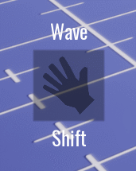

# Abilities in CORE

## Overview

An ability is anything that the player can do themselves.

Anytime that a player can do something more than just jump and crouch, that should be added to a CORE™ project as an ability. Abilities are how a creator can add functions that a player can activate, and these abilities can be anything.

An ability could be to sprint, a dance emote, the opening of a hidden menu; an ability can be anything that ought to happen on a button press or at a certain moment, repeatedly.

!!! info
    Comparing with Unreal and other game engines, an ability is basically a fancier keyboard input. "Fancier" because it has events built-in that can be set at each phase of execution.

* **Time to Complete:** 10 minutes
* **Knowledge Level:** No prior knowledge required
* **Skills you will learn:**
    * How to create an ability
    * How to use an animation
    * How to set up UI connected to an ability

---

### What is an Ability?

In CORE, an `Ability` is an object that holds information about how to behave when used. You can set how long the ability lasts for, how long until the ability can be used a second time, and all sorts of other properties.

While there are ways to utilize all these properties, for your first dive into abilities, we're just going to touch on the very basics.

Abilities can either be assigned to players at the start of a game, or when they equip a special item.

---

## Tutorial

Adding a simple ability to a game is only a couple of steps. We'll go over how to activate an animation on a button press, with no coding necessary!

We're going to make a piece of equipment that the player can pick up, and when they do, they will gain a new ability.

For this tutorial, we are going to make a quick dodge roll.

### Getting Started with Equipment

1. With CORE open to a project, navigate to the **CORE Content tab**, and scroll down to the bottom of the left side panel list to the **GAME OBJECTS** section. Select **Gameplay Objects**, and drag an **Equipment Object** into the project Hierarchy.

    

    This will add an **Equipment** object to your project Hierarchy. `Equipment` comes with a `PickupTrigger` that allows players to equip the object when the player touches it.

    
    

2. With the `Equipment` object selected in the **Hierarchy**, check out the **Properties** window. Scroll down to the section titled "Equipment".

    Change the **Socket** property from "topper" to "pelvis".

    The **Socket** property determines _where_ the equipment will be attached to the player--we want the equipment to disappear, so for simplicity we will attach it somewhere that it will be hidden by the player's body.

    Doing these first two steps will already let you pick up the `Equipment` when playing the game and walking through it--but it is hard to pick up something you can't see!

3. To make this a more usable power-up object, let's add a model to it that players can see.

    You can choose whatever you would like and would fit your game, but in my case I am going to use a classic gem.

    1. In the **CORE Content** tab, search for "diamond" and drag the `Gem - Diamond 6-Sided Polished` into your Project Hierarchy.

        

        Feel free to change the material, or make the model suit your own game more. To learn more about how to make cool art & models in CORE, read our **[Art Reference Guide](/tutorials/art/art_reference/)** or try a **[Tutorial](/tutorials/art/modeling_basics/)**.

        I went with a simple red gem, and made it a little smaller than the default diamond.

        

    2. Drag it onto the `Equipment` object and it will become a child of the `Equipment` object. It will prompt you to make the Gem _Networked_, and select "Make Children Networked" when this window appears.

        For better organization, right click the Gem object and select "New Group Containing This", and name it "Art".

        

    3. In the **Properties** window, uncheck the `Collidable` box of the art folder. This way the gem won't mess with your camera when it's attached to the player.

        

    Now that we've created a visible object that can be picked up, it needs to do something!

4. Navigate back to the **CORE Content** tab and the **Gameplay Objects** section, and this time drag an **Ability Object** into your project **Hierarchy**.

    1. Click on the `Ability` object and drag it onto the `Equipment` object to make it a child of the `Ability` object.

        

    2. Rename the `Ability` object to "Dodge" by clicking on the `Ability` object and pressing F2. This can also be done by right clicking and selecting "Rename", or by changing the name at the top of the **Properties** panel.

    Now when the player picks up the equipment, they will automatically gain the `Ability`! Of course, we still need to set it up to cause the dodge roll animation.

5. The `Ability` object starts with default settings in the **Properties** window. To make our own dodgeroll, we only need to change two things.

    1. With the `Ability` object selected, navigate to the **Properties** window and scroll down to the _Ability_ section to change the **Key Binding** property to "Ability Feet".

        The Key Binding is which button will activate the ability. In this case, _Ability Feet_ is the `shift` key on keyboards.

    2. Still in the **Properties** window and right beneath the Key Binding, change the **Animation** property to `unarmed_roll`.

        

    **Now the ability is fully useable!** When you play your game, pick up the object, and then press `shift`, you will be able to do a dodgeroll!

!!! info "Good Object Placement"
    If you haven't moved your `Equipment` object at all so far, your gem may be clipping into the ground! Feel free to move the whole `Equipment` object upwards to make it both easier to see and simpler to pick up.

  If you'd like to change the amount of time between when you use (also known as **Cast**) an ability, this can be altered within the `Ability` object!

  1. In the **Properties** window for the ability object, scroll down to the section called **Cooldown**.

  2. Change the **Duration** property. This is in seconds, so by default 3 seconds must pass after using your dodgeroll before you can use it again.

      Increase or lower this to suit your gameplay needs.

      

  Of course, it would be nice to know when the ability has been activated, and how long it will be until you can use it again display on-screen.

  For this we need UI!

----

### CORE Component: Ability Display

A crucial part of a video game is the feedback it gives--players need to know that they're using an ability.

While you can make a User Interface _(often abbreviated to UI)_ element yourself, there is a pre-made template within **CORE Content** that we can use to very quickly set up simple UI for our new ability!

When the `Ability` is in the Cooldown phase, it will darken the ability button and show the seconds remaining until the `Ability` is usable again.

To get this to work correctly with the `Ability` we made above, there are only a few steps steps:

1. In **CORE Content**, search for the **AbilityBindingDisplay** object, and drag this into your **Hierarchy**.

2. If you now click this object from within the **Hierarchy**, the **Properties** tab will show a few custom properties that we need to change to set up the ability display.

    

    1. Change the **Binding** property from `ability_primary` to `ability_feet`.

    2. Change the **Text** field to `Shift`, to stand for Left Shift.

    3. Check the **ShowAbilityName** property, so that "Dodge" will display over the button.

    What is really the key here is the **Binding** property--this connects whatever ability is currently connected to that binding to the Ability Display.

3. To make sure our icon symbol is visible, shift-click the AbilityBindingDisplay in the **Hierarchy** to expand all of the children subfolders.

    Select the **ActiveIcon** object, and from within the **Properties** window, change the **Color** property from white to a darker gray.

    

4. To **change the icon that displays** from a fork & knife to something more relevant for our ability, navigate through the AbilityBindingDisplay folders in the **Hierarchy** to the two Icon objects. Select both of these, and within the **Properties** panel change the **Image** property on these to whatever you would like!

    Double-click on the **Image** property to see all options possible.

    
    I chose the **Icon Stamina** for this case.

Now the UI element will update automatically once the ability is cast.

**Congrats on creating your first ability!** You are well on your way to making anything you can imagine a reality.

---

### Networking for Multiplayer Games

Abilities themselves work in multiplayer games perfectly without any extra programming effort. If you made your own ablity UI icon and did not use the CORE Content template above, the UI will not update properly in multiplayer games. For the UI to update as the ability happens, the UI relating to the player's abilities must be placed in a Client Context folder.

This has already been done for us in the CORE Content template, so no action is needed!

!!! info "Client Context"
    Generally speaking, all UI related to the player should be in a Client Context folder. For more info on how networking works, visit the **[Networking Reference](/tutorials/gameplay/networking_reference/)**.

---

## Altering Properties the Easy Way: The Ability Object

Abilities can get more complex, and often you may want to tweak the values in an ability quickly without having to open up scripts.

To create a more advanced ability system and read more about Ability objects, read our **[next tutorial using abilities](/tutorials/gameplay/abilities_advanced.md)**.

---

## Examples

* _FAA_GameMode_ includes functioning abilities.
* _Spellshock_ includes advanced abilities using ability objects.
