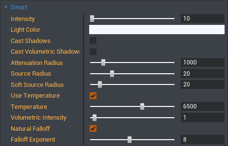

# Scripting in CORE

!!! warning
    Flagged for Review.

    TODO:

    * Images sizes

    Docs to delete after merge:

    * https://docs.google.com/document/d/1H5Y7U_2z0hlEScLM_J89g5YTx5j68fXjwTIxT3C0f-U/edit
    * https://docs.google.com/document/d/1ekVtiiNbviFzQsKl8yI8Iq8zDsZEvzdg6N24Lu4okvg/edit


## Overview

In the first part, we are going to introduce you do the basics of scripting in CORE. A good tradition amongs programming tutorials is doing that in the form of a "**Hello World**" script. For the second part, we are going to teach you how to take an existing template and enhance it with your own scripts.

---

**CORE** uses the **Lua** programming language, While this tutorial does not really require any prior knowledge of the language feel free to check out our [Lua Primer](lua_reference.md) to get familiar with the basics of the language.

* For debugging, we have our own script debugger, you can enable it via the **View** menu.
    You can toggle breakpoints by clicking on a line number in the internal editor.
* Lastly, we have a section on [code conventions](lua_style_guide.md) as well.

---

* **Completion time:** TODO: TBD
* **Knowledge level:** No prior knowledge of Lua
* **Skills you will learn:**
    * Downloading and editing templates
    * Creating a script and using it to:
        * Rotate an object
        * Create an interactable event
        * Create a custom property
    * Using triggers
    * Creating and updating trigger labels

---

## My First Script

### Creating the Script

1. Open up the editor and click the **+** (Create Script) button in the `Project Content` tab.
    * Name it `TutorialScript` for now.
    * You can rename scripts by clicking on the name of the script (or by pressing <kbd>F2</kbd>), when it is selected.
* Open up the script by double clicking on it.
    * By default this happens via our in-built editor.
    * You can also configure scripts to open in an external editor by default by going to `Edit -> Preferences -> External Script Editor`.
        * We offer [editor integrations](../../extensions.md) for Atom, VS Code, and ZeroBrane that add autocomplete for the CORE API support!

### Writing the Script

* Type `UI.PrintToScreen("Hello World!")`.
* Save the script by pressing <kbd>CTRL</kbd> + <kbd>S</kbd>.

### Running the Script

1. To add your script to the game, drag it from the **Scripts** area to the top of the Hierarchy tree on the right side.
    * Press **Play** at the top of the editor, and see your message appear on screen!

### Hello World Breakdown

* We made a script.
* We populated it with code.
    * The function `UI.PrintToScreen(string)` prints the parameter `string` to the viewport. This is one of many of the [built-in CORE API functions](../../core_api.md).
* We placed the script into the Hierarchy tree so that it executes when the game runs.

Next step: Adding our own function!

### Functions

In programming, a function is a named section of a program that performs a specific task. In this sense, a function is a type of procedure or routine.
So in order to be able to perform our task exactly when and how we want to, we're going to change `TutorialScript` so the `UI.PrintToScreen` call is within a function. We'll call this function `Init`, for simplicity.

```lua
-- Our first function!
local function Init()
    UI.PrintToScreen("Hello from a function!")
end
```

!!! note
    In case you've not read the [Lua Primer](lua_reference.md), putting `--` at the beginning of a line makes that line a comment, which is a line of code that isn't read by the computer. You don't have to include these lines, since they're just for leaving notes in your code for yourself and other humans.

If you save and run this code, nothing will happen. How utterly boring! This is because the function is never called in our code. To get our function to work, we can add a function call to the end of the script.

```lua
-- Calling the function
Init()
```

You should now have the following:

```lua
-- Our first function!
local function Init()
    UI.PrintToScreen("Hello from a function!")
end

-- Calling the function
Init()
```

Now if you save and run this, you'll see your message appear on the screen! Excellent.

!!! note "Lua requires functions to be declared before they're called. In this tutorial, we'll make sure to keep all our function declarations at the top of files."

If you are having issues, check to see if your `TutorialScript` looks like this in the `Properties` view:

{: .center}

Time to put what we've learned to a test, welcome to the main course!

---

## Tutorial

Now we are going to create a small game that involves a light switch that turns on and off a light.

{: .center}

### Downloading the template

1. Download **Light Switch & Bulb (by Tobs)** from the **Community Content** tab.
2. Now go to the **Imports** section of the **CORE Content** tab, expand the **Bundles** header, click on the "**Light Switch & Bulb**" package and drag it into your scene by either dragging it into the game viewer or the hierarchy tab.

    <div align="center">
    
    
    <p style="font-style: italic">Left: halfway through the ground, in the shade - hard to see. Right: Well lit and constructed - good to go!</p>
    </div>

### Creating a new script

1. Create a new script by clicking the "**+**" button in the **Project Content** tab to the left of the search bar.

    {: .center}

2. Name this one "**LightToggleScript**".

3. Save the script by pressing <kbd>CTRL</kbd> + <kbd>S</kbd>. It's important to save your scripts often so you don't lose work in the event of a crash. Scripts don't update in game until you save them, so you won't see any of your new code in action until you save. You cannot save a script while the game is running.

4. In order to make changes to the template, first we need to deinstance it. Right click on the **Light Switch & Bulb** template and select "**Deinstance This Object**" from the drop down menu.

    {: .center}

    The template and objects in the template should change from green to teal. Green objects represent objects in a template. Templates are not editable.

    {: .center}

    Teal objects represent objects that are part of a template that's been deinstanced - which means you can edit them and move them around in the hierarchy.

5. Drag "**LightToggleScript**" from the **Project Content** tab into the "**Light switch**" folder within the **Light Switch & Bulb** template (as shown in the picture below).

    Make sure the script is first in the "**Light switch**" folder's hierarchy. This makes it easier to find when looking at the hierarchy.

    {: .center}

### Defining the switch

We want our light switch to function just like it would in real life: the switch will point up or down depending on whether the light is turned on or off. First you'll need to tell the script which object in the scene is the switch, so that it knows what to rotate. You will create a variable that defines what the switch is. It is best practice to define your variables at the beginning of your scripts.

1. Type the following into Line 1 of `LightToggleScript`:

    `local switch = script.parent:GetChildren()[2]`

    `local` tells the script that the following variable should only be accessible from this script rather than being accessible from external scripts, or globally.

    `switch` is our variable name. We can name it anything but it's important to create variables with self-explanatory names so our scripts are easy to read and understand.

    `script.parent` refers to the script's parent - the group or folder the script is placed in. In this case it refers to the **Light switch group**. If we wanted to refer to the entire **Light Switch & Bulb template** we would use `script.parent.parent`.

    `GetChildren()[2]` refers to the second child in a hierarchy. Because this is attached to `script.parent`, the script knows this refers to the second child in our **Light switch group**, which is the object we want to rotate.

    {: .center}

    `local switch = script.parent:GetChildren()[2]` tells the script we are defining a local variable named `switch` and what object in the hierarchy our new variable corresponds to.

2. Left click on the `Switch` folder and select "**Enable Networking**" from the drop down menu.

    {: .center}

    Any time a variable is defined in the script as an object in the hierarchy (like we just did with the `switch` variable) the object in the hierarchy must be marked as networked. You can read more about networking [here](networking_reference.md).

    The `Switch` folder should now read: `Switch (networked)`.

### Rotating the switch

1. We now need to rotate the switch. On a new line, type:

    `switch:RotateTo(Rotation.New(0, 90, 0), 2)`

    * `switch` tells the script to rotate the object attached to this variable.

    * `RotateTo` is an function that tells CORE we want to rotate an object.

    * `Rotation.New` means we are telling the script to rotate our object to a new set of coordinates. You will almost always use `Rotation.New` when rotating an object, but when applicable you can use `Rotation.ZERO` which will rotate the object to `0, 0, 0`.

    * `(0, 90, 0)` are the x, y, and z coordinates (respectively) of where we want our switch to rotate to. We want to rotate our switch up along the y axis by 90 degrees.

    * `2` is the animation duration in seconds.

    Our script should now look like this:

    ```lua hl_lines="3"
    local switch = script.parent:GetChildren()[2]

    switch:RotateTo(Rotation.New(0, 90, 0), 2)
    ```

    Let's press **Play** and see how our switch moves!

    {: .center}

    Unfortunately that didn't quite work out the way we wanted… Depending on where in the scene you placed your light switch, it might look like the above animation, where the switch rotated sideways instead of up. That's because we didn't take into account the switch's initial rotation in the scene.

    We want the script to rotate our switch 90 degrees up. But our problem is that the script is rotating the switch globally while we want to rotate it locally; it's changing the switch's global rotation from `(0, 0, 180)` to `(0, 90, 0)`. In order to get the script to rotate the switch the way we want, only along the y axis, it has to know where the switch's starting rotation.

2. Let's create a variable that defines the switch's starting rotation. Go to the line 2 of the code and type:

    `local startingRotation = switch:GetWorldRotation()`

    * `startingRotation` is the name of our new variable that will define the switch's starting rotation.

    * `switch:GetWorldRotation()` tells the script to get the global rotation coordinates of our first variable, `switch`.

    Our script should now look like this:

    ```lua hl_lines="2"
    local switch = script.parent:GetChildren()[2]
    local startingRotation = switch:GetWorldRotation()

    switch:RotateTo(Rotation.New(0, 90, 0), 2)
    ```

    Now that we have the switch's starting rotation set to a variable, we just need to include it in our rotation statement:

    `switch:RotateTo(startingRotation + Rotation.New(0, 90, 0), 2)`

3. Press **Play** and test it out!

    <div align="center"><!-- TODO: Replace with gif -->
    
    <p style="font-style: italic">Success!</p>
    </div>

### Adding a trigger

We want the player to be able to flip the switch to turn on and off our light. To do this we need a trigger. A trigger defines the area an interaction can take place in. This sounds pretty abstract, but will be clear once we start using one.

1. Create a trigger by going to the **CORE Content** tab, scroll down to **Gameplay Objects** and drag a "**Trigger**" into the world.

    {: .center}

2. In the hierarchy, select it and press <kbd>F</kbd>, this will find the trigger in our viewer. If you can't see the trigger, press <kbd>V</kbd> to enable Gizmo visibility.

    !!! info "Gizmos are outlines that are displayed over objects that are otherwise hard to see, such as triggers, decals, and lights."

3. Drag the trigger over to the light switch. The size of the trigger determines how close a player needs to be to interact with the trigger, as the player will simply have to stand inside the box to be able to activate the trigger.

    {: .center}

    This looks like a good size.

4. Look at the properties of the trigger by selecting it within the Hierarchy. Under "**Gameplay**" there is a parameter called "**Interactable**," check the box next to it to enable it. Otherwise we won't be able to interact with the trigger.

    <div align="center">
    {: .center}
    </div>

5. Drag the trigger into the **Light switch group**. It should be the 4th child in the group. Since we'll be referencing the trigger in our script, make sure it's marked as networked. Right click on the trigger and select "**Enable Networking**".

    Our hierarchy should now look like this:

    {: .center}

6. Now we need to tell the script what our trigger is and what should happen when the player interacts with it. Under our `switch` variable definition type:

    `local switchTrigger = script.parent:GetChildren()[4]`

    * `switchTrigger` is the name for our trigger variable.

    * `script.parent:GetChildren()[4]` defines the object we are using as our trigger - the fourth child of the script's parent group.

    Your script should look like this:

    ```lua hl_lines="3"
    local switch = script.parent:GetChildren()[2]
    local startingRotation = switch:GetWorldRotation()
    local switchTrigger = script.parent:GetChildren()[4]

    switch:RotateTo(startingRotation + Rotation.New(0, 90, 0), 2)
    ```

7. Now that the script knows which object we are using as a trigger we need to define what happens when we interact with the trigger.

    After your rotation statement, type:

    ```lua
    local function OnSwitchInteraction()

    end
    ```

    * A `function` is a set of actions that the script carries out every time the function is referenced in the script.

    * `OnSwitchInteraction` is the name of our function.

    * `end` tells the script the function is over.

    This function will define what happens when the player interacts with the trigger.

    Eventually we want the switch to flip up and down when the player interacts with it, turning the light on and off. For now we'll just place our rotate statement inside it, which is just the switch turning down.

8. Cut and paste the rotation statement from line 5 into our `onInteraction` function.
    It should now look like this:

    ```lua hl_lines="6"
    local switch = script.parent:GetChildren()[2]
    local startingRotation = switch:GetWorldRotation()
    local switchTrigger = script.parent:GetChildren()[4]

    local function OnSwitchInteraction()
        switch:RotateTo(startingRotation + Rotation.New(0, 90, 0), 2)
    end
    ```

9. Lastly, you'll need an event statement that tells the script to execute the `OnSwitchInteraction` function when the player interacts with the trigger. At the end of your script type:

    `switchTrigger.interactedEvent:Connect(OnSwitchInteraction)`

    * `switchTrigger` is the name of our trigger.

    * `interactedEvent:Connect()` tells the script every time the player interacts with trigger to execute the function passed to the `Connect()` function.

    * `OnSwitchInteraction` is the name of the function we are connecting.

    Without this statement the script wouldn't know to call the `OnSwitchInteraction` function when the player interacts with the trigger.

    Our script should now look like this:

    ```lua hl_lines="9"
    local switch = script.parent:GetChildren()[2]
    local startingRotation = switch:GetWorldRotation()
    local switchTrigger = script.parent:GetChildren()[4]

    local function OnSwitchInteraction()
        switch:RotateTo(startingRotation + Rotation.New(0, 90, 0), 2)
    end

    -- Connect our event to the trigger
    switchTrigger.interactedEvent:Connect(OnSwitchInteraction)
    ```

10. Press **Play** and see if our trigger is working properly.

    Perfect! When the player presses <kbd>F</kbd> to interact with the trigger, our switch rotates up!

11. Let's speed up the switch's rotation animation now that we have the rotation and trigger working. Change the `2` in the `RotateTo` statement to `0.5`. Now the switch will complete its rotation in 0.5 seconds.

    `switch:RotateTo(startingRotation + Rotation.New(0, 90, 0), 0.5)`

    !!! info "Best Practices: Organizing your code"
        It is important to keep your code organized so it is easily read and understood. You might come back to your project after not working on it for a while, or you might be collaborating with other people; in both cases it is nice to have an explanation of what your functions do. It can also make finding specific functions in your script easier.

        Programmers use comments to define and explain certain parts of their code. See the example below for how you might comment on our current script.

        ```lua hl_lines="7"
        local switch = script.parent:GetChildren()[2]
        local startingRotation = switch:GetWorldRotation()
        local switchTrigger = script.parent:GetChildren()[4]

        -- Rotate the switch when the player interacts with switchTrigger
        local function OnSwitchInteraction()
            switch:RotateTo(startingRotation + Rotation.New(0, 90, 0), 0.5)
        end

        -- Connect our event to the trigger
        switchTrigger.interactedEvent:Connect(OnSwitchInteraction)
        ```

        At CORE, we have our own set of coding conventions which you can read about [here](lua_style_guide.md).

        As our script gets longer, these practices will make our script easier to read and edit.

### Spawning a Light

1. Let's make our light switch a little more functional and have it spawn a light when we interact with the switch.

    Select the **Lighting** category in the **CORE Content** tab. Any of the lights can be used for this tutorial. I'll be using the **Point Light**. Drag the light into your Hierarchy, then adjust the light's smart properties to your liking.

    {: .center}

    I turned down the light's `Intensity` because it was very bright in my scene. When you're done making adjustments, right click on the `Point Light` in the Hierarchy and select "**Enable Networking**" under the **Networking** menu.

    Anytime a script interacts with an object or asset the object needs to be networked. (You can learn more about networked objects [here](networking_reference.md).

2. Right click on the `Point Light` in your Hierarchy and select "**Create New Template from This**" under **Templates** in the menu. Let's call our new template "**LightTemplate**".

    {: .center}

3. Delete the **LightTemplate** from the Hierarchy. We don't want the light in our scene until we turn on the light switch.

4. Click on our script "**LightToggleScript**" in the Hierarchy and look at the **Properties** tab. Click "**Add Property**" at the bottom of the tab.

    {: .center}

5. Choose "**AssetReference**" from the drop down menu. Change "**PropertyName**" to "**Light**" then click "**Add Property**".

    Congrats! You just added your first custom property to a script.

6. Find the template we just made ("**LightTemplate**") in the **Project Content** tab and drag it over to our "**Light**" custom parameter where it says "**Empty**".

    {: .center}

7. Now we need to tell the script how to find our light template and to spawn it whenever the player turns on the light.

    First, we add a new variable:

    `local lightTemplate = script:GetCustomProperty("Light")`

    * `lightTemplate` is the name of our variable. Remember we want to keep our names straightforward. Because we will be using this variable to spawn template we just made, we're going to call it `lightTemplate`.

    * `script:GetCustomProperty("Light")` tells the script to look for our scripts custom property called "**Light**" which references our `LightTemplate` object in **Project Content**.

8. Now we need to tell the script to spawn `lightTemplate` when the player interacts with the switch and where to spawn it.

    In our `OnSwitchInteraction` function under our `RotateTo` statement, type:

    `World.SpawnAsset(lightTemplate, Vector3.New(0, 0, 0))`

    * `World` is a [collection of functions](../../core_api/World/TODO:API_DOCS:World) for finding objects in the world.

    * `SpawnAsset` is a function that tells the script we'll be spawning a template or asset, and where to do so

    * `lightTemplate` is the variable we'll be spawning. Because we already defined the variable `lightTemplate`, the script knows to spawn the template attached to the script's custom property "**Light**".

    * `Vector3.New(0, 0, 0)` tells the function where in the scene the script will spawn our template. Currently the script will place our light template at coordinates "0 0 0". We will need to change this part to spawn the light in our light bulb, but for now let's check to see if our new lines of code work.

    Your script should now look like this:

    ```lua hl_lines="4 10"
    local switch = script.parent:GetChildren()[2]
    local startingRotation = switch:GetWorldRotation()
    local switchTrigger = script.parent:GetChildren()[4]
    local lightTemplate = script:GetCustomProperty("Light")

    -- Rotate the switch and spawn a light
    -- when the player interacts with switchTrigger
    local function OnSwitchInteraction()
        switch:RotateTo(startingRotation + Rotation.New(0, 90, 0), 0.5)
        World.SpawnAsset(lightTemplate, Vector3.New(0, 0, 0))
    end

    -- Connect our event to the trigger
    switchTrigger.interactedEvent:Connect(OnSwitchInteraction)
    ```

    Notice how we updated the comment describing what our `OnSwitchInteraction` function does.

9. Press **Play** and interact with the switch. Now press <kbd>TAB</kbd> to pause gameplay and look in the Hierarchy. You should see "**LightTemplate**" at the bottom of the Hierarchy. Depending on where you are in the scene, you may even be able to see the light, which spawned at coordinates "0 0 0".

10. Time to change the spawn location to the light bulb. Click on the **Light Bulb group** in the Hierarchy. See the group named "**Filaments**"? As this group is located in the center of the bulb, it would be the perfect location for our light to spawn at.

    We could look up the global position of the **Filaments** and plug them into our code, but that would mean if we ever moved the light bulb we would have to go into our script and update it - which we might forget to do, resulting in a random floating light in our game.

    Instead we can find the filament's position in the script and use that, which is a lot easier in the long run as we'll be able to move the light bulb anywhere we want without worrying about updating the script every time.

    Let's start with the variables:

    ```lua
    local filaments = World.FindObjectByName("Filaments")
    local bulbPosition = filaments:GetWorldPosition()
    ```

    * `filaments` is the name of our variable defining which objects are the filaments in our scene.

    * `FindObjectByName` is a CORE function to find objects you wish to reference. Very hande if they are nested deep within many groups and folders. We could have defined filaments as

        ```lua
        local lightBulbFolder = script.parent.parent:GetChildren()[1]
        local filaments = lightBulbFolder:GetChildren()[1]
        ```

        but `FindObjectByName` does the same thing with less lines of code.

    * `Filaments` is the name of the object in the hierarchy we want to reference. If you have many objects in your game named the same thing, the script will use the first one it finds. If we made a copy of the **filaments** group in the same folder, the script would use whichever one comes first in the hierarchy (i.e. the first child of the folder will be chosen over the second child, how mean.).

    * `bulbPosition` is the name of our variable defining where we want the light placed.

    * `filaments:GetWorldPosition()` gets the coordinates of our filament object.

11. We now need to update our `SpawnAsset` function to spawn the light wherever the **Filaments** are. Find our `SpawnAsset` function and change `Vector3.New(0, 0, 0)` to `bulbPosition`. Our script should now look like this:

    ```lua hl_lines="4 5 12"
    local switch = script.parent:GetChildren()[2]
    local startingRotation = switch:GetWorldRotation()
    local switchTrigger = script.parent:GetChildren()[4]
    local lightTemplate = script:GetCustomProperty("Light")
    local filaments = World.FindObjectByName("Filaments")
    local bulbPosition = filaments:GetWorldPosition()

    -- Rotate the switch and spawn a light
    -- when the player interacts with switchTrigger
    local function OnSwitchInteraction()
        switch:RotateTo(startingRotation + Rotation.New(0, 90, 0), 0.5)
        World.SpawnAsset(lightTemplate, bulbPosition)
    end

    -- Connect our event to the trigger
    switchTrigger.interactedEvent:Connect(OnSwitchInteraction)
    ```

12. Press **Play** and test out the script.

    <div align="center"><!-- TODO: Replace with gif -->
    
    <p style="font-style: italic">Excellent!</a>
    </div>

You've turned on the light. If you keep interacting with the light switch you'll notice it continually spawns lights, making the light bulb brighter and brighter. Which is fine if that's what you wanted (and you're not the one footing the electric bill) but we want to flip the switch and turn off the light.

### Turning the switch off

1. In order to turn the switch off again, we need to create a variable that keeps track of whether the switch is on or off.

    As always, we start with the variables:

    `local isLightOn = false`

    * `isLightOn` is the name of the variable we'll use to keep track of the switch being on and off. Because we start with the switch off, `false`is the starting state for the switch.

2. Next, we need to tell the script to set `isLightOn` to `true`, when we turn on the light. In the `OnSwitchInteraction` function, type:

    `isLightOn = not isLightOn`

    * Instead of just setting `isLightOn` to `true`, this tells the script to change `isLightOn` to whatever it is NOT set to. If `isLightOn` is `false` it sets it to `true`, and vice versa. In other words, the value is toggled to the state it is not currently at.

3. Let's see if our script correctly toggles between `isLightOn = false` and `isLightOn = true` when the player interacts with the switch. Anywhere in our `OnSwitchInteraction` function type:

    `print(isLightOn)`

    * `print` tells the script to print to the event log.

    * `isLightOn` is the variable that will be printing.

    It doesn't matter where in the function you typed this as we'll delete this later. Right now we only want to know if the switch is correctly toggling our `isLightOn` variable.

    Open up the **Event Log** tab from the **View** menu in the top bar. Keep this open and press **Play**. Interact with the switch. The Event Log should print `true` or `false` every time you interact with the light switch. You can delete the `print` statement now.

    Now the script needs to know what to do specifically when the switch is on, and when it is not. We need an if statement for this. In the `OnSwitchInteraction` function, after `isLightOn = not isLightOn` type:

    ```lua
    if not isLightOn then

    end
    ```

    * `if` statements are handy when you need a certain series of actions to happen when a certain set of conditions is true. Here is an example of how this might apply to a real life situation:

    ```lua
    if door == unlocked then
        Enter()
    end
    ```

    * `not isLightOn` is the condition that must be met in order to execute the script inside our if statement.

    * `then` signifies the start of the code that will be performed if the conditions of the `if` statement are met.

    * `end` tells the script the `if` statement is over.

    Place the `switch:RotateTo` statement and the `World.SpawnAsset` function inside of your new `if` statement. Your `OnSwitchInteraction` function should now look like this:

    ```lua hl_lines="2 4 7"
    local function OnSwitchInteraction()
        local isLightOn = not isLightOn

        if not isLightOn then
            switch:RotateTo(startingRotation + Rotation.New(0, 90, 0), 0.5)
            World.SpawnAsset(lightTemplate, bulbPosition)
        end
    end
    ```

4. Press **Play** and make sure everything still works.

    A light should have spawned every other time you interacted with the switch, instead of every time. The light is only spawning when we toggle `isLightOn` to `false`. Progress!

5. The next step is to tell the script to turn the switch downwards when the light is off. Under our `World.SpawnAsset` function and between `end`, type:

    ```lua
    else
        switch:RotateTo(startingRotation, 0.5)
    ```

    * `else` is used in an `if` statement to tell the script if the if conditions are not true, do the following instead. To use our door example from before:

    ```lua
    if door == unlocked then
        Enter()
    else
        UnlockDoor()
    end
    ```

    * `switch:RotateTo` tells the script to rotate our switch variable. The switch needs to rotate to its original downwards position, since we defined its initial rotation as `startingRotation`, we can simply plug `startingRotation` into our rotation statement.

    * `0.5` is the time in seconds it takes to complete the action.

    Your `OnSwitchInteraction` function should now look like this:

    ```lua hl_lines="7 8"
    local function OnSwitchInteraction()
        local isLightOn = not isLightOn

        if not isLightOn then
            switch:RotateTo(startingRotation + Rotation.New(0, 90, 0), 0.5)
            World.SpawnAsset(lightTemplate, bulbPosition)
        else
            switch:RotateTo(startingRotation, 0.5)
        end
    end
    ```

6. Press **Play** to see if your `else` statement works. The switch should now rotate up when first interacted with, then down on your second interaction with it.  However, we still need to despawn the light when the light switch is turned off.

### Turning the light off

1. In order to turn off the light, you first need to define the light after it is spawned. When the **LightTemplate** is spawned, it shows up at the bottom of the Hierarchy. In your `else` statement, after the `RotateTo` line, type the following:

    `local spawnedLight = World.FindObjectByName("LightTemplate")`

    * `spawnedLight` is the name we are giving to the light we have just spawned.

    * `World.FindObjectByName("LightTemplate")` tells the script to search through the Hierarchy until it finds the first object named "LightTemplate".

    * `"LightTemplate"` is the name of our spawned light.

2. Now that you have defined our spawned light, you can tell the script to destroy it when the switch is turned off. Under the statement you just wrote, type:

    `spawnedLight:Destroy()`

    * `spawnedLight` is the variable we just defined representing the LightTemplate spawned when the light switch is turned on.

    * `Destroy()` is a function used to delete objects from a scene.

    Your `OnSwitchInteraction` function should now look like this:

    ```lua hl_lines="13 14"
    -- Rotate the switch and turn on and off the light
    -- when the player interacts with switchTrigger
    local function OnSwitchInteraction()
        local isLightOn = not isLightOn

        -- Turning the light on
        if not isLightOn then
            switch:RotateTo(startingRotation + Rotation.New(0, 90, 0), 0.5)
            World.SpawnAsset(lightTemplate, bulbPosition)
        -- Turning the light off
        else
            switch:RotateTo(startingRotation, 0.5)
            local spawnedLight = World.FindObjectByName("LightTemplate")
            spawnedLight:Destroy()
        end
    end
    ```

    Notice how I updated the comment describing what the `OnSwitchInteraction` function does, and added some additional comment in the function for further clarity.

3. Let's test out the script. You can now turn on and off the switch and the light turns on and off with it. Everything works as it should, great!

### Adding interaction labels

1. Right now, the light switch trigger simply says, "**Interact**". You can add more polish to a project by changing the interaction label to say something relevant to the trigger interaction.

    Let's change the label to say "**Turn Off**" or "**Turn On**" depending on whether the light is on or off.

    There are two ways to change a trigger's label, by going to the trigger's properties tab and simply editing the **Interaction Label** field, or with a script.

    {: .center}

    Editing the **Interaction Field** property is great for when your label will always say the same thing, no matter what. Because we want to create a label that changes based on whether the switch is already on or off, we'll use our script to update the label.

    In your script, before the `OnSwitchInteraction` function, type:

    `switchTrigger.interactionLabel = "Turn On"`

    * `switchTrigger` is the name of the trigger we are editing the label of.

    * `interactionLabel` is the property of the trigger we are editing.

    * `"Turn On"` is a text string, basically what the label will say.

    * `=` is an assignment, meaning we are setting a property to what comes afterwards

2. Press **Play** to see if the label changed from **Interact** to **Turn On**.

    Now we just need to create a function that updates the label based on whether the light is on or off. Around your `interactionLabel` statement, add the following:

    ```lua
    -- Update light switch's label
    local function UpdateLabel()

    end
    ```

    Your script should now look like this:

    ```lua hl_lines="8 9 11"
    local switch = script.parent:GetChildren()[2]
    local startingRotation = switch:GetWorldRotation()
    local switchTrigger = script.parent:GetChildren()[4]
    local lightTemplate = script:GetCustomProperty("Light")
    local filaments = World.FindObjectByName("Filaments")
    local bulbPosition = filaments:GetWorldPosition()

    -- Update light switch's label
    local function UpdateLabel()
        switchTrigger.interactionLabel = "Turn On"
    end

    -- Rotate the switch and spawn a light
    -- when the player interacts with switchTrigger
    local function OnSwitchInteraction()
        local isLightOn = not isLightOn

        -- Turning the light on
        if not isLightOn then
            switch:RotateTo(startingRotation + Rotation.New(0, 90, 0), 0.5)
            World.SpawnAsset(lightTemplate, bulbPosition)
        -- Turning the light off
        else
            switch:RotateTo(startingRotation, 0.5)
            local spawnedLight = World.FindObjectByName("LightTemplate")
            spawnedLight:Destroy()
        end
    end

    -- Connect our event to the trigger
    switchTrigger.interactedEvent:Connect(OnSwitchInteraction)
    ```

3. Press **Play**. Notice how the interaction label now says **Interact** instead of **Turn On**. This is because the line of code changing the label to **Turn On** is now in a function that isn't called on in the script. The script won't run the function until we tell it to. Right now we have only defined what the function does, but we haven't told the script when to run it.

4. Below your `switchTrigger.interactedEvent:Connect()` line, add:

    ```lua
    UpdateLabel()
    ```

    Like this:

    ```lua hl_lines="4"
    -- Connect our event to the trigger
    switchTrigger.interactedEvent:Connect(OnSwitchInteraction)

    UpdateLabel()
    ```

5. Press **Play**. The label should now display **Turn On** again.

6. In order to change the label from "Turn On" to "Turn Off" based on if the light is on or not we'll need an `if` statement. In the `UpdateLabel()` function write:

    ```lua
    if isLightOn == false then

    end
    ```

    * `if … then` is the syntax needed for our `if` statement.

    * `isLightOn == false` is the condition that must be met in order to execute the `if` statement.

    * `end` means the `if` statement is done.

7. If `isLightOn` is set to `true`, that means the light is off - so our interaction label should say **Turn On**. Cut and paste the **interactionLabel** line into this `if `statement. Now the `UpdateLabel()` function should look like this:

    ```lua hl_lines="2 4"
    local function UpdateLabel()
        if isLightOn == false then
            switchTrigger.interactionLabel = "Turn On"
        end
    end
    ```

    The script still doesn't say what to do when the light is on. Let's add another `interactionLabel` assignment that makes it say **Turn Off** and an `else` condition to our `if` statement. Under the **Turn On** `interactionLabel` statement and before the `end` line, type:

    ```lua
    else
        switchTrigger.interactionLabel = "Turn Off"
    ```

    Anytime `isLightOn` is not equal to `false`, the label will say **Turn Off**. The whole function should look like this now:

    ```lua hl_lines="4 5"
    local function UpdateLabel()
        if isLightOn == false then
            switchTrigger.interactionLabel = "Turn On"
        else
            switchTrigger.interactionLabel = "Turn Off"
        end
    end
    ```

8. Press **Play** to test it out.

    The label still says **Turn On** even when the light is on. That is because the script only executes our `UpdateLabel()` function once. It doesn't know to change the label when we interact with the switch. This can be solved simply by adding another call to `UpdateLabel()` to our `OnSwitchInteraction` function.

9. Type `UpdateLabel()` before the `end` of the function and after the `if` statement within it. The `OnSwitchInteraction` function should now look like:

    ```lua hl_lines="15"
    local function OnSwitchInteraction()
        local isLightOn = not isLightOn

        -- Turns the light on
        if not isLightOn then
            switch:RotateTo(startingRotation + Rotation.New(0, 90, 0), 0.5)
            World.SpawnAsset(lightTemplate, bulbPosition)
        -- Turns the light off
        else
            switch:RotateTo(startingRotation, 0.5)
            local spawnedLight = World.FindObjectByName("LightTemplate")
            spawnedLight:Destroy()
        end

        UpdateLabel()
    end
    ```

10. Press **Play**. Now the label should update every time you interact with the light switch.

<div align="center" style="font-weight: bold; margin-top: 50px;">Congrats! You've just created your first game on CORE!</div>

## Summary

You've now learned how a script can move and interact with objects within your scene using triggers and custom properties. You've also picked up a few programming concepts like functions and when to use `if` statements. Hopefully you feel a little more comfortable with coding and your next Lua project won't be so intimidating!

As a reference, here's how your full script should look like at the end:

```lua
local switch = script.parent:GetChildren()[2]
local startingRotation = switch:GetWorldRotation()
local switchTrigger = script.parent:GetChildren()[4]
local lightTemplate = script:GetCustomProperty("Light")
local filaments = World.FindObjectByName("Filaments")
local bulbPosition = filaments:GetWorldPosition()
local isLightOn = false

-- Update light switch's label
local function UpdateLabel()
	if isLightOn == false then
		switchTrigger.interactionLabel = "Turn On"
	else
		switchTrigger.interactionLabel = "Turn Off"
	end
end

-- Rotate the switch and spawn a light
-- when the player interacts with switchTrigger
local function OnSwitchInteraction()
    isLightOn = not isLightOn

	-- Turns the light on
	if not isLightOn then
		switch:RotateTo(startingRotation + Rotation.New(0, 90, 0), 0.5)
		World.SpawnAsset(lightTemplate, bulbPosition)
	-- Turns the light off
	else
		switch:RotateTo(startingRotation, 0.5)
		local spawnedLight = World.FindObjectByName("LightTemplate")
		spawnedLight:Destroy()
	end

    UpdateLabel()
end

-- Connect our event to the trigger
switchTrigger.interactedEvent:Connect(OnSwitchInteraction)

UpdateLabel()
```
