# GitHub and Core

## Overview

Core projects are saved locally on your computer, and therefore if you
want to move them between computers, or share the project file with someone else, you will need a way to upload them.

Core project files are actually quite small, so it is possible to just upload them to any cloud server. What using **GitHub** will allow you to do is synchronize changes to an online version, and keep a history of the changes. You can go back to an older version, back up your project, and collaborate with others on the same project.

## The Core Project File

Core project files, called **Maps** are stored in a different place from the Core Editor and Launcher.

There are two ways to find your project folder: the normal way you would find any file saved on your computer using the **File Explorer**, and directly from the **Core Editor** itself.

### Open the Project File using the File Explorer

1. Open **My Documents**
2. Find and open the folder called **My Games**
3. Inside, you should find a folder called **Core** (it may be **CORE**).
4. Open the **Saved** folder
5. Open the **Maps** folder
6. In this folder, you should one folder for each saved project in the Core Editor.

#### Open the Project File from the Core Editor

1. Open your project in the Core Editor.
2. Click **File** in the top menu bar.
3. Select **Show Project in Explorer**

## GitHub Desktop

GitHub Desktop is a program that allows you to easily using Git and GitHub for saving changes to a project. It is not the only way to do so, but the most straight-forward to start out with.

### Install GitHub Desktop

You can install GitHub Desktop using [the link to download on their website](https://desktop.github.com/).

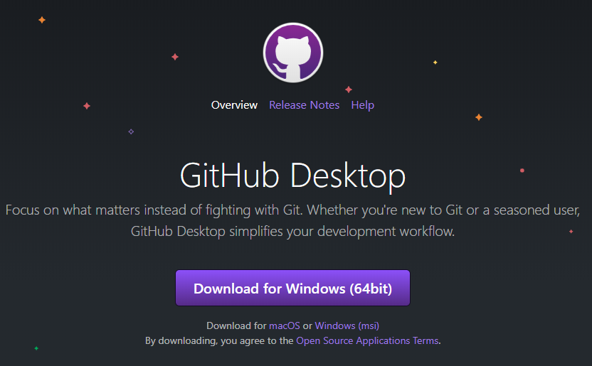{: .center loading="lazy" }

### Create a GitHub Account

Once GitHub Desktop has installed, it will prompt you to create an account. This redirects to the GitHub web page again, and then will log you on to GitHub desktop.

Once you have entered your GitHub credentials, you will also be asked to give a name and e-mail. The login is to check if you are the person who gets to change the file, and this second name and e-mail step is just to display who made the changes, and can be your name or something generic.

You can log in to a GitHub account, and change the name by clicking **File** and selecting **Options**.

## Adding the Project

Projects saved using **Git** are called **repositories**.

### Add the Project as a Repository

Click **File** and select **Add local repository...**.

!!! note
    The "New repository..." option will not work for an existing project. Although the Menu option looks identical to the menu that you are redirected to you, the "New repository..." choice will actually create a folder inside of your project, and only keep track of things that are inside that folder.

1. In the **Local path** field, click **Choose** and navigate to your project folder.
2. You will see a warning that says:
    ``This directory does not appear to be a Git repository``
3. Click the **create a repository link**.
4. The **Name** field should match the project folder name. Do not change this.
5. Make sure the **Git ignore** field is set to **None**.

You can add a license, which determines the ways other people are allowed to use your project, but this will only matter if you choose to make it public when it is uploaded. [You can learn more about licensing your repository on GitHub's website](https://help.github.com/en/github/creating-cloning-and-archiving-repositories/licensing-a-repository).

### Check out Your History

Once you have added the project, you can see all the files that got saved the first time by clicking thing **History** tab. The **Changes** tab shows files that have been changed but not saved using a **commit**, which you will learn how to do in the next section.

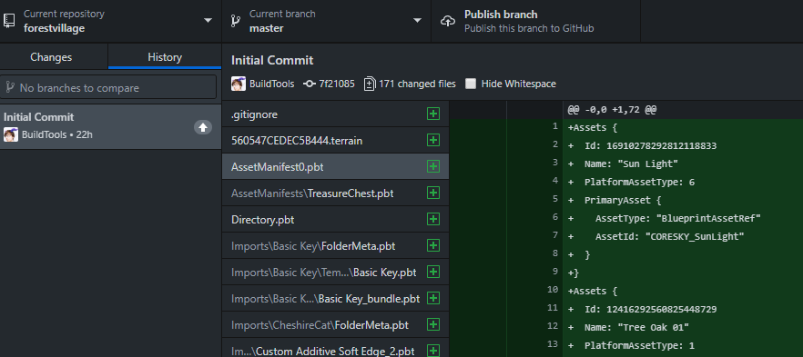{: .center loading="lazy" }

## Saving Project Changes

In the next step, we will talk about how to save (**commit**) your changes and upload (**push**) the changes to an online version of the project, a **remote repository**.

### Ignore Files

The Core Editor does not need every file in the folder to open a project. Some are generated when the project opens, so you can save time and space by not uploading those files. This is what a **.gitignore** file does.

It is literally just a list of file and folder names that Git does not need to keep track of.

1. In the top toolbar, select **Repository** and then **Repository settings...**.
2. In the menu that pops up, select the **Ignore files** tab.
3. Copy and paste the text below into the text box:

    ```sh
    # Exports folder is entirely generated
    Exports/

    # User settings are per user
    UserSettings/

    # Local storage for testing persistent storage
    Storage/
    ```

### Make a Commit

Once your Core Project has been added to GitHub desktop, any time you save changes to the project, the changed files should show up in the **Changes** tab.

Below the changed files, find the **Summary** field. Here is where you write a quick description of the changes made in this **Commit**.

What you write here will be your reference for the most recent changes made, so that if you needed to go back, you would know the state of the project at that point.

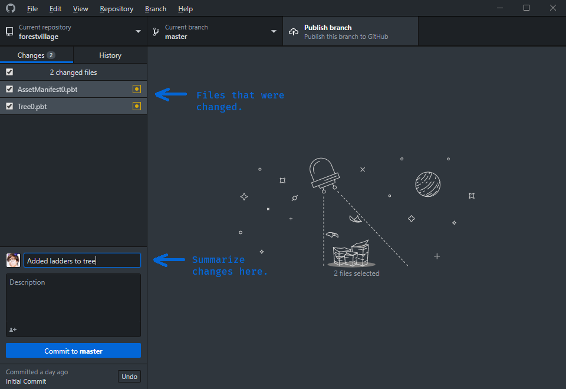{: .center loading="lazy" }

## Uploading a Project

With a local git repository, you have a saved record of the different stages of a project. To back it up online, and to make it so that you can download the project onto different machines easily, you will need a **remote repository**, which will be another copy of the project files, and the record of the changes, hosted online.

### Create a Remote Repository

Once you have committed all your changes, you will see an option suggesting that you publish your repository on GitHub.

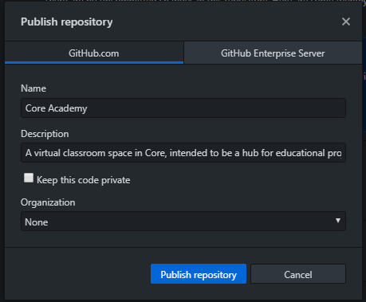{: .center loading="lazy" }

Click the **Publish repository** button to open a dialogue to put the project on the GitHub website.

You can change the title, or keep the one from the local repository. Check the **Keep this code private** box if you do not want others to be able to copy the project.

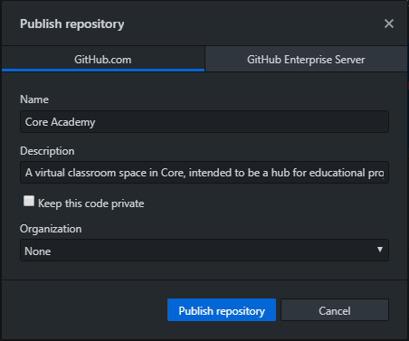{: .center loading="lazy" }

### Find the Project on GitHub

With a remote repository, you can see the files of the project, and the history of the changes made in each of your commits.

Press <kbd>Ctrl</kbd> + <kbd>Shift</kbd> + <kbd>G</kbd>, or select **Repository** in the top menu bar, and click **View on GitHub** to see the project page.

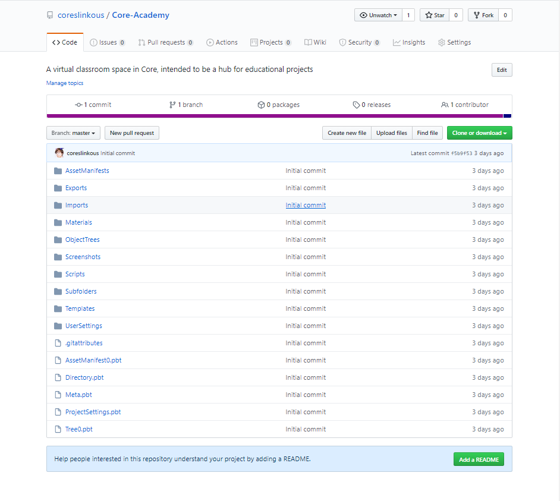{: .center loading="lazy" }

### Add a README

#### Why Create a README

This step is optional, and probably not necessary if you made your code private. However, if you want other people to be able to see and use your code, a **README** will allow you to write an introduction to the project, where you can explain your goals, keep a record of changes, and post links to resources you are using.

#### Add the README from the GitHub page

Click the **Add a README** button at the bottom of the project.

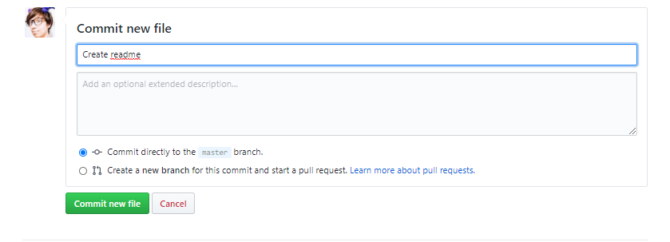{: .center loading="lazy" }

This will open a new file that contains the title and description you created for your project. This is written in the **Markdown** language, which allows you to format text in document. [Learn more about writing in Markdown here](https://github.com/adam-p/markdown-here/wiki/Markdown-Cheatsheet).

#### Commit the New README file

Once you have added more to the description of the project, add a commit message, select **Commit directly to the ``master`` branch** and click **Commit new file**.

## Pushing and Pulling Changes

Currently, we have a three step work-flow to back up the project to GitHub:

1. **Save** changes to the project and scripts in Core.
2. **Commit** a set of changes in GitHub Desktop.
3. **Push** those changes to the remote GitHub repository.

However, if you added a new README, then currently there are changes on the remote repository that are not in your local repository. To get the readme on the local project, you will need to **pull** the changes

### Pull Changes from the Remote Repository

**Origin** is how GitHub Desktop will refer to remote repository. To get those changes locally, click either of the **Pull origin** buttons that are displayed.

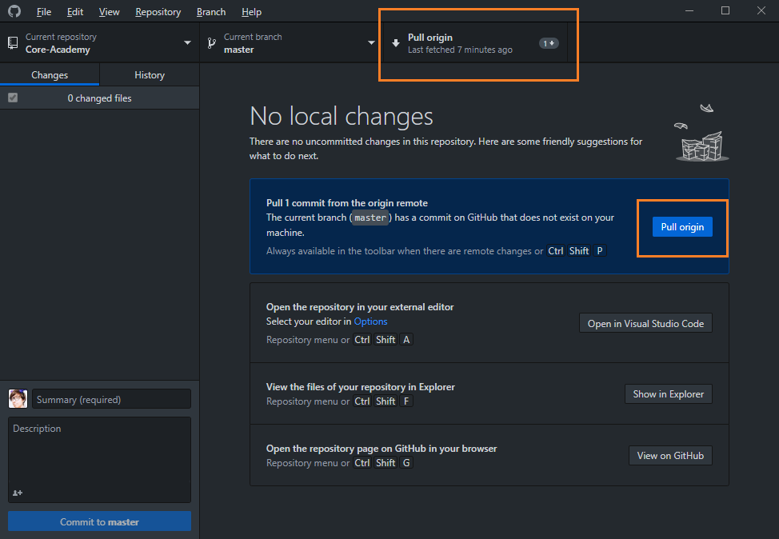{: .center loading="lazy" }

Once the project is finished pulling the changes, click the **History** tab to confirm. You should see the commit message you made to add the README at the top.

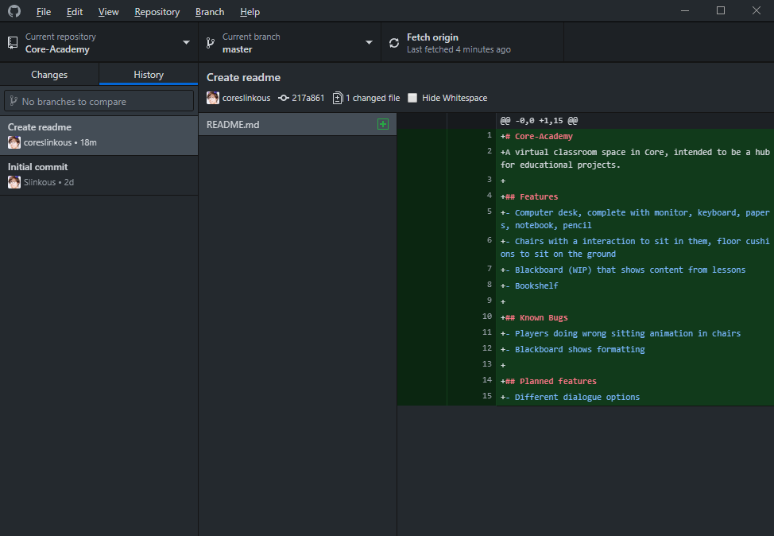{: .center loading="lazy" }

### Push New Changes

You do not need to immediately push after every commit, but it is a good idea to push all your changes whenever your stop working.

After committing your most recent changes, click the **Push origin** button to send all the commits made since your last push up to the remote version of the project.

## Downloading a Project

If you want to download the project onto a different computer, or allow someone else to download and work on it, you can do this by **cloning** it.

### Find or Fork a Remote Repository

You can clone a project from its page on GitHub. The top right of every project has a button that says **Clone**.

If you are using a project created by someone else, and want to be able to push your changes to GitHub, you should first **fork** the repository, which makes a separate copy on your GitHub account. You can test this with this [Core Academy Sample Project](https://github.com/coreslinkous/Core-Academy/). Click the **Fork** button to copy it to your own GitHub.

!!! note "If your project is private, you can only see it if you are logged in to GitHub."

### Clone with GitHub Desktop

When you click the **Clone** button on a GitHub repository, you will see the option to **Open in Desktop**. Click this to use GitHub desktop to clone.

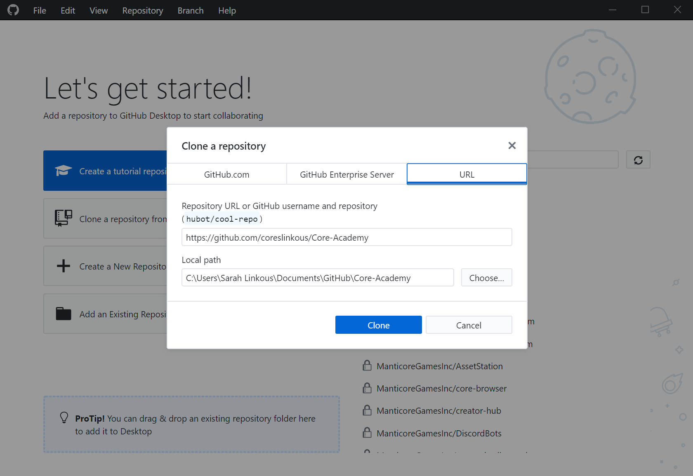{: .center loading="lazy" }

Change the location to the **Maps** folder where your other Core projects are stored.

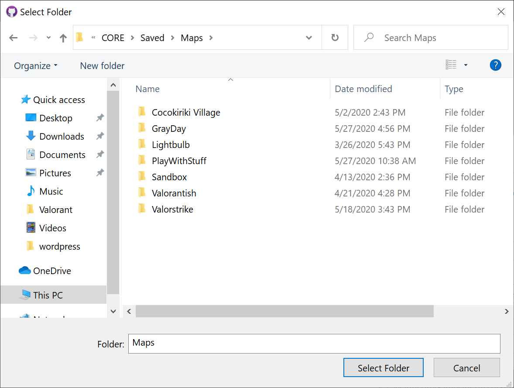{: .center loading="lazy" }

### Check Core for the Project

If your project has been cloned into the **Maps**, it will automatically appear in the **Create** tab of Core. Open Core to confirm that the project was saved in the correct place.

## Using Git for Collaboration

Git is also a tool for collaboration. It can allow you to work on the same project with someone else, and keep track of your individual changes.

### Organize Your Project

The challenge with working on a project at the same time as someone else, is what should happen if you both change something. This creates a **merge conflict**, where it is unclear which set of changes should stay, and which should get tossed out.

The easiest way to avoid this is work on separate parts of the project. **Folders** created in Core create actually folders in the files for your project. You can use them to separate objects so that you and your collaborators do not change the same parts of the project.

### Create a Branch

Up until now, you have only used the default branch, **master**. **Branches** allow you to separate your changes from the main project, and then integrate them back in when you are finished, by **merging**.

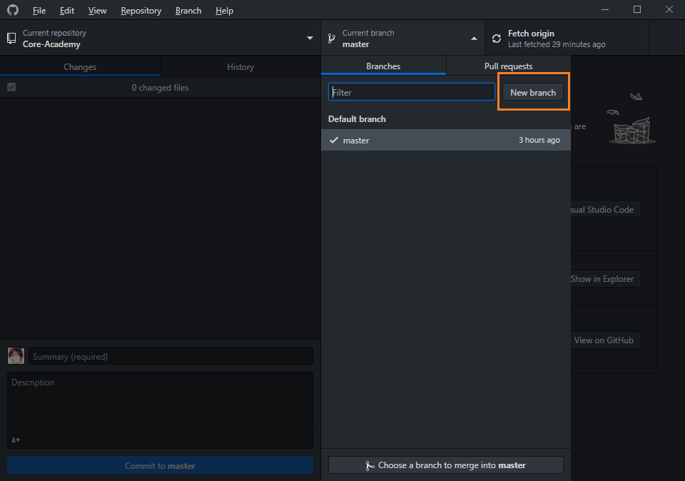{: .center loading="lazy" }

1. Click the **Current branch** tab in the project, which is most likely on **master**.
2. Select **New branch**, and give the branch the name of the feature that you will be creating on it.

Now, if you commit, it will be saved on the new branch, but not the master branch. You can also push those changes to a remote version of the branch.

### Create a Pull Request

If you are collaborating with someone else, you should use a **pull request** when your changes are finished to integrate it into the main project. [You can learn how to create a pull request on GitHub](https://help.github.com/en/github/collaborating-with-issues-and-pull-requests/creating-a-pull-request).

### Merge a Branch Locally

If you are not collaborating, you can **merge** the changes on to your local master branch, and then push to GitHub.

1. Change the current branch to **master**.
2. Press <kbd>Ctrl</kbd> + <kbd>Shift</kbd> + <kbd>M</kbd> or click **Branch** in the top menu and select **Merge into current branch**.
3. Select the branch whose changes you want to merge.

### Using Templates

Creating **templates** is an easy way to have multiple contributors to a project, without having to use Git. See the [Template Reference](template_reference.md) for more information on how to do this.

## Version Control Terminology

|                       |     |
|---------------------- | --- |
| **Git**               | A system for tracking changes in a project. |
| **GitHub**            | One of several websites that allows cloud storage of Git projects  |
| **History**           | The list of changes to files in a project  |
| **.gitignore**        | A special file that lists all the files and folders that do not need to be tracked with Git  |
| **Repository**        | A project that is tracked with Git. Sometimes shortened to **repo**  |
| **Local Repository**  | The tracked version of a project saved on your computer |
| **Remote Repository** | An online version of the project, which can be shared and downloaded onto other computers |
| **Commit**            | A record of a set of changes  |
| **README**            | A file in a repository that will be shown on the main repository page on GitHub |
| **Push**              | Send changes from a local repository to the remote repository |
| **Pull**              | Get changes from a remote repository on a local repository |
| **Fork**              | Make a copy on your own GitHub of a project |
| **Clone**             | Download a local copy of a project |
| **Branch**            | A way of separating changes from the main project |
| **Merge**             | The way to move changes from one branch onto another |
| **Merge Conflict**    | The result of changing the same file on different branches that must be resolved by choosing which changes to keep in each file. |

## Learn More

[Template Reference](template_reference.md) | [Complex Modeling](modeling_basics.md) | [Publishing](publishing.md)
