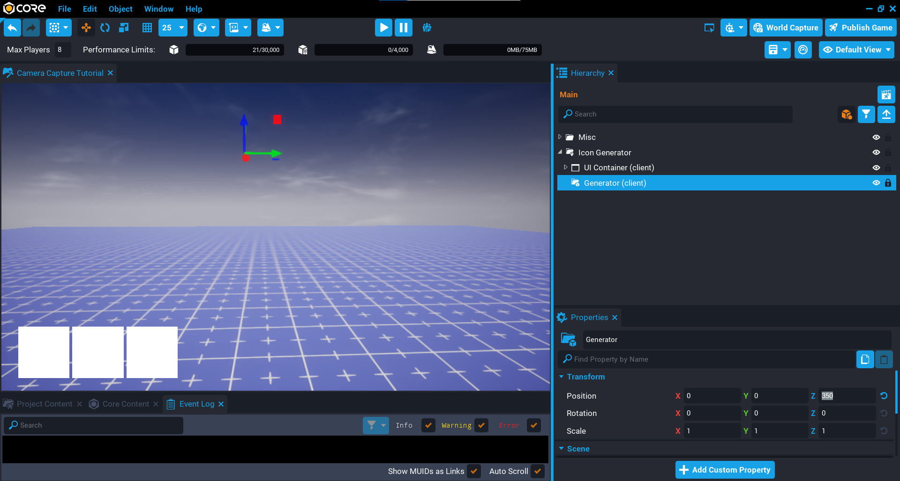
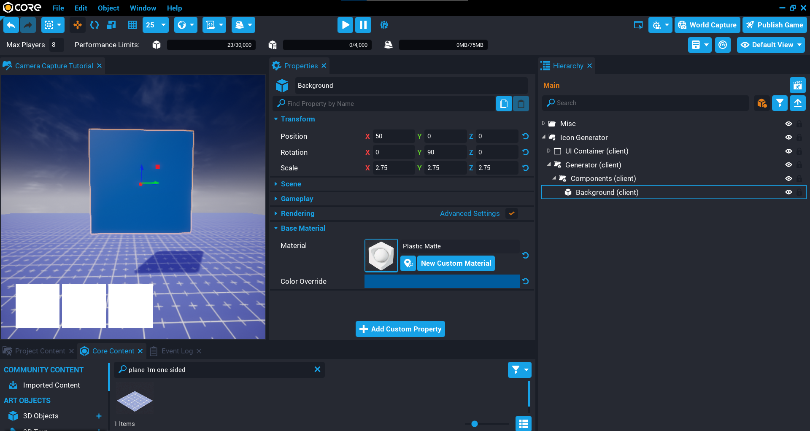
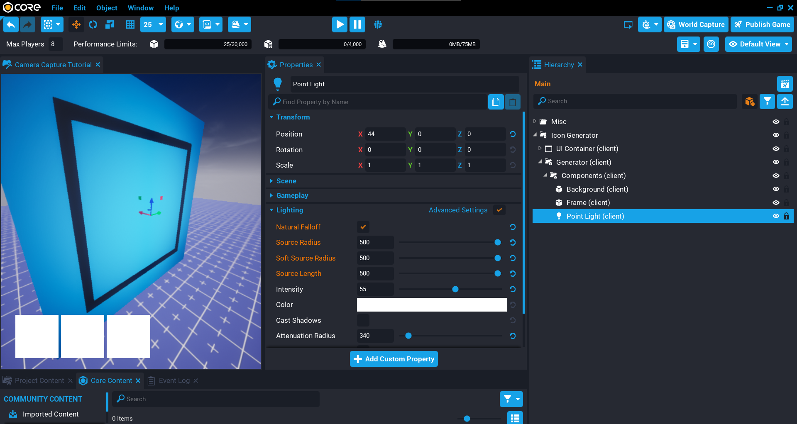
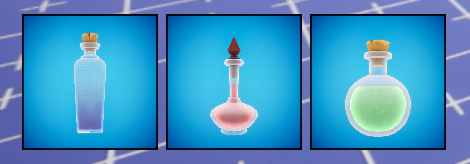
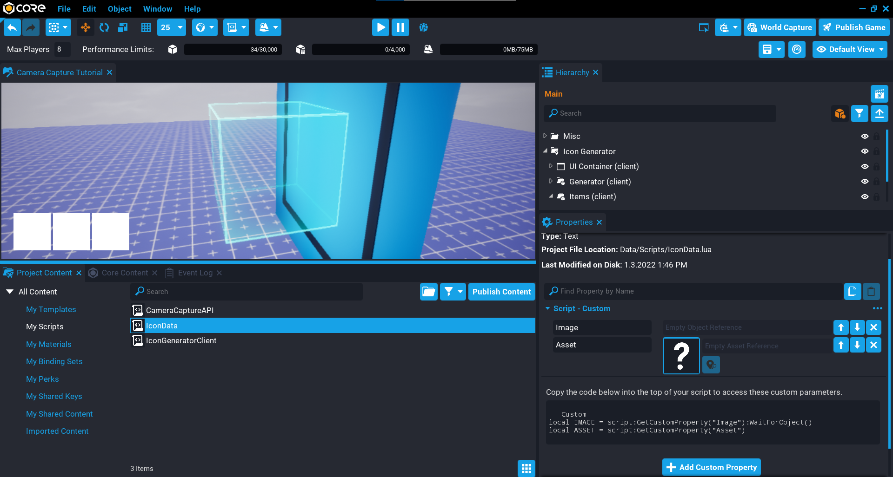
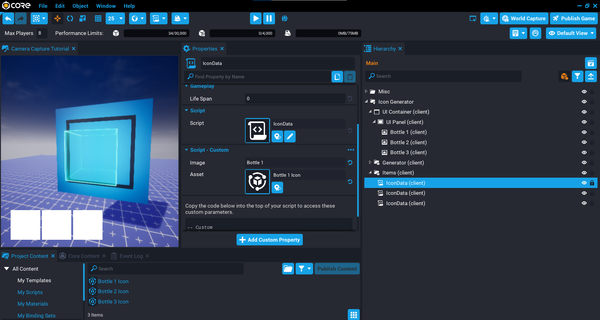
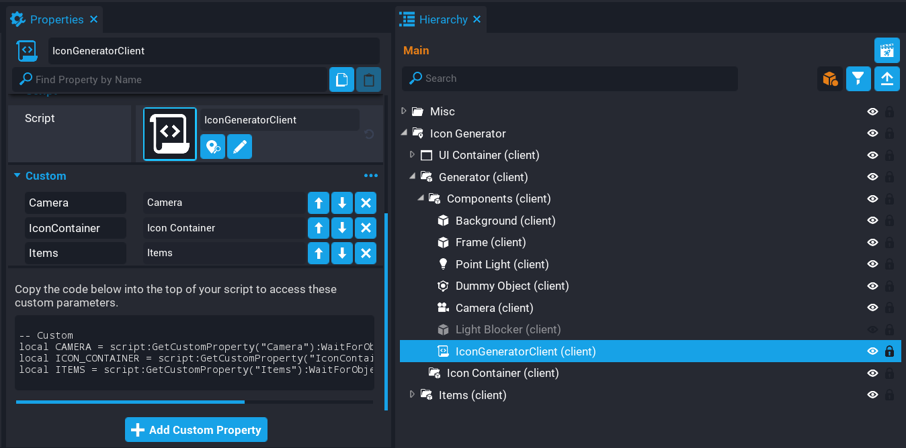

## Icon Generator

In this tutorial you will learn how to setup an area to create icons from 3D objects that can be used in the UI. For example, if you have an inventory and want the images to represent the in world object of the item, then you can use camera captures to do this.

* **Completion Time:** 30 minutes.
* **Knowledge Level:** It's recommended to have completed the [Camera Captures](../tutorials/camera_capture_basics.md) tutorial.
* **Skills you will learn:**
    * Setting up an area with lighting for the captures.
    * Creating data scripts to hold the UI image and icon asset.
    * Looping through the data scripts and automatically generate camera captures.

{: .center loading="lazy" }

### Create Client Context

Camera capturing is done on the client, and all the components for the area you will be building can be done in a client context.

Create a **Client Context** and name it `Icon Generator`.

{: .center loading="lazy" }

### Create UI

You will need some UI with UI Images that will be used to display the camera captures. For this tutorial, 3 UI images will be created that will be used to display 3 different bottles to the player. Adjust the UI to how you want it to look.

1. Create a **UI Container** inside the **Icon Generator** folder.
2. Create a **UI Panel** inside the **UI Container**.
3. Create 3 **UI Images** inside the **UI Panel**.

{: .center loading="lazy" }

### Create Icon Generator Area

The area that will be used to capture images will contain a few different components to make it easy to customise the generated icon to suit your UI.

#### Create Generator Folder

1. Create a new folder called `Generator` inside the **Icon Generator** folder.
2. Set the **Z** position to `350` so that all the components created later will be above the ground.

{: .center loading="lazy" }

#### Create Components Folder

The components folder will contain all the components that build up the area for the generator. This keeps the **Hierarchy** tidy.

Create a new folder called `Components` inside the **Generator** folder.

{: .center loading="lazy" }

#### Create Background

The background will be displayed behind the icon in the UI. This is useful as it could be used to display icons with different rarity.

1. In **Core Content** type `plane 1m one sided` into the search to find **Plane 1m - One Sided** and drag it into the **Components** folder.
2. Rename **Plane 1m - One Sided** to **Background**.
3. Set the **Position** of **X** to `50` in the **Properties** window.
4. Set the **Rotation** of **Y** to `90` in the **Properties** window.
5. Set the **Scale** to **X** `2.75`, **Y** `2.75`, **Z** `2.75` in the **Properties** window.
6. Change the **Material** property to **Plastic Matte** in the **Properties** window.
7. Adjust the **Color Override** property in the **Properties** window.

{: .center loading="lazy" }

#### Create Frame

The frame will be used to add a frame around the UI image. This is optional, you could add the frame in the UI if you prefer.

1. In **Core Content** type `pipe 4 sided` into the search to find **Pipe - 4-Sided Thin** and drag it into the **Components** folder.
2. Rename **Pipe - 4-Sided Thin** to `Frame`.
3. Set the **Position** of **X** to `50` in the **Properties** window.
4. Set the **Rotation** of **Y** to `90` in the **Properties** window.
5. Set the **Scale** to **X** `2`, **Y** `2`, **Z** `0.01` in the **Properties** window.
6. Change the **Material** property to **Plastic Matte** in the **Properties** window.
7. Adjust the **Color Override** property in the **Properties** window.

{: .center loading="lazy" }

#### Create Point Light

The point light will be used to light up the background, frame, and add some back lighting to the object that will be captured. You can adjust the light settings until you get the look you want.

1. Create a new **Point Light** inside the **Components** folder in the **Hierarchy**.
2. Set the **Position** of **X** to `44` in the **Properties** window.
3. Enable **Natural Falloff** in the **Properties** window.
4. Set **Source Radius** to `500` in the **Properties** window.
5. Set **Soft Source** to `500` in the **Properties** window.
6. Set **Source Length** to `500` in the **Properties** window.
7. Set **Intensity** to `55` in the **Properties** window.
8. Set **Attenuation Radius** to `340` in the **Properties** window.
9. Adjust the **Color** of the light.

{: .center loading="lazy" }

#### Create Dummy Object

The dummy object will be used as a guide for where to position the object that will be captured so it is within the camera bounds.

1. In **Core Content** type `dummy` into the search to find **Dummy Object** and drag it into the **Components** folder.
2. Under the **Smart** group in the **Properties** window, change the **Type** to **Box**.

{: .center loading="lazy" }

#### Create Camera

The camera will be responsible for taking the captures.

1. Create a new camera inside the **Component** folder.
2. Set the **Position** of **X** to `-150` in the **Properties** window.
3. Set the **Field of View** `50` in the **Properties** window.

{: .center loading="lazy" }

##### Modify Camera Properties

When you use a camera that will be used for camera capturing, certain properties need to be changed. **Core** will warn you in the **Event Log** about which properties should be changed when you try to create a capture.

Modify the following properties on the Camera you created.

| Property | Property Value |
| -------- | ----- |
| **Use as Default** | Uncheck this option. |
| **Attach To Local Player** | Uncheck this option. |
| **Position Offset** | Set to Zero. |
| **Initial Distance** | Set to Zero. |
| **Adjustable Distance** | Uncheck this option. |
| **Base Rotation Mode** | Set to Camera. |
| **Rotation Offset** | Set to Zero. |
| **Free Control** | Uncheck this option. |

{: .center loading="lazy" }

#### Create Light Blocker

To prevent any shadows or light effecting the captured image, you can add a cube around the area to be used as a blocker. Doing this will give you more control on how the captured image looks.



_Without Light Blocker (left) vs. With Light Blocker (right)_
{: .image-cluster}

1. In **Core Content** type `cube` into the search to find **Cube** and drag it into the **Components** folder.
2. Rename the **Cube** to `Light Blocker`.
3. Set the **Scale** to **X** `6`, **Y** `6`, **Z** `6` in the **Properties** window.

!!! tip "In the **Hierarchy** for the **Light Blocker**, click on the visibility icon {: .image-inline-text .image-background } to make it easier to see the capture area."

{: .center loading="lazy" }

### Create Icon Container

With all of the components created for the camera capture area, you will need a folder that will be used as the container for the objects that will get captured. This will be useful when you need to adjust the position of an object to be within the bounds.

In the **Hierarchy**, create a new folder called `Icon Container` inside the **Generator** folder.

{: .center loading="lazy" }

### Create Icon Templates

Create 3 templates that contain the 3D object you want to capture and show in the UI. For this tutorial, 3 different bottles will be used to display a different bottle in the UI.

It is recommended to create a new group inside the **Icon Container** and place your 3D objects inside that group. This way you can position the children of that group correctly so that when the generator spawns the asset, it will be in the correct location as the children will be offset from the parent group.

For example, here is how **Bottle 1** looks when done. Notice that the 3D object is a child of a group, and has been positioned and scaled to show within the bounds of the Dummy Object. Once you are happy with how it looks, create a new template. Repeat until you have 3 different templates.

{: .center loading="lazy" }

### Create Icon Data

To create the icons for the UI, you will be creating a folder that will contain scripts that hold data. The data will be used later by a script that will spawn that asset, create the capture, and then assign it to the UI image.

#### Create Items Folder

You will need a folder that will hold all the data scripts so that a script can fetch all the items and process each icon.

In the **Hierarchy** create a new folder called **Items** inside the **Icon Generator** folder.

{: .center loading="lazy" }

#### Create Icon Data Script

A data script doesn't usually contain any Lua code, it is simply a container that holds custom properties that can be fetched by a script. This is a good way to store data that a script needs to iterate through to process each item.

Create a new script called `IconData`.

Because this script is going to be used multiple times in the **Hierarchy**, setting up default custom properties from the **Project Content** window makes sense so you don't have to keep creating the custom properties.

1. In **Project Content**, find the **IconData** script and click on it so it is the active object.
2. In the **Properties** window, add a **Core Object Reference** custom property called `Image`.
3. In the **Properties** window, add a **Asset Reference** custom property called `Asset`.

The `Image` property will be linked to the UI image in the **UI Container**, and the `Asset` property will be linked to the template that will be spawned by the icon generator so it captures an image of that object.

{: .center loading="lazy" }

#### Create Icon Data

You will now need to add the **IconData** script to the **Items** folder and setup as many **IconData** scripts as you need. In the case of this tutorial, there are 3 UI Images that will be used to display 3 bottles. So 3 **IconData** scripts need to be added to the **Items** folder.

1. Drag the UI image from the **UI Container** onto the **Image** custom property.
2. Drag the template to use for this icon from **Project Content** onto the **Asset** custom property.

Repeat this for all your UI images.

{: .center loading="lazy" }

### Create IconGeneratorClient Script

The final step is to create a script that will loop through the icon data in the **Items** folder and generate the icon for each one.

Create a new script called `IconGeneratorClient` and place it into the **Components** folder.

#### Add Custom Properties

The **IconGeneratorClient** script will need references to the **Items** folder, **Items Container** folder, and **Camera**.

1. Add the **Camera** from the **Components** folder as a custom property called `Camera`.
2. Add the **Icon Container** from the **Generator** folder as a custom property called `IconContainer`.
3. Add the **Items** folder from the **Icon Generator** folder as a custom property called `Item`.

{: .center loading="lazy" }

#### Create IconGeneratorClient Code

Open up the **IconGeneratorClient** script and add the property references.

```lua
local CAMERA = script:GetCustomProperty("Camera"):WaitForObject()
local ICON_CONTAINER = script:GetCustomProperty("IconContainer"):WaitForObject()
local ITEMS = script:GetCustomProperty("Items"):WaitForObject()
```

##### Create Camera Captures

To create the camera captures, you will need to loop over all the children in the `ITEMS` folder. Each child is an `ItemData` script that is holding data about which asset to spawn, and which UI image to use to display the captured image.

Each iteration of the loop will spawn the asset for the item, place it into the `ICON_CONTAINER`, and create a capture. Once the capture has been done, the asset is then destroy so the area is cleared for the next item to be captured.

When creating a capture using the `Capture` function, it will return a `CameraCapture` object that will be used in the UI. This can then be set for the `image` using `SetCameraCapture`.

```lua
for i, item in ipairs(ITEMS:GetChildren()) do
    local asset = World.SpawnAsset(item:GetCustomProperty("Asset"), { parent = ICON_CONTAINER })
    local capture = CAMERA:Capture(CameraCaptureResolution.MEDIUM)
    local image = item:GetCustomProperty("Image"):WaitForObject()

    image:SetCameraCapture(capture)
    asset:Destroy()
end
```

#### The IconGeneratorClient Script

??? "IconGeneratorClient"
    ```lua
    local CAMERA = script:GetCustomProperty("Camera"):WaitForObject()
    local ICON_CONTAINER = script:GetCustomProperty("IconContainer"):WaitForObject()
    local ITEMS = script:GetCustomProperty("Items"):WaitForObject()

    for i, item in ipairs(ITEMS:GetChildren()) do
        local asset = World.SpawnAsset(item:GetCustomProperty("Asset"), { parent = ICON_CONTAINER })
        local capture = CAMERA:Capture(CameraCaptureResolution.MEDIUM)
        local image = item:GetCustomProperty("Image"):WaitForObject()

        image:SetCameraCapture(capture)
        asset:Destroy()
    end
    ```

### Test the Game

Test the game and make sure the camera capture is working. If you followed along with the tutorial, then the 3 UI images will display a different capture.

<div class="mt-video" style="width:100%">
    <video autoplay muted playsinline controls loop class="center" style="width:100%">
        <source src="/img/CameraCapture/IconGenerator/generator_final.mp4" type="video/mp4" />
    </video>
</div>

## Summary

Having an icon generator component can come in handy when you can't find a UI image that suits the object. Once the setup for the area is done, then it can be made into a template and reused in future projects.

There are more advanced features you could consider adding to the icon generator, such as automatically reusing or releasing existing captures, and even keeping track of how much memory budget has been used.

## Learn More

[Camera Capture API](../api/cameracapture.md) | [Camera Capture Resolutions](../api/enums.md#cameracaptureresolution) | [Camera API](../api/camera.md) | [UI Reference](../references/ui.md#camera-captures)
