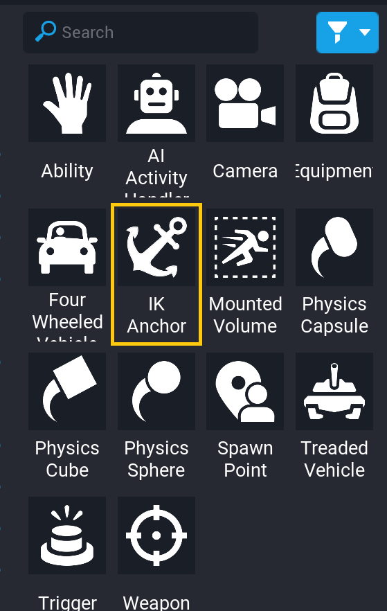
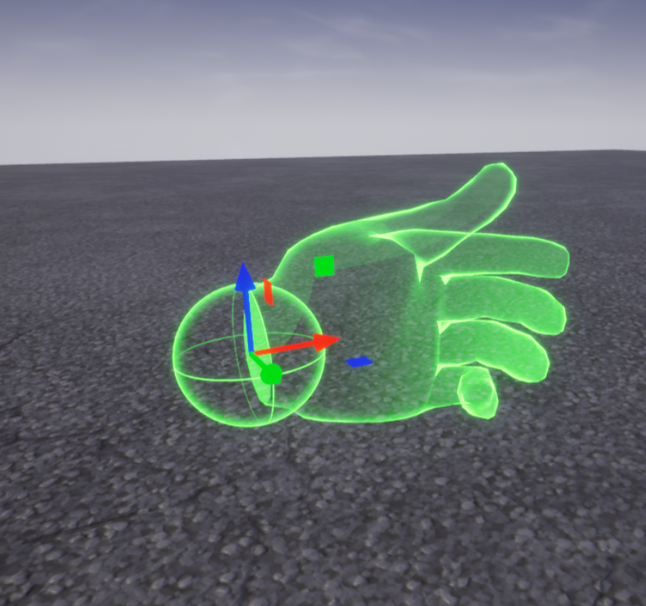

# IK Anchors

## Overview

IK Anchors are a system for modifying player animations. Players can be animated by setting their ``animationStance`` property, or by creating an [**Ability**](https://docs.coregames.com/api/ability/) and calling its ``Play`` method. **IK Anchors** allow creators to change the way specific joints move to create customized animations.

<!-- IK Anchors allow creators to augment animations so that character poses can be customized. It allows a creator to specify attachment points for specific bones such as hands, feet and hips. When activated, the anchor moves the specified bone to its position and orientation, overriding the normal animation state. Creators can add IK anchors points for a character to grab and animate anchors to create entirely new animations. A weight can be specified to indicate how much of the underlying animation is blended to the IK anchor. Some anchors may have aim offsets that specify what direction joints attached to the specific bone should aim to reach when the IK anchor is active. See the API section for more info. -->

## IK Anchor Bones and Properties

### Bones

There are 5 different bones that IK Anchors can control:

- Left Hand
- Right Hand
- Pelvis
- Left Foot
- Right Foot

### Properties

| Property | Definition |
| --- | --- |
| Anchor Type | Which player bone should be controlled by the Anchor |
| Aim Offset | How the closest joint should bend relative to the Anchor |
| Weight | How much the bone should be controlled by the Anchor. At 0 it will not be affected at all, and at 1 it will move as close to the anchor as possible. |
| Blend In Time | How long it should take for the bone to transition when the Anchor is activated. |
| Blend Out Time | How long it should take for the bone to revert when the Anchor is deactivated. |

*Pelvis, left, and right foot anchored, with **Aim Offset** at Y = 50 and Y = -50 (fig. 1), and both at Z = 50 (fig. 2)*
<!-- TODO: @Stanzilla can you make this smaller, like a figcaption element? Do we have a standardized way to do that? -->

## Adding IK Anchors

### Add an IK Anchor Object

The **IK Anchor** object can be found in the **Game Objects** section of **Core Content**, under **Game Components**

Select the **IK Anchor** and drag it into the Scene or **Hierarchy** to add it to the project.

!!!tip
    To make the **IK Anchor** object visible in the world, press the ++V++ key while it is selected. To make your IK Anchors always visible, select them and in the **Properties** window change **Editor Indicator Visibility** to **Always Visible**.

### Select the Correct Socket

### Activate the IK Anchor

---
## Learn More

[IK_Anchor in the Core Lua API](https://docs.coregames.com/api/ikanchor/) | [Player Animations and Sockets](https://docs.coregames.com/api/animations/) | [Player in the Core Lua API](https://docs.coregames.com/api/player/) | [Abilities Tutorial](abilities.md)
