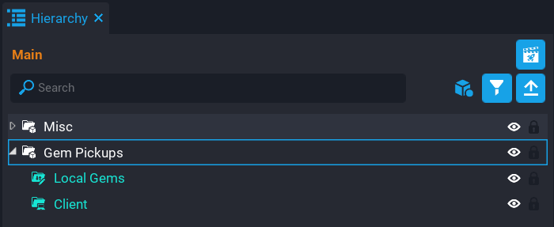
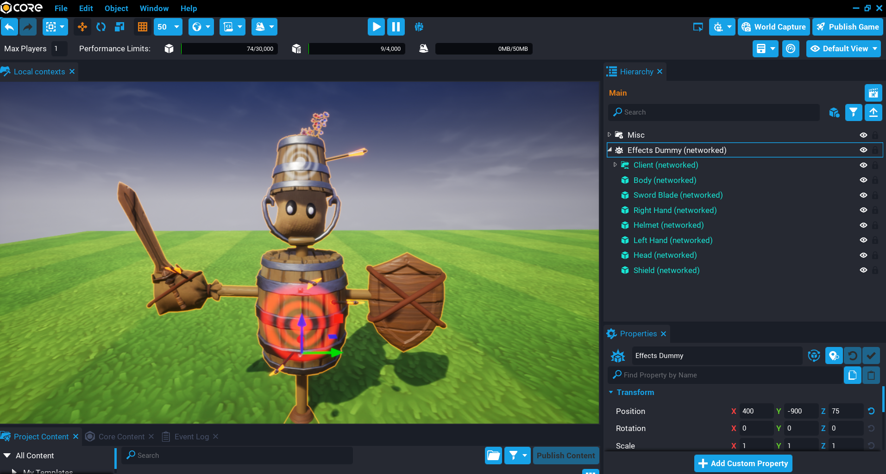
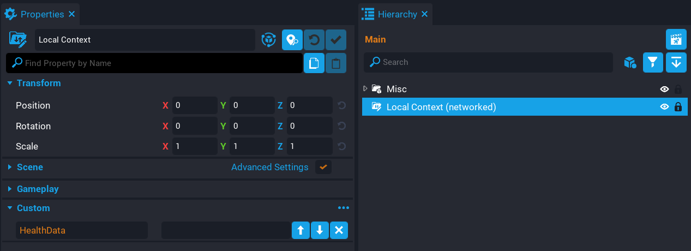
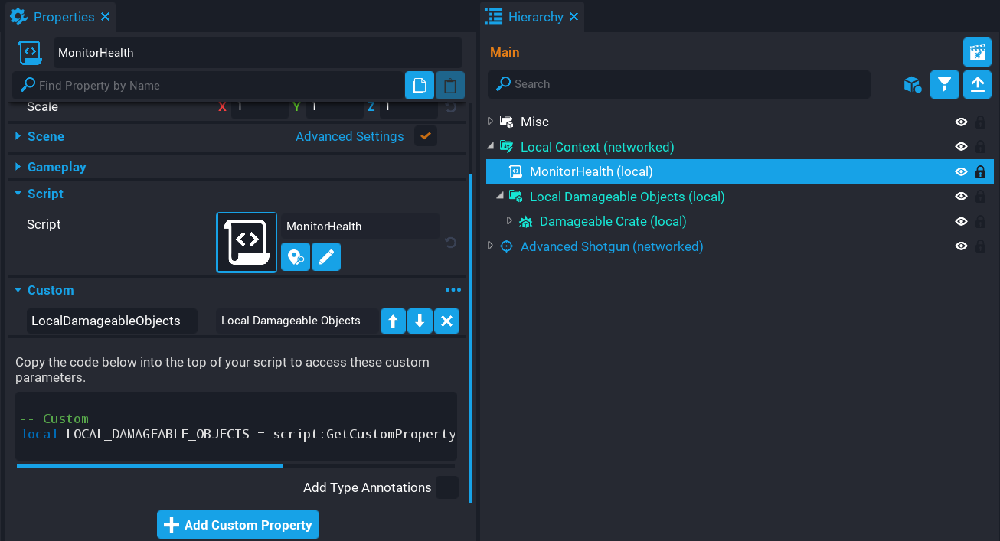

# Local Contexts

## Overview

In this tutorial you will be learning the benefits of using **Local Context** for your game to help you improve networking performance. You will be learning how to take an object that is usually networked, and optimizing it by handling the networking side of it yourself.

<div class="mt-video" style="width:100%">
    <video autoplay muted playsinline controls loop class="center" style="width:100%">
        <source src="/img/Networking/LocalContext/preview.mp4" type="video/mp4" />
    </video>
</div>

* **Completion Time:** ~30 minutes
* **Knowledge Level:** Good knowledge of Lua scripting, and [Networking in Core](../references/networking.md).
* **Skills you will learn:**
    * Local Context vs Static Context
    * Custom networking with Damageable Objects
    * Shared pickups with 0 networking
    * Cross context calling
    * Testing Local Context

---

## Local Context vs Static Context

A [**Local Context**](../references/networking.md#local-context) is very similar to a [**Static Context**](../references/networking.md#static-context). The main different between them is that the **Local Context** allows for the objects inside that context to be modified, whereas a **Static Context** will not. So this means that the objects which are inside the Local Context are spawned on the server and the client, including Lua scripts, which is the same behaviour as a static context.

When testing your game, it is recommended that all testing is done in **Multiplayer Preview Mode** because of the way local contexts work, and this is closest to a published game running on a live server.

!!! warning "Any networked object that is added to a local context will prompt you to disable networking. Local contexts do not allow networked children."

## Networked Objects

For the tutorial, we will be focusing on [**Damageable Objects**](../references/damageable_objects.md) and **Shared Pickups** to show how you can do your own networking to optimize networking performance and reduce networked object count which will lead to improved player experience.

## Shared Pickups

Games that have pickups usually are a first come first serve, meaning whoever gets to the pickup first is the only one that gets it because it is then destroyed, and other players can not pick it up.

Using **Local Context**, we can provide an optimized solution that uses 0 networked objects, and also create the pickups in a way that it is a shared item so that other players can also pick it up.

This solution requires a little bit of thinking because a local context script will need to do cross context calling to perform tasks such as spawning effects and giving the player a resource.

### Create Folder Structure

1. Create a group in the **Hierarchy** called `Gem Pickups`.
2. Inside the **Gem Pickups** group, create a **Local Context** called `Local Gems`.
3. Inside the **Gem Pickups** group, create a **Client Context** called `Client`.

{: .center loading="lazy" }

### Create Gem Pickup

Create a pickup that will be added to the **Local Gems** folder. Add as many as you want, and spread them out.

1. Set the pickup **Collision** and **Camera Collision** to **Force Off**.
2. Add a **Trigger** as a child and set **Collision** to **Force On**.

{: .center loading="lazy" }

### Create GemPickups Script

Create a script called `GemPickups` and place it into the **Local Gems** folder. This script is responsible for making sure the player can't pickup a pickup multi times. It was also handle cross calling for the server to update the player's resource, and cross calling to the client to handle turning off the visibility and playing the effects.

The reason for cross context calling, is that even with doing environment checks, it will still throw an error about accessing some API calls from the given context. So doing a cross context call will help around this issue.

#### Add Variables

Add the following variable so you have a list of all the triggers. The `players` table will hold the players that have accessed this pickup. This prevents them from entering the trigger and getting another gem resource.

```lua
local triggers = script.parent:FindDescendantsByType("Trigger")
local players = {}
```

#### Create OverlappedTrigger Function

Create a function called `OverlappedTrigger`. This function will check if the player has already overlapped this trigger to prevent multiple pickups. The 2 `Broadcast` calls are cross context calls to hide the gem on the client, and add one resource to the player on the server. Notice that the `addgem` broadcast is not inside an environment check. This is because this broadcast will be sent cross context to both the client and the server.

```lua
local function OverlappedTrigger(trigger, obj)
    if obj:IsA("Player") and (not players[obj] or not players[obj][trigger]) then
        if(not players[obj]) then
            players[obj] = {}
        end

        players[obj][trigger] = true

        if Environment.IsClient() then
            Events.Broadcast("hidegem", obj, trigger.parent)
        end

        Events.Broadcast("addgem", obj, trigger:GetWorldPosition())
    end
end
```

#### Create OnPlayerLeft Function

Create a function called `OnPlayerLeft` that will be called when the player leaves the game so the `players` table can be cleaned up.

```lua
local function OnPlayerLeft(player)
    if players[player] ~= nil then
        players[player] = nil
    end
end
```

#### Create Trigger Loop

Create a loop that will loop over all the triggers to connect the `beginOverlapEvent`.

```lua
for index, trigger in ipairs(triggers) do
    trigger.parent:RotateContinuous(Rotation.New(0, 0, 30 + math.random(1, 60)))

    trigger.beginOverlapEvent:Connect(OverlappedTrigger)
end
```

#### Connect Player Left Event

Connect up the `playerLeftEvent` that is fired when the player leaves the game.

```lua
Game.playerLeftEvent:Connect(OnPlayerLeft)
```

#### The GemsPickup Script

??? "GemsPickup"
    ```lua
    local triggers = script.parent:FindDescendantsByType("Trigger")
    local players = {}

    local function OverlappedTrigger(trigger, obj)
        if obj:IsA("Player") and (not players[obj] or not players[obj][trigger]) then
            if(not players[obj]) then
                players[obj] = {}
            end

            players[obj][trigger] = true

            if Environment.IsClient() then
                Events.Broadcast("hidegem", obj, trigger.parent)
            end

            Events.Broadcast("addgem", obj, trigger:GetWorldPosition())
        end
    end

    local function OnPlayerLeft(player)
        if players[player] ~= nil then
            players[player] = nil
        end
    end

    for index, trigger in ipairs(triggers) do
        trigger.parent:RotateContinuous(Rotation.New(0, 0, 30 + math.random(1, 60)))

        trigger.beginOverlapEvent:Connect(OverlappedTrigger)
    end

    Game.playerLeftEvent:Connect(OnPlayerLeft)
    ```

### Create GemServer Script

Create a script called `GemServer`. Place the script inside the **Gems Pickup** group in the **Default Context**. This script will listen for a specific broadcast event so it can update the player's gems resource amount. This is a cross context script that will be called from the **GemPickups** script.

Connect up the broadcast event for `addgem`.

```lua
Events.Connect("addgem", function(player)
    player:AddResource("Gems", 1)
end)
```

### Create GemClient Script

Create a script called `GemClient` and place it into the **Client** folder. This script will be responsible for spawning the effect and audio when the player picks up the gem. It will also hide the gem from that local player. This is a cross context script that is called from the **GemPickup** script.

Create a template for the effect that you want, and add it as a custom property called `GemPickupEffects`.

```lua
local GEM_PICKUP_EFFECTS = script:GetCustomProperty("GemPickupEffects")

local localPlayer = Game.GetLocalPlayer()

Events.Connect("addgem", function(player, pos)
    if player == localPlayer then
        World.SpawnAsset(GEM_PICKUP_EFFECTS, { position = pos })
    end
end)

Events.Connect("hidegem", function(player, gem)
    if player == localPlayer then
        gem.visibility = Visibility.FORCE_OFF
    end
end)
```

### Test the Game

Test the game in **Multiplayer Preview Mode** and make sure that the gem can be picked up. Make sure to test with multiple players.

<div class="mt-video" style="width:100%">
    <video autoplay muted playsinline controls loop class="center" style="width:100%">
        <source src="/img/Networking/LocalContext/gem_preview.mp4" type="video/mp4" />
    </video>
</div>

---

### Damageable Object

By default, **Damageable Objects** are networked when added to the **Hierarchy**. This is because the changes of the damageable object at runtime needs to be replicated to the players so they know about the state of the object. When a player shoots a damageable object and kills it, this information needs to be received by the players. The more players in your game, the more networked objects are used.

If we take a look at a general setup of a damageable object, you will see that just for one of these objects, it costs 9 networked objects per player, and this is a basic dummy damageable object. 9 might not sound a lot, but when you try to support more players in your game, this number will grow very quickly.

To get the total amount of networked objects in your game, you can take the networked object count of an object, and times it by the total number of players supported for your game. So for example, in the image below the cost is 9 networked objects for one player. If you wanted to support 12 players, then `9 x 12` = **108**. This is just for that single object.

{: .center loading="lazy" }

## Custom Networking

In this section we will go over how you could optimize the damageable object so that each damageable object will have a 0 network count. This means that you will need to create your own networking solution to reduce the networking count. This section attempts to cover most edge cases, but for further improvement, this would be down to you and how your game objects should behave.

### Create Local context

The **Local Context** will contain all the objects that would normally be networked. These objects (including scripts), will be spawned on the server and the client. The local context you will create will need to have networking enabled. The reason for this, is that the custom networking method you will be using in this case, is **Dynamic Properties**. All health data for the damageable objects will be sent to the clients this way.

1. Create a **Local Context** in the **Hierarchy**.
2. Right click on the **Local Context** and select **Enable Networking**.
3. Add a **string** custom property called `HealthData`.
4. Enable **Dynamic Property** for the **HealthData** property.

{: .center loading="lazy" }

### Create Group Container

To keep things organised and easier to loop over, create a **Group** called `Local Damageable Objects`. This group is where you will place all the damageable objects that you want to have 0 networking.

### Create Damageable Objects

From **Core Content**, search for `damageable crate` to find the **Damageable Crate** object and add it to the **Local Damageable Objects** group.

When you drop a networked object into a **Local Context**, it will not go directly into that folder. You will need to then drag the object into the **Local Context**, which will then prompt you to disable networking and distance the template if it applies.

{: .center loading="lazy" }

### Add Weapon

To do damage to the damageable crate, you will need a weapon.

From **Core Content**, search for `Shotgun` to find the **Advanced Shotgun** and add it to the **Hierarchy**.

### Test the Game

#### Local Preview Mode

Test the game in **Local Preview Mode** first to see if everything works as expected. You should see that the crate is destroyed and the effect is played.

<div class="mt-video" style="width:100%">
    <video autoplay muted playsinline controls loop class="center" style="width:100%">
        <source src="/img/Networking/LocalContext/local_preview.mp4" type="video/mp4" />
    </video>
</div>

#### Multiplayer Preview Mode

Test the game in **Multiplayer Preview Mode**. You should see that the crate doesn't appear to get destroyed. What is happening here, is that the crate on the server is destroyed, but the client has no way of knowing that. Remember that the **Local Context** spawns on the server and the client. There is no networking happening.

<div class="mt-video" style="width:100%">
    <video autoplay muted playsinline controls loop class="center" style="width:100%">
        <source src="/img/Networking/LocalContext/multiplayer_preview.mp4" type="video/mp4" />
    </video>
</div>

### Monitor Health

In this section you will be creating a script that will be monitoring the health of all the damageable crates and sending this data to each client. Doing this will allow you to handle the client side destroying of the crate and also play the effect.

The method you will be using to send the data is the dynamic property `HealthData` that you created earlier. This property will contain a string made up of the health of each damageable crate. Because the local context children is in the same order for both the server and the client, we can use this as an advantage for minimizing the amount of data that is sent by the dynamic property.

#### Create MonitorHealth Script

Create a script called `MonitorHealth`, and place it inside the **Local Context** which is networked. You will also need to add a reference to the **Local Damageable Objects** group so that the script can loop through the children.

{: .center loading="lazy" }

#### Add Variables

Add the following variables so that you have a reference to the property and all the children that are a type of **DamageableObject**.

```lua
local LOCAL_DAMAGEABLE_OBJECTS = script:GetCustomProperty("LocalDamageableObjects"):WaitForObject()

local children = LOCAL_DAMAGEABLE_OBJECTS:FindDescendantsByType("DamageableObject")
```

##### Create UpdateHealthData Function

Create a function called `UpdateHealthData`. This function is responsible for getting the `hitPoints` for each damageable object and adding it as a string to the **HealthData** dynamic property.

```lua
local function UpdateHealthData(obj)
    local data = {}

    for i, c in ipairs(children) do
        if Object.IsValid(c) then
            table.insert(data, c.hitPoints)
        end
    end

    script.parent:SetCustomProperty("HealthData", table.concat(data, "|"))
end
```

##### Create OnChildAdded Function

Create a function called `OnChildAdded`. This function will update the `children` table so that it contains a list of all the damageable objects. Because some damageable objects can spawn a networked template, you need to monitor when this happens so that the `damagedEvent` is connected to the new child. Notice that an `Environment` check is being done since it needs to be done on the server.

!!! warning "Damageable Objects with Networked Template Property Set"
    If the damageable object has been setup to spawn a networked object when it is destroyed, then the object that is spawned will not be killable on the client. The template will have to be non-networked for this to work.

```lua
local function OnChildAdded(parent, child)
    children = LOCAL_DAMAGEABLE_OBJECTS:FindDescendantsByType("DamageableObject")

    if(Environment.IsServer()) then
        child.damagedEvent:Connect(UpdateHealthData)
    end
end
```

##### Create OnPropertyChanged Function

Create a function called `OnPropertyChanged` that will be called when the dynamic property **HealthData** changes. This will split the string and loop over the parts (health of the damageable object) and check if the health is `0`. If the health is `0` then we can kill the damageable crate by calling `Die` which will also trigger the client template on the damageable crate.

```lua
local function OnPropertyChanged(obj, prop, destroy)
    if prop == "HealthData" then
        local objs = LOCAL_DAMAGEABLE_OBJECTS:FindDescendantsByType("DamageableObject")
        local data = { CoreString.Split(script.parent:GetCustomProperty("HealthData"), "|") }

        for index, health in ipairs(data) do
            if Object.IsValid(objs[index]) and tonumber(health) == 0 then
                if destroy then
                    objs[index]:Destroy()
                else
                    objs[index]:Die()
                end
            end
        end
    end
end
```

##### Create Children Loop

Loop over all the children on the server and setup the `damagedEvent`.

```lua
if Environment.IsServer() then
    for i, damageable in ipairs(children) do
        damageable.damagedEvent:Connect(UpdateHealthData)
    end
end
```

##### Connect Property Changed Event

On the client connect up the `customPropertyChangedEvent` and call `OnPropertyChanged` to make sure existing crates are removed.

```lua
if Environment.IsClient() then
    script.parent.customPropertyChangedEvent:Connect(OnPropertyChanged)

    OnPropertyChanged(nil, "HealthData", true)
end
```

##### Connect Child Added Event

Connect up the `childAddedEvent` that will be called anytime a new object is added to the group.

```lua
LOCAL_DAMAGEABLE_OBJECTS.childAddedEvent:Connect(OnChildAdded)
```

##### The MonitorHealth Script

??? "MonitorHealth"
    ```lua
    local LOCAL_DAMAGEABLE_OBJECTS = script:GetCustomProperty("LocalDamageableObjects"):WaitForObject()

    local children = LOCAL_DAMAGEABLE_OBJECTS:FindDescendantsByType("DamageableObject")

    local function UpdateHealthData(obj)
        local data = {}

        for i, c in ipairs(children) do
            if Object.IsValid(c) then
                table.insert(data, c.hitPoints)
            end
        end

        script.parent:SetCustomProperty("HealthData", table.concat(data, "|"))
    end

    local function OnChildAdded(parent, child)
        children = LOCAL_DAMAGEABLE_OBJECTS:FindDescendantsByType("DamageableObject")

        if(Environment.IsServer()) then
            child.damagedEvent:Connect(UpdateHealthData)
        end
    end

    local function OnPropertyChanged(obj, prop, destroy)
        if prop == "HealthData" then
            local objs = LOCAL_DAMAGEABLE_OBJECTS:FindDescendantsByType("DamageableObject")
            local data = { CoreString.Split(script.parent:GetCustomProperty("HealthData"), "|") }

            for index, health in ipairs(data) do
                if Object.IsValid(objs[index]) and tonumber(health) == 0 then
                    if destroy then
                        objs[index]:Destroy()
                    else
                        objs[index]:Die()
                    end
                end
            end
        end
    end

    if Environment.IsServer() then
        for i, damageable in ipairs(children) do
            damageable.damagedEvent:Connect(UpdateHealthData)
        end
    end

    if Environment.IsClient() then
        script.parent.customPropertyChangedEvent:Connect(OnPropertyChanged)

        OnPropertyChanged(nil, "HealthData", true)
    end

    LOCAL_DAMAGEABLE_OBJECTS.childAddedEvent:Connect(OnChildAdded)
    ```

#### Test the Game

Test the game in multiplayer preview and check that it works.

<div class="mt-video" style="width:100%">
    <video autoplay muted playsinline controls loop class="center" style="width:100%">
        <source src="/img/Networking/LocalContext/crate_preview.mp4" type="video/mp4" />
    </video>
</div>

## Summary

**Local Context** allows you to improve networking performance for your game, which will improve the player experience. Make sure you test your game in a multiplayer setting when implementing your own networking solution.

## Learn More

[Network Contexts](../api/contexts.md) | [Networking in Core](../references/networking.md) | [Network Relevancy](../references/network_relevancy.md) | [Damageable Objects](../references/damageable_objects.md)
