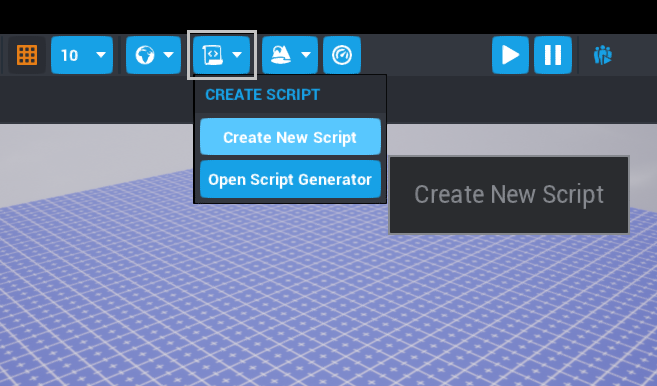

# Lua Scripting Tutorial

## Overview

This tutorial intoduces the basics of creating scripts in Core, using the [Lua](https://lua.org) Programming Language. **You do not need to know how to program** to start this tutorial. If you are interested in a basic overview of programming concepts, our [Scripting Introduction](scripting_intro.md) is a great place to start.

In the first part of a tutorial, you will create and run your first script, following the programming tradition of making a "Hello, World!" script to introduce yourself to to a new langauge.

In the second part, you will learn how to take an existing template in Core and use scripts to change it, by importing a bedroom scene into your project, and making a light switch that illuminates it.

### About Lua and Core

**Core** uses the **Lua** programming language, which has the advantage of being beginner-friendly but suitable for advanced programming projects.

- The **Event Log** window in Core shows output from scripts, including errors. You can enable it by clicking **Window** in the top menu bar, and selecting **Event Log**.
- The [Core API](../api/index.md) page lists code created for you to use in Core.
- The [API Examples](../api/index.md) page has sample code using the **Core API** with explanations that you can use to better understand how the objects and functions are used.
- The [Programming in Lua](https://www.lua.org/pil/contents.html), a free online version of the official "Programming in Lua" book by Roberto Ierusalimschy.
- The [Scripting Help Section](https://forums.coregames.com/c/scripting-help/16) on the Core Creator Forums.

## Part One: Creating Your First Script

### Create a New Project

In the **Core Launcher**, use the **Create** menu to create a new empty project. You can name this project **Lua Tutorial**, or whatever you like.

### Create the Script

Open up the editor and click the **Create Script** {: style="height:34px" }
button in the toolbar at the top left of the editor.
{: .image-inline-text .image-background }

{: .image-frame .center loading="lazy" }

Name it `TutorialScript` for now.

!!! tip "You can rename scripts by clicking on the name of the script in the **Hierarchy** and  ++F2++."

### Open the Script for Editing

Your new script will appear in the **Project Content** window, in the **My Scripts** section. Double click **TutorialScript** to open the **Script Editor**

{: .image-frame .center loading="lazy" }

!!! info
    You can also configure Core to open in an external editor instead of the built-in editor. See the  [editor integrations](extensions.md) page to learn more.

### Writing the Script

Type the text below into your new empty script:

```lua
UI.PrintToScreen("Hello World!")
```

Next, press ++Ctrl++ + ++S++ to save.

### Running the Script

Now we have created a simple script! However, we need to actually add it to our game for it to do the code we wrote.

1. To add your script to the game, drag it from the **My Scripts** area of the **Project Content** tab to the **Hierarchy** window, usually on the right side of the editor.

    {: .image-frame .center loading="lazy" }
    !!! info "If any of these windows are missing, open them again from the **Window** menu in the top menu bar."

2. Press **Play**  or ++equal++ at the top of the editor, and see your message appear on screen in the top left corner!
{ .image-inline-text .image-background }

{: .image-background .center loading="lazy" }

The function `UI.PrintToScreen(string)` writes whatever is between `()` in `""` on the screen of your game. This is one of many of the [built-in Core API functions](../api/index.md).

### Review: Creating and Running a Script

1. Create new script with the **Create Script** {: style="height:34px" }.
{ .image-inline-text .image-background }
2. Open the script by clicking its name in the **My Scripts** section of **Project**.
3. Add code to the script and save.
4. Drag the script from **Project Content** to the **Hierarchy** to make it run when the game starts.
5. Press **Play**  or ++equal++ to run the script.
{ .image-inline-text .image-background }

### About Functions

In programming, a function is a named section of a script that performs a procedure.

You could think of it in terms of sandwich making. For a task like slicing an ingredient, you would need to use procedures like:

- Locate cutting board
- Grab knife
- Hold object to cut properly
- Begin slicing

For each item you want to slice for the sandwich, you would have to type out that whole list each time! That would mean repeating all of these steps for the tomatoes, cheese, pickles, and other sandwich ingredients. If you made a function instead, you could just type `SliceObject(tomato)` to do all those steps.

In order to be able to perform our task exactly when and how we want to, we're going to change `TutorialScript` to use a function to say "Hello, World!"

### Create the Init Function

To put `UI.PrintToScreen` line is within a function, make a new function called `Init`.

1. Open up your `TutorialScript`.
2. Replace your existing code with this:

```lua
-- Our first function!
local function Init()
    UI.PrintToScreen("Hello from a function!")
end
```

!!! note
    Putting `--` at the beginning of a line makes that line a *comment*, which means it is ignored by the computer. Comments are used to help humans understand what a piece of code is doing.

### Call the Function

If you save and run this code, nothing will happen.

The code you added **defined** the function, telling the computer that there is a process called `Init`, and `UI.PrintToScreen("Hello from a function")` is what it should do when it is time to do this process.

To make `Init` run, you need to **call** it. You can do this multiple times, or in many different points in a script.

To call a function, use its name and `()` on a separate line:

```lua
-- Calling the function
Init()
```

Your entire script should now look like this:

```lua
-- Our first function!
local function Init()
    UI.PrintToScreen("Hello from a function!")
end

-- Calling the function
Init()
```

Now if you save and run this, you'll see your message appear on the screen! Excellent.

!!! note
    Lua requires functions to be declared on a line before any line that calls them. To keep this organized, we will put all function declarations at the top of the script, and calls further down.

### Review: Creating and Using a Function

1. **Define** the function, including the code that it should run.
2. **Call** the function to make that code run.
3. Use **comments** to explain what the function should do.

You can now delete the `TutorialScript` from your project Hierarchy. The contents of the script will be saved, but it will no longer run when the game preview starts.

In the next part of this tutorial, you will put your knowledge to the test!

## Part Two: Lightbulb

[Start on Part Two: Lightbulb](lua_basics_lightbulb.md) now to learn more about moving and changing objects in with Lua!
