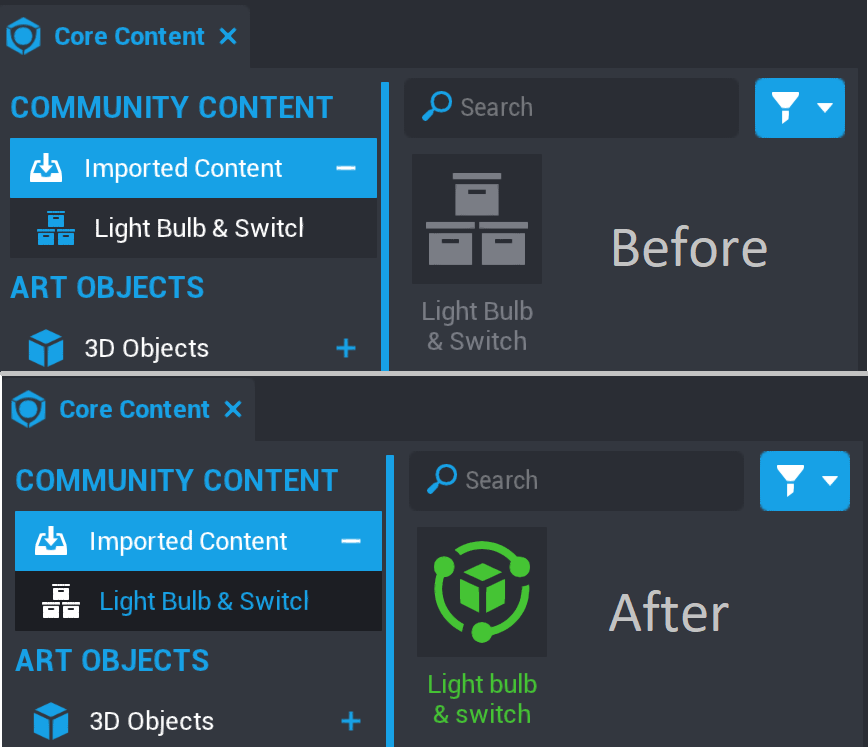
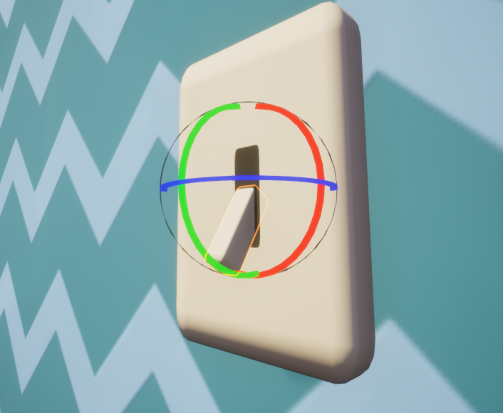
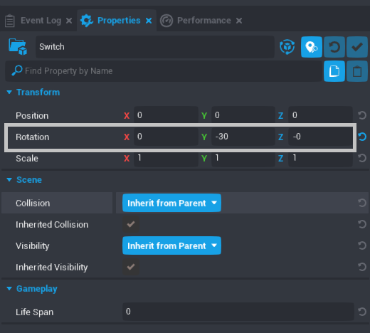
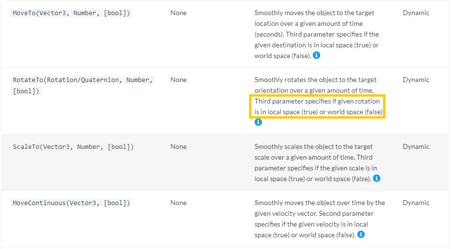
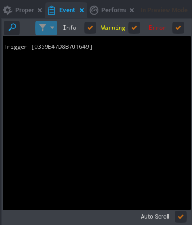
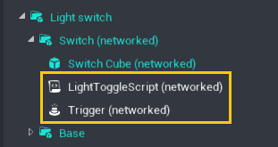

# Lua Scripting Tutorial, Part 2

## Overview

In this tutorial you will learn how to take an existing template in Core and use scripts to change it.

We are going to create something that brightens every room: a light switch!

This involves turning on and off a light switch to illuminate a light bulb.

{: .image-frame .center loading="lazy" }

---

## Setting Up the Template

### Download the Template

1. Open the **Community Content** window in the Core Editor.
2. User the search bar to search for ``switch`` and find **Lightbulb & Switch** *(by CoreAcademy)*
3. Click **Import**  to download the template.

{: .image-frame .center loading="lazy" }

!!! note
    You can also use the original **Light Bulb & Switch** template by **Tobs**. The CoreAcademy version has just been updated to use newer Core Content.

### Open the Template

1. In the **Core Content** window, find the **Imported Content** section and **Light Bulb & Switch** {: style="height:34px" }.
{ .image-inline-text .image-background }
2. Double-click the {: style="height:34px" } icon to open it. You should now see the green {: style="height:34px" } icon.
{ .image-inline-text .image-background }

{: .image-frame .center loading="lazy" }

1. Click on the **Light Bulb & Switch** package and drag it into your game by dragging it into the **Main Viewport**.
2. Make sure **Group Selection Mode** is turned on to select the entire template. You can use the ++C++ key to switch between this and **Object Selection Mode**.
3. Reposition the wall and lightbulb where you want it using the transform tools in the top toolbar. To learn more about moving objects, check out the [Intro to the Editor](editor_intro.md).

{: .image-frame .center loading="lazy" }

!!! note
    If you click on the wall, or part of the scene, this will not select the entire template. Click the **Lightbulb and Switch** folder in the **Hierarchy** to move, resize, or rotate it.

### Create a New Script

1. To get started making this light switch work, we're going to create a new script by clicking the  **Create Script** button in the toolbar at the top of the editor.
{ .image-inline-text .image-background }

2. Name this script `LightToggleScript`.

3. Save the script by pressing ++Ctrl+S++.

    !!! info
        It's important to save your scripts often so you don't lose work in the event of a problem. Use ++Ctrl+Shift+S++ to save all scripts when you save your project.

### Deinstance the Lightbulb & Switch Template

To make changes to the template, we first need to **deinstance** it.

Right click on the **Light bulb & Switch** template in the **Hierarchy** and select **Deinstance This Object**.

{: .image-frame .center loading="lazy" }

The template and objects in the template will change from **blue**{: style="color: var(--core-color-templetized)"} to **teal**{: style="color: var(--core-color-deinstanced)"}. This color change means that the template is now editable.

Deinstancing allows you to make changes to a particular copy of a template without changing the template itself. You can learn more about how this works in our [template reference](template_reference.md).

### Add the Script to the Template

1. Open the contents of the **Light bulb & switch** template by clicking the  drop down arrow to the left of its name in the Hierarchy.
2. Open up the **Light switch** folder to find a folder inside called **Switch**.
3. Drag the `LightToggleScript` from **Project Content** tab into the **Switch** group folder.

## Writing the Code

### Define the Switch

We want our light switch to function just like a real one: the switch will point up or down depending on whether the light is turned on or off.

First you will need to tell the script which object in the scene is the switch, so that it knows what to rotate. You will create a variable that defines what the switch is.

To move the switch, we need a way to talk about the specific object from the game space in code.

Type the following into Line 1 of `LightToggleScript`:

```lua
local switch = script.parent
```

- `local` is a **keyword** that indicates that you are making a variable. We use the term *local* here because it will only be accessible from this script rather than being accessible from external scripts, or globally.
- `switch` is the variable name. You can name it anything but it's important to create variables with self-explanatory names so our scripts are easy to read and understand.
- `script.parent` refers to the script's parent - the group or folder the script is placed in. In this case it refers to the **Switch** group. If you wanted to reference the entire **Light Switch & Bulb template**, for example, you would use `script.parent.parent.parent`.

## Finding the Switch's Rotation

To figure out how to rotate the switch, you will move it around in game, and take note of the **Rotation** displayed in the switch's **Properties** menu.

### Select the Switch

Click on the **Switch (networked)** group in the **Hierarchy** to select it. Note that you will need to select the entire group, not just the cube inside of it, because that is what `switch` variable refers to.

{: .image-frame .center loading="lazy" }

### Find the Switch's Current Rotation

1. Turn on **Rotation** mode by clicking the  button, or pressing ++E++
{ .image-inline-text .image-background }

    {: .image-frame .center loading="lazy" }

2. Look at the **Properties** window. In the **Transform** section, you should see a property called **Rotation**, with an **X**, **Y**, and **Z** value.

    {: .image-frame .center loading="lazy" }

### Rotate the Switch in the Editor

To figure out where the switch needs to be, we'll reposition it using the **Rotate** tool, and take note of final rotation that we want to change it to.

1. Click the **green** ring on the **Rotate** tool to move the switch up and down, and take note of the change in the **Y** value of the switch's **Rotation** property.
2. Press ++Ctrl+Z++ to return the switch to its original position.

Your rotations may be different, but will most likely look like this:

|  On / Off | X | Y | Z |
| --- | --- | --- | --- |
|  On | -0 | -60 | 0 |
|  Off | -180 | -60 | 180 |

## Scripting the Rotation

### Create Variables for Each Rotation

Now that you know the rotations of the switch for "on" and "off", you can save them as variables. On the next line of your `LightToggleScript` add these lines:

```lua
local onRotation = Rotation.New(0, -60, -0)
local offRotation = Rotation.New(-180, -60, 180)
```

- `Rotation.New` means we are telling the script to rotate our object to a new set of coordinates.
- `(0, 60, 0)` are the x, y, and z coordinates (respectively) of where we want our switch to rotate to. We want to rotate our switch up along the y-axis by 90 degrees.

!!! note
    You will almost always use `Rotation.New` when rotating an object, but there is also a predefined Rotation called `Rotation.ZERO` which will rotate the object to `0, 0, 0`.
    [Learn more about Rotations on the Core API](../api/rotation.md) page.

### Make the Switch Move with a Script

Next you will rotate the switch. On a new line, type:

```lua
switch:RotateTo(onRotation, 2)
```

- `switch` tells the script to rotate the object attached to this variable.
- `RotateTo` is an function that tells Core we want to rotate an object.
- `2` is the time it should take to complete the rotation.

The script should now look like this:

```lua
local switch = script.parent

local onRotation = Rotation.New(0, -60, -0)
local offRotation = Rotation.New(-180, -60, 180)

switch:RotateTo(onRotation, 2)
```

### Test out the Switch

Let's press **Play** and see how our switch moves!

{: .image-frame .center loading="lazy" }

Unfortunately that didn't quite work out the way we wanted...
Depending on where in the scene you placed your light switch, it might look like this image, where the switch rotated sideways instead of up.

### Change the Rotation to Local Space

To get the script to rotate the switch the way we want, only along the y-axis, it needs to know to move **relative to its original position**. Luckily in this case the `RotateTo()` function has an *optional* parameter that we can add to specify that we want the rotation to happen relative to its own space.

{: .image-frame .center loading="lazy" }

Change the last line to look like this:

```lua
switch:RotateTo(onRotation, 2, true)
```

By adding `true` to the end of the parameters for `RotateTo()`, it moves in *local* space. If we were to enter `false` instead, or enter nothing like we did the first time, it will move in *world* space. World space is relative to nothing but the world itself, as if it was at the root of the Hierarchy.

Press **Play** and test it out!

{: .image-frame .center loading="lazy" }

## Letting Players Move the Light Switch

So far, you have made a script that moves the lightswitch, but this happens automatically and immediately when the game starts. Next, you will make **the players** able to flip the switch to turn on and off our light.

### Using a Trigger

 To create in-game interactions, use a **trigger**. A trigger defines the area and checks if any player enters, leaves, or presses the Interact key inside of it.

The **Lightswitch & Bulb** template includes a trigger, but you can add trigger objects to a project from the **Core Content** window, in the **Gameplay Objects** section.

{: .image-frame .center loading="lazy" }

1. In the Hierarchy tab, select the "BoxTrigger" object within the **Light switch** folder. and press ++F++. This will move the Main Viewport view to focus on the trigger.
2. Notice the size, shape, and position of the trigger. The player will have to stand inside the box to be able to activate the trigger.

{: .image-frame .center loading="lazy" }

!!! hint "If you can't see a the trigger, press ++V++ to make it visible!"

### Make the Trigger Interactable

{: .image-frame .center loading="lazy" }

1. Look at the **Properties** window with the trigger selected. Under the **Gameplay** section there is a property called **Interactable**. Check the box to make the trigger interactable.
2. Find the **Interaction Label** property, and change it to something like "Turn on Light"
3. Press **Play** to start a preview, and walk up to the lightswitch. You should see a message

### Script the Interaction

Now that we know what a trigger is and where it is set up, we can get back to our script. We need to tell the script what our trigger is and what should happen when the player interacts with it.

Add this line of code to the second line of your script,  after the `switch` variable:

```lua
local switchTrigger = switch:FindChildByType("Trigger")
```

- `switchTrigger` is the name for our trigger variable.
- `switch:FindChildByType("Trigger")` looks for an object that is a child of the switch, and has the name "Trigger" in the Hierarchy.

Your script should look like this:

```lua
local switch = script.parent
local switchTrigger = switch:FindChildByName("Trigger")

local onRotation = Rotation.New(0, -60, -0)
local offRotation = Rotation.New(-180, -60, 180)

switch:RotateTo(onRotation, 2, true)
```

### Test the Trigger Reference

Getting in the habit of testing references will help you find bugs in code before they become a problem.

Add this code on the third line of your script, after the line that makes the `switchTrigger` variable:

```lua
print(switchTrigger)
```

Press **Play** to start a preview, and see what prints in the **Event Log** window. You should see `Trigger` followed by the unique ID for your trigger object.

{: .image-frame .center loading="lazy" }

If you see `nil` instead, the most common reason is that your trigger is not in the same folder as the script. Look in your Hierarchy to check the following:

- The trigger is in the **Switch (networked)** folder.
- The trigger and **LightToggleScript** are in the same folder.
- The trigger's name in the Hierarchy is **Trigger**.

{: .image-frame .center loading="lazy" }

Once you know that the `switchTrigger` variable is pointing to the trigger in your game, you can delete the `print` line.

### Create a Function for the Trigger

Now that the script knows which object we are using as a trigger, we need to define what happens when we interact with the trigger.

After your rotation statement, type:

```lua
function OnSwitchInteraction()

end
```

- A `function` is a set of actions that the script carries out every time the function is referenced in the script.
- `OnSwitchInteraction` is the name of the function.
- `end` tells the script the function is over.

This function will define what happens when the player interacts with the trigger.

### Move the Switch Code into the Function

Eventually we want the switch to flip up and down when the player interacts with it, turning the light on and off. For now we'll just place our rotate statement inside it, which is just the switch turning down.

Cut and paste the `RotateTo` statement into our `onInteraction` function.

It should now look like this:

```lua
local switch = script.parent
local switchTrigger = switch:FindChildByName("Trigger")

local onRotation = Rotation.New(0, -60, -0)
local offRotation = Rotation.New(-180, -60, 180)


local function OnSwitchInteraction()
    switch:RotateTo(onRotation, 2, true)
end
```

### Connect the Function to an Event

Lastly, you will need an event statement that tells the script to do the `OnSwitchInteraction` function when the player interacts with the trigger. At the end of your script type:

```lua
switchTrigger.interactedEvent:Connect(OnSwitchInteraction)
```

- `switchTrigger` is the variable name of this trigger.
- `interactedEvent:Connect()` tells the script every time the player interacts with trigger to execute the function passed to the `Connect()` function.
- `OnSwitchInteraction` is the name of the function we are connecting.

Without this statement the script will never call the `OnSwitchInteraction` function.

### Test Out the Script

Your script should now look like this:

```lua
local switch = script.parent
local switchTrigger = switch:FindChildByName("Trigger")

local onRotation = Rotation.New(0, -60, -0)
local offRotation = Rotation.New(-180, -60, 180)


local function OnSwitchInteraction()
    switch:RotateTo(onRotation, 2, true)
end

switchTrigger.interactedEvent:Connect(OnSwitchInteraction)
```

1. Press **Play** to start a local preview.
2. Walk up to the switch trigger and press ++F++ to interact with it. The switch should move up.

<div class="mt-video">
    <video autoplay loop muted playsinline poster="/img/EditorManual/Abilities/Gem.png" alt="Switch with Interaction Label and Movement">
        <source src="/img/LightBulb/updates/LightSwitchInteraction.mp4" type="video/mp4" />
    </video>
</div>

!!! note
    Make sure that the trigger is **Interactable** if you do not see the option to press ++F++ pop up when you walk near it.

### Speed Up the Movement

Now that the switch is working, you can speed up the rotation to look more like real light switch.

Change the `2` in the `RotateTo()` statement to `0.5`. Now the switch will complete its rotation in 0.5 seconds.

`switch:RotateTo(Rotation.New(0, 90, 0), .5, true)`

Press **Play** to test out the improved movement speed.

### Best Practices: Organizing Your Code

Organized code is easily read and understood. Using **clear variable and function names**, and adding **comments to explain the purpose** of sections of code will make your code easier to use by you in the future and by anyone else working with your scripts.

Programmers use comments to define and explain certain parts of their code. Add comments to your code to make the purpose of each section clear.

```lua
local switch = script.parent
local switchTrigger = switch:FindChildByType("Trigger")

-- Function to rotate the switch
local function OnSwitchInteraction()
    switch:RotateTo(Rotation.New(0, 90, 0), .5, true)
end

-- Connect the function to the trigger event
switchTrigger.interactedEvent:Connect(OnSwitchInteraction)
```

As your scripts get longer, these practices will make them easier to read and edit.

---

## Turning on the Light

Your next project goal is to make the switch more function and have it spawn a light when players interact with it.

### Add and Customize a Light

1. Open the **Lighting** category of the **Core Content** window.
2. Find the **Point Light** and drag it into the scene, on top of the lightbulb.
3. With the **Point Light** selected in the **Hierarchy**, open the **Properties Window**.
4. Lower the **Intensity** property until the light looks natural in your scene.
5. In the **Lighting** section of **Properties**, check the box next to **Advanced Settings** to see more options to customize the light.
6. Check the box for **Use Temperature**, and lower the **Temperature** property to create a warm glow color to the light.

{: .image-frame .center loading="lazy" }

### Create a Networked Template

To spawn the light with the settings you just changed, it will need to be a template with networking enabled.

1. Right click on the **Point Light** in the Hierarchy and select **Enable Networking**.
2. Right click on the **Point Light** in the Hierarchy again and select **Create New Template from This**
3. Name the template ``LightTemplate``.

{: .image-frame .center loading="lazy" }

You should now be able to find your template, and drag out new copies of it from the **My Templates** section of the **Project Content** window.

!!! warning "If you created the template without enabling networking, follow these steps to network it:"
    1. Drag the template in into the Hierarchy (if it is not already there).
    2. Right click it and select **Deinstance This Object**.
    3. Right click it again and select **Enable Networking**.
    4. Right click it again and select **Update Template From This**.
    5. Delete the template from the Hierarchy.

### Add the Template as a Custom Property of the Script

1. Delete the **LightTemplate** from the Hierarchy. You don't need the light in the scene until a player turns on the light switch.
2. Select the **LightToggleScript** in the Hierarchy and look at the **Properties** window.
3. Look in the **Project Content** window for the **LightTemplate**.
4. Drag the **LightTemplate** from Project Content into the Properties window of the **LightToggleScript**. This will add the template as a **Custom Property** of the script.

{: .image-frame .center loading="lazy" }

### Add the Custom Property Variable to the Script

To be able to spawn the template, you will need a way to reference it in your script.

{: .image-frame .center loading="lazy" }

1. Copy the code generated in the script's **Properties**. You can right click and select **Select All** to highlight all the text in the box.
2. Open the **LightToggleScript** by double clicking it in the **Hierarchy**.
3. On the first line, paste the code that you copied. It will look something like this:

```lua
local propLightTemplate = script:GetCustomPropert("LightTemplate")
```

- `propLightTemplate` is the name of the variable. You can change this variable name, but will have to make sure that you change it in this tutorial every single place `propLightTemplate` is used.
- `script:GetCustomProperty("LightTemplate")` tells the script to look for the script's custom property named **LightTemplate** which references the unique ID of the `LightTemplate` object in **Project Content**.

### Spawn the Template

Next you will tell the script to spawn `lightTemplate` when the player interacts with the switch.

In the `OnSwitchInteraction()` function under our `RotateTo()` statement, type:

```lua
World.SpawnAsset(propLightTemplate)
```

- `World` is a [collection of functions](../api/world.md) for finding objects in the world.
- `SpawnAsset` is a function that tells the script we'll be spawning a template or asset, and where to do so.
- `propLightTemplate` is the variable that references the light template which you defined earlier.

Your script should now look like this:

```lua
local propLightTemplate = script:GetCustomProperty("LightTemplate")

local switch = script.parent
local switchTrigger = switch:FindChildByName("Trigger")

local onRotation = Rotation.New(0, -60, -0)
local offRotation = Rotation.New(-180, -60, 180)

-- Function to rotate the switch
-- and spawn the light
local function OnSwitchInteraction()
    switch:RotateTo(onRotation, 0.5, true)
    World.SpawnAsset(propLightTemplate)
end
Th
-- Connect the function to the trigger event
switchTrigger.interactedEvent:Connect(OnSwitchInteraction)
```

Notice the updated **comment** to explain the new line in the `OnSwitchInteraction` function.

### Test Spawning the Light

1. Press **Play** and interact with the switch.
2. Press ++Tab++ to pause gameplay and look in the Hierarchy. You should see **LightTemplate** at the bottom of the Hierarchy.
3. Depending on where you are in the scene, you may even be able to see the light, which spawned at the **origin** of the project, at the coordinates **(0, 0, 0)**

### Find the Correct Location for the Light

The next step is to change the position of the light when it spawns.

1. Open the **Light bulb** group in the Hierarchy and find the group named **Bulb**.
2. When you select **Bulb**, the gizmo should be positioned in the center of the lightbulb, so you can use it to determine the light's position.

!!! note
    We could look up the global position of the **Bulb** and save it, the same way we found the rotation for the switch, but that would mean if you ever moved the lightbulb the light would not move with it. You would need to update the code yourself any time your move things. Instead we can find the bulb's position in the script and tell it to always spawn there, wherever that is.

Add these variables to the top of your script:

```lua
local bulb = World.FindObjectByName("Bulb")
local bulbPosition = bulb:GetWorldPosition()
```

- `bulb` is the name of our variable referencing the object
- `FindObjectByName` is a Core function to find objects you wish to reference.
- `bulbPosition` is the name of our variable defining where we want the light placed.
- `bulb:GetWorldPosition()` gets the coordinates of the bulb object.

### Improve the Light Location Code

The `GetWorldPosition` function is very powerful, but will break if you name anything else in your entire project **Bulb**. This is not a problem in an empty project, but could be if, for example, you built a whole house full of lights and bulbs.

Instead, you can look for the specific **Bulb** group that is part of this template, which will be the one that is a **child** of the template.

```lua
local lightBulbFolder = script:FindAncestorByName("Lightbulb & Switch")
local bulb = lightBulbFolder:FindDescendantByName("Bulb")
local bulbPosition = bulb:GetWorldPosition()
```

`World.FindObjectByName` still does the same thing, however.

### Spawn the Light in the Correct Position

The next step is to update the `SpawnAsset` function to spawn the light wherever the **Bulb** is. Fortunately, `World.SpawnAsset`, takes extra **optional parameters**, which can be added in `{}`.

Find the `SpawnAsset` function and change it to include the bulbPosition as the position:

```lua
     World.SpawnAsset(propLightTemplate, { position = bulbPosition })
```

!!! hint "Be sure to use a comma `,` between the inputs into the function!"

### Test the Light Spawn

By now, your script should look like this:

```lua
local lightBulbFolder = script:FindAncestorByName("Lightbulb & Switch")

local bulb = lightBulbFolder:FindDescendantByName("Bulb")
local bulbPosition = bulb:GetWorldPosition()

local propLightTemplate = script:GetCustomProperty("LightTemplate")

local switch = script.parent
local switchTrigger = switch:FindChildByName("Trigger")

local onRotation = Rotation.New(0, -60, -0)
local offRotation = Rotation.New(-180, -60, 180)

-- Function to rotate the switch
-- and spawn the light
local function OnSwitchInteraction()
    switch:RotateTo(onRotation, 0.5, true)
    World.SpawnAsset(propLightTemplate, {position = bulbPosition})
end

-- Connect the function to the trigger event
switchTrigger.interactedEvent:Connect(OnSwitchInteraction)
```

Press **Play** and test out the script by interacting with the light.

{: .image-frame .center loading="lazy" }
*Excellent!*
{ style="text-align: center" }

You have turned on the light. If you keep interacting with the light switch you'll notice it continually spawns lights, making the light bulb brighter and brighter. Eventually, this can cause performance issues with thousands of networked objects.

## Turning the Switch Off

### Create a Boolean Variable

To turn the switch off again, you will create a variable that keeps track of whether the switch is **on** or **off**.

Add this new variable to the top of your script:

```lua
local lightIsOn = false
```

- `lightIsOn` is the name of the variable we'll use to keep track of the switch being on and off.
- `false` is a type of data called a **Boolean**. The starting state for the switch is false, because the light starts out off

### Switch the Variable between True and False

Next, we need to tell the script to switch `lightIsOn` from `false` to `true`, when we turn on the light.

In the `OnSwitchInteraction()` function, type:

```lua
lightIsOn = not lightIsOn
```

Instead of just setting `lightIsOn` to `true`, this tells the script to change `lightIsOn` to whatever it is NOT set to.

If `lightIsOn` is `false` it sets it to `true`, and vice versa. In other words, the value is **toggled** to the opposite state.

### Test the Variable Toggle

Test to see if the script correctly toggles between `lightIsOn = false` and `lightIsOn = true` when the player interacts with the switch.

Anywhere in our `OnSwitchInteraction` function type:

```lua
print(lightIsOn)
```

- `print` tells the script to print to the Event Log window.
- `lightIsOn` is the variable that will be printing.

1. Open up the **Event Log** window from the **Window** menu in the top bar.
2. Keep this open and press **Play**.
3. Press ++F++ to interact with the switch.

The **Event Log** should print `true` or `false` every time you interact with the light switch. You can delete the `print` statement now.

### Create an If Statement

Now the script needs to know what to do specifically when the switch is on, and when it is not. An `if` statement will let you write code based on the state of other variables.

In the `OnSwitchInteraction` function, after `lightIsOn = not lightIsOn` type:

```lua
    if not lightIsOn then

    end
```

- `if` statements are handy when you need a certain series of actions to happen when a certain set of conditions is true.
- `not lightIsOn` is the condition that must be met in order to execute the script inside our if statement.
- `then` signifies the start of the code that will be performed if the conditions of the `if` statement are met.
- `end` tells the script the `if` statement is over.

Place the `switch:RotateTo()` statement and the `World.SpawnAsset()` function inside the `if` statement.

Your `OnSwitchInteraction()` function should now look like this:

```lua
local function OnSwitchInteraction()
    if not lightIsOn then
        switch:RotateTo(onRotation, 0.5, true)
        World.SpawnAsset(propLightTemplate, {position = bulbPosition})
    end

    lightIsOn = not lightIsOn
end
```

### Test the If-Statement

Press **Play** and make sure everything still works.

A light should have spawned every other time you interacted with the switch, instead of every time. The light is only spawning when `lightIsOn` is `false`. Progress!

### Turn the Switch Back Off

The next step is to tell the script to turn the switch downwards when the light is off. The `else` keyword will allow you code what should happen if `lightIsOn` is not `false`.

Fortunately, you have already saved a variable for the rotation of the switch, `offRotation`. Add this line after right before the `end` line in the **if statement** of the `OnSwitchInteraction` function:

```lua
    else
        switch:RotateTo(offRotation, 0.5, true)
```

- `else` is used with `if` to tell the script if the if conditions are not true, do the following instead.
- `switch:RotateTo()` tells the script to rotate our switch variable. The switch needs to rotate to its original downwards position, since we defined its initial rotation as `switchStartingRotation`, we can simply plug `switchStartingRotation` into our rotation statement.
- `0.5` is the time in seconds it takes to complete the action.

Your `OnSwitchInteraction()` function should now look like this:

```lua
local function OnSwitchInteraction()
    if not lightIsOn then
        switch:RotateTo(onRotation, 0.5, true)
        World.SpawnAsset(propLightTemplate, {position = bulbPosition})
    else
        switch:RotateTo(offRotation, 0.5, true)
    end

    lightIsOn = not lightIsOn
end
```

Press **Play** to see if your `else` statement works. The switch should now rotate up when first interacted with, then down on your second interaction with it. However, we still need to de-spawn (delete) the light when the light switch is turned off.

---

## Turning the Light Off

### Make a Variable for the Spawned Light

In order to turn off the light, you first need to define the light after it is spawned. When the **LightTemplate** is spawned, it shows up at the bottom of the Hierarchy. Make a variable to reference this at the top of the script:

```lua
local spawnedLight = nil
```

- `spawnedLight` is the name you are giving to the light that spawns.
- `nil` means that it has no value yet.

Next, in the line where you spawn the light, assign what is spawned to the variable, by adding `spawnedLight =` to the beginning:

```lua
    spawnedLight = World.SpawnAsset(propLightTemplate, {position = bulbPosition})
```

- `World.SpawnAsset` is doing two different things here. It creates the asset in the game space, and also **returns** the unique ID of the asset that just got spawned, which you are saving to the variable `spawnedLight`.

### Destroy the Light

Now that you have defined our spawned light, you can tell the script to destroy it when the switch is turned off. In the **else** section, add:

```lua
spawnedLight:Destroy()
```

- `spawnedLight` is the variable we just defined representing the Point Light spawned when the light switch is turned on.
- `Destroy()` is a function used to delete objects from a scene.

Your `OnSwitchInteraction()` function should now look like this:

```lua
-- Function to rotate the switch
-- and spawn the light
local function OnSwitchInteraction()
    if not lightIsOn then
        -- move the switch up and create the light
        switch:RotateTo(onRotation, 0.5, true)
        spawnedLight = World.SpawnAsset(propLightTemplate, {position = bulbPosition})
    else
        -- move the switch down and destroy the light
        switch:RotateTo(offRotation, 0.5, true)
        spawnedLight:Destroy()
    end

    -- track whether the light is on or off
    lightIsOn = not lightIsOn
end
```

Notice the comments describing the `OnSwitchInteraction()` function. **If statements** are an excellent place for comments, because they allow you to describe the logic of what **should** happen, before anyone even looks at the code.

### Test Turning off the Light

Save and press **Play** to test the latest changes. The lightbulb should illuminate when the switch is up, and be dark when the switch is down.

## Updating Interaction Labels

Right now, the light switch trigger always says **Turn on Light**. You can add more polish to a project by changing the interaction label based on what it should do each time.

There are two ways to change a trigger's label, by going to the trigger's **Properties** and editing the **Interaction Label** field, or with a script.

### Change the Interact Label to "Turn off Light"

Before the `OnSwitchInteraction` function, add this line

```lua
switchTrigger.interactionLabel = "Turn off Light"
```

- `switchTrigger` is the name of the trigger we are editing the label of.
- `interactionLabel` is the property of the trigger we are editing.
- `"Turn off Light"` is a text string, basically what the label will say.
- `=` is an assignment, meaning we are setting a property to what comes afterwards

### Test the Label Change

Press **Play** and check label changed from **Turn on Light** to **Turn off Light** as soon as the scene loads.

### Make a Label Changing Function

Now we just need to create a function that updates the label based on whether the light is on or off. Around your `interactionLabel` statement, add the following:

```lua
-- Update light switch's label
local function UpdateLabel()
    switchTrigger.interactionLabel = "Turn off Light"
end
```

!!! note "Be sure to indent the code with ++Tab++ when it is moved into a function!"

Your entire `LightToggleScript` should now look like this:

```lua
local spawnedLight = nil

local lightBulbFolder = script:FindAncestorByName("Lightbulb & Switch")

local bulb = lightBulbFolder:FindDescendantByName("Bulb")
local bulbPosition = bulb:GetWorldPosition()

local propLightTemplate = script:GetCustomProperty("LightTemplate")

local switch = script.parent
local switchTrigger = switch:FindChildByName("Trigger")

local onRotation = Rotation.New(0, -60, -0)
local offRotation = Rotation.New(-180, -60, 180)

-- Change the label on the trigger
local function UpdateLabel()
 switchTrigger.interactionLabel = "Turn off Light"
end

-- Function to rotate the switch
-- and spawn the light
local function OnSwitchInteraction()
    if not lightIsOn then
        switch:RotateTo(onRotation, 0.5, true)
        spawnedLight = World.SpawnAsset(propLightTemplate, {position = bulbPosition})
    else
        switch:RotateTo(offRotation, 0.5, true)
        spawnedLight:Destroy()
    end

    lightIsOn = not lightIsOn
end

-- Connect the function to the trigger event
switchTrigger.interactedEvent:Connect(OnSwitchInteraction)
```

### Call the Function

If you press **Play** now, the interaction label will not change. This is because the line of code changing the label to **Turn off Light** is now in a function that isn't called on in the script. The script won't run the function until we tell it to. Right now we have only defined what the function does, but we haven't told the script when to run it.

At the bottom of the `OnSwitchInteraction` function, before the `end` keyword, add this line to call the function:

```lua
UpdateLabel()
```

Press **Play**. The label should change to **Turn off Light** when you interact with the switch

### Switch the Label from On to Off

To change the label from **Turn on Light** to **Turn Off** based on if the light is on or not you will use an `if` statement. In the `UpdateLabel()` function write:

```lua
if lightIsOn == false then

end
```

- `if ... then` is the syntax needed for our `if` statement.
- `lightIsOn == false` is the condition that must be met in order to execute the `if` statement. This is the same as writing ``not lightIsOn``
- `end` means the `if` statement is done.

If `lightIsOn` is set to `true`, that means the light is off - so our interaction label should say **Turn on Light**. Cut and paste the **interactionLabel** line into this `if` statement. Now the `UpdateLabel()` function should look like this:

```lua
local function UpdateLabel()
    if lightIsOn == false then
        switchTrigger.interactionLabel = "Turn on Light"
    end
end
```

### Switch the Interaction Label from Off to On

The script still doesn't say what to do when the light is on. Let's add another `interactionLabel` assignment that makes it say **Turn off Light** and an `else` condition to our `if` statement. Under the **Turn on Light** `interactionLabel` statement and before the `end` line, type:

```lua
else
    switchTrigger.interactionLabel = "Turn off Light"
```

Any time `lightIsOn` is not equal to `false`, the label will say **Turn off Light**. The whole function should look like this now:

```lua
local function UpdateLabel()
    if lightIsOn == false then
        switchTrigger.interactionLabel = "Turn On"
    else
        switchTrigger.interactionLabel = "Turn Off"
    end
end
```

### Test the Label Switch

Your `onSwitchInteraction` function should look like this now:

```lua
-- Function to rotate the switch
-- and spawn the light
local function OnSwitchInteraction()
    if not lightIsOn then
        switch:RotateTo(onRotation, 0.5, true)
        spawnedLight = World.SpawnAsset(propLightTemplate, {position = bulbPosition})
    else
        switch:RotateTo(offRotation, 0.5, true)
        spawnedLight:Destroy()
    end

    lightIsOn = not lightIsOn
    UpdateLabel()
end
```

Press **Play**. Now the label should update every time you interact with the light switch!

## Summary

You have now learned how a script can move and interact with objects within your scene using triggers and custom properties. You have also use programming structures like functions and `if` statements. Now you can start designing and coding interactions for your own games!

### Finished Script

```lua
local spawnedLight = nil

local lightBulbFolder = script:FindAncestorByName("Lightbulb & Switch")

local bulb = lightBulbFolder:FindDescendantByName("Bulb")
local bulbPosition = bulb:GetWorldPosition()

local propLightTemplate = script:GetCustomProperty("LightTemplate")

local switch = script.parent
local switchTrigger = switch:FindChildByName("Trigger")

local onRotation = Rotation.New(0, -60, -0)
local offRotation = Rotation.New(-180, -60, 180)

-- Change the label on the trigger
local function UpdateLabel()
    if lightIsOn == false then
        switchTrigger.interactionLabel = "Turn On"
    else
        switchTrigger.interactionLabel = "Turn Off"
    end
end

-- Function to rotate the switch
-- and spawn the light
local function OnSwitchInteraction()
    if not lightIsOn then
        switch:RotateTo(onRotation, 0.5, true)
        spawnedLight = World.SpawnAsset(propLightTemplate, {position = bulbPosition})
    else
        switch:RotateTo(offRotation, 0.5, true)
        spawnedLight:Destroy()
    end

    lightIsOn = not lightIsOn
    UpdateLabel()
end

-- Connect the function to the trigger event
switchTrigger.interactedEvent:Connect(OnSwitchInteraction)
```

## Learn More

[Scripting in Core](scripting_intro.md) | [Core API](../api/index.md) | [Intro to Lua Course](https://learn.coregames.com/courses/intro-to-lua/)
