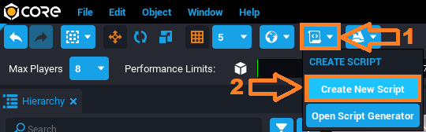
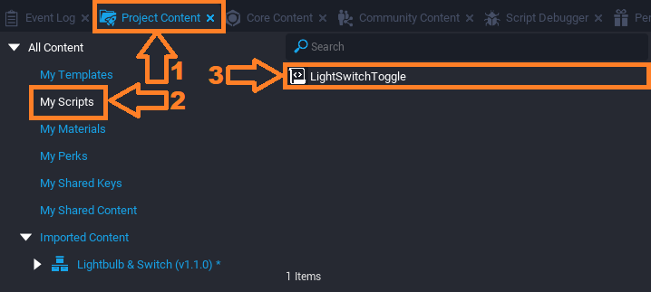
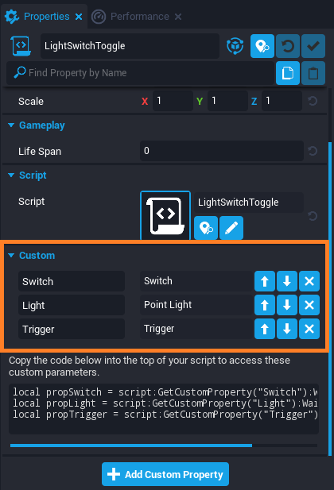

# Lua Scripting Tutorial, Part 2

## Overview

In this tutorial, you will learn how to take an existing template created by another community member in Core and create a script that alters the template to perform an action upon player interaction.

Together, we will create something that brightens every room: a light switch!

When a player presses ++F++ while near the light switch, it will flip and either turn on or off the light. It will simulate an electric current to the bulb.

{: .image-frame .center loading="lazy" }

---

## Setting Up the Template

### Download the Template

1. Open the **Community Content** window in the Core Editor.
2. In the search bar of the window, search `switch` and find **Lightbulb & Switch** by ***CoreAcademy***.
3. Click **Import** to download the template into your project.

{: .image-frame .center loading="lazy" }

### Open the Template

1. In the **Core Content** window, find the **Imported Content** section then find **Light Bulb & Switch** {: style="height:34px" }.
{ .image-inline-text .image-background }
2. Double-click the {: style="height:34px" } icon to open it. You should now see the green {: style="height:34px" } icon.
{ .image-inline-text .image-background }

{: .image-frame .center loading="lazy" }

1. Hold left-click on the **Light Bulb & Switch** package icon and drag it into your project by either dragging it into the **Main Viewport** somewhere in your world or dragging it into your **Hierarchy**.
2. Make sure **Selection Mode** is set to **Group** so we select the entire template when clicking on it in the **Main Viewport**. You can use the ++C++ key to switch between **Group Selection Mode** and **Object Selection Mode**.
3. Change the position of the template and its components where you want it using the transform tools in the top toolbar. To learn more about moving objects, check out the [Intro to the Editor](editor_intro.md) tutorial.

{: .image-frame .center loading="lazy" }

!!! note
    If you click on the wall, or part of the scene, this will select the entire template. Click the group in the **Hierarchy** you want to move, resize, or rotate.

### Deinstance the Lightbulb & Switch Template

To make changes to the template, we first need to **Deinstance** it.

Right click on the **Lightbulb & Switch** template in the **Hierarchy** and click **Deinstance This Object**.

{: .image-frame .center loading="lazy" }

The template and the objects in the template will change from **blue**{: style="color: var(--core-color-templetized)"} to **teal**{: style="color: var(--core-color-deinstanced)"}. This color change means that the template can now be edited.

Deinstancing allows you to make changes to a particular copy of a template without changing the template itself. You can learn more about how this works in our [Template Reference](template_reference.md).

### Create and Add a New Script

1. To get started making this light switch work, we are going to create a new script by clicking the  **Create Script** button in the toolbar at the top of the editor.
{ .image-inline-text .image-background }
2. Name this script whatever you want; we will be using `LightSwitchToggle`.
3. Save the script by pressing ++Ctrl+S++.
4. Open the contents of the **Lightbulb & Switch** template by clicking the drop down arrow to the left of its name in the Hierarchy.
5. Open the **Project Content** window and open the **My Scripts** category. Drag the `LightSwitchToggle` from **Project Content** > **My Scripts** into the **Lightbulb & Switch** template group.

{: .image-frame .center loading="lazy" }
{: .image-frame .center loading="lazy" }

!!! info
    It is important to save your scripts often so you don't lose work in the event of a problem. Use ++Ctrl+Shift+S++ to save all scripts and your entire project.

### Create and Customize a Light

1. Open the **Lighting** category of the **Core Content** window.
2. Find the **Point Light** and drag it into the hierarchy, under **Lightbulb & Switch** > **Lightbulb** > **Bulb**.
3. With the **Point Light** selected in the **Hierarchy**, open the **Properties Window**.
4. Lower the **Intensity** property until the light looks natural in your scene.
5. In the **Lighting** section of **Properties**, check the box next to **Advanced Settings** to see more options to customize the light.
6. Check the box for **Use Temperature**, and lower the **Temperature** property to create a warm glow color to the light.
7. Since we want the light to be off by default, set the **Visibility** property to **Force Off**.

{: .image-frame .center loading="lazy" }

### Find the Trigger

To create in-game interactions in Core, use a **Trigger**. A trigger defines the area and checks if any player enters, leaves, or presses the interact key, ++F++, near it.

The **Lightbulb & Switch** template includes a trigger, but you can add trigger objects to a project from the **Core Content** window, in the **Gameplay Objects** section.

{: .image-frame .center loading="lazy" }

1. In the Hierarchy window, select the "Trigger" object within the template and press ++F++. This will move the Main Viewport view to focus on the trigger.
2. Notice the size, shape, and position of the trigger. The player will have to stand inside the box to be able to activate the trigger.

{: .image-frame .center loading="lazy" }

!!! hint
    If you can't see a the trigger, press ++V++ to make it visible!

### Make the Trigger Interactable

{: .image-frame .center loading="lazy" }

1. Look at the **Properties** window with the trigger selected. Under the **Gameplay** section there is a property called **Interactable**. Make sure the box is checked so players can interact with the trigger.
2. Find the **Interaction Label** property, and change it to something like "Turn On"
3. Press **Play** to start a preview, and walk up to the Light switch. You should see a message pop up in the middle of your screen.

## Setting the Custom Properties

A very powerful feature of creating in Core is custom properties; they allow you to point reference to other objects or other data types, such as strings, numbers, etc.

Thinking ahead before we begin scripting, we need to decide what custom properties we need.

Being this is a lightbulb and switch, we know those are two custom properties we'll need already.

Additionally, in order to be able to allow the player's interaction to cause the switch to flip and the light to turn on, we'll need a reference to the trigger we just customized above.

To add a custom property to the script, click on the script and then drag-and-drop the object we are referencing into the **Custom** section of the **Properties** window.

It should now look like this:
{: .image-frame .center loading="lazy" }

## Scripting References to Custom Properties

### Reference the Switch

We want our light switch to function just like a real one: the switch will point up or down depending on whether the light is turned on or off.

First you will need to tell the script which object in the scene is the switch, so that it knows what to rotate. You will create a variable that defines what the switch is.

To move the switch, we need a way to talk about the specific object from the game space in code.

Type the following into Line 1 of `LightSwitchToggle`:

```lua
local Switch = script:GetCustomProperty("Switch"):WaitForObject()
```

- `local` is a **keyword** that indicates that you are making a variable. We use the term `local` here because it will only be accessible from this script rather than being accessible from external scripts, or globally.
- `Switch` is the variable name. You can name it anything but it's important to create variables with self-explanatory names so our scripts are easy to read and understand.
- `script` refers to the script itself as it exists in the project.
- `GetCustomProperty(string name)` is a function that gets a reference to the object in the custom property that is a part of the script.
- `WaitForObject()` is a function that is a part of an `CoreObjectReference` that returns the actual object as it exists in the **Main Viewport** and **Hierarchy**.

### Reference the Light

Since the switch will be turn on and off a light, we also need to add a reference of it into the script.

Type the following into the next line of `LightSwitchToggle`:

```lua
local Light = script:GetCustomProperty("Light"):WaitForObject()
```

### Reference the Trigger

Finally, we need a reference to the trigger as this interaction is what will flip the switch and toggle the light.

Type the following into the next line of `LightSwitchToggle`:

```lua
local Trigger = script:GetCustomProperty("Trigger"):WaitForObject()
```

The script should now look like:

```lua
local Switch = script:GetCustomProperty("Switch"):WaitForObject()
local Light = script:GetCustomProperty("Light"):WaitForObject()
local Trigger = script:GetCustomProperty("Trigger"):WaitForObject()
```

## Finding the Switch's Rotation

To figure out how to rotate the switch, you will rotate it around in game, and take note of the **Rotation** property displayed in the switch's **Properties** window.

### Select the Switch

Click on the **Switch (networked)** group in the **Hierarchy** to select it. Note that you will need to select the entire group, not just the cube inside of it, because the entire group is what the `Switch` variable we defined earlier refers to.

{: .image-frame .center loading="lazy" }

### Find the Switch's Current Rotation

Turn on **Rotation** mode by clicking the  button, or pressing ++E++
{ .image-inline-text .image-background }

{: .image-frame .center loading="lazy" }

!!! hint
    Learning the editor bindings, such that ++E++ switches to **Rotation** mode can help productivity and speed while using the Core editor.

Look at the **Properties** window. In the **Transform** section. You should see a property called **Rotation** with an **X**, **Y**, and **Z** value.

{: .image-frame .center loading="lazy" }

### Rotate the Switch in the Editor

To figure out where the switch needs to be for on/off state, we will reposition it using the **Rotate** tool and take note of final rotations that we want to change it to.

1. Click the **green** ring on the **Rotate** tool to move the switch up and down, and take note of the change in the **Y** value of the switch's **Rotation** property.
2. Press ++Ctrl+Z++ to return the switch to its original position.

Your rotations may be different, but will most likely look like this:

|  On / Off | X | Y | Z |
| --- | --- | --- | --- |
|  On | 0 | -60 | 0 |
|  Off | 0 | -130 | 0 |

## Scripting the Rotation

### Create Variables for Each Rotation

Now that you know the rotations of the switch for "on" and "off", you can save them as variables. On the next line of your `LightSwitchToggle` add these lines:

```lua
local ROTATION_ON = Rotation.New(0, -60, 0)
local ROTATION_OFF = Rotation.New(0, -130, 0)
```

- `Rotation.New` means we are telling the script to rotate our object to a new set of coordinates.
- `(x, y, z)` are the coordinates (respectively) of where we want our switch to rotate to. We want to rotate our switch up along the y-axis by 90 degrees.

!!! note
    You will almost always use `Rotation.New` when rotating an object, but there is also a predefined Rotation called `Rotation.ZERO` which will rotate the object to `0, 0, 0`.
    [Learn more about Rotations on the Core API](../api/rotation.md) page.

!!! note
    It is convention that constants, variables that will not be altered, are in **SCREAMING_SNAKE_CASE**, meaning all caps with **_** between each word.

### Make the Switch Rotate with a Script

Next you will rotate the switch. On a new line, type:

```lua
local TIME_ROTATE = 2

Switch:RotateTo(ROTATION_ON, TIME_ROTATE)
```

- `Switch` tells the script to rotate the object attached to this variable.
- `RotateTo(rotation, time)` is an function that tells Core we want to rotate an object.
- `TIME_ROTATE` is the time it should take to complete the rotation. Storing this as a variable makes it really easy to edit in the future.

The script should now look like this:

```lua
local Switch = script:GetCustomProperty("Switch"):WaitForObject()
local Light = script:GetCustomProperty("Light"):WaitForObject()
local Trigger = script:GetCustomProperty("Trigger"):WaitForObject()

local ROTATION_ON = Rotation.New(0, -60, 0)
local ROTATION_OFF = Rotation.New(0, -130, 0)
local TIME_ROTATE = 2

Switch:RotateTo(ROTATION_ON, TIME_ROTATE)
```

!!! note
    It is best to avoid **magic numbers** whenever possible. **Magic Numbers** are direct usage of numbers in code, such as if we did `Switch:RotateTo(Rotation.New(0, -60, 0), 0.1)`.

### Test out the Switch

Let's press **Play** and see how our switch moves!

{: .image-frame .center loading="lazy" }

Unfortunately that didn't quite work out the way we wanted...
Depending on where in the scene you placed your light switch, it might look like this image, where the switch rotated sideways instead of up.

### Change the Rotation to Local Space

To get the script to rotate the switch the way we want, only along the y-axis, it needs to know to move **relative to its original position**. Luckily in this case the `RotateTo()` function has an *optional* parameter that we can add to specify that we want the rotation to happen relative to its own space.

{: .image-frame .center loading="lazy" }

Change the last line to look like this:

```lua
Switch:RotateTo(ROTATION_ON, TIME_ROTATE, true)
```

By adding `true` to the end of the parameters for `RotateTo()`, it moves in *local* space. If we were to enter `false` instead, or enter nothing like we did the first time, it will move in *world* space. World space is relative to nothing but the world itself, as if it was at the root of the Hierarchy.

Press **Play** and test it out!

{: .image-frame .center loading="lazy" }

## Letting Players Move the Light Switch

So far, you have made a script that moves the light switch, but this happens automatically and immediately when the game starts. Next, you will make **the players** able to flip the switch to turn on and off our light.

### Create a Function for the Trigger

Now that the script knows which object we are using as a trigger, we need to define what happens when we interact with the trigger.

After your rotation statement, type:

```lua
function OnTriggerInteracted()

end
```

- A `function` is a set of actions that the script carries out every time the function is referenced in the script.
- `OnTriggerInteracted` is the name of the function we are deciding to give it. You can name it anything, but the name chosen will make sense when we get into events later on.
- `end` tells the script the function is over.

This function will define what happens when the player interacts with the trigger.

### Move the Switch Code into the Function

Eventually we want the switch to flip up and down when the player interacts with it, turning the light on and off. For now we'll just place our rotate statement inside it, which is just the switch turning down.

Cut and paste the `RotateTo` statement into our `OnTriggerInteracted` function.

It should now look like this:

```lua
local Switch = script:GetCustomProperty("Switch"):WaitForObject()
local Light = script:GetCustomProperty("Light"):WaitForObject()
local Trigger = script:GetCustomProperty("Trigger"):WaitForObject()

local ROTATION_ON = Rotation.New(0, -60, 0)
local ROTATION_OFF = Rotation.New(0, -130, 0)
local TIME_ROTATE = 2

function OnTriggerInteracted()
    Switch:RotateTo(ROTATION_ON, TIME_ROTATE, true)
end
```

### Connect the Function to an Event

Lastly, you will need an event statement that tells the script to do the `OnTriggerInteracted` function when the player interacts with the trigger. At the end of your script type:

```lua
Trigger.interactedEvent:Connect(OnTriggerInteracted)
```

- `Trigger` is the variable name of this trigger.
- `interactedEvent:Connect(function)` tells the script every time the player interacts with trigger to execute the function passed to the `Connect()` function.
- `OnTriggerInteracted` is the name of the function we are connecting.

Without this statement the script will never call the `OnSwitchInteraction` function.

!!! note
    It is convention to name the callback of an event (the function that is called when the event is fired) to be `On` + **Event Name** in PascalCase. So, for this example, we would use `OnInteracted` but decided to use `OnTriggerInteracted` to provide more clarity.

### Test Out the Script

Your script should now look like this:

```lua
local Switch = script:GetCustomProperty("Switch"):WaitForObject()
local Light = script:GetCustomProperty("Light"):WaitForObject()
local Trigger = script:GetCustomProperty("Trigger"):WaitForObject()

local ROTATION_ON = Rotation.New(0, -60, 0)
local ROTATION_OFF = Rotation.New(0, -130, 0)
local TIME_ROTATE = 2

function OnTriggerInteracted()
    Switch:RotateTo(ROTATION_ON, TIME_ROTATE, true)
end

Trigger.interactedEvent:Connect(OnTriggerInteracted)
```

1. Press **Play** to start a local preview.
2. Walk up to the switch trigger and press ++F++ to interact with it. The switch should move up.

<div class="mt-video">
    <video autoplay loop muted playsinline poster="/img/EditorManual/Abilities/Gem.png" alt="Switch with Interaction Label and Movement">
        <source src="/img/LightBulb/updates/LightSwitchInteraction.mp4" type="video/mp4" />
    </video>
</div>

!!! note
    Make sure that the trigger is **Interactable** if you do not see the option to press ++F++ pop up when you walk near it.

### Speed Up the Movement

Now that the switch is working, you can speed up the rotation to look more like real light switch.

Change the `2` for the `TIME_ROTATE` variable to `0.25`. Now the switch will complete its rotation in 0.25 seconds.

Press **Play** to test out the improved movement speed.

## Best Practices: Organizing Your Code

Organized code is easily read and understood. Using **clear variable and function names**, and adding **comments to explain the purpose** of sections of code will make your code easier to use by you in the future and by anyone else working with your scripts.

Programmers use comments to define and explain certain parts of their code. Add comments to your code to make the purpose of each section clear.

```lua
-- References to the objects we will be interacting with in the script.
local Switch = script:GetCustomProperty("Switch"):WaitForObject()
local Light = script:GetCustomProperty("Light"):WaitForObject()
local Trigger = script:GetCustomProperty("Trigger"):WaitForObject()

-- Constants used when interacting with the scene objects.
local ROTATION_ON = Rotation.New(0, -60, 0)
local ROTATION_OFF = Rotation.New(0, -130, 0)
local TIME_ROTATE = 0.25

-- Function to rotate the switch when the trigger is interacted with
function OnTriggerInteracted()
    Switch:RotateTo(ROTATION_ON, TIME_ROTATE, true)
end

-- Connect the callback function to the trigger interacted event
Trigger.interactedEvent:Connect(OnTriggerInteracted)
```

As your scripts get longer, these practices will make them easier to read and edit.

## Turning the Light On

Your next project goal is to make the switch more functional and have it turn on a light when players interact with it.

In the `OnTriggerInteracted()` function under our `RotateTo()` statement, type:

```lua
Light.visibility = Visibility.INHERIT
```

- `Light` is the object we are trying to alter.
- `visiblity` is the property we are trying to change.
- `Visibility` is an enum that contains states of visibility of an object: `FORCE_ON`, `FORCE_OFF`, or `INHERIT`.
- `INHERIT` is the visibility enum we chose.

The OnTriggerInteracted function should look like:

```lua
function OnTriggerInteracted()
    Switch:RotateTo(ROTATION_ON, TIME_ROTATE, true)
    Light.visibility = Visibility.INHERIT
end
```

This will set the visibility of the light to be `INHERIT`. This means that if the bulb is visible, the light will also be visible. However, if the bulb is **not** visible, then the light will stay off.

## Turning the Switch Off

### Create a Boolean Variable

To turn the switch off again, you will create a variable that keeps track of whether the switch is **on** or **off**.

Add this new variable to the top of your script, under the constants:

```lua
local isSwitchOn = false
```

- `isSwitchOn` is the name of the variable we'll use to keep track of the switch being on and off.
- `false` is a type of data called a **Boolean**. The starting state for the switch is false, because the light starts out off.

### Switch the Variable between True and False

Next, we need to tell the script to switch `isSwitchOn` from `false` to `true`, when we turn on the light.

At the top of the `OnTriggerInteracted()` function, type:

```lua
isSwitchOn = not isSwitchOn
```

Instead of just setting `isSwitchOn` to `true`, this tells the script to change `isSwitchOn` to the opposite of what it is already set to.

If `isSwitchOn` is `false`, it sets it to `true`, and vice versa. In other words, the value is **toggled** to the opposite state.

### Test the Variable Toggle

Test to see if the script correctly toggles between `isSwitchOn = false` and `isSwitchOn = true` when the player interacts with the switch.

In the `OnTriggerInteracted` function, after the `isSwitchOn = not isSwitchOn` statement, type:

```lua
print(isSwitchOn)
```

- `print` tells the script to print to the Event Log window.
- `isSwitchOn` is the variable that will be printing.

1. Open up the **Event Log** window from the **Window** menu in the top bar.
2. Keep this open and press **Play**.
3. Press ++F++ to interact with the switch.

The OnTriggerInteracted function should look like:

```lua
local function OnTriggerInteracted()
    isSwitchOn = not isSwitchOn
    print(isSwitchOn)

    Switch:RotateTo(ROTATION_ON, TIME_ROTATE, true)
    Light.visibility = Visibility.INHERIT
end
```

The **Event Log** should print `true` or `false` every time you interact with the light switch. You can delete the `print` statement now.

### Create an If Statement

Now the script needs to know what to do specifically when the switch is on, and when it is not. An `if` statement will let you write code based on the state of other variables.

In the `OnTriggerInteracted` function, after the `lightIsOn = not lightIsOn` statement, type:

```lua
    if isSwitchOn then

    end
```

- `if` statements are handy when you need a certain series of actions to happen when a certain set of conditions is true.
- `isSwitchOn` is the condition that must be met in order to execute the script inside our if statement.
- `then` signifies the start of the code that will be performed if the conditions of the `if` statement are met.
- `end` tells the script the `if` statement is over.

Place the `Switch:RotateTo()` statement and the `Light.visibility` statement inside the `if` statement.

Your `OnTriggerInteracted()` function should now look like this:

```lua
function OnTriggerInteracted()
    isSwitchOn = not isSwitchOn

    if isSwitchOn then
        Switch:RotateTo(ROTATION_ON, TIME_ROTATE, true)
        Light.visibility = Visibility.INHERIT
    end
end
```

### Test the If-Statement

Press **Play** and make sure everything still works.

A light should have turned on the first time you interacted with the switch and then nothing happens in the future. Progress!

### Turn the Switch Back Off

The next step is to tell the script to turn the switch downwards when the light is off. The `else` keyword will allow you code what should happen if `isSwitchOn` is not `true`.

Fortunately, you have already saved a variable for the rotation of the switch, `ROTATION_OFF`. Add this line after right before the `end` line in the **if statement** of the `OnTriggerInteracted` function:

```lua
    else
        Switch:RotateTo(ROTATION_OFF, TIME_ROTATE, true)
```

- `else` is used with `if` to tell the script if the if conditions are not true, do the following instead.

Your `OnTriggerInteracted()` function should now look like this:

```lua
function OnSwitchInteraction()
    isSwitchOn = not isSwitchOn

    if isSwitchOn then
        Switch:RotateTo(ROTATION_ON, TIME_ROTATE, true)
        Light.visibility = Visibility.INHERIT
    else
        Switch:RotateTo(ROTATION_OFF, TIME_ROTATE, true)
    end
end
```

Press **Play** to see if your `else` statement works. The switch should now rotate up when first interacted with, then down on your second interaction with it. However, we still need to turn off the light when the light switch is turned off.

## Turning the Light Off

Your next project goal is to make the switch more functional and have it turn on a light when players interact with it.

In the `OnTriggerInteracted()` in the else statement under the `RotateTo()` function, add:

```lua
Light.visibility = Visibility.FORCE_OFF
```

- `FORCE_FF` disables visibility.

The OnTriggerInteracted function should look like:

```lua
function OnSwitchInteraction()
    isSwitchOn = not isSwitchOn

    if isSwitchOn then
        Switch:RotateTo(ROTATION_ON, TIME_ROTATE, true)
        Light.visibility = Visibility.INHERIT
    else
        Switch:RotateTo(ROTATION_OFF, TIME_ROTATE, true)
        Light.visibility = Visibility.FORCE_OFF
    end
end
```

---

## Learn More

[Scripting in Core](scripting_intro.md) | [Core API](../api/index.md) | [Intro to Lua Course](https://learn.coregames.com/courses/intro-to-lua/)
