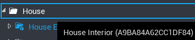

# Modeling Complex Objects in Core

    <video autoplay loop muted playsinline poster="/img/EditorManual/Abilities/Gem.png">
        <source src="/img/EditorManual/Art/BugShip.webm" type="video/webm" />
        <source src="/img/EditorManual/Art/BugShip.mp4" type="video/mp4" />
    </video>

## Introduction

Assets in Core are downloaded with the installation of the Core Launcher and Editor, and all unique 3D objects made for games are created out of this content. This allows for extremely fast loading of any Core project, for both players and creators. See the [Modeling Basics tutorial](modeling_basics.md) for a hands-on introduction.

### Community Content

The **Community Content** window in the Core Editor includes examples of the what users have created using Core Content as the fundamental components. All of the templates in Community Content can be imported to use and edit in any project. To learn more about using user-generated content, see the [Community Content guide](community_content.md).

### Manipulating Objects

Creating new 3D models in Core can be done by positioning, scaling, and rotating existing props and basic shapes. To learn more about adding Core Content to a project and manipulating objects, see the [Introduction to the Editor](editor_intro.md).

### Customizing Materials

Materials can be added by dragging and dropping them onto an object, and customized through the **Properties** window. To learn more about materials and customization, see the [Custom Materials reference](custom_materials.md).

## Combining Objects into New Models

There are different ways to combine objects into units that can be manipulated together, and doing so allows you to handle the different pieces together in a convenient way.

### Renaming

Renaming custom objects and parts of complex objects makes future editing quicker, as well as making it possible to search for parts easily in the Hierarchy. Select an object and press ++F2++ to rename it.

### Folders

Folders can be used to organize projects according to your individual preferences. They are the best option for putting objects with similar purposes or in similar areas together without having to treat them like a single object.

{.center loading="lazy" }

#### Creating a Folder

1. Select the **Hierarchy** window.
2. Press ++ctrl+N++ or right click and select **New Folder**.
3. Type a name for the folder and press ++enter++.

#### Adding Objects to a Folder

To add an object to a folder, drag it onto the folder name until it is highlighted with a blue box around it. Toggling the arrow on the left side of the folder name will open it to display the contents, or close it to hide them.

{.center loading="lazy" }

#### Creating a Folder with Existing Objects

1. Select the objects to be added to the folder in the **Hierarchy** window using ++ctrl++ + left click.
2. Press ++ctrl+N++ or right click and select **New Folder Containing These**.
3. Type a name for the folder and press ++enter++.

!!! note
    Use ++shift++ + left click to select all of the objects between the last selected and the one you select next.

### Groups

Creating a group allows you to unite a collection of 3D objects into a single entity, that you can copy and manipulate in one piece. With **Group Selection Mode** enabled, you will always select the whole group when you click on any object that is part of it.

#### Creating a Group from Existing Objects

1. Select the objects to be added to the group in the **Hierarchy** window using ++ctrl++ + left click.
2. Right click one of the selected objects and click **New Group Containing These** or use ++ctrl+G++.
3. Type a name for the group and press ++enter++.

!!! note
    The center of the group will be the combined center of all the objects being grouped. If **Snap to Grid** is enabled, the center point will be adjusted according to the chosen snap size.

#### Switching between Group and Object Selection Mode

1. Find the  or  icons in the **Toolbar** at the top of the Editor.
{: .image-inline-text .image-background}
2. Click the drop down arrow next to the mode.
3. Select **Object Mode** to select individual objects within the group when clicked.
4. Select **Group Mode** to select the entire group when any object within the group is clicked.

### Parenting

Folders and groups can be added to other folders and groups. This allows for cleaner project organization, and will make a **child** object that is inside of another object (its **parent**) define its position relative to the parent object.

### Templates

Templates can be used to save grouped objects, collections of created objects, scripts, and scripted objects. They also allow you to share your creations on Community Content. See the [Template tutorial](template_reference.md) to learn more.

### Merged Models

Merged models are a way of grouping objects together to reduce the rendering calculations together. This works best with large chunks of scenery like a building. See the [Merged Model reference](merged_models.md) to learn more.

## Learn More

[Community Content](community_content.md) | [Template Tutorial](template_reference.md) | [Modeling Tutorial](modeling_basics.md) | [Introduction to the Editor](editor_intro.md) | [Custom Materials](custom_materials.md)
