# Make an Obby in Core

## Overview

In this tutorial you are going to make an **Obby**, which is a platform and obstacle game. The game will have moving, rotating, and shrinking platforms as well as deadly spinning blades.

* **Completion Time:** ~2 hours
* **Knowledge Level:** It's recommended to have completed the [Scripting Beginner](lua_basics_helloworld.md) and [Scripting Intermediate](lua_basics_lightbulb.md) tutorials.
* **Skills you will learn:**
    * Using CoreObject API to move, rotate, and scale objects.
    * When to use Client, Networked, Static, and Server contexts.
    * Triggers.
    * Spawning a template.
    * Client to server communication.

---

## Creating a Project and Starting Platform

Create a new empty project. In the **Hierarchy** window, select the **Default Floor** and rename it to `Starting Platform` using the ++F2++ button. Then in the scene, switch to **Scale Mode** using the ++R++ button and scale it to a smaller size.

{: .center loading="lazy" }

## Creating a Moving Platform

The Moving Platforms will move back and forth between two positions. They pause for some time when they reach a position before heading back to the other position.

### Create a New Platform

Select the **Starting Platform** in the Hierarchy and duplicate it using the ++Ctrl+W++ shortcut. Rename the duplicated platform to `Platform`. In the scene, enter **Translation Mode** using the ++W++ button and move it away from the Starting Platform.

!!! info "This new platform is the next destination the player wants to reach from the Starting Platform."

{: .center loading="lazy" }

### Create a Moving Platform

Open the Core Content window and search for `cube` to find a **Cube** object and place it into the scene. In the Hierarchy, rename the cube to `Moving Platform`. In the scene, position and resize the cube to be in the desired starting state.

{: .center loading="lazy" }

### Network the Moving Platform

Currently, the **Moving Platform** is in a [Default Context](../references/networking.md). This context is useful for objects such as the **Starting Platform** because players need to collide with the object and the object will never change its position, rotation, or size. The Moving Platform will be changing its position so it needs to be in the **Default Context (Networked) Context**. In the Hierarchy, right click the **Moving Platform** and select the **Enable Networking**.

!!! warning "**Networked Objects** are the most expensive type of objects because the server has to constantly track and share information about them."

{: .center loading="lazy" }

### Create the MovingPlatform Script

#### Add a New Script

Create a new script by pressing the **Script** button {: .image-inline-text .image-background } above the scene. Name it `MovingPlatform`. In the **Project Content** window, find the **MovingPlatform** script in the **My Scripts** section and drag it into the **Hierarchy**.

{: .center loading="lazy" }

#### Add Custom Properties

In the Hierarchy, select the **MovingPlatform** script and then open the **Properties** window. The script will need some **custom properties** to know how to move the platform.

1. From the Hierarchy, drag and drop the **Moving Platform (networked)** object into the Custom Property section.
2. Add a new **Vector3** custom property and name it `TargetPosition`.
3. Add a new **Float** custom property and name it `TravelTime`.
4. Add a new **Float** custom property and name it `WaitTime`.

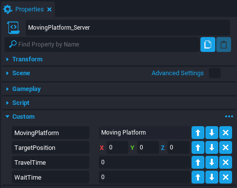{: .center loading="lazy" }

#### Set the Custom Properties

Set the **TravelTime** property to `2`. Set the **WaitTime** property to `1`. The TargetPosition property can be copied easily using the Moving Platform (networked) object.

1. In the scene, move the **Moving Platform (networked)** object to the desired target position.
2. In the **Properties** window, right click the **Position** property and select **Copy [Position]**.
3. In the Hierarchy, select the **MovingPlatform** script and open the Properties window.
4. Right click the **TargetPosition** custom property and select **Paste Last Copied**.
5. Move the **Moving Platform (networked)** object back to its starting position.

<div class="mt-video" style="width:100%">
    <video autoplay muted playsinline controls loop class="center" style="width:100%">
        <source src="/img/Obby/Obby_CopyingProperty.mp4" type="video/mp4" />
    </video>
</div>

#### Add Code to the Script

In the Hierarchy, right click the **MovingPlatform** script and select **Edit Script** to open the Script Editor window.

##### Access Custom Properties

```lua
local MOVING_PLATFORM = script:GetCustomProperty("MovingPlatform"):WaitForObject()
local TARGET_POSITION = script:GetCustomProperty("TargetPosition")
local TRAVEL_TIME = script:GetCustomProperty("TravelTime")
local WAIT_TIME = script:GetCustomProperty("WaitTime")
```

There needs to be variables that have a reference to the custom properties inside the script.

!!! info "This code is automatically generated at the bottom of the Properties window for creators to easily copy and paste into their scripts."

##### Access Starting Position

```lua
local STARTING_POSITION = MOVING_PLATFORM:GetWorldPosition()
```

The **Moving Platform** is a [CoreObject](../api/coreobject.md) so it contains a function `GetWorldPosition` to access the current position of the object.

##### Loop the Movement

```lua
while true do
	Task.Wait(WAIT_TIME)
	MOVING_PLATFORM:MoveTo(TARGET_POSITION, TRAVEL_TIME, false)
	Task.Wait(TRAVEL_TIME + WAIT_TIME)
	MOVING_PLATFORM:MoveTo(STARTING_POSITION, TRAVEL_TIME, false)
	Task.Wait(TRAVEL_TIME)
end
```

The use of a `while true` loop will keep the code inside of it running indefinitely. This means the platform will forever move between the two locations. The `MoveTo` function requires three arguments to be passed in: The target position, the travel time, and whether the location is in local space.

??? "The MovingPlatform Script"
    ```lua
    local MOVING_PLATFORM = script:GetCustomProperty("MovingPlatform"):WaitForObject()
    local TARGET_POSITION = script:GetCustomProperty("TargetPosition")
    local TRAVEL_TIME = script:GetCustomProperty("TravelTime")
    local WAIT_TIME = script:GetCustomProperty("WaitTime")

    local STARTING_POSITION = MOVING_PLATFORM:GetWorldPosition()

    while true do
        Task.Wait(WAIT_TIME)
        MOVING_PLATFORM:MoveTo(TARGET_POSITION, TRAVEL_TIME, false)
        Task.Wait(TRAVEL_TIME + WAIT_TIME)
        MOVING_PLATFORM:MoveTo(STARTING_POSITION, TRAVEL_TIME, false)
        Task.Wait(TRAVEL_TIME)
    end
    ```

### Test the Moving Platform

Save the script and preview the project. The platform should be moving back and forth for the player to traverse platforms.

<div class="mt-video" style="width:100%">
    <video autoplay muted playsinline controls loop class="center" style="width:100%">
        <source src="/img/Obby/Obby_MovingPlatform.mp4" type="video/mp4" />
    </video>
</div>

### Organize the Moving Platform

In the Hierarchy, multi-select the **MovingPlatform** script and **Moving Platform (networked)** object by holding down ++Ctrl++ button while left clicking the mouse. Right click and select the **New Group Containing These** option. Name the group `Moving Platform`.

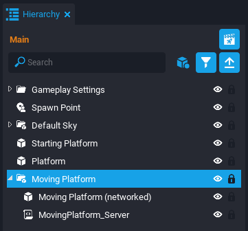{: .center loading="lazy" }

### Add Material to Platform

Select the **Moving Platform (networked)** object and open the Properties window. Set the **Material** property to `Wood 9 Slice Crate 01`.

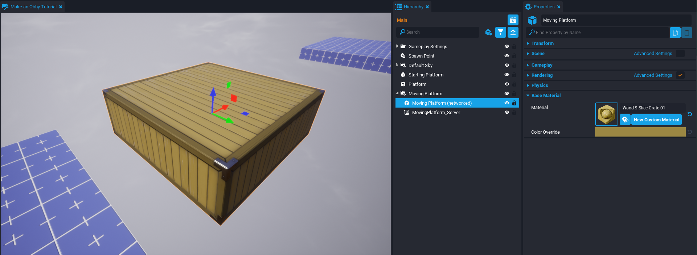{: .center loading="lazy" }

## Creating a Rotating Platform

The **Rotating Platform** will spin in a certain direction continuously.

### Create a New Platform

In the Hierarchy, select the **Platform** object and duplicate it. Extend the level by moving the duplicate platform away from the other platform.

{: .center loading="lazy" }

### Create a Rotating Platform

In the **Core Content** window, find the **Cube** object and add it to the scene. Rename the cube to `Rotating Platform`. Then scale and position the cube to a good starting state.

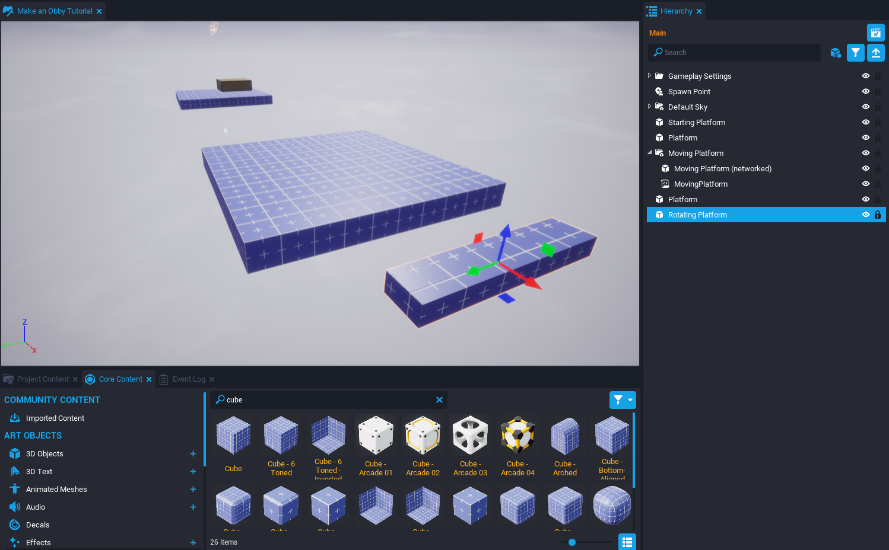{: .center loading="lazy" }

### Network the Rotating Platform

The **Rotating Platform** needs collision and will also be rotating so it needs to be networked to update for all players properly. Right click the **Rotating Platform** and select **Enable Networking**.

{: .center loading="lazy" }

### Create the RotatingPlatform Script

#### Add a New Script

Create a new script and name it `RotatingPlatform`. From the Project Content window, drag the **RotatingPlatform** script into the Hierarchy.

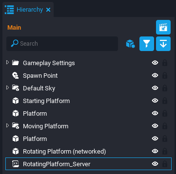{: .center loading="lazy" }

#### Add Custom Properties

In the Hierarchy, select the **RotatingPlatform** script and open the Properties window. The script will need two custom properties at the bottom.

1. Add the **Rotating Platform (networked)** object as a custom property.
2. Add a **Vector3** custom property and name it `RotationSpeed`.

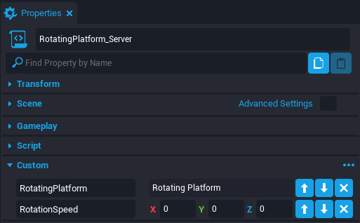{: .center loading="lazy" }

#### Set the RotationSpeed Property

!!! info "Rotation Axis"
    There are three axis that an object can rotate around (X, Y, and Z). When using Rotation Mode in the editor (enabled with the ++E++ button), there are three colored orbits around the object representing the axis. Dragging these colored orbits will also change the same colored Rotation values in the Properties window. This is helpful to understand which axis needs to change for a certain rotation direction.
    <div class="mt-video" style="width:100%">
        <video autoplay muted playsinline controls loop class="center" style="width:100%">
            <source src="/img/Obby/Obby_RotationAxis.mp4" type="video/mp4" />
        </video>
    </div>

Set the **RotationSpeed** property to **X** `0`, **Y** `0`, **Z** `1`. This will only spin it on the Z axis at a speed of 1 degree per tick.

#### Add Code to the Script

Open the **Script Editor** for the **RotatingPlatform** script.

##### Access Custom Properties

Add code to access the custom properties for the platform and speed.

```lua
local ROTATING_PLATFORM = script:GetCustomProperty("RotatingPlatform"):WaitForObject()
local ROTATION_SPEED = script:GetCustomProperty("RotationSpeed")
```

##### Rotate Continuously

[CoreObject](../api/coreobject.md) has a function named `RotateContinuous` that allows two arguments to be passed: a Vector3 for the angular speed and a boolean for whether it is rotating in local space. Add this code to the bottom of the script.

```lua
ROTATING_PLATFORM:RotateContinuous(ROTATION_SPEED, false)
```

??? "The RotatingPlatform Script"
    ```lua
    local ROTATING_PLATFORM = script:GetCustomProperty("RotatingPlatform"):WaitForObject()
    local ROTATION_SPEED = script:GetCustomProperty("RotationSpeed")

    ROTATING_PLATFORM:RotateContinuous(ROTATION_SPEED, false)
    ```

#### Test the Rotating Platform

Save the script and preview the project. The platform should be rotating and the player should rotate if on top of it.

!!! tip "Use the ++Shift+=++ shortcut to spawn the player in Preview Mode where the creator camera currently is in the scene."

<div class="mt-video" style="width:100%">
    <video autoplay muted playsinline controls loop class="center" style="width:100%">
        <source src="/img/Obby/Obby_RotatingPlatform.mp4" type="video/mp4" />
    </video>
</div>

### Organize the Rotating Platform

In the Hierarchy, multi-select the **RotatingPlatform** script and **Rotating Platform (networked)** object by holding down ++Ctrl++ button while left clicking the mouse. Right click and select the **New Group Containing These** option. Name the group `Rotating Platform`.

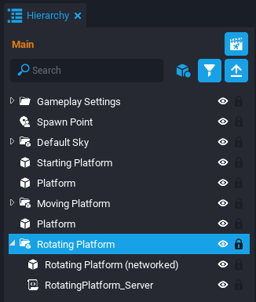{: .center loading="lazy" }

### Add Material to Platform

Select the **Rotating Platform (networked)** object and open the Properties window. Set the **Material** property to `Wood 9 Slice Crate 01`.

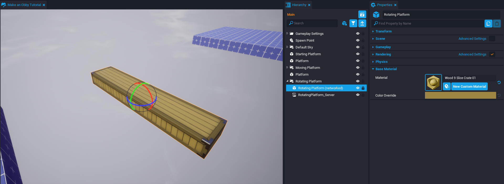{: .center loading="lazy" }

## Creating a Shrink Platform

The **Shrink Platform** will detect if a player stepped on the platform and begin shrinking until it disappears. After some time, it will grow back to normal and wait again for a player to step on it.

### Add a New Cube

In the **Core Content** window, find the **Cube** object and add it to the scene. Rename the cube to `Shrink Platform`. Then scale and position the cube to a good starting state.

{: .center loading="lazy" }

### Network the Shrink Platform

The **Shrink Platform** needs collision and will also be changing in size so it needs to be networked to update for all players properly. Right click the **Shrink Platform** and select **Enable Networking**.

{: .center loading="lazy" }

### Add a Trigger

Press the ++9++ button to create a new **Trigger**. Position the trigger to be on top of the **Shrink Platform**.

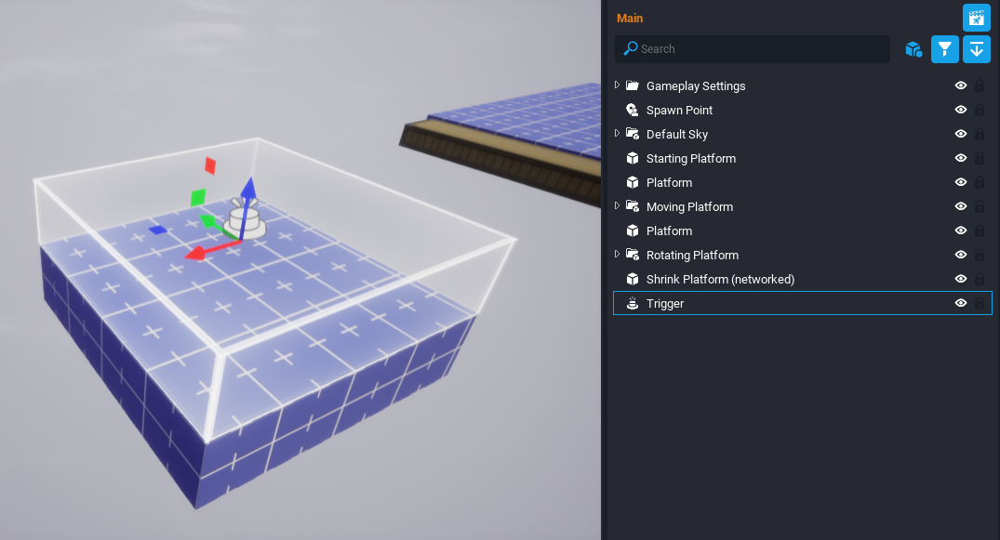{: .center loading="lazy" }

!!! tip "Copying Properties"
    A useful tip to get the **Trigger** in the correct position and size is to copy it from the **Shrink Platform**. There is a **Copy Properties** {: .image-inline-text .image-background } button at the top right of the Properties window that will copy all the properties from an object. Then there is a **Paste Properties** {: .image-inline-text .image-background } button that let's the creator choose which properties to paste that were copied.
    <div class="mt-video" style="width:100%">
        <video autoplay muted playsinline controls loop class="center" style="width:100%">
            <source src="/img/Obby/Obby_CopyingProperties.mp4" type="video/mp4" />
        </video>
    </div>

### Create the ShrinkPlatform Script

Create a new script named `ShrinkPlatform` and add it to the **Hierarchy**.

#### Add Custom Properties

With the **ShrinkPlatform** script selected, open the **Properties** window. Add the following custom properties.

1. Drag and drop the **Shrink Platform (networked)** object as a custom property.
2. Drag and drop the **Trigger** object as a custom property.
3. Add a new **Float** custom property named `ShrinkTime` and set it to `2`.
4. Add a new **Float** custom property named `WaitTime` and set it to `1`.

{: .center loading="lazy" }

#### Add Code to the Script

Open the **Script Editor** for the **ShrinkPlatform** script.

##### Access Custom Properties

Add this code to the script to access the custom properties.

```lua
local SHRINK_PLATFORM = script:GetCustomProperty("ShrinkPlatform"):WaitForObject()
local TRIGGER = script:GetCustomProperty("Trigger"):WaitForObject()
local SHRINK_TIME = script:GetCustomProperty("ShrinkTime")
local WAIT_TIME = script:GetCustomProperty("WaitTime")
```

##### Add More Variables

The platform will need to remember its starting size when it starts growing back. It also needs to know if it's in the shrinking phase to avoid activating the trigger more than once.

```lua
local STARTING_SIZE = SHRINK_PLATFORM:GetWorldScale()
local shrinking = false
```

##### Shrink Function

There is a **CoreObject** function named `ScaleTo` that will scale an object to a certain size and for a certain amount of time. Using `Vector3.ZERO` as a target size will make the object disappear once it becomes small enough. Add this function at the bottom of the script.

```lua
local function Shrink()
	shrinking = true
	SHRINK_PLATFORM:ScaleTo(Vector3.ZERO, SHRINK_TIME, false)
	Task.Wait(SHRINK_TIME + WAIT_TIME)
	SHRINK_PLATFORM:ScaleTo(STARTING_SIZE, SHRINK_TIME, false)
	Task.Wait(SHRINK_TIME)
	shrinking = false
end
```

##### OnBeginOverlap Function

When the Trigger detects a player has overlapped with it, then it will call the `Shrink` function as long as it is not shrinking already. Add this function at the bottom of the script.

```lua
function OnBeginOverlap(whichTrigger, other)
	if other:IsA("Player") and not shrinking then
		Shrink()
	end
end
```

##### Connect the Function to the Event

The `OnBeginOverlap` function needs to fire when the actual event of the **Trigger** object being overlapped occurs in game. Add this code to connect the function with the event.

```lua
TRIGGER.beginOverlapEvent:Connect(OnBeginOverlap)
```

??? "The ShrinkPlatform Script"
    ```lua
    local SHRINK_PLATFORM = script:GetCustomProperty("ShrinkPlatform"):WaitForObject()
    local TRIGGER = script:GetCustomProperty("Trigger"):WaitForObject()
    local SHRINK_TIME = script:GetCustomProperty("ShrinkTime")
    local WAIT_TIME = script:GetCustomProperty("WaitTime")

    local STARTING_SIZE = SHRINK_PLATFORM:GetWorldScale()
    --Used to disable trigger while the platform is shrinking
    local shrinking = false

    local function Shrink()
        shrinking = true
        --Vector3.ZERO will make the platform disappear after its done shrinking
        SHRINK_PLATFORM:ScaleTo(Vector3.ZERO, SHRINK_TIME, false)
        Task.Wait(SHRINK_TIME + WAIT_TIME)
        SHRINK_PLATFORM:ScaleTo(STARTING_SIZE, SHRINK_TIME, false)
        Task.Wait(SHRINK_TIME)
        shrinking = false
    end


    function OnBeginOverlap(whichTrigger, other)
        if other:IsA("Player") and not shrinking then
            Shrink()
        end
    end

    TRIGGER.beginOverlapEvent:Connect(OnBeginOverlap)
    ```

#### Test the Shrink Platform

Save the script and preview the project. The platform should shrink once the player lands on the platform and then reset to its normal size after some time.

<div class="mt-video" style="width:100%">
    <video autoplay muted playsinline controls loop class="center" style="width:100%">
        <source src="/img/Obby/Obby_ShrinkPlatform.mp4" type="video/mp4" />
    </video>
</div>

### Organize the Shrink Platform

In the Hierarchy, multi-select the **ShrinkPlatform** script, **Trigger**, and **Shrink Platform (networked)** object by holding down ++Ctrl++ button while left clicking the mouse. Right click and select the **New Group Containing These** option. Name the group `Shrink Platform`.

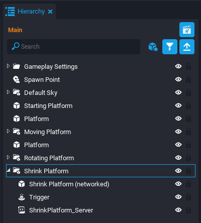{: .center loading="lazy" }

### Add Material to Platform

Select the **Shrink Platform (networked)** object and open the Properties window. Set the **Material** property to `Concrete Basic 01`.

{: .center loading="lazy" }

## Adding a Kill Zone and Spawn Settings

### Organize the Hierarchy

Before adding more, the Hierarchy needs to be cleaned up from all these new platforms. In the Hierarchy, multi-select (by holding ++Ctrl++) the **Starting Platform**, **Platform** objects, **Moving Platform** group, **Rotating Platform** group, and **Shrink Platform** group. Right click and select **New Group Containing These**. Name the group `Platforms`.

{: .center loading="lazy" }

### Add a Kill Zone

A **Kill Zone** is a trigger that will kill a player when they overlap it. This is useful for killing any player that falls below the map.

1. In the **Core Content** window, search for `Kill Zone` and drag it into the scene.
2. In the Hierarchy, select the **KillTrigger** inside the **Kill Zone** group.
3. Increase the size of the trigger to be much larger than the map and move it to be below all of the platforms.

{: .center loading="lazy" }

### Test the Kill Zone

Preview the project. When the player jumps off a platform, it will die once it hits the Kill Zone.

<div class="mt-video" style="width:100%">
    <video autoplay muted playsinline controls loop class="center" style="width:100%">
        <source src="/img/Obby/Obby_KillZone.mp4" type="video/mp4" />
    </video>
</div>

### Add Spawn Settings

The player needs settings to spawn at the start once it dies. Search **Core Content** for `Spawn Settings` and drag it into the **Gameplay Settings** folder in the Hierarchy. For faster testing, open the **Properties** window for the Spawn Settings and set the **Respawn Delay** property to `1`.

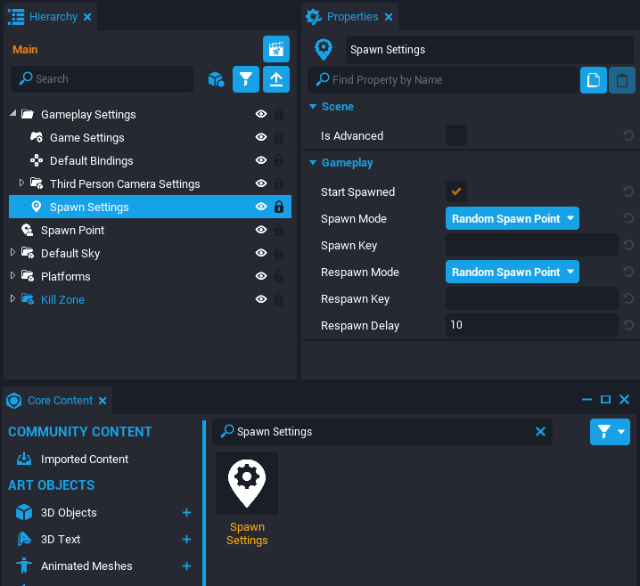{: .center loading="lazy" }

### Test the Spawn Settings

Preview the project. The player should spawn at the start after 1 second of it dying.

<div class="mt-video" style="width:100%">
    <video autoplay muted playsinline controls loop class="center" style="width:100%">
        <source src="/img/Obby/Obby_SpawnSettings.mp4" type="video/mp4" />
    </video>
</div>

## Creating a Deadly Spinning Blade

The Deadly Spinning Blade is an obstacle that has four fast spinning blades circling around a cylinder platform. The player will instantly die if it gets in range of the blades.

### Add a Cylinder Platform

The player will be able to jump on the cylinder platform to avoid being hit by the blades. Search **Core Content** for the `Cylinder` and drop it into the scene on the Starting Platform. Resize and move the **Cylinder** so it is in a good jumpable position.

{: .center loading="lazy" }

### Add a Blade Center

The blade will need a center point to rotate around. The cylinder is not rotating so a group object at the cylinder's position can be the blade's center point.

1. Right click the **Hierarchy** and select **Add New Group** and name it `Blade Center`.
2. Select the **Cylinder** and open the Properties window.
3. Right click the Position property and select **Copy [Position]**.
4. Select the **Blade Center** group and open the Properties window.
5. Right click the Position property and select **Paste [Position]**.

{: .center loading="lazy" }

### Add a Blade

In the **Core Content** window, search for `Horn /staticmesh` and drag the **Horn** into the **Blade Center** group. The bottom of the horn should be in the center of the cylinder so it only needs to be rotated sideways to be in position. Open the properties of the **Horn** and set the **Rotation** property to **X** `90`, **Y** `-90`, **Z** `0`.

{: .center loading="lazy" }

### Set the Material

Before adding more blades, it would save time to choose a material for the blade now. Select the **Horn** and open the **Properties** window. Set the **Material** property to `Metal Basic Steel`. Select the **Cylinder** and set the **Material** property to `Concrete Basic 01`.

{: .center loading="lazy" }

### Add a Trigger

Add a **Trigger** object inside the **Blade Center** group by using the ++9++ button. Position and resize the trigger to roughly match the **Horn** mesh.

{: .center loading="lazy" }

### Add More Blades

Currently the blade can be spun by changing the **Z Rotation** property of the **Blade Center** group. This can also be used to add three more blades around the cylinder.

1. Right click the **Blade Center** group and select **Duplicate**.
2. Select the duplicate **Blade Center** group and open the **Properties** window.
3. Increase the **Rotation Z** property value by `90`.
4. Repeat this until there are four blades around the cylinder.

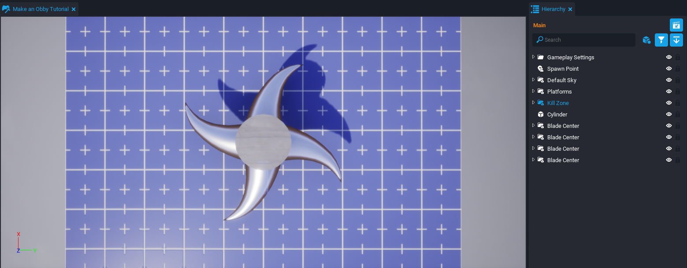{: .center loading="lazy" }

### Group the Blades

Select all the **Blade Center** groups in the Hierarchy. Right click and select the option **New Group Containing These**. Name it `Blades`.

{: .center loading="lazy" }

### Add Static Context

[Static Context](../api/contexts.md) is an interesting networking option because it creates a copy for the client and server. It is useful to reduce the amount of networked objects because it can group a collection of objects as one unit, such as our **Deadly Spinning Blades**. Right click the **Blades** group and select **Create Network Context** followed by selecting **New Static Context Containing This**.

{: .center loading="lazy" }

### Network the Static Context

Now that the Blades are grouped into one unit, it will need to be networked so the code can make it rotate. Right click the **StaticContext** and select **Enable Networking**.

{: .center loading="lazy" }

!!! info "The powerful advantage of Static Context is that only one object is networked instead of all the children objects."

### Create Blades_Static Script

#### Add a New Script

There needs to be a script that can fire a broadcast when a player collides with the triggers inside the **Static Context**. Since they are inside the Static Context, there is a **Server Context** trigger and **Client Context** trigger. A Static Context script can run code for both of these triggers.

1. Create a new script and name it `Blades_Static`.
2. Drag and drop the **Blades_Static** script into the **StaticContext**.

{: .center loading="lazy" }

#### Add Custom Property

Select the **Blades_Static** script and open the Properties window. Drag and drop the **StaticContext** into the **Custom Property** section.

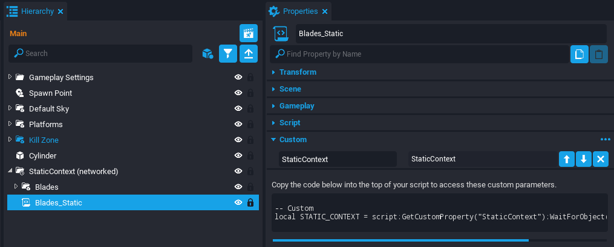{: .center loading="lazy" }

#### Add Code to the Script

Right click the **Blades_Static** script and select **Edit Script**.

##### Reference Custom Property

Add this code to reference the StaticContext custom property.

```lua
local STATIC_CONTEXT = script:GetCustomProperty("StaticContext"):WaitForObject()
```

##### OnBeginOverlap Function

Create the `OnBeginOverlap` function that will fire a broadcast when a player overlaps a trigger. The `other` parameter is being passed in the broadcast because another script will need to know which player to kill.

```lua
function OnBeginOverlap(whichTrigger, other)
	if other:IsA("Player") then
		Events.Broadcast("BladeOverlap", other)
	end
end
```

!!! info "This `Broadcast` will be fired in the same context of the trigger, so either Server or Client."

##### Connect All Triggers

CoreObject's have a useful function named `FindDescendantsByType` that returns a table with all the children objects of a certain type. Add a for loop that connects all children triggers' overlap event to the `OnBeginOverlap` function.

```lua
local triggers = STATIC_CONTEXT:FindDescendantsByType("Trigger")

for _, trigger in pairs(triggers) do
    trigger.beginOverlapEvent:Connect(OnBeginOverlap)
end
```

??? "The Blades_Static Script"
    ```lua
    local STATIC_CONTEXT = script:GetCustomProperty("StaticContext"):WaitForObject()

    function OnBeginOverlap(whichTrigger, other)
        if other:IsA("Player") then
            Events.Broadcast("BladeOverlap", other)
        end
    end

    local triggers = STATIC_CONTEXT:FindDescendantsByType("Trigger")

    for _, trigger in pairs(triggers) do
        trigger.beginOverlapEvent:Connect(OnBeginOverlap)
    end
    ```

### Create Blades_Server Script

#### Add a New Script

Now a message is being broadcasted to the server and client when a player overlaps the blade's trigger. There needs to another script that can receive the message and kill the correct player. The player can only be killed server side so this new script should be in **Server Context**.

1. Right click the Hierarchy and select **Create Network Context** followed by **Add Server Context**.
2. Create a new script and name it `Blades_Server`.
3. Drag and drop the **Blades_Server** script into the **ServerContext**.

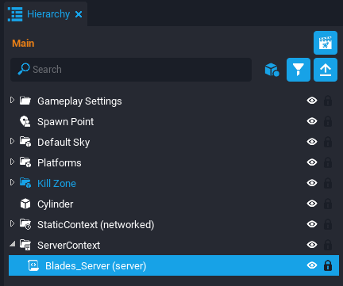{: .center loading="lazy" }

#### Add Custom Properties

Select the **Blades_Server** script and open the **Properties** window. Drag and drop the **StaticContext** into the **Custom Property** section. Then add a new **Vector3** custom property and name it `RotationSpeed`. Set the values of the **RotationSpeed** property to **X** `0`, **Y** `0`, **Z** `10`.

{: .center loading="lazy" }

#### Add Code to the Script

Right click the **Blades_Server** script and select **Edit Script**.

##### Reference the Custom Properties

Add two variables to reference to the custom properties.

```lua
local STATIC_CONTEXT = script:GetCustomProperty("StaticContext"):WaitForObject()
local ROTATION_SPEED = script:GetCustomProperty("RotationSpeed")
```

##### Rotate the Blades

Use the `RotateContinuous` function to rotate the entire **StaticContext**.

```lua
STATIC_CONTEXT:RotateContinuous(ROTATION_SPEED, false)
```

##### KillPlayer Function

Create a `KillPlayer` function that takes in a `player` parameter and makes it die.

```lua
local function KillPlayer(player)
    player:Die()
end
```

##### Connect the KillPlayer Function

When the `BladeOverlap` message is broadcasted along the **Server Context**, then the `KillPlayer` function will occur to kill the correct player.

```lua
Events.Connect("BladeOverlap", KillPlayer)
```

??? "The Blades_Server" Script
    ```lua
    local STATIC_CONTEXT = script:GetCustomProperty("StaticContext"):WaitForObject()
    local ROTATION_SPEED = script:GetCustomProperty("RotationSpeed")

    STATIC_CONTEXT:RotateContinuous(ROTATION_SPEED, false)

    local function KillPlayer(player)
        player:Die()
    end

    Events.Connect("BladeOverlap", KillPlayer)
    ```

### Test the Deadly Spinning Blades

Preview the project. The blades should be spinning and cause the player to die when they collide. Also test in Multiplayer Preview mode <!-- TODO add icon --> with multiple players to see if the correct player is being killed.

<div class="mt-video" style="width:100%">
    <video autoplay muted playsinline controls loop class="center" style="width:100%">
        <source src="/img/Obby/Obby_DeadlySpinningBlades.mp4" type="video/mp4" />
    </video>
</div>

!!! info "It is always encouraged to test in Multiplayer Preview mode to get a realistic experience of players in your game."

### Group the Deadly Spinning Blades

Multi-select the Cylinder, StaticContext (networked), and ServerContext. Right click them and select Create New Group Containing These. Name the group `Deadly Spinning Blades`.

{: .center loading="lazy" }

## Creating a Rewards Chest

The **Rewards Chest** will be at the end of the level and have an animation that opens to present a reward for the player. The reward will be a flying pet that follows the player.

### Add the Art Assets

Open the **Core Content** window and drag and drop these three assets into the scene.

- `Fantasy Chest Base 02`
- `Fantasy Chest Lid 02`
- `Whelp Mob`

Position the **Chest Lid** on top of the **Chest Base**. Shrink the **Whelp Mob** and place inside the chest.

{: .center loading="lazy" }

### Add a Trigger

There needs to be a trigger in front of the chest that prompts the player to open the chest. Press ++9++ to add a new **Trigger** to the scene and place it in front of the chest. Select the Trigger and open the **Properties** window.

1. Set the **Game Collision** property to **Force On**.
2. Activate the **Interactable** property.
3. Set the **Interaction Label** property to `Open the Chest`.

{: .center loading="lazy" }

### Use Client Context

**Client Context** is going to be used for the chest art and animation because only the player that interacted with the chest should see the reward. Multi-select the **Chest Base**, **Chest Lid**, **Whelp Mob**, and **Trigger**. Right click them and select **Create Network Context** followed by selecting **New Client Context Containing These**.

!!! info "Using Client Context will remove collision for objects except for triggers."

{: .center loading="lazy" }

### Fix the Lid Rotation

For the script to easily rotate the lid to an open and close position, it is important the **Rotation** properties of the chest are all zeros. If the chest needs to be rotated to face a certain direction then rotate the **ClientContext** group.

<div class="mt-video" style="width:100%">
    <video autoplay muted playsinline controls loop class="center" style="width:100%">
        <source src="/img/Obby/Obby_Chest_Rotation.mp4" type="video/mp4" />
    </video>
</div>

### Create the ChestAnimation Script

Create a new script named `ChestAnimation` and add it to the **ClientContext**.

#### Add Custom Properties

Select the **ChestAnimation** script and open the Properties window. Add the following custom properties.

1. Add the **Fantasy Chest Lid 02** as a custom property named `ChestLid`.
2. Add the **Whelp Mob** as a custom property named `Reward`.
3. Add the **Trigger** object as a custom property.
4. Add a new **float** custom property named `LidRotationSpeed` and set it to `3`.
5. Add a new **float** custom property named `RewardMovementSpeed` and set it to `5`.
6. Add a new **float** custom property named `RewardRotationSpeed` and set it to `1`.

{: .center loading="lazy" }

#### Add Code to the Script

Right click the **ChestAnimation** script and select **Edit Script**.

##### Reference the Custom Properties

Add this code to reference the custom properties.

```lua
local CHEST_LID = script:GetCustomProperty("ChestLid"):WaitForObject()
local REWARD = script:GetCustomProperty("Reward"):WaitForObject()
local TRIGGER = script:GetCustomProperty("Trigger"):WaitForObject()
local LID_ROTATION_SPEED = script:GetCustomProperty("LidRotationSpeed")
local REWARD_MOVEMENT_SPEED = script:GetCustomProperty("RewardMovementSpeed")
local REWARD_ROTATION_SPEED = script:GetCustomProperty("RewardRotationSpeed")
```

##### Add Variables

The `isChestOpen` variable will track if the trigger should prompt the player to open the chest or claim the reward. The `rewardTargetPosition` uses vector addition to find the position 100 cm above the reward's starting position.

```lua
local isChestOpen = false
local rewardTargetPosition = REWARD:GetWorldPosition() + Vector3.UP * 100
```

##### OpenChest Function

The function `OpenChest` will rotate the lid to an open position using its local space. It then moves the reward upwards and continuously spins it. There is also code to stop trigger interaction during the animation and update the interaction label afterwards.

```lua
local function OpenChest()
    TRIGGER.isInteractable = false

    CHEST_LID:RotateTo(Rotation.New(-90, 0, 0), LID_ROTATION_SPEED, true)
    Task.Wait(LID_ROTATION_SPEED)

    REWARD:MoveTo(rewardTargetPosition, REWARD_MOVEMENT_SPEED, false)
    Task.Wait(REWARD_MOVEMENT_SPEED)
    REWARD:RotateContinuous(Vector3.New(0, 0, REWARD_ROTATION_SPEED), false)

    isChestOpen = true
    TRIGGER.isInteractable = true
    TRIGGER.interactionLabel = "Claim Reward"
end
```

##### CloseChest Function

The `CloseChest` function sets the trigger to non-interactable, destroys the reward, and closes the chest lid.

```lua
local function CloseChest()
    TRIGGER.isInteractable = false
    REWARD:Destroy()
    CHEST_LID:RotateTo(Rotation.ZERO, LID_ROTATION_SPEED, true)
end
```

##### OnInteracted Function

When the player interacts with the trigger, it checks the `isChestOpen` variable to either open or close the chest. If closing the chest, a message `RewardClaimed` is broadcasted to the server. In another script, that broadcast will spawn a pet to follow the player.

```lua
function OnInteracted(whichTrigger, other)
	if other:IsA("Player") then
        if not isChestOpen then
		    OpenChest()
        else
            Events.BroadcastToServer("RewardClaimed", other, rewardTargetPosition)
            CloseChest()
        end
	end
end
```

##### Connect the OnInteracted Function

Add this code at the bottom to connect the **Trigger's** interact event to the `OnInteracted` function.

```lua
TRIGGER.interactedEvent:Connect(OnInteracted)
```

??? "The ChestAnimation Script"
    ```lua
    local CHEST_LID = script:GetCustomProperty("ChestLid"):WaitForObject()
    local REWARD = script:GetCustomProperty("Reward"):WaitForObject()
    local TRIGGER = script:GetCustomProperty("Trigger"):WaitForObject()
    local LID_ROTATION_SPEED = script:GetCustomProperty("LidRotationSpeed")
    local REWARD_MOVEMENT_SPEED = script:GetCustomProperty("RewardMovementSpeed")
    local REWARD_ROTATION_SPEED = script:GetCustomProperty("RewardRotationSpeed")

    local isChestOpen = false
    local rewardTargetPosition = REWARD:GetWorldPosition() + Vector3.UP * 100

    local function OpenChest()
        TRIGGER.isInteractable = false

        CHEST_LID:RotateTo(Rotation.New(-90, 0, 0), LID_ROTATION_SPEED, true)
        Task.Wait(LID_ROTATION_SPEED)

        REWARD:MoveTo(rewardTargetPosition, REWARD_MOVEMENT_SPEED, false)
        Task.Wait(REWARD_MOVEMENT_SPEED)
        REWARD:RotateContinuous(Vector3.New(0, 0, REWARD_ROTATION_SPEED), false)

        isChestOpen = true
        TRIGGER.isInteractable = true
        TRIGGER.interactionLabel = "Claim Reward"
    end

    local function CloseChest()
        TRIGGER.isInteractable = false
        REWARD:Destroy()
        CHEST_LID:RotateTo(Rotation.ZERO, LID_ROTATION_SPEED, true)
    end

    function OnInteracted(whichTrigger, other)
        if other:IsA("Player") then
            if not isChestOpen then
                OpenChest()
            else
                Events.BroadcastToServer("RewardClaimed", other, rewardTargetPosition)
                CloseChest()
            end
        end
    end

    TRIGGER.interactedEvent:Connect(OnInteracted)
    ```

### Test the Reward Chest

Save the script and preview the project with multiple players. The chest animation should work properly and only show for the player that interacted with the trigger.

<div class="mt-video" style="width:100%">
    <video autoplay muted playsinline controls loop class="center" style="width:100%">
        <source src="/img/Obby/Obby_Chest.mp4" type="video/mp4" />
    </video>
</div>

### Add Collision Cube

You may have noticed the player can walk through the chest because all the objects are in Client Context. This can be fixed by adding an invisible cube in Default Context to implement collision with the chest.

1. Search **Core Content** for a `Cube` and drag it into the scene.
2. Position and resize the **Cube** to match the **Reward Chest**.
3. Select the **Cube** and open the **Properties** window.
4. Set the **Visibility** property to **Force Off**.

{: .center loading="lazy" }

### Group the Reward Chest

Select the **ClientContext** and **Cube**. Right click them and select **Create New Group Containing These**. Name the group `Reward Chest`.

{: .center loading="lazy" }

## Creating a Pet

The reward from the chest is a flying pet that follows the player that claimed the reward.

### Create a Pets Group

Right click the **Hierarchy** and select **New Group**. Name the group `Pets`. This group will be the parent to the pets that are spawned, as well as the script that is spawning them.

{: .center loading="lazy" }

### Create a Pet Template

In the **Core Content** window, search for `Whelp Mob` and drag it into the scene. In the Hierarchy, right click the **Whelp Mob** and select **Enable Networking**. Right click **Whelp Mob (networked)** and select **Create New Template From This**. Name the template `Pet Template` and then delete **Pet Template (networked)** from the Hierarchy.

{: .center loading="lazy" }

### Create the PetsController Script

The last step is to make a script that can spawn pets and make them follow the appropriate targets.

#### Add a New Script

Create a new script and name it `PetsController`. Place the script inside the **Pets** group.

{: .center loading="lazy" }

#### Create Custom Properties

Select the **PetsController** script and open the Properties window. The script will need a reference to the template to spawn the pet. Add the following custom properties.

- From the **Project Content** window, add the **Pet Template** as a custom property.
- Add a new **float** custom property named `PetSpeed` and set it to `500`.
- Add a new **float** custom property named `PetDistance` and set it to `200`.

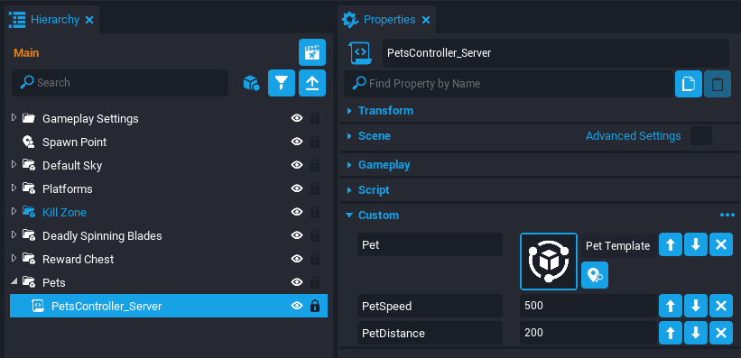{: .center loading="lazy" }

#### Add Code to the Script

Right click the **PetsController** script and select **Edit Script**.

##### Reference the Custom Properties

Add this code to reference the custom properties. There also needs to be a reference to the **Pets** group to spawn the templates as children.

```lua
local PET_TEMPLATE = script:GetCustomProperty("Pet")
local PET_SPEED = script:GetCustomProperty("PetSpeed")
local PET_DISTANCE = script:GetCustomProperty("PetDistance")
local PETS_GROUP = script.parent
```

##### The SpawnPet Function

The pets and their targets will be tracked in a table. So when a pet is spawned it will be added to a table with the pet object and the target object. The function has two parameters (`player` and `spawnPosition`) because it needs to match the amount of arguments being passed from the **Rewards Chest** broadcast.

```lua
local pets = {}

local function SpawnPet(player, spawnPosition)
    local pet = {
        object = World.SpawnAsset(PET_TEMPLATE, {parent = PETS_GROUP, position = spawnPosition}),
        target = player
    }
    table.insert(pets, pet)
end
```

##### Connect the SpawnPet Function

The **Rewards Chest** broadcast will call the `SpawnPet` function. Add this code to connect the event to the function.

```lua
Events.Connect("RewardClaimed", SpawnPet)
```

##### The Tick Function

The `Tick` function is a special function that runs every game tick. The pets need to constantly be following and looking at their target. [CoreObjects](../api/coreobject.md) have two useful functions named `Follow` and `LookAt` to get the desired behaviour of the pets.

```lua
function Tick()
    for _, pet in pairs(pets) do
        if Object.IsValid(pet.object) and Object.IsValid(pet.target) then
            pet.object:Follow(pet.target, PET_SPEED, PET_DISTANCE)
            pet.object:LookAt(pet.target:GetWorldPosition())
        end
    end
end
```

##### The OnPlayerLeft Function

If a player with a pet leaves the server then it would make sense for the pet to be deleted and the table to be updated.

```lua
function OnPlayerLeft(player)
	for _, pet in pairs(pets) do
        if Object.IsValid(pet.object) and Object.IsValid(pet.target) then
            if player.id == pet.target.id then
                pet.object:Destroy()
                pet = nil
            end
        end
    end
end
```

##### Connect the OnPlayerLeft Function

Add this code to the bottom to connect the `OnPlayerLeft` function to the `playerLeftEvent`.

```lua
Game.playerLeftEvent:Connect(OnPlayerLeft)
```

??? "The PetsController Script"
    ```lua
    local PET_TEMPLATE = script:GetCustomProperty("Pet")
    local PET_SPEED = script:GetCustomProperty("PetSpeed")
    local PET_DISTANCE = script:GetCustomProperty("PetDistance")
    local PETS_GROUP = script.parent

    local pets = {}

    local function SpawnPet(player, spawnPosition)
        local pet = {
            object = World.SpawnAsset(PET_TEMPLATE, {parent = PETS_GROUP, position = spawnPosition}),
            target = player
        }
        table.insert(pets, pet)
    end

    Events.Connect("RewardClaimed", SpawnPet)

    function Tick()
        for _, pet in pairs(pets) do
            if Object.IsValid(pet.object) and Object.IsValid(pet.target) then
                pet.object:Follow(pet.target, PET_SPEED, PET_DISTANCE)
                pet.object:LookAt(pet.target:GetWorldPosition())
            end
        end
    end

    function OnPlayerLeft(player)
        for _, pet in pairs(pets) do
            if Object.IsValid(pet.object) and Object.IsValid(pet.target) then
                if player.id == pet.target.id then
                    pet.object:Destroy()
                    pet = nil
                end
            end
        end
    end

    Game.playerLeftEvent:Connect(OnPlayerLeft)
    ```

### Test the Pets

Save the script and preview the project in multiplayer mode. Try getting the pet on multiple players to see if the networking is synced. Also try leaving the server on one of the players to see if the pet is destroyed for the other player.

<div class="mt-video" style="width:100%">
    <video autoplay muted playsinline controls loop class="center" style="width:100%">
        <source src="/img/Obby/Obby_Pet.mp4" type="video/mp4" />
    </video>
</div>

## Summary

**CoreObjects** have many useful functions to make games. This tutorial showcased a couple of them but there is still many not mentioned.

**Networking** in Core is also very useful to understand when making multiplayer games. Making experiences synced for all players and having a manageable amount of networking traffic can be a tricky, yet important balance.

The Obby created in this tutorial can be improved in the following ways:

- Adding more material and level design.
- Checkpoint system.
- Timers and Best Times.
- Persistent Storage for pets and times.
- Different rewards based on number of completions.
- Leaderboards with best times.

## Learn More

[CoreObject API](../api/coreobject.md) | [Networking](../references/networking.md) | [Triggers](../references/triggers.md) | [Race Timer Tutorial](../tutorials/race_timer.md)
