# Perks

## Overview

In this tutorial you are going to create different sellable in-game items and experiences that could be used to monetize your game.

Creators that are in the **Perks Program** are able to monetize their game using the built in monetization system.

For further information about the **Perks Program**, see the [Perks Program reference](/references/perks/program.md).

<div class="mt-video" style="width:100%">
    <video autoplay muted playsinline controls loop class="center" style="width:100%">
        <source src="/img/PerksTutorial/preview.mp4" type="video/mp4" />
    </video>
</div>

* **Completion Time:** ~2 hours
* **Knowledge Level:** It's recommended to have completed the [Scripting Beginner](lua_basics_helloworld.md) and [Scripting Intermediate](lua_basics_lightbulb.md) tutorials.
* **Skills you will learn:**
    * Using the Perks Manager window to create Perks.
    * Creating a resource shop with purchasable items.
    * Creating a tip jar with leaderboards.
    * Creating a sprint boost purchasable that applies to all players.
    * Updating player UI.
    * Saving player resources persistently.

---

## Enable Player Storage

[Player Storage](../references/persistent_storage.md) will need to be enabled so that data can persist for the player between game sessions. For example, if a player purchases a resource perk, then this will need to be saved for the player so they don't lose any resources they don't use in the current game session.

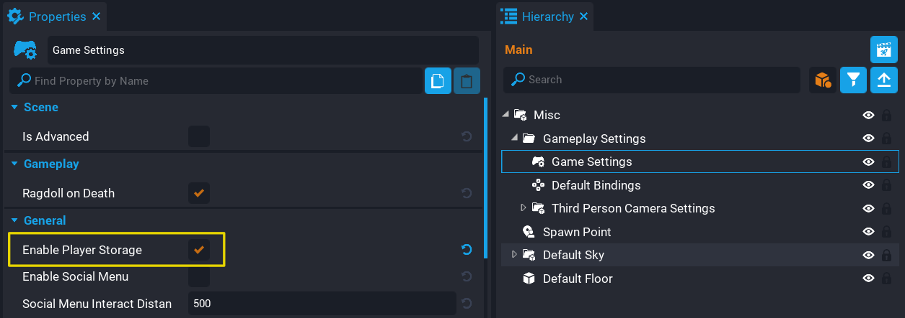{: .center loading="lazy" }

## Import Asset from Community Content

You will be importing an asset from **Community Content** that will contain various components you will drop into the **Hierarchy** while you follow the tutorial.

1. Open the **Community Content** window.
2. Search for `Perks Tutorial` by **CoreAcademy**.
3. Click **Import**.

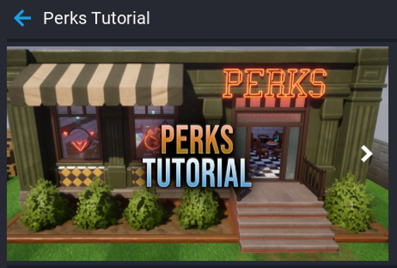{: .center loading="lazy" }

## Creating a Resource Shop

A resource shop will allow players to purchase various resources that are used in your game. You can sell a wide range of resources that could help the player catch up, get a head start, or simply to cut out some of the grinding. For example, selling an XP Potion that the players can drink to increase the amount of XP they get from performing tasks in your game (that is killing enemies).

In this tutorial you will create a resource shop that sells 4 items. Below is a list of those items, and a description of what the perk could potentially be used for in a game.

| Item | Description |
| ---- | ----------- |
| Pumpkins | A food resource that could provide additional benefits when eaten by the player. |
| Coins | In game currency for purchasing items that aren't premium (that is purchasing a weapon from a blacksmith). |
| XP Potion | A potion the player could drink and get an XP boost for a certain amount of time. |
| Gems | An in game currency used to purchase and trade items with other players. |

<div class="mt-video" style="width:100%">
    <video autoplay muted playsinline controls loop class="center" style="width:100%">
        <source src="/img/PerksTutorial/resource_shop_preview.mp4" type="video/mp4" />
    </video>
</div>

### Add Starting Assets Template to Hierarchy

1. Click the **Project Content** tab.
2. Click **My Templates** under **All Content**.
3. Add the template **Perks Tutorial - Starting Assets** into the **Hierarchy**.
4. Deinstance the **Perks Tutorial - Starting Assets** template in the **Hierarchy**.

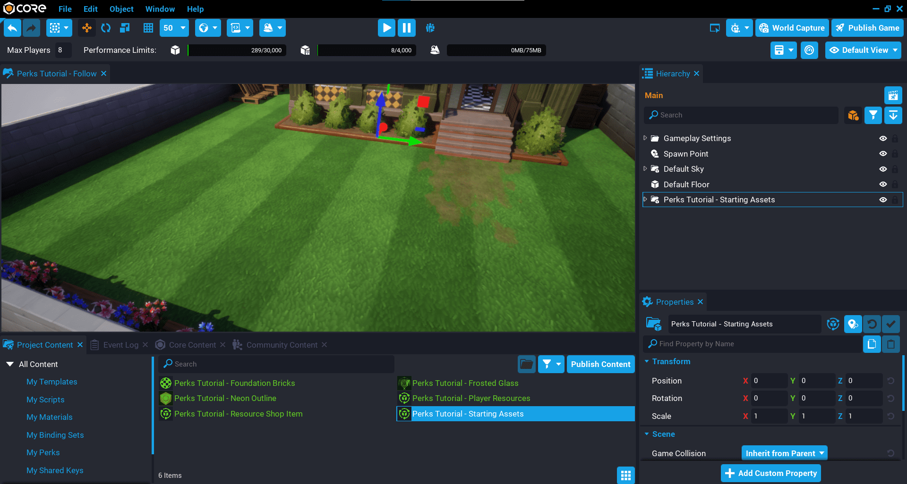{: .center loading="lazy" }

### Move Player Spawn Point

The default spawn point for the player is not in a good starting position, so move this to a better location so that the player doesn't spawn inside existing geometry.

!!! tip "Press ++V++ to turn on gizmo visibility to view the bounding volume of the spawn point."

<div class="mt-video" style="width:100%">
    <video autoplay muted playsinline controls loop class="center" style="width:100%">
        <source src="/img/PerksTutorial/spawn_point.mp4" type="video/mp4" />
    </video>
</div>

### Create Shop Trigger

You will use a trigger so you can detect when the player has entered the trigger volume, and then display the interaction label so the player can open the shop UI.

- Create a **Trigger**, and place it inside the **Triggers** group in the **Hierarchy**.
- Rename the trigger to **Resource Shop Trigger**.

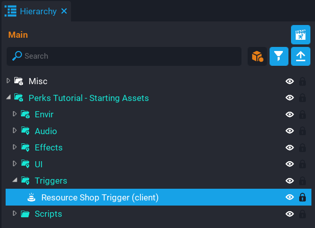{: .center loading="lazy" }

#### Force Collision On

Because the trigger is in a client context, you need to force collision on, otherwise you will not be able to detect when a player has entered the trigger volume.

Click on the **Resource Shop Trigger**, and set the **Game Collision** property to **Force On** in the **Properties** window. In doing so, the gizmo for the trigger volume will now show up in the scene view.

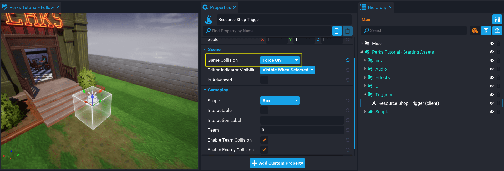{: .center loading="lazy" }

#### Position and Resize Trigger

The **Resource Shop Trigger** needs to be moved into the correct position, and resized to make sure the player can enter the **Resource Shop Trigger** volume.

!!! tip "Press ++V++ to turn on gizmo visibility to view the bounding volume of the **Resource Shop Trigger**."

Move the **Resource Shop Trigger** inside the Perks Shop. Place it in front of the counter, and resize the **Resource Shop Trigger**.

<div class="mt-video" style="width:100%">
    <video autoplay muted playsinline controls loop class="center" style="width:100%">
        <source src="/img/PerksTutorial/resource_shop_resize_position_resource_trigger.mp4" type="video/mp4" />
    </video>
</div>

#### Set Trigger Label

When the **Resource Shop Trigger** has the `interactable` property set to true, the label of the **Resource Shop Trigger** will be shown to the player when they enter the **Resource Shop Trigger** volume.

Set the **Interaction Label** property for the **Resource Shop Trigger** to `Resource Shop` in the **Properties** window.

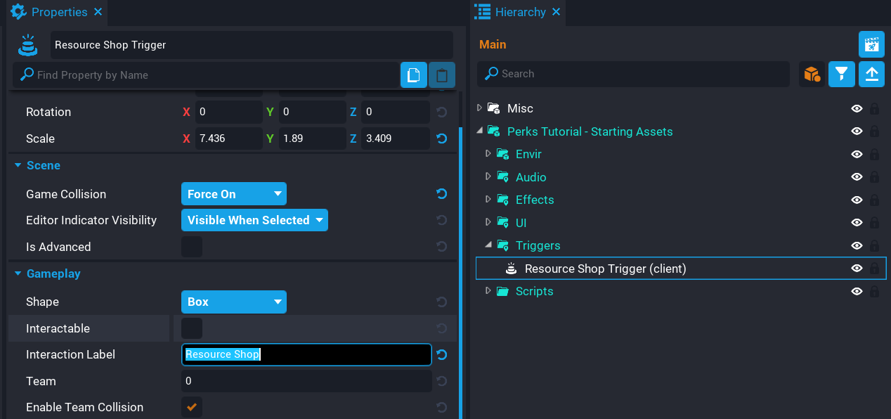{: .center loading="lazy" }

### Create Perks

For the resource shop, there will be 4 perks that you will need to create.

Open the **Perks Manager** window from the **Window** menu.

If you already have created perks for other projects, then you will see all your created perks inside the **Perks Manager** window. It may be useful to enable the option **View Only Perks in Current Project**, this will filter out all the perks that were not created in the current project.

Click the **Create Perk** button at the bottom of the **Perks Manager** window and create the 4 resource perks for the shop. It's a good idea to be descriptive with the perk name, as this will show up to players in game when the perk purchase window is open.

All the perks in the resource shop will be repeatable so players can buy multiple of the same perk.

!!! warning "Perk names must be unique. If the **Create Perk** button is disabled, check for an existing perk with the same name."

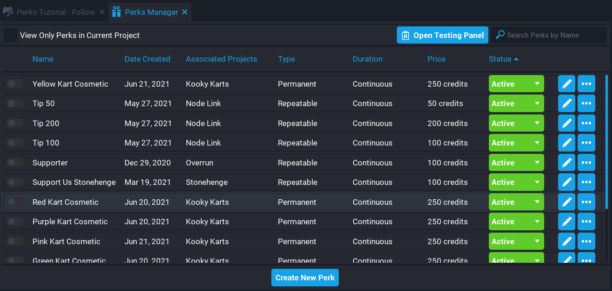{: .center loading="lazy" }

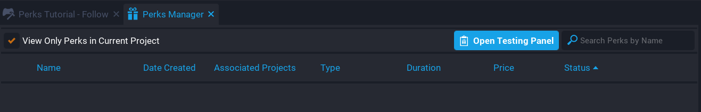{: .center loading="lazy" }

#### Create Pumpkins Perk

- Set the **Perk Name** to `Pumpkins`.
- Set the **Perk Type** to **Repeatable**.
- Set the **Price** to anything between 10 and 8000.

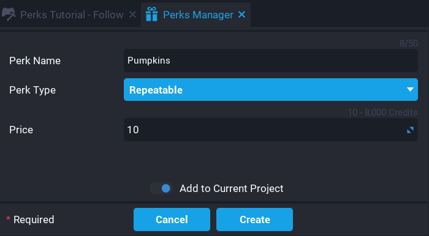{: .center loading="lazy" }

#### Create Coins Perk

- Set the **Perk Name** to `Coins`.
- Set the **Perk Type** to **Repeatable**.
- Set the **Price** to anything between 10 - 8000.

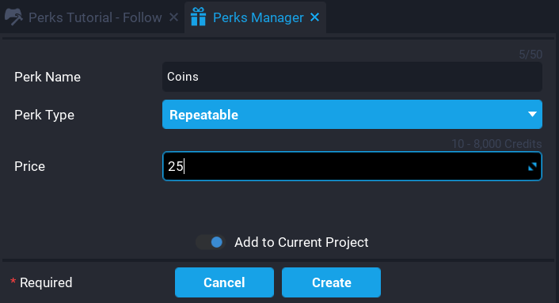{: .center loading="lazy" }

#### XP Potion Perk

- Set the **Perk Name** to `XP Potion`
- Set the **Perk Type** to **Repeatable**.
- Set the **Price** to anything between 10 - 8000.

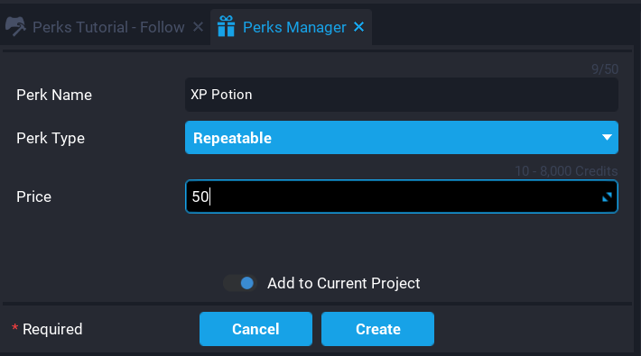{: .center loading="lazy" }

#### Gems Perk

- Set the **Perk Name** to `Gems`
- Set the **Perk Type** to **Repeatable**.
- Set the **Price** to anything between 10 - 8000.

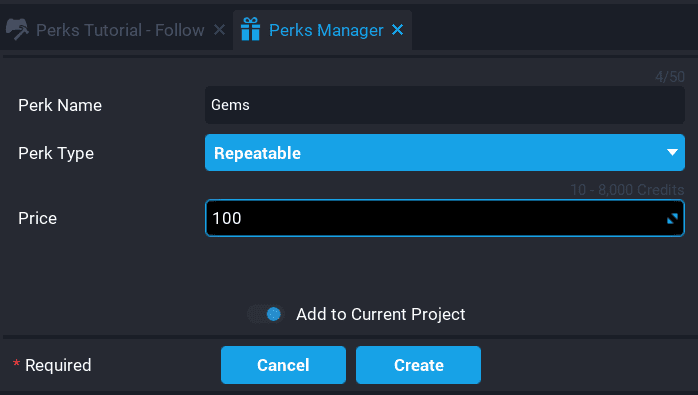{: .center loading="lazy" }

### Create UI Items

Each resource item needs to be added to the **Items** panel in the **Resource Shop** panel. An item template has been created for you that can be placed into the **Items** panel in the **Hierarchy**.

Do the following for each shop resource. Since 4 perks were created, then 4 items should be added to the shop UI.

1. Drag the template **Perks Tutorial - Resource Shop Item** into the **Items** panel.
2. Rename the item to one of the resources being sold (that is `Coins`).
3. Open the group in the **Hierarchy** and set the **text** property for the **Amount** object in the **Properties** window.
4. Change the **Image** property for the **image** object in the **Properties** window.
5. Select the **Button** object.
6. Add the Perk for this item to the **Perk Reference** property in the **Properties** window.

#### Setting Perk References

The perk reference in the **Properties** window can be set a few different ways:

- Dragging the perk reference from the **Perks Manager** window onto the **Perk Reference** property.
- Double clicking on the **Perk Reference** property and selecting the perk.
- Dragging the perk from **My Perks** in **Project Content** onto the **Perk Reference** property.

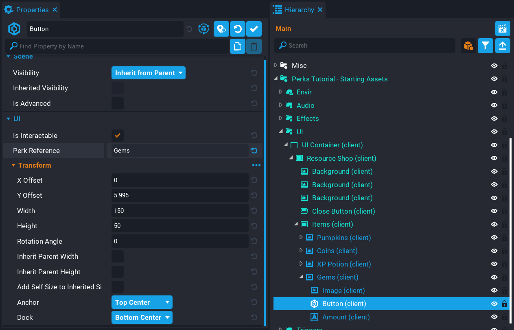{: .center loading="lazy" }

### Position UI Items

The UI items added for each resource that will be sold in the shop, will need to be positioned so they are spaced apart.

To visually see how the UI will look, you can temporarily set the **Visibility** to **Force On** in the **Properties** window for the **Resource Shop** panel in the **Hierarchy**.

See how the items in the UI are overlapping.

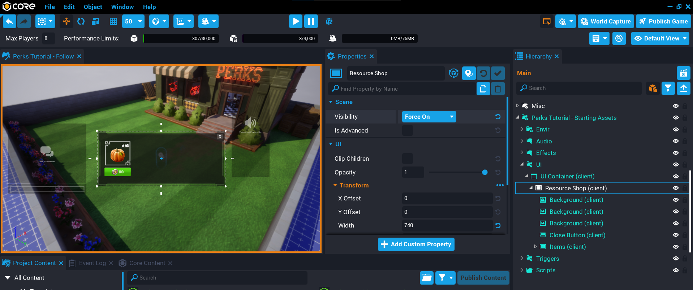{: .center loading="lazy" }

#### Set Item Position

The width of the **UI Image**, and a little spacing between each image is 165. Move each item after the first item by 165 for the **X Offset** property. You can use the **X Offset** field to handle the calculation each time for you by using the addition operator. For example, `165+165`.

After all the images have been positioned, the **Resource Shop** panel **Visibility** property can be set to **Force Off** in the **Properties** window.

<div class="mt-video" style="width:100%">
    <video autoplay muted playsinline controls loop class="center" style="width:100%">
        <source src="/img/PerksTutorial/resource_shop_position_resource_items.mp4" type="video/mp4" />
    </video>
</div>

### Create ResourceShopClient Script

Create a new script called `ResourceShopClient`, and place it into the **Client** group, in the **Scripts** group. The **ResourceShopClient** script will be responsible for opening and closing the UI.

The **ResourceShopClient** script needs references to a few things, so you will need to set up some custom properties.

- Add the **Resource Shop** panel as a custom property. Rename the property `ShopUI`.
- Add the **Resource Shop Trigger** as a custom property. Rename the property `ShopTrigger`
- Add the **Close Button** as a custom property. Rename the property `ShopButton`

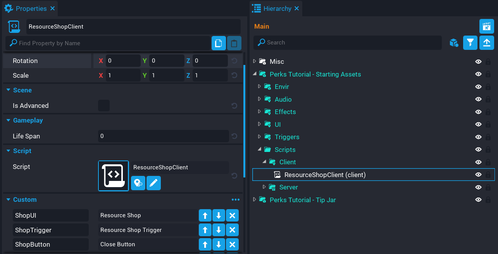{: .center loading="lazy" }

#### Create Shop UI Variables

Open the **ResourceShopClient** script.

Create these variables so you have a reference to the shop UI components.

```lua
local SHOP_UI = script:GetCustomProperty("ShopUI"):WaitForObject()
local SHOP_TRIGGER = script:GetCustomProperty("ShopTrigger"):WaitForObject()
local SHOP_BUTTON = script:GetCustomProperty("ShopButton"):WaitForObject()
```

The `inTrigger` variable will be used to determine if the player is in the trigger or not

```lua
local localPlayer = Game.GetLocalPlayer()
local inTrigger = false
```

#### Create CloseUI Function

The `CloseUI` function will be responsible for closing the UI when the `clickedEvent` listener for `SHOP_BUTTON` is fired, and when the player leaves the `SHOP_TRIGGER` volume.

```lua
local function CloseUI()
    SHOP_UI.visibility = Visibility.FORCE_OFF

    if inTrigger then
        SHOP_TRIGGER.isInteractable = true
    else
        SHOP_TRIGGER.isInteractable = false
    end

    UI.SetCursorVisible(false)
    UI.SetCanCursorInteractWithUI(false)
end
```

If the player closes the shop UI, they could still be inside the trigger volume, so you don't want to turn off the interaction label, otherwise the player would need to leave the trigger volume, and enter again.

```lua
if inTrigger then
    SHOP_TRIGGER.isInteractable = true
else
    SHOP_TRIGGER.isInteractable = false
end
```

#### Create OnInteracted Function

The `OnInteracted` function will be called when the player interacts with the `SHOP_TRIGGER`. The function will check to make sure `inTrigger` is true, indicating that the player is inside the `SHOP_TRIGGER` volume.

```lua
local function OnInteracted(trigger, obj)
    if inTrigger and Object.IsValid(obj) and obj:IsA("Player") and obj == localPlayer then
        SHOP_UI.visibility = Visibility.FORCE_ON
        SHOP_TRIGGER.isInteractable = false

        UI.SetCursorVisible(true)
        UI.SetCanCursorInteractWithUI(true)
    end
end
```

The last part of the `if` condition checks to see if the `obj` that has entered the `SHOP_TRIGGER` is the local player.

```lua
obj == localPlayer
```

!!! tip "Client Triggers"
    The listener for a client trigger can fire if another player enters the trigger volume. This is because players are replicated to each client. Meaning, you have copy of each player in the game on your side that has a collision capsule. To prevent this, check that the obj in the trigger volume matches the local player.

#### Create OnExitTrigger Function

The `OnExitTrigger` will check if the local player has exited the `SHOP_TRIGGER` volume and close the shop UI. The `inTrigger` variable is set to false so that the interaction label is turned off.

```lua
local function OnExitTrigger(trigger, obj)
    if Object.IsValid(obj) and obj:IsA("Player") and obj == localPlayer then
        inTrigger = false
        CloseUI()
    end
end
```

#### Create OnEnterTrigger Function

The `OnEnterTrigger` will check when the local player has entered the `SHOP_TRIGGER` volume and turn on interaction so the label will show up for the player. The `inTrigger` variable is set to true, indicating the player is inside the `SHOP_TRIGGER` volume.

```lua
local function OnEnterTrigger(trigger, obj)
    if Object.IsValid(obj) and obj:IsA("Player") and obj == localPlayer then
        SHOP_TRIGGER.isInteractable = true
        inTrigger = true
    end
end
```

!!! tip "Trigger Interaction Label"
    If a trigger is interactable, then the interaction label can show up to the player even when that player has not entered the trigger volume (that is the player getting close to the trigger volume). This is why the `inTrigger` variable is used, to make sure the player is inside the trigger volume before showing the interaction label.

#### Connect Events

Connect the `CloseUI` function to the `clickedEvent` for the `SHOP_BUTTON`. When the `SHOP_BUTTON` is clicked by the player, it will close the UI.

```lua
SHOP_BUTTON.clickedEvent:Connect(CloseUI)
```

Connect the `OnInteracted` function to the `interactedEvent` for the `SHOP_TRIGGER`. When trigger is interacted with, it will show or hide the UI for the player.

```lua
SHOP_TRIGGER.interactedEvent:Connect(OnInteracted)
```

Connect the `OnExitTrigger` function to the `endOverlapEvent` for the `SHOP_TRIGGER`. When the player exits the trigger volume, it will automatically close the UI for the player.

```lua
SHOP_TRIGGER.endOverlapEvent:Connect(OnExitTrigger)
```

Connect the `OnEnterTrigger` function to the `beginOverlapEvent` for the `SHOP_TRIGGER`. When the player enters the trigger volume, it will enable the interaction label for the player, so they can open the UI.

```lua
SHOP_TRIGGER.beginOverlapEvent:Connect(OnEnterTrigger)
```

#### The ResourceShopClient Script

??? "ResourceShopClient"
    ```lua
    local SHOP_UI = script:GetCustomProperty("ShopUI"):WaitForObject()
    local SHOP_TRIGGER = script:GetCustomProperty("ShopTrigger"):WaitForObject()
    local SHOP_BUTTON = script:GetCustomProperty("ShopButton"):WaitForObject()

    local localPlayer = Game.GetLocalPlayer()
    local inTrigger = false

    local function CloseUI()
        SHOP_UI.visibility = Visibility.FORCE_OFF

        if inTrigger then
            SHOP_TRIGGER.isInteractable = true
        else
            SHOP_TRIGGER.isInteractable = false
        end

        UI.SetCursorVisible(false)
        UI.SetCanCursorInteractWithUI(false)
    end

    local function OnInteracted(trigger, obj)
        if inTrigger and Object.IsValid(obj) and obj:IsA("Player") and obj == localPlayer then
            SHOP_UI.visibility = Visibility.FORCE_ON
            SHOP_TRIGGER.isInteractable = false

            UI.SetCursorVisible(true)
            UI.SetCanCursorInteractWithUI(true)
        end
    end

    local function OnExitTrigger(trigger, obj)
        if Object.IsValid(obj) and obj:IsA("Player") and obj == localPlayer then
            inTrigger = false
            CloseUI()
        end
    end

    local function OnEnterTrigger(trigger, obj)
        if Object.IsValid(obj) and obj:IsA("Player") and obj == localPlayer then
            SHOP_TRIGGER.isInteractable = true
            inTrigger = true
        end
    end

    SHOP_BUTTON.clickedEvent:Connect(CloseUI)

    SHOP_TRIGGER.interactedEvent:Connect(OnInteracted)
    SHOP_TRIGGER.endOverlapEvent:Connect(OnExitTrigger)
    SHOP_TRIGGER.beginOverlapEvent:Connect(OnEnterTrigger)
    ```

### Test the Game

Test the game and make sure the following work:

- Trigger interaction label is visible when entering the trigger volume.
- Trigger interaction label is not visible when exiting the trigger volume.
- Shop UI opens when pressing ++F++.
- Shop UI closes when clicking on the close button.
- Shop UI closes when the player leaves the trigger volume.
- Shop Items can be purchased.

!!! tip "Purchasing Perks"
    In preview mode, and for the creator of a published game, you will not be charged the credits for purchasing any perk. This is useful when you need to test the various perks in local and a published game.

<div class="mt-video" style="width:100%">
    <video autoplay muted playsinline controls loop class="center" style="width:100%">
        <source src="/img/PerksTutorial/resource_shop_ui_finished.mp4" type="video/mp4" />
    </video>
</div>

### Create Player Resource UI

The player can now purchase perks, but there is no way to see how much of each resource they have. So in this section, you will be adding some new UI and code to handle showing the resources to the player, which will update when the player makes purchases from the resource shop.

#### Add Player Resource Template

In **Project Content**, drag the template **Perks Tutorial - Player Resources** into the **UI Container** in the **Hierarchy**. This template contains 4 resources for the shop that have been set up for you already.

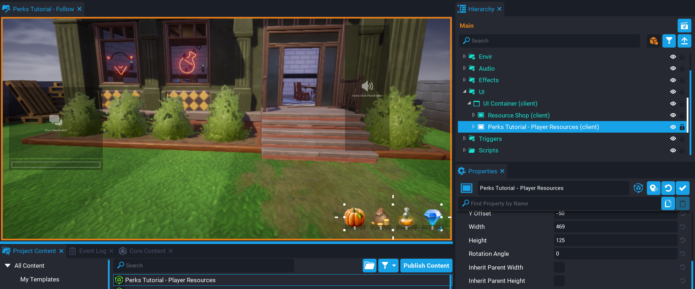{: .center loading="lazy" }

#### Update ResourceShopClient Script

The **ResourceShopClient** script will need references to each **Amount** object for each resource in the UI so that it can update the number when the resource changes.

Each **Amount** object inside each resource item in the **Perks Tutorial - Player Resources** template, needs to be added as a custom property.

- Add the **Amount** object from inside **Pumpkins** as a custom property. Name the property `PumpkinsAmount`.
- Add the **Amount** object from inside **Coins** as a custom property. Name the property `CoinsAmount`.
- Add the **Amount** object from inside **XP Potions** as a custom property. Name the property `XPPotionsAmount`.
- Add the **Amount** object from inside **Gems** as a custom property. Name the property `GemsAmount`.

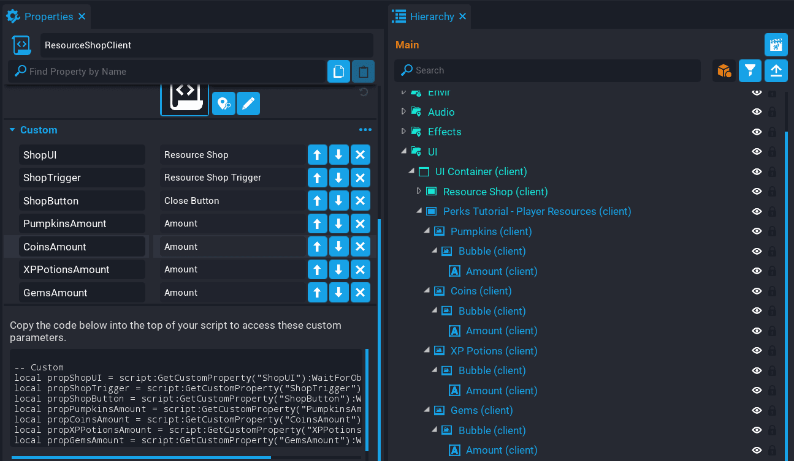{: .center loading="lazy" }

##### Create Amount Variables

Create these variables so you have a reference to each **UI Text** for each resource item in the shop. The `text`property will be set, based on how much of that resource the player has.

```lua
local PUMPKINS_AMOUNT = script:GetCustomProperty("PumpkinsAmount"):WaitForObject()
local COINS_AMOUNT = script:GetCustomProperty("CoinsAmount"):WaitForObject()
local XP_POTIONS_AMOUNT = script:GetCustomProperty("XPPotionsAmount"):WaitForObject()
local GEMS_AMOUNT = script:GetCustomProperty("GemsAmount"):WaitForObject()
```

##### Create UpdateResources Function

The `UpdateResources` will check which resource has changed, and update the text value for the resource that was updated. This will allow the player to see how much of a resource they have.

```lua
local function UpdateResources(player, resource, amount)
    if resource == "pumpkins" then
        PUMPKINS_AMOUNT.text = tostring(amount)
    elseif resource == "coins" then
        COINS_AMOUNT.text = tostring(amount)
    elseif resource == "xppotions" then
        XP_POTIONS_AMOUNT.text = tostring(amount)
    elseif resource == "gems" then
        GEMS_AMOUNT.text = tostring(amount)
    end
end
```

The `text` property of a `UIText` component needs to be a `string`. Because the `amount` is an `integer`, you need to convert it to a string using the `tostring` function.

```lua
tostring(amount)
```

##### Connect Resource Event

You need to know when a resource has changed so the UI can be updated. When a player's resource has changed using functions such as `AddResource`, `SetResource`, and `RemoveResource`, the `resourceChangeEvent` will be fired, allowing you to check which resource has changed, and to update the UI with the new amount.

```lua
localPlayer.resourceChangedEvent:Connect(UpdateResources)
```

##### The ResourceShopClient Script

??? "ResourceShopClient"
    ```lua
    local SHOP_UI = script:GetCustomProperty("ShopUI"):WaitForObject()
    local SHOP_TRIGGER = script:GetCustomProperty("ShopTrigger"):WaitForObject()
    local SHOP_BUTTON = script:GetCustomProperty("ShopButton"):WaitForObject()

    local PUMPKINS_AMOUNT = script:GetCustomProperty("PumpkinsAmount"):WaitForObject()
    local COINS_AMOUNT = script:GetCustomProperty("CoinsAmount"):WaitForObject()
    local XP_POTIONS_AMOUNT = script:GetCustomProperty("XPPotionsAmount"):WaitForObject()
    local GEMS_AMOUNT = script:GetCustomProperty("GemsAmount"):WaitForObject()

    local localPlayer = Game.GetLocalPlayer()
    local inTrigger = false

    local function CloseUI()
        SHOP_UI.visibility = Visibility.FORCE_OFF

        if inTrigger then
            SHOP_TRIGGER.isInteractable = true
        else
            SHOP_TRIGGER.isInteractable = false
        end

        UI.SetCursorVisible(false)
        UI.SetCanCursorInteractWithUI(false)
    end

    local function OnInteracted(trigger, obj)
        if inTrigger and Object.IsValid(obj) and obj:IsA("Player") and obj == localPlayer then
            SHOP_UI.visibility = Visibility.FORCE_ON
            SHOP_TRIGGER.isInteractable = false

            UI.SetCursorVisible(true)
            UI.SetCanCursorInteractWithUI(true)
        end
    end

    local function OnExitTrigger(trigger, obj)
        if Object.IsValid(obj) and obj:IsA("Player") and obj == localPlayer then
            inTrigger = false
            CloseUI()
        end
    end

    local function OnEnterTrigger(trigger, obj)
        if Object.IsValid(obj) and obj:IsA("Player") and obj == localPlayer then
            SHOP_TRIGGER.isInteractable = true
            inTrigger = true
        end
    end

    local function UpdateResources(player, resource, amount)
        if resource == "pumpkins" then
            PUMPKINS_AMOUNT.text = tostring(amount)
        elseif resource == "coins" then
            COINS_AMOUNT.text = tostring(amount)
        elseif resource == "xppotions" then
            XP_POTIONS_AMOUNT.text = tostring(amount)
        elseif resource == "gems" then
            GEMS_AMOUNT.text = tostring(amount)
        end
    end

    SHOP_BUTTON.clickedEvent:Connect(CloseUI)

    SHOP_TRIGGER.interactedEvent:Connect(OnInteracted)
    SHOP_TRIGGER.endOverlapEvent:Connect(OnExitTrigger)
    SHOP_TRIGGER.beginOverlapEvent:Connect(OnEnterTrigger)

    localPlayer.resourceChangedEvent:Connect(UpdateResources)
    ```

### Create ResourceShopServer Script

Create a new script called `ResourceShopServer`, and place it into the **Server** group, in the **Scripts** group. The **ResourceShopServer** script will be responsible for updating the player resources, and later on saving to player storage to persist the player's resources.

#### Create Resource Perk Properties

The **ResourceShopServer** needs to know about the resource perks. Add each resource perk as a custom property to the **ResourceShopServer** script.

- Add the **Pumpkins** Perk as a custom property. Name the property `PumpkinsPerk`.
- Add the **Coins** Perk as a custom property. Name the property `CoinsPerk`.
- Add the **XP Potion** Perk as a custom property. Name the property `XPPotionPerk`.
- Add the **Gems** Perk as a custom property. Name the property `GemsPerk`.

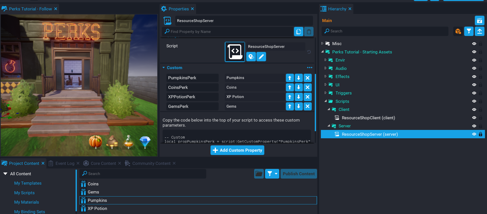{: .center loading="lazy" }

#### Create Perks Table

Open the **ResourceShopServer** script.

The `PERKS` table contains an entry for each resource perk which also includes some data. Storing them in a table like this will be easier later on when you need to persistently store them, as you can just loop through the `PERKS` table.

```lua
local PERKS = {

    {

        perk = script:GetCustomProperty("PumpkinsPerk"),
        resourceKey = "pumpkins",
        resourceAmount = 5,
        storageKey = "p"

    },

    {

        perk = script:GetCustomProperty("CoinsPerk"),
        resourceKey = "coins",
        resourceAmount = 150,
        storageKey = "c"

    },

    {

        perk = script:GetCustomProperty("XPPotionPerk"),
        resourceKey = "xppotions",
        resourceAmount = 1,
        storageKey = "xpp"

    },

    {

        perk = script:GetCustomProperty("GemsPerk"),
        resourceKey = "gems",
        resourceAmount = 50,
        storageKey = "g"

    }

}
```

| Property | Description |
| -------- | ----------- |
| `perk` | Net reference to the perk custom property. |
| `resourceKey` | The resource key that will be used for add / setting the resource for the player. |
| `resourceAmount` | The amount to give to the player when they purchase the resource perk. |
| `storageKey` | The key used in the table that will be stored in player storage. |

!!! tip "Hierarchy Lookup"
    If you have a lot of perks, instead of creating a large table, you could create a look list in the **Hierarchy**. The list would contain an entry for each perk, along with the data (similar to each entry in the `PERKS` table). This will allow you to edit and update the list from the editor without needing to open the script.

#### Create GetPerkData Function

The `GetPerkData` will loop through the `PERKS` table to find a perk that matches the `perk` parameter that is passed in.

```lua
local function GetPerkData(perk)
    for i, data in ipairs(PERKS) do
        if data.perk == perk then
            return data
        end
    end

    return nil
end
```

#### Create PerkChanged Function

The `PerkChanged` function is the listener that will be fired when the player has purchased a resource perk. The `perk` parameter will be the perk the player purchased, which can be used to lookup the perk data from the `PERKS` table.

```lua
local function PerkChanged(buyer, perk)
    local perkData = GetPerkData(perk)

    if perkData ~= nil then
        buyer:AddResource(perkData.resourceKey, perkData.resourceAmount)
    end
end
```

This will also trigger the `resourceChangedEvent` on the client in the **ResourceShopClient** script, so will update the player's UI.

```lua
buyer:AddResource(perkData.resourceKey, perkData.resourceAmount)
```

#### Create OnJoined Function

When the player purchases a perk, the listener `PerkChanged` will be called, which will update the player's resource.

```lua
local function OnJoined(player)
    player.perkChangedEvent:Connect(PerkChanged)
end
```

#### Connect playerJoinedEvent

When a player joins the game, the `OnJoined` listener will be called.

```lua
Game.playerJoinedEvent:Connect(OnJoined)
```

#### The ResourceShopServer Script

??? "ResourceShopServer"
    ```lua
    local PERKS = {

        {

            perk = script:GetCustomProperty("PumpkinsPerk"),
            resourceKey = "pumpkins",
            resourceAmount = 5,
            storageKey = "p"

        },

        {

            perk = script:GetCustomProperty("CoinsPerk"),
            resourceKey = "coins",
            resourceAmount = 150,
            storageKey = "c"

        },

        {

            perk = script:GetCustomProperty("XPPotionPerk"),
            resourceKey = "xppotions",
            resourceAmount = 1,
            storageKey = "xpp"

        },

        {

            perk = script:GetCustomProperty("GemsPerk"),
            resourceKey = "gems",
            resourceAmount = 50,
            storageKey = "g"

        }

    }

    local function GetPerkData(perk)
        for i, data in ipairs(PERKS) do
            if data.perk == perk then
                return data
            end
        end

        return nil
    end

    local function PerkChanged(buyer, perk)
        local perkData = GetPerkData(perk)

        if perkData ~= nil then
            buyer:AddResource(perkData.resourceKey, perkData.resourceAmount)
        end
    end

    local function OnJoined(player)
        player.perkChangedEvent:Connect(PerkChanged)
    end

    Game.playerJoinedEvent:Connect(OnJoined)
    ```

### Test the Game

Test the game and make sure that each perk purchased, updates the amount in the UI.

<div class="mt-video" style="width:100%">
    <video autoplay muted playsinline controls loop class="center" style="width:100%">
        <source src="/img/PerksTutorial/resource_shop_ui_finished.mp4" type="video/mp4" />
    </video>
</div>

### Store Player Resources Persistently

The resources that the player purchases need to be stored persistently so that in the next session, the game will load from storage the amount of resources the player has.

#### Update ResourceShopServer Script

You will need to make some changes to a few of the functions in the **ResourceShopServer** script so the player's resources are loaded and saved to player storage.

##### Update PerkChanged Function

Update the `PerkChanged` function to add support for player storage.

```lua
local function PerkChanged(buyer, perk)
    local perkData = GetPerkData(perk)
    local playerData = Storage.GetPlayerData(buyer)

    if perkData ~= nil then
        buyer:AddResource(perkData.resourceKey, perkData.resourceAmount)

        if not playerData[perkData.storageKey] then
            playerData[perkData.storageKey] = 0
        end

        playerData[perkData.storageKey] = playerData[perkData.storageKey] + perkData.resourceAmount

        Storage.SetPlayerData(buyer, playerData)
    end
end
```

Each time a perk has been purchased, the player's storage data is loaded and stored in the `playerData` variable. This will be a table, even if there is no data stored.

```lua
local playerData = Storage.GetPlayerData(buyer)
```

Check to see if the `storageKey` for the perk exists in the player's data. If it doesn't, create it and set the resource value to `0`. This is done to make sure there is a valid entry for the perk in the `playerData` table.

```lua
if not playerData[perkData.storageKey] then
    playerData[perkData.storageKey] = 0
end
```

!!! tip "Shortcut"
    A shortcut for the above code can be written as `playerData[perkData.storageKey] = playerData[perkData.storageKey] or 0`. If the value is nil, then 0 will be stored. This reduces readability, but is handy to know.

Update the value in the table with the amount the player has just purchased.

```lua
playerData[perkData.storageKey] = playerData[perkData.storageKey] + perkData.resourceAmount
```

Update the player's storage. This is done after each purchase to make sure the data stored is the most up to date data.

```lua
Storage.SetPlayerData(buyer, playerData)
```

##### Update OnJoined Function

The `OnJoined` function needs to be updated, so that when the player joins, the `PERKS` table is looped over and sets the player's resource for the perk on that iteration of the loop.

```lua
local function OnJoined(player)
    local playerData = Storage.GetPlayerData(player)

    for i, data in ipairs(PERKS) do
        player:SetResource(data.resourceKey, playerData[data.storageKey] or 0)
    end

    player.perkChangedEvent:Connect(PerkChanged)
end
```

##### The ResourceShopServer Script

??? "ResourceShopServer"
    ```lua
    local PERKS = {

        {

            perk = script:GetCustomProperty("PumpkinsPerk"),
            resourceKey = "pumpkins",
            resourceAmount = 5,
            storageKey = "p"

        },

        {

            perk = script:GetCustomProperty("CoinsPerk"),
            resourceKey = "coins",
            resourceAmount = 150,
            storageKey = "c"

        },

        {

            perk = script:GetCustomProperty("XPPotionPerk"),
            resourceKey = "xppotions",
            resourceAmount = 1,
            storageKey = "xpp"

        },

        {

            perk = script:GetCustomProperty("GemsPerk"),
            resourceKey = "gems",
            resourceAmount = 50,
            storageKey = "g"

        }

    }

    local function GetPerkData(perk)
        for i, data in ipairs(PERKS) do
            if data.perk == perk then
                return data
            end
        end

        return nil
    end

    local function PerkChanged(buyer, perk)
        local perkData = GetPerkData(perk)
        local playerData = Storage.GetPlayerData(buyer)

        if perkData ~= nil then
            buyer:AddResource(perkData.resourceKey, perkData.resourceAmount)

            if not playerData[perkData.storageKey] then
                playerData[perkData.storageKey] = 0
            end

            playerData[perkData.storageKey] = playerData[perkData.storageKey] + perkData.resourceAmount

            Storage.SetPlayerData(buyer, playerData)
        end
    end

    local function OnJoined(player)
        local playerData = Storage.GetPlayerData(player)

        for i, data in ipairs(PERKS) do
            player:SetResource(data.resourceKey, playerData[data.storageKey] or 0)
        end

        player.perkChangedEvent:Connect(PerkChanged)
    end

    Game.playerJoinedEvent:Connect(OnJoined)
    ```

#### Update ResourceShopClient Script

The final thing left to do, is update the **ResourceShopClient** script.

This code will loop over all the local player's resources, and update the resource in the UI. The reason for this, is that when the resources get set on the server when the player joins the game, the `resourceChangeEvent` for the client may not be connected yet.

```lua
for key, value in pairs(localPlayer:GetResources()) do
    UpdateResources(localPlayer, key, value)
end
```

##### The ResourceShopClient Script

??? "ResourceShopClient"
    ```lua
    local SHOP_UI = script:GetCustomProperty("ShopUI"):WaitForObject()
    local SHOP_TRIGGER = script:GetCustomProperty("ShopTrigger"):WaitForObject()
    local SHOP_BUTTON = script:GetCustomProperty("ShopButton"):WaitForObject()

    local PUMPKINS_AMOUNT = script:GetCustomProperty("PumpkinsAmount"):WaitForObject()
    local COINS_AMOUNT = script:GetCustomProperty("CoinsAmount"):WaitForObject()
    local XP_POTIONS_AMOUNT = script:GetCustomProperty("XPPotionsAmount"):WaitForObject()
    local GEMS_AMOUNT = script:GetCustomProperty("GemsAmount"):WaitForObject()

    local localPlayer = Game.GetLocalPlayer()
    local inTrigger = false

    local function CloseUI()
        SHOP_UI.visibility = Visibility.FORCE_OFF

        if inTrigger then
            SHOP_TRIGGER.isInteractable = true
        else
            SHOP_TRIGGER.isInteractable = false
        end

        UI.SetCursorVisible(false)
        UI.SetCanCursorInteractWithUI(false)
    end

    local function OnInteracted(trigger, obj)
        if inTrigger and Object.IsValid(obj) and obj:IsA("Player") and obj == localPlayer then
            SHOP_UI.visibility = Visibility.FORCE_ON
            SHOP_TRIGGER.isInteractable = false

            UI.SetCursorVisible(true)
            UI.SetCanCursorInteractWithUI(true)
        end
    end

    local function OnExitTrigger(trigger, obj)
        if Object.IsValid(obj) and obj:IsA("Player") and obj == localPlayer then
            inTrigger = false
            CloseUI()
        end
    end

    local function OnEnterTrigger(trigger, obj)
        if Object.IsValid(obj) and obj:IsA("Player") and obj == localPlayer then
            SHOP_TRIGGER.isInteractable = true
            inTrigger = true
        end
    end

    local function UpdateResources(player, resource, amount)
        if resource == "pumpkins" then
            PUMPKINS_AMOUNT.text = tostring(amount)
        elseif resource == "coins" then
            COINS_AMOUNT.text = tostring(amount)
        elseif resource == "xppotions" then
            XP_POTIONS_AMOUNT.text = tostring(amount)
        elseif resource == "gems" then
            GEMS_AMOUNT.text = tostring(amount)
        end
    end

    SHOP_BUTTON.clickedEvent:Connect(CloseUI)

    SHOP_TRIGGER.interactedEvent:Connect(OnInteracted)
    SHOP_TRIGGER.endOverlapEvent:Connect(OnExitTrigger)
    SHOP_TRIGGER.beginOverlapEvent:Connect(OnEnterTrigger)

    localPlayer.resourceChangedEvent:Connect(UpdateResources)

    for key, value in pairs(localPlayer:GetResources()) do
        UpdateResources(localPlayer, key, value)
    end
    ```

### Test the Game

Test the game and make sure the following work:

- Purchasing a perk updates the UI.
- Leaving and rejoining the game loads the resources from storage.
- Test in multiplayer preview.

<div class="mt-video" style="width:100%">
    <video autoplay muted playsinline controls loop class="center" style="width:100%">
        <source src="/img/PerksTutorial/resource_shop_final.mp4" type="video/mp4" />
    </video>
</div>

## Creating a Tip Jar

In this section you will be creating a tip jar where players can give you a tip in game. You will also be adding a leaderboard to keep track of the top 10 tippers.

As you work through this section, you should see some familiarity with how things are set up, including the code. You are putting to use what you have already learned in the previous section, but adapting it for a different purpose.

<div class="mt-video" style="width:100%">
    <video autoplay muted playsinline controls loop class="center" style="width:100%">
        <source src="/img/PerksTutorial/tip_jar_preview.mp4" type="video/mp4" />
    </video>
</div>

### Add Tip Jar Template to Hierarchy

1. Click the **Project Content** tab.
2. Click **My Templates** under **All Content**.
3. Add the template **Perks Tutorial - Tip Jar** into the **Hierarchy**.
4. Deinstance the **Perks Tutorial - Tip Jar** template in the **Hierarchy**.

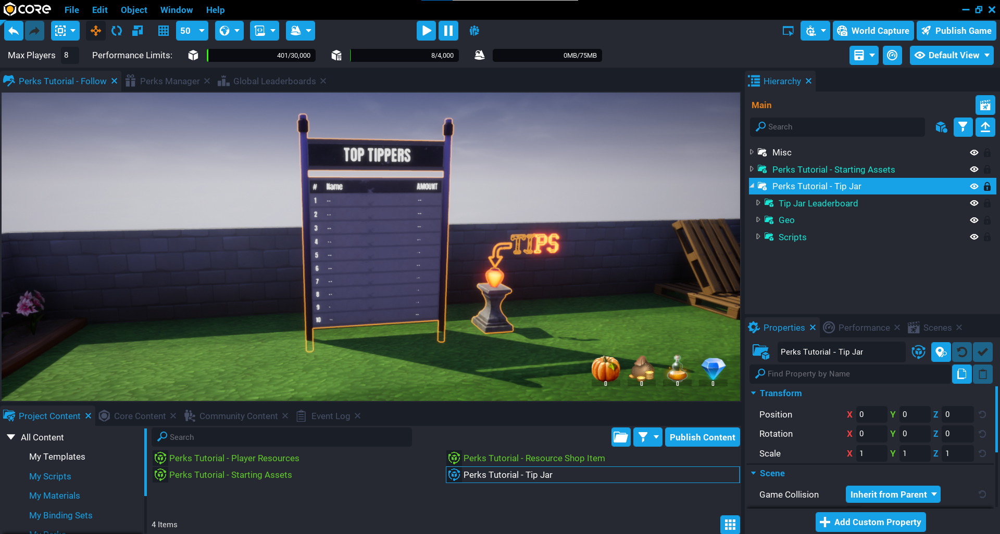{: .center loading="lazy" }

### Create Tip Jar Trigger

A trigger will need to be added so you can detect when the player has entered the trigger volume so the interaction label is visible for the player for them to open the tip jar UI.

- Create a **Trigger**, and place it inside the **Triggers** group in the **Hierarchy**.
- Rename the trigger to **Tip Jar Trigger**.

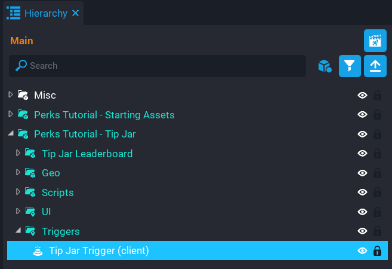{: .center loading="lazy" }

#### Force Collision On

Because the trigger is in a client context, you need to force collision on, otherwise you will not be able to detect when a player has entered the trigger volume.

Click on the **Tip Jar Trigger**, and set the **Game Collision** property to **Force On** in the **Properties** window. In doing so, the gizmo for the trigger volume will now show up in the scene view.

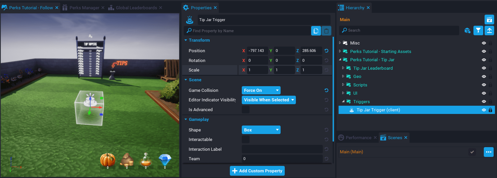{: .center loading="lazy" }

#### Position and Resize Trigger

The **Tip Jar Trigger** needs to be moved into the correct position, and resized to make sure the player can enter the **Tip Jar Trigger** volume.

!!! tip "Press ++V++ to turn on gizmo visibility to view the bounding volume of the **Tip Jar Trigger**."

Move the **Tip Jar Trigger** in front of the tip jar pedestal, and resize it.

<div class="mt-video" style="width:100%">
    <video autoplay muted playsinline controls loop class="center" style="width:100%">
        <source src="/img/PerksTutorial/tip_jar_resize_position_trigger.mp4" type="video/mp4" />
    </video>
</div>

#### Set Trigger Label

When the **Tip Jar Trigger** has the `interactable` property set to true, the label of the **Tip Jar Trigger** will be shown to the player when they enter the **Tip Jar Trigger** volume.

Set the **Interaction Label** property for the **Tip Jar Trigger** to `Give Tip` in the **Properties** window.

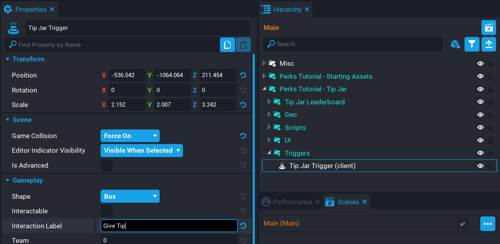{: .center loading="lazy" }

### Create Perks

You will be creating 3 perks that allow the player to pick how much they want to tip. These perks will be repeatable, so the player can tip more if they like.

Create the following new repeatable perks.

- Tip Jar 10
- Tip Jar 50
- Tip Jar 100

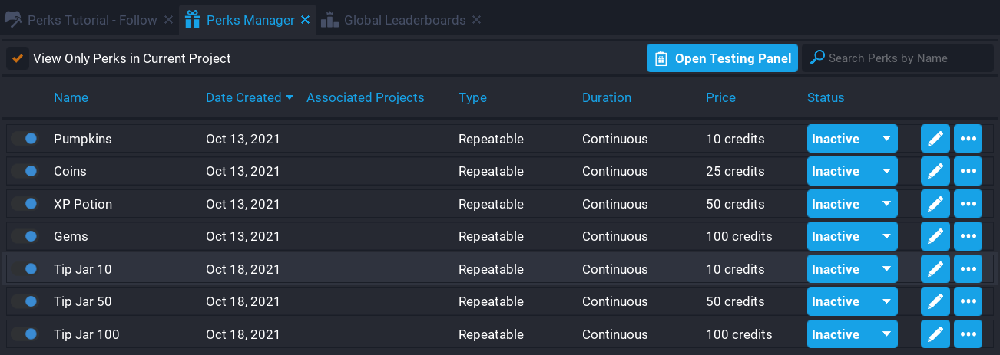{: .center loading="lazy" }

### Create UI Perk Buttons

The tip jar template comes with some UI already set up. You will need to create the perk buttons and set up the perk references.

Create 3 perk buttons inside the **Items** group in the **Tip Jar** group. You can drag the **UI Perk Purchase Button** from **Perk Tools** in **Project Content** into your **Hierarchy**.

For each perk added to the UI, drag the perk reference onto the **Perk Reference** property in the **Properties** window.

!!! tip "View Tip Jar UI"
    Turn on the **Visibility** of the **Tip Jar** panel to see the UI while you position the buttons.

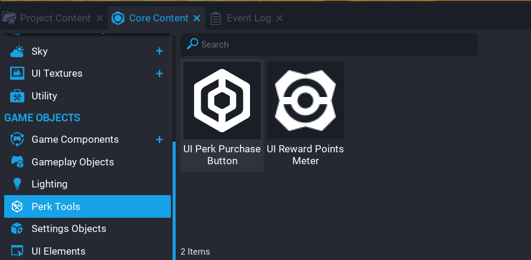{: .center loading="lazy" }

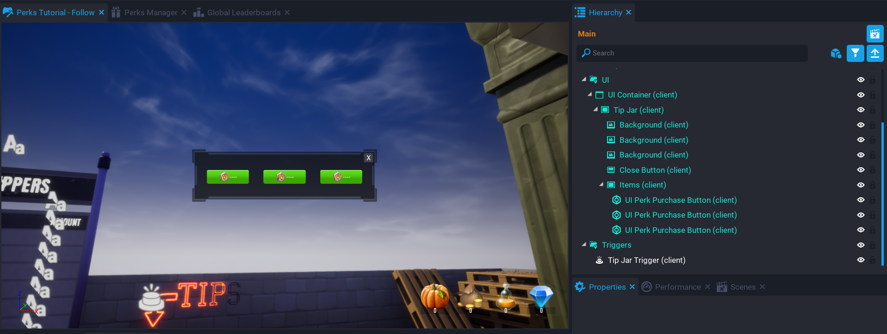{: .center loading="lazy" }

### Create TipJarClient Script

Create a new script called `TipJarClient` and place it into the **Client** group, in the **Scripts** group. The **TipJarClient** script will be responsible for opening and closing the UI, and later on retrieving the leaderboard entries.

- Add the **Tip Jar** panel as a custom property. Rename the property `TipJarUI`.
- Add the **Tip Jar Trigger** as a custom property. Rename the property `TipJarTrigger`.
- Add the **Close Button** as a custom property. Rename the property `TipJarButton`.

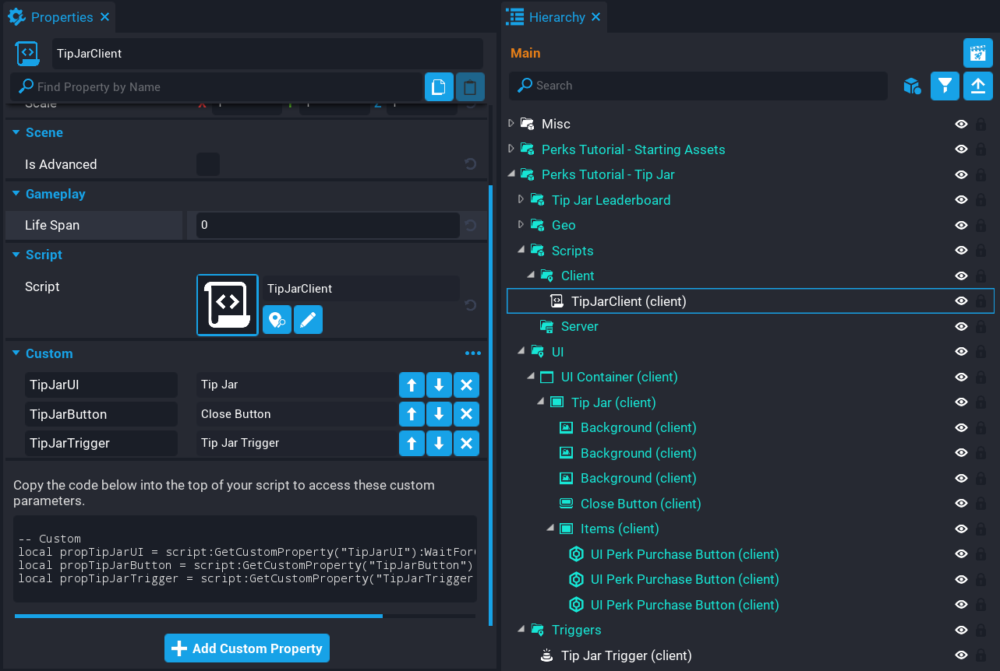{: .center loading="lazy" }

#### Create UI Variables

Open the **TipJarClient** script.

Create the variables so you have a reference to the UI objects for the Tip Jar.

```lua
local TIP_JAR_UI = script:GetCustomProperty("TipJarUI"):WaitForObject()
local TIP_JAR_TRIGGER = script:GetCustomProperty("TipJarTrigger"):WaitForObject()
local TIP_JAR_BUTTON = script:GetCustomProperty("TipJarButton"):WaitForObject()
```

The `inTrigger` variable will be used to determine if the player is in the trigger or not.

```lua
local localPlayer = Game.GetLocalPlayer()
local inTrigger = false
```

#### Create CloseUI Function

The `CloseUI` will be called when the `clickedEvent` for `TIP_JAR_BUTTON` is fired, and when the player leaves the `TIP_JAR_TRIGGER` volume.

```lua
local function CloseUI()
    TIP_JAR_UI.visibility = Visibility.FORCE_OFF

    if inTrigger then
        TIP_JAR_TRIGGER.isInteractable = true
    else
        TIP_JAR_TRIGGER.isInteractable = false
    end

    UI.SetCursorVisible(false)
    UI.SetCanCursorInteractWithUI(false)
end
```

If the player closes the Tip Jar UI, they could still be inside the trigger volume, so you don't want to turn of the interaction label, otherwise the player would need to leave the trigger volume, and enter again.

```lua
if inTrigger then
    TIP_JAR_TRIGGER.isInteractable = true
else
    TIP_JAR_TRIGGER.isInteractable = false
end
```

#### Create OnInteracted Function

The `OnInteracted` will be called when the player interacts with the `TIP_JAR_TRIGGER`.

```lua
local function OnInteracted(trigger, obj)
    if inTrigger and Object.IsValid(obj) and obj:IsA("Player") and obj == localPlayer then
        TIP_JAR_UI.visibility = Visibility.FORCE_ON
        TIP_JAR_TRIGGER.isInteractable = false

        UI.SetCursorVisible(true)
        UI.SetCanCursorInteractWithUI(true)
    end
end
```

#### Create OnExitTrigger Function

The `OnExitTrigger` will check if the local player has exited the `TIP_JAR_TRIGGER` volume, and close the tip jar UI.

```lua
local function OnExitTrigger(trigger, obj)
    if Object.IsValid(obj) and obj:IsA("Player") and obj == localPlayer then
        inTrigger = false
        CloseUI()
    end
end
```

#### Create OnEnterTrigger Function

The `OnEnterTrigger` will check when the local player has entered the `TIP_JAR_TRIGGER` volume and turn on interaction so the label will show up for the player.

```lua
local function OnEnterTrigger(trigger, obj)
    if Object.IsValid(obj) and obj:IsA("Player") and obj == localPlayer then
        TIP_JAR_TRIGGER.isInteractable = true
        inTrigger = true
    end
end
```

#### Connect Events

Connect the `CloseUI` function to the `clickedEvent` for the `TIP_JAR_BUTTON`. When the `TIP_JAR_BUTTON` is clicked by the player, it will close the UI.

```lua
TIP_JAR_BUTTON.clickedEvent:Connect(CloseUI)
```

Connect the `OnInteracted` function to the `interactedEvent` for the `TIP_JAR_TRIGGER`. When trigger is interacted with, it will show or hide the UI for the player.

```lua
TIP_JAR_TRIGGER.interactedEvent:Connect(OnInteracted)
```

Connect the `OnExitTrigger` function to the `endOverlapEvent` for the `TIP_JAR_TRIGGER`. When the player exits the trigger volume, it will automatically close the UI for the player.

```lua
TIP_JAR_TRIGGER.endOverlapEvent:Connect(OnExitTrigger)
```

Connect the `OnEnterTrigger` function to the `beginOverlapEvent` for the `TIP_JAR_TRIGGER`. When the player enters the trigger volume, it will enable the interaction label for the player, so they can open the UI.

```lua
TIP_JAR_TRIGGER.beginOverlapEvent:Connect(OnEnterTrigger)
```

#### The TipJarClient Script

??? "TipJarClient"
    ```lua
    local TIP_JAR_UI = script:GetCustomProperty("TipJarUI"):WaitForObject()
    local TIP_JAR_TRIGGER = script:GetCustomProperty("TipJarTrigger"):WaitForObject()
    local TIP_JAR_BUTTON = script:GetCustomProperty("TipJarButton"):WaitForObject()

    local localPlayer = Game.GetLocalPlayer()
    local inTrigger = false

    local function CloseUI()
        TIP_JAR_UI.visibility = Visibility.FORCE_OFF

        if inTrigger then
            TIP_JAR_TRIGGER.isInteractable = true
        else
            TIP_JAR_TRIGGER.isInteractable = false
        end

        UI.SetCursorVisible(false)
        UI.SetCanCursorInteractWithUI(false)
    end

    local function OnInteracted(trigger, obj)
        if inTrigger and Object.IsValid(obj) and obj:IsA("Player") and obj == localPlayer then
            TIP_JAR_UI.visibility = Visibility.FORCE_ON
            TIP_JAR_TRIGGER.isInteractable = false

            UI.SetCursorVisible(true)
            UI.SetCanCursorInteractWithUI(true)
        end
    end

    local function OnExitTrigger(trigger, obj)
        if Object.IsValid(obj) and obj:IsA("Player") and obj == localPlayer then
            inTrigger = false
            CloseUI()
        end
    end

    local function OnEnterTrigger(trigger, obj)
        if Object.IsValid(obj) and obj:IsA("Player") and obj == localPlayer then
            TIP_JAR_TRIGGER.isInteractable = true
            inTrigger = true
        end
    end

    TIP_JAR_BUTTON.clickedEvent:Connect(CloseUI)

    TIP_JAR_TRIGGER.interactedEvent:Connect(OnInteracted)
    TIP_JAR_TRIGGER.endOverlapEvent:Connect(OnExitTrigger)
    TIP_JAR_TRIGGER.beginOverlapEvent:Connect(OnEnterTrigger)
    ```

### Test the Game

Test the game and make sure the following work:

- Trigger interaction label is visible when entering the trigger volume.
- Trigger interaction label is not visible when exiting the trigger volume.
- Tip jar UI opens when pressing ++F++.
- Tip jar UI closes when clicking on the close button.
- Tip jar UI closes when the player leaves the trigger volume.
- Tip jar items can be purchased.

<div class="mt-video" style="width:100%">
    <video autoplay muted playsinline controls loop class="center" style="width:100%">
        <source src="/img/PerksTutorial/tip_jar_ui_finished.mp4" type="video/mp4" />
    </video>
</div>

### Create Tip Jar Leaderboard

Create a new leaderboard called `Top Tippers`, and set **Sorting** to **Higher Is Better**, and the **Rank Entries** to `10`.

When a player tips you, the amount will be added to the stored amount for that player, and submitted to the leaderboard.

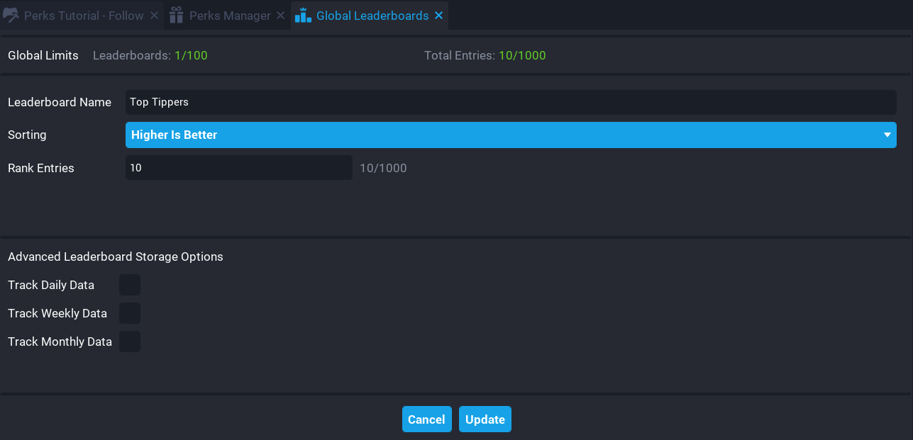{: .center loading="lazy" }

### Create TipJarServer Script

Create a new script called `TipJarServer`, and place it into the **Server** group, in the **Scripts** group. The **TipJarServer** script will be responsible for updating the player's total tip amount so it is saved persistently, and submitting the new amount to the leaderboard.

- Add the leaderboard `Top Tippers` as a custom property. Name the property `TopTippers`.
- Add the `Tip Jar 10` perk as a custom property. Name the property `TipJar10`.
- Add the `Tip Jar 50` perk as a custom property. Name the property `TipJar50`.
- Add the `Tip Jar 100` perk as a custom property. Name the property `TipJar100`.

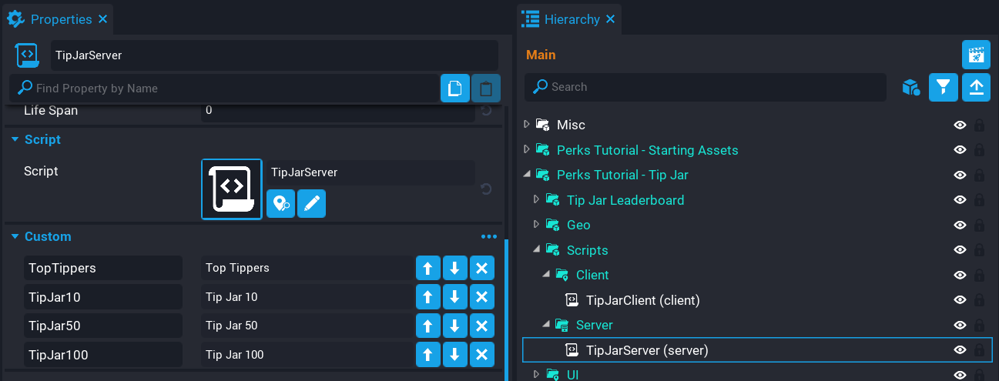{: .center loading="lazy" }

#### Create Perk & Leaderboard Variables

Open the **TipJarServer** script.

You need a reference to the leaderboard, and the 3 tip jar perks.

```lua
local TOP_TIPPERS_LEADERBOARD = script:GetCustomProperty("TopTippers")

local TIP_JAR_10 = script:GetCustomProperty("TipJar10")
local TIP_JAR_50 = script:GetCustomProperty("TipJar50")
local TIP_JAR_100 = script:GetCustomProperty("TipJar100")
```

#### Create SubmitLeaderboardEntry Function

The `SubmitLeaderboardEntry` will check if the game has leaderboards, and then will submit the player's score. The score will be the total amount that player has tipped.

```lua
local function SubmitLeaderboardEntry(player, score)
    if Leaderboards.HasLeaderboards() then
        Leaderboards.SubmitPlayerScore(TOP_TIPPERS_LEADERBOARD, player, score)
    end
end
```

#### Create PerkChanged Function

The `PerkChanged` function will be called when the `perkChanged` event has fired when a player purchases a perk. It will check to see which perk was purchased, and store the perk amount in the `amount` variable.

```lua
local function PerkChanged(buyer, perk)
    local playerData = Storage.GetPlayerData(buyer)

    if not playerData.tips then
        playerData.tips = 0
    end

    local amount = 0

    if perk == TIP_JAR_10 then
        amount = 10
    elseif perk == TIP_JAR_50 then
        amount = 50
    elseif perk == TIP_JAR_100 then
        amount = 100
    end

    playerData.tips = playerData.tips + amount

    Storage.SetPlayerData(buyer, playerData)
    SubmitLeaderboardEntry(buyer, playerData.tips)
end
```

The total tips amount for the player is updated with the `amount`.

```lua
playerData.tips = playerData.tips + amount
```

Update the player's storage, and submit the total tip amount to the leaderboard.

```lua
Storage.SetPlayerData(buyer, playerData)
SubmitLeaderboardEntry(buyer, playerData.tips)
```

!!! warning "Multiple perkChanged Events"
    Something to be aware of, is if you have multiple `perkChanged` events, all of them will fire when the player purchases a perk.

#### Create OnJoined Function

 When the player joins the game, the `perkChangedEvent` will be connected.

```lua
local function OnJoined(player)
    player.perkChangedEvent:Connect(PerkChanged)
end
```

#### Connect Event

You need to connect up the `playerJoinedEvent` so the `OnJoined` listener is fired when a player joins the game.

```lua
Game.playerJoinedEvent:Connect(OnJoined)
```

#### The TipJarServer Script

??? "TipJarServer"
    ```lua
    local TOP_TIPPERS_LEADERBOARD = script:GetCustomProperty("TopTippers")

    local TIP_JAR_10 = script:GetCustomProperty("TipJar10")
    local TIP_JAR_50 = script:GetCustomProperty("TipJar50")
    local TIP_JAR_100 = script:GetCustomProperty("TipJar100")

    local function SubmitLeaderboardEntry(player, score)
        if Leaderboards.HasLeaderboards() then
            Leaderboards.SubmitPlayerScore(TOP_TIPPERS_LEADERBOARD, player, score)
        end
    end

    local function PerkChanged(buyer, perk)
        local playerData = Storage.GetPlayerData(buyer)

        if not playerData.tips then
            playerData.tips = 0
        end

        local amount = 0

        if perk == TIP_JAR_10 then
            amount = 10
        elseif perk == TIP_JAR_50 then
            amount = 50
        elseif perk == TIP_JAR_100 then
            amount = 100
        end

        playerData.tips = playerData.tips + amount

        Storage.SetPlayerData(buyer, playerData)
        SubmitLeaderboardEntry(buyer, playerData.tips)
    end

    local function OnJoined(player)
        player.perkChangedEvent:Connect(PerkChanged)
    end

    Game.playerJoinedEvent:Connect(OnJoined)
    ```

### Update TipJarClient Script

The **TipJarClient** script needs to be updated so that it loads the leaderboard list and displays the top tippers in game.

- Add the **Top Tippers** leaderboard as a custom property. Name the property `TopTippers`.
- Add the **Entries** group found in the **Table** group, in the **Tip Jar Leaderboard** group as a custom property. Name the property `LeaderboardEntries`.

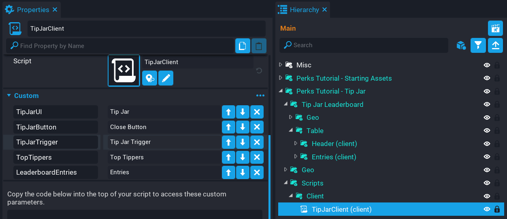{: .center loading="lazy" }

#### Create Leaderboard Variables

Open the **TipJarClient** script.

You will need a reference to the leaderboard to get the submitted entries, and a reference to the UI entries so they can be updated to display the names and amount of the top tippers.

```lua
local TOP_TIPPERS_LEADERBOARD = script:GetCustomProperty("TopTippers")
local LEADERBOARD_ENTRIES = script:GetCustomProperty("LeaderboardEntries"):WaitForObject()
```

#### Create UpdateLeaderboard Function

The `UpdateLeaderboard` function will refresh the leaderboard by spawning a task that repeats forever, but will repeat every 10 seconds.

!!! tip "Task Repeating Interval"
    For the tutorial the `repeatInterval` property for the task is set to `10` seconds. For a public game, 30 seconds would be more ideal.

```lua
local function UpdateLeaderboard()
    local updater = Task.Spawn(function()
        if Leaderboards.HasLeaderboards() then
            local list = Leaderboards.GetLeaderboard(TOP_TIPPERS_LEADERBOARD, LeaderboardType.GLOBAL)

            if list ~= nil then
                for index, value in ipairs(list) do
                    local entry = LEADERBOARD_ENTRIES:GetChildren()[index]

                    if entry ~= nil then
                        entry:FindDescendantByName("Name").text = value.name
                        entry:FindDescendantByName("Amount").text = string.format("%0.f", value.score)
                    end
                end
            end
        end
    end)

    updater.repeatInterval = 10
    updater.repeatCount = -1
end
```

The `GetLeaderboard` function will fetch the global list for the **Top Tippers** leaderboard that you created.

```lua
local list = Leaderboards.GetLeaderboard(TOP_TIPPERS_LEADERBOARD, LeaderboardType.GLOBAL)
```

Iterate through the `list`, on each iteration, it will use the `index` to get a reference to the leaderboard entry child.

```lua
for index, value in ipairs(list) do
    local entry = LEADERBOARD_ENTRIES:GetChildren()[index]

    if entry ~= nil then
        entry:FindDescendantByName("Name").text = value.name
        entry:FindDescendantByName("Amount").text = string.format("%0.f", value.score)
    end
end
```

If the `entry` is not `nil`, then find the `Name` and `Amount`, and update the `text` properties.

```lua
entry:FindDescendantByName("Name").text = value.name
entry:FindDescendantByName("Amount").text = string.format("%0.f", value.score)
```

Because the `score` value is an `integer`, you need to convert it to a `string` so it can be set for the `text` property. You can use either `tostring`, or better, use `string.format` so the string can be formatted to display with no decimal points. For example, `string.format` in this case will return `300` instead of `300.0`.

```lua
string.format("%0.f", value.score)
```

#### Call UpdateLeaderboard Function

At the end of the script, you need to call the `UpdateLeaderboard()` function.

```lua
UpdateLeaderboard()
```

### The TipJarClient Script

??? "TipJarClient"
    ```lua
    local TIP_JAR_UI = script:GetCustomProperty("TipJarUI"):WaitForObject()
    local TIP_JAR_TRIGGER = script:GetCustomProperty("TipJarTrigger"):WaitForObject()
    local TIP_JAR_BUTTON = script:GetCustomProperty("TipJarButton"):WaitForObject()

    local TOP_TIPPERS_LEADERBOARD = script:GetCustomProperty("TopTippers")
    local LEADERBOARD_ENTRIES = script:GetCustomProperty("LeaderboardEntries"):WaitForObject()

    local localPlayer = Game.GetLocalPlayer()
    local inTrigger = false

    local function CloseUI()
        TIP_JAR_UI.visibility = Visibility.FORCE_OFF

        if inTrigger then
            TIP_JAR_TRIGGER.isInteractable = true
        else
            TIP_JAR_TRIGGER.isInteractable = false
        end

        UI.SetCursorVisible(false)
        UI.SetCanCursorInteractWithUI(false)
    end

    local function OnInteracted(trigger, obj)
        if inTrigger and Object.IsValid(obj) and obj:IsA("Player") and obj == localPlayer then
            TIP_JAR_UI.visibility = Visibility.FORCE_ON
            TIP_JAR_TRIGGER.isInteractable = false

            UI.SetCursorVisible(true)
            UI.SetCanCursorInteractWithUI(true)
        end
    end

    local function OnExitTrigger(trigger, obj)
        if Object.IsValid(obj) and obj:IsA("Player") and obj == localPlayer then
            inTrigger = false
            CloseUI()
        end
    end

    local function OnEnterTrigger(trigger, obj)
        if Object.IsValid(obj) and obj:IsA("Player") and obj == localPlayer then
            TIP_JAR_TRIGGER.isInteractable = true
            inTrigger = true
        end
    end

    local function UpdateLeaderboard()
        local updater = Task.Spawn(function()
            if Leaderboards.HasLeaderboards() then
                local list = Leaderboards.GetLeaderboard(TOP_TIPPERS_LEADERBOARD, LeaderboardType.GLOBAL)

                if list ~= nil then
                    for index, value in ipairs(list) do
                        local entry = LEADERBOARD_ENTRIES:GetChildren()[index]

                        if entry ~= nil then
                            entry:FindDescendantByName("Name").text = value.name
                            entry:FindDescendantByName("Amount").text = string.format("%0.f", value.score)
                        end
                    end
                end
            end
        end)

        updater.repeatInterval = 10
        updater.repeatCount = -1
    end

    TIP_JAR_BUTTON.clickedEvent:Connect(CloseUI)

    TIP_JAR_TRIGGER.interactedEvent:Connect(OnInteracted)
    TIP_JAR_TRIGGER.endOverlapEvent:Connect(OnExitTrigger)
    TIP_JAR_TRIGGER.beginOverlapEvent:Connect(OnEnterTrigger)

    UpdateLeaderboard()
    ```

### Test the Game

Test the game and make sure the following work:

- Leaderboard entries are loaded (if there are entries).
- Leaderboards update (currently 10 seconds per refresh).

<div class="mt-video" style="width:100%">
    <video autoplay muted playsinline controls loop class="center" style="width:100%">
        <source src="/img/PerksTutorial/tip_jar_complete.mp4" type="video/mp4" />
    </video>
</div>

## Creating a Player Sprint Boost

In this section you will be creating a sprint boost perk that can be purchased by the player. Not only will the player who purchases the perk receive the boost, but it will also apply to all other players in the game. As an extra incentive to the player to purchase the boost, that player's boost time will be extended if they already have a boost active that they originally purchased.

<div class="mt-video" style="width:100%">
    <video autoplay muted playsinline controls loop class="center" style="width:100%">
        <source src="/img/PerksTutorial/sprint_boost_preview.mp4" type="video/mp4" />
    </video>
</div>

### Add Sprint Boost Template to Hierarchy

The assets you imported from Community Content contain a sprint boost template that you can use to follow along with the tutorial.

1. Click the **Project Content** tab.
2. Click **My Templates** under **All Content**.
3. Add the template **Perks Tutorial - Sprint Boost** into the **Hierarchy**.
4. Deinstance the **Perks Tutorial - Sprint Boost** template in the **Hierarchy**.

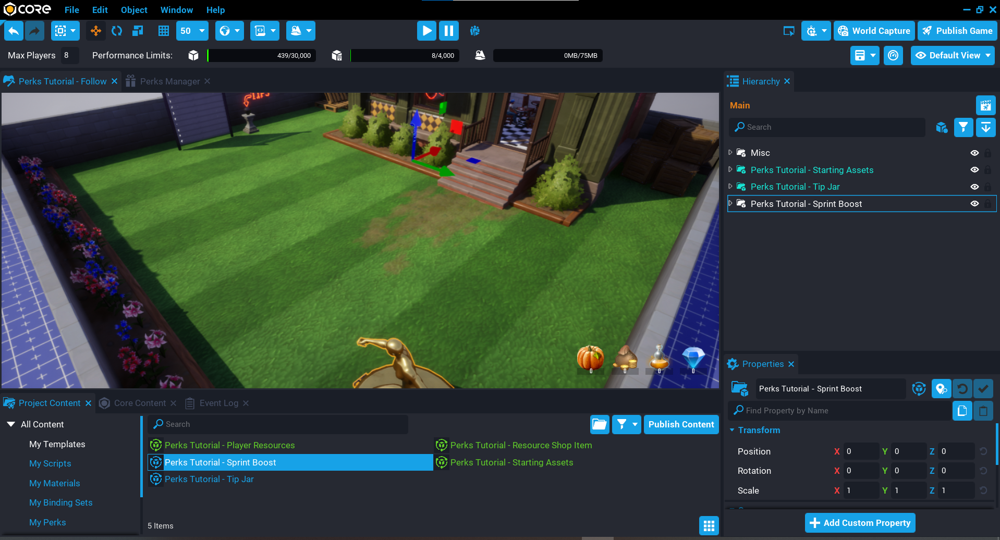{: .center loading="lazy" }

### Create Sprint Boost Trigger

A trigger will need to be added so you can detect when the player has entered the trigger volume, so the interaction label is visible for the player for them to open the sprint boost UI.

- Create a **Trigger**, and place it inside the **Triggers** group in the **Hierarchy**.
- Rename the trigger to **Sprint Boost Trigger**.

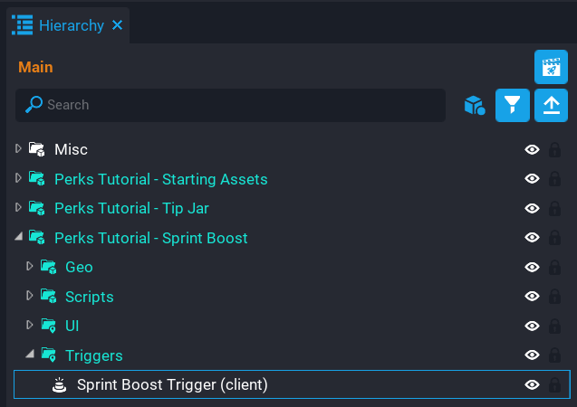{: .center loading="lazy" }

#### Force Collision On

Because the trigger is in a client context, you need to force collision on, otherwise you will not be able to detect when a player has entered the trigger volume.

Click on the **Sprint Boost Trigger**, and set the **Game Collision** property to **Force On** in the **Properties** window. In doing so, the gizmo for the trigger volume will now show up in the scene view.

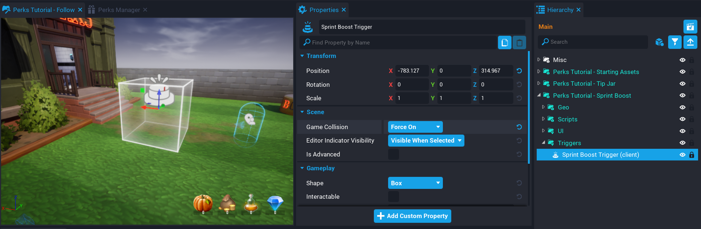{: .center loading="lazy" }

#### Position and Resize Trigger

The **Sprint Boost Trigger** needs to be moved into the correct position, and resized to make sure the player can enter the **Sprint Boost Trigger** volume.

!!! tip "Press ++V++ to turn on gizmo visibility to view the bounding volume of the **Sprint Boost Trigger**."

Move the **Sprint Boost Trigger** in front of the base of the sprint boost object, and resize it.

<div class="mt-video" style="width:100%">
    <video autoplay muted playsinline controls loop class="center" style="width:100%">
        <source src="/img/PerksTutorial/sprint_boost_resize_position_trigger.mp4" type="video/mp4" />
    </video>
</div>

#### Set Trigger Label

When the **Sprint Boost Trigger** has the `interactable` property set to true, the label of the **Sprint Boost Trigger** will be shown to the player when they enter the **Sprint Boost Trigger** volume.

Set the **Interaction Label** property for the **Sprint Boost Trigger** to `Purchase Sprint Boost` in the **Properties** window.

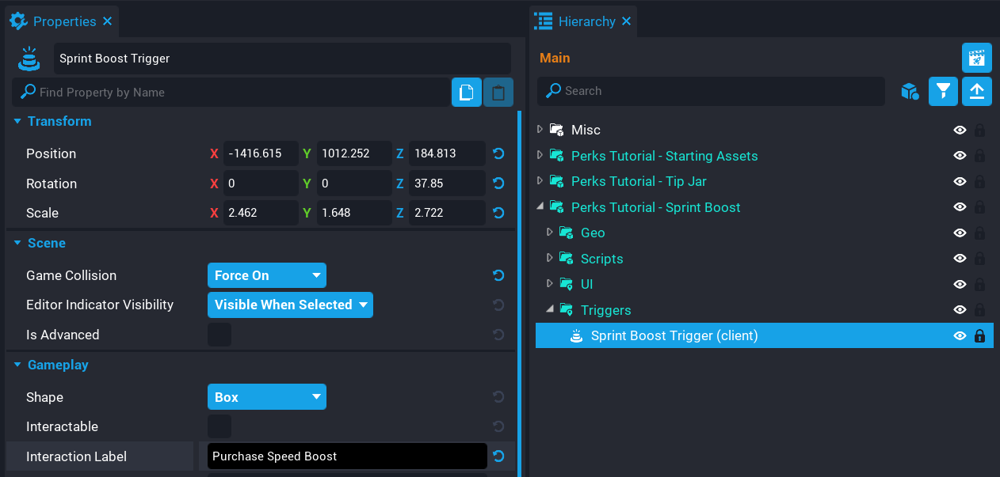{: .center loading="lazy" }

### Create Perk

Create a repeatable perk for the sprint boost.

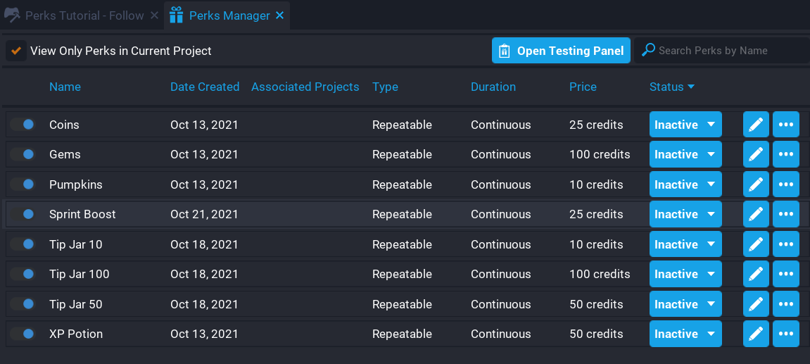{: .center loading="lazy" }

### Create UI Perk Button

The sprint boost template comes with some UI already set up. You will need to create the perk button and set up the perk reference.

Create one perk button inside the **Items** group in the **Sprint Boost** group. You can drag the **UI Perk Purchase Button** from **Perk Tools** in **Project Content** into your **Hierarchy**.

Add the sprint boost perk to the **Perk Reference** property in the **Properties** window.

{: .center loading="lazy" }

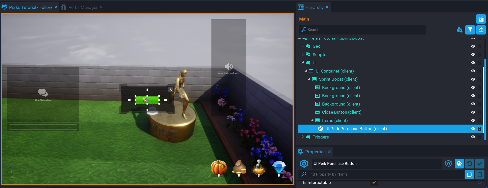{: .center loading="lazy" }

### Create SprintBoostClient Script

Create a new script called `SprintBoostClient`, and place it into the **Client** group, in the **Scripts** group. The **SprintBoostClient** script will be responsible for opening and closing the UI.

- Add the **Sprint Boost** panel as a custom property. Rename the property `SprintBoostUI`.
- Add the **Sprint Boost Trigger** as a custom property. Rename the property `SprintBoostTrigger`.
- Add the **Close Button** as a custom property. Rename the property `SprintBoostButton`.

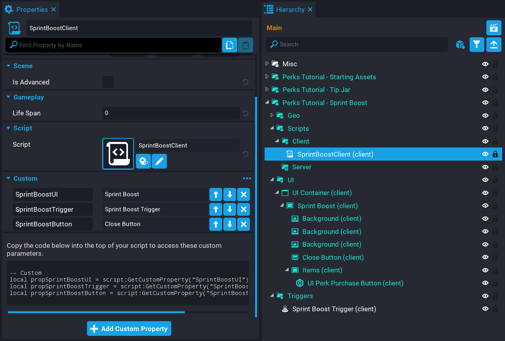{: .center loading="lazy" }

#### Create Sprint Boost Variables

Open the **SprintBoostClient** script.

Create references to the sprint boost UI. You will also need a reference to the local player that will be used to see if the player in the trigger is the local player.

The `inTrigger` variable will be used to determine if the player is in the trigger or not.

```lua
local SPRINT_BOOST_UI = script:GetCustomProperty("SprintBoostUI"):WaitForObject()
local SPRINT_BOOST_TRIGGER = script:GetCustomProperty("SprintBoostTrigger"):WaitForObject()
local SPRINT_BOOST_BUTTON = script:GetCustomProperty("SprintBoostButton"):WaitForObject()

local localPlayer = Game.GetLocalPlayer()
local inTrigger = false
```

#### Create CloseUI Function

The `CloseUI` function will called when the `clickedEvent` for `SPRINT_BOOST_BUTTON` is fired, and when the player leaves the `SPRINT_BOOST_TRIGGER` volume.

```lua
local function CloseUI()
    SPRINT_BOOST_UI.visibility = Visibility.FORCE_OFF

    if inTrigger then
        SPRINT_BOOST_TRIGGER.isInteractable = true
    else
        SPRINT_BOOST_TRIGGER.isInteractable = false
    end

    UI.SetCursorVisible(false)
    UI.SetCanCursorInteractWithUI(false)
end
```

#### Create OnInteracted Function

The `OnInteracted` function will be called when the player interacts with the `SPRINT_BOOST_TRIGGER`.

```lua
local function OnInteracted(trigger, obj)
    if inTrigger and Object.IsValid(obj) and obj:IsA("Player") and obj == localPlayer then
        SPRINT_BOOST_UI.visibility = Visibility.FORCE_ON
        SPRINT_BOOST_TRIGGER.isInteractable = false

        UI.SetCursorVisible(true)
        UI.SetCanCursorInteractWithUI(true)
    end
end
```

#### Create OnExitTrigger Function

The `OnExitTrigger` function will check if the local player has exited the `SPRINT_BOOST_TRIGGER` volume, and close the sprint boost UI.

```lua
local function OnExitTrigger(trigger, obj)
    if Object.IsValid(obj) and obj:IsA("Player") and obj == localPlayer then
        inTrigger = false
        CloseUI()
    end
end
```

#### Create OnEnterTrigger Function

The `OnEnterTrigger` function will check when the local player has entered the `SPRINT_BOOST_TRIGGER` volume and turn on interaction so the label will show up for the player.

```lua
local function OnEnterTrigger(trigger, obj)
    if Object.IsValid(obj) and obj:IsA("Player") and obj == localPlayer then
        SPRINT_BOOST_TRIGGER.isInteractable = true
        inTrigger = true
    end
end
```

#### Connect Events

Connect the `CloseUI` function to the `clickedEvent` for the `SPRINT_BOOST_BUTTON`. When the `SPRINT_BOOST_BUTTON` is clicked by the player, it will close the UI.

```lua
SPRINT_BOOST_BUTTON.clickedEvent:Connect(CloseUI)
```

Connect the `OnInteracted` function to the `interactedEvent` for the `SPRINT_BOOST_TRIGGER`. When trigger is interacted with, it will show or hide the UI for the player.

```lua
SPRINT_BOOST_TRIGGER.interactedEvent:Connect(OnInteracted)
```

Connect the `OnExitTrigger` function to the `endOverlapEvent` for the `SPRINT_BOOST_TRIGGER`. When the player exits the trigger volume, it will automatically close the UI for the player.

```lua
SPRINT_BOOST_TRIGGER.endOverlapEvent:Connect(OnExitTrigger)
```

Connect the `OnEnterTrigger` function to the `beginOverlapEvent` for the `SPRINT_BOOST_TRIGGER`. When the player enters the trigger volume, it will enable the interaction label for the player, so they can open the UI.

```lua
SPRINT_BOOST_TRIGGER.beginOverlapEvent:Connect(OnEnterTrigger)
```

#### The SprintBoostClient Script

??? "SprintBoostClient"
    ```lua
    local SPRINT_BOOST_UI = script:GetCustomProperty("SprintBoostUI"):WaitForObject()
    local SPRINT_BOOST_TRIGGER = script:GetCustomProperty("SprintBoostTrigger"):WaitForObject()
    local SPRINT_BOOST_BUTTON = script:GetCustomProperty("SprintBoostButton"):WaitForObject()

    local localPlayer = Game.GetLocalPlayer()
    local inTrigger = false

    local function CloseUI()
        SPRINT_BOOST_UI.visibility = Visibility.FORCE_OFF

        if inTrigger then
            SPRINT_BOOST_TRIGGER.isInteractable = true
        else
            SPRINT_BOOST_TRIGGER.isInteractable = false
        end

        UI.SetCursorVisible(false)
        UI.SetCanCursorInteractWithUI(false)
    end

    local function OnInteracted(trigger, obj)
        if inTrigger and Object.IsValid(obj) and obj:IsA("Player") and obj == localPlayer then
            SPRINT_BOOST_UI.visibility = Visibility.FORCE_ON
            SPRINT_BOOST_TRIGGER.isInteractable = false

            UI.SetCursorVisible(true)
            UI.SetCanCursorInteractWithUI(true)
        end
    end

    local function OnExitTrigger(trigger, obj)
        if Object.IsValid(obj) and obj:IsA("Player") and obj == localPlayer then
            inTrigger = false
            CloseUI()
        end
    end

    local function OnEnterTrigger(trigger, obj)
        if Object.IsValid(obj) and obj:IsA("Player") and obj == localPlayer then
            SPRINT_BOOST_TRIGGER.isInteractable = true
            inTrigger = true
        end
    end

    SPRINT_BOOST_BUTTON.clickedEvent:Connect(CloseUI)

    SPRINT_BOOST_TRIGGER.interactedEvent:Connect(OnInteracted)
    SPRINT_BOOST_TRIGGER.endOverlapEvent:Connect(OnExitTrigger)
    SPRINT_BOOST_TRIGGER.beginOverlapEvent:Connect(OnEnterTrigger)
    ```

### Test the Game

Test the game and make sure the following work:

- Trigger interaction label is visible when entering the trigger volume.
- Trigger interaction label is not visible when exiting the trigger volume.
- Sprint boost UI opens when pressing ++F++.
- Sprint boost UI closes when clicking on the close button.
- Sprint boost UI closes when the player leaves the trigger volume.
- Sprint boost item can be purchased.

<div class="mt-video" style="width:100%">
    <video autoplay muted playsinline controls loop class="center" style="width:100%">
        <source src="/img/PerksTutorial/sprint_boost_ui_finished.mp4" type="video/mp4" />
    </video>
</div>

### Create SprintBoostServer Script

Create a new script called `SprintBoostServer`, and place it into the **Server** group, in the **Scripts** group. The **SprintBoostServer** script will be responsible for applying the sprint boost to the player who purchased the perk, and also apply the sprint boost to all players on the server.

- Add the **Sprint Boost** perk as a custom property. Name the property `SprintBoostPerk`.
- Add a new **Float** custom property. Name the property `NormalSpeed`, and set it to `640`.
- Add a new **Float** custom property. Name the property `BoostSpeed`, and set it to `2000`.
- Add a new **Float** custom property. Name the property `BoostDuration`, and set it to `5`.

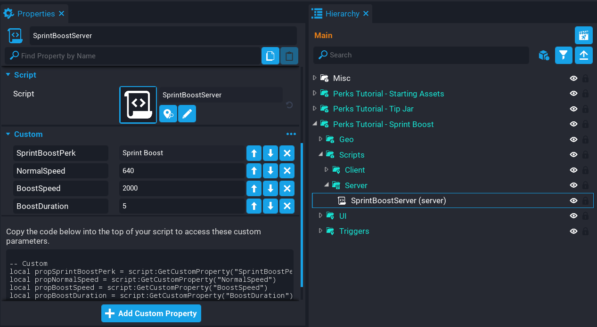{: .center loading="lazy" }

#### Create Sprint Boost Variables

Open the **SprintBoostServer** script.

The `players` variable holds an empty table for now. When a player joins the game, they will be added to this table so you can keep track if they have a speed boost or not.

```lua
local NORMAL_SPEED = script:GetCustomProperty("NormalSpeed")
local BOOST_SPEED = script:GetCustomProperty("BoostSpeed")
local BOOST_DURATION = script:GetCustomProperty("BoostDuration")
local SPRINT_BOOST_PERK = script:GetCustomProperty("SprintBoostPerk")

local players = {}
```

#### Create PerkChanged Function

The `PerkChanged` function will check if the perk that was purchased by the player, is the sprint boost perk. If it is, then it will apply the speed boost to that player and all other players on the server.

```lua
local function PerkChanged(buyer, perk)
    if perk == SPRINT_BOOST_PERK then
        buyer.maxWalkSpeed = BOOST_SPEED

        if players[buyer.id].hasBoost then
            players[buyer.id].endTime = players[buyer.id].endTime + BOOST_DURATION
        else
            players[buyer.id].hasBoost = true
            players[buyer.id].endTime = time() + BOOST_DURATION
        end

        for i, player in ipairs(Game.GetPlayers()) do
            if players[player.id] ~= nil and player.id ~= buyer.id then
                player.maxWalkSpeed = BOOST_SPEED
                players[player.id].hasBoost = true
                players[player.id].endTime = time() + BOOST_DURATION
            end
        end
    end
end
```

If a player purchases the speed boost perk again while an existing speed boost is active, then the time of the speed boost is extended, instead of it being just the `BOOST_DURATION`. This only applies to the player who purchases the perk.

```lua
if players[buyer.id].hasBoost then
    players[buyer.id].endTime = players[buyer.id].endTime + BOOST_DURATION
else
    players[buyer.id].hasBoost = true
    players[buyer.id].endTime = time() + BOOST_DURATION
end
```

When a player purchases the speed boost perk, a loop is done over all players in the game, and any player that is not the player who purchased the perk, will receive the speed boost.

If the perk is purchased again while other players still have a speed boost, then their end time will only be the `BOOST_DURATION`, and will not be extended. This gives the player who purchased the perk a slight benefit.

```lua
for i, player in ipairs(Game.GetPlayers()) do
    if players[player.id] ~= nil and player.id ~= buyer.id then
        player.maxWalkSpeed = BOOST_SPEED
        players[player.id].hasBoost = true
        players[player.id].endTime = time() + BOOST_DURATION
    end
end
```

#### Create OnJoined Function

The `OnJoined` function will add the player who joined to the `players` table to keep track if they have a boost or not. At the same time, the `perkChangedEvent` is connected so that when that player purchases a perk, the `PerkChanged` function will be called.

```lua
local function OnJoined(player)
    players[player.id] = {

        hasBoost = false,
        endTime = 0
    }

    player.perkChangedEvent:Connect(PerkChanged)
end
```

The `OnLeft` function will remove the player from the `players` table. Setting the value to `nil` will remove that entry from the table.

```lua
local function OnLeft(player)
    if players[player.id] ~= nil then
        players[player.id] = nil
    end
end
```

#### Create Tick Function

Create the `Tick` function at the end of the script. The `Tick` function will loop over all players in the game to check if the `endTime` is less that the current up time of the server (`time()`). If the `endTime` is lower than `time()`, then the player's `maxWalkSpeed` is reset back to the `NORMAL_SPEED`.

The `Tick` function will run every frame, though in this case you don't need it to run every frame, so it can be slowed down using `Task.Wait(1)`. This means that it will wait 1 second until the next frame.

```lua
function Tick()
    for i, player in ipairs(Game.GetPlayers()) do
        if players[player.id] ~= nil and players[player.id].hasBoost and players[player.id].endTime < time() then
            player.maxWalkSpeed = NORMAL_SPEED
            players[player.id].hasBoost = false
        end
    end

    Task.Wait(1)
end
```

#### Connect Events

Connect up the events at the end of the script. These events will fire when the player joins and leaves the game.

```lua
Game.playerJoinedEvent:Connect(OnJoined)
Game.playerLeftEvent:Connect(OnLeft)
```

#### The SprintBoostServer Script

??? "SprintBoostServer"
    ```lua
    local NORMAL_SPEED = script:GetCustomProperty("NormalSpeed")
    local BOOST_SPEED = script:GetCustomProperty("BoostSpeed")
    local BOOST_DURATION = script:GetCustomProperty("BoostDuration")
    local SPRINT_BOOST_PERK = script:GetCustomProperty("SprintBoostPerk")

    local players = {}

    local function PerkChanged(buyer, perk)
        if perk == SPRINT_BOOST_PERK then
            buyer.maxWalkSpeed = BOOST_SPEED

            if players[buyer.id].hasBoost then
                players[buyer.id].endTime = players[buyer.id].endTime + BOOST_DURATION
            else
                players[buyer.id].hasBoost = true
                players[buyer.id].endTime = time() + BOOST_DURATION
            end

            for i, player in ipairs(Game.GetPlayers()) do
                if players[player.id] ~= nil and player.id ~= buyer.id then
                    player.maxWalkSpeed = BOOST_SPEED
                    players[player.id].hasBoost = true
                    players[player.id].endTime = time() + BOOST_DURATION
                end
            end
        end
    end

    local function OnJoined(player)
        players[player.id] = {

            hasBoost = false,
            endTime = 0
        }

        player.perkChangedEvent:Connect(PerkChanged)
    end

    local function OnLeft(player)
        if players[player.id] ~= nil then
            players[player.id] = nil
        end
    end

    function Tick()
        for i, player in ipairs(Game.GetPlayers()) do
            if players[player.id] ~= nil and players[player.id].hasBoost and players[player.id].endTime < time() then
                player.maxWalkSpeed = NORMAL_SPEED
                players[player.id].hasBoost = false
            end
        end

        Task.Wait(1)
    end

    Game.playerJoinedEvent:Connect(OnJoined)
    Game.playerLeftEvent:Connect(OnLeft)
    ```

### Test the Game

Test the game and make sure the following work:

- Sprint boost is applied when purchasing the perk.
- Sprint boost is applied other players.
- Sprint boost extends the duration just for the player who purchased the perk.
- Sprint boost expires and sprint speed is returned to normal.

<div class="mt-video" style="width:100%">
    <video autoplay muted playsinline controls loop class="center" style="width:100%">
        <source src="/img/PerksTutorial/sprint_boost_complete.mp4" type="video/mp4" />
    </video>
</div>

## Creating a VIP Shop

In this section you will be creating a VIP (Very Important Player) shop that will have perk packages players can purchase that will last for a limited amount of time. Each package will give the player a special chat status, gems, and coins.

<div class="mt-video" style="width:100%">
    <video autoplay muted playsinline controls loop class="center" style="width:100%">
        <source src="/img/PerksTutorial/vip_shop_preview.mp4" type="video/mp4" />
    </video>
</div>

### Add VIP Shop Template to Hierarchy

1. Click the **Project Content** tab.
2. Click **My Templates** under **All Content**.
3. Add the template **Perks Tutorial - VIP Shop** into the **Hierarchy**.
4. Deinstance the **Perks Tutorial - VIP Shop** template in the **Hierarchy**.

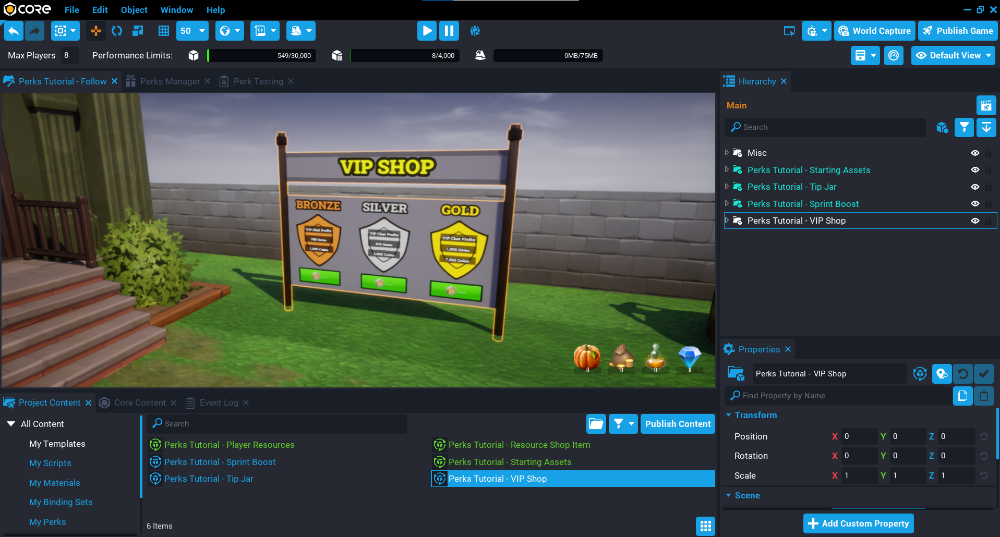{: .center loading="lazy" }

### Create VIP Shop Trigger

A trigger will need to be added so you can detect when the player has entered the trigger volume so the interaction label is visible for the player for them to open the VIP shop UI.

- Create a **Trigger**, and place it inside the **Triggers** group in the **Hierarchy**.
- Rename the trigger to **VIP Shop Trigger**.

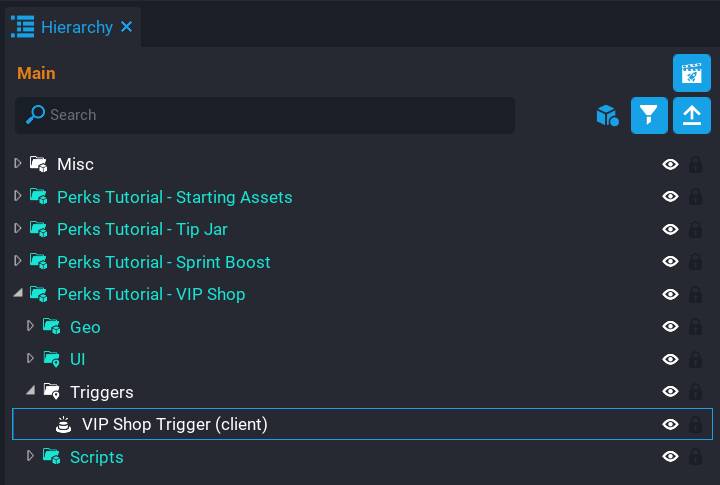{: .center loading="lazy" }

#### Force Collision On

Because the trigger is in a client context, you need to force collision on, otherwise you will not be able to detect when a player has entered the trigger volume.

Click on the **VIP Shop Trigger**, and set the **Game Collision** property to **Force On** in the **Properties** window. In doing so, the gizmo for the trigger volume will now show up in the scene view.

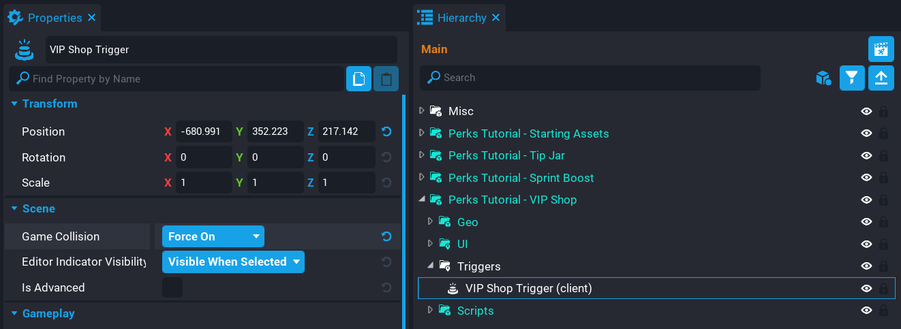{: .center loading="lazy" }

#### Position and Resize Trigger

The **VIP Shop Trigger** needs to be moved into the correct position, and resized to make sure the player can enter the **VIP Shop Trigger** volume.

!!! tip "Press ++V++ to turn on gizmo visibility to view the bounding volume of the **VIP Shop Trigger**."

Move the **VIP Shop Trigger** in front of the base of the **Geo** objects, and resize it.

<div class="mt-video" style="width:100%">
    <video autoplay muted playsinline controls loop class="center" style="width:100%">
        <source src="/img/PerksTutorial/vip_shop_resize_position_trigger.mp4" type="video/mp4" />
    </video>
</div>

#### Set Trigger Label

When the **VIP Shop Trigger** has the `interactable` property set to true, the label of the **VIP Shop Trigger** will be shown to the player when they enter the **VIP Shop Trigger** volume.

Set the **Interaction Label** property for the **VIP Shop Trigger** to `Purchase VIP` in the **Properties** panel.

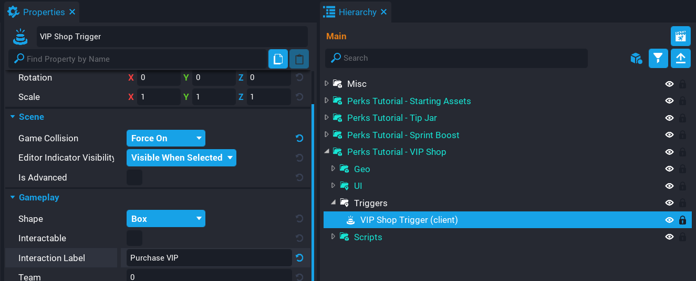{: .center loading="lazy" }

### Create Perks

Create 3 limit time perks.

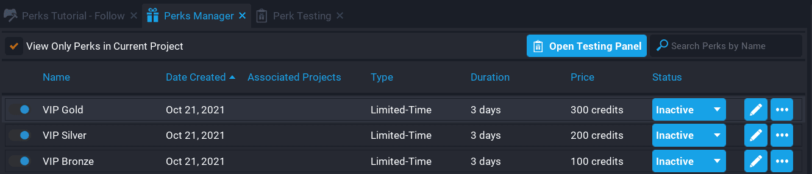{: .center loading="lazy" }

### Set UI Perk References

The VIP shop template comes with some UI already set up. There are 2 UI containers for the VIP shop.

- 2D UI that can be opened by the player.
- World UI that is displayed in world to view by the player.

Both UI containers have their own set of perk buttons that need to have the **Perk Reference** property set.

#### Set 2D UI Perk References

In the **UI** group, set the **Perk Reference** property in the **Properties** window for each VIP perk found in the **Items** group.

Do this for Bronze, Silver, and Gold, by opening the group in the **Hierarchy** and finding **UI Perk Purchase Button**.

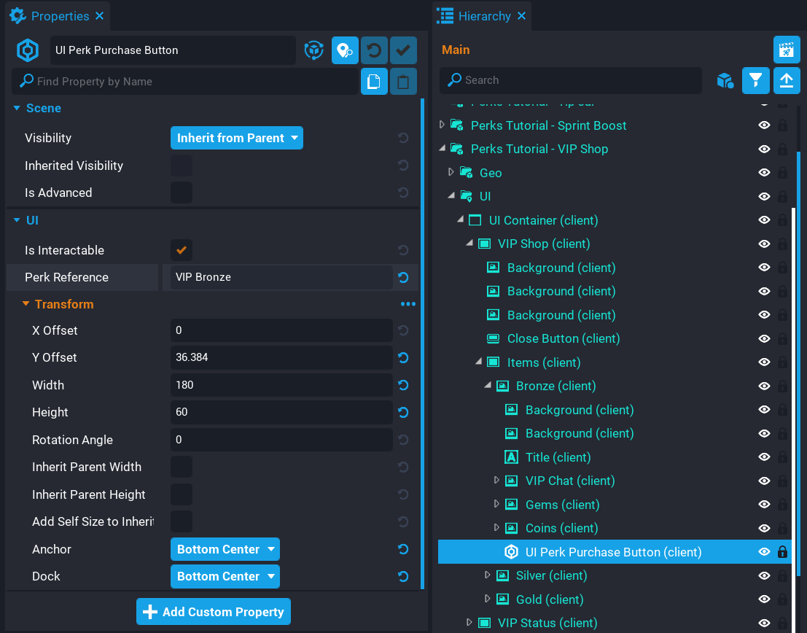{: .center loading="lazy" }

#### Set World UI Perk References

The **World UI** also has perk buttons that need the **Perk Reference** set for each one.

In the **World UI** group, set the **Perk Reference** property in the **Properties** window for each VIP perk.

Do this for Bronze, Silver, and Gold, by opening the group in the **Hierarchy** and finding **UI Perk Purchase Button**.

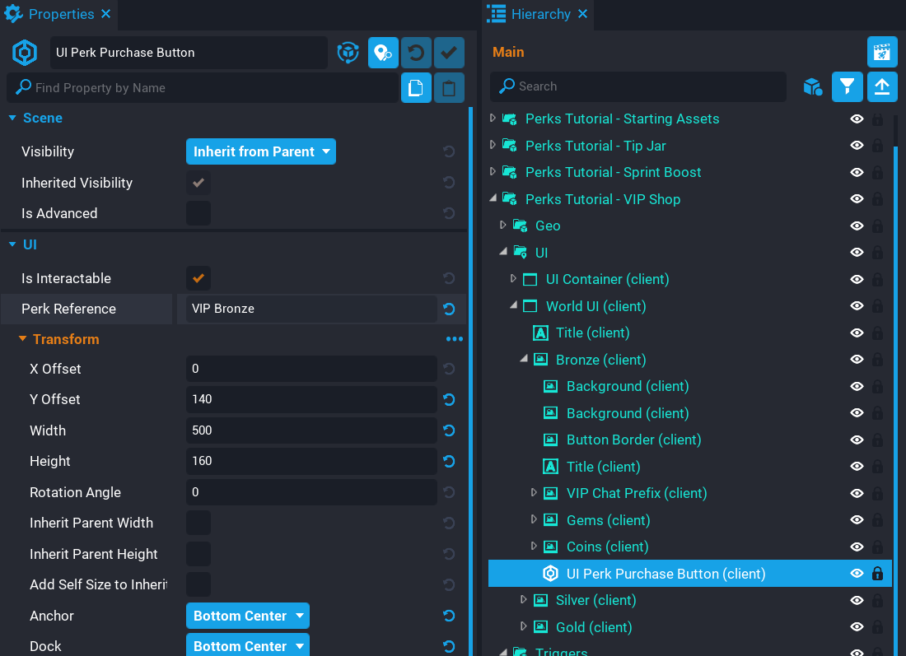{: .center loading="lazy" }

### Create VIPShopClient Script

Create a new script called `VIPShopClient`, and place it into the **Client** group, in the **Scripts** group. The **VIPShopClient** script will be responsible for opening and closing the UI, and displaying the VIP status to the player.

- Add the **VIP Shop** panel as a custom property. Rename the property `VIPShopUI`.
- Add the **VIP Shop Trigger** as a custom property. Rename the property `VIPShopTrigger`.
- Add the **Close Button** as a custom property. Rename the property `VIPShopButton`.

In the **VIP Status** panel, add each VIP status as a custom property. The VIP status will be shown in the UI to the player to indicate the current package (and highest) the player currently has.

- Add the **VIP Bronze Status** as a custom property. Rename the property `VIPBronzeStatus`.
- Add the **VIP Silver Status** as a custom property. Rename the property `VIPSilverStatus`.
- Add the **VIP Gold Status** as a custom property. Rename the property `VIPGoldStatus`.

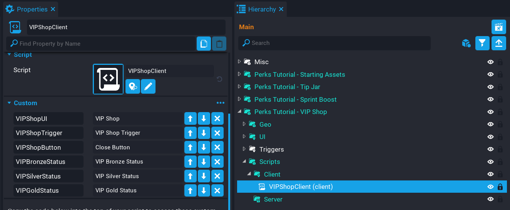{: .center loading="lazy" }

#### Create VIP Shop Variables

Open the **VIPShopClient** script.

Create the variables so you have a reference to the various UI components, and the status UI.

```lua
local VIP_SHOP_UI = script:GetCustomProperty("VIPShopUI"):WaitForObject()
local VIP_SHOP_TRIGGER = script:GetCustomProperty("VIPShopTrigger"):WaitForObject()
local VIP_SHOP_BUTTON = script:GetCustomProperty("VIPShopButton"):WaitForObject()

local VIP_BRONZE_STATUS = script:GetCustomProperty("VIPBronzeStatus"):WaitForObject()
local VIP_SILVER_STATUS = script:GetCustomProperty("VIPSilverStatus"):WaitForObject()
local VIP_GOLD_STATUS = script:GetCustomProperty("VIPGoldStatus"):WaitForObject()

local vipStatuses = { VIP_BRONZE_STATUS, VIP_SILVER_STATUS, VIP_GOLD_STATUS }
local localPlayer = Game.GetLocalPlayer()
local inTrigger = false
```

Each VIP status is added to the `vipStatuses` table to make it easier show or hide in the UI the highest status the player has purchased.

```lua
local vipStatuses = { VIP_BRONZE_STATUS, VIP_SILVER_STATUS, VIP_GOLD_STATUS }
```

#### Create CloseUI Function

The `CloseUI` function will be called when the `clickedEvent` for `VIP_SHOP_BUTTON` is fired, and when the player leaves the `VIP_SHOP_TRIGGER` volume.

```lua
local function CloseUI()
    VIP_SHOP_UI.visibility = Visibility.FORCE_OFF

    if inTrigger then
        VIP_SHOP_TRIGGER.isInteractable = true
    else
        VIP_SHOP_TRIGGER.isInteractable = false
    end

    UI.SetCursorVisible(false)
    UI.SetCanCursorInteractWithUI(false)
end
```

#### Create OnInteracted Function

The `OnInteracted` function will be called when the player interacts with the `VIP_SHOP_TRIGGER`.

```lua
local function OnInteracted(trigger, obj)
    if inTrigger and Object.IsValid(obj) and obj:IsA("Player") and obj == localPlayer then
        VIP_SHOP_UI.visibility = Visibility.FORCE_ON
        VIP_SHOP_TRIGGER.isInteractable = false

        UI.SetCursorVisible(true)
        UI.SetCanCursorInteractWithUI(true)
    end
end
```

#### Create OnExitTrigger Function

The `OnExitTrigger` function will check if the local player has exited the `VIP_SHOP_TRIGGER` volume, and close the VIP shop UI.

```lua
local function OnExitTrigger(trigger, obj)
    if Object.IsValid(obj) and obj:IsA("Player") and obj == localPlayer then
        inTrigger = false
        CloseUI()
    end
end
```

#### Create OnEnterTrigger Function

The `OnEnterTrigger` function will check when the local player has entered the `VIP_SHOP_TRIGGER` volume and turn on interaction so the label will show up for the player.

```lua
local function OnEnterTrigger(trigger, obj)
    if Object.IsValid(obj) and obj:IsA("Player") and obj == localPlayer then
        VIP_SHOP_TRIGGER.isInteractable = true
        inTrigger = true
    end
end
```

#### Create ShowVIPStatus Function

The `ShowVIPStatus` function is a helper function to try and reduce writing duplicate code for turn on and off each VIP status visibility.

When a VIP status needs to be shown, all other VIP statuses need to have their visibility turn off. You can loop over the `vipStatuses` array, and compare the `statusToShow` value for each iteration. If there is a match, then that status is shown in the UI to the player.

```lua
local function ShowVIPStatus(statusToShow)
    for index, status in ipairs(vipStatuses) do
        if status == statusToShow then
            status.visibility = Visibility.FORCE_ON
        else
            status.visibility = Visibility.FORCE_OFF
        end
    end
end
```

#### Create UpdateStatus Function

The `UpdateStatus` function will be called when the player's resource gets updated. It will check to see if the resource is either of the VIP statuses, and if the value if the status is `1`, then the highest status purchased by the player is shown in the UI by calling `ShowVIPStatus`.

```lua
local function UpdateStatus(player, resource, amount)
    if resource == "bronzevip" or resource == "silvervip" or resource == "goldvip" then
        local bronzeStatus = localPlayer:GetResource("bronzevip")
        local silverStatus = localPlayer:GetResource("silvervip")
        local goldStatus = localPlayer:GetResource("goldvip")

        if goldStatus == 1 then
            ShowVIPStatus(VIP_GOLD_STATUS)
        elseif silverStatus == 1 then
            ShowVIPStatus(VIP_SILVER_STATUS)
        elseif bronzeStatus == 1 then
            ShowVIPStatus(VIP_BRONZE_STATUS)
        end
    end
end
```

#### Connect Events

Connect the `CloseUI` function to the `clickedEvent` for the `VIP_SHOP_BUTTON`. When the `VIP_SHOP_BUTTON` is clicked by the player, it will close the UI.

```lua
VIP_SHOP_BUTTON.clickedEvent:Connect(CloseUI)
```

Connect the `OnInteracted` function to the `interactedEvent` for the `VIP_SHOP_TRIGGER`. When trigger is interacted with, it will show or hide the UI for the player.

```lua
VIP_SHOP_TRIGGER.interactedEvent:Connect(OnInteracted)
```

Connect the `OnExitTrigger` function to the `endOverlapEvent` for the `VIP_SHOP_TRIGGER`. When the player exits the trigger volume, it will automatically close the UI for the player.

```lua
VIP_SHOP_TRIGGER.endOverlapEvent:Connect(OnExitTrigger)
```

Connect the `OnEnterTrigger` function to the `beginOverlapEvent` for the `VIP_SHOP_TRIGGER`. When the player enters the trigger volume, it will enable the interaction label for the player, so they can open the UI.

```lua
VIP_SHOP_TRIGGER.beginOverlapEvent:Connect(OnEnterTrigger)
```

#### Connect resourceChangedEvent

This code will loop over all the local player's resources. The reason for this, is that when the resources get set on the server when the player joins the game, the `resourceChangeEvent` for the client may not be connected yet.

```lua
localPlayer.resourceChangedEvent:Connect(UpdateStatus)

for key, value in pairs(localPlayer:GetResources()) do
    UpdateStatus(localPlayer, key, value)
end
```

#### The VIPShopClient Script

??? "VIPShopClient"
    ```lua
    local VIP_SHOP_UI = script:GetCustomProperty("VIPShopUI"):WaitForObject()
    local VIP_SHOP_TRIGGER = script:GetCustomProperty("VIPShopTrigger"):WaitForObject()
    local VIP_SHOP_BUTTON = script:GetCustomProperty("VIPShopButton"):WaitForObject()

    local VIP_BRONZE_STATUS = script:GetCustomProperty("VIPBronzeStatus"):WaitForObject()
    local VIP_SILVER_STATUS = script:GetCustomProperty("VIPSilverStatus"):WaitForObject()
    local VIP_GOLD_STATUS = script:GetCustomProperty("VIPGoldStatus"):WaitForObject()

    local vipStatuses = { VIP_BRONZE_STATUS, VIP_SILVER_STATUS, VIP_GOLD_STATUS }
    local localPlayer = Game.GetLocalPlayer()
    local inTrigger = false

    local function CloseUI()
        VIP_SHOP_UI.visibility = Visibility.FORCE_OFF

        if inTrigger then
            VIP_SHOP_TRIGGER.isInteractable = true
        else
            VIP_SHOP_TRIGGER.isInteractable = false
        end

        UI.SetCursorVisible(false)
        UI.SetCanCursorInteractWithUI(false)
    end

    local function OnInteracted(trigger, obj)
        if inTrigger and Object.IsValid(obj) and obj:IsA("Player") and obj == localPlayer then
            VIP_SHOP_UI.visibility = Visibility.FORCE_ON
            VIP_SHOP_TRIGGER.isInteractable = false

            UI.SetCursorVisible(true)
            UI.SetCanCursorInteractWithUI(true)
        end
    end

    local function OnExitTrigger(trigger, obj)
        if Object.IsValid(obj) and obj:IsA("Player") and obj == localPlayer then
            inTrigger = false
            CloseUI()
        end
    end

    local function OnEnterTrigger(trigger, obj)
        if Object.IsValid(obj) and obj:IsA("Player") and obj == localPlayer then
            VIP_SHOP_TRIGGER.isInteractable = true
            inTrigger = true
        end
    end

    local function ShowVIPStatus(statusToShow)
        for index, status in ipairs(vipStatuses) do
            if status == statusToShow then
                status.visibility = Visibility.FORCE_ON
            else
                status.visibility = Visibility.FORCE_OFF
            end
        end
    end

    local function UpdateStatus(player, resource, amount)
        if resource == "bronzevip" or resource == "silvervip" or resource == "goldvip" then
            local bronzeStatus = localPlayer:GetResource("bronzevip")
            local silverStatus = localPlayer:GetResource("silvervip")
            local goldStatus = localPlayer:GetResource("goldvip")

            if goldStatus == 1 then
                ShowVIPStatus(VIP_GOLD_STATUS)
            elseif silverStatus == 1 then
                ShowVIPStatus(VIP_SILVER_STATUS)
            elseif bronzeStatus == 1 then
                ShowVIPStatus(VIP_BRONZE_STATUS)
            end
        end
    end

    VIP_SHOP_BUTTON.clickedEvent:Connect(CloseUI)

    VIP_SHOP_TRIGGER.interactedEvent:Connect(OnInteracted)
    VIP_SHOP_TRIGGER.endOverlapEvent:Connect(OnExitTrigger)
    VIP_SHOP_TRIGGER.beginOverlapEvent:Connect(OnEnterTrigger)

    localPlayer.resourceChangedEvent:Connect(UpdateStatus)

    for key, value in pairs(localPlayer:GetResources()) do
        UpdateStatus(localPlayer, key, value)
    end
    ```

### Test the Game

Test the game and make sure the following work:

- Trigger interaction label is visible when entering the trigger volume.
- Trigger interaction label is not visible when exiting the trigger volume.
- VIP shop UI opens when pressing ++F++.
- VIP shop UI closes when clicking on the close button.
- VIP shop UI closes when the player leaves the trigger volume.
- VIP shop packages can be purchased.

<div class="mt-video" style="width:100%">
    <video autoplay muted playsinline controls loop class="center" style="width:100%">
        <source src="/img/PerksTutorial/vip_shop_ui_finished.mp4" type="video/mp4" />
    </video>
</div>

### Create VIPShopServer Script

Create a new script called `VIPShopServer`, and place it into the **Server** group, in the **Scripts** group. The **VIPShopServer** script will be responsible for setting the player to VIP, and giving them the coins and resources when they purchase a VIP perk.

- Add the **VIP Bronze** perk as a custom property. Name the property `VIPBronze`.
- Add the **VIP Silver** perk as a custom property. Name the property `VIPSilver`.
- Add the **VIP Gold** perk as a custom property. Name the property `VIPGold`.

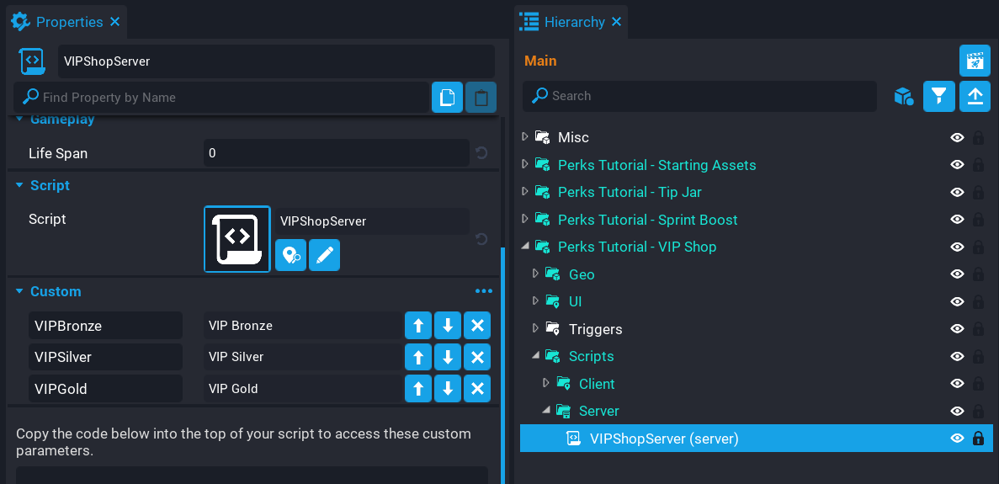{: .center loading="lazy" }

#### Create VIP Perk Variables

Open the **VIPShopServer** script.

Create these variables so you have a reference to each VIP perk.

```lua
local VIP_BRONZE_PERK = script:GetCustomProperty("VIPBronze")
local VIP_SILVER_PERK = script:GetCustomProperty("VIPSilver")
local VIP_GOLD_PERK = script:GetCustomProperty("VIPGold")
```

#### Create PerkChanged Function

The `PerkChanged` function is responsible for checking which perk the player has purchased, awarding the resources, and updating the player's storage.

```lua
local function PerkChanged(buyer, perk)
    local gemsAmount = 0
    local coinsAmount = 0

    if perk == VIP_BRONZE_PERK then
        buyer:SetResource("bronzevip", 1)
        gemsAmount = 250
        coinsAmount = 1000
    elseif perk == VIP_SILVER_PERK then
        buyer:SetResource("silvervip", 1)
        gemsAmount = 500
        coinsAmount = 3000
    elseif perk == VIP_GOLD_PERK  then
        buyer:SetResource("goldvip", 1)
        gemsAmount = 1000
        coinsAmount = 7500
    end

    local playerData = Storage.GetPlayerData(buyer)

    buyer:AddResource("gems", gemsAmount)
    buyer:AddResource("coins", coinsAmount)

    -- g (Gems)
    if not playerData["g"] then
        playerData["g"] = 0
    end

    -- c (Coins)
    if not playerData["c"] then
        playerData["c"] = 0
    end

    playerData["g"] = playerData["g"] + gemsAmount
    playerData["c"] = playerData["c"] + coinsAmount

    Storage.SetPlayerData(buyer, playerData)
end
```

#### Create OnJoined Function

The `OnJoined` function will check to see which VIP perks the player has purchased by using the `HasPerk` function. If the player does own a VIP perk, then the resource will get set. This is used so you can check on the client if the player is a VIP or not so the VIP badge can be displayed to the player.

```lua
local function OnJoined(player)
    player.perkChangedEvent:Connect(PerkChanged)

    if player:HasPerk(VIP_BRONZE_PERK) then
        player:SetResource("bronzevip", 1)
    end

    if player:HasPerk(VIP_SILVER_PERK) then
        player:SetResource("silvervip", 1)
    end

    if player:HasPerk(VIP_GOLD_PERK) then
        player:SetResource("goldvip", 1)
    end
end
```

#### Create OnChatMessage Function

The `OnChatMessage` function will be called anytime a message has been received by a player. It will check if the `speaker` has a perk, and if so, will add the VIP status to the front of their name for everyone else in game to see.

```lua
local function OnChatMessage(speaker, params)
    if speaker:HasPerk(VIP_GOLD_PERK) then
        params.speakerName = "[Gold VIP] " .. params.speakerName
    elseif speaker:HasPerk(VIP_SILVER_PERK) then
        params.speakerName = "[Silver VIP] " .. params.speakerName
    elseif speaker:HasPerk(VIP_BRONZE_PERK) then
        params.speakerName = "[Bronze VIP] " .. params.speakerName
    end
end
```

#### Connect Events

Connect up the events at the end of the script.

```lua
Game.playerJoinedEvent:Connect(OnJoined)
Chat.receiveMessageHook:Connect(OnChatMessage)
```

#### The VIPServer Script

??? "VIPServer"
    ```lua
    local VIP_BRONZE_PERK = script:GetCustomProperty("VIPBronze")
    local VIP_SILVER_PERK = script:GetCustomProperty("VIPSilver")
    local VIP_GOLD_PERK = script:GetCustomProperty("VIPGold")

    local function PerkChanged(buyer, perk)
        local gemsAmount = 0
        local coinsAmount = 0

        if perk == VIP_BRONZE_PERK then
            buyer:SetResource("bronzevip", 1)
            gemsAmount = 250
            coinsAmount = 1000
        elseif perk == VIP_SILVER_PERK then
            buyer:SetResource("silvervip", 1)
            gemsAmount = 500
            coinsAmount = 3000
        elseif perk == VIP_GOLD_PERK  then
            buyer:SetResource("goldvip", 1)
            gemsAmount = 1000
            coinsAmount = 7500
        end

        local playerData = Storage.GetPlayerData(buyer)

        buyer:AddResource("gems", gemsAmount)
        buyer:AddResource("coins", coinsAmount)

        -- g (Gems)
        if not playerData["g"] then
            playerData["g"] = 0
        end

        -- c (Coins)
        if not playerData["c"] then
            playerData["c"] = 0
        end

        playerData["g"] = playerData["g"] + gemsAmount
        playerData["c"] = playerData["c"] + coinsAmount

        Storage.SetPlayerData(buyer, playerData)
    end

    local function OnJoined(player)
        player.perkChangedEvent:Connect(PerkChanged)

        if player:HasPerk(VIP_BRONZE_PERK) then
            player:SetResource("bronzevip", 1)
        end

        if player:HasPerk(VIP_SILVER_PERK) then
            player:SetResource("silvervip", 1)
        end

        if player:HasPerk(VIP_GOLD_PERK) then
            player:SetResource("goldvip", 1)
        end
    end

    local function OnChatMessage(speaker, params)
        if speaker:HasPerk(VIP_GOLD_PERK) then
            params.speakerName = "[Gold VIP] " .. params.speakerName
        elseif speaker:HasPerk(VIP_SILVER_PERK) then
            params.speakerName = "[Silver VIP] " .. params.speakerName
        elseif speaker:HasPerk(VIP_BRONZE_PERK) then
            params.speakerName = "[Bronze VIP] " .. params.speakerName
        end
    end

    Game.playerJoinedEvent:Connect(OnJoined)
    Chat.receiveMessageHook:Connect(OnChatMessage)
    ```

### Test the Game

Test the game and make sure the following work:

- Purchasing a VIP package give gems and coins.
- VIP status is shown in the chat when sending messages.
- VIP badge in the UI is shown.
- Purchasing a lower VIP package doesn't overwrite higher VIP package.

<div class="mt-video" style="width:100%">
    <video autoplay muted playsinline controls loop class="center" style="width:100%">
        <source src="/img/PerksTutorial/vip_shop_complete.mp4" type="video/mp4" />
    </video>
</div>

## Summary

While working through the tutorial, you may have noticed how similar each system was. The way the triggers are setup, the UI, etc. This is good, because then you can take what you have learned, and apply it to another idea for selling perks to players.

## Feedback and Questions

For feedback and questions, join the discussion on this tutorial's [forum thread](https://forums.coregames.com/t/perks-tutorial-creating-sellable-items-and-experiences/2267).

## Learn More

[Perks Program](../references/perks/program.md) | [UI Perk Purchase Button](../api/uiperkpurchasebutton.md) | [UI Perk Purchase Button](../tutorials/persistent_storage_tutorial.md) | [Resource Change Event](../api/player.md#events)
