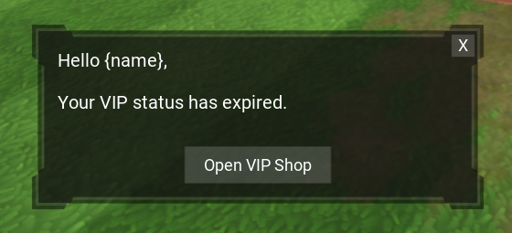
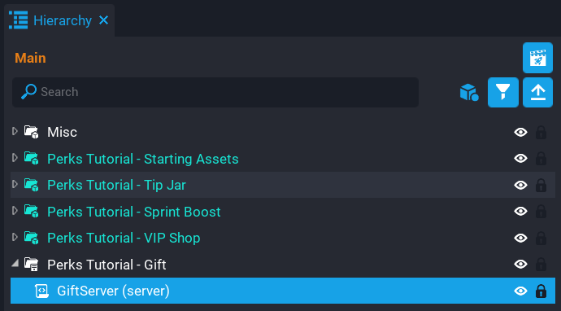

# Perks Part 2

## Overview

In this tutorial, you will be continuing with the project from [Perks](perks_tutorial.md). You will be improving a few of the previous systems, and adding some new features.

For further information about the **Perks Program**, click [here](/references/perks/program.md).

* **Completion Time:** ~1 hour
* **Prerequisite:** Completed [Perk Systems Part 1](perks_tutorial.md)
* **Skills you will learn:**
    * Validating limited time perks.
    * Limited time perk expiration reminder.
    * Gifting resources to players in game.
    * Gifting perks to players in game.
    * Removing gifted perks from players in game.

<div class="mt-video" style="width:100%">
    <video autoplay muted playsinline controls loop class="center" style="width:100%">
        <source src="/img/PerksTutorialPart2/part2_preview.mp4" type="video/mp4" />
    </video>
</div>

---

## Validating Limited Time Perks

If a limited time perk expires while the player is on the server, then the player would still receive the benefits of that limited time perk until they rejoin. For example, if your VIP package included double XP, then the player would continue to receive double XP even though the perk has expired.

A good solution to this problem, is to have a task check if all the players on the server still have the perk. If they don't, then the player is no longer flagged as being a VIP.

### Update VIPShopServer Script

Open the **VIPShopServer** script.

A task will be spawned that will loop through all the players on the server and check if they each have a VIP perk. If they do not have a VIP perk, then the [resource](../api/player.md) for that perk is set to `0`. This will also update on the client side for the player, because the player's resource is being watched for changes.

```lua
local perkCheckTask = Task.Spawn(function()
    for index, player in ipairs(Game.GetPlayers()) do
        if not player:HasPerk(VIP_BRONZE_PERK) then
            player:SetResource("bronzevip", 0)
        end

        if not player:HasPerk(VIP_SILVER_PERK) then
            player:SetResource("silvervip", 0)
        end

        if not player:HasPerk(VIP_GOLD_PERK) then
            player:SetResource("goldvip", 0)
        end
    end
end)

perkCheckTask.repeatCount = -1
perkCheckTask.repeatInterval = (60 * 5)
```

The task doesn't need to run that often. In this case, it will run every 5 minutes.

```lua
perkCheckTask.repeatCount = -1
perkCheckTask.repeatInterval = (60 * 5)
```

### The VIPShopServer Script

??? "VIPShopServer"
    ```lua
    local VIP_BRONZE_PERK = script:GetCustomProperty("VIPBronze")
    local VIP_SILVER_PERK = script:GetCustomProperty("VIPSilver")
    local VIP_GOLD_PERK = script:GetCustomProperty("VIPGold")

    local function PerkChanged(buyer, perk)
        local gemsAmount = 0
        local coinsAmount = 0

        if perk == VIP_BRONZE_PERK then
            buyer:SetResource("bronzevip", 1)
            gemsAmount = 250
            coinsAmount = 1000
        elseif perk == VIP_SILVER_PERK then
            buyer:SetResource("silvervip", 1)
            gemsAmount = 500
            coinsAmount = 3000
        elseif perk == VIP_GOLD_PERK  then
            buyer:SetResource("goldvip", 1)
            gemsAmount = 1000
            coinsAmount = 7500
        end

        local playerData = Storage.GetPlayerData(buyer)

        buyer:AddResource("gems", gemsAmount)
        buyer:AddResource("coins", coinsAmount)

        -- g (Gems)
        if not playerData["g"] then
            playerData["g"] = 0
        end

        -- c (Coins)
        if not playerData["c"] then
            playerData["c"] = 0
        end

        playerData["g"] = playerData["g"] + gemsAmount
        playerData["c"] = playerData["c"] + coinsAmount

        Storage.SetPlayerData(buyer, playerData)
    end

    local function OnJoined(player)
        player.perkChangedEvent:Connect(PerkChanged)

        if player:HasPerk(VIP_BRONZE_PERK) then
            player:SetResource("bronzevip", 1)
        end

        if player:HasPerk(VIP_SILVER_PERK) then
            player:SetResource("silvervip", 1)
        end

        if player:HasPerk(VIP_GOLD_PERK) then
            player:SetResource("goldvip", 1)
        end
    end

    local function OnChatMessage(speaker, params)
        if speaker:HasPerk(VIP_GOLD_PERK) then
            params.speakerName = "[Gold VIP] " .. params.speakerName
        elseif speaker:HasPerk(VIP_SILVER_PERK) then
            params.speakerName = "[Silver VIP] " .. params.speakerName
        elseif speaker:HasPerk(VIP_BRONZE_PERK) then
            params.speakerName = "[Bronze VIP] " .. params.speakerName
        end
    end

    local perkCheckTask = Task.Spawn(function()
        for index, player in ipairs(Game.GetPlayers()) do
            if not player:HasPerk(VIP_BRONZE_PERK) then
                player:SetResource("bronzevip", 0)
            end

            if not player:HasPerk(VIP_SILVER_PERK) then
                player:SetResource("silvervip", 0)
            end

            if not player:HasPerk(VIP_GOLD_PERK) then
                player:SetResource("goldvip", 0)
            end
        end
    end)

    perkCheckTask.repeatCount = -1
    perkCheckTask.repeatInterval = (60 * 5)

    Game.playerJoinedEvent:Connect(OnJoined)
    Chat.receiveMessageHook:Connect(OnChatMessage)
    ```

### Update VIPShopClient Script

Open the **VIPShopClient** script.

Because the status of a VIP can now change, you need to check to see if the status of each VIP resource is set to `1`. If it is not, then the VIP badge in the UI will have the `visibility` property set to `FORCE_OFF`.

```lua
local function UpdateStatus(player, resource, amount)
    if resource == "bronzevip" or resource == "silvervip" or resource == "goldvip" then
        local bronzeStatus = localPlayer:GetResource("bronzevip")
        local silverStatus = localPlayer:GetResource("silvervip")
        local goldStatus = localPlayer:GetResource("goldvip")
        local hasStatus = false

        if goldStatus == 1 then
            ShowVIPStatus(VIP_GOLD_STATUS)
            hasStatus = true
        else
            VIP_GOLD_STATUS.visibility = Visibility.FORCE_OFF
        end

        if not hasStatus and silverStatus == 1 then
            ShowVIPStatus(VIP_SILVER_STATUS)
            hasStatus = true
        else
            VIP_SILVER_STATUS.visibility = Visibility.FORCE_OFF
        end

        if not hasStatus and bronzeStatus == 1 then
            ShowVIPStatus(VIP_BRONZE_STATUS)
            hasStatus = true
        else
            VIP_BRONZE_STATUS.visibility = Visibility.FORCE_OFF
        end
    end
end
```

### The VIPShopClient Script

??? "VIPShopClient"
    ```lua
    local VIP_SHOP_UI = script:GetCustomProperty("VIPShopUI"):WaitForObject()
    local VIP_SHOP_TRIGGER = script:GetCustomProperty("VIPShopTrigger"):WaitForObject()
    local VIP_SHOP_BUTTON = script:GetCustomProperty("VIPShopButton"):WaitForObject()

    local VIP_BRONZE_STATUS = script:GetCustomProperty("VIPBronzeStatus"):WaitForObject()
    local VIP_SILVER_STATUS = script:GetCustomProperty("VIPSilverStatus"):WaitForObject()
    local VIP_GOLD_STATUS = script:GetCustomProperty("VIPGoldStatus"):WaitForObject()

    local vipStatuses = { VIP_BRONZE_STATUS, VIP_SILVER_STATUS, VIP_GOLD_STATUS }
    local localPlayer = Game.GetLocalPlayer()
    local inTrigger = false

    local function CloseUI()
        VIP_SHOP_UI.visibility = Visibility.FORCE_OFF

        if inTrigger then
            VIP_SHOP_TRIGGER.isInteractable = true
        else
            VIP_SHOP_TRIGGER.isInteractable = false
        end

        UI.SetCursorVisible(false)
        UI.SetCanCursorInteractWithUI(false)
    end

    local function OnInteracted(trigger, obj)
        if inTrigger and Object.IsValid(obj) and obj:IsA("Player") and obj == localPlayer then
            VIP_SHOP_UI.visibility = Visibility.FORCE_ON
            VIP_SHOP_TRIGGER.isInteractable = false

            UI.SetCursorVisible(true)
            UI.SetCanCursorInteractWithUI(true)
        end
    end

    local function OnExitTrigger(trigger, obj)
        if Object.IsValid(obj) and obj:IsA("Player") and obj == localPlayer then
            inTrigger = false
            CloseUI()
        end
    end

    local function OnEnterTrigger(trigger, obj)
        if Object.IsValid(obj) and obj:IsA("Player") and obj == localPlayer then
            VIP_SHOP_TRIGGER.isInteractable = true
            inTrigger = true
        end
    end

    local function ShowVIPStatus(statusToShow)
        for index, status in ipairs(vipStatuses) do
            if status == statusToShow then
                status.visibility = Visibility.FORCE_ON
            else
                status.visibility = Visibility.FORCE_OFF
            end
        end
    end

    local function UpdateStatus(player, resource, amount)
        if resource == "bronzevip" or resource == "silvervip" or resource == "goldvip" then
            local bronzeStatus = localPlayer:GetResource("bronzevip")
            local silverStatus = localPlayer:GetResource("silvervip")
            local goldStatus = localPlayer:GetResource("goldvip")
            local hasStatus = false

            if goldStatus == 1 then
                ShowVIPStatus(VIP_GOLD_STATUS)
                hasStatus = true
            else
                VIP_GOLD_STATUS.visibility = Visibility.FORCE_OFF
            end

            if not hasStatus and silverStatus == 1 then
                ShowVIPStatus(VIP_SILVER_STATUS)
                hasStatus = true
            else
                VIP_SILVER_STATUS.visibility = Visibility.FORCE_OFF
            end

            if not hasStatus and bronzeStatus == 1 then
                ShowVIPStatus(VIP_BRONZE_STATUS)
                hasStatus = true
            else
                VIP_BRONZE_STATUS.visibility = Visibility.FORCE_OFF
            end
        end
    end

    VIP_SHOP_BUTTON.clickedEvent:Connect(CloseUI)

    VIP_SHOP_TRIGGER.interactedEvent:Connect(OnInteracted)
    VIP_SHOP_TRIGGER.endOverlapEvent:Connect(OnExitTrigger)
    VIP_SHOP_TRIGGER.beginOverlapEvent:Connect(OnEnterTrigger)

    localPlayer.resourceChangedEvent:Connect(UpdateStatus)

    for key, value in pairs(localPlayer:GetResources()) do
        UpdateStatus(localPlayer, key, value)
    end
    ```

## Test the Game

Testing limited time perks is a little tricky due to the minimum duration being 60 minutes for all limited time perks in the editor. So to do a proper test, a few steps need to be done.

### Enable a VIP Perk

From the **Perk Testing** window, enable the bronze VIP perk for testing.

{: .center loading="lazy" }

### Modify VIPShopServer Function

Modify the spawned task temporarily just while testing. The bronze VIP perk is being used for testing. The task will be delayed by 5 seconds (otherwise it will run as soon as you join), and check if the player owns the bronze VIP perk. If they do own it, then it is flagged as not being owned. This will simulate the limited time perk expiring while the player is on the server.

Play the game, and you will see the bronze VIP badge be hidden after 5 seconds, indicating that the perk has expired.

After the test was successful, revert the task back.

```lua hl_lines="3 15"
local perkCheckTask = Task.Spawn(function()
    for index, player in ipairs(Game.GetPlayers()) do
        if player:HasPerk(VIP_BRONZE_PERK) then
            player:SetResource("bronzevip", 0)
        end

        if not player:HasPerk(VIP_SILVER_PERK) then
            player:SetResource("silvervip", 0)
        end

        if not player:HasPerk(VIP_GOLD_PERK) then
            player:SetResource("goldvip", 0)
        end
    end
end, 5)
```

??? "PerkCheckTask"
    ```lua
    local perkCheckTask = Task.Spawn(function()
        for index, player in ipairs(Game.GetPlayers()) do
            if not player:HasPerk(VIP_BRONZE_PERK) then
                player:SetResource("bronzevip", 0)
            end

            if not player:HasPerk(VIP_SILVER_PERK) then
                player:SetResource("silvervip", 0)
            end

            if not player:HasPerk(VIP_GOLD_PERK) then
                player:SetResource("goldvip", 0)
            end
        end
    end)
    ```

<div class="mt-video" style="width:100%">
    <video autoplay muted playsinline controls loop class="center" style="width:100%">
        <source src="/img/PerksTutorialPart2/testing_limited_time_perk.mp4" type="video/mp4" />
    </video>
</div>

## Creating Perk Reminders

In this section you will implement a system to remind the player that their VIP package has expired. This can be a useful for reminding a player that may have not logged into your game for some time, and the limited time perk they previous purchased has expired. This could help encourage repeat buys of VIP packages.

### Update VIPShopServer Script

The **VIPShopServer** script will need to be updated so you can keep track if a player has purchased a VIP package before. To do this, you will be saving a flag in the player's [Storage](../api/storage.md) that will be updated every time a VIP package is purchased, or when the expired notice is displayed to the player.

#### Update PerkChanged Function

The `hasVIP` variable will get set to `1` if any of the VIP perks are owned by the player. This is then saved in the `playerData` table, which is stored for the player persistently. This will allow you track when to show the reminder to the player.

```lua hl_lines="4 10 15 20 40"
local function PerkChanged(buyer, perk)
    local gemsAmount = 0
    local coinsAmount = 0
    local hasVIP = 0

    if perk == VIP_BRONZE_PERK then
        buyer:SetResource("bronzevip", 1)
        gemsAmount = 250
        coinsAmount = 1000
        hasVIP = 1
    elseif perk == VIP_SILVER_PERK then
        buyer:SetResource("silvervip", 1)
        gemsAmount = 500
        coinsAmount = 3000
        hasVIP = 1
    elseif perk == VIP_GOLD_PERK  then
        buyer:SetResource("goldvip", 1)
        gemsAmount = 1000
        coinsAmount = 7500
        hasVIP = 1
    end

    local playerData = Storage.GetPlayerData(buyer)

    buyer:AddResource("gems", gemsAmount)
    buyer:AddResource("coins", coinsAmount)

    -- g (Gems)
    if not playerData["g"] then
        playerData["g"] = 0
    end

    -- c (Coins)
    if not playerData["c"] then
        playerData["c"] = 0
    end

    playerData["g"] = playerData["g"] + gemsAmount
    playerData["c"] = playerData["c"] + coinsAmount
    playerData["vip"] = hasVIP

    Storage.SetPlayerData(buyer, playerData)
end
```

#### Update OnJoined Function

When a player joins the game, the `OnJoined` function will check to see if the player owns a VIP perk, and if so, set a new [resource](../api/player.md) called `showvipnotice`. This will be watched for in the client script, and if it equals `1`, the reminder UI will be shown to the player. The `vip` property for the players data needs to be updated so they don't get a reminder each time they join the server.

```lua hl_lines="4 5 9 14 19 22-28"
local function OnJoined(player)
    player.perkChangedEvent:Connect(PerkChanged)

    local hasVIP = false
    local playerData = Storage.GetPlayerData(player)

    if player:HasPerk(VIP_BRONZE_PERK) then
        player:SetResource("bronzevip", 1)
        hasVIP = true
    end

    if player:HasPerk(VIP_SILVER_PERK) then
        player:SetResource("silvervip", 1)
        hasVIP = true
    end

    if player:HasPerk(VIP_GOLD_PERK) then
        player:SetResource("goldvip", 1)
        hasVIP = true
    end

    if playerData.vip ~= nil then
        if not hasVIP and playerData.vip == 1 then
            playerData.vip = 0
            player:SetResource("showvipnotice", 1)
            Storage.SetPlayerData(player, playerData)
        end
    end
end
```

#### The VIPShopServer Script

??? "VIPShopServer"
    ```lua
    local VIP_BRONZE_PERK = script:GetCustomProperty("VIPBronze")
    local VIP_SILVER_PERK = script:GetCustomProperty("VIPSilver")
    local VIP_GOLD_PERK = script:GetCustomProperty("VIPGold")

    local function PerkChanged(buyer, perk)
        local gemsAmount = 0
        local coinsAmount = 0
        local hasVIP = 0

        if perk == VIP_BRONZE_PERK then
            buyer:SetResource("bronzevip", 1)
            gemsAmount = 250
            coinsAmount = 1000
            hasVIP = 1
        elseif perk == VIP_SILVER_PERK then
            buyer:SetResource("silvervip", 1)
            gemsAmount = 500
            coinsAmount = 3000
            hasVIP = 1
        elseif perk == VIP_GOLD_PERK  then
            buyer:SetResource("goldvip", 1)
            gemsAmount = 1000
            coinsAmount = 7500
            hasVIP = 1
        end

        local playerData = Storage.GetPlayerData(buyer)

        buyer:AddResource("gems", gemsAmount)
        buyer:AddResource("coins", coinsAmount)

        -- g (Gems)
        if not playerData["g"] then
            playerData["g"] = 0
        end

        -- c (Coins)
        if not playerData["c"] then
            playerData["c"] = 0
        end

        playerData["g"] = playerData["g"] + gemsAmount
        playerData["c"] = playerData["c"] + coinsAmount
        playerData["vip"] = hasVIP

        Storage.SetPlayerData(buyer, playerData)
    end

    local function OnJoined(player)
        player.perkChangedEvent:Connect(PerkChanged)

        local hasVIP = false
        local playerData = Storage.GetPlayerData(player)

        if player:HasPerk(VIP_BRONZE_PERK) then
            player:SetResource("bronzevip", 1)
            hasVIP = true
        end

        if player:HasPerk(VIP_SILVER_PERK) then
            player:SetResource("silvervip", 1)
            hasVIP = true
        end

        if player:HasPerk(VIP_GOLD_PERK) then
            player:SetResource("goldvip", 1)
            hasVIP = true
        end

        if playerData.vip ~= nil then
            if not hasVIP and playerData.vip == 1 then
                playerData.vip = 0
                player:SetResource("showvipnotice", 1)
                Storage.SetPlayerData(player, playerData)
            end
        end
    end

    local function OnChatMessage(speaker, params)
        if speaker:HasPerk(VIP_GOLD_PERK) then
            params.speakerName = "[Gold VIP] " .. params.speakerName
        elseif speaker:HasPerk(VIP_SILVER_PERK) then
            params.speakerName = "[Silver VIP] " .. params.speakerName
        elseif speaker:HasPerk(VIP_BRONZE_PERK) then
            params.speakerName = "[Bronze VIP] " .. params.speakerName
        end
    end

    local perkCheckTask = Task.Spawn(function()
        for index, player in ipairs(Game.GetPlayers()) do
            if not player:HasPerk(VIP_BRONZE_PERK) then
                player:SetResource("bronzevip", 0)
            end

            if not player:HasPerk(VIP_SILVER_PERK) then
                player:SetResource("silvervip", 0)
            end

            if not player:HasPerk(VIP_GOLD_PERK) then
                player:SetResource("goldvip", 0)
            end
        end
    end)

    perkCheckTask.repeatCount = -1
    perkCheckTask.repeatInterval = (60 * 5)

    Game.playerJoinedEvent:Connect(OnJoined)
    Chat.receiveMessageHook:Connect(OnChatMessage)
    ```

### Update VIPShopClient Script

The **VIPShopClient** script will be updated to show the reminder to the player. To do this, you will need to create a few custom properties so the **VIPShopClient** script has a reference to a few things.

In the **UI Container** for the **VIP Shop** in the **Hierarchy**, there is a **VIP Reminder** panel.

- Add the **VIP Reminder** panel as a custom property. Name the property `VIPReminderUI`.
- Add the **VIP Shop Button** object as a custom property. Name the property `OpenVIPShopButton`.
- Add the **Close Button** object as a custom property. Name the property `CloseReminderUIButton`.

When the the reminder UI is shown, it will also include the button to the VIP Shop for quick access for the player.

{: .center loading="lazy" }

#### Create UI Reminder Variables

Create these variables so you have a reference to the various UI components for the reminder UI.

```lua
local VIP_REMINDER_UI = script:GetCustomProperty("VIPReminderUI"):WaitForObject()
local OPEN_VIP_SHOP_BUTTON = script:GetCustomProperty("OpenVIPShopButton"):WaitForObject()
local CLOSE_REMINDER_UI_BUTTON = script:GetCustomProperty("CloseReminderUIButton"):WaitForObject()
```

#### Set Player Name in UI

The reminder message contains a replacement string that can be replaced with the players name.

{: .center loading="lazy" }

The text `{name}` will be replaced with the `localPlayer.name`.

```lua
local reminderText = VIP_REMINDER_UI:FindChildByName("Notice")

reminderText.text = reminderText.text:gsub("%{name%}", localPlayer.name)
```

#### Update UpdateStatus Function

The `UpdateStatus` function is the listener being called when a [resource](../api/player.md) has changed for the player. By adding a check for the resource `showvipnotice`, you can turn on the reminder UI.

```lua hl_lines="28-32"
local function UpdateStatus(player, resource, amount)
    if resource == "bronzevip" or resource == "silvervip" or resource == "goldvip" then
        local bronzeStatus = localPlayer:GetResource("bronzevip")
        local silverStatus = localPlayer:GetResource("silvervip")
        local goldStatus = localPlayer:GetResource("goldvip")
        local hasStatus = false

        if goldStatus == 1 then
            ShowVIPStatus(VIP_GOLD_STATUS)
            hasStatus = true
        else
            VIP_GOLD_STATUS.visibility = Visibility.FORCE_OFF
        end

        if not hasStatus and silverStatus == 1 then
            ShowVIPStatus(VIP_SILVER_STATUS)
            hasStatus = true
        else
            VIP_SILVER_STATUS.visibility = Visibility.FORCE_OFF
        end

        if not hasStatus and bronzeStatus == 1 then
            ShowVIPStatus(VIP_BRONZE_STATUS)
            hasStatus = true
        else
            VIP_BRONZE_STATUS.visibility = Visibility.FORCE_OFF
        end
    elseif resource == "showvipnotice" then
        VIP_REMINDER_UI.visibility = Visibility.FORCE_ON
        UI.SetCursorVisible(true)
        UI.SetCanCursorInteractWithUI(true)
    end
end
```

#### Create CloseReminder Function

The `CloseReminder` function will close the reminder UI when the player clicks the close button, or VIP shop button.

```lua
local function CloseReminder()
    VIP_REMINDER_UI.visibility = Visibility.FORCE_OFF
    UI.SetCursorVisible(false)
    UI.SetCanCursorInteractWithUI(false)
end
```

#### Create OpenVIPShop Function

The `OpenVIPShop` function will be called when the player clicks on the VIP shop button in the reminder UI.

```lua
local function OpenVIPShop()
    VIP_REMINDER_UI.visibility = Visibility.FORCE_OFF
    VIP_SHOP_UI.visibility = Visibility.FORCE_ON
    VIP_SHOP_TRIGGER.isInteractable = false
end
```

#### Connect Events

Connect the `CloseReminder` function to the `clickedEvent` for the `CLOSE_REMINDER_UI_BUTTON`. When the `CLOSE_REMINDER_UI_BUTTON` is clicked by the player, it will close the UI.

```lua
CLOSE_REMINDER_UI_BUTTON.clickedEvent:Connect(CloseReminder)
```

Connect the `OpenVIPShop` function to the `clickedEvent` for the `OPEN_VIP_SHOP_BUTTON`. When the `OPEN_VIP_SHOP_BUTTON` is clicked by the player, it will open the VIP shop UI. This gives the player a shortcut to the VIP Shop to make a purchase.

```lua
OPEN_VIP_SHOP_BUTTON.clickedEvent:Connect(OpenVIPShop)
```

#### The VIPShopClient Script

??? "VIPShopClient"
    ```lua
    local VIP_SHOP_UI = script:GetCustomProperty("VIPShopUI"):WaitForObject()
    local VIP_SHOP_TRIGGER = script:GetCustomProperty("VIPShopTrigger"):WaitForObject()
    local VIP_SHOP_BUTTON = script:GetCustomProperty("VIPShopButton"):WaitForObject()

    local VIP_BRONZE_STATUS = script:GetCustomProperty("VIPBronzeStatus"):WaitForObject()
    local VIP_SILVER_STATUS = script:GetCustomProperty("VIPSilverStatus"):WaitForObject()
    local VIP_GOLD_STATUS = script:GetCustomProperty("VIPGoldStatus"):WaitForObject()

    local VIP_REMINDER_UI = script:GetCustomProperty("VIPReminderUI"):WaitForObject()
    local OPEN_VIP_SHOP_BUTTON = script:GetCustomProperty("OpenVIPShopButton"):WaitForObject()
    local CLOSE_REMINDER_UI_BUTTON = script:GetCustomProperty("CloseReminderUIButton"):WaitForObject()

    local vipStatuses = { VIP_BRONZE_STATUS, VIP_SILVER_STATUS, VIP_GOLD_STATUS }
    local localPlayer = Game.GetLocalPlayer()
    local inTrigger = false

    local reminderText = VIP_REMINDER_UI:FindChildByName("Notice")

    reminderText.text = reminderText.text:gsub("%{name%}", localPlayer.name)

    local function CloseUI()
        VIP_SHOP_UI.visibility = Visibility.FORCE_OFF

        if inTrigger then
            VIP_SHOP_TRIGGER.isInteractable = true
        else
            VIP_SHOP_TRIGGER.isInteractable = false
        end

        UI.SetCursorVisible(false)
        UI.SetCanCursorInteractWithUI(false)
    end

    local function OnInteracted(trigger, obj)
        if inTrigger and Object.IsValid(obj) and obj:IsA("Player") and obj == localPlayer then
            VIP_SHOP_UI.visibility = Visibility.FORCE_ON
            VIP_SHOP_TRIGGER.isInteractable = false

            UI.SetCursorVisible(true)
            UI.SetCanCursorInteractWithUI(true)
        end
    end

    local function OnExitTrigger(trigger, obj)
        if Object.IsValid(obj) and obj:IsA("Player") and obj == localPlayer then
            inTrigger = false
            CloseUI()
        end
    end

    local function OnEnterTrigger(trigger, obj)
        if Object.IsValid(obj) and obj:IsA("Player") and obj == localPlayer then
            VIP_SHOP_TRIGGER.isInteractable = true
            inTrigger = true
        end
    end

    local function ShowVIPStatus(statusToShow)
        for index, status in ipairs(vipStatuses) do
            if status == statusToShow then
                status.visibility = Visibility.FORCE_ON
            else
                status.visibility = Visibility.FORCE_OFF
            end
        end
    end

    local function UpdateStatus(player, resource, amount)
        if resource == "bronzevip" or resource == "silvervip" or resource == "goldvip" then
            local bronzeStatus = localPlayer:GetResource("bronzevip")
            local silverStatus = localPlayer:GetResource("silvervip")
            local goldStatus = localPlayer:GetResource("goldvip")
            local hasStatus = false

            if goldStatus == 1 then
                ShowVIPStatus(VIP_GOLD_STATUS)
                hasStatus = true
            else
                VIP_GOLD_STATUS.visibility = Visibility.FORCE_OFF
            end

            if not hasStatus and silverStatus == 1 then
                ShowVIPStatus(VIP_SILVER_STATUS)
                hasStatus = true
            else
                VIP_SILVER_STATUS.visibility = Visibility.FORCE_OFF
            end

            if not hasStatus and bronzeStatus == 1 then
                ShowVIPStatus(VIP_BRONZE_STATUS)
                hasStatus = true
            else
                VIP_BRONZE_STATUS.visibility = Visibility.FORCE_OFF
            end
        elseif resource == "showvipnotice" then
            VIP_REMINDER_UI.visibility = Visibility.FORCE_ON
            UI.SetCursorVisible(true)
            UI.SetCanCursorInteractWithUI(true)
        end
    end

    local function CloseReminder()
        VIP_REMINDER_UI.visibility = Visibility.FORCE_OFF
        UI.SetCursorVisible(false)
        UI.SetCanCursorInteractWithUI(false)
    end

    local function OpenVIPShop()
        VIP_REMINDER_UI.visibility = Visibility.FORCE_OFF
        VIP_SHOP_UI.visibility = Visibility.FORCE_ON
        VIP_SHOP_TRIGGER.isInteractable = false
    end

    CLOSE_REMINDER_UI_BUTTON.clickedEvent:Connect(CloseReminder)
    OPEN_VIP_SHOP_BUTTON.clickedEvent:Connect(OpenVIPShop)

    VIP_SHOP_BUTTON.clickedEvent:Connect(CloseUI)

    VIP_SHOP_TRIGGER.interactedEvent:Connect(OnInteracted)
    VIP_SHOP_TRIGGER.endOverlapEvent:Connect(OnExitTrigger)
    VIP_SHOP_TRIGGER.beginOverlapEvent:Connect(OnEnterTrigger)

    localPlayer.resourceChangedEvent:Connect(UpdateStatus)

    for key, value in pairs(localPlayer:GetResources()) do
        UpdateStatus(localPlayer, key, value)
    end
    ```

### Test the Game

Test the game and make sure the reminder UI shows after the VIP perk has expired. Use the **Perk Testing** window to manually expire any VIP perks.

- Purchase a VIP Perk.
- Disable VIP perk from the **Perk Testing** window.
- Reminder UI will show to the player.
- Exit and enter preview to make sure the reminder UI isn't shown again.

<div class="mt-video" style="width:100%">
    <video autoplay muted playsinline controls loop class="center" style="width:100%">
        <source src="/img/PerksTutorialPart2/reminder_test.mp4" type="video/mp4" />
    </video>
</div>

## Gifting Perks to Players

In this section you will be creating a perk gifting system that allows you to gift a perk to a player in game. For example, if you are holding a competition in your game, you may want to reward the top 3 players with a VIP package.

The gifting system will be done using the chat. You will enter specific commands that will be parsed on the server to make sure the person sending the command has permission.

<div class="mt-video" style="width:100%">
    <video autoplay muted playsinline controls loop class="center" style="width:100%">
        <source src="/img/PerksTutorialPart2/gifting_preview.mp4" type="video/mp4" />
    </video>
</div>

### Create GiftServer Script

Create a new script called `GiftServer`, and place it into a new **Server Context** group called `Perks Tutorial - Gift`.

{: .center loading="lazy" }

#### Create CommandParser Custom Property

The perk tutorial asset that was imported from **Community Content**, comes with a small command parsing library that will help you create the commands. To use this library, you need to add a property so the **GiftServer** script has a reference to the library so you can use the functions.

Add the **CommandParser** script from **Project Content** as a custom property.

{: .center loading="lazy" }

#### Require the CommandParser Library

With the custom property added for the Command Parser, you can now require the script so that the library is included and all of the exposed functions from the **CommandParser** script can be used.

The **CommandParser** library will do the heavy lifting by doing the following for you:

- Watch for any chat messages received.
- Check the player issuing the command has permission.
- Validate commands, including sub commands.
- Deliver a success or error message to the player who issued the command.
- Deliver a message to the player who successfully received the item (i.e. VIP Perk).

Add the require line to the top of the **GiftServer** script.

```lua
local CommandParser = require(script:GetCustomProperty("CommandParser"))
```

#### Set Admins

When a player sends a command in the chat, the Command Parser will validate if the player has permission to execute any the command. The Command Parser has a function called `SetAdmins`, which requires a string of player names, separated by a comma.

Add your name to the string. `Bot1` is added so that you can test commands in local multiplayer with the `Bot1` player.

!!! warning "Only add player names that you trust. Before publishing your game, `Bot1` should be removed."

```lua
CommandParser.SetAdmins("CommanderFoo,Bot1")
```

### Create Give Resource Command

You will be creating a `give` command that will have a sub command called `resource`. This will allow you to give resource perks to players. Before you create the command, you need to specify some command data so that when the command is parsed, it knows what to give to the player.

#### Add Pumpkin Command Data

The Command Parser library has an `AddCommandData` function that can be used to register data for the perk or resource.

Add the following code to the script. Notice that the `resourceKey` and `storageKey` match the values used in the VIP Resource Shop system. This will reuse those existing player resources without you needing to add extra code.

The `name` property will contain the name of the perk or resource that will be displayed to the player in the chat when they receive the gift.

```lua
CommandParser.AddCommandData("pumpkins", {

    name = "Pumpkins",
    resourceKey = "pumpkins",
    resourceAmount = 5,
    storageKey = "p"

})
```

#### Create Give Resource Command

The Command Parser library has an `AddCommand` function that can be used to register a command table. This table will have sub commands that perform different actions. For example, `give resource` has a main command of `give`, and a sub command of `resource`.

To give player resources, you need a `give` command, and a `resource` sub command. The `resource` sub command, is where you control what happens when the command is called.

For example, if you execute the command `/give resource CommanderFoo pumpkins`, then the `resource` sub command will look up the command data for `pumpkins`, and attempt to give the `resourceAmount` to the player specified. If the commands are valid, then the player's [Storage](../api/storage.md) is updated.

The `status` parameter is a table that is passed by reference. Meaning that any change to that table done in the callee (resource sub command in this case), is visible outside. This is handy, as there is no need to return the `status` table back to the caller, and simplifies the sub command function.

```lua
CommandParser.AddCommand("give", {

    resource = function(receiver, item, status)
        local commandData = CommandParser.GetCommandData(item)

        if commandData ~= nil then
            local playerData = Storage.GetPlayerData(receiver)

            receiver:AddResource(commandData.resourceKey, commandData.resourceAmount or 0)

            if not playerData[commandData.storageKey] then
                playerData[commandData.storageKey] = commandData.resourceAmount
            else
                playerData[commandData.storageKey] = playerData[commandData.storageKey] + commandData.resourceAmount
            end

            Storage.SetPlayerData(receiver, playerData)

            status.success = true
            status.senderMessage = "Resource successfully given to " .. receiver.name .. "."
            status.receiverMessage = "You have been gifted " .. tostring(commandData.resourceAmount) .. " " .. commandData.name .. "."
        else
            status.senderMessage = "Command data \"" .. item .. "\" does not exist."
        end
    end

})
```

#### The GiftServer Script

!!! warning "Make sure to update the admin names in the script."

??? "GiftServer"
    ```lua
    local CommandParser = require(script:GetCustomProperty("CommandParser"))

    CommandParser.SetAdmins("CommanderFoo,Bot1")

    CommandParser.AddCommandData("pumpkins", {

        name = "Pumpkins",
        resourceKey = "pumpkins",
        resourceAmount = 5,
        storageKey = "p"

    })

    CommandParser.AddCommand("give", {

        resource = function(receiver, item, status)
            local commandData = CommandParser.GetCommandData(item)

            if commandData ~= nil then
                local playerData = Storage.GetPlayerData(receiver)

                receiver:AddResource(commandData.resourceKey, commandData.resourceAmount or 0)

                if not playerData[commandData.storageKey] then
                    playerData[commandData.storageKey] = commandData.resourceAmount
                else
                    playerData[commandData.storageKey] = playerData[commandData.storageKey] + commandData.resourceAmount
                end

                Storage.SetPlayerData(receiver, playerData)

                status.success = true
                status.senderMessage = "Resource successfully given to " .. receiver.name .. "."
                status.receiverMessage = "You have been gifted " .. tostring(commandData.resourceAmount) .. " " .. commandData.name .. "."
            else
                status.senderMessage = "Command data \"" .. item .. "\" does not exist."
            end
        end

    })
    ```

#### Test the Game

Make sure to enter your own name into the `SetAdmins` function, otherwise you will not have permission to execute the commands.

- Try the command `/give resource name pumpkins`, where `name` is your name.
- Try incorrect commands, including a player that does exist to make sure an error message is received.

<div class="mt-video" style="width:100%">
    <video autoplay muted playsinline controls loop class="center" style="width:100%">
        <source src="/img/PerksTutorialPart2/give_resource_command.mp4" type="video/mp4" />
    </video>
</div>

### Create Give Perk Command

In this section, you will create a command that will allow you to give players Gold VIP. Because the Gold VIP perk is limited time, then additional work will need to be done to support custom time tracking so that the perk expires after a set amount of time, similar to how a real time limited perk works.

#### Add Gold VIP Perk Property

You will need to add the Gold VIP Perk to the **GiftServer** script as a custom property so that it can be registered with the Command Parser.

Drag the **VIP Gold** perk from the **Perk Manager** window, onto the **GiftServer** script as a custom property. Name the property `VIPGoldPerk`.

{: .center loading="lazy" }

#### Add Gold VIP Perk Command Data

Add new command data for the Gold VIP perk. The data for this command will be different to the Pumpkin data you added previous. In this case you need a reference to the perk, and a duration.

??? tip "For testing, the duration has been set to `1` minute. You will want to increase this for your published game."

```lua
CommandParser.AddCommandData("goldvip", {

    perk = script:GetCustomProperty("VIPGoldPerk"),
    name = "Gold VIP",
    resourceKey = "goldvip",
    storageKey = "goldvip",
    duration = 1

})
```

#### Create Give Perk Command

A sub command key for the `give` table needs to be created called `perk`. This command will check to see if the player already has the Gold VIP perk by checking [GetPerkTimeRemaining](../api/player.md) is greater than 0. If they don't have an existing Gold VIP perk, then custom time tracking is done by getting the current time in seconds, and adding the `duration` property of the command data. This is then persistently stored in player [Storage](../api/storage.md) that will be checked for in the **VIPShopServer** script.

By using the [DateTime](../api/datetime.md) object, you can build a new `DateTime` by using the `FromSecondsSinceEpoch` function. With adding the perk duration time to the current time in seconds, you get an expiry time that can be stored.

```lua
perk = function(receiver, item, status)
    local commandData = CommandParser.GetCommandData(item)

    if commandData ~= nil then
        local playerData = Storage.GetPlayerData(receiver)

        if commandData.perk ~= nil then
            if receiver:GetPerkTimeRemaining(commandData.perk) > 0 then
                status.senderMessage = "Player already has this time limited perk."
            else
                local durationSeconds = commandData.duration * 60
                local expireSeconds = DateTime.CurrentTime().secondsSinceEpoch + durationSeconds
                local expireDateTime = DateTime.FromSecondsSinceEpoch(expireSeconds)

                playerData[commandData.storageKey] = expireDateTime.secondsSinceEpoch
                receiver:SetResource(commandData.resourceKey, 1)

                Storage.SetPlayerData(receiver, playerData)

                status.senderMessage = "Perk successfully given to " .. receiver.name .. "."
                status.receiverMessage = "You have been gifted " .. commandData.name .. "."
                status.success = true
            end
        end
    else
        status.senderMessage = "Command data \"" .. item .. "\" does not exist."
    end
end
```

#### The GiftServer Script

??? "GiftServer"
    ```lua
    local CommandParser = require(script:GetCustomProperty("CommandParser"))

    CommandParser.SetAdmins("CommanderFoo,Bot1")

    CommandParser.AddCommandData("pumpkins", {

        name = "Pumpkins",
        resourceKey = "pumpkins",
        resourceAmount = 5,
        storageKey = "p"

    })

    CommandParser.AddCommandData("goldvip", {

        perk = script:GetCustomProperty("VIPGoldPerk"),
        name = "Gold VIP",
        resourceKey = "goldvip",
        storageKey = "goldvip",
        duration = 1

    })

    CommandParser.AddCommand("give", {

        resource = function(receiver, item, status)
            local commandData = CommandParser.GetCommandData(item)

            if commandData ~= nil then
                local playerData = Storage.GetPlayerData(receiver)

                receiver:AddResource(commandData.resourceKey, commandData.resourceAmount or 0)

                if not playerData[commandData.storageKey] then
                    playerData[commandData.storageKey] = commandData.resourceAmount
                else
                    playerData[commandData.storageKey] = playerData[commandData.storageKey] + commandData.resourceAmount
                end

                Storage.SetPlayerData(receiver, playerData)

                status.success = true
                status.senderMessage = "Resource successfully given to " .. receiver.name .. "."
                status.receiverMessage = "You have been gifted " .. tostring(commandData.resourceAmount) .. " " .. commandData.name .. "."
            else
                status.senderMessage = "Command data \"" .. item .. "\" does not exist."
            end
        end,

        perk = function(receiver, item, status)
            local commandData = CommandParser.GetCommandData(item)

            if commandData ~= nil then
                local playerData = Storage.GetPlayerData(receiver)

                if commandData.perk ~= nil then
                    if receiver:GetPerkTimeRemaining(commandData.perk) > 0 then
                        status.senderMessage = "Player already has this time limited perk."
                    else
                        local durationSeconds = commandData.duration * 60
                        local expireSeconds = DateTime.CurrentTime().secondsSinceEpoch + durationSeconds
                        local expireDateTime = DateTime.FromSecondsSinceEpoch(expireSeconds)

                        playerData[commandData.storageKey] = expireDateTime.secondsSinceEpoch
                        receiver:SetResource(commandData.resourceKey, 1)

                        Storage.SetPlayerData(receiver, playerData)

                        status.senderMessage = "Perk successfully given to " .. receiver.name .. "."
                        status.receiverMessage = "You have been gifted " .. commandData.name .. "."
                        status.success = true
                    end
                end
            else
                status.senderMessage = "Command data \"" .. item .. "\" does not exist."
            end
        end

    })
    ```

### Update VIPShopServer Script

Because you are doing custom time tracking for the Gold VIP perk, you will need to update the **VIPShopServer** script so that it can mark the player as Gold VIP if the timestamp (in seconds) stored for the player has not expired.

#### Create HasGoldVIP Function

The `HasGoldVIP` function will check if the player has the Gold VIP perk by checking 2 places.

1. If the player has the perk using [HasPerk](../api/player.md).
2. If the player has the `goldvip` property, and the time is greater than the current time.

When you issue the command `give perk`, a timestamp in seconds is stored for the player in the `goldvip` property. This can be used to see if the current time is greater than the stored time. If it is less that the time in `goldvip`, then the perk has expired.

```lua
local function HasGoldVIP(player)
    local playerData = Storage.GetPlayerData(player)

    if player:HasPerk(VIP_GOLD_PERK) or (playerData.goldvip ~= nil and playerData.goldvip > DateTime.CurrentTime().secondsSinceEpoch) then
        return true
    end

    return false
end
```

#### Update OnJoined Function

The `OnJoined` function needs to be updated so that it uses the `HasGoldVIP` function to check if the player has the Gold VIP perk.

```lua hl_lines="17"
local function OnJoined(player)
    player.perkChangedEvent:Connect(PerkChanged)

    local hasVIP = false
    local playerData = Storage.GetPlayerData(player)

    if player:HasPerk(VIP_BRONZE_PERK) then
        player:SetResource("bronzevip", 1)
        hasVIP = true
    end

    if player:HasPerk(VIP_SILVER_PERK) then
        player:SetResource("silvervip", 1)
        hasVIP = true
    end

    if HasGoldVIP(player) then
        player:SetResource("goldvip", 1)
        hasVIP = true
    end

    if playerData.vip ~= nil then
        if not hasVIP and playerData.vip == 1 then
            playerData.vip = 0
            player:SetResource("showvipnotice", 1)
            Storage.SetPlayerData(player, playerData)
        end
    end
end
```

#### Update OnChatMessage Function

The `OnChatMessage` function also needs to check if the player has the Gold VIP perk by calling the `HasGoldVIP` function.

```lua hl_lines="2"
local function OnChatMessage(speaker, params)
    if HasGoldVIP(speaker) then
        params.speakerName = "[Gold VIP] " .. params.speakerName
    elseif speaker:HasPerk(VIP_SILVER_PERK) then
        params.speakerName = "[Silver VIP] " .. params.speakerName
    elseif speaker:HasPerk(VIP_BRONZE_PERK) then
        params.speakerName = "[Bronze VIP] " .. params.speakerName
    end
end
```

#### Update perkCheckTask Spawned Task

The task that periodically runs to check all players perks will also need to use the `HasGoldVIP` function.

```lua hl_lines="11"
local perkCheckTask = Task.Spawn(function()
    for index, player in ipairs(Game.GetPlayers()) do
        if not player:HasPerk(VIP_BRONZE_PERK) then
            player:SetResource("bronzevip", 0)
        end

        if not player:HasPerk(VIP_SILVER_PERK) then
            player:SetResource("silvervip", 0)
        end

        if not HasGoldVIP(player) then
            player:SetResource("goldvip", 0)
        end
    end
end)
```

#### The VIPShopServer Script

??? "VIPShopServer"
    ```lua
    local VIP_BRONZE_PERK = script:GetCustomProperty("VIPBronze")
    local VIP_SILVER_PERK = script:GetCustomProperty("VIPSilver")
    local VIP_GOLD_PERK = script:GetCustomProperty("VIPGold")

    local function PerkChanged(buyer, perk)
        local gemsAmount = 0
        local coinsAmount = 0
        local hasVIP = 0

        if perk == VIP_BRONZE_PERK then
            buyer:SetResource("bronzevip", 1)
            gemsAmount = 250
            coinsAmount = 1000
            hasVIP = 1
        elseif perk == VIP_SILVER_PERK then
            buyer:SetResource("silvervip", 1)
            gemsAmount = 500
            coinsAmount = 3000
            hasVIP = 1
        elseif perk == VIP_GOLD_PERK  then
            buyer:SetResource("goldvip", 1)
            gemsAmount = 1000
            coinsAmount = 7500
            hasVIP = 1
        end

        local playerData = Storage.GetPlayerData(buyer)

        buyer:AddResource("gems", gemsAmount)
        buyer:AddResource("coins", coinsAmount)

        -- g (Gems)
        if not playerData["g"] then
            playerData["g"] = 0
        end

        -- c (Coins)
        if not playerData["c"] then
            playerData["c"] = 0
        end

        playerData["g"] = playerData["g"] + gemsAmount
        playerData["c"] = playerData["c"] + coinsAmount
        playerData["vip"] = hasVIP

        Storage.SetPlayerData(buyer, playerData)
    end

    local function HasGoldVIP(player)
        local playerData = Storage.GetPlayerData(player)

        if player:HasPerk(VIP_GOLD_PERK) or (playerData.goldvip ~= nil and playerData.goldvip > DateTime.CurrentTime().secondsSinceEpoch) then
            return true
        end

        return false
    end

    local function OnJoined(player)
        player.perkChangedEvent:Connect(PerkChanged)

        local hasVIP = false
        local playerData = Storage.GetPlayerData(player)

        if player:HasPerk(VIP_BRONZE_PERK) then
            player:SetResource("bronzevip", 1)
            hasVIP = true
        end

        if player:HasPerk(VIP_SILVER_PERK) then
            player:SetResource("silvervip", 1)
            hasVIP = true
        end

        if HasGoldVIP(player) then
            player:SetResource("goldvip", 1)
            hasVIP = true
        end

        if playerData.vip ~= nil then
            if not hasVIP and playerData.vip == 1 then
                playerData.vip = 0
                player:SetResource("showvipnotice", 1)
                Storage.SetPlayerData(player, playerData)
            end
        end
    end

    local function OnChatMessage(speaker, params)
        if HasGoldVIP(speaker) then
            params.speakerName = "[Gold VIP] " .. params.speakerName
        elseif speaker:HasPerk(VIP_SILVER_PERK) then
            params.speakerName = "[Silver VIP] " .. params.speakerName
        elseif speaker:HasPerk(VIP_BRONZE_PERK) then
            params.speakerName = "[Bronze VIP] " .. params.speakerName
        end
    end

    local perkCheckTask = Task.Spawn(function()
        for index, player in ipairs(Game.GetPlayers()) do
            if not player:HasPerk(VIP_BRONZE_PERK) then
                player:SetResource("bronzevip", 0)
            end

            if not player:HasPerk(VIP_SILVER_PERK) then
                player:SetResource("silvervip", 0)
            end

            if not HasGoldVIP(player) then
                player:SetResource("goldvip", 0)
            end
        end
    end)

    perkCheckTask.repeatCount = -1
    perkCheckTask.repeatInterval = (60 * 5)

    Game.playerJoinedEvent:Connect(OnJoined)
    Chat.receiveMessageHook:Connect(OnChatMessage)
    ```

### Test the Game

Test the game by issuing the `give perk` command for yourself.

For example, `/give perk CommanderFoo goldvip`.

Make sure the following work:

- Give perk command gives the Gold VIP perk.
- Gold VIP badge shows in the UI.
- Player receives a chat message they received the perk.
- Perk is persistent between game sessions.
- Perk expires after the duration time.
- Test in multiplayer preview.

<div class="mt-video" style="width:100%">
    <video autoplay muted playsinline controls loop class="center" style="width:100%">
        <source src="/img/PerksTutorialPart2/gift_mp_test.mp4" type="video/mp4" />
    </video>
</div>

### Create Remove Perk Command

It may be handy to have an option to remove gifted perks from players. In this section, you will create a new `remove` command that contains a `perk` sub command, which will allow you to remove the Gold VIP perk from players that were gifted it.

This command will only remove the Gold VIP perk if it was not purchased by the player. If the perk was purchased by the player, then you will receive a message indicating that it can not be removed.

#### Create Remove Perk Command

Open up the **GiftServer** script.

Add a new `remove` command, with a sub command of `perk`. This will check to see if the player has remaining time left on the purchased perk. If they don't, then it will update the players resource and [Storage](../api/storage.md) to expire the gifted perk by setting the expiry value to `0`, and the resource value to `0` so that the badge is removed from the UI.

```lua
CommandParser.AddCommand("remove", {

    perk = function(receiver, item, status)
        local commandData = CommandParser.GetCommandData(item)

        if commandData ~= nil then
            local playerData = Storage.GetPlayerData(receiver)

            if commandData.perk ~= nil then
                if receiver:GetPerkTimeRemaining(commandData.perk) > 0 then
                    status.senderMessage = "Player has purchased this perk."
                else
                    playerData[commandData.storageKey] = 0
                    receiver:SetResource(commandData.resourceKey, 0)

                    Storage.SetPlayerData(receiver, playerData)

                    status.senderMessage = "Perk successfully removed from " .. receiver.name .. "."
                    status.success = true
                end
            end
        else
            status.senderMessage = "Command data \"" .. item .. "\" does not exist."
        end
    end

})
```

#### The GiftServer Script

!!! warning "Make sure to update the admin names in the script."

??? "GiftServer"
    ```lua
    local CommandParser = require(script:GetCustomProperty("CommandParser"))

    CommandParser.SetAdmins("CommanderFoo,Bot1")

    CommandParser.AddCommandData("pumpkins", {

        name = "Pumpkins",
        resourceKey = "pumpkins",
        resourceAmount = 5,
        storageKey = "p"

    })

    CommandParser.AddCommandData("goldvip", {

        perk = script:GetCustomProperty("VIPGoldPerk"),
        name = "Gold VIP",
        resourceKey = "goldvip",
        storageKey = "goldvip",
        duration = 1

    })

    CommandParser.AddCommand("give", {

        resource = function(receiver, item, status)
            local commandData = CommandParser.GetCommandData(item)

            if commandData ~= nil then
                local playerData = Storage.GetPlayerData(receiver)

                receiver:AddResource(commandData.resourceKey, commandData.resourceAmount or 0)

                if not playerData[commandData.storageKey] then
                    playerData[commandData.storageKey] = commandData.resourceAmount
                else
                    playerData[commandData.storageKey] = playerData[commandData.storageKey] + commandData.resourceAmount
                end

                Storage.SetPlayerData(receiver, playerData)

                status.success = true
                status.senderMessage = "Resource successfully given to " .. receiver.name .. "."
                status.receiverMessage = "You have been gifted " .. tostring(commandData.resourceAmount) .. " " .. commandData.name .. "."
            else
                status.senderMessage = "Command data \"" .. item .. "\" does not exist."
            end
        end,

        perk = function(receiver, item, status)
            local commandData = CommandParser.GetCommandData(item)

            if commandData ~= nil then
                local playerData = Storage.GetPlayerData(receiver)

                if commandData.perk ~= nil then
                    if receiver:GetPerkTimeRemaining(commandData.perk) > 0 then
                        status.senderMessage = "Player already has this time limited perk."
                    else
                        local durationSeconds = 15--commandData.duration * 60
                        local expireSeconds = DateTime.CurrentTime().secondsSinceEpoch + durationSeconds
                        local expireDateTime = DateTime.FromSecondsSinceEpoch(expireSeconds)

                        playerData[commandData.storageKey] = expireDateTime.secondsSinceEpoch
                        receiver:SetResource(commandData.resourceKey, 1)

                        Storage.SetPlayerData(receiver, playerData)

                        status.senderMessage = "Perk successfully given to " .. receiver.name .. "."
                        status.receiverMessage = "You have been gifted " .. commandData.name .. "."
                        status.success = true
                    end
                end
            else
                status.senderMessage = "Command data \"" .. item .. "\" does not exist."
            end
        end

    })

    CommandParser.AddCommand("remove", {

        perk = function(receiver, item, status)
            local commandData = CommandParser.GetCommandData(item)

            if commandData ~= nil then
                local playerData = Storage.GetPlayerData(receiver)

                if commandData.perk ~= nil then
                    if receiver:GetPerkTimeRemaining(commandData.perk) > 0 then
                        status.senderMessage = "Player has purchased this perk."
                    else
                        playerData[commandData.storageKey] = 0
                        receiver:SetResource(commandData.resourceKey, 0)

                        Storage.SetPlayerData(receiver, playerData)

                        status.senderMessage = "Perk successfully removed from " .. receiver.name .. "."
                        status.success = true
                    end
                end
            else
                status.senderMessage = "Command data \"" .. item .. "\" does not exist."
            end
        end

    })
    ```

#### Test the Game

Test the game to make sure that a gifted perk done by command is removed.

<div class="mt-video" style="width:100%">
    <video autoplay muted playsinline controls loop class="center" style="width:100%">
        <source src="/img/PerksTutorialPart2/gift_remove_test.mp4" type="video/mp4" />
    </video>
</div>

## Summary

There are many ways you could implement perks in your game. With the knowledge gained from these tutorials, you can adapt them in many different ways to suit your own game.

Take a look at how other games implement perks to get ideas on the many ways you use the perks system.

Here are some ideas to challenge yourself:

- New commands for gifting different resources and perks.
- Implement a UI notification system to let the player know they received a gift.
- Implement player to player gifting of resources and perks.
- Create permanent perks the player can purchase (i.e. player titles, cosmetics).

<!-- @TODO: Add link
## Feedback and Questions

For feedback and questions, join the discussion on this tutorial's [forum thread]().
-->

## Learn More

[Perks Program](../references/perks/program.md) | [UI Perk Purchase Button](../api/uiperkpurchasebutton.md) | [UI Perk Purchase Button](../tutorials/persistent_storage_tutorial.md) | [Perks Systems Part 1](../tutorials/perks_tutorial.md) | [HasPerk](../api/player.md) | [GetPerkTimeRemaining](../api/player.md) | [Storage](../api/storage.md) | [DateTime](../api/datetime.md)
