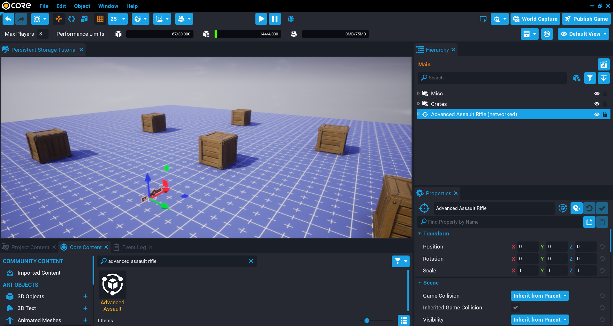
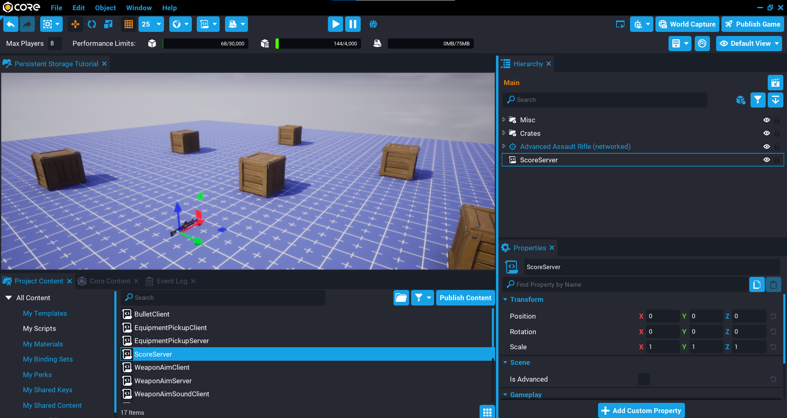
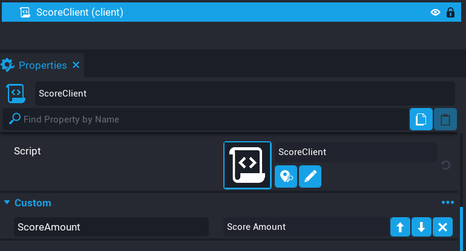
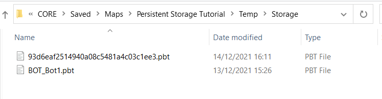

# Persistent Storage in Core

## Overview

[**Persistent Storage**](../references/persistent_storage.md) allows you to store data for players in your game so when they return back in a future session, they can continue where they left off. This allows the players to continue their progress without starting from scratch.

You might be familiar with this in other games you have played; there are achievements, player levels, currency, inventory items, and many more. Without persistent storage, each time a player rejoins your game they would be starting from scratch, and players will not get a sense of long-term accomplishment.

In this tutorial you will be learning how to save and load data for a player so that it persists between game sessions. You will add a weapon to destroy some objects that will save the players score. In the second part of the tutorial, you will also be persistently saving the weapon so when the player rejoins the game, they start with that weapon they last had equipped.

Here are just a few ideas on ways persistent storage can be used:

* Player high score / player stats.
* Player level / experience.
* Player equipment / inventory.
* Player resources (that is wood, metal, coal).
* Currency (that is gold, gems).
* Achievements / Trophies.

---

* **Completion Time:** 20 minutes
* **Knowledge Level:** No knowledge *absolutely* required, but this will be easier to understand with a grasp on **[Lua](../tutorials/lua_basics_lightbulb.md)** already.
* **Skills you will learn:**
    * How to store data for a player persistently between game sessions.
    * Sending the player score from the server to the client to display in the UI.
    * How to spawn the last equipment the player used when they join.

---

## Enable Player Storage

For your game to store data persistently for players, you will need to enable player storage. Doing this will allow you to use the [Storage API](../api/storage.md) to Set and Get data for players.

### Modify Game Settings

1. In the **Hierarchy** window, look for a folder called **Gameplay Settings** and open that folder.
2. Look for an object called **Game Settings** and click on it to make it the active object in the **Hierarchy**.
3. In the **Properties** window, look for an option called **Enable Player Storage**.
4. Click on **Enable Player Storage** so it is enabled.

!!! tip "Missing Game Settings"
    If you do not have a **Game Settings** object in your **Hierarchy**, it can be added to your hierarchy from the **Core Content** window by searching for **Game Settings**.

{: .center loading="lazy" }

## Add Objects to Hierarchy

### Create Crates Group

In the **Hierarchy** create a new group called `Crates`. This group will contain all the crates you will add.

{: .center loading="lazy" }

### Add Crate Template

1. In **Core Content** search for `Damageable Crate`.
2. Drag as many crates into the **Crates** group as you like, and move them around so they are spaced out.

{: .center loading="lazy" }

### Add Weapon Template

The player will need a weapon to destroy the crates.

1. In **Core Content** search for `Advanced Assault Rifle`.
2. Drag one rifle into the **Hierarchy**.

{: .center loading="lazy" }

### Test the Game

Test the game by picking up the weapon and shooting the crates. When the crates receive enough damage, they will be destroyed.

<div class="mt-video" style="width:100%">
    <video autoplay muted playsinline controls loop class="center" style="width:100%">
        <source src="/img/PersistentStorage/test_crates.mp4" type="video/mp4" />
    </video>
</div>

## Create ScoreServer Script

Create a new script called `ScoreServer` and add it to your **Hierarchy**. This script will handle saving and loading the player's data. When a crate has been destroyed, the player's score will be updated and saved.

{: .center loading="lazy" }

### Add Crates Custom Property

The **ScoreServer** script needs to know about the crates so it can award score to the player when they are destroyed.

1. Click on the **ScoreServer** script in the **Hierarchy** so it becomes the active object.
2. Drag the **Crates** group onto the **Add Custom Property** in the **Properties** window.

{: .center loading="lazy" }

### Edit ScoreServer Script

Open up the **ScoreServer** script and add a reference to the crates for later use.

```lua
local CRATES = script:GetCustomProperty("Crates"):WaitForObject()
```

#### Create scoreAmount Variable

Add the variable `scoreAmount` that will hold the amount of score to give to the player when they destroy a crate.

```lua
local scoreAmount = 50
```

#### Create PlayerJoined Function

The `PlayerJoined` function will be called for each player that joins the game. It will get the player's storage data (table) and put it into the variable `data`. Using `SetResource`, you can set the `score` resource for the player using the `data.score` value. This value is what is saved in the player's storage. If there is no `score` property, then you can set the resource value to `0`.

[`GetPlayerData`](../api/storage.md) requires the player as the first argument.

```lua
local function PlayerJoined(player)
    local data = Storage.GetPlayerData(player)

    player:SetResource("score", data.score or 0)
end
```

#### Create PlayerLeft Function

The `PlayerLeft` function will be called for each player that leaves the game. The function will get the current players score from the resource `score`, and store it in the `score` property of the `data` table. The player's `data` table is loaded here to make sure anything else that might be stored in the data is also saved.

[`SetPlayerData`](../api/storage.md) requires 2 arguments, the player to save the data for, and a table of data that will be saved.

```lua
local function PlayerLeft(player)
    local data = Storage.GetPlayerData(player)

    data.score = player:GetResource("score")
    Storage.SetPlayerData(player, data)
end
```

#### Create CrateDestroyed Function

The `CrateDestroyed` function will add the `scoreAmount` to the player's `score` resource for the player that destroyed the crated.

```lua
local function CrateDestroyed(obj, damage)
    damage.sourcePlayer:AddResource("score", scoreAmount)
end
```

#### Create WatchCrates Function

The `WatchCrates` function will loop over all the crates in the `CRATES` group, and connect `CrateDestroyed` function to the `diedEvent`. When the player destroys a crate, the `diedEvent` will fire, which will call the `CrateDestroyed` function.

```lua
local function WatchCrates()
    for index, crate in ipairs(CRATES:GetChildren()) do
        crate.diedEvent:Connect(CrateDestroyed)
    end
end
```

#### Connect Events

Connect up the events for when the player joins and leaves the game. These 2 events will load and save the player's data.

```lua
Game.playerJoinedEvent:Connect(PlayerJoined)
Game.playerLeftEvent:Connect(PlayerLeft)
```

#### Call WatchCrates Function

Call the `WatchCrates` function to setup the `diedEvent` for all the crates.

```lua
WatchCrates()
```

### The ScoreServer Script

??? "ScoreServer"
    ```lua
    -- Get reference to the group that contains all the crates
    local CRATES = script:GetCustomProperty("Crates"):WaitForObject()

    -- The amount of score to give to the player when a crate is destroyed
    local scoreAmount = 50

    -- Function to call when the player joins the game.
    -- This function will get the current players storage
    -- data and set the resource "score" to either the
    -- score saved, or 0 if it doesn't exist.

    local function PlayerJoined(player)
        local data = Storage.GetPlayerData(player)

        player:SetResource("score", data.score or 0)
    end

    -- When the player leaves the game, save the score
    -- to storage.
    local function PlayerLeft(player)
        local data = Storage.GetPlayerData(player)

        data.score = player:GetResource("score")
        Storage.SetPlayerData(player, data)
    end

    -- When a crate is destroyed, add to the players score.
    local function CrateDestroyed(obj, damage)
        damage.sourcePlayer:AddResource("score", scoreAmount)
    end

    -- Loop through all the children in the crates group
    -- and connect up the diedEvent to call CrateDestroyed.
    local function WatchCrates()
        for index, crate in ipairs(CRATES:GetChildren()) do
            crate.diedEvent:Connect(CrateDestroyed)
        end
    end

    -- Connect up the player events for leaving and joining.
    Game.playerJoinedEvent:Connect(PlayerJoined)
    Game.playerLeftEvent:Connect(PlayerLeft)

    -- Call WatchCrates to setup the diedEvents.
    WatchCrates()
    ```

## Create Score UI

The player will need to see what their score is when they join the game and when they destroy crates.

1. Create a **Client Context** in the **Hierarchy** and call it `Client`.
2. Create a **UI Container** inside the **Client** folder.
3. Create a **UI Text** object inside the **UI Container**, and name the text object `Score Amount`.
4. Modify the **Score Amount** by setting the font, color, size, and position to how you want.

{: .center loading="lazy" }

## Create ScoreClient Script

Create a new script called `ScoreClient` and place it inside the **Client** folder. This script will be responsible for updating the score UI text to display the score the player has.

### Add Score UI Text Custom Property

The script needs a reference to the score UI text object.

Add the **Score Amount** text object to the **ScoreClient** script as a custom property, name it `ScoreAmount`.

{: .center loading="lazy" }

### Edit **ScoreClient** Script

Open up the **ScoreClient** script and add a reference to the property `ScoreAmount` so you can update the text in the UI for the player from the script.

```lua
local SCORE_AMOUNT = script:GetCustomProperty("ScoreAmount"):WaitForObject()
```

#### Create Local Player Variable

Using the `Game.GetLocalPlayer` function will give you a reference to the local player (client).

```lua
local localPlayer = Game.GetLocalPlayer()
```

#### Create UpdateScore Function

The `UpdateScore` function will be called to update the `SCORE_AMOUNT` text in the UI for the player. This will be called when the player's resources has changed, and also at the end of the script. You can check which resource has changed by checking the value of the `prop` parameter. In this case the `prop` value is being checked if it equals `score`.

Because the `amount` parameter is a number (integer), it needs to be converted to a string before setting the `text` property.

```lua
local function UpdateScore(player, prop, amount)
    if prop == "score" then
        SCORE_AMOUNT.text = tostring(amount)
    end
end
```

#### Connect Resource Changed Event

Connect up the `resourceChangedEvent`. This event will fire anytime a player's resource has changed. For example, if they destroy a crate the score will be updated for that player, so the event will fire which calls the `UpdateScore` function.

```lua
localPlayer.resourceChangedEvent:Connect(UpdateScore)
```

#### Call UpdateScore Function

A manual call to `UpdateScore` is required, because the `resourceChangedEvent` may not have connected in time to receive the changes when the player joins the game.

```lua
UpdateScore(local_player, "score", localPlayer:GetResource("score"))
```

#### The ScoreClient Script

??? "ScoreClient"
    ```lua
    local SCORE_AMOUNT = script:GetCustomProperty("ScoreAmount"):WaitForObject()

    local localPlayer = Game.GetLocalPlayer()

    local function UpdateScore(player, prop, amount)
        if prop == "score" then
            SCORE_AMOUNT.text = tostring(amount)
        end
    end

    localPlayer.resourceChangedEvent:Connect(UpdateScore)

    UpdateScore(local_player, "score", localPlayer:GetResource("score"))
    ```

### Test the Game

Test the game and make sure the following work:

- Destroying crates increases the score in the UI.
- Leaving and rejoining the game displays the score the player had before leaving.

<div class="mt-video" style="width:100%">
    <video autoplay muted playsinline controls loop class="center" style="width:100%">
        <source src="/img/PersistentStorage/section_1_complete.mp4" type="video/mp4" />
    </video>
</div>

## Save Player Weapon

In this section you will learn how to save the player's weapon selection. Player's will be able to press ++1++ or ++2++ to switch between 2 different weapons.

### Remove Advanced Assault Rifle

Remove the advanced assault rifle that you added to your **Hierarchy** in the previous section. Instead of having the player pickup the weapon, it will be spawned into the world and equipped on the player.

### Create WeaponServer Script

Create a new script called `WeaponServer` and place it into your **Hierarchy**. This script will be responsible for spawning the player's weapon selection, and saving that selection to persistent storage so the next time they join the game they start out with the last weapon they equipped.

#### Add Weapon Custom Properties

The player will need at least 2 weapons to pick between.

1. Search for `Advanced Assault Rifle` in **Core Content** and add it as a custom property.
2. Search for `Basic Pistol` in **Core Content** and add it as a custom property.

{: .center loading="lazy" }

#### Edit WeaponServer Script

Open up the **WeaponServer** script and create a table called `weapons` that contains the references to the weapons you added as custom properties. A table is used so an index lookup can be done, as the index of the weapon will be saved to the player's storage.

```lua
local weapons = {

    script:GetCustomProperty("AdvancedAssaultRifle"),
    script:GetCustomProperty("AdvancedPistol")

}
```

#### Create RemoveWeapon Function

The `RemoveWeapon` function will destroy any equipment the player has to make sure the player can only have one item.

```lua
local function RemoveWeapon(player)
    for e, equipment in pairs(player:GetEquipment()) do
        equipment:Destroy()
    end
end
```

#### Create EquipWeapon Function

The `EquipWeapon` function will spawn the weapon asset using [`SpawnAsset`](../api/world.md) based on the `index` that is passed in. At the same time it will save the index to the player's storage in the `weaponIndex` property.

`SetPlayerData` requires 2 arguments, the player who you are saving the data for, and the table of data to be saved.

```lua
local function EquipWeapon(player, index)
    RemoveWeapon(player)

    if index ~= nil and weapons[index] ~= nil then
        local weapon = World.SpawnAsset(weapons[index])

        weapon:Equip(player)

        local data = Storage.GetPlayerData(player)

        data.weaponIndex = index
        Storage.SetPlayerData(player, data)
    end
end
```

#### Create BindingPressed Function

The [`BindingPressed`](../api/player.md) function will check which binding the player is pressing, and equip the correct weapon for the player.

```lua
local function BindingPressed(player, binding)
    if binding == "ability_extra_1" then
        EquipWeapon(player, 1)
    elseif binding == "ability_extra_2" then
        EquipWeapon(player, 2)
    end
end
```

#### Create PlayerJoined Function

The `PlayerJoined` function will be called when the player joins the game. This function will get the player's data and pass the `weaponIndex` to the `EquipWeapon` function so it is spawned for that player. You also need to set up the `bindingPressedEvent` so the player can switch between the weapons.

```lua
local function PlayerJoined(player)
    local data = Storage.GetPlayerData(player)

    EquipWeapon(player, data.weaponIndex)
    player.bindingPressedEvent:Connect(BindingPressed)
end
```

#### Connect Player Joined Event

Connect the [`playerJoinedEvent`](../api/player.md) so that when the player joins the game, they will continue with the weapon they last selected.

```lua
Game.playerJoinedEvent:Connect(PlayerJoined)
```

#### The WeaponServer Script

??? "WeaponServer"
    ```lua
    local weapons = {

        script:GetCustomProperty("AdvancedAssaultRifle"),
        script:GetCustomProperty("AdvancedPistol")

    }

    local function RemoveWeapon(player)
        for e, equipment in pairs(player:GetEquipment()) do
            equipment:Destroy()
        end
    end

    local function EquipWeapon(player, index)
        RemoveWeapon(player)

        if index ~= nil and weapons[index] ~= nil then
            local weapon = World.SpawnAsset(weapons[index])

            weapon:Equip(player)

            local data = Storage.GetPlayerData(player)

            data.weaponIndex = index
            Storage.SetPlayerData(player, data)
        end
    end

    local function BindingPressed(player, binding)
        if binding == "ability_extra_1" then
            EquipWeapon(player, 1)
        elseif binding == "ability_extra_2" then
            EquipWeapon(player, 2)
        end
    end

    local function PlayerJoined(player)
        local data = Storage.GetPlayerData(player)

        EquipWeapon(player, data.weaponIndex)
        player.bindingPressedEvent:Connect(BindingPressed)
    end

    Game.playerJoinedEvent:Connect(PlayerJoined)
    ```

### Test the Game

Test the game and make sure the following work:

- Pressing ++1++ or ++2++ changes the player's weapon.
- Leaving and rejoining the game gives the last weapon the player selected.

<div class="mt-video" style="width:100%">
    <video autoplay muted playsinline controls loop class="center" style="width:100%">
        <source src="/img/PersistentStorage/final.mp4" type="video/mp4" />
    </video>
</div>

## Player Storage File Location

Something that is useful to know is where to find the storage files when you are locally testing your game. This can be useful to see what data is being saved for the player.

### Project Explorer Location

To find where you project exists, you can go to the **Create** tab and click on the option button and select **Show In Explorer**. This will open the folder to your project.

{: .center loading="lazy" }

### Player Storage Files

If you have been saving data for a player using any of the [Storage API](../api/storage.md) functions, then you will see a **Temp** folder in your project folder. Open that folder up and you will see another folder called **Storage**. This is where the files for player storage are saved. These files can be opened so you can inspect the data in them. The name of the files are named after the player's ID.

{: .center loading="lazy" }

## Summary

Adding persistent storage to your game can improve the experience for players, and give them something to work for that will keep them coming back to play your game. This could be a leveling system, player stats, or whatever else you can think of.

## Learn More

[Persistent Storage Reference](../references/persistent_storage.md) | [Storage API](../api/storage.md) | [Basic Weapons Tutorial](../tutorials/weapons_tutorial.md) | [Networking Reference](../references/networking.md) | [Shared Storage Reference](../references/shared_storage.md) | [Concurrent Storage Reference](../references/concurrent_storage.md) | [Concurrent Storage Tutorial](../tutorials/concurrent_storage_tutorial.md)
