# Photo Booth

## Overview

In this tutorial you will be creating a Photo Booth where players can stand in front of a [Camera](../references/cameras_and_settings.md) to take pictures of themselves and other players in the shot. These [Camera Captures](../api/cameracapture.md) will be shared with the rest of the players in the game so they can see your picture. You will be using your camera capture knowledge from previous tutorials to create a multiplayer experience for your players.

<div class="mt-video" style="width:100%">
    <video autoplay muted playsinline controls loop class="center" style="width:100%">
        <source src="/img/CameraCapture/PhotoBooth/preview.mp4" type="video/mp4" />
    </video>
</div>

* **Completion Time:** ~2 hours
* **Knowledge Level:** It is recommended to have completed the [Scripting Beginner](lua_basics_helloworld.md) and [Camera Captures](../tutorials/camera_capture_basics.md) tutorials.
* **Skills you will learn:**
    * Creating an override camera.
    * Creating camera captures.
    * Creating trigger areas.
    * Showing camera captures in the UI.
    * Randomly changing UI background images using `RandomStream`.
    * Showing camera captures in the world.
    * Attaching an object to the player.
    * Creating a multiplayer experience by sharing camera captures.

---

## Import Asset from Community Content

You will be importing an asset from **Community Content** that will contain the assets needed to build the Photo Booth.

1. Open the **Community Content** window.
2. Search for `Photo Booth` by **CoreAcademy**.
3. Click **Import**.

{: .center loading="lazy" }

## Add Asset Template to Hierarchy

1. Click the **Project Content** tab.
2. Click **My Templates** under **All Content**.
3. Add the template **Photo Booth** into the **Hierarchy**.
4. Deinstance the **Photo Booth** template in the **Hierarchy**.

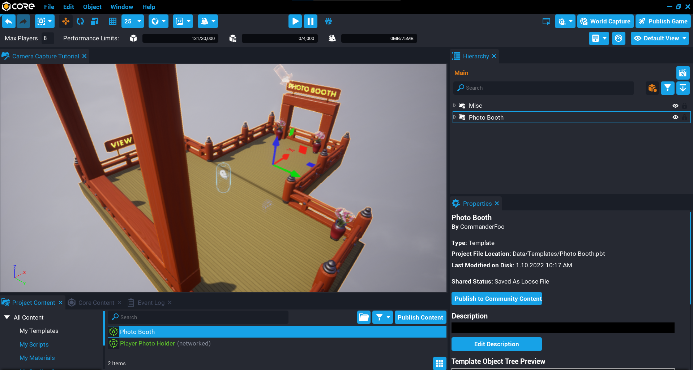{: .center loading="lazy" }

## Create Capture Camera

You will need to create a camera that will be responsible for doing all the camera capture work. The settings below are what was found to work best for the desired look. Feel free to adjust these.

1. Create a **Camera** object and place it into the **Cameras** folder in the **Hierarchy**.
2. Rename the camera to `Camera Capture`.
3. Set the **Position** to **X** `4.64`, **Y** `0`, **Z** `27.106`.
4. Set the **Rotation** to **X** `0`, **Y** `-1.167`, **Z** `0`.
5. Set the **Field of View** to `46`.
6. Uncheck **Use as Default**.
7. Uncheck **Attach to Local Player**.
8. Set **Initial Distance** to `0`.
9. Set **Base Rotation Mode** to **Camera**.

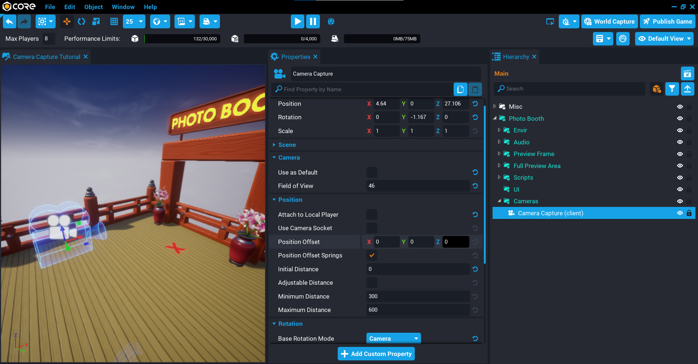{: .center loading="lazy" }

## Create Override Camera

The override camera will switch the current player's camera to a different camera so they can see how they would be positioned in the photo. This will happen when the player enters the area of the photo booth, and when they leave it will switch back to their default camera.

1. Create a **Camera** object and place it into the **Camera** folder in the **Hierarchy**.
2. Rename the camera to `Override Camera`.
3. Set the **Position** to **X** `-4.64`, **Y** `0`, **Z** `0`.
4. Set the **Field of View** to `70`.
5. Uncheck **Use as Default**.
6. Uncheck **Attach to Local Player**.
7. Set **Initial Distance** to `0`.
8. Set **Base Rotation Mode** to **Camera**.

{: .center loading="lazy" }

## Create Override UI

The override UI will be displayed when the player enters the area to take a photo. This will also be responsible for showing the last photo took by the player, this part will be done in a later section.

### Create UI Container

1. Create a **UI Container** inside the **UI** folder in the **Hierarchy**.
2. Rename the **UI Container** to `Override UI`.
3. Set the **Visibility** to **Force Off**.

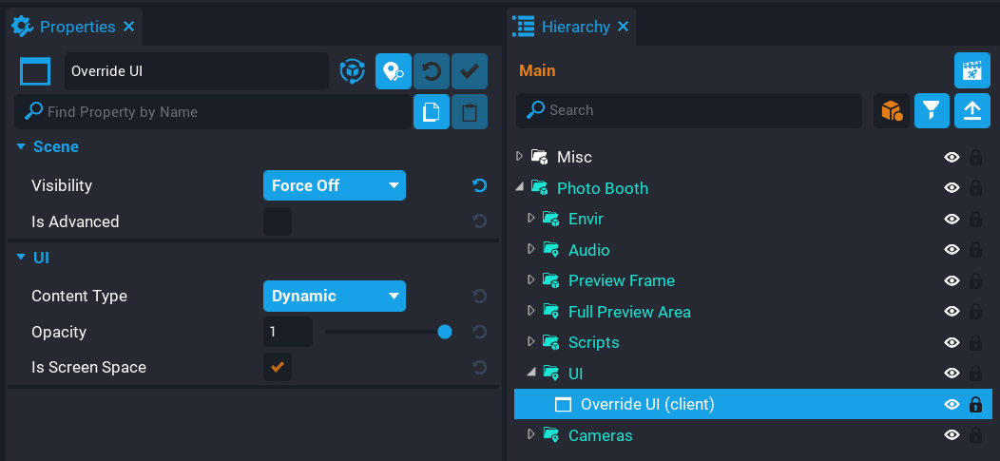{: .center loading="lazy" }

### Create Screen Preview

The screen preview elements will be used to display the last picture the player took with a frame around it. There will also be a text object that will be dynamically set later on to let the player know if they can hold their photo in front of them.

#### Create Preview Image

1. Inside the **Override UI** create a **UI Image** object and rename it `Screen Preview`.
2. Set the **X Offset** to `75`, and the **Y Offset** to `75`.
3. Set the **Width** to `300`, and the **Height** to `300`.
4. Set the **Anchor** to **Top Left**, and **Dock** to **Top Left**.
5. Set the **Visibility** to **Force Off**.

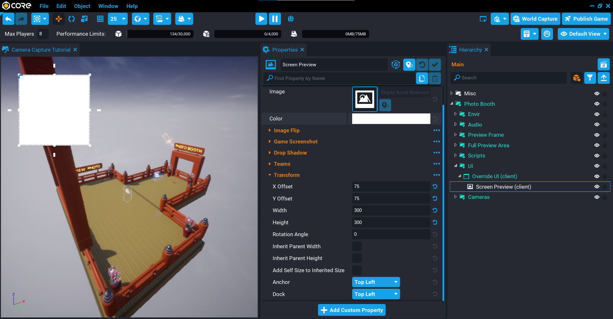{: .center loading="lazy" }

#### Create Frame Image

To give the image a nice look, you can add a frame that fits on top of the **Screen Preview** image.

1. Inside the **Screen Preview** create a **UI Image** object and rename it to `Frame`.
2. Change the **Image** property to `Japanese Frame 005`.
3. Set the **Width** to `8`, and the **Height** to 8.
4. Enable **Inherit Parent Width**, **Inherit Parent Height**, and **Add Self to Inherited Size**.
5. Set the **Anchor** to **Middle Center**, and **Dock** to **Middle Center**.

{: .center loading="lazy" }

#### Create Key Tip Text

Later on in the tutorial you will be adding a feature where the player can pull out their last photo they took and walk around with it. A little tip under the screen preview image needs to be displayed, because at some point, the player can not equip their photo, so this text object will get updated dynamically.

1. Inside **Screen Preview** create a **UI Text** object and rename it to `Key Tip`.
2. Set the **Text** to `Press E To Hold Up Photo`.
3. Set the **Font** to **Teko Bold**.
4. Set the **Size** to `18`.
5. Set the **Horizontal Justification** to **Center**.
6. Set the **Vertical Justification** to **Center**.
7. Uncheck **Wrap Text**.
8. Set the **Shadow Offset** to **X** `2`, and **Y** `2`.
9. Set the **Outline Size** to `1`.
10. Set the **Y Offset** to `56`.
11. Set the **Width** to `200`, and **Height** to `60`.
12. Set the **Anchor** to **Bottom Center**, and **Dock** to **Bottom Center**.

{: .center loading="lazy" }

#### Create Controls

The controls will be what action the player can do when the override UI is displayed. In this case there will be just one control that will be the camera button that the player will need to click on to take a photo.

##### Create Panel

1. Create a **UI Panel** inside the **Override UI** object and rename it to `Controls`.
2. Set the **X Offset** to `-80`, and **Y Offset** to `-65`.
3. Set the **Width** to `128`, and the **Height** to `128`.
4. Set the **Anchor** to **Bottom Right**, and **Dock** to **Bottom Right**.

{: .center loading="lazy" }

##### Create Camera Button

1. Create a **UI Button** inside the **Controls** object and rename it to `Take Photo`.
2. Change the **Image** to **Icon Camera**.
3. Change the **Take Photo** button state colors to what you like.
4. Set the **Width** to `150`, and the **Height** to `150`.
5. Enable **Inherit Parent Width**, and **Inherit Parent Height**.
6. Set the **Anchor** to **Bottom Right**, and **Dock** to **Bottom Right**.

{: .center loading="lazy" }

#### Create Flash Image

When the player takes a photo, it would be nice to display a flash. You can do this by creating an image and turning the visibility on then off quickly.

1. Create a **UI Image** inside the **Override UI** object and name it to `Flash`.
2. Set the **Alpha** of the **Color** to `0.05`.
3. Enable **Inherit Parent Width**, and **Inherit Parent Height**.

!!! tip "Try not to set the **Alpha** too high, as it could be too harsh for players when the flash goes off."

{: .center loading="lazy" }

## Create Override Trigger

A trigger will be used to detect when the player is in the photo booth area. This will override the player's camera and will display the UI so a photo can be took. Position and scale the trigger so it is in front of the photo booth frame.

1. Create a **Trigger** and place it into the **Photo Booth** folder.
2. Set the **Position** to **X** `250`, **Y** `0`, and **Z** `250`.
3. Set the **Scale** to **X** `4`, **Y** `4`, and **Z** `4`.

{: .center loading="lazy" }

## Create CameraOverrideClient Script

Create a script called `CameraOverrideClient` and place it into the **Client** folder in the **Hierarchy**. This script will be responsible for detecting when the player has overlapped the trigger volume so it can override the current players camera and show the UI.

### Add Custom Properties

The script will need references to some objects in the **Hierarchy**.

1. Add the **Override Camera** as a custom property and name it `OverrideCamera`.
2. Add the **Trigger** as a custom property and name it `Trigger`.
3. Add the **Override UI** as a custom property and name it `OverrideUI`.
4. Add the **Screen Preview** as a custom property and name it `ScreenPreview`.

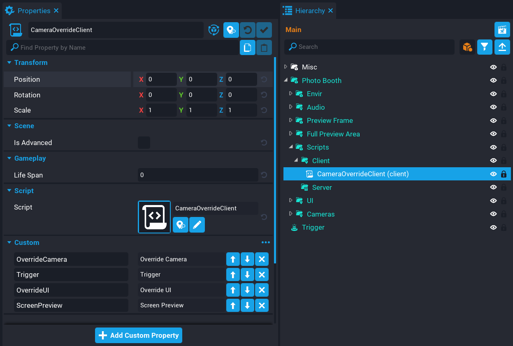{: .center loading="lazy" }

### Edit CameraOverrideClient Script

Open up the **CameraOverrideClient** script and add the references to the properties you added.

```lua
local OVERRIDE_CAMERA = script:GetCustomProperty("OverrideCamera"):WaitForObject()
local TRIGGER = script:GetCustomProperty("Trigger"):WaitForObject()
local OVERRIDE_UI = script:GetCustomProperty("OverrideUI"):WaitForObject()
local SCREEN_PREVIEW = script:GetCustomProperty("ScreenPreview"):WaitForObject()
```

You will also need a reference to the local player so you can check the player that is overlapping with the trigger is the current local player.

```lua
local localPlayer = Game.GetLocalPlayer()
```

#### Create OnTriggerEnter Function

Create a function called `OnTriggerEnter` that will be called when the player overlaps the trigger. Using `SetOverrideCamera` and passing in the `OVERRIDE_CAMERA` will change the player's camera to the override one instantly. At the same time the visibility of the `OVERRIDE_UI` is set to `FORCE_ON` which will show the camera icon so the player can take a photo.

```lua
local function OnTriggerEnter(trigger, other)
    if other:IsA("Player") and other == localPlayer then
        localPlayer:SetOverrideCamera(OVERRIDE_CAMERA)
        OVERRIDE_UI.visibility = Visibility.FORCE_ON
        UI.SetCursorVisible(true) -- (1)
        UI.SetCanCursorInteractWithUI(true) -- (2)
    end
end
```

1. Show the cursor to the player.
2. Allow the player to interact with the UI.

#### Create OnTriggerLeft Function

Create a function called `OnTriggerLeft` that will be called when the player leaves the trigger. When the player leaves the trigger, it will clear the current override camera that was set by calling `ClearOverrideCamera`. This will revert the player's camera back to the default camera.

```lua
local function OnTriggerLeft(trigger, other)
    if other:IsA("Player") and other == localPlayer then
        localPlayer:ClearOverrideCamera()
        OVERRIDE_UI.visibility = Visibility.FORCE_OFF -- (1)
        SCREEN_PREVIEW.visibility = Visibility.FORCE_OFF -- (2)
        UI.SetCursorVisible(false) -- (3)
        UI.SetCanCursorInteractWithUI(false) -- (4)
    end
end
```

1. Hide the UI from the player.
2. If the player has took a photo, then the preview image needs to be hidden.
3. No longer need the cursor visible.
4. Player can no longer interact with the UI.

#### Connect Trigger Events

Connect the `TRIGGER` events so they fire when the player overlaps or exits the trigger bounds.

```lua
TRIGGER.beginOverlapEvent:Connect(OnTriggerEnter)
TRIGGER.endOverlapEvent:Connect(OnTriggerLeft)
```

#### The CameraOverrideClient Script

??? "CameraOverrideClient"
    ```lua
    local OVERRIDE_CAMERA = script:GetCustomProperty("OverrideCamera"):WaitForObject()
    local TRIGGER = script:GetCustomProperty("Trigger"):WaitForObject()
    local OVERRIDE_UI = script:GetCustomProperty("OverrideUI"):WaitForObject()
    local SCREEN_PREVIEW = script:GetCustomProperty("ScreenPreview"):WaitForObject()

    local localPlayer = Game.GetLocalPlayer()

    local function OnTriggerEnter(trigger, other)
        if other:IsA("Player") and other == localPlayer then
            localPlayer:SetOverrideCamera(OVERRIDE_CAMERA)
            OVERRIDE_UI.visibility = Visibility.FORCE_ON
            UI.SetCursorVisible(true)
            UI.SetCanCursorInteractWithUI(true)
        end
    end

    local function OnTriggerLeft(trigger, other)
        if other:IsA("Player") and other == localPlayer then
            localPlayer:ClearOverrideCamera()
            OVERRIDE_UI.visibility = Visibility.FORCE_OFF
            SCREEN_PREVIEW.visibility = Visibility.FORCE_OFF
            UI.SetCursorVisible(false)
            UI.SetCanCursorInteractWithUI(false)
        end
    end

    TRIGGER.beginOverlapEvent:Connect(OnTriggerEnter)
    TRIGGER.endOverlapEvent:Connect(OnTriggerLeft)
    ```

### Test the Game

Test the game to make sure the following work:

1. Player's camera changes when they enter the area with the X on the ground.
2. UI is shown with the camera icon in the bottom right corner.
3. Leaving the area clears the camera which reverts back to the default camera.

<div class="mt-video" style="width:100%">
    <video autoplay muted playsinline controls loop class="center" style="width:100%">
        <source src="/img/CameraCapture/PhotoBooth/test_override.mp4" type="video/mp4" />
    </video>
</div>

## Create CameraCaptureClient Script

Create a script called `CameraCaptureClient` and place it into the **Client** folder in the **Hierarchy**. This script will be responsible for creating a camera capture and displaying it in the UI. The script will keep track of how many captures have been took, and automatically replace the oldest capture.

The [resolution](../api/enums.md#cameracaptureresolution) of the captures are going to be 512 x 512, which is the `LARGE` size. This allows you to have 32 captures at this size, but 1 of them will be used elsewhere.

The script will need references to a few objects that are in the **Hierarchy**.

1. Add the **Photo Booth** folder as a custom property called `ROOT`.
2. Add the **Camera Capture** camera object as a custom property called `Camera Capture`.
3. Add the **Take Photo** button object as a custom property called `TakePhotoButton`.
4. Add the **Screen Preview** image object as a custom property called `ScreenPreview`.
5. Add the **Shutter Audio** audio object as a custom property called `ShutterAudio`.
6. Add the **Flash** image object as a custom property called `Flash`.
7. Add the **KeyTip** text object as a custom property called `KeyTip`.

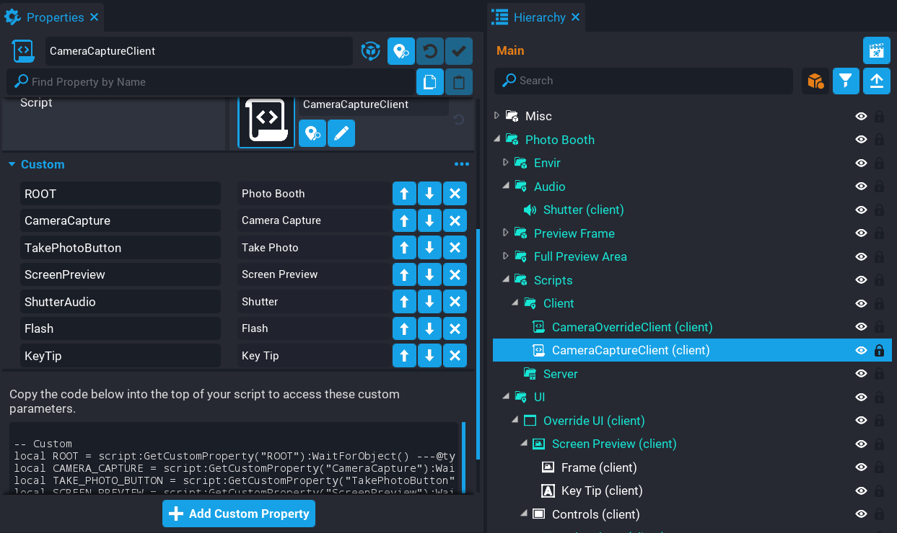{: .center loading="lazy" }

### Edit CameraCaptureClient Script

Open up the **CameraCaptureClient** script and add in the references.

#### Add Root Property References

The **Photo Booth** folder is acting as the root object, and it contains some properties that can be changed. Instead of putting customizable properties on the script, they can be added to the root object so they are easier to find.

Add the following references to the script.

```lua
local ROOT = script:GetCustomProperty("ROOT"):WaitForObject()
local PHOTO_DURATION = ROOT:GetCustomProperty("PhotoDuration") -- (1)
local DISABLE_DURATION = ROOT:GetCustomProperty("DisableDuration") -- (2)
```

1. The duration of how long a background image will display for before it changes.
2. The duration of how long the take photo button is disabled before the player can take another photo.

#### Add Property References

Add the references to the properties on the script object.

```lua
local CAMERA_CAPTURE = script:GetCustomProperty("CameraCapture"):WaitForObject()
local TAKE_PHOTO_BUTTON = script:GetCustomProperty("TakePhotoButton"):WaitForObject()
local SCREEN_PREVIEW = script:GetCustomProperty("ScreenPreview"):WaitForObject()
local SHUTTER_AUDIO = script:GetCustomProperty("ShutterAudio"):WaitForObject()
local FLASH = script:GetCustomProperty("Flash"):WaitForObject()
local KEY_TIP = script:GetCustomProperty("KeyTip"):WaitForObject()
```

#### Create Variables

Add the following variables that will be needed.

```lua
local resolution = CameraCaptureResolution.LARGE -- (1)
local maxSize = 1024
local currentSize = 512
local maxImages = (~~((maxSize ^ 2 << 3) / currentSize ^ 2)) - 1 -- (2)

local captures = {}
local previewCapture = nil
local localPlayer = Game.GetLocalPlayer()
```

1. The capture [resolution](../api/enums.md#cameracaptureresolution) that will be passed to the [`Capture`](../api/cameracapture/) function.
2. This line works out the maximum amount of images that can be created at the `currentSize` resolution.
    - `~~` Uses the bitwise NOT operator twice, which is shorthand for `math.floor`. Bitwise doesn't support decimals.
    - `maxSize ^ 2 << 3` Gives the total amount of memory budget.
    - `/ currentSize ^ 2` Divide the amount of memory you need by the total available to give the total images.
    - `- 1` Decrement by `1`, as 1 image is needed elsewhere.

    Sometimes the fancy way isn't always the best, as it can make it unreadable. Here is the expanded version:

    `math.floor((maxSize * maxSize * 8) / (currentSize * currentSize)) - 1`

| Variable | Description |
| -------- | ----------- |
| `resolution` | The capture [resolution](../api/enums.md#cameracaptureresolution) that will be passed to the [`Capture`](../api/cameracapture/) function. |
| `maxSize` | The maximum size that Core supports for the image. 1024 is the largest. |
| `currentSize` | The size to use for the captures. |
| `maxImages` | The total amount of images at the `currentSize` that can be created. |
| `captures` | A table that will hold all the captures created. Older ones will get removed when the limit has been reached. |
| `previewCapture` | Will be used to hold the capture instance for showing the preview to the player. |
| `localPlayer` | A reference to the local player for this script. |

#### Create PlayFlash Function

Create a function called `PlayFlash`. This function will turn on and off the `FLASH` image to give an effect that the camera flash has gone off. Notice that a task is being spawned, which is to prevent halting the script.

```lua
local function PlayFlash()
    Task.Spawn(function()
        FLASH.visibility = Visibility.FORCE_ON
        Task.Wait(.1)
        FLASH.visibility = Visibility.FORCE_OFF
    end)
end
```

#### Create DisableEnableButton Function

Create a function called `DisableEnableButton`. This function will disable and enable the camera icon that is clicked on by the player to take a photo. The reason for this, is to prevent the player from clicking the button too quickly which will result in a lot of event broadcasts being sent to the server.

```lua
local function DisableEnableButton()
    Task.Spawn(function()
        TAKE_PHOTO_BUTTON.isInteractable = false
        TAKE_PHOTO_BUTTON.parent.opacity = .3
        Task.Wait(DISABLE_DURATION)
        TAKE_PHOTO_BUTTON.isInteractable = true
        TAKE_PHOTO_BUTTON.parent.opacity = 1
    end)
end
```

#### Create UpdateKeyTip Function

Create a function called `UpdateKeyTip`. This function will update the message that shows under the preview image in the UI. If the player is mounted, then they will not be able to hold their photo, so it is a good idea to inform them of this. In a later section you will be creating this feature.

```lua
local function UpdateKeyTip()
    if(localPlayer.isMounted) then
        KEY_TIP.text = "Unmount to Hold up Photo"
    else
        KEY_TIP.text = "Press E to Hold up Photo"
    end
end
```

#### Create TakePhoto Function

Create a function called `TakePhoto`. This function will take a photo when the player clicks on the camera icon in the UI. This also is called for other players so on their end, they take a picture at the same time so they get to see your picture on the big preview.

The function takes a parameter called `player`. If this parameter is `nil`, then the function knows the player who took the photo is themself, so will update the `SCREEN_PREVIEW` image with the capture that was just took.

The function will also handle releasing capture images so that another image can be added to the table and show up on the big preview. This is done by checking how many captures are in the `captures` table, and if it is the same as `maxImages` it will [release](../api/cameracapture/) the oldest capture and remove it from the `captures` table. When getting a capture, you should check it is valid.

The `imageInfo` table will store the name of the player that took the photo. So if it is the local player, it will use the `localPlayer.name`, but if it is a broadcast from the server, then it will use the `player` parameter.

When the player takes a photo, it will also show in the UI. A new capture is created if the variable `previewCapture` is `nil` or invalid. If it is valid, then the capture will be refreshed.

Towards the end of the function, there is an event that gets broadcasted to the server. The server will be listening for this event and on firing, will broadcast to all other players so the image took by the current player is also took for them.

```lua
local function TakePhoto(player)
    if player == nil then
        SHUTTER_AUDIO:Play()
        PlayFlash()
        DisableEnableButton()
    end

    if #captures == maxImages then
        local firstCapture = captures[1]

        if(firstCapture.capture ~= nil and firstCapture.capture:IsValid()) then
            firstCapture.capture:Release()
        end

        table.remove(captures, 1)
    end

    local imageInfo = {

        playerName = (player and player.name) or localPlayer.name,
        capture = CAMERA_CAPTURE:Capture(resolution)

    }

    table.insert(captures, imageInfo)

    if player == nil and imageInfo.capture ~= nil and imageInfo.capture:IsValid() then
        if previewCapture == nil or not previewCapture:IsValid() then
            previewCapture = CAMERA_CAPTURE:Capture(resolution)
        else
            previewCapture:Refresh()
        end

        SCREEN_PREVIEW:SetCameraCapture(previewCapture)
        SCREEN_PREVIEW.visibility = Visibility.FORCE_ON

        UpdateKeyTip()

        Events.BroadcastToServer("photobooth.takephoto")
    end
end
```

#### Connect Button Event

Connect up the button that is used to take the screen shot. You can not just pass `TakePhoto` as the listener function, because the listener function will receive some parameters (that is the button clicked), and the `TakePhoto` function expects either `nil` or a **Player** object.

```lua
TAKE_PHOTO_BUTTON.clickedEvent:Connect(function()
    TakePhoto()
end)
```

#### Connect Event

Connect up the `TakePhoto` function so that when a player takes a photo, the server will then broadcast to the other players which will also take a photo. Captures can not be sent over the network, so call `TakePhoto` for all other players is a way to do this.

```lua
Events.Connect("photobooth.takephoto", TakePhoto)
```

### The CameraCaptureClient Script

??? "CameraCaptureClient"
    ```lua
    local ROOT = script:GetCustomProperty("ROOT"):WaitForObject()
    local PHOTO_DURATION = ROOT:GetCustomProperty("PhotoDuration")
    local DISABLE_DURATION = ROOT:GetCustomProperty("DisableDuration")

    local CAMERA_CAPTURE = script:GetCustomProperty("CameraCapture"):WaitForObject()
    local TAKE_PHOTO_BUTTON = script:GetCustomProperty("TakePhotoButton"):WaitForObject()
    local SCREEN_PREVIEW = script:GetCustomProperty("ScreenPreview"):WaitForObject()
    local SHUTTER_AUDIO = script:GetCustomProperty("ShutterAudio"):WaitForObject()
    local FLASH = script:GetCustomProperty("Flash"):WaitForObject()
    local KEY_TIP = script:GetCustomProperty("KeyTip"):WaitForObject()

    local resolution = CameraCaptureResolution.LARGE
    local maxSize = 1024
    local currentSize = 512
    local maxImages = (~~((maxSize ^ 2 << 3) / currentSize ^ 2)) - 1

    local captures = {}
    local previewCapture = nil
    local localPlayer = Game.GetLocalPlayer()

    local function PlayFlash()
        Task.Spawn(function()
            FLASH.visibility = Visibility.FORCE_ON
            Task.Wait(.1)
            FLASH.visibility = Visibility.FORCE_OFF
        end)
    end

    local function DisableEnableButton()
        Task.Spawn(function()
            TAKE_PHOTO_BUTTON.isInteractable = false
            TAKE_PHOTO_BUTTON.parent.opacity = .3
            Task.Wait(DISABLE_DURATION)
            TAKE_PHOTO_BUTTON.isInteractable = true
            TAKE_PHOTO_BUTTON.parent.opacity = 1
        end)
    end

    local function UpdateKeyTip()
        if(localPlayer.isMounted) then
            KEY_TIP.text = "Unmount to Hold up Photo"
        else
            KEY_TIP.text = "Press E to Hold up Photo"
        end
    end

    local function TakePhoto(player)
        if player == nil then
            SHUTTER_AUDIO:Play()
            PlayFlash()
            DisableEnableButton()
        end

        if #captures == maxImages then
            local firstCapture = captures[1]

            if(firstCapture.capture ~= nil and firstCapture.capture:IsValid()) then
                firstCapture.capture:Release()
            end

            table.remove(captures, 1)
        end

        local imageInfo = {

            playerName = (player and player.name) or localPlayer.name,
            capture = CAMERA_CAPTURE:Capture(resolution)

        }

        table.insert(captures, imageInfo)

        if player == nil and imageInfo.capture ~= nil and imageInfo.capture:IsValid() then
            if previewCapture == nil or not previewCapture:IsValid() then
                previewCapture = CAMERA_CAPTURE:Capture(resolution)
            else
                previewCapture:Refresh()
            end

            SCREEN_PREVIEW:SetCameraCapture(previewCapture)
            SCREEN_PREVIEW.visibility = Visibility.FORCE_ON

            UpdateKeyTip()

            Events.BroadcastToServer("photobooth.takephoto")
        end
    end

    TAKE_PHOTO_BUTTON.clickedEvent:Connect(function()
        TakePhoto()
    end)

    Events.Connect("photobooth.takephoto", TakePhoto)
    ```

### Test the Game

Test the game and make sure the following work:

1. Clicking on the camera icon plays the audio sound and flash effect.
2. Camera icon becomes disabled and then enabled again.
3. The capture is displayed in the preview image in the UI.

<div class="mt-video" style="width:100%">
    <video autoplay muted playsinline controls loop class="center" style="width:100%">
        <source src="/img/CameraCapture/PhotoBooth/test_capture.mp4" type="video/mp4" />
    </video>
</div>

## Create World UI

The next step is to set up the world space UI for the photos and name of the player who took the photo. The world space UI will also be used to display captures of other players.

### Create World Preview UI

The world preview UI will be used for the photo.

#### Create UI Container

1. Create a **UI Container** object inside the **UI** folder.
2. Rename the **UI Container** to `World Preview`.
3. Set the **Position** to **X** `-1250`, **Y** `0`, **Z** `680`.
4. Uncheck **Is Screen Space**.
5. Set the **Canvas Size** to **X** `800`, **Y** `800`.

{: .center loading="lazy" }

#### Create UI Image

1. Create a **UI Image** object inside the **World Preview** object in the **Hierarchy**.
2. Rename the **UI Image** to `World Preview Image`.
3. Enable **Inherit Parent Width**, and **Inherit Parent Height**.

{: .center loading="lazy" }

### Create World Name UI

The world name UI will be used to display the name of the player who took the photo.

#### Create UI Container

1. Create a **UI Container** object inside the **UI** folder.
2. Rename the **UI Container** to `World Name`.
3. Set the **Position** to **X** `-1205`, **Y** `0`, **Z** `250`.
4. Uncheck **Is Screen Space**.
5. Set the **Canvas Size** to **X** `935`, **Y** `100`.

{: .center loading="lazy" }

#### Create UI Text

1. Create a **UI Text** object inside the **World Name** object in the **Hierarchy**.
2. Rename the **UI Text** to `World Preview Text`.
3. Set the **Font** to **Teko Bold**.
4. Set the **Size** to `29`.
5. Set the **Horizontal Justification** to **Center**.
6. Set the **Vertical Justification** to **Center**.
7. Uncheck **Wrap Text**.
8. Set the **Outline Size** to `4`.
9. Set the **Width** to `200`, and **Height** to `60`.
10. Set the **Anchor** to **Middle Center**, and **Dock** to **Middle Center**.

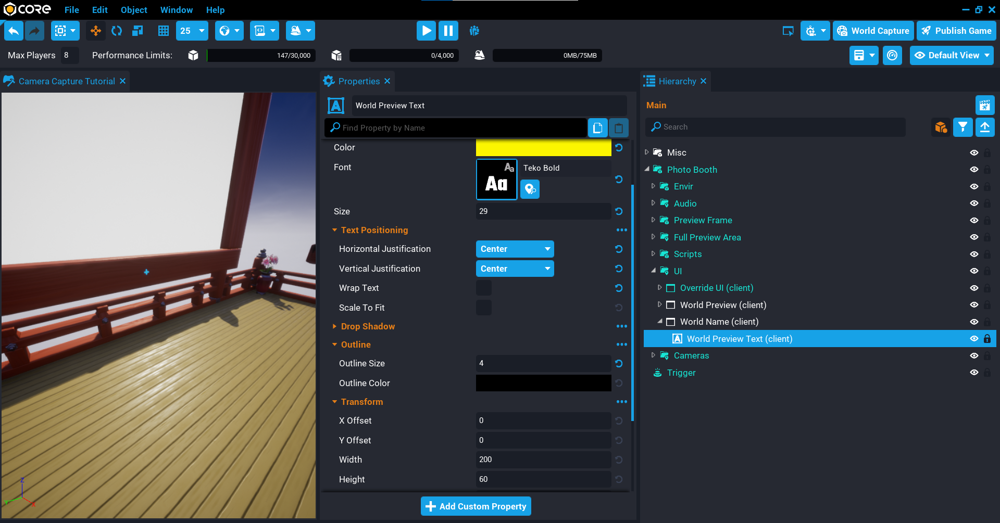{: .center loading="lazy" }

## Edit CameraCaptureClient Script

The **CameraCaptureClient** script will need to be update so that when the player takes a photo, it will show up in the world preview image and also show the player's name.

### Add World UI Custom Properties

The script will need references to the **World Preview Image** and **World Preview Text** objects.

1. Add the **World Preview Image** object as a custom property and name it `WorldPreviewImage`.
2. Add the **World Preview Text** object as a custom property and name it `WorldPreviewText`.

{: .center loading="lazy" }

Open up the **CameraCaptureClient** script and add the new property references.

```lua
local WORLD_PREVIEW = script:GetCustomProperty("WorldPreviewImage"):WaitForObject()
local WORLD_NAME = script:GetCustomProperty("WorldPreviewText"):WaitForObject()
```

### Add Variables

You will need 2 variables that will be used to handle changing images over time so that players will see other photos.

The `currentIndex` variable will be incremented each iteration so it can keep track of what photo is currently being displayed, and the `elapsedTime` variable will be used handle changing to the next photo.

```lua
local currentIndex = 1
local elapsedTime = 0
```

### Create ShowImage Function

Create a function called `ShowImage`, make sure to place this above the `TakePhoto` function.

This function will change the `WORLD_PREVIEW` image to the next camera capture in the `captures` table. It will also update the `WORLD_NAME` text to show who took the photo.

The function will cycle through the `captures` table, once it reaches the end of the table (`#captures`), it will reset back to 1 and start the cycle again.

Notice that the function accepts a parameter called `index`. This parameter is used when the local player takes a photo so that it is displayed right away. Otherwise, the player would have to wait for their photo to show up.

```lua
local function ShowImage(index)
    local imageInfo = captures[index or currentIndex]

    if(imageInfo.capture == nil or not imageInfo.capture:IsValid()) then
        return
    end

    WORLD_PREVIEW:SetCameraCapture(imageInfo.capture)
    WORLD_NAME.text = "By " .. imageInfo.playerName

    if not index then
        currentIndex = (currentIndex == #captures and 1) or (currentIndex + 1)
    else
        elapsedTime = 0
    end
end
```

### Modify TakePhoto Function

Modify the `TakePhoto` function and add a call to the `ShowImage` function so that when the local player takes a photo, it updates the world UI image right away so the player doesn't need to wait to see their photo.

```lua hl_lines="28"
local function TakePhoto(player)
    if player == nil then
        SHUTTER_AUDIO:Play()
        PlayFlash()
        DisableEnableButton()
    end

    if #captures == maxImages then
        local firstCapture = captures[1]

        if(firstCapture.capture ~= nil and firstCapture.capture:IsValid()) then
            firstCapture.capture:Release()
        end

        table.remove(captures, 1)
    end

    local imageInfo = {

        playerName = (player and player.name) or localPlayer.name,
        capture = CAMERA_CAPTURE:Capture(resolution)

    }

    table.insert(captures, imageInfo)

    if player == nil and imageInfo.capture ~= nil and imageInfo.capture:IsValid() then
        ShowImage(#captures)

        if previewCapture == nil or not previewCapture:IsValid() then
            previewCapture = CAMERA_CAPTURE:Capture(resolution)
        else
            previewCapture:Refresh()
        end

        SCREEN_PREVIEW:SetCameraCapture(previewCapture)
        SCREEN_PREVIEW.visibility = Visibility.FORCE_ON

        UpdateKeyTip()

        Events.BroadcastToServer("photobooth.takephoto")
    end
end
```

### Create Tick Function

Create a `Tick` function that will handle cycling the captured images.

The `elapsedTime` will be incremented by adding the current value of `elapsedTime` and adding `dt` (delta time). This can be compared against the `PHOTO_DURATION` time, if it is larger, then it will show the next image by calling `ShowImage` and resetting the `elapsedTime` to `0` to start again.

!!! tip "You can change the `PHOTO_DURATION` on the root object **Photo Booth**."

```lua
function Tick(dt)
    elapsedTime = elapsedTime + dt

    if #captures > 0 and elapsedTime > PHOTO_DURATION then
        ShowImage()
        elapsedTime = 0
    end
end
```

### The CameraCaptureClient Script

??? "CaptureCaptureClient"
    ```lua
    local ROOT = script:GetCustomProperty("ROOT"):WaitForObject()
    local PHOTO_DURATION = ROOT:GetCustomProperty("PhotoDuration")
    local DISABLE_DURATION = ROOT:GetCustomProperty("DisableDuration")

    local CAMERA_CAPTURE = script:GetCustomProperty("CameraCapture"):WaitForObject()
    local TAKE_PHOTO_BUTTON = script:GetCustomProperty("TakePhotoButton"):WaitForObject()
    local SCREEN_PREVIEW = script:GetCustomProperty("ScreenPreview"):WaitForObject()
    local SHUTTER_AUDIO = script:GetCustomProperty("ShutterAudio"):WaitForObject()
    local FLASH = script:GetCustomProperty("Flash"):WaitForObject()
    local KEY_TIP = script:GetCustomProperty("KeyTip"):WaitForObject()

    local WORLD_PREVIEW = script:GetCustomProperty("WorldPreviewImage"):WaitForObject()
    local WORLD_NAME = script:GetCustomProperty("WorldPreviewText"):WaitForObject()

    local resolution = CameraCaptureResolution.LARGE
    local maxSize = 1024
    local currentSize = 512
    local maxImages = (~~((maxSize ^ 2 << 3) / currentSize ^ 2)) - 1

    local captures = {}
    local previewCapture = nil
    local localPlayer = Game.GetLocalPlayer()
    local currentIndex = 1
    local elapsedTime = 0

    local function PlayFlash()
        Task.Spawn(function()
            FLASH.visibility = Visibility.FORCE_ON
            Task.Wait(.1)
            FLASH.visibility = Visibility.FORCE_OFF
        end)
    end

    local function DisableEnableButton()
        Task.Spawn(function()
            TAKE_PHOTO_BUTTON.isInteractable = false
            TAKE_PHOTO_BUTTON.parent.opacity = .3
            Task.Wait(DISABLE_DURATION)
            TAKE_PHOTO_BUTTON.isInteractable = true
            TAKE_PHOTO_BUTTON.parent.opacity = 1
        end)
    end

    local function UpdateKeyTip()
        if(localPlayer.isMounted) then
            KEY_TIP.text = "Unmount to Hold up Photo"
        else
            KEY_TIP.text = "Press E to Hold up Photo"
        end
    end

    local function ShowImage(index)
        local imageInfo = captures[index or currentIndex]

        if(imageInfo.capture == nil or not imageInfo.capture:IsValid()) then
            return
        end

        WORLD_PREVIEW:SetCameraCapture(imageInfo.capture)
        WORLD_NAME.text = "By " .. imageInfo.playerName

        if not index then
            currentIndex = (currentIndex == #captures and 1) or (currentIndex + 1)
        else
            elapsedTime = 0
        end
    end

    local function TakePhoto(player)
        if player == nil then
            SHUTTER_AUDIO:Play()
            PlayFlash()
            DisableEnableButton()
        end

        if #captures == maxImages then
            local firstCapture = captures[1]

            if(firstCapture.capture ~= nil and firstCapture.capture:IsValid()) then
                firstCapture.capture:Release()
            end

            table.remove(captures, 1)
        end

        local imageInfo = {

            playerName = (player and player.name) or localPlayer.name,
            capture = CAMERA_CAPTURE:Capture(resolution)

        }

        table.insert(captures, imageInfo)

        if player == nil and imageInfo.capture ~= nil and imageInfo.capture:IsValid() then
            ShowImage(#captures)

            if previewCapture == nil or not previewCapture:IsValid() then
                previewCapture = CAMERA_CAPTURE:Capture(resolution)
            else
                previewCapture:Refresh()
            end

            SCREEN_PREVIEW:SetCameraCapture(previewCapture)
            SCREEN_PREVIEW.visibility = Visibility.FORCE_ON

            UpdateKeyTip()

            Events.BroadcastToServer("photobooth.takephoto")
        end
    end

    function Tick(dt)
        elapsedTime = elapsedTime + dt

        if #captures > 0 and elapsedTime > PHOTO_DURATION then
            ShowImage()
            elapsedTime = 0
        end
    end

    TAKE_PHOTO_BUTTON.clickedEvent:Connect(function()
        TakePhoto()
    end)

    Events.Connect("photobooth.takephoto", TakePhoto)
    ```

### Test the Game

Test the game and make sure that when taking a photo it displays in the world UI, and with multiple photos took it changes over time.

<div class="mt-video" style="width:100%">
    <video autoplay muted playsinline controls loop class="center" style="width:100%">
        <source src="/img/CameraCapture/PhotoBooth/test_world_preview.mp4" type="video/mp4" />
    </video>
</div>

## Create Random Backgrounds UI

In this section you will be adding background images that will be picked from by random so players can take a photo with the background behind them.

### Create Background UI

You will need a world space UI container to display the background images.

1. Create a **UI Container** object inside the **UI** folder.
2. Rename the **UI Container** to `Photo Booth Container`.
3. Set the **Position** to **X** `440`, **Y** `0`, **Z** `220`.
4. Set the **Rotation** to **X** `0`, **Y** `0`, **Z** `-180`.
5. Enable **Is Screen Space**.
6. Set the **Width** to `360`, and the **Height** to `360`.
7. Enable the **Advanced Settings** option and turn on **Is Lit**.

{: .center loading="lazy" }

### Create UI Panel

The UI panel will contain all the background images that will get shown to the player.

1. Create a **UI Panel** object inside the **Photo Booth Container**.
2. Rename the **UI Panel** to `Background Images`.
3. Enable **Inherit Parent Width**, and **Inherit Parent Height**.

{: .center loading="lazy" }

### Create Background Images

You will now add some images that will be used for the background. All images apart from the first image will need to have their **Visibility** property in the **Hierarchy** set to **Force Off**.

1. Create a **UI Image** object inside the **Background Images** panel.
2. Change the **Image** property to a background image you would like players to use.
3. Enable **Inherit Parent Width**, and **Inherit Parent Height**.

Create as many images as you like.

{: .center loading="lazy" }

### Create Point Light

You may have noticed that the background images are a little dark. So you could add a point light to adjust the lighting on the UI.

1. Create a **Point Light** object inside the **Photo Booth Container**.
2. Set the **Position** to **X** `150`, **Y** `0`, **Z** `0`.
3. Adjust the light settings to suit your game.

{: .center loading="lazy" }

## Create RandomBackgroundClient Script

Create a script called `RandomBackgroundClient` and place it into the **Client** folder in the **Hierarchy**. This script will be responsible for selecting a random background image.

### Add Custom Properties

The script will need references to the root folder (**Photo Booth**) so it can access the `BackgroundDuration` property, and access to all the background images so it can pick a random one.

1. Add the **Photo Booth** folder as a custom property called `ROOT`.
2. Add the **Background Images** panel as a custom property called `BackgroundImages`.

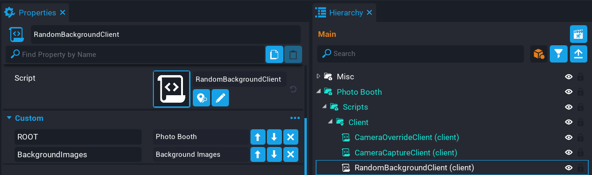{: .center loading="lazy" }

### Edit RandomBackgroundClient Script

Open up the **RandomBackgroundClient** script and add the property references.

```lua
local ROOT = script:GetCustomProperty("ROOT"):WaitForObject()
local BACKGROUND_DURATION = ROOT:GetCustomProperty("BackgroundDuration")
local BACKGROUND_IMAGES = script:GetCustomProperty("BackgroundImages"):WaitForObject()
```

### Create Variables

Add the following variables to the script.

The `images` variable will be a reference to the children of the `BACKGROUND_IMAGES` panel so you can access each image. Because the first image is shown by default, then the `selected` variable can default to the first image in that list.

```lua
local localPlayer = Game.GetLocalPlayer()
local images = BACKGROUND_IMAGES:GetChildren()
local selected = images[1]
local RNG = nil -- (1)
local elapsedTime = 0 -- (2)
```

1. This variable will hold a reference to a [RandomStream](../api/randomstream.md) instance.
2. This variable will be used to keep track of when to change the background image.

### Create ShowRandomImage Function

Create a function called `ShowRandomImage`. This function will select a random image from the `images` list and set the `visibility` to `FORCE_ON`. The previous selected image will be turned off.

[`RandomStream`](../api/randomstream.md) has a few functions to get a random number, because you need a whole number, then you can use the `GetInteger` function and pass in the min and max values (inclusive).

```lua
local function ShowRandomImage()
    if RNG == nil then -- (1)
        return
    end

    local rndImage = images[RNG:GetInteger(1, #images)]

    if rndImage ~= selected then
        selected.visibility = Visibility.FORCE_OFF
        selected = rndImage
        selected.visibility = Visibility.FORCE_ON
    end
end
```

1. If `RNG` is `nil` then return. `RNG` is setup in the `GetData` function.

### Create GetData Function

Create a function called `GetData`. This function will handle receiving data from the server by checking for a key called `photobooth.data`. The reason data is being sent to the client from the server is so that the client receives some important information so that it can display the background images in sync with other players. This is not full proof because of latency (that is player has a poor connection to the server), but it does do a good job of syncing up the background images so that when a player takes a photo, that background image should be the same on all other players screen.

Syncing up background images between players isn't too important. But if you are playing in a party and using voice chat, it improves the experience with the images being in sync.

When the player joins the game, they will be sent information on how much time has elapsed for the current iteration, and also how many mutations has occurred. The reason for the mutation tracking, is that the server has no way to know how many times a background image has changed on the client. By keeping track of the mutations on the server, it can send this to the player and mutate the random stream to sync up with other players.

```lua
local function GetData(player, key)
    if key == "photobooth.data" then
        local data = localPlayer:GetPrivateNetworkedData(key)

        if data ~= nil then
            elapsedTime = data[1] -- (1)
            RNG = RandomStream.New(1) -- (2)

            for m = 1, data[2] do -- (3)
                RNG:Mutate() -- (4)
            end
        end
    end
end
```

1. `data[1]` is the elapsed time from the server.
2. Create a new random stream and set the starting seed to `1` that matches the server seed.
3. `data[2]` is a number that contains the amount of mutations that have happened.
4. Mutate the random stream to get the player in sync with the server and other players.

### Create Tick Function

Create a function called `Tick`. This function will be responsible for keeping track of when to change the background image.

By adding the current `elapsedTime` and `dt` (delta time) to the existing `elapsedTime`, it will increment like a stop watch. If the `elapsed` time is greater than the `BACKGROUND_DURATION` time, then calling `ShowRandomImage` will pick a random image to show behind the player. The variable `elapsedTime` is then reset back to `0` to start a new iteration.

```lua
function Tick(dt)
    if RNG == nil then
        return
    end

    elapsedTime = elapsedTime + dt

    if elapsedTime > BACKGROUND_DURATION then
        ShowRandomImage()
        elapsedTime = 0
    end
end
```

### Connect Private Networked Event

Connect up the `GetData` function to the `privateNetworkedDataChangedEvent` that will call the `GetData` function when the player's private data has changed.

```lua
localPlayer.privateNetworkedDataChangedEvent:Connect(GetData)
```

#### Call GetData Function

If the server has already set the player's private networked data before the client script has ran, then the player will miss the data. To get around this, you can do a manual call to the `GetData` function and pass in `nil` as the first argument because that is not being used, and `photobooth.data` as the section argument for the key to check for.

```lua
GetData(nil, "photobooth.data")
```

### The RandomBackgroundClient Script

??? "RandomBackgroundClient"
    ```lua
    local ROOT = script:GetCustomProperty("ROOT"):WaitForObject()
    local BACKGROUND_DURATION = ROOT:GetCustomProperty("BackgroundDuration")
    local BACKGROUND_IMAGES = script:GetCustomProperty("BackgroundImages"):WaitForObject()

    local localPlayer = Game.GetLocalPlayer()
    local images = BACKGROUND_IMAGES:GetChildren()
    local selected = images[1]
    local RNG = nil
    local elapsedTime = 0

    local function ShowRandomImage()
        if RNG == nil then
            return
        end

        local rndImage = images[RNG:GetInteger(1, #images)]

        if rndImage ~= selected then
            selected.visibility = Visibility.FORCE_OFF
            selected = rndImage
            selected.visibility = Visibility.FORCE_ON
        end
    end

    local function GetData(player, key)
        if key == "photobooth.data" then
            local data = localPlayer:GetPrivateNetworkedData(key)

            if data ~= nil then
                elapsedTime = data[1]
                RNG = RandomStream.New(1)

                for m = 1, data[2] do
                    RNG:Mutate()
                end
            end
        end
    end

    function Tick(dt)
        if RNG == nil then
            return
        end

        elapsedTime = elapsedTime + dt

        if elapsedTime > BACKGROUND_DURATION then
            ShowRandomImage()
            elapsedTime = 0
        end
    end

    localPlayer.privateNetworkedDataChangedEvent:Connect(GetData)

    GetData(nil, "photobooth.data")
    ```

## Create CameraCaptureServer Script

Create a script called `CameraCaptureServer` and place it in the **Server** folder in the **Script** folder.

This script will be responsible for sending the elapsed time and seed mutation count to the player that joins the game.

{: .center loading="lazy" }

### Add Custom Property

The script will need a reference to the **Photo Booth** folder so it can access the **BackgroundDuration** property.

Add the **Photo Booth** as a custom property and name it `ROOT`.

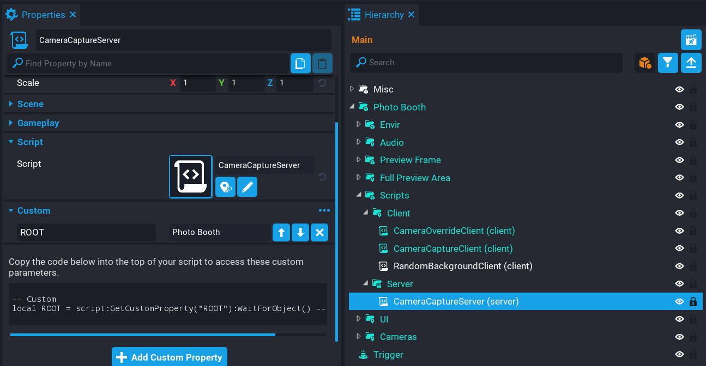{: .center loading="lazy" }

### Edit CameraCaptureServer Script

Open up the **CameraCaptureServer** script and add references to the root and background duration properties.

```lua
local ROOT = script:GetCustomProperty("ROOT"):WaitForObject()
local BACKGROUND_DURATION = ROOT:GetCustomProperty("BackgroundDuration")
```

#### Add Variables

Add the following variables.

```lua
local elapsedTime = 0 -- (1)
local RNG = RandomStream.New(1) -- (2)
local mutations = 0 -- (3)
```

1. The `elapsedTime` will be used to keep track of the time between each image change.
2. Creating a new instance of a [`RandomStream`](../api/randomstream.md) with a seed of `1` to match the client.
3. A counter to keep track of the total seed mutations that has happened. Each `GetInteger` call on the client will mutate the seed, so the server needs to mimic what is happening on the client so that future players that join will get the total mutations sent to them so the background images are in sync.

#### Create TakePhoto Function

Create a function called `TakePhoto`. This function is called when the client broadcasts to the server from the **CameraCaptureClient** script. It will loop through all the players in the game, and broadcast to each player apart from the player who sent the broadcast. The reason for this, is that the player who sent the broadcast does not need to retake their photo.

```lua
local function TakePhoto(photoPlayer)
    for i, player in ipairs(Game.GetPlayers()) do
        if player ~= photoPlayer then
            Events.BroadcastToPlayer(player, "photobooth.takephoto", photoPlayer)
        end
    end
end
```

#### Create OnPlayerJoined Function

Create a function called `OnPlayerJoined` that will be called when a player joins the server. This function will set a private networked data key called `photobooth.data` and pass an object that contains the current `elapsedTime`, and the total `mutations`.

```lua
local function OnPlayerJoined(player)
    player:SetPrivateNetworkedData("photobooth.data", { elapsedTime, mutations })
end
```

#### Create Tick Function

Create a `Tick` function that will mimic the client version of this function. This is done to keep track of the elapsed time and mutations done so that background images remain in sync for all players when selecting a random background.

```lua
function Tick(dt)
    elapsedTime = elapsedTime + dt

    if elapsedTime > BACKGROUND_DURATION then
        elapsedTime = 0
        RNG:Mutate()
        mutations = mutations + 1
    end
end
```

#### Connect Broadcast Event

Connect up the event that is broadcasted from the client to the server so that it calls the `TakePhoto` function. This is fired when a player takes a photo on the client.

```lua
Events.ConnectForPlayer("photobooth.takephoto", TakePhoto)
```

#### Connect Player Joined Event

The server needs to listen for when a player joins the game so that player can receive the data about the `elapsedTime` and `mutations`.

```lua
Game.playerJoinedEvent:Connect(OnPlayerJoined)
```

### The CameraCaptureServer Script

??? "CameraCaptureServer"
    ```lua
    local ROOT = script:GetCustomProperty("ROOT"):WaitForObject()
    local BACKGROUND_DURATION = ROOT:GetCustomProperty("BackgroundDuration")

    local elapsedTime = 0
    local RNG = RandomStream.New(1)
    local mutations = 0

    local function TakePhoto(photoPlayer)
        for i, player in ipairs(Game.GetPlayers()) do
            if player ~= photoPlayer then
                Events.BroadcastToPlayer(player, "photobooth.takephoto", photoPlayer)
            end
        end
    end

    local function OnPlayerJoined(player)
        player:SetPrivateNetworkedData("photobooth.data", { elapsedTime, mutations })
    end

    function Tick(dt)
        elapsedTime = elapsedTime + dt

        if elapsedTime > BACKGROUND_DURATION then
            elapsedTime = 0
            RNG:Mutate()
            mutations = mutations + 1
        end
    end

    Events.ConnectForPlayer("photobooth.takephoto", TakePhoto)

    Game.playerJoinedEvent:Connect(OnPlayerJoined)
    ```

### Test the Game

Test the game and make sure the following work:

1. Background image of the photo booth randomly changes over time.
2. Taking a photo displays on the big preview with the background image displayed.
3. In multiplayer preview, the background images are synced up (or close enough).
4. Taking a photo in multiplayer preview displays the photo and name to the other player in the big preview.

<div class="mt-video" style="width:100%">
    <video autoplay muted playsinline controls loop class="center" style="width:100%">
        <source src="/img/CameraCapture/PhotoBooth/background_test.mp4" type="video/mp4" />
    </video>
</div>

## Create Player Photo Frame

In this section you will be adding a feature that will allow the player to press the ++E++ key and hold a photo of the last picture they took so they can walk around with it and show it off to other players in the game.

### Add Template Property

The **CameraCaptureServer** script needs a reference to a template that will be spawned when the player joins the game. This template will be invisible but attached to the player's right wrist.

1. In **Project Content** find the template called `Player Photo Holder` and add it as a custom property.
2. Name the custom property `LastPhoto`.

{: .center loading="lazy" }

## Create a new Binding

The **Default Binding** set will need a new binding added to detect when the player presses a specific key.

Open up the **Bindings Manager** window from the Window menu, or by double clicking on the Default Binding set in **My Binding Sets** found in the **Project Content** window.

{: .center loading="lazy" }

### Add Binding

From the **Bindings Window**, click on the **Add Bindings** button to add a new row to the binding set.

1. In the **Action** field, enter `Toggle Photo Frame`.
2. From the **Keyboard Primary** drop down, select the **E** key.
3. Enable networking for the binding so it can be detected on the server.

{: .center loading="lazy" }

### Edit CameraCaptureServer Script

Open up the **CameraCaptureServer** script and add a reference to the property.

```lua
local LAST_PHOTO = script:GetCustomProperty("LastPhoto")
```

#### Add Variable

The server script needs to keep track of when the photo frame has been spawned for each player so that when they leave the game it can be destroyed and not just left in the world.

The `players` table will hold information for each player when they join the game.

```lua
local players = {}
```

#### Create OnActionPressed Function

Create a function called `OnActionPressed` that will check which action the player has pressed. If the action matches `Toggle Photo Frame`, then it show or hide the photo frame.

If the player has the photo frame equipment, then it will disable the players mount, otherwise it will allow the player to mount. This is done because animation stances can not be played while the player is mounted, so the photo frame would appear in the wrong position and not look very good.

```lua
local function OnActionPressed(player, action)
    if action == "Toggle Photo Frame" then -- E
        if(players[player.id].visibility == Visibility.FORCE_ON) then
            player.canMount = true
            players[player.id].visibility = Visibility.FORCE_OFF
            player.animationStance = "unarmed_stance"
        elseif(not player.isMounted) then
            player.canMount = false
            players[player.id].visibility = Visibility.FORCE_ON
            player.animationStance = "unarmed_carry_object_low"
        end
    end
end
```

#### Modify OnPlayerJoined Function

Update the **OnPlayerJoined** function. When a player joins, a photo frame is spawned and attached to the players `right_wrist`.

You will want to spawn the template as a networked template so that it is replicated to all players in the game. This can be done by passing in an optional table, and setting `networkContext = NetworkContextType.NETWORKED`. This is really handy because it means you can do this from a server context script.

```lua
local function OnPlayerJoined(player)
    local frame = World.SpawnAsset(LAST_PHOTO, { networkContext = NetworkContextType.NETWORKED })

    frame.name = "Last Photo" -- (1)
    frame:AttachToPlayer(player, "right_wrist")

    players[player.id] = frame -- (2)

    player:SetPrivateNetworkedData("photobooth.data", { elapsedTime, mutations })
end
```

1. Name the frame to `Last Photo` as it will be searched for on the client.
2. Store the asset instance in the `players` table for this player who joined.

#### Create OnPlayerLeft Function

Create a function called `OnPlayerLeft`. This function will be called when a player leaves the game. It will clear up the photo frame from the server by destroying it, and then setting the table entry to `nil` to clear it out.

```lua
local function OnPlayerLeft(player)
    if players[player.id] ~= nil then
        players[player.id]:Destroy()
        players[player.id] = nil
    end
end
```

#### Connect Player Left Event

Connect up the `playerLeftEvent` so that the `OnPlayerLeft` function is called when a player leaves the game.

```lua
Game.playerLeftEvent:Connect(OnPlayerLeft)
```

#### Connect actionPressedEvent

The `actionPressedEvent` needs to be connect so that when the player presses a key, the `OnActionPressed` function is called, which will check which it is.

```lua
Input.actionPressedEvent:Connect(OnActionPressed)
```

#### The CameraCaptureServer Script

??? "CameraCaptureServer"
    ```lua
    local ROOT = script:GetCustomProperty("ROOT"):WaitForObject()
    local BACKGROUND_DURATION = ROOT:GetCustomProperty("BackgroundDuration")
    local LAST_PHOTO = script:GetCustomProperty("LastPhoto")

    local elapsedTime = 0
    local RNG = RandomStream.New(1)
    local mutations = 0

    local players = {}

    local function TakePhoto(photoPlayer)
        for i, player in ipairs(Game.GetPlayers()) do
            if player ~= photoPlayer then
                Events.BroadcastToPlayer(player, "photobooth.takephoto", photoPlayer)
            end
        end
    end

    local function OnActionPressed(player, action)
        if action == "Toggle Photo Frame" then -- E
            if(players[player.id].visibility == Visibility.FORCE_ON) then
                player.canMount = true
                players[player.id].visibility = Visibility.FORCE_OFF
                player.animationStance = "unarmed_stance"
            elseif(not player.isMounted) then
                player.canMount = false
                players[player.id].visibility = Visibility.FORCE_ON
                player.animationStance = "unarmed_carry_object_low"
            end
        end
    end

    local function OnPlayerJoined(player)
        local frame = World.SpawnAsset(LAST_PHOTO, { networkContext = NetworkContextType.NETWORKED })

        frame.name = "Last Photo"
        frame:AttachToPlayer(player, "right_wrist")

        players[player.id] = frame

        player:SetPrivateNetworkedData("photobooth.data", { elapsedTime, mutations })
    end

    local function OnPlayerLeft(player)
        if players[player.id] ~= nil then
            players[player.id]:Destroy()
            players[player.id] = nil
        end
    end

    function Tick(dt)
        elapsedTime = elapsedTime + dt

        if elapsedTime > BACKGROUND_DURATION then
            elapsedTime = 0
            RNG:Mutate()
            mutations = mutations + 1
        end
    end

    Events.ConnectForPlayer("photobooth.takephoto", TakePhoto)

    Game.playerJoinedEvent:Connect(OnPlayerJoined)
    Game.playerLeftEvent:Connect(OnPlayerLeft)

    Input.actionPressedEvent:Connect(OnActionPressed)
    ```

### Test the Game

Test the game by pressing ++E++ to hold the photo. For now it will be a white picture, in the next section you will be modifying the **CameraCaptureClient** script to show the last took photo.

<div class="mt-video" style="width:100%">
    <video autoplay muted playsinline controls loop class="center" style="width:100%">
        <source src="/img/CameraCapture/PhotoBooth/hold_photo_test.mp4" type="video/mp4" />
    </video>
</div>

### Update CameraCaptureClient Script

The **CameraCaptureClient** script needs to be updated so that it displays the last photo the player took when they hold their photo frame out.

Open up the **CameraCaptureClient** script.

#### Create GetPlayerPhotoFrame Function

Create a function called `GetPlayerPhotoFrame` above the `ShowImage` function.

This function will loop over all the objects that are attached to the player and find the object called `Last Photo` and return it. This object is attached to the player when they join the game.

```lua
local function GetPlayerPhotoFrame(player)
    local attachedObjects = player:GetAttachedObjects()

    for i, o in ipairs(attachedObjects) do
        if o.name == "Last Photo" then
            return o
        end
    end
end
```

#### Create UpdatePlayerPhotoFrame Function

Create a function called `UpdatePlayerPhotoFrame` above the `ShowImage` function.

This function will be responsible for updating the UI image for the player who took the photo. It will find the photo frame for the player, and then set the camera capture on the image.

!!! note "If you are using this in an active game, you may want to consider lowering the capture resolution so the capture for the photo frame is not overwritten too quickly."

```lua
local function UpdatePlayerPhotoFrame(player, capture)
    if(capture == nil or not capture:IsValid()) then
        return
    end

    local frame = GetPlayerPhotoFrame(player or localPlayer)

    if frame ~= nil then
        frame:FindDescendantByType("UIImage"):SetCameraCapture(capture)
    end
end
```

#### Modify TakePhoto Function

Modify the `TakePhoto` function so it calls the `UpdatePlayerPhotoFrame` function for the local player. If the it not the local player who took the photo, then it will pass the `player` instead of `nil` to the function.

```lua hl_lines="40 43 44 45"
local function TakePhoto(player)
    if player == nil then
        SHUTTER_AUDIO:Play()
        PlayFlash()
        DisableEnableButton()
    end

    if #captures == maxImages then
        local firstCapture = captures[1]

        if(firstCapture.capture ~= nil and firstCapture.capture:IsValid()) then
            firstCapture.capture:Release()
        end

        table.remove(captures, 1)
    end

    local imageInfo = {

        playerName = (player and player.name) or localPlayer.name,
        capture = CAMERA_CAPTURE:Capture(resolution)

    }

    table.insert(captures, imageInfo)

    if player == nil and imageInfo.capture ~= nil and imageInfo.capture:IsValid() then
        ShowImage(#captures)

        if previewCapture == nil or not previewCapture:IsValid() then
            previewCapture = CAMERA_CAPTURE:Capture(resolution)
        else
            previewCapture:Refresh()
        end

        SCREEN_PREVIEW:SetCameraCapture(previewCapture)
        SCREEN_PREVIEW.visibility = Visibility.FORCE_ON

        UpdateKeyTip()
        UpdatePlayerPhotoFrame(nil, imageInfo.capture)

        Events.BroadcastToServer("photobooth.takephoto")
    else
        UpdatePlayerPhotoFrame(player, imageInfo.capture)
    end
end
```

#### The CameraCaptureClient Script

??? "CameraCaptureClient"
    ```lua
    local ROOT = script:GetCustomProperty("ROOT"):WaitForObject()
    local PHOTO_DURATION = ROOT:GetCustomProperty("PhotoDuration")
    local DISABLE_DURATION = ROOT:GetCustomProperty("DisableDuration")

    local CAMERA_CAPTURE = script:GetCustomProperty("CameraCapture"):WaitForObject()
    local TAKE_PHOTO_BUTTON = script:GetCustomProperty("TakePhotoButton"):WaitForObject()
    local SCREEN_PREVIEW = script:GetCustomProperty("ScreenPreview"):WaitForObject()
    local SHUTTER_AUDIO = script:GetCustomProperty("ShutterAudio"):WaitForObject()
    local FLASH = script:GetCustomProperty("Flash"):WaitForObject()
    local KEY_TIP = script:GetCustomProperty("KeyTip"):WaitForObject()

    local WORLD_PREVIEW = script:GetCustomProperty("WorldPreviewImage"):WaitForObject()
    local WORLD_NAME = script:GetCustomProperty("WorldPreviewText"):WaitForObject()

    local resolution = CameraCaptureResolution.LARGE
    local maxSize = 1024
    local currentSize = 512
    local maxImages = (~~((maxSize ^ 2 << 3) / currentSize ^ 2)) - 1

    local captures = {}
    local previewCapture = nil
    local localPlayer = Game.GetLocalPlayer()
    local currentIndex = 1
    local elapsedTime = 0

    local function PlayFlash()
        Task.Spawn(function()
            FLASH.visibility = Visibility.FORCE_ON
            Task.Wait(.1)
            FLASH.visibility = Visibility.FORCE_OFF
        end)
    end

    local function DisableEnableButton()
        Task.Spawn(function()
            TAKE_PHOTO_BUTTON.isInteractable = false
            TAKE_PHOTO_BUTTON.parent.opacity = .3
            Task.Wait(DISABLE_DURATION)
            TAKE_PHOTO_BUTTON.isInteractable = true
            TAKE_PHOTO_BUTTON.parent.opacity = 1
        end)
    end

    local function UpdateKeyTip()
        if(localPlayer.isMounted) then
            KEY_TIP.text = "Unmount to Hold up Photo"
        else
            KEY_TIP.text = "Press E to Hold up Photo"
        end
    end

    local function GetPlayerPhotoFrame(player)
        local attachedObjects = player:GetAttachedObjects()

        for i, o in ipairs(attachedObjects) do
            if o.name == "Last Photo" then
                return o
            end
        end
    end

    local function UpdatePlayerPhotoFrame(player, capture)
        if(capture == nil or not capture:IsValid()) then
            return
        end

        local frame = GetPlayerPhotoFrame(player or localPlayer)

        if frame ~= nil then
            frame:FindDescendantByType("UIImage"):SetCameraCapture(capture)
        end
    end

    local function ShowImage(index)
        local imageInfo = captures[index or currentIndex]

        if(imageInfo.capture == nil or not imageInfo.capture:IsValid()) then
            return
        end

        WORLD_PREVIEW:SetCameraCapture(imageInfo.capture)
        WORLD_NAME.text = "By " .. imageInfo.playerName

        if not index then
            currentIndex = (currentIndex == #captures and 1) or (currentIndex + 1)
        else
            elapsedTime = 0
        end
    end

    local function TakePhoto(player)
        if player == nil then
            SHUTTER_AUDIO:Play()
            PlayFlash()
            DisableEnableButton()
        end

        if #captures == maxImages then
            local firstCapture = captures[1]

            if(firstCapture.capture ~= nil and firstCapture.capture:IsValid()) then
                firstCapture.capture:Release()
            end

            table.remove(captures, 1)
        end

        local imageInfo = {

            playerName = (player and player.name) or localPlayer.name,
            capture = CAMERA_CAPTURE:Capture(resolution)

        }

        table.insert(captures, imageInfo)

        if player == nil and imageInfo.capture ~= nil and imageInfo.capture:IsValid() then
            ShowImage(#captures)

            if previewCapture == nil or not previewCapture:IsValid() then
                previewCapture = CAMERA_CAPTURE:Capture(resolution)
            else
                previewCapture:Refresh()
            end

            SCREEN_PREVIEW:SetCameraCapture(previewCapture)
            SCREEN_PREVIEW.visibility = Visibility.FORCE_ON

            UpdateKeyTip()
            UpdatePlayerPhotoFrame(nil, imageInfo.capture)

            Events.BroadcastToServer("photobooth.takephoto")
        else
            UpdatePlayerPhotoFrame(player, imageInfo.capture)
        end
    end

    function Tick(dt)
        elapsedTime = elapsedTime + dt

        if #captures > 0 and elapsedTime > PHOTO_DURATION then
            ShowImage()
            elapsedTime = 0
        end
    end

    TAKE_PHOTO_BUTTON.clickedEvent:Connect(function()
        TakePhoto()
    end)

    Events.Connect("photobooth.takephoto", TakePhoto)
    ```

### Test the Game

Test the game to make sure that the last photo the player has took is displayed in the photo frame they are holding.

<div class="mt-video" style="width:100%">
    <video autoplay muted playsinline controls loop class="center" style="width:100%">
        <source src="/img/CameraCapture/PhotoBooth/test_photo_frame_picture.mp4" type="video/mp4" />
    </video>
</div>

## View Bigger Photo

In this section you will create a feature so that the player can open up their captured photo on the screen to see a bigger version by entering a trigger. Players will only be able to interact with the trigger if they have took a photo already.

The UI has already been created which is already in the **Hierarchy** in the folder **Preview Area**.

### Create Trigger

1. Create a **Trigger** inside the **Preview Area** folder.
2. Set the **Position** to **X** `-820`, **Y** `-645`, **Z** `200`.
3. Set the **Scale** to **X** `10`, **Y** `3`, **Z** `3.5`.
4. Set the **Game Collision** to **Force On**.
5. Enable the property **Interactable**.
6. Set the **Interaction Label** to `Take a photo at the booth first.`.

{: .center loading="lazy" }

### Update CameraCaptureClient Script

The **CameraCaptureClient** script needs a reference to the **Preview** image in the **Preview Area** folder so it can set the player's last photo capture.

Add the **Preview** image as a custom property called `ViewPreview`.

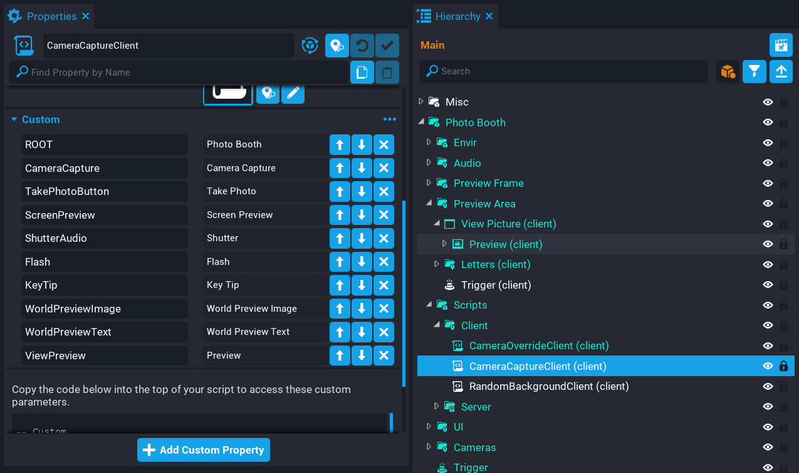{: .center loading="lazy" }

#### Edit CameraCaptureClient Script

Open up the **CameraCaptureClient** script and add a reference to the **ViewPreview** property.

```lua
local VIEW_PREVIEW = script:GetCustomProperty("ViewPreview"):WaitForObject()
```

##### Update TakePhoto Function

Update the **TakePhoto** function so that it sets the capture instance for the **ViewPreview** image, and also sends a broadcast which will be connected in another script.

```lua hl_lines="36 43"
local function TakePhoto(player)
    if player == nil then
        SHUTTER_AUDIO:Play()
        PlayFlash()
        DisableEnableButton()
    end

    if #captures == maxImages then
        local firstCapture = captures[1]

        if(firstCapture.capture ~= nil and firstCapture.capture:IsValid()) then
            firstCapture.capture:Release()
        end

        table.remove(captures, 1)
    end

    local imageInfo = {

        playerName = (player and player.name) or localPlayer.name,
        capture = CAMERA_CAPTURE:Capture(resolution)

    }

    table.insert(captures, imageInfo)

    if player == nil and imageInfo.capture ~= nil and imageInfo.capture:IsValid() then
        ShowImage(#captures)

        if previewCapture == nil or not previewCapture:IsValid() then
            previewCapture = CAMERA_CAPTURE:Capture(resolution)
        else
            previewCapture:Refresh()
        end

        VIEW_PREVIEW:SetCameraCapture(imageInfo.capture)
        SCREEN_PREVIEW:SetCameraCapture(previewCapture)
        SCREEN_PREVIEW.visibility = Visibility.FORCE_ON

        UpdateKeyTip()
        UpdatePlayerPhotoFrame(nil, imageInfo.capture)

        Events.Broadcast("PlayerTookPhoto")
        Events.BroadcastToServer("photobooth.takephoto")
    else
        UpdatePlayerPhotoFrame(player, imageInfo.capture)
    end
end
```

#### The CameraCaptureClient Script

??? "CameraCaptureClient"
    ```lua
    local ROOT = script:GetCustomProperty("ROOT"):WaitForObject()
    local PHOTO_DURATION = ROOT:GetCustomProperty("PhotoDuration")
    local DISABLE_DURATION = ROOT:GetCustomProperty("DisableDuration")

    local CAMERA_CAPTURE = script:GetCustomProperty("CameraCapture"):WaitForObject()
    local TAKE_PHOTO_BUTTON = script:GetCustomProperty("TakePhotoButton"):WaitForObject()
    local SCREEN_PREVIEW = script:GetCustomProperty("ScreenPreview"):WaitForObject()
    local SHUTTER_AUDIO = script:GetCustomProperty("ShutterAudio"):WaitForObject()
    local FLASH = script:GetCustomProperty("Flash"):WaitForObject()
    local KEY_TIP = script:GetCustomProperty("KeyTip"):WaitForObject()

    local WORLD_PREVIEW = script:GetCustomProperty("WorldPreviewImage"):WaitForObject()
    local WORLD_NAME = script:GetCustomProperty("WorldPreviewText"):WaitForObject()
    local VIEW_PREVIEW = script:GetCustomProperty("ViewPreview"):WaitForObject()

    local resolution = CameraCaptureResolution.LARGE
    local maxSize = 1024
    local currentSize = 512
    local maxImages = (~~((maxSize ^ 2 << 3) / currentSize ^ 2)) - 1

    local captures = {}
    local previewCapture = nil
    local localPlayer = Game.GetLocalPlayer()
    local currentIndex = 1
    local elapsedTime = 0

    local function PlayFlash()
        Task.Spawn(function()
            FLASH.visibility = Visibility.FORCE_ON
            Task.Wait(.1)
            FLASH.visibility = Visibility.FORCE_OFF
        end)
    end

    local function DisableEnableButton()
        Task.Spawn(function()
            TAKE_PHOTO_BUTTON.isInteractable = false
            TAKE_PHOTO_BUTTON.parent.opacity = .3
            Task.Wait(DISABLE_DURATION)
            TAKE_PHOTO_BUTTON.isInteractable = true
            TAKE_PHOTO_BUTTON.parent.opacity = 1
        end)
    end

    local function UpdateKeyTip()
        if(localPlayer.isMounted) then
            KEY_TIP.text = "Unmount to Hold up Photo"
        else
            KEY_TIP.text = "Press E to Hold up Photo"
        end
    end

    local function GetPlayerPhotoFrame(player)
        local attachedObjects = player:GetAttachedObjects()

        for i, o in ipairs(attachedObjects) do
            if o.name == "Last Photo" then
                return o
            end
        end
    end

    local function UpdatePlayerPhotoFrame(player, capture)
        if(capture == nil or not capture:IsValid()) then
            return
        end

        local frame = GetPlayerPhotoFrame(player or localPlayer)

        if frame ~= nil then
            frame:FindDescendantByType("UIImage"):SetCameraCapture(capture)
        end
    end

    local function ShowImage(index)
        local imageInfo = captures[index or currentIndex]

        if(imageInfo.capture == nil or not imageInfo.capture:IsValid()) then
            return
        end

        WORLD_PREVIEW:SetCameraCapture(imageInfo.capture)
        WORLD_NAME.text = "By " .. imageInfo.playerName

        if not index then
            currentIndex = (currentIndex == #captures and 1) or (currentIndex + 1)
        else
            elapsedTime = 0
        end
    end

    local function TakePhoto(player)
        if player == nil then
            SHUTTER_AUDIO:Play()
            PlayFlash()
            DisableEnableButton()
        end

        if #captures == maxImages then
            local firstCapture = captures[1]

            if(firstCapture.capture ~= nil and firstCapture.capture:IsValid()) then
                firstCapture.capture:Release()
            end

            table.remove(captures, 1)
        end

        local imageInfo = {

            playerName = (player and player.name) or localPlayer.name,
            capture = CAMERA_CAPTURE:Capture(resolution)

        }

        table.insert(captures, imageInfo)

        if player == nil and imageInfo.capture ~= nil and imageInfo.capture:IsValid() then
            ShowImage(#captures)

            if previewCapture == nil or not previewCapture:IsValid() then
                previewCapture = CAMERA_CAPTURE:Capture(resolution)
            else
                previewCapture:Refresh()
            end

            VIEW_PREVIEW:SetCameraCapture(imageInfo.capture)
            SCREEN_PREVIEW:SetCameraCapture(previewCapture)
            SCREEN_PREVIEW.visibility = Visibility.FORCE_ON

            UpdateKeyTip()
            UpdatePlayerPhotoFrame(nil, imageInfo.capture)

            Events.Broadcast("PlayerTookPhoto")
            Events.BroadcastToServer("photobooth.takephoto")
        else
            UpdatePlayerPhotoFrame(player, imageInfo.capture)
        end
    end

    function Tick(dt)
        elapsedTime = elapsedTime + dt

        if #captures > 0 and elapsedTime > PHOTO_DURATION then
            ShowImage()
            elapsedTime = 0
        end
    end

    TAKE_PHOTO_BUTTON.clickedEvent:Connect(function()
        TakePhoto()
    end)

    Events.Connect("photobooth.takephoto", TakePhoto)
    ```

### Create ViewPictureClient Script

Create a script called `ViewPictureClient` and place it into the **Client** folder in the **Hierarchy**. This script will be responsible for showing the UI to the player when they interact with the trigger to view their picture.

Some custom properties need to be added so the script can reference them.

1. Add the **View Picture** UI Container as a custom property, and name it `ViewPicture`.
2. Add the **Trigger** that is inside the **Preview Area** as a custom property, and name it `Trigger`.
3. Add the **Close Button** as a custom property, and name it `CloseButton`.

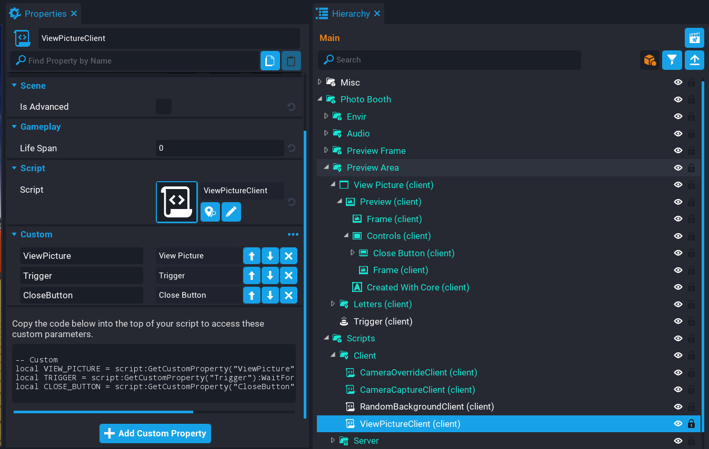{: .center loading="lazy" }

#### Edit ViewPictureClient Script

Open up the **ViewPictureClient** script and add the property references.

```lua
local VIEW_PICTURE = script:GetCustomProperty("ViewPicture"):WaitForObject()
local TRIGGER = script:GetCustomProperty("Trigger"):WaitForObject()
local CLOSE_BUTTON = script:GetCustomProperty("CloseButton"):WaitForObject()
```

##### Add Variables

Add the following variables.

```lua
local localPlayer = Game.GetLocalPlayer()
local inTrigger = false -- (1)
local canOpen = false -- (2)
```

1. When the player enters the volume of the trigger, this will be set to true.
2. If the player has a photo, then this will be set to true so the UI can be opened.

##### Create CloseUI Function

Create a function called `CloseUI` that will set the `visibility` of the `VIEW_PICTURE` UI to `FORCE_OFF`. It will also reset the `isInteractable` property depending on if the player is inside the trigger or not. If they are inside the trigger, then the label would need to show up for that player.

```lua
local function CloseUI()
    VIEW_PICTURE.visibility = Visibility.FORCE_OFF

    if inTrigger then
        TRIGGER.isInteractable = true
    else
        TRIGGER.isInteractable = false
    end

    UI.SetCursorVisible(false)
    UI.SetCanCursorInteractWithUI(false)
end
```

##### Create OnInteracted Function

Create a function called `OnInteracted`. This function will check of the `obj` in the trigger volume is the `localPlayer`. The reason for this check, is because other players can trigger this for each other which you don't want.

```lua
local function OnInteracted(trigger, obj)
    if inTrigger and Object.IsValid(obj) and obj:IsA("Player") and obj == localPlayer then
        VIEW_PICTURE.visibility = Visibility.FORCE_ON
        TRIGGER.isInteractable = false

        UI.SetCursorVisible(true)
        UI.SetCanCursorInteractWithUI(true)
    end
end
```

##### Create OnExitTrigger Function

Create a function called `OnExitTrigger` that will handle closing the UI.

```lua
local function OnExitTrigger(trigger, obj)
    if Object.IsValid(obj) and obj:IsA("Player") and obj == localPlayer then
        inTrigger = false
        CloseUI()
    end
end
```

##### Create OnEnterTrigger Function

Create a function called `OnEnterTrigger`. This function will be called when the player enters the volume of the trigger. It will check to see if the UI can open, and if so, change the `interactionLabel` property. The reason for the `canOpen` variable check, is that if a player has not took a photo at the photo booth, then they will not have a photo to view.

```lua
local function OnEnterTrigger(trigger, obj)
    if Object.IsValid(obj) and obj:IsA("Player") and obj == localPlayer then
        if canOpen then
            TRIGGER.interactionLabel = "View photo."
            TRIGGER.isInteractable = true
            inTrigger = true
        else
            TRIGGER.interactionLabel = "Take a photo at the booth first."
        end
    end
end
```

##### Create SetCanOpenUI Function

Create a function called `SetCanOpenUI`. This function will be called when the broadcast event `PlayerTookPhoto` is triggered. It will set the `canOpen` variable to `true`, and the `interactionLabel` text, meaning that now the player can open the UI to view their photo they took.

```lua
local function SetCanOpenUI()
    canOpen = true
    TRIGGER.interactionLabel = "View photo."
end
```

##### Connect Trigger Events

Connect up the trigger events so they are called when the player interacts, enters, and leaves the trigger.

```lua
TRIGGER.interactedEvent:Connect(OnInteracted)
TRIGGER.endOverlapEvent:Connect(OnExitTrigger)
TRIGGER.beginOverlapEvent:Connect(OnEnterTrigger)
```

##### Connect Button Event

Connect up the `clickedEvent` so that the player is able to close the UI by clicking a button.

```lua
CLOSE_BUTTON.clickedEvent:Connect(CloseUI)
```

##### Connect Broadcast Event

Connect the broadcast event `PlayerTookPhoto`. This event is broadcasted from the `CameraCaptureClient` script the local player has took a photo. This will call the `SetCanOpenUI` which will enable the UI to be opened by the player.

```lua
Events.Connect("PlayerTookPhoto", SetCanOpenUI)
```

#### The ViewPictureClient Script

??? "ViewPictureClient"
    ```lua
    local VIEW_PICTURE = script:GetCustomProperty("ViewPicture"):WaitForObject()
    local TRIGGER = script:GetCustomProperty("Trigger"):WaitForObject()
    local CLOSE_BUTTON = script:GetCustomProperty("CloseButton"):WaitForObject()

    local localPlayer = Game.GetLocalPlayer()
    local inTrigger = false
    local canOpen = false

    local function CloseUI()
        VIEW_PICTURE.visibility = Visibility.FORCE_OFF

        if inTrigger then
            TRIGGER.isInteractable = true
        else
            TRIGGER.isInteractable = false
        end

        UI.SetCursorVisible(false)
        UI.SetCanCursorInteractWithUI(false)
    end

    local function OnInteracted(trigger, obj)
        if inTrigger and Object.IsValid(obj) and obj:IsA("Player") and obj == localPlayer then
            VIEW_PICTURE.visibility = Visibility.FORCE_ON
            TRIGGER.isInteractable = false

            UI.SetCursorVisible(true)
            UI.SetCanCursorInteractWithUI(true)
        end
    end

    local function OnExitTrigger(trigger, obj)
        if Object.IsValid(obj) and obj:IsA("Player") and obj == localPlayer then
            inTrigger = false
            CloseUI()
        end
    end

    local function OnEnterTrigger(trigger, obj)
        if Object.IsValid(obj) and obj:IsA("Player") and obj == localPlayer then
            if canOpen then
                TRIGGER.interactionLabel = "View photo."
                TRIGGER.isInteractable = true
                inTrigger = true
            else
                TRIGGER.interactionLabel = "Take a photo at the booth first."
            end
        end
    end

    local function SetCanOpenUI()
        canOpen = true
        TRIGGER.interactionLabel = "View photo."
    end

    TRIGGER.interactedEvent:Connect(OnInteracted)
    TRIGGER.endOverlapEvent:Connect(OnExitTrigger)
    TRIGGER.beginOverlapEvent:Connect(OnEnterTrigger)

    CLOSE_BUTTON.clickedEvent:Connect(CloseUI)

    Events.Connect("PlayerTookPhoto", SetCanOpenUI)
    ```

### Test the Game

Test the game to make sure the following work:

1. The preview UI can not be opened until a photo has been took.
2. The preview UI can be opened and closed after taking a photo.

<div class="mt-video" style="width:100%">
    <video autoplay muted playsinline controls loop class="center" style="width:100%">
        <source src="/img/CameraCapture/PhotoBooth/final_test.mp4" type="video/mp4" />
    </video>
</div>

## Summary

Using camera capturing in your game can lead to some interesting features. In this case it was about standing in front of an image to take a picture, and then progressed into making it a multiplayer experience so other players could see each others pictures.

The are a wide range of uses for camera captures, from inventory icons, photo booth, galleries, and many more ideas.

Consider improving on the photo booth to use 3D scenes behind the player instead of background images. You could setup multiple photo booths in your game. Experiment and see what you can come up with.

## Learn More

[Camera Captures Tutorial](../tutorials/camera_capture_basics.md) | [Icon Generator Tutorial](../tutorials/icon_generator.md) | [Camera Reference](../references/cameras_and_settings.md) | [Camera Capture API](../api/cameracapture.md) | [Camera API](../api/camera.md) | [Camera Capture Resolution](../api/enums.md#cameracaptureresolution) [RandomStream API](../api/randomstream.md) | [Binding Sets](../references/binding_sets.md)
