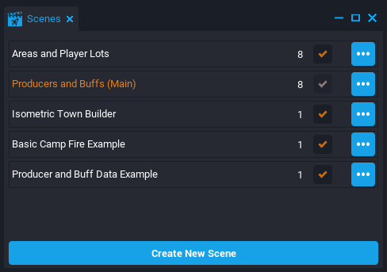
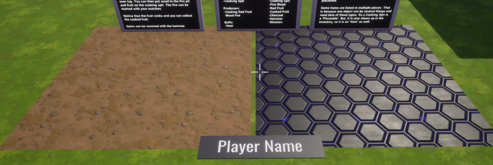
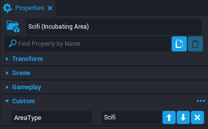
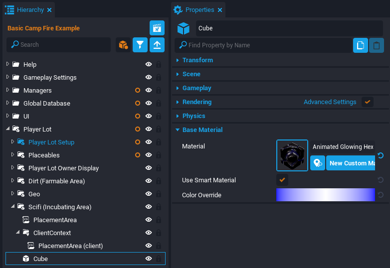
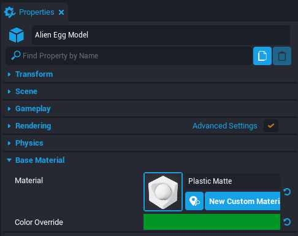
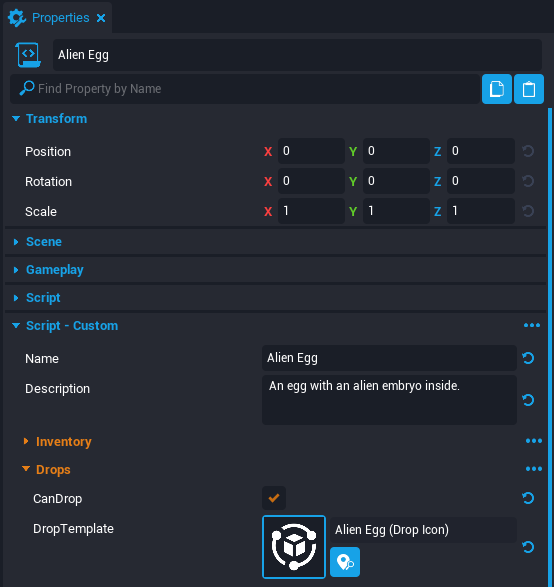
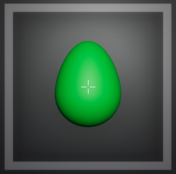

# Producers, Buffs and Areas Tutorial

<!--- TODO add video --->

## Overview

In this tutorial, you learn about the [Producers, Buffs, and Areas](../references/producers.md) Example Project which builds off the [Gatherables and Inventory](../references/gatherables.md) Example Project. The project allows creators to design games around **producers** which transform items into different items over time, **buffs** which provide customizable restrictions on the producers, and **areas** which allow the world space to be divided into distinct pieces which can be loaded on demand.

This tutorial will be breaking apart an example scene where the player can light a camp fire and cook fruit on the fire. This tutorial will make a similar Producer that can raise Alien Eggs to become Alien Raptors.

* **Completion Time:** ~2 hour
* **Knowledge Level:** No Lua scripting involved, but basic [Core Editor](../getting_started/editor_intro.md) knowledge is recommended.
* **Skills you will learn:**
    * Creating **Inventory Items**
    * Creating a **Placeable Area**
    * Creating a **Producer** item
    * Creating **Placeable** items
    * Creating a **Buff**
    * Using a **3D Icon Generator**

## Creating a New Producers, Buffs and Areas Project

### Download from the CREATE Menu

The **Producers, Buffs and Areas** Example Project can be found in the **CREATE** menu alongside the Empty and Framework project options.

1. In Core, click the **CREATE** tab at the top to open options for new and existing projects.
2. In the top bar menu of **CREATE**, select **NEW PROJECT**.
3. In the **EXAMPLE PROJECTS** section, select **Producers, Buffs and Areas**.
4. Give the project a name in the **Name** field and press the **CREATE** button.

{: .center loading="lazy" }

### Open the Basic Camp Fire Example

The project is divided into Scenes which showcase distinct ways the Producers, Buffs and Areas systems can be used to create gameplay. To access the **Scenes** window, click **Window** in the top toolbar and select **Scenes**. Double-click the **Basic Camp Fire Example** to the load the correct scene.

{: .center loading="lazy" }

### Test the Cooked Fruit System

The Basic Camp Fire Example scene has a working example where the player can cook fruit. This tutorial uses the cooking fruit example as a guide to make a similar system.

Test the game and make sure the following works.

1. Use the **number keys** to equip items in the **Hotbar Inventory** displayed at the bottom.
2. Press ++I++ to toggle **Inventory Mode** to equip or drop items with the mouse.
3. Use the **left mouse button** to place/use items down when applicable.
4. Place a **Campfire Ring** item on the **Dirt** area and then place the **Fire Spit** item on top of it.
5. Place **Firewood** into the campfire ring and light it with the **Matches**.
6. Place the **Red Fruit** item onto the fire spit.
7. Collect the **Cooked Fruit** and wait for the fire to burn out to collect **Charcoal**.
8. Relight a new fire and place another fruit. This time do not collect until the fruit burns.
9. Use the **Hammer** item to break down and collect placed items.

    <video autoplay muted playsinline controls loop class="center" style="width:100%">
        <source src="/img/ProducersTutorial/Producer_FruitExample.mp4" type="video/mp4" />
    </video>

!!! warning
    While in Preview Mode, players can press ++F1++ to **reset the Player's Data**. This is useful for testing new items or features in the game. However, this should be removed before publishing a game.

## Creating a Scifi Placeable Area

Currently there is a single **Player Lot** with a **Dirt Placeable Area** within it. This signifies where the player can place certain items and have it be saved between play sessions. There will be a new **Scifi Placeable Area** in the same Player Lot that will handle the Alien Raptor production.

{: .center loading="lazy" }

### Duplicate the Dirt Placeable Area

In the Hierarchy, expand the **Player Lot** group. Select the **Dirt (Farmable Area)** group and duplicate it using ++Ctrl+W++. Rename the duplicated group to `Scifi (Incubating Area)`.

{: .center loading="lazy" }

### Modify the Scifi Area Properties

Select the **Scifi (Incubating Area)** group and open the **Properties** window. Set the custom **AreaType** property to `Scifi`.

{: .center loading="lazy" }

### Modify the Scifi Area Material

Inside the **Scifi (Incubating Area)** group, select the **Cube** object and open the **Properties** window. Set the **Material** property to `Animated Glowing Hex`.

{: .center loading="lazy" }

### Transform the Areas

The Dirt and Scifi areas are on top of each other. The cubes for each of these areas need to be resized and moved so they are both visible side by side.

1. Select the **Cube** within the **Scifi (Incubating Area)** group.
2. Activate **Scale Mode** by pressing ++R++ and shorten the width of the cube by half.
3. Activate **Translation Mode** by pressing ++W++ and move the cube to the side.
4. Select the **Cube** within the **Dirt (Farmable Area)** group.
5. Activate **Scale Mode** by pressing ++R++ and shorten the width of the cube by half.
6. Activate **Translation Mode** by pressing ++W++ and move the cube to the side.

{: .center loading="lazy" }

## Creating an Alien Egg

The Alien Egg is an item starting in the player's inventory. It needs 3 templates for being held in the player's hand, dropped on the floor, and seen in the inventory slot.

The Red Fruit item already has these three templates. Note they all have the same art model but are transformed to the desired context (e.g. laying on the ground or placed in the player's hand).

{: .center loading="lazy" }

### Create the Art Model

The art model for the egg is a simple mesh shape with a material on it.

1. Open the **Core Content** window and search for `Ovoid 01`.
2. Drag and drop the mesh into the **Hierarchy**.
3. Rename the mesh to `Alien Egg Model`.
4. Select the mesh and open the **Properties** window.
5. Set the **Material** property to `Plastic Matte`.
6. Set the **Color Override** property to a green color.

{: .center loading="lazy" }

### Duplicate the Red Fruit Item

In the Hierarchy, open the **Global Database** folder and then expand the **Items** script. Any item that is placed in the inventory needs data in this group. Right click the **Red Fruit** script and select **Duplicate**. Rename the duplicated Red Fruit script to `Alien Egg`.

{: .center loading="lazy" }

### Examine the Alien Egg Properties

Select the Alien Egg and open the Properties window. There are many custom properties for each item.

| Property Name | Description |
| --- | --- |
| CanDrop | Activate if the Item can be dropped from the Inventory. |
| DropTemplate | The template that spawns on the ground when an Item is dropped from the Inventory. |
| IconAsset | The template that appears in the Inventory slot. Can be a Kitbashed 2D Icon, 3D Icon, or an Image Icon. |
| IsKitbashed2DIcon | Activate if IconAsset is a Kitbashed 2D Icon. |
| Is3DIcon | Activate if IconAsset is 3D Icon. |
| IsImageIcon | Activate if IconAsset is an Image Icon. |
| CanEquip | Activate if the player can equip the item by selecting it in the Inventory. |
| EquipmentVisualTemplate | The template spawned on the player when an item is equipped. |

### Change the Name and Description

Set the **Name** property to `Alien Egg`. Then set the **Description** property to `An egg with an alien embryo inside.`.

{: .center loading="lazy" }

### Change the Drop Template

The **DropTemplate** property should already have a template from the Red Fruit item named **Product - Fresh Red Fruit (Drop Icon)**. The template contains a Geo group with the mesh displaying the red fruit item on the ground.

1. Click the **Find in Asset Catalog** button  to the right of the **DropTemplate** property to open the Project Content window with the template selected.
{: .image-inline-text .image-background }
2. Drag and drop the **Product - Fresh Red Fruit (Drop Icon)** template into the scene besides the Alien Egg Model.
3. Right click the template and select **Deinstance This Object**.
4. Right click the **Alien Egg Model** in the Hierarchy and select **Duplicate**.
5. Drag and drop the duplicated Alien Egg Model into the **Geo** folder of the **Product - Fresh Red Fruit (Drop Icon)**.
6. Position the duplicated Alien Egg Model to be on top of the red fruit (Basic Pepper 02).
7. Resize the duplicated Alien Egg Model to the desired in-game size.
8. Delete the **Basic Pepper 02** mesh from the Geo folder.
9. Right click **Product - Fresh Red Fruit (Drop Icon)** and select **Create New Template From This**.
10. Name the template `Alien Egg (Drop Icon)`.
11. Delete the **Alien Egg (Drop Icon)** template from the Hierarchy.
12. Search the Hierarchy for the `Alien Egg` script and open the Properties window.
13. Set the **DropTemplate** property to **Alien Egg (Drop Icon)**.

{: .center loading="lazy" }

### Change the Icon Asset

The **Icon Asset** template has three different options to display an inventory icon. The option used for the red fruit template requires knowledge of the **Icon Generator**.

!!! info "The Icon Generator"
    The Icon Generator is a component used to render 3D icons. It uses a remote camera in a black box to capture an image of a template. The black box should be moved in a published project to a place out of sight.

{: .center loading="lazy" }

#### Duplicate the Icon Asset

The template for the **Icon Asset** is usually a particular size to get a clear capture on the camera. This is why using the red fruit's Icon Asset template as a base will make the process easier.

1. Open the **Project Content** window and search for `Product - Fresh Red Fruit (Inventory Icon)`.
2. Drag and drop the **Product - Fresh Red Fruit (Inventory Icon)** template into the scene besides the Alien Egg Model.
3. Right click the **Product - Fresh Red Fruit (Inventory Icon)** and select **Deinstance This Object**.
4. Right click the **Alien Egg Model** in the Hierarchy and select Duplicate.
5. Drag and drop the duplicated Alien Egg Model into the **Geo** folder of the **Product - Fresh Red Fruit (Inventory Icon)**.
6. Position the duplicated Alien Egg Model to be on top of the red fruit (Basic Pepper 02).
7. Resize the duplicated Alien Egg Model to match the red fruit.
8. Delete the **Basic Pepper 02** mesh from the Geo folder.
9. Right click **Product - Fresh Red Fruit (Inventory Icon)** and select **Create New Template From This**.
10. Name the template `Alien Egg (Inventory Icon)`.
11. Delete the **Alien Egg (Inventory Icon)** template from the Hierarchy.
12. Search the Hierarchy for the `Alien Egg` script and open the Properties window.
13. Set the **IconAsset** property to **Alien Egg (Inventory Icon)**.

{: .center loading="lazy" }

#### Visualize the Icon

As long as the **Alien Egg (Inventory Icon)** matched the red fruit Icon Asset template, then it will most likely produce a clear inventory icon. However, it is good to know how the **Icon Generator** is placing the template in front of the capturing camera in case adjustments are needed.

1. In the Hierarchy, expand the **UI** folder and right click the **Icon Generator** and select **Desinstance This Object**.
2. Inside the Icon Generator, expand the **ClientContent** group and find the **Icon Container** group.
3. Open the Project Content window and search for `Alien Egg (Inventory Icon)`.
4. Drag and drop the template into the **Icon Container** group in the Hierarchy.
5. Select the **Alien Egg (Inventory Icon)** and press ++F++ to focus the editor camera on it. The model should be centered and contained inside a gray box indicating the capture frame.
6. If necessary, adjust the **Alien Egg Model** and update the **Alien Egg (Inventory Icon)** template.
7. Delete the **Alien Egg (Inventory Icon)** template from the Hierarchy.

{: .center loading="lazy" }

### Change the Equipment Visual Template

The **Equipment Visual Template** is the attached player equipment if an item is selected. The red fruit's equipment has a specific position and rotation to fit in the player's hand.

1. Click the **Find in Asset Catalog** button  to the right of the **EquipmentVisualTemplate** property to open the Project Content window with the template selected.
{: .image-inline-text .image-background }
2. Drag and drop the **Product - Fresh Red Fruit (Held)** template into the scene besides the Alien Egg Model.
3. Right click the template and select **Deinstance This Object**.
4. Right click the **Alien Egg Model** in the Hierarchy and select Duplicate.
5. Drag and drop the duplicated Alien Egg Model into the **Geo** folder of the **Product - Fresh Red Fruit (Held)**.
6. Position the duplicated Alien Egg Model to be on top of the red fruit (Basic Pepper 02).
7. Resize the duplicated Alien Egg Model to the desired in-game size.
8. Delete the **Basic Pepper 02** mesh from the Geo folder.
9. Right click **Product - Fresh Red Fruit (Held)** and select **Create New Template From This**.
10. Name the template `Alien Egg (Held)`.
11. Delete the **Alien Egg (Held)** template from the Hierarchy.
12. Search the Hierarchy for the `Alien Egg` script and open the Properties window.
13. Set the **EquipmentVisualTemplate** property to **Alien Egg (Held)**.

{: .center loading="lazy" }

## Starting with an Alien Egg

The Alien Egg item is ready to be tested, but there's currently no way to access it in game. The player should start with an Alien Egg in their **Hotbar Inventory**.

### Remove the Starting Items

The starting items in the **Hotbar Inventory** are located in Hierarchy. They should be removed to make room for new items, except the **Hammer** which will be used to remove placeable items.

1. In the Hierarchy, open the **Managers** folder.
2. Open the **Inventory and Currency** folder.
3. Open the **Hotbar Settings** group.
4. Expand the **Starting Items** script to see all the starting items data.
5. Delete all items **except the Hammer**.
6. Preview the game and press ++F1++ to **reset the player data**.

!!! info "Starting items will not change until the player data is reset."

{: .center loading="lazy" }

### Add the Alien Egg to Hotbar

There is a default script in the project that can add a new starting item to the Hotbar Inventory.

1. Search the **Project Content** for a script named `StartingItemData`.
2. Drag and drop into the Starting Items script parent for Hotbar Settings.
3. Rename the script to `Alien Egg`.
4. Open the **Properties** window.
5. Set the **ItemId** property to `Alien Egg`.
6. Set the **SlotIndex** property to `2`.
7. Set the **Amount** property to `99`.
8. Preview the game and press ++F1++ to **reset the player data**.

{: .center loading="lazy" }

### Test the Alien Egg Templates

Now that the Alien Egg is in Hotbar Inventory, it can be tested to see the three templates created earlier.

- **Alien Egg (Inventory Icon)** is visible in the Hotbar Inventory near the bottom of the screen.
- **Alien Egg (Held)** is on the player's hand when selected in the inventory.
- **Alien Egg (Drop Icon)** appears when the player drags the item outside the inventory (Press ++I++ to enter Inventory Mode).

!!! tip
    If any of the templates seem out of place (wrong position or scale), then drag the template into the scene. Make any changes necessary and update the template. Also, be sure to press ++F1++ while playing to reset the player data and update those changes.

    <video autoplay muted playsinline controls loop class="center" style="width:100%">
        <source src="/img/ProducersTutorial/Producer_AlienEgg.mp4" type="video/mp4" />
    </video>

## Creating a Burnt Egg

Once the Alien Egg item is correct, the next item will be a **Burnt Egg** which is very similar.

### Create the Item Templates

The Burnt Egg will need 3 templates for the drop object, inventory icon, and held object. The Alien Egg templates can be used with some slight modifications.

#### Drop Object

1. Search the **Project Content** for `Alien Egg (Drop Icon)` and place it into the scene.
2. Select the **Alien Egg Model** child and open the **Properties** window.
3. Set the **Material** property to `Asphalt 01`.
4. Set the **Color Override** property to black.
5. Right click the **Alien Egg (Drop Icon)** template and select **Create New Template From This**.
6. Rename the template to `Burnt Egg (Drop Icon)`.
7. Delete the **Burnt Egg (Drop Icon)** template from Hierarchy.

<!--- TODO add pic --->

#### Inventory Icon

1. Search the **Project Content** for `Alien Egg (Inventory Icon)` and place it into the scene.
2. Select the **Alien Egg Model** child and open the **Properties** window.
3. Set the **Material** property to `Asphalt 01`.
4. Set the **Color Override** property to black.
5. Right click the **Alien Egg (Inventory Icon)** template and select **Create New Template From This**.
6. Rename the template to `Burnt Egg (Inventory Icon)`.
7. Delete the **Burnt Egg (Inventory Icon)** template from Hierarchy.

<!--- TODO add pic --->

#### Held Object

1. Search the **Project Content** for `Alien Egg (Held)` and place it into the scene.
2. Select the **Alien Egg Model** child and open the **Properties** window.
3. Set the **Material** property to `Asphalt 01`.
4. Set the **Color Override** property to black.
5. Right click the **Alien Egg (Held)** template and select **Create New Template From This**.
6. Rename the template to `Burnt Egg (Held)`.
7. Delete the **Burnt Egg (Held)** template from Hierarchy.

<!--- TODO add pic --->

### Create the Item Data

With the templates created, the Burnt Egg item is ready to be added to the database of items.

1. Open the **Global Database** folder in the Hierarchy.
2. Expand the **Items** script to see its children.
3. Right click the **Alien Egg** script and select **Duplicate**.
4. Rename the duplicated script to `Burnt Egg`.

<!--- TODO add pic --->

### Set the Item Properties

1. Select the **Burnt Egg** script and open the **Properties** window.
2. Set the **Name** property to `Burnt Egg`.
3. Set the **Description** property to `An egg shaped charcoal`.
4. Set the **DropTemplate** property to `Burnt Egg (Drop Icon)`.
5. Set the **IconAsset** property to `Burnt Egg (Inventory Icon)`.
6. Set the **EquipmentVisualTemplate** property to `Burnt Egg (Held)`.

<!--- TODO add pic --->

### Add to Starting Items

The Burnt Egg item is now ready to be tested so it will need to be added as a starting item in the **Hotbar Inventory**.

1. In the Hierarchy, search for the `Starting Items` script under the **Hotbar Settings** group.
2. Right click the **Alien Egg** script and select **Duplicate**.
3. Rename the duplicated script to `Burnt Egg`.
4. Select the **Burnt Egg** script and open the Properties window.
5. Set the ItemId property to Burnt Egg.
6. Set the SlotIndex property to 3.

<!--- TODO add pic --->

### Test the Burnt Egg

Preview the project and make sure to press ++F1++ to reset the player data. Make sure the three templates (Drop, Inventory, and Held) are all working.

<!--- TODO add video --->

## Creating an Alien Raptor

The next item needed is an **Alien Raptor** that is born if the Alien Egg is incubated for the right amount of time. The Alien Raptor will not be equippable so an equipment template is not needed.

### Create the Art Model

Search **Core Content** for the `Raptor Mob` animated mesh. Drag and drop the mesh into the scene. Rename the mesh to `Alien Raptor Model`.

<!--- TODO add pic --->

### Create a Drop Template

1. Search **Project Content** for `Burnt Egg (Drop Icon)` template.
2. Drag and drop the **Burnt Egg (Drop Icon)** template into the scene besides the Alien Raptor Model.
3. Right click the template and select **Deinstance This Object**.
4. Right click the **Alien Raptor Model** in the Hierarchy and select Duplicate.
5. Drag and drop the duplicated Alien Raptor Model into the **Geo** folder of the **Burnt Egg (Drop Icon)**.
6. Position the duplicated Alien Raptor Model to be on top of the burnt egg mesh.
7. Resize the duplicated Alien Egg Model to the desired in-game size.
8. Delete the **Alien Egg Model** mesh from the Geo folder.
9. Right click **Burnt Egg (Drop Icon)** and select **Create New Template From This**.
10. Name the template `Alien Raptor (Drop Icon)`.
11. Delete the **Alien Raptor (Drop Icon)** template from the Hierarchy.

<!--- TODO add pic --->

### Create an Inventory Icon

1. Open the Project Content window and search for `Burnt Egg (Inventory Icon)`.
2. Drag and drop the **Burnt Egg (Inventory Icon)** template into the scene besides the Alien Raptor Model.
3. Right click the **Burnt Egg (Inventory Icon)** and select **Deinstance This Object**.
4. Right click the **Alien Raptor Model** in the Hierarchy and select Duplicate.
5. Drag and drop the duplicated Alien Raptor Model into the **Geo** folder of the **Burnt Egg (Inventory Icon)**.
6. Position the duplicated Alien Raptor Model to be on top of the burnt egg.
7. Resize the duplicated Alien Raptor Model to match the burnt egg.
8. Delete the **Alien Egg Model** mesh from the Geo folder.
9. Right click **Burnt Egg (Inventory Icon)** and select **Create New Template From This**.
10. Name the template `Alien Raptor (Inventory Icon)`.
11. Delete the **Alien Raptor (Inventory Icon)** template from the Hierarchy.

### Create the Item Data

1. Open the **Global Database** folder in the Hierarchy.
2. Expand the **Items** script to see its children.
3. Right click the **Alien Egg** script and select **Duplicate**.
4. Rename the duplicated script to `Alien Raptor`.

<!--- TODO add pic --->

### Set the Item Properties

1. Select the **Alien Raptor** script and open the **Properties** window.
2. Set the **Name** property to `Alien Raptor`.
3. Set the **Description** property to `A creature from another planet.`.
4. Set the **DropTemplate** property to `Burnt Egg (Drop Icon)`.
5. Set the **IconAsset** property to `Burnt Egg (Inventory Icon)`.
6. Set the **EquipmentVisualTemplate** property to Empty Asset Reference by pressing the **Revert to Default** button on the far right <!--- TODO add icon --->.

<!--- TODO add pic --->

### Add to Starting Items

1. In the Hierarchy, search for the `Starting Items` script under the **Hotbar Settings** group.
2. Right click the **Alien Egg** script and select **Duplicate**.
3. Rename the duplicated script to `Alien Raptor`.
4. Select the **Alien Raptor** script and open the Properties window.
5. Set the **ItemId** property to `Alien Raptor`.
6. Set the **SlotIndex** property to `4`.

<!--- TODO add pic --->

### Test the Alien Raptor

Preview the project and make sure to press ++F1++ to reset the player data.

<!--- TODO add video --->

## Creating an Incubator

The Incubator is an item that is droppable and placeable. The key difference is that a dropped item is deleted once the player leaves the game, while a placeable item is saved for the next play session.

### Create an Art Model

Search **Core Content** for `Sci-fi Chest Common Base 01` mesh. Place the mesh into the scene and rename it to `Incubator Model`.

<!--- TODO add pic --->

### Create a Drop Template

1. Search **Project Content** for `Burnt Egg (Drop Icon)` template.
2. Drag and drop the **Burnt Egg (Drop Icon)** template into the scene besides the Incubator Model.
3. Right click the template and select **Deinstance This Object**.
4. Right click the **Incubator Model** in the Hierarchy and select Duplicate.
5. Drag and drop the duplicated Incubator Model into the **Geo** folder of the **Burnt Egg (Drop Icon)**.
6. Position the duplicated Incubator Model to be on top of the burnt egg mesh.
7. Resize the duplicated Incubator Model to the desired in-game size.
8. Delete the **Alien Egg Model** mesh from the Geo folder.
9. Right click **Burnt Egg (Drop Icon)** and select **Create New Template From This**.
10. Name the template `Incubator (Drop Icon)`.
11. Delete the **Incubator (Drop Icon)** template from the Hierarchy.

<!--- TODO add pic --->

### Create the Item Data

1. Open the **Global Database** folder in the Hierarchy.
2. Expand the **Items** script to see its children.
3. Right click the **Alien Egg** script and select **Duplicate**.
4. Rename the duplicated script to `Incubator`.

<!--- TODO add pic --->

### Set the Item Properties

!!! info "An item can use UI Images for the Inventory Icon instead of capturing a 3D render."

1. Select the **Incubator** script and open the **Properties** window.
2. Set the **Name** property to `Incubator`.
3. Set the **Description** property to `A machine to raise eggs.`.
4. Set the **DropTemplate** property to `Incubator (Drop Icon)`.
5. Set the **IconAsset** property to `Sci-fi Container 001`.
6. Set the **Is3DIcon** to inactive.
7. Set the **IsImageIcon** to active.
8. Set the **EquipmentVisualTemplate** property to Empty Asset Reference by pressing the **Revert to Default** button on the far right <!--- TODO add icon --->.

<!--- TODO add pic --->

### Add to Starting Items

1. In the Hierarchy, search for the `Starting Items` script under the **Hotbar Settings** group.
2. Right click the **Alien Egg** script and select **Duplicate**.
3. Rename the duplicated script to `Incubator`.
4. Select the **Incubator** script and open the Properties window.
5. Set the **ItemId** property to `Incubator`.
6. Set the **SlotIndex** property to `5`.

<!--- TODO add pic --->

### Test the Incubator

Preview the project and make sure to press ++F1++ to reset the player data.

<!--- TODO add video --->

## Creating a Terminal

### Create an Art Model

Search **Core Content** for `Sci-fi Terminal 01 (Prop)` template. Place the template into the scene and rename it to `Terminal Model`. Right click the Terminal Model and select **Deinstance This Object**.

<!--- TODO add pic --->

### Create a Drop Template

!!! tip "The Drop Template should be scaled smaller than the expected in-game size."

1. Search **Project Content** for `Burnt Egg (Drop Icon)` template.
2. Drag and drop the **Burnt Egg (Drop Icon)** template into the scene besides the Terminal Model.
3. Right click the template and select **Deinstance This Object**.
4. Right click the **Terminal Model** in the Hierarchy and select Duplicate.
5. Drag and drop the duplicated Terminal Model into the **Geo** folder of the **Burnt Egg (Drop Icon)**.
6. Position the duplicated Terminal Model to be on top of the burnt egg mesh.
7. Resize the duplicated Terminal Model to be smaller than the desired in-game size.
8. Delete the **Alien Egg Model** mesh from the Geo folder.
9. Right click **Burnt Egg (Drop Icon)** and select **Create New Template From This**.
10. Name the template `Terminal (Drop Icon)`.
11. Delete the **Terminal (Drop Icon)** template from the Hierarchy.

<!--- TODO add pic --->

### Create the Item Data

1. Open the **Global Database** folder in the Hierarchy.
2. Expand the **Items** script to see its children.
3. Right click the **Alien Egg** script and select **Duplicate**.
4. Rename the duplicated script to `Terminal`.

<!--- TODO add pic --->

### Set the Item Properties

1. Select the **Terminal** script and open the **Properties** window.
2. Set the **Name** property to `Terminal`.
3. Set the **Description** property to `A machine that supplies electricity.`.
4. Set the **DropTemplate** property to `Terminal (Drop Icon)`.
5. Set the **IconAsset** property to `Military Ability Hacking`.
6. Set the **Is3DIcon** to inactive.
7. Set the **IsImageIcon** to active.
8. Set the **EquipmentVisualTemplate** property to Empty Asset Reference by pressing the **Revert to Default** button on the far right <!--- TODO add icon --->.

<!--- TODO add pic --->

### Add to Starting Items

1. In the Hierarchy, search for the `Starting Items` script under the **Hotbar Settings** group.
2. Right click the **Alien Egg** script and select **Duplicate**.
3. Rename the duplicated script to `Terminal`.
4. Select the **Terminal** script and open the Properties window.
5. Set the **ItemId** property to `Terminal`.
6. Set the **SlotIndex** property to `6`.

<!--- TODO add pic --->

### Test the Terminal

Preview the project and make sure to press ++F1++ to reset the player data.

<!--- TODO add video --->

## Creating an Electricity Buff

A buff is an area based restriction on producers. For this example, the Terminal will output an Electricity Buff that powers the Incubator to grow eggs.

### Buff Properties

These are the properties for modifying a buff:

| Property Name | Description |
| --- | --- |
| Name | The name of the buff that will appear in some tooltips. |
| UniqueStorage | Used for storage and networking. Must be a unique number for each buff. |
| Duration | How long a buff will last on a target. A duration of 0 means the buff will be removed instantly. |
| Permanent | Activate for the buff to last forever or until something removes it. |
| MaxStacks | The max amount of buffs that can multiply the buff duration on a target. |

### Create a New Buff

The Electricity Buff will be similar to the Heat Buff in the cooking fruit example. It will not require a lasting buff duration for the target item.

1. In the Hierarchy, open the **Global Database** folder and then expand the **Buffs** script.
2. Right click the **Heat** script and select **Duplicate**.
3. Rename the duplicated script to `Electricity`.
4. Select the **Electricity** script and open the **Properties** window.
5. Set the **Name** property to `Electricity`.
6. Set the **UniqueStorage** property to `1`.

<!--- TODO add pic --->

## Creating an Incubator Placeable

The Incubator currently has inventory item data; however, it still needs data for being placed in the player lot. The Incubator also needs to take in the Electricity Buff and have the properties for being a Producer Base for the Alien Egg.

!!! info "A Producer Base is a Placeable object that allows a producer to be placed on it and start building the producer."

### Placeables Property

Here are some key properties for creating a placeable object:

| Property Name | Description |
| --- | --- |
| UniqueStorageId | Must be unique among Placeables. Used to save data and re-order your Database. |
| Client | A template spawned into the Client context when this Placeable is in the world. |
| Static | A template spawned into the Static context when this Placeable is in the world. |
| PlacementPreview | A template spawned when previewing where to place the item. |
| PlacementOverlapCheckTrigger | A template spawned to check overlap between triggers that allow the item to be placed. |
| PlacementAreaTypes | A list of Placement Area Types that allow this Placeable. If blank, then item can be placed on any area. |
| IsProducerBase | Activate to allow the Placeable to act as a base for a Producer. |
| ProducerBaseType | A string to connect the Producer and Producer Base. |

### Create the Client Template

The Client template for the Incubator will be spawned once the item is placed. It will display one of two different art models depending if it is range of the Electricity Buff.

1. Search the Project Content window for the Incubator (Drop Icon) template.
2. Drag and drop the template into the scene.
3. Right click the template and select Deinstance This Object.
4. Open the Geo folder inside the template.
5. Right click the Incubator Model and select Duplicate.
6. Rename one of them Incubator Model On and rename the other one Incubator Model Off.
7. Select Incubator Model On and open the Properties window.
8. In the Detail 2 section, set the Color Override property to a green color.
9. Select Incubator Model Off and open the Properties window.
10. In the Detail 2 section, set the Color Override property to a red color.
11. Search Project Content for ToggleVisibilityWithActiveBuff script.
12. Drag and drop two of these scripts into the Geo group with the Incubator models.
13. Select the first ToggleVisibilityWithActiveBuff and open the Properties window.
14. Set the BuffID property to Electricity.
15. Drag and drop the Incubator Model On into the ObjectToToggle property.
16. Select the second ToggleVisibilityWithActiveBuff and open the Properties window.
17. Set the BuffID property to Electricity.
18. Drag and drop the Incubator Model Off into the ObjectToToggle property.
19. Activate the HideWhenActive property.
20. Right click **Incubator (Drop Icon)** and select **Create New Template From This**.
21. Name the template `Incubator (Client)`.
22. Delete the **Incubator (Client)** template from the Hierarchy.

<!--- TODO add pic and breakup into h4s--->

### Create the Static Template

The Static template is made of invisible primitive shapes to handle collision.

1. Search the Project Content window for the Incubator (Drop Icon) template.
2. Drag and drop the template into the scene.
3. Right click the template and select Deinstance This Object.
4. Search Core Content for a Cube mesh.
5. Drag and drop the cube into the Geo folder.
6. Transform the cube match the dimensions of the Incubator.
7. Select the Cube and open the Properties window.
8. Set the Can Overlap Triggers property to active.
9. Delete the Incubator Model.
10. Select the Geo group and rename to Collision.
11. Select the Collision group and open the Properties window.
12. Set Game Collision property to Inherit from Parent.
13. Set Visibility property to Force Off.
14. Set Camera Collision property to Force Off.
15. Right click **Incubator (Drop Icon)** and select **Create New Template From This**.
16. Name the template `Incubator (Static)`.
17. Delete the **Incubator (Static)** template from the Hierarchy.

!!! warning "The cube will need to check overlap with triggers to avoid placing on another object."

<!--- TODO add pic --->

### Create the Trigger Template

The Trigger template will use triggers to check if a Placeable is going to overlap other triggers when being placed.

1. Search the Project Content window for the Incubator (Drop Icon) template.
2. Drag and drop the template into the scene.
3. Right click the template and select Deinstance This Object.
4. Search Core Content for a Trigger.
5. Drag and drop the trigger into the Incubator (Drop Icon) template.
6. Transform the trigger match the dimensions of the Incubator.
7. Delete the Geo Group.
8. Select the Trigger and open the Properties window.
9. Set the Game Collision property to Force On.
10. Right click **Incubator (Drop Icon)** and select **Create New Template From This**.
11. Name the template `Incubator (Trigger)`.
12. Delete the **Incubator (Trigger)** template from the Hierarchy.

<!--- TODO add pic --->

### Create the Incubator Placeable Data

In the Hierarchy, open the Global Database folder and expand the Placeables script. Right click the Cooking Spit script and select Duplicate. Rename the duplicated script to Incubator.

<!--- TODO add pic --->

### Reference the Input Buff

Expand the Incubator script followed by the InputBuffs script. Rename the Heat script to Electricity. There are some custom properties in the script that can be modified but for this example it will not need to be changed.

<!--- TODO add pic --->

### Set the Properties

1. Inside the Placeables group, select the Incubator script and open the Properties window.
2. Set the UniqueStorageId property to 4.
3. Set the Client property to Incubator (Client).
4. Set the Static property to Incubator (Static).
5. Set the PlacementPreview property to Incubator (Client).
6. Set the PlacementOverlapCheckTrigger to Incubator (Trigger).
7. Set the PlacementAreaTypes property to Scifi.
8. Set the ProducerBaseType to Incubator.

<!--- TODO add pic --->

## Creating a Terminal Placeable

The Terminal will be a Placeable that emits the Electricity Buff. It will need the same amount of templates as the Incubator Placeable.

### Create the Client Template

The Drop template for the Terminal was scaled down to look more like a pickup, but the Placeable Client template will need to be larger for the in-game size.

1. Search Project Content for the Terminal (Drop Icon) template.
2. Drag and drop the template into the scene.
3. Right click the template and select Deinstance this Object.
4. Scale up the Terminal Model to the in-game size.
5. Right click the Terminal (Drop Icon) template and select Create a New Template From This.
6. Name the new template Terminal (Client).

<!--- TODO add pic --->

### Create the Static Template

The Static Template for the Terminal will be an invisible cube that handles collision. It will use the Terminal (Client) template as a size reference.

1. Right click the Terminal (Client) template and select Deinstance This Object.
2. Search Core Content for a Cube mesh.
3. Drag and drop the cube into the Geo folder.
4. Transform the cube match the dimensions of the Terminal.
5. Select the Cube and open the Properties window.
6. Set the Can Overlap Triggers property to active.
7. Delete the Terminal Model.
8. Select the Geo group and rename to Collision.
9. Select the Collision group and open the Properties window.
10. Set Game Collision property to Inherit from Parent.
11. Set Visibility property to Force Off.
12. Set Camera Collision property to Force Off.
13. Right click **Terminal (Client)** and select **Create New Template From This**.
14. Name the template `Terminal (Static)`.
15. Delete the **Terminal (Static)** template from the Hierarchy.

<!--- TODO add pic --->

### Create the Trigger Template

1. Search the Project Content window for the Terminal (Client) template.
2. Drag and drop the template into the scene.
3. Right click the template and select Deinstance This Object.
4. Search Core Content for a Trigger.
5. Drag and drop the trigger into the Terminal (Client) template.
6. Transform the trigger match the dimensions of the Terminal.
7. Delete the Geo Group.
8. Select the Trigger and open the Properties window.
9. Set the Game Collision property to Force On.
10. Right click **Terminal (Client)** and select **Create New Template From This**.
11. Name the template `Terminal (Trigger)`.
12. Delete the **Terminal (Trigger)** template from the Hierarchy.

<!--- TODO add pic --->

### Create the Terminal Placeable Data

In the Hierarchy, open the Global Database folder and expand the Placeables script. Right click the Cooking Spit script and select Duplicate. Rename the duplicated script to Terminal.

<!--- TODO add pic --->

### Reference the Output Buff

The Terminal will have an Output Buff which requires a unique child script for the Placeable object.

1. Expand the Terminal script and delete the InputBuffs child script.
2. Right click Terminal and select Create followed by Create New Script.
3. Name the script OutputBuffs.
4. Search Project Content for PlaceableOutputBuffData script.
5. Drag and drop the script into th Hierarchy so it is a child of OutputBuffs.
6. Rename the script to Electricity.
7. Select Electricity and open the Properties window.
8. Set the Range property to 200.

!!! info "The Range property is the radius length of the Output Buff."

<!--- TODO add pic --->

### Set the Properties

The Terminal Placeable is not be a Producer Base so the properties need to reflect that.

1. Inside the Placeables group, select the Terminal script and open the Properties window.
2. Set the UniqueStorageId property to 5.
3. Set the Client property to Terminal (Client).
4. Set the Static property to Terminal (Static).
5. Set the PlacementPreview property to Terminal (Client).
6. Set the PlacementOverlapCheckTrigger to Terminal (Trigger).
7. Set the PlacementAreaTypes property to Scifi.
8. Deactivate the IsProducerBase property.

<!--- TODO add pic --->

## Testing the Placeables

Preview the game and attempt to place the Terminal and Incubator objects on the ground. The following should work:

- Placeables can only be placed on the Scifi area.
- Incubator lights up green if within the Terminal radius.
- Incubator lights up red if not within Terminal radius.
- Placeables should be prevented from being placed on one another.
- Players should have collision with placed objects.
- Placeables should be saved across game plays.

<!--- TODO add video --->

## Creating an Incubating Egg Producer

The Incubating Egg Producer allows an Alien Egg to be placed on the Incubator. It also handles producing drops such as the Alien Raptor and Burnt Egg.

### Examine Producer Properties

#### Producer Phases

A Producer uses phases to control the produced drops and the visuals of each phase.

These are the four phases being used for the Incubating Egg:

- Placed: When a player places the egg on the incubator it enters this phase.
- Building: If a placed egg is receiving the Electricity Buff, then it begins the building phase.
- Ready: Once the building phase has gone on for a couple seconds, it is now ready to be harvested.
- Expired: If not harvested when ready for a couple more seconds, then the egg expires and become burnt.

<!--- TODO add video --->

!!! info "Producers can use more phases such as Rebuilding or custom phases, but they are not be used in this example."

#### Producer Properties

Producers have properties to track the template for each phase. They also connect the Source Item to the Producer Base which starts the production.

Here are some of the important properties for Producers:

<!--- TODO add table --->

### Create Placed Template

The templates for each phase use the same egg shape but have different materials and effects. The first template, Placed, is going to setup the position and size of the egg shape for the rest of the templates. The egg shape needs to use the Incubator template to find the desired placement position.

1. Type incubator client into the Project Content search to find Incubator (Client) and drag into the Hierarchy.
2. Type alien egg drop into the Project Content search to find Alien Egg (Drop Icon) and drag into the Hierarchy.
3. Move and scale the Alien Egg Model to fit inside the Incubator.
4. Right click Alien Egg (Drop Icon) and select Create New Template From This.
5. Name the template Incubating Egg (Placed).

<!--- TODO add pic --->

### Create Building Template

Select the Alien Egg Model inside the Incubating Egg (Placed) and open the Properties window. Set the Color Override property to a lighter color. Right click Incubating Egg (Placed) and select Create New Template From This. Name the template Incubating Egg (Building).

<!--- TODO add pic --->

### Create Ready Template

When the Incubating Egg is ready to be collected, the Ready template can display a VFX to encourage players to collect it.

1. Right click the Incubating Egg (Building) template and select Deinstance This Object.
2. Select the Alien Egg Model inside the Incubating Egg (Building) and open the Properties window.
3. Set the Color Override property to a golden color.
4. Search Core Content for the Callout Sparkle VFX.
5. Drag and drop the Callout Sparkle into the Geo folder.
6. Right click Incubating Egg (Building) and select Create New Template From This.
7. Name the template Incubating Egg (Ready).

<!--- TODO add pic --->

### Create Expired Template

The Expired template will also have a VFX to signify the player was too late to harvest the egg.

1. Right click the Incubating Egg (Ready) template and select Deinstance This Object.
2. Select the Alien Egg Model inside the Incubating Egg (Ready) and open the Properties window.
3. Set the Color Override property to black.
4. Set the Material property to Asphalt 01.
5. Delete the Callout Sparkle VFX.
6. Search Core Content for the Smoke Volume VFX.
7. Drag and drop the Smoke Volume VFX into the Geo folder.
8. Select the Smoke Volume VFX and open the Properties window.
9. Set the Life property to 2.
10. Set the Density to 0.25.
11. Right click Incubating Egg (Ready) and select Create New Template From This.
12. Name the template Incubating Egg (Expired).
13. Delete the Incubating Egg (Expired) and Incubator (Client) from the Hierarchy.

<!--- TODO add pic --->

### Create the Producer Data

Open the Global Database folder and expand the Producers script. Right click the Cooking Red Fruit script and select Duplicate. Rename the duplicated script to Incubating Egg.

<!--- TODO add pic --->

### Reference the Drops

Expand the Incubating Egg script and then expand the Drops script. Rename the Cooked Fruit script to Alien Raptor. Select the Alien Raptor script and open the Properties window. Set the ItemId property to Alien Raptor.

<!--- TODO add pic --->

### Reference the Expired Drops

Expand the ExpiredDrops script under the Incubating Egg script. Rename the Charcoal script to Burnt Egg. Select the Burnt Egg script and open the Properties window. Set the ItemId property to Burnt Egg.

<!--- TODO add pic --->

### Change the Producer Properties

#### Phase Template Properties

The Incubating Egg does not need collision so the static templates can all be removed.

1. Select the Incubating Egg script under the Producers script and open the Properties window.
2. Set the PlacedState_Client property to Incubating Egg (Placed).
3. Revert PlacedState_Static property to default by pressing the button on the far right. <!--- TODO add icon --->
4. Set the State1_Client property to Incubating Egg (Building).
5. Revert State1_Static property to default by pressing the button on the far right. <!--- TODO add icon --->
6. Set the ReadyState_Client property to Incubating Egg (Ready).
7. Revert ReadyState_Static property to default by pressing the button on the far right. <!--- TODO add icon --->
8. Set the ExpiredState_Client property to Incubating Egg (Expired).
9. Revert ExpiredState_Static property to default by pressing the button on the far right. <!--- TODO add icon --->

<!--- TODO add pic --->

#### Additional Producer Properties

Below the Phase Template properties, there are more properties regarding the producer.

1. Set the UniqueStorageId property to 4.
2. Set the SourceItemId property to Alien Egg.
3. Set the NumberOfSeeds property to 1.
4. Set the ValidProducerBaseTypes property to Incubator.
5. Set the PlacementPreview property to Incubating Egg (Placed).

<!--- TODO add pic --->

### Test the Incubating Egg

Preview the Project and make sure to press ++F1++ to reset the player data. The player should be able to incubate an alien egg into an alien raptor or a burnt egg based on the incubation time.

<!--- TODO add video --->

## Summary

The Producers, Buffs, and Areas example project is a powerful and robust system that can be used in many different games. This tutorial only covered a fraction of the features available. There are more scenes that can be explored and broken apart.

Here are some more game ideas that can be created using this framework:

- A survival game requiring the player to eat, drink, and stay warm.
- A city tycoon game where businesses thrive in certain areas.
- A player owned house that can save furniture placed.

## Learn More

[Producers, Buffs, and Areas Reference](../references/producers.md) | [Gatherables and Inventory Reference](../references/gatherables.md) | [Core Editor](../getting_started/editor_intro.md)
