# Advanced Scripting in Core

## Overview

In this tutorial you are going to explore more of the **Core** API to make a race timer for a multiplayer game from start to finish.

* **Completion Time:** ~3 hours
* **Knowledge Level:** It's recommended to have completed the [Scripting Beginner](lua_basics_helloworld.md) and [Scripting Intermediate](lua_basics_lightbulb.md) tutorials.
* **Skills you will learn:**
    * When to use Client and Server contexts
    * Accurate time keeping
    * Communicating from server to client
    * Persistent storage
    * Sending and receiving private data
    * Submitting and retrieving leaderboard data

---

## Create Project and Track
<!-- TODO: Move CC to official account -->
!!! tip "Community Content Track"
    A track has been uploaded to **Community Content** to help you get started. This can be imported from the **Community Content** panel by searching for **Race Timer Tutorial - Track** by **CoreAcademy**.

1. Create a new empty project
2. In the **Hierarchy** delete the object **Default Floor**
3. Drag and drop the template **Race Timer Tutorial - Track** into the **Hierarchy**.

If you enter **Play** mode you will notice the spawn position isn't in an ideal location for any player that joins the game. Move the **Spawn Point** so that it's before the starting position on the track.

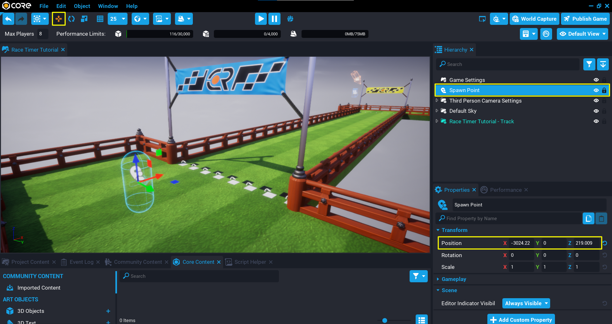{: .center loading="lazy" }

## Create Starting Line

When a race is about to start, you need to move the players to the starting line.

!!! tip "Player Grouping"
    Instead of grouping all players up in one spot, you can create a few positions along the starting line and randomly pick one to place the player at. There is still a possibility of players spawning in the same location, and to fix this it would require a more advanced system to keep track of which lanes have been assigned.

### Create Lane Positions

!!! tip "Visual Aid for Placing Spawn Points"
    As a visual aid to help move the starting positions, an object such as a **Cube** can be used. For performance it's recommended to use a **Group** when needing to reference a position for spawning in objects. **Group** objects have minimal properties (i.e. no **Rendering**) compared to other objects.

1. Create a new group called **Starting Positions** inside the **Race Timer Tutorial - Track** group.
2. Drag and drop a **Cube** from **Core Content** into the **Starting Positions** group.
3. Set **Game Collision** to **Force Off** for the **Cube** object.
4. Set **Camera Collision** to **Force Off** for the **Cube** object.
5. Rename **Cube** to **Position**.
6. Duplicate and space these out along the starting line.
7. Set **Visibility** to **Force Off** for all **Position** objects.

<div class="mt-video" style="width:100%">
    <video autoplay muted playsinline controls loop class="center" style="width:100%">
        <source src="/img/RaceTimerTutorial/create_start_positions.mp4" type="video/mp4" />
    </video>
</div>

## Client and Server Context

### Set up Script Hierarchy

You need to set up the script folder and contexts in the **Hierarchy**.

1. Create a folder called **Scripts** inside the **Race Timer Tutorial - Track** group.
2. Create a **Client Context** inside the **Scripts** folder.
3. Create a **Server Context** inside the **Scripts** folder.

### Server Authoritative Design

A game server is a server which is the authoritative source of events in a game. The server sends data about the game state to allow players, which is used to maintain their own accurate version of the game world.

Anything in the **Client Context** exists on each player's version of the game. This means that there is no network traffic, and anything that gets modified is applied to that local player and not all players on the server.

Nothing sensitive will be stored in a **Client Context** script, and any action the client can do will always be sent to a script in a **Server Context** to validate it. The client will never be treated as an authority on the state of the game for all players.

Take a look at the example below of what is bad vs good.

```lua linenums="1" hl_lines="9"
-- Client script

local itemPrice = 1500
local itemId = 3

-- Client can purchase an item from the game shop.

shop_button.clickedEvent:Connect(function()
    Events.BroadcastToServer("purchase_item", itemPrice, itemId)
end)
```

This code above is bad because the broadcast to the server is also sending the price of the item which could be modified by the client.

```lua linenums="1" hl_lines="9"
-- Client script

local itemId = 3

-- Client can purchase an item from the game shop.
-- Notice that no price is sent to the server.

shop_button.clickedEvent:Connect(function()
    Events.BroadcastToServer("purchase_item", itemId)
end)
```

The server script will then handle validating if the player can purchase the item, and if so it will initiate the purchase and possibly broadcast back to the client if it was successful or not.

!!! tip "Default Context"
    There is another context called **Default Context**. Any script in this context is also viewable by the client. If you have code you want to protect from prying eyes, consider moving it to a **Server Context**.

For further information check out [Networking in Core](../references/networking/)

## Create Race Manager Server Script

The race manager server script is going to handle a few different things. You will be modifying this script a few times throughout the tutorial. In this section the following items will be covered.

- Only start races when the server has players.
- Move players to the starting positions.
- Let the players know the race is about to begin and when to go.
- Keep track of the race time for each player.
- Stop the race when time has ran out before starting a new race.

Create a new script called **RaceManager_Server** and place the script you created into the **Server Context** folder. Before opening the script, you need to setup the custom property for the positions so **Lua** has access to them.

!!! tip "Script Naming Convention"
    It's good habit to suffix scripts with the type of context they will be placed in so it's easier to find in the **Project Content** panel.  For example, a server script could be called **GameManager_Server**, and the client script could be called **GameManager_Client**. Using this method of naming helps identify the context a script is for.

    With the addition of **Project Content** folders organizing scripts, templates, and materials is recommended when creating bigger projects.

You want each player to be moved to a random lane position. At the same time you need to mark each player in the race to keep track of who is and isn't currently racing because players can join the game while a race is in progress.

1. Click on **RaceManager_Server** so it becomes the active object selected.
2. Drag and drop the group **Starting Positions** onto the **Add Custom Property** button.
3. Rename the custom property to **startingPositions**.

Your **Hierarchy** and **RaceManager_Server** script will now look like the below image.

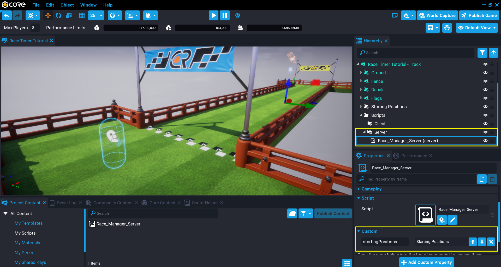{: .center loading="lazy" }

Open up the **RaceManager_Server** script by double clicking on it.

!!! tip "Script Editor"
    **Core** comes with a **Script Editor** built in that supports syntax highlighting, auto complete, and script debugging. You can change which editor is used in the **Settings** under the **Editor** section. Another popular editor is **Visual Studio Code** which has an extension for the **Core API**. See [Editor Extensions](/extensions.md) for more information.

```lua  linenums="1"
local START_POSITIONS = script:GetCustomProperty("startingPositions"):WaitForObject()

local raceTask = nil
local players = {}
```

| Variable Name | Description |
| ------------- | ----------- |
| `START_POSITIONS` | Using `GetCustomProperty` you can get a reference to custom properties you have set up on the script. |
| `raceTask` | This will be used later on as a simple way to handle the game state. More about this will be discussed when the `raceTask` handler is implemented. |
| `players` | You need to keep track of the players in the game. A good way to do that is putting players that have joined into a table for access later on. |

!!! info "The word **Handler** is just a more specific term for **function** that is used with events. **Handlers** are also known as **Callbacks**."

### Enable / Disable Player Movement

```lua linenums="1"
local function EnablePlayerMovement(player)
    player.movementControlMode = MovementControlMode.LOOK_RELATIVE
end

local function DisablePlayerMovement(player)
    player.movementControlMode = MovementControlMode.NONE
end
```

The code above contains two helper functions that will allow us to disable and enable player movement. You need to prevent players who are at the starting positions from moving.

!!! tip "Any function that doesn't need to be accessed outside of the script should be marked as `local`. This doesn't include functions that are overridden like `Tick`."

### Move Player to Starting Line

```lua linenums="1"
local function MovePlayersToStart()
    for index, currentPlayer in ipairs(Game.GetPlayers()) do
        DisablePlayerMovement(currentPlayer)

        local startPosition = START_POSITIONS:GetChildren()[math.random(#START_POSITIONS:GetChildren())]

        currentPlayer:SetWorldPosition(startPosition:GetWorldPosition())
        currentPlayer:SetWorldRotation(startPosition:GetWorldRotation())

        players[currentPlayer.id].inRace = true
    end
end
```

`MovePlayersToStart` will get called later by the race task. This function handles disabling the player movement, setting position and rotation by looping over all players that are currently in the game.

!!! info "ipairs()"
    The `ipairs()` function will iterate over index value pairs. These are key value pairs where the keys are indices in an array. The order that elements are returned is guaranteed to be in the order of the indices, and keys are are not an integer will be skipped.

```lua linenums="1"
local startPosition = START_POSITIONS:GetChildren()[math.random(#START_POSITIONS:GetChildren())]

p:SetWorldPosition(startPosition:GetWorldPosition())
p:SetWorldRotation(startPosition:GetWorldRotation())
```

To place players randomly along the start line, you can select a random child from `START_POSITIONS`. The rotation of the child is also used for the player to make sure the player character is facing down the track.

```lua
players[currentPlayer.id].inRace = true
```

You need to keep track of when players are in a race. You can do this by setting the property `inRace` to `true`.

### Allow Players to Race

```lua linenums="1"
local function EnablePlayers()
    for index, currentPlayer in ipairs(Game.GetPlayers()) do
        if players[currentPlayer.id].inRace then
            EnablePlayerMovement(currentPlayer)
            players[currentPlayer.id].startTime = time()
        end
    end
end
```

The `EnablePlayers` function is called later on by the race task. This function loops over all players that have `inRace` set to `true`. If the property is `true`, then the player have their movement enabled.

```lua linenums="1"
players[currentPlayer.id].startTime = time()
```

This line sets the time that the race started. You need to keep accurate track of the time, so this is recorded on the server which will be used later to work out how long it took the player to finish the race.

!!! tip "`time()` returns the time in seconds (floating point) since the game started on the server."

### Connect Player Joined and Left Events

```lua linenums="1"
local function OnPlayerJoined(player)
    player.maxJumpCount = 0
    player.canMount = false

    players[player.id] = {

        inRace = false,
        startTime = 0,
        finishTime = 0

    }
end
```

The function `OnPlayerJoined` is called each time a player joins the server. To begin, you need to disable player mounts and player jumping. You want this to be a sprint race, so setting `maxJumpCount` to `0` prevents the player from jumping.

You can also use the handler `OnPlayerJoined` to push each new player to the `players` table to keep track of players in the game. The value stored in the table is a table with some defaults setup that will be used throughout the script.

| Variable Name | Description |
| ------------- | ----------- |
| `inRace` | This property gets updated with either `true` or `false`. If a player joins late while a race is already in progress, then you can use this property to determine which players are actively racing. |
| `startTime` | This property gets updated when the race starts and when the race finishes. It keeps track of the starting time of the race which is used later to work out how long it took the player to cross the finish line. |
| `finishTime` | Later on you will add a trigger to the finish line so that when a player overlaps the trigger, it will record the time at that point. This is used along with `startTime` to determine how long it took the player to get from start to finish. |

```lua linenums="1"
local function OnPlayerLeft(player)
    if players[player.id] ~= nil then
        players[player.id] = nil
    end
end
```

When a player leaves the game, you need to cleanup the `players` table by removing the player from the `players` table. Setting the value to `nil` is a good way to tell **Lua** that you no longer need it.

```lua linenums="1"
Game.playerJoinedEvent:Connect(OnPlayerJoined)
Game.playerLeftEvent:Connect(OnPlayerLeft)
```

The code needs to connect the `OnPlayerJoined` and `OnPlayerLeft` events to the `playerJoinedEvent` event and `playerLeftEvent` event.

### Send Race Notification

You want to let the players know when to get ready and when to go. Place both functions just after the `OnPlayerLeft` function.

```lua linenums="1"
local function TellPlayersToGetReady()
    for index, currentPlayer in ipairs(Game.GetPlayers()) do
        if players[currentPlayer.id].inRace then
            Events.BroadcastToPlayer(currentPlayer, "GetReady")
        end
    end
end
```

The function `TellPlayersToGetReady` will broadcast to each player that is marked as in the race who is in the game currently. This is done so players who join late don't receive the notification. Later on in the tutorial you will listen for this broadcast event and setup a handler.

```lua linenums="1"
local function TellPlayersToGo()
    for index, currentPlayer in ipairs(Game.GetPlayers()) do
        if players[currentPlayer.id].inRace then
            Events.BroadcastToPlayer(currentPlayer, "Go")
        end
    end
end
```

The function `TellPlayersToGo` will broadcast to each player that is marked as in the race. Later on in the tutorial you will listen for this broadcast event and setup a handler.

### Stop the Race

You need to handle stopping a race when the race timer has finished, so place the function below just after the `TellPlayersToGo` function.

```lua linenums="1"
local function StopRace()
    for id, p in pairs(players) do
        p.inRace = false
    end

    Events.BroadcastToAllPlayers("StopRace")
end
```

The function `StopRace` will loop through all the players on the server and set the property `inRace` to `false` indicating they are no longer in the race. You then broadcast to all players that the race will be stopped. Later on in the tutorial, you will listen for this broadcast event and create a handler.

### Repeating Task

```lua linenums="1"
local function task_handler()
    if raceTask == nil then
        raceTask = Task.Spawn(task_handler, 14)

        raceTask.repeatInterval = 10
        raceTask.repeatCount = -1
    end

    if #Game.GetPlayers() == 0 then
      return
    end

    StopRace()

    Task.Wait(2)

    MovePlayersToStart()
    TellPlayersToGetReady()

    Task.Wait(2)

    TellPlayersToGo()

    EnablePlayers()
end

task_handler()
```

You need a way to manage the state of the game, and a simple way to handle that for this example is using a task.  The **RaceManager_Server** script will complete the following processes.

1. Check if the task has not been setup.

    You need to make a repeating task if one hasn't been setup. This task will repeat every 10 seconds and handle the state of the game. Because the length of the track doesn't take very long to finish for the player, you limit the duration of each race to 10 seconds.

    You can delay the initial spawning of the task by 14 seconds to take into account the 4 seconds when `Task.Wait` is used. If you don't do this, then the first race on the server will be short.

    Using a repeating task has an added benefit of resetting the race if any players are inactive.

    ```lua
    raceTask.repeatCount = -1
    ```

    You can set `repeatCount` to `-1` to force the task to repeat forever.

2. Check if there are players in the game.

    The task handler will check to see if there are any players in the game. If the number of players is `0`, then you exit the handler early by using `return`.

3. Stop the current race that is in progress.

    Because the race has a time limit based on the repeating task, you need to make sure the race is reset each time the task handler is called.

4. Move all players to starting positions.

    After a 2 second wait by using `Task.Wait`, you then move all players to the starting positions by calling `MovePlayersToStart`. This function also handles disabling the player movement.

5. Notify the players to get ready.

    Calling **TellPlayersToGetReady** will broadcast to any player who is in the race letting them know to get ready.

6. Notify players to go, and enable movement.

    You can wait another 2 seconds by using `Task.Wait` and notify the players to go so they know when to start running. At the same time you enable all players by calling `EnablePlayers`.

<div class="mt-video" style="width:100%">
    <video autoplay muted playsinline controls loop class="center" style="width:100%">
        <source src="/img/RaceTimerTutorial/test_race_server_only_script.mp4" type="video/mp4" />
    </video>
</div>

### Enter Play Mode and Test

Enter **Play** mode and test everything is working. If you have followed the tutorial so far, then this is what happens:

1. The Player spawns in at the **Spawn Point**.
2. After a few seconds the player's movement is disabled and moved to a random starting position.
3. After another few seconds the player can now move.
4. Every 10 seconds the task will reset the player back to a random starting position.

### The Full RaceManager_Server Script

??? "RaceManager_Server"
    ```lua linenums="1"
    local START_POSITIONS = script:GetCustomProperty("startingPositions"):WaitForObject()
    local FINISH_TRIGGER = script:GetCustomProperty("finishTrigger"):WaitForObject()

    local raceTask = nil
    local players = {}

    local function EnablePlayerMovement(player)
        player.movementControlMode = MovementControlMode.LOOK_RELATIVE
    end

    local function DisablePlayerMovement(player)
        player.movementControlMode = MovementControlMode.NONE
    end

    --[[
        Moves all players in the game to the starting position. A position at random
        is picked for the player. There is a chance that more than one player can be
        at the same position.
    ]]

    local function MovePlayersToStart()
        for index, currentPlayer in ipairs(Game.GetPlayers()) do

            -- Need to disable player movement at the start to prevent players
            -- from moving forward before the race has started.

            DisablePlayerMovement(currentPlayer)

            -- Fetch a random starting position for this player and set their world position
            -- and rotation. The rotation is based on the rotation of the "position" object.

            local startPosition = START_POSITIONS:GetChildren()[math.random(#START_POSITIONS:GetChildren())]

            currentPlayer:SetWorldPosition(startPosition:GetWorldPosition())
            currentPlayer:SetWorldRotation(startPosition:GetWorldRotation())

            -- Mark this player as in the race which is used later on to make sure the player
            -- is a valid racer when crossing the finish line.

            players[currentPlayer.id].inRace = true
        end
    end

    --[[
        At the start of the race loop over all players and check if they are marked as being in
        the race by checking if "inRace" is true. If it is, then enable the player movement and
        record the time the race started.
    ]]

    local function EnablePlayers()
        for index, currentPlayer in ipairs(Game.GetPlayers()) do
            if players[currentPlayer.id].inRace then
                EnablePlayerMovement(currentPlayer)
                players[currentPlayer.id].startTime = time()
            end
        end
    end

    local function OnPlayerJoined(player)

        -- Since this is a race, disable jump and mount.

        player.maxJumpCount = 0
        player.canMount = false

        -- Add this player to the "players" list and setup default properties
        -- that will be accessed, and updated later for each player.
        -- The "players" table is a key value table where the key is the players ID.

        players[player.id] = {

            inRace = false,
            startTime = 0,
            finishTime = 0

        }
    end

    --[[
        When the player leaves the game, some cleanup is needed. It's good practice
        to clean up anything that is no longer needed. In this a check is done to
        see if the player who is leaving has an entry in the "players" table. If there
        is an entry it is set to "nil" to remove it.
    ]]

    local function OnPlayerLeft(player)
        if players[player.id] ~= nil then
            players[player.id] = nil
        end
    end

    --[[
        Tell players to get ready as the race is about to begin.
        Only players who are in the race will receive the broadcast.
    ]]

    local function TellPlayersToGetReady()
        for index, currentPlayer in ipairs(Game.GetPlayers()) do
            if players[currentPlayer.id].inRace then
                Events.BroadcastToPlayer(currentPlayer, "GetReady")
            end
        end
    end

    local function TellPlayersToGo()
        for index, currentPlayer in ipairs(Game.GetPlayers()) do
            if players[currentPlayer.id].inRace then
                Events.BroadcastToPlayer(currentPlayer, "Go")
            end
        end
    end

    --[[
        Handles stopping the race when the race task restarts.

        All players get "inRace" set to false ready for the next race.
    ]]

    local function StopRace()

        -- Notice that "pairs" is used instead of "ipairs" for the loop. This is because
        -- the "players" table is not an indexed table. It's made up of key value pairs
        -- where the key is not an index. In this case the key is the players ID that is
        -- used as a lookup.

        for id, p in pairs(players) do
            p.inRace = false
        end

        Events.BroadcastToAllPlayers("StopRace")
    end

    -- Game Events

    Game.playerJoinedEvent:Connect(OnPlayerJoined)
    Game.playerLeftEvent:Connect(OnPlayerLeft)

    -- Repeating task that checks if there are players in the game.
    -- The function will return (exit) if there are 0 players to prevent
    -- statements from executing further down in the body of the function.

    local function task_handler()
        if raceTask == nil then
            raceTask = Task.Spawn(task_handler, 14)

            -- Change "repeatInterval" if the race will last longer.
            -- This task handles the game state in a very simplified way.

            raceTask.repeatInterval = 10
            raceTask.repeatCount = -1
        end

        if #Game.GetPlayers() == 0 then
            return
        end

        StopRace()

        Task.Wait(2)

        MovePlayersToStart()
        TellPlayersToGetReady()

        Task.Wait(2)

        TellPlayersToGo()

        EnablePlayers()
    end

    task_handler()
    ```

## Create Finish Line Trigger

You need to add a trigger to the finish line so that when the player overlaps the trigger, the time is recorded.

1. Create Trigger Group

    Create a new group inside of your track group, and call it **Triggers**. This group will contain the finish line trigger and a few other triggers later on in the tutorial.

2. Add Trigger

    Add a new **Trigger** inside the **Triggers** group and name it **Finish**.

3. Add Custom Property

    The **RaceManager_Server** script needs to have a way to reference the finish line trigger. Click on the **RaceManager_Server** script so it becomes the active object in the **Hierarchy** and drag the **Finish** trigger onto the **Add Custom Property** button. Rename the new custom property to **finishTrigger**.

4. Position Trigger

    The **Finish** trigger now needs to be placed at the finish line, making sure that it covers all the way across the track for the player to overlap with.

<div class="mt-video" style="width:100%">
    <video autoplay muted playsinline controls loop class="center" style="width:100%">
        <source src="/img/RaceTimerTutorial/finish_trigger.mp4" type="video/mp4" />
    </video>
</div>

### Create Trigger Overlap Handler

Modify the **RaceManager_Server** script so that the finish line trigger can be used to detect when a player has overlapped it.

#### Add Custom Property

Add the following line to the top of the script under the `STARTING POSITIONS` variable.

```lua linenums="1"
local FINISH_TRIGGER = script:GetCustomProperty("finishTrigger"):WaitForObject()
```

#### Add Trigger Handler

After the **OnPlayerLeft** function, you are going to add the handler that will get fired when a player overlaps the finish line trigger.

```lua linenums="1"
local function OnFinishTriggerOverlap(trigger, obj)
    if Object.IsValid(obj) and obj:IsA("Player") and players[obj.id] ~= nil and players[obj.id].inRace then
        players[obj.id].finishTime = time()
        players[obj.id].inRace = false

        local finalTime = players[obj.id].finishTime - players[obj.id].startTime

        print(finalTime) -- Print out the time to test

        Events.BroadcastToPlayer(obj, "RaceFinished", finalTime)
    end
end
```

The trigger handler above will make sure that the `obj` is a valid `Player` object type. You then check to see if the player is in the `players` table and if `inRace` is marked as true. You do this so that players who join the server while a race is in progress don't get detected when they overlap the trigger.

```lua linenums="1"
players[obj.id].finishTime = time()
```

You then set `finishTime` to the current time since the game started. This means that you now have a start and end time which you can use later to determine the best time of the player.

```lua linenums="1"
players[obj.id].inRace = false
```

This point, the player is now marked as not in the race. This prevents the overlap handler from triggering again.

```lua linenums="1"
local finalTime = players[obj.id].finishTime - players[obj.id].startTime
```

The player will receive an accurate final time of their race. You do this by subtracting the start time of the race away from the finish time. This will give us the time it took for the player to run the race.

```lua linenums="1"
print(finalTime)
```

 To test that the time is being recorded correctly, you can print out `finalTime` to the **Event Log**.

#### Broadcast to Player

```lua linenums="1"
Events.BroadcastToPlayer(obj, "RaceFinished", finalTime)
```

You broadcast to the player that the race has finished, and also send their final time. Later on you will connect to this event from the client to update the time displayed in the UI with the time sent from the server.

!!! tip "Client vs Server Trust"
    The client can#t be trusted to send their race time, so this is all tracked on the server and sent to the client when the player has finished the race. If the race time was tracked client side and then submitted to the server, this could be exploited by the client by modifying the data that is sent from client to server. Nearly anything the client does needs to ask for data (i.e. final race time), or get permission from the server.

#### Connect Trigger Event

```lua linenums="1"
FINISH_TRIGGER.beginOverlapEvent:Connect(OnFinishTriggerOverlap)
```

You can now connect the `beginOverlapEvent` event up. Place this just before the lines of code that connect up the game events for when players join and leave.

#### Test the Game

Enter **Play** mode and test everything is working. Crossing the finish line will print out the race time in the **Event Log**.

<div class="mt-video" style="width:100%">
    <video autoplay muted playsinline controls loop class="center" style="width:100%">
        <source src="/img/RaceTimerTutorial/test_race.mp4" type="video/mp4" />
    </video>
</div>

### The Updated RaceManager_Server Script

??? "RaceManager_Server"
    ```lua linenums="1"
    local START_POSITIONS = script:GetCustomProperty("startingPositions"):WaitForObject()
    local FINISH_TRIGGER = script:GetCustomProperty("finishTrigger"):WaitForObject()

    local raceTask = nil
    local players = {}

    local function EnablePlayerMovement(player)
        player.movementControlMode = MovementControlMode.LOOK_RELATIVE
    end

    local function DisablePlayerMovement(player)
        player.movementControlMode = MovementControlMode.NONE
    end

    --[[
        Moves all players in the game to the starting position. A position at random
        is picked for the player. There is a chance that more than one player can be
        at the same position.
    ]]

    local function MovePlayersToStart()
        for index, currentPlayer in ipairs(Game.GetPlayers()) do

            -- Need to disable player movement at the start to prevent players
            -- from moving forward before the race has started.

            DisablePlayerMovement(currentPlayer)

            -- Fetch a random starting position for this player and set their world position
            -- and rotation. The rotation is based on the rotation of the "position" object.

            local startPosition = START_POSITIONS:GetChildren()[math.random(#START_POSITIONS:GetChildren())]

            currentPlayer:SetWorldPosition(startPosition:GetWorldPosition())
            currentPlayer:SetWorldRotation(startPosition:GetWorldRotation())

            -- Mark this player as in the race which is used later on to make sure the player
            -- is a valid racer when crossing the finish line.

            players[currentPlayer.id].inRace = true
        end
    end

    --[[
        At the start of the race loop over all players and check if they are marked as being in
        the race by checking if "inRace" is true. If it is, then enable the player movement and
        record the time the race started.
    ]]

    local function EnablePlayers()
        for index, currentPlayer in ipairs(Game.GetPlayers()) do
            if players[currentPlayer.id].inRace then
                EnablePlayerMovement(currentPlayer)
                players[currentPlayer.id].startTime = time()
            end
        end
    end

    local function OnPlayerJoined(player)

        -- Since this is a race, disable jump and mount.

        player.maxJumpCount = 0
        player.canMount = false

        -- Add this player to the "players" list and setup default properties
        -- that will be accessed, and updated later for each player.
        -- The "players" table is a key value table where the key is the players ID.

        players[player.id] = {

            inRace = false,
            startTime = 0,
            finishTime = 0

        }
    end

    --[[
        When the player leaves the game, some cleanup is needed. It's good practice
        to clean up anything that is no longer needed. In this a check is done to
        see if the player who is leaving has an entry in the "players" table. If there
        is an entry it is set to "nil" to remove it.
    ]]

    local function OnPlayerLeft(player)
        if players[player.id] ~= nil then
            players[player.id] = nil
        end
    end

    --[[
        When the player overlaps the finish line, this means they have finished the race, so
        the final time gets sent to the player and submitted to the leaderboard. The reason
        for sending it to the player is because server "time()" will be far more accurate then
        "time()" on the client.
    ]]

    local function OnFinishTriggerOverlap(trigger, obj)
        if Object.IsValid(obj) and obj:IsA("Player") and players[obj.id] ~= nil and players[obj.id].inRace then
            players[obj.id].finishTime = time()
            players[obj.id].inRace = false

            local finalTime = players[obj.id].finishTime - players[obj.id].startTime

            print(finalTime) -- Print out the time to test

            Events.BroadcastToPlayer(obj, "RaceFinished", finalTime)
        end
    end

    --[[
        Tell players to get ready as the race is about to being.
        Only players who are in the race will receive the broadcast.
    ]]

    local function TellPlayersToGetReady()
        for index, currentPlayer in ipairs(Game.GetPlayers()) do
            if players[currentPlayer.id].inRace then
                Events.BroadcastToPlayer(currentPlayer, "GetReady")
            end
        end
    end

    local function TellPlayersToGo()
        for index, currentPlayer in ipairs(Game.GetPlayers()) do
            if players[currentPlayer.id].inRace then
                Events.BroadcastToPlayer(currentPlayer, "Go")
            end
        end
    end

    --[[
        Handles stopping the race when the race task restarts.

        All players get "inRace" set to false ready for the next race.
    ]]

    local function StopRace()

        -- Notice that "pairs" is used instead of "ipairs" for the loop. This is because
        -- the "players" table is not an indexed table. It's made up of key value pairs
        -- where the key is not an index. In this case the key is the players ID that is
        -- used as a lookup.

        for id, p in pairs(players) do
            p.inRace = false
        end

        Events.BroadcastToAllPlayers("StopRace")
    end

    -- Trigger Event

    FINISH_TRIGGER.beginOverlapEvent:Connect(OnFinishTriggerOverlap)

    -- Game Events

    Game.playerJoinedEvent:Connect(OnPlayerJoined)
    Game.playerLeftEvent:Connect(OnPlayerLeft)

    -- Repeating task that checks if there are players in the game.
    -- The function will return (exit) if there are 0 players to prevent
    -- statements from executing further down in the body of the function.

    local function task_handler()
        if raceTask == nil then
            raceTask = Task.Spawn(task_handler, 14)

            -- Change "repeatInterval" if the race will last longer.
            -- This task handles the game state in a very simplified way.

            raceTask.repeatInterval = 10
            raceTask.repeatCount = -1
        end

        if #Game.GetPlayers() == 0 then
            return
        end

        StopRace()

        Task.Wait(2)

        MovePlayersToStart()
        TellPlayersToGetReady()

        Task.Wait(2)

        TellPlayersToGo()

        EnablePlayers()
    end

    task_handler()
    ```

## Create User Interface

You want to display some UI to the player so they have a visual way to tell what's going on. You are going to set up the following UI.

- Race Timer

    This will be used to display the current time of the race.

- Ready / Go Notification

    It would be nice to display something to the players when the race is about to begin. So you will tell the players to get **Ready** and to **Go**.

- Best Time

    This will show the best time to the player.

- Last Time

    This will show the time of the last race to the player.

### Create Context and Container

1. Create a **Client Context** in the folder **Race Timer Tutorial - Track** and name it **UI**.
2. Create a **UI Container** inside the **UI** folder.

!!! tip "All UI must go into a **Client Context**. Most of the time when part of the UI needs to be updated, it's updated with data that is specifically for one player."

The **Hierarchy** structure will now look like this:

{: .center loading="lazy" }

### Create Race Timer UI

You are going to create some UI that will show the current race time to the player. All UI objects will be placed inside the **UI Container** from now on.

!!! tip "It's good practice to name each UI object. As UI gets more complex with lots of object, it will be easier to find which object to change if they are correctly name for what their purpose is."

#### Create Frame Image

Create a **UI Image** object and rename it to **Race Timer**. This image will be the frame for the race timer.

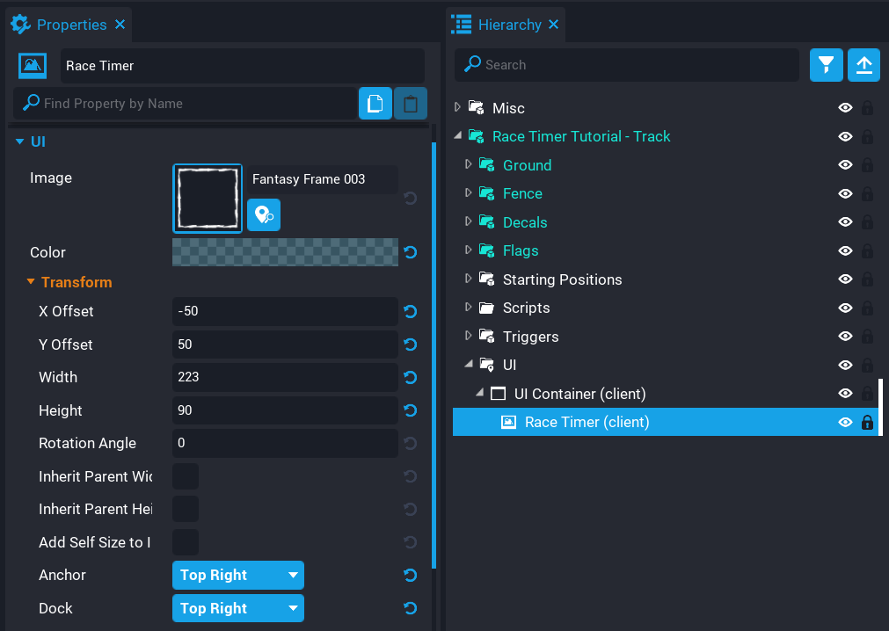{: .center loading="lazy" }

#### Create Background Image

Create a **UI Image** object and rename it to **Background**. Place this inside the **Race Timer** image as a child. This will be the background image within the frame.

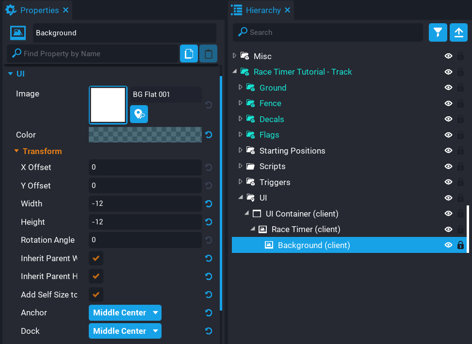{: .center loading="lazy" }

#### Create Timer Panel

Create a **UI Panel** object and rename it to **Timer Panel**. Place this inside the **Race Timer** image as a child. This panel will hold a few objects for the actual timer.

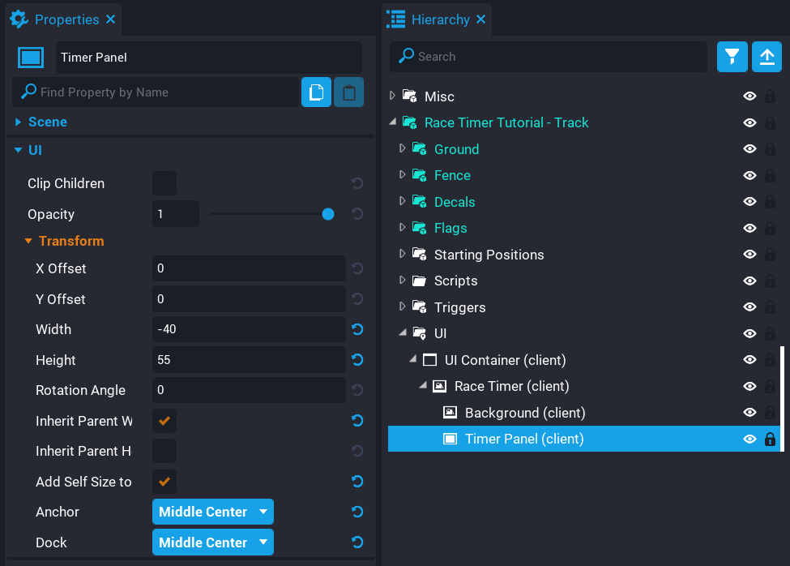{: .center loading="lazy" }

#### Create Panel Background Image

Create a **UI Image** object and rename it to **Background**. Place this inside **Timer Panel**

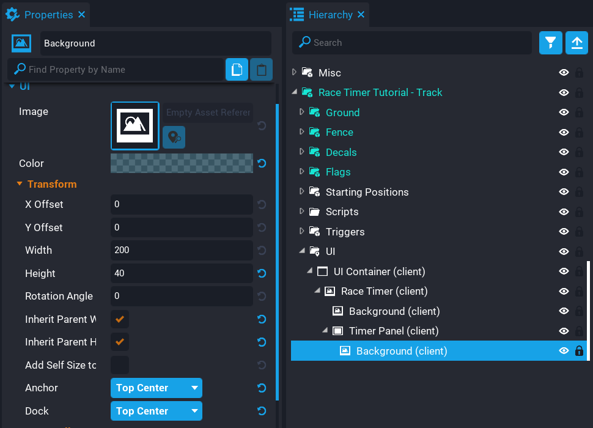{: .center loading="lazy" }

#### Create Text Object

Create a **UI Text** object and rename it to **Timer**. Place this inside **Timer Panel** as a child. Set the text to **0.000**. This text object will display the race timer to the player.

{: .center loading="lazy" }
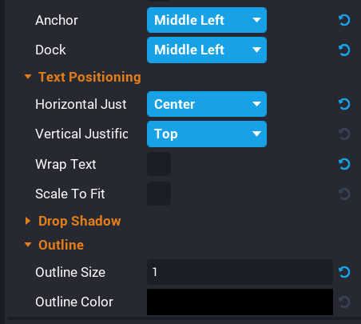{: .center loading="lazy" }

Here is how the **Hierarchy** and UI look once the above steps have been completed.

{: .center loading="lazy" }

!!! tip "Feel free to design the UI how you want it to look. Just make sure that there is a text object for the race timer."

### Create Ready / Go Notification

You are going to add a visual cue to the UI when a race is about to start and when the player can go.

Create a **UI Text** object and rename it to **Get Ready**. Place this inside the **UI Container**.

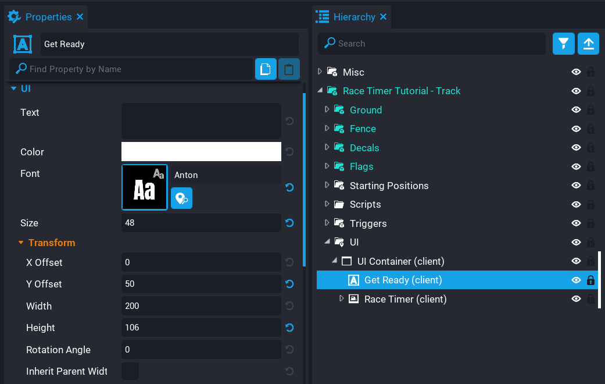{: .center loading="lazy" }
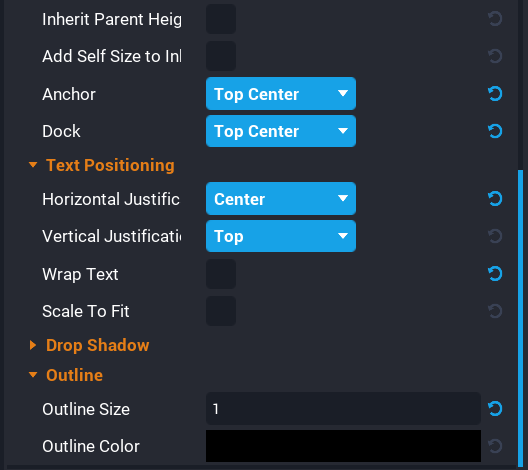{: .center loading="lazy" }

This text object will get updated by a client script to let players know when to start running.

You will revisit the UI a bit later to add support for showing the best time of the player and last time.

## Create Race Manager Client Script

Create a new script called **RaceManager_Client** and place it into the Client Context folder. Before you open the script, you need to add a few custom properties to it.

### Add Custom Properties

1. Select the **RaceManager_Client** script so it becomes the active object in the **Hierarchy**.
2. Drag and drop the **Get Ready** text object onto the **Add Custom Property** button, and rename the property to **getReady**.
3. Drag and drop the **Timer** text object onto the **Add Custom Property** button, and rename the property to **raceTime**.

<div class="mt-video" style="width:100%">
    <video autoplay muted playsinline controls loop class="center" style="width:100%">
        <source src="/img/RaceTimerTutorial/create_client_manager_script.mp4" type="video/mp4" />
    </video>
</div>

### Open Race Manager Client Script

Double click on the **RaceManager_Client** script to open it in the script editor.

#### Add Custom properties

Add the following lines to the top of the script.

```lua linenums="1"
local GET_READY = script:GetCustomProperty("getReady"):WaitForObject()
local RACE_TIME = script:GetCustomProperty("raceTime"):WaitForObject()
```

- `GET_READY` is a reference to the UI text object that will notify the players when the race is about to start.
- `RACE_TIME` is a reference to the UI text object that will show the player the current time of the race.

#### Add Variables

A few variables need to be set up that will be used throughout the script.

```lua linenums="1"
local timerStarted = false
local timer = 0
```

- `timerStarted` will either be `true` or `false` to indicate that the race timer has started.
- `timer` will get incremented when the race has started for the client. The `timer` variable will hold the time for the current race.

#### Add Tick Function

```lua linenums="1"
function Tick(dt)
    if timerStarted then
        RACE_TIME.text = string.format("%.3f", timer)
        timer = timer + dt
    end
end
```

Next, add the `Tick` function. This is a special **Core** function that gets called every frame. The `Tick` function has a parameter that gives you the time difference between the current and previous tick.

!!! warning "Attempting to reference the `text` property on other UI components will give a warning such as `attempt to index (set) nil value \"text\"`"

The `Tick` function checks to see if `timerStarted` is set to true. This is to prevent the UI for the race timer getting constantly updated when it doesn't need to be.

```lua linenums="1"
RACE_TIME.text = string.format("%.3f", timer)
```

`string.format` is used to format strings. The first parameter is the format of the string that can contain specifiers. Because you want to show a floating point value with 3 decimal places, you can use `%.3f`. The second parameter is what will be used as the replacement. In this case you can pass the `timer` variable which contains the current race time. This will be constantly updated for the player.

See the [string.format](http://www.lua.org/manual/5.3/manual.html#pdf-string.format) reference for more information.

```lua linenums="1"
timer = timer + dt
```

The race time will appear like a stopwatch that is counting up. To do this, you add the previous time and the delta time from `Tick` to increment the timer. You do this on the client to give the player an idea of their current time. This time will not be the final time displayed to the player. The real time that is accurately being tracked on the server is sent to the player when they cross the finish line. The other advantage of doing it on the client is that it can refresh quickly and updates smoothly.

#### Add Get Ready Function

```lua linenums="1"
local function GetReady()
    GET_READY.text = "Get Ready!"
end
```

Add the above code under the `Tick` function. This will update the `GET_READY` text to let the player know the race is about to begin.

#### Add Go Function

```lua linenums="1"
local function Go()
    GET_READY.text = "Go!"
    timerStarted = true

    Task.Wait(1)

    GET_READY.text = ""
end
```

Add the above code below the `GetReady` function. This will update the `GET_READY` text to let players know they can start running. The variable `timerStarted` gets set to `true` so that the body of the `Tick` function can start updating the race timer for the player. After 1 second, you can clear out the text so it doesn't stay on the screen for the player while they are racing.

#### Add Stop Race Function

```lua linenums="1"
local function StopRace()
    timerStarted = false
    timer = 0
    RACE_TIME.text = "0.000"
end
```

Add the above code below the `Go` function. This sets `timerStarted` to `false` to stop incrementing the timer in the `Tick` function, and also the `timer` and `RACE_TIME` get reset ready for the next race.

#### Add Race Finished Function

```lua linenums="1"
local function RaceFinished(finalTime)
    local formatted_time = string.format("%.3f", finalTime)

    RACE_TIME.text = formatted_time

    timerStarted = false
    timer = 0
end
```

Add the above code below the `StopRace` function. This gets called when the race has finished, and includes from the server the players final time. This time is formatted and the UI is updated with the accurate time. This is done because there can be a difference between the server and client times.

#### Connect the Events

```lua linenums="1"
Events.Connect("GetReady", GetReady)
Events.Connect("Go", Go)
Events.Connect("StopRace", StopRace)
Events.Connect("RaceFinished", RaceFinished)
```

Finally the functions are connected to the events which are called from the server. This is using the `Events` API that allows you to broadcast to the server and from the server to the client. In this case you only need to broadcast to the client.

#### Test the Game

Enter **Play** mode and test the game.

- Check notification for when to get ready and go, is received
- Check the race timer is counting up
- Check the race timer stops when crossing the finish line
- Check the game resets back to starting positions

<div class="mt-video" style="width:100%">
    <video autoplay muted playsinline controls loop class="center" style="width:100%">
        <source src="/img/RaceTimerTutorial/client_manager_script.mp4" type="video/mp4" />
    </video>
</div>

### The Full RaceManager_Client Script

??? "RaceManager_Client"
    Here is the full script so far. You will be modifying this later in the tutorial to add additional features and polish.

    ```lua linenums="1"
    local GET_READY = script:GetCustomProperty("getReady"):WaitForObject()
    local RACE_TIME = script:GetCustomProperty("raceTime"):WaitForObject()

    local timerStarted = false
    local timer = 0

    function Tick(dt)

        --[[
            If the race has started then increment the "timer" by adding
            the delta time between ticks.
        ]]

        if timerStarted then

            --[[
                Using string.format will display a nicely formatted time to the player.
                In this case the precision is set to 3, so for example 8.765.
            ]]

            RACE_TIME.text = string.format("%.3f", timer)
            timer = timer + dt
        end
    end

    local function GetReady()
        GET_READY.text = "Get Ready!"
    end

    --[[
        When the race is started the "timerStarted" variable is set to true so
        the "Tick" function can handle updating the race timer in the UI for the
        player.
    ]]

    local function Go()
        GET_READY.text = "Go!"
        timerStarted = true

        Task.Wait(1)

        GET_READY.text = ""
    end

    --[[
        Sets "timerStarted" to false so the race timer in the UI is stopped.

        The "timer" gets reset for the next race, otherwise it would continue
        increasing.

        Since the race has stopped, the race timer in the UI also gets reset.
    ]]

    local function StopRace()
        timerStarted = false
        timer = 0
        RACE_TIME.text = "0.000"
    end

    --[[
        When the race is finished the players time is received and displayed to the player.
        The reason for this is because the timer on the server is more accurate then what is
        on the client (player).

        Since the race has finished, the "timer" can be reset for the next race and also stop
        the timer from continuing to be incremented in the "Tick" function.
    ]]

    local function RaceFinished(finalTime)
        local formatted_time = string.format("%.3f", finalTime)

        RACE_TIME.text = formatted_time

        timerStarted = false
        timer = 0
    end

    -- Events

    Events.Connect("GetReady", GetReady)
    Events.Connect("Go", Go)
    Events.Connect("StopRace", StopRace)
    Events.Connect("RaceFinished", RaceFinished)
    ```

## Persistent Storage

You will store the players fastest time so that it is displayed to them every time they join the game. You will update both race manager scripts. Here are the steps to saving the fastest time.

- Enable player storage
- On the server
    - Save fastest time
    - Load fastest time
    - Send fastest time to client
- On the client
    - Wait for data to be received
    - Update UI with fastest time

### Enable Player Storage

Player storage is a way to save data for players persistently so that it is available across sessions. For example, saving a players inventory so it is available to them next time they login to the game.

By default player storage is not enabled. This can be enabled very easily by finding the **Game Settings** object in the **Hierarchy** and making sure the setting **Enable Player Storage** is checked under **General**.

{: .center loading="lazy" }

!!! tip "If you are missing the **Game Settings** object from your **Hierarchy**, you can add it back in from **Core Content**."

### Send Data to Client

When a player joins the game, you want to send their own data to them. Sending data to a client from the server can be done in a few different ways. Clients cannot access **Storage**, so you must retrieve the data on the server and send it to the client. A very good method that you will be using is **Private Networked Data**. This allows us to securely get the players data just to them.

```lua linenums="1"
local function SendPrivateData(player, key, data)
    player:SetPrivateNetworkedData(key, data)
end
```

Add the above code just below the `EnablePlayers` function. This function will be used in a couple of places in the server script. It will receive 3 parameters:

1. `player`
    The client who will receive the networked data.

2. `key`
    The key used for the networked data.

3. `data`
    The data that will be sent to the client.

```lua linenums="1"
local data = Storage.GetPlayerData(player) or {}

-- Check if "bestTime" is valid, if so send it to the player privately.
-- This time will be displayed in the UI for the this player.

if data.bestTime ~= nil then
    SendPrivateData(player, "bestTime", data.bestTime)
end
```

Add the above code to the bottom of the `OnPlayerJoined` function. This code will fetch the players data from storage, and also check to see if `bestTime` is not `nil`.

```lua linenums="1"
SendPrivateData(player, "bestTime", data.bestTime)
```

Using the `SendPrivateData` function you created previously, you send the player, a string for the key, and the best time of the player.

### Check for Best Time

When a player crosses the finish line, you need to check the time for the current race against the time stored for the player. If the time is lower, then you can send this to the player and also update storage.

```lua linenums="1"
local function CheckForBestTime(player, lastTime)
    local data = Storage.GetPlayerData(player) or {}

    if((data.bestTime == nil or data.bestTime == 0) or lastTime < data.bestTime) then
        data.bestTime = lastTime

        SendPrivateData(player, "bestTime", lastTime)
    end

    Storage.SetPlayerData(player, data)
end
```

Add the above function to the **Race_Manager_Script** just below the `OnPlayerLeft` function.

This function will receive the player, and the last time from the last race they finished.

```lua linenums="1"
local data = Storage.GetPlayerData(player) or {}
```

The line above attempts to load the player's data from **Storage**. If there is no data stored, then `data` will default to an empty table, otherwise it will be `nil`.

```lua linenums="1"
if((data.bestTime == nil or data.bestTime == 0) or lastTime < data.bestTime) then
```

The line above checks if `bestTime` is `nil` or if the `bestTime` is equal to `0`. This is done because if this is the player's first race, then `bestTime` will be `nil`, so you have nothing to compare it too against the `lastTime` provided to the function as the second parameter.

```lua linenums="1"
lastTime < data.bestTime
```

The second part of the if condition checks if the `lastTime` for the race the player just finished is lower that the time stored in `bestTime`. Storage will only update based on 2 conditions:

1. No best time set for the player.
2. The last race time is lower than the stored time for the player.

```lua linenums="1"
SendPrivateData(player, "bestTime", lastTime)
```

The above code will call the `SendPrivateData` function to send the data to the client.

```lua linenums="1"
Storage.SetPlayerData(player, data)
```

### Save Best Time

You need to make one more change so that when the player cross the finish line the time is checked to see if it's faster than their last time. To do this you are going to make a small change to the `OnFinishTriggerOverlap` function.

```lua linenums="1" hl_lines="8"
local function OnFinishTriggerOverlap(trigger, obj)
    if Object.IsValid(obj) and obj:IsA("Player") and players[obj.id] ~= nil and players[obj.id].inRace then
        players[obj.id].finishTime = time()
        players[obj.id].inRace = false

        local finalTime = players[obj.id].finishTime - players[obj.id].startTime

        CheckForBestTime(obj, finalTime)

        Events.BroadcastToPlayer(obj, "RaceFinished", finalTime)
    end
end
```

Open the **RaceManager_Server** script and add line 8 to the `OnFinishTriggerOverlap` function.  `CheckForBestTime` will check if the final time is faster than the time stored.

### The Updated RaceManager_Server Script

??? "RaceManager_Server"
    ```lua linenums="1"
    local START_POSITIONS = script:GetCustomProperty("startingPositions"):WaitForObject()
    local FINISH_TRIGGER = script:GetCustomProperty("finishTrigger"):WaitForObject()

    local raceTask = nil
    local players = {}

    local function EnablePlayerMovement(player)
        player.movementControlMode = MovementControlMode.LOOK_RELATIVE
    end

    local function DisablePlayerMovement(player)
        player.movementControlMode = MovementControlMode.NONE
    end

    --[[
        Moves all players in the game to the starting position. A position at random
        is picked for the player. There is a chance that more than one player can be
        at the same position.
    ]]

    local function MovePlayersToStart()
        for index, currentPlayer in ipairs(Game.GetPlayers()) do

            -- Need to disable player movement at the start to prevent players
            -- from moving forward before the race has started.

            DisablePlayerMovement(currentPlayer)

            -- Fetch a random starting position for this player and set their world position
            -- and rotation. The rotation is based on the rotation of the "position" object.

            local startPosition = START_POSITIONS:GetChildren()[math.random(#START_POSITIONS:GetChildren())]

            currentPlayer:SetWorldPosition(startPosition:GetWorldPosition())
            currentPlayer:SetWorldRotation(startPosition:GetWorldRotation())

            -- Mark this player as in the race which is used later on to make sure the player
            -- is a valid racer when crossing the finish line.

            players[currentPlayer.id].inRace = true
        end
    end

    --[[
        At the start of the race loop over all players and check if they are marked as being in
        the race by checking if "inRace" is true. If it is, then enable the player movement and
        record the time the race started.
    ]]

    local function EnablePlayers()
        for index, currentPlayer in ipairs(Game.GetPlayers()) do
            if players[currentPlayer.id].inRace then
                EnablePlayerMovement(currentPlayer)
                players[currentPlayer.id].startTime = time()
            end
        end
    end

    local function SendPrivateData(player, key, data)
        player:SetPrivateNetworkedData(key, data)
    end

    local function OnPlayerJoined(player)

        -- Since this is a race, disable jump and mount.

        player.maxJumpCount = 0
        player.canMount = false

        -- Add this player to the "players" list and setup default properties
        -- that will be accessed, and updated later for each player.
        -- The "players" table is a key value table where the key is the players ID.

        players[player.id] = {

            inRace = false,
            startTime = 0,
            finishTime = 0

        }

        local data = Storage.GetPlayerData(player) or {}

        -- Check if "bestTime" is valid, if so send it to the player privately.
        -- This time will be displayed in the UI for the this player.

        if data.bestTime ~= nil then
            SendPrivateData(player, "bestTime", data.bestTime)
        end
    end

    --[[
        When the player leaves the game, some cleanup is needed. It's good practice
        to clean up anything that is no longer needed. In this a check is done to
        see if the player who is leaving has an entry in the "players" table. If there
        is an entry it is set to "nil" to remove it.
    ]]

    local function OnPlayerLeft(player)
        if players[player.id] ~= nil then
            players[player.id] = nil
        end
    end

    local function CheckForBestTime(player, lastTime)
        local data = Storage.GetPlayerData(player) or {}

        if((data.bestTime == nil or data.bestTime == 0) or lastTime < data.bestTime) then
            data.bestTime = lastTime

            SendPrivateData(player, "bestTime", lastTime)
        end

        Storage.SetPlayerData(player, data)
    end

    --[[
        When the player overlaps the finish line, this means they have finished the race, so
        the final time gets sent to the player and submitted to the leaderboard. The reason
        for sending it to the player is because server "time()" will be far more accurate then
        "time()" on the client.
    ]]

    local function OnFinishTriggerOverlap(trigger, obj)
        if Object.IsValid(obj) and obj:IsA("Player") and players[obj.id] ~= nil and players[obj.id].inRace then
            players[obj.id].finishTime = time()
            players[obj.id].inRace = false

            local finalTime = players[obj.id].finishTime - players[obj.id].startTime

            print(finalTime) -- Print out the time to test

            -- Check if the final time was better than the best time of the player.

            CheckForBestTime(obj, finalTime)

            Events.BroadcastToPlayer(obj, "RaceFinished", finalTime)
        end
    end

    --[[
        Tell players to get ready as the race is about to begin.
        Only players who are in the race will receive the broadcast.
    ]]

    local function TellPlayersToGetReady()
        for index, currentPlayer in ipairs(Game.GetPlayers()) do
            if players[currentPlayer.id].inRace then
                Events.BroadcastToPlayer(currentPlayer, "GetReady")
            end
        end
    end

    local function TellPlayersToGo()
        for index, currentPlayer in ipairs(Game.GetPlayers()) do
            if players[currentPlayer.id].inRace then
                Events.BroadcastToPlayer(currentPlayer, "Go")
            end
        end
    end

    --[[
        Handles stopping the race when the race task restarts.

        All players get "inRace" set to false ready for the next race.
    ]]

    local function StopRace()

        -- Notice that "pairs" is used instead of "ipairs" for the loop. This is because
        -- the "players" table is not an indexed table. It's made up of key value pairs
        -- where the key is not an index. In this case the key is the players ID that is
        -- used as a lookup.

        for id, p in pairs(players) do
            p.inRace = false
        end

        Events.BroadcastToAllPlayers("StopRace")
    end

    -- Trigger Event

    FINISH_TRIGGER.beginOverlapEvent:Connect(OnFinishTriggerOverlap)

    -- Game Events

    Game.playerJoinedEvent:Connect(OnPlayerJoined)
    Game.playerLeftEvent:Connect(OnPlayerLeft)

    -- Repeating task that checks if there are players in the game.
    -- The function will return (exit) if there are 0 players to prevent
    -- statements from executing further down in the body of the function.

    local function task_handler()
        if raceTask == nil then
            raceTask = Task.Spawn(task_handler, 14)

            -- Change "repeatInterval" if the race will last longer.
            -- This task handles the game state in a very simplified way.

            raceTask.repeatInterval = 10
            raceTask.repeatCount = -1
        end

        if #Game.GetPlayers() == 0 then
            return
        end

        StopRace()

        Task.Wait(2)

        MovePlayersToStart()
        TellPlayersToGetReady()

        Task.Wait(2)

        TellPlayersToGo()

        EnablePlayers()
    end

    task_handler()
    ```

## Update Race User Interface

You need to update the UI to add support for showing the best time of the player and last time.

### Create Stats Frame Image

Create a new **UI Image** object inside the **UI Container** as a child, and rename it to **Stats**.

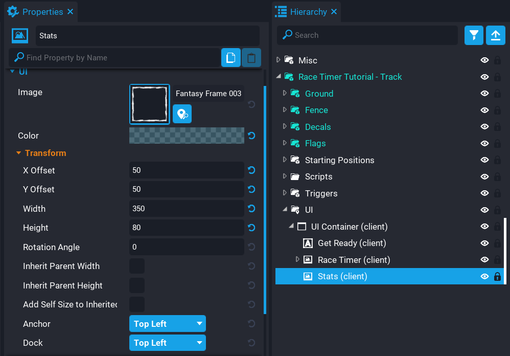{: .center loading="lazy" }

### Create Stats Background Image

Create a new **UI Image** object inside the **Stats** object as a child, and rename it to **Background**.

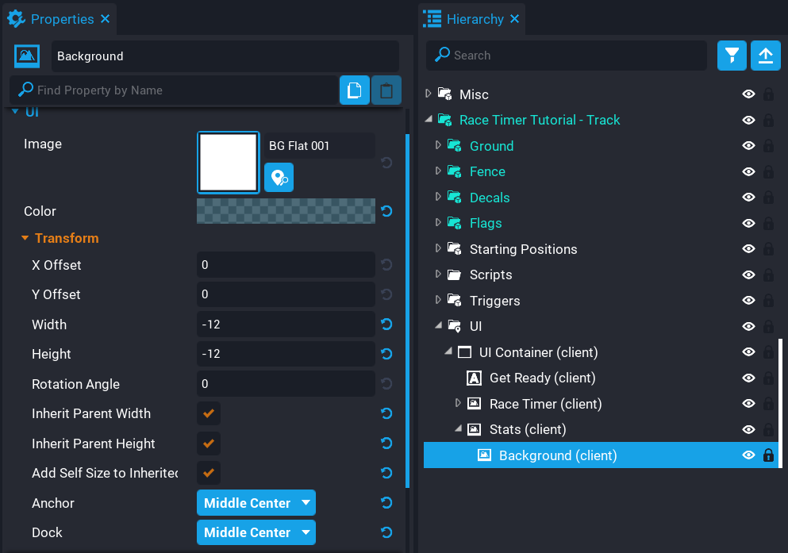{: .center loading="lazy" }

### Create Stats Panel

Create a new **UI Panel** object inside the **Stats** object as a child, and rename it to **Times**.

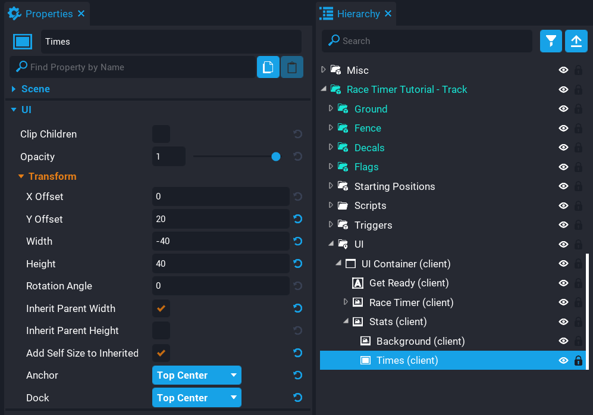{: .center loading="lazy" }

### Create Background Image

Create a new **UI Image** object inside the **Times** object as a child, and rename it to **Background**.

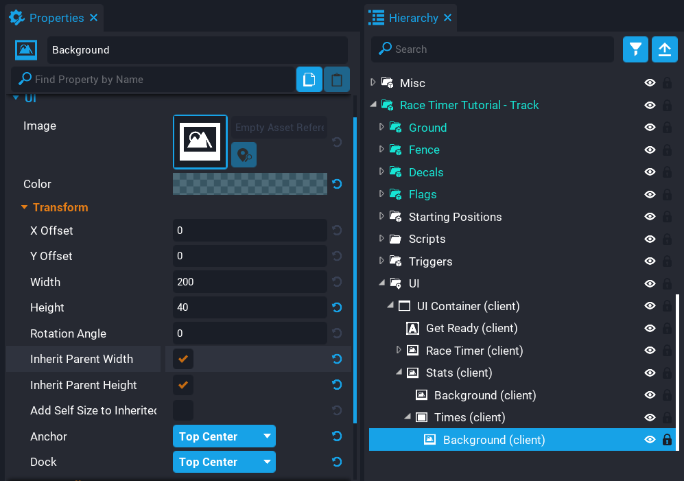{: .center loading="lazy" }

### Create Best Time Text Object

Create a new **UI Text** object in the **Times** object as a child, and rename it to **Best Time**.

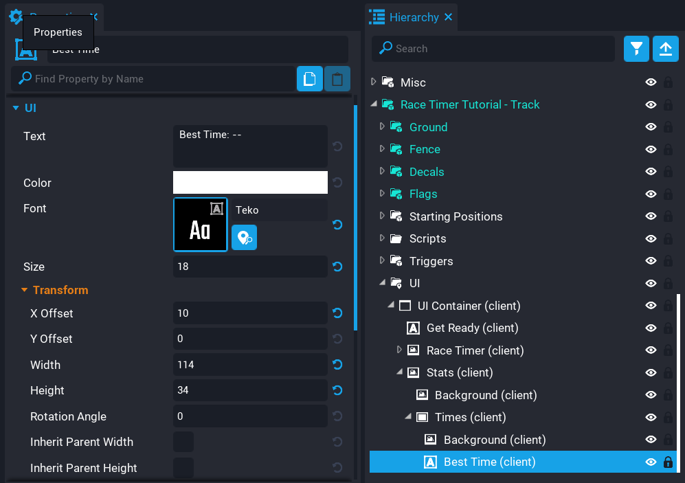{: .center loading="lazy" }
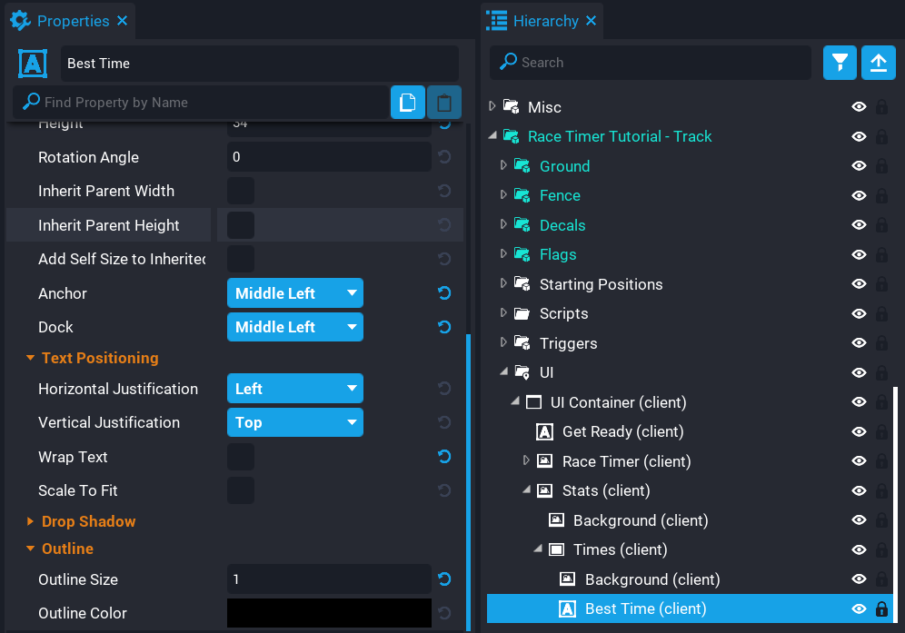{: .center loading="lazy" }

### Create Last Time Text Object

Create a new **UI Text** object in the **Times** object as a child, and rename it to **Last Time**.

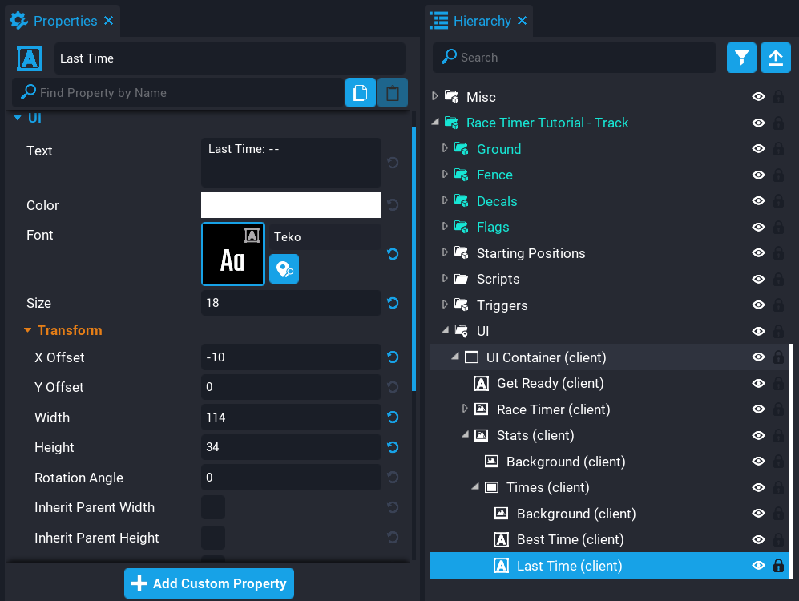{: .center loading="lazy" }
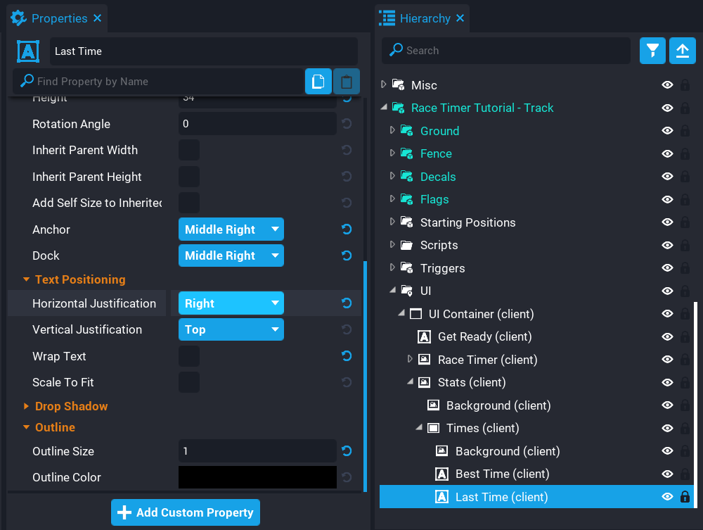{: .center loading="lazy" }

Your UI **Hierarchy** will now look like this.

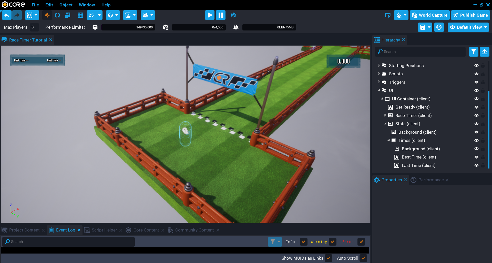{: .center loading="lazy" }

## Update Race Manager Client Script

You need to add the 2 text objects created in the previous section for best time and last time as custom properties on the **RaceManager_Client** script.

1. Drag and drop the **Best Time** text object onto the script as a new custom property and rename the new custom property to **bestTime**.
2. Drag and drop the **Last Time** text object onto the script as a new custom property and rename the new custom property to **lastTime**.

```lua linenums="1"
local BEST_TIME = script:GetCustomProperty("bestTime"):WaitForObject()
local LAST_TIME = script:GetCustomProperty("lastTime"):WaitForObject()
```

Add the 2 lines above just under `RACE_TIME` at the top of the script.

```lua linenums="1"
local localPlayer = Game.GetLocalPlayer()
```

You need a reference to the current local player. You can use the `GetLocalPlayer` function to retrieve the local player and store it in a variable for later use. Add this after the variable `timer` at the top of the script.

```lua linenums="1" hl_lines="5"
local function RaceFinished(finalTime)
    local formatted_time = string.format("%.3f", finalTime)

    RACE_TIME.text = formatted_time
    LAST_TIME.text = "Last Time: " .. formatted_time

    timerStarted = false
    timer = 0
end
```

Modify the `RaceFinished` function and add line 5 to it. This will update the text for the `LAST_TIME` when the race is finished by the player.

### Get Private Player Data

If you remember the **RaceManager_Server** script is sending private networked data to the client. This data contains the best time of the player. You need to modify the client script to check when the data has changed so you can update the UI.

```lua linenums="1"
local function UpdateFromNetworkData(key)
    local data = localPlayer:GetPrivateNetworkedData(key)

    if key == "bestTime" then
        if data ~= nil and data > 0 then
            BEST_TIME.text = string.format("Best Time: %.3f", data)
        else
            BEST_TIME.text = ""
        end
    end
end
```

The above function will be called when the client script has loaded, and also be called from a handler when the networked data has changed.

The function receives the key for the networked data, you have to check to see what the key is so you know what data you are using.

```lua linenums="1"
local data = localPlayer:GetPrivateNetworkedData(key)
```

You can get the local player's private data by calling `GetPrivateNetworkedData` and passing the key.

```lua linenums="1"
if key == "bestTime" then
    if data ~= nil and data > 0 then
        BEST_TIME.text = string.format("Best Time: %.3f", data)
    else
        BEST_TIME.text = ""
    end
end
```

You only have one key that you need to check, that being **bestTime**. If the key matches, you can then update the best time of the player in the UI.

```lua linenums="1"
local function OnPrivateDataChanged(player, key)
    UpdateFromNetworkData(key)
end

localPlayer.privateNetworkedDataChangedEvent:Connect(OnPrivateDataChanged)
```

The function `OnPrivateDataChanged` is the handler you use to connect to the `privateNetworkedDataChangedEvent` event. This event is called anytime the players private networked data has changed when set on the server. This is handy because you can respond to any data change easily.

```lua linenums="1"
for i, key in ipairs(localPlayer:GetPrivateNetworkedDataKeys()) do
    UpdateFromNetworkData(key)
end
```

Finally there could be a time where the data from the server has already been replicated. This means that the `privateNetworkedDataChangedEvent` event may not fire due to not being connected in time, so the script won't know about any change that has already happened. To get around this issue you can loop over all the private networked keys and perform an update from the stored data.

!!! tip "Replication"
    **Replicated** means that the data that is sent from the server is copied to the clients. In this case the data is being replicated just to the client that owns it due to using the private networked method. Other methods such as networked properties are replicated to all clients in the game. This can be bad if you want the data to be private, and also use unnecessary network bandwidth if other clients don't need the data.

All new code above will be added to the end of the **RaceManager_Client** script.

### The Updated RaceManager_Client Script

??? "RaceManager_Client"
    ```lua linenums="1"
    local GET_READY = script:GetCustomProperty("getReady"):WaitForObject()
    local RACE_TIME = script:GetCustomProperty("raceTime"):WaitForObject()
    local BEST_TIME = script:GetCustomProperty("bestTime"):WaitForObject()
    local LAST_TIME = script:GetCustomProperty("lastTime"):WaitForObject()

    local timerStarted = false
    local timer = 0
    local localPlayer = Game.GetLocalPlayer()

    function Tick(dt)

        --[[
            If the race has started then increment the "timer" by adding
            the delta time between ticks.
        ]]

        if timerStarted then

            --[[
                Using string.format will display a nicely formatted time to the player.
                In this case the precision is set to 3, so for example 8.765.
            ]]

            RACE_TIME.text = string.format("%.3f", timer)
            timer = timer + dt
        end
    end

    local function GetReady()
        GET_READY.text = "Get Ready!"
    end

    --[[
        When the race is started the "timerStarted" variable is set to true so
        the "Tick" function can handle updating the race timer in the UI for the
        player.
    ]]

    local function Go()
        GET_READY.text = "Go!"
        timerStarted = true

        Task.Wait(1)

        GET_READY.text = ""
    end

    --[[
        Sets "timerStarted" to false so the race timer in the UI is stopped.

        The "timer" gets reset for the next race, otherwise it would continue
        increasing.

        Since the race has stopped, the race timer in the UI also gets reset.
    ]]

    local function StopRace()
        timerStarted = false
        timer = 0
        RACE_TIME.text = "0.000"
    end

    --[[
        When the race is finished the players time is received and displayed to the player.
        The reason for this is because the timer on the server is more accurate then what is
        on the client (player).

        Since the race has finished, the "timer" can be reset for the next race and also stop
        the timer from continuing to be incremented in the "Tick" function.
    ]]

    local function RaceFinished(finalTime)
        local formatted_time = string.format("%.3f", finalTime)

        RACE_TIME.text = formatted_time
        LAST_TIME.text = "Last Time: " .. formatted_time

        timerStarted = false
        timer = 0
    end

    -- Events

    Events.Connect("GetReady", GetReady)
    Events.Connect("Go", Go)
    Events.Connect("StopRace", StopRace)
    Events.Connect("RaceFinished", RaceFinished)

    -- Private network data handling for the player

    local function UpdateFromNetworkData(key)
        local data = localPlayer:GetPrivateNetworkedData(key)

        if key == "bestTime" then
            if data ~= nil and data > 0 then
                BEST_TIME.text = string.format("Best Time: %.3f", data)
            else
                BEST_TIME.text = ""
            end
        end
    end

    local function OnPrivateDataChanged(player, key)
        UpdateFromNetworkData(key)
    end

    localPlayer.privateNetworkedDataChangedEvent:Connect(OnPrivateDataChanged)

    for i, key in ipairs(localPlayer:GetPrivateNetworkedDataKeys()) do
        UpdateFromNetworkData(key)
    end
    ```

Enter **Play** mode to test the game. You will notice when finishing the race the Best and Last time gets updated. Exit and enter **Play** mode again, this time you will see the time for **Best Time** is displayed.

<div class="mt-video" style="width:100%">
    <video autoplay muted playsinline controls loop class="center" style="width:100%">
        <source src="/img/RaceTimerTutorial/best_last_stats.mp4" type="video/mp4" />
    </video>
</div>

## Create Fastest Time Leaderboard

It can be fun for players to fight it out on the leaderboard for the fastest time. In this section you will learn:

- Creating a leaderboard
- Submitting a time to the leaderboard
- Retrieving leaderboard data
- Display in world for players to view

### Create a Leaderboard

Leaderboards allow you to store data for players that get automatically sorted. This is a good way to show players who has the fastest time.

1. From the **Window** menu, open the **Global Leaderboards** windows.
2. Click the **Create New Leaderboard** button.
3. Enter the **Leaderboard Name**.

    Be descriptive with the name so you know what the leaderboard is for.

4. Set the **Sorting** to **Lower Is Better**.

    You want the leaderboard to have the fastest times at the top, so the lower the time the higher the entry on the leaderboard will be.

5. Set **Rank Entries** to 10.

    If you want a longer leaderboard, you can increase this. For the tutorial you only want to show the top 10 fastest times ever because the in world leaderboard will only show the top 10.

6. Click the **Create** button to create the leaderboard.

<div class="mt-video" style="width:100%">
    <video autoplay muted playsinline controls loop class="center" style="width:100%">
        <source src="/img/RaceTimerTutorial/create_leaderboard.mp4" type="video/mp4" />
    </video>
</div>

### Create in World Leaderboard

You need to display the leaderboard in the world to players. A leaderboard can have quite a few components too it and how you design it's up to you.

In **Community Content** find **Race Timer Tutorial - Board** by **CoreAcademy** and import it.

{: .center loading="lazy" }

Once imported drag and drop it into the **Hierarchy** and place the leaderboard where you want it.

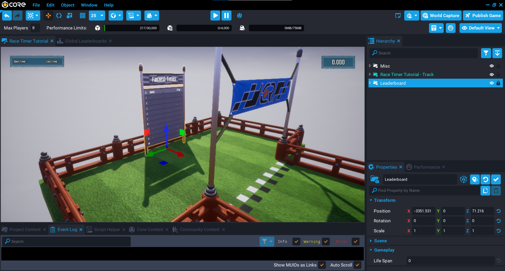{: .center loading="lazy" }

### Create Leaderboard Server Script

You now need to create the server script that will submit the players time to the leaderboard.

1. Create a new script called **Race_Leaderboard_Server**.
2. Place the new script inside the **Server Context** in the **Scripts** folder.
3. Drag and drop the leaderboard reference as a new custom property on the script.
4. Name the custom property to **fastestTimeLb**.

<div class="mt-video" style="width:100%">
    <video autoplay muted playsinline controls loop class="center" style="width:100%">
        <source src="/img/RaceTimerTutorial/leaderboard_server_prop.mp4" type="video/mp4" />
    </video>
</div>

```lua linenums="1"
local FASTEST_TIME_LB = script:GetCustomProperty("fastestTimeLb")

Events.Connect("SubmitLeaderboardTime", function(player, finalTime)
    if Leaderboards.HasLeaderboards() then
        Leaderboards.SubmitPlayerScore(FASTEST_TIME_LB, player, finalTime)
    end
end)
```

The code above will listen for a broadcast event called **SubmitLeaderboardTime** that will contain the player and their final race time.

```lua linenums="1"
local FASTEST_TIME_LB = script:GetCustomProperty("fastestTimeLb")
```

This is the reference to the leaderboard that you will be submitting too.

```lua linenums="1"
if Leaderboards.HasLeaderboards() then
```

The function `HasLeaderboards` will return true if any leaderboard data is available, otherwise returns false if there is no leaderboard data or it's still being loaded.

```lua linenums="1"
Leaderboards.SubmitPlayerScore(FASTEST_TIME_LB, player, finalTime)
```

Submitting scores to the leaderboard requires the leaderboard reference, player, and the score. The `finalTime` contains the time it took for the player to complete the race, and this is submitted to the leaderboard. The leaderboard will only update the entry if it's a lower time then any of the other times.

### The Full RaceLeaderboard_Server Script

??? "RaceLeaderboard_Server"
    ```lua linenums="1"
    --[[
        Handles submitting the players final time to the leaderboard.

        The sorting of the leaderboard is "Lower is Better". So this means
        if the players final time is lower then their previous time, this will
        be the "score" that is submitted to the leaderboard.
    ]]

    local FASTEST_TIME_LB = script:GetCustomProperty("fastestTimeLb")

    Events.Connect("SubmitLeaderboardTime", function(player, finalTime)
        if Leaderboards.HasLeaderboards() then
            Leaderboards.SubmitPlayerScore(FASTEST_TIME_LB, player, finalTime)
        end
    end)
    ```

### Update Race Manager Server Script

You need to update the **RaceManager_Server** script so that it sends a broadcast that the **Race_Leaderboard_Server** script is listening for.

```lua linenums="1" hl_lines="12"
local function OnFinishTriggerOverlap(trigger, obj)
    if Object.IsValid(obj) and obj:IsA("Player") and players[obj.id] ~= nil and players[obj.id].inRace then
        players[obj.id].finishTime = time()
        players[obj.id].inRace = false

        local finalTime = players[obj.id].finishTime - players[obj.id].startTime

        -- Check if the final time was better than the best time of the player.

        CheckForBestTime(obj, finalTime)

        Events.Broadcast("SubmitLeaderboardTime", obj, finalTime)

        Events.BroadcastToPlayer(obj, "RaceFinished", finalTime)
    end
end
```

Open the **RaceManager_Server** script and modify the **OnFinishTriggerOverlap** function by adding the broadcast seen on line 12. When the player overlaps the finish line trigger, their time will be submitted to the leaderboards.

!!! tip "Modular Code"
    It's a good idea to separate code like this, especially when scripts get very big. Using broadcasts in the same context (server in this case) has no network cost. This is a good way to speak to scripts and allows you to break things up for easier management.

### The Updated RaceManager_Server Script

??? "RaceManager_Server"
    ```lua linenums="1"
    local START_POSITIONS = script:GetCustomProperty("startingPositions"):WaitForObject()
    local FINISH_TRIGGER = script:GetCustomProperty("finishTrigger"):WaitForObject()

    local raceTask = nil
    local players = {}

    local function EnablePlayerMovement(player)
        player.movementControlMode = MovementControlMode.LOOK_RELATIVE
    end

    local function DisablePlayerMovement(player)
        player.movementControlMode = MovementControlMode.NONE
    end

    --[[
        Moves all players in the game to the starting position. A position at random
        is picked for the player. There is a chance that more than one player can be
        at the same position.
    ]]

    local function MovePlayersToStart()
        for index, currentPlayer in ipairs(Game.GetPlayers()) do

            -- Need to disable player movement at the start to prevent players
            -- from moving forward before the race has started.

            DisablePlayerMovement(currentPlayer)

            -- Fetch a random starting position for this player and set their world position
            -- and rotation. The rotation is based on the rotation of the "position" object.

            local startPosition = START_POSITIONS:GetChildren()[math.random(#START_POSITIONS:GetChildren())]

            currentPlayer:SetWorldPosition(startPosition:GetWorldPosition())
            currentPlayer:SetWorldRotation(startPosition:GetWorldRotation())

            -- Mark this player as in the race which is used later on to make sure the player
            -- is a valid racer when crossing the finish line.

            players[currentPlayer.id].inRace = true
        end
    end

    --[[
        At the start of the race loop over all players and check if they are marked as being in
        the race by checking if "inRace" is true. If it is, then enable the player movement and
        record the time the race started.
    ]]

    local function EnablePlayers()
        for index, currentPlayer in ipairs(Game.GetPlayers()) do
            if players[currentPlayer.id].inRace then
                EnablePlayerMovement(currentPlayer)
                players[currentPlayer.id].startTime = time()
            end
        end
    end

    local function SendPrivateData(player, key, data)
        player:SetPrivateNetworkedData(key, data)
    end

    local function OnPlayerJoined(player)

        -- Since this is a race, disable jump and mount.

        player.maxJumpCount = 0
        player.canMount = false

        -- Add this player to the "players" list and setup default properties
        -- that will be accessed, and updated later for each player.
        -- The "players" table is a key value table where the key is the players ID.

        players[player.id] = {

            inRace = false,
            startTime = 0,
            finishTime = 0

        }

        local data = Storage.GetPlayerData(player) or {}

        -- Check if "bestTime" is valid, if so send it to the player privately.
        -- This time will be displayed in the UI for the this player.

        if data.bestTime ~= nil then
            SendPrivateData(player, "bestTime", data.bestTime)
        end
    end

    --[[
        When the player leaves the game, some cleanup is needed. It's good practice
        to clean up anything that is no longer needed. In this a check is done to
        see if the player who is leaving has an entry in the "players" table. If there
        is an entry it is set to "nil" to remove it.
    ]]

    local function OnPlayerLeft(player)
        if(players[player.id] ~= nil) then
            players[player.id] = nil
        end
    end

    local function CheckForBestTime(player, lastTime)
        local data = Storage.GetPlayerData(player) or {}

        if((data.bestTime == nil or data.bestTime == 0) or lastTime < data.bestTime) then
            data.bestTime = lastTime

            SendPrivateData(player, "bestTime", lastTime)
        end

        Storage.SetPlayerData(player, data)
    end

    --[[
        When the player overlaps the finish line, this means they have finished the race, so
        the final time gets sent to the player and submitted to the leaderboard. The reason
        for sending it to the player is because server "time()" will be far more accurate then
        "time()" on the client.
    ]]

    local function OnFinishTriggerOverlap(trigger, obj)
        if Object.IsValid(obj) and obj:IsA("Player") and players[obj.id] ~= nil and players[obj.id].inRace then
            players[obj.id].finishTime = time()
            players[obj.id].inRace = false

            local finalTime = players[obj.id].finishTime - players[obj.id].startTime

            -- Check if the final time was better than the best time of the player.

            CheckForBestTime(obj, finalTime)

            -- Update the leaderboard with the final time.

            Events.Broadcast("SubmitLeaderboardTime", obj, finalTime)

            Events.BroadcastToPlayer(obj, "RaceFinished", finalTime)
        end
    end

    --[[
        Tell players to get ready as the race is about to begin.
        Only players who are in the race will receive the broadcast.
    ]]

    local function TellPlayersToGetReady()
        for index, currentPlayer in ipairs(Game.GetPlayers()) do
            if players[currentPlayer.id].inRace then
                Events.BroadcastToPlayer(currentPlayer, "GetReady")
            end
        end
    end

    local function TellPlayersToGo()
        for index, currentPlayer in ipairs(Game.GetPlayers()) do
            if players[currentPlayer.id].inRace then
                Events.BroadcastToPlayer(currentPlayer, "Go")
            end
        end
    end

    --[[
        Handles stopping the race when the race task restarts.

        All players get "inRace" set to false ready for the next race.
    ]]

    local function StopRace()

        -- Notice that "pairs" is used instead of "ipairs" for the loop. This is because
        -- the "players" table is not an indexed table. It's made up of key value pairs
        -- where the key is not an index. In this case the key is the players ID that is
        -- used as a lookup.

        for id, p in pairs(players) do
            p.inRace = false
        end

        Events.BroadcastToAllPlayers("StopRace")
    end

    -- Trigger Event

    FINISH_TRIGGER.beginOverlapEvent:Connect(OnFinishTriggerOverlap)

    -- Game Events

    Game.playerJoinedEvent:Connect(OnPlayerJoined)
    Game.playerLeftEvent:Connect(OnPlayerLeft)

    -- Repeating task that checks if there are players in the game.
    -- The function will return (exit) if there are 0 players to prevent
    -- statements from executing further down in the body of the function.

    local function task_handler()
        if raceTask == nil then
            raceTask = Task.Spawn(task_handler, 14)

            -- Change "repeatInterval" if the race will last longer.
            -- This task handles the game state in a very simplified way.

            raceTask.repeatInterval = 10
            raceTask.repeatCount = -1
        end

        if #Game.GetPlayers() == 0 then
            return
        end

        StopRace()

        Task.Wait(2)

        MovePlayersToStart()
        TellPlayersToGetReady()

        Task.Wait(2)

        TellPlayersToGo()

        EnablePlayers()
    end

    task_handler()
    ```

### Create Leaderboard Client Script

You now need to update the in world leaderboard with the leaderboard data.

1. Create a new script called **Race_Leaderboard_Client**.
2. Place the new script inside the **Client Context** in the **Scripts** folder.
3. Drag and drop the leaderboard reference as a new custom property on the script.
4. Name the custom property to **fastestTimeLb**.
5. Deinstance the leaderboard template.
6. Drag the **Entries** group onto the **Race_Leaderboard_Client** script as a new custom property.
7. Rename the custom property to **entries**.

<div class="mt-video" style="width:100%">
    <video autoplay muted playsinline controls loop class="center" style="width:100%">
        <source src="/img/RaceTimerTutorial/leaderboard_client_props.mp4" type="video/mp4" />
    </video>
</div>

```lua linenums="1"
local FASTEST_TIME_LB = script:GetCustomProperty("fastestTimeLb")
local ENTRIES = script:GetCustomProperty("entries"):WaitForObject()

local updater = Task.Spawn(function()
    if Leaderboards.HasLeaderboards() then
        local list = Leaderboards.GetLeaderboard(FASTEST_TIME_LB, LeaderboardType.GLOBAL)

        if list ~= nil then
            local counter = 1

            for k, v in pairs(list) do
                if counter > 10 then
                    break
                end

                local entry = ENTRIES:GetChildren()[counter]

                if entry ~= nil then
                    entry:FindDescendantByName("Name").text = v.name
                    entry:FindDescendantByName("Time").text = string.format("%.3f", v.score)
                end

                counter = counter + 1
            end
        end
    end
end)

updater.repeatInterval = 20
updater.repeatCount = -1
```

Place the above code into the **Race_Leaderboard_Client** script.

```lua linenums="1"
local FASTEST_TIME_LB = script:GetCustomProperty("fastestTimeLb")
local ENTRIES = script:GetCustomProperty("entries"):WaitForObject()
```

- `FASTEST_TIME_LB`
    This is a reference to the leaderboard object that holds the data.

- `ENTRIES`
    This is the group that contains all the entries for the leaderboard that will dynamically get updated with player names and their race time.

```lua linenums="1"
local updater = Task.Spawn(function()
    -- ...
end)

updater.repeatInterval = 20
updater.repeatCount = -1
```

It's nice having a leaderboard update while players are in the game. Using a repeating task is a good way to do this. The task will update the leaderboards every 20 seconds.

```lua linenums="1"
if Leaderboards.HasLeaderboards() then
```

The function `HasLeaderboards` will return true if any leaderboard data is available, otherwise returns false if there is no leaderboard data or it's still being loaded. Eventually if there is data and it's loaded, then the in world leaderboard will get updated because of the repeating task.

```lua linenums="1"
local list = Leaderboards.GetLeaderboard(FASTEST_TIME_LB, LeaderboardType.GLOBAL)
```

`GetLeaderboard` returns a table with a list of entries based on the leaderboard type. In this case you want the fastest times ever so pass `LeaderboardType.GLOBAL` as the second parameter.

```lua linenums="1" hl_lines="11 12"
local counter = 1

for k, v in pairs(list) do
    if counter > 10 then
        break
    end

    local entry = ENTRIES:GetChildren()[counter]

    if entry ~= nil then
        entry:FindDescendantByName("Name").text = v.name
        entry:FindDescendantByName("Time").text = string.format("%.3f", v.score)
    end

    counter = counter + 1
end
```

The above code handles looping over the leaderboard list. The code fetches each entry from the `ENTRIES` children list by using a `counter` that is incremented on each iteration. If the counter is greater than 10, then the loop will be broke by using the `break` keyword.

Lines 10 and 11 update the name and time by using the [entry](../api/leaderboardentry/) from the leaderboard list.

<div class="mt-video" style="width:100%">
    <video autoplay muted playsinline controls loop class="center" style="width:100%">
        <source src="/img/RaceTimerTutorial/leaderboard.mp4" type="video/mp4" />
    </video>
</div>

In the video the race is run a few times, and shows the initial entry added to the leaderboard, and also the entry getting updated.

### The Full RaceLeaderboard_Client Script

??? "RaceLeaderboard_Client"
    ```lua linenums="1"
    --[[
        Every 20 seconds the leaderboard loads the fastest times and updates the in world
        leaderboard for each player.
    ]]

    local FASTEST_TIME_LB = script:GetCustomProperty("fastestTimeLb")
    local ENTRIES = script:GetCustomProperty("entries"):WaitForObject()

    local updater = Task.Spawn(function()

        -- Check if there is any leaderboard data. This will return false
        -- if the leaderboards are still be retrieved.

        if Leaderboards.HasLeaderboards() then

            -- Fetch the leaderboard list using the "GLOBAL" type.

            local list = Leaderboards.GetLeaderboard(FASTEST_TIME_LB, LeaderboardType.GLOBAL)

            if list ~= nil then
                local counter = 1

                -- Loop through the list of entries that will be displayed on the in world leaderboard for
                -- players to see. Notice that the loop breaks when the counter is greater that 10 so it
                -- displays just the top 10 fastest players.

                for k, v in pairs(list) do
                    if counter > 10 then
                        break
                    end

                    local entry = ENTRIES:GetChildren()[counter]

                    if entry ~= nil then
                        entry:FindDescendantByName("Name").text = v.name
                        entry:FindDescendantByName("Time").text = string.format("%.3f", v.score)
                    end

                    counter = counter + 1
                end
            end
        end
    end)

    -- Task runs every 20 seconds to update the leaderboard results.

    updater.repeatInterval = 20
    updater.repeatCount = -1
    ```

## Add Time Splits

In this section you are going to add time splits to the track that update in the UI as the player passes the split. This will allow the player to see at what point on the track they need to improve on. The track in this tutorial is short and straight, so there isn't much a player could do to improve on their time. With a more interesting track this could be a useful feature to have.

Creating a time split feature isn't as complicated as it would first seem.

- Update UI to show split times.
- Add new triggers for the splits.
- Modify the **RaceManager_Server** script to keep track of the time between splits.
- Modify the **RaceManager_Client** script to dynamically add and modify the time splits for the UI.

### Update User Interface

You need a place in the UI to display the time splits to the player. Adding these could get quite tedious, so it will be done automatically in the client script later.

1. Create a new **UI Panel** inside the **Stats** panel and rename it to **Splits**.

    This will be the container that will hold each split.

    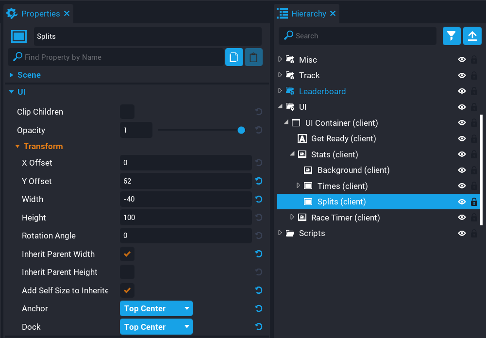{: .center loading="lazy" }

2. Create a split row and make it a template.

    You need to make the UI elements for the split, and then make it into a template. You will be spawning this in from the client script for each split in the game.

    The split needs 3 **UI Text** objects. Make sure to name them exactly as below, because the script will be looking for those 3 objects based on their name.

    1. Split Name
    2. Split Time
    3. Race Time

   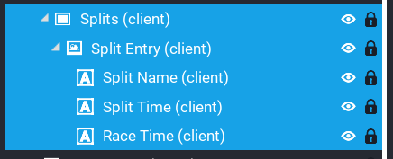{: .center loading="lazy" }

   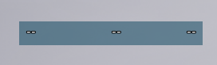{: .center loading="lazy" }

3. Right click on the **Split Entry** object and select **Create New Template From This**.

    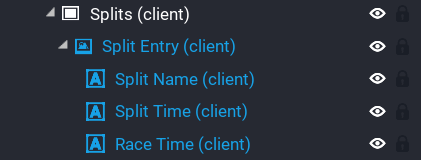{: .center loading="lazy" }

4. Delete the **Split Entry** template from the **Hierarchy** so the **Splits** panel is now empty.

You now have a template that will be used later for adding to the UI dynamically for each split. This saves time manually adding all the splits to the UI and positioning them.

### Create Time Split Triggers

1. In the **Triggers** group, create a new group called **Splits**.
2. Add new triggers to the **Splits** group and place them on the track.

!!! tip "Create as many triggers as you need. These triggers can be named to something more interesting as they will be displayed in the UI. Make sure that players can't get around the triggers by making them oversized to cover all the objects (track and rails in this case)."

<div class="mt-video" style="width:100%">
    <video autoplay muted playsinline controls loop class="center" style="width:100%">
        <source src="/img/RaceTimerTutorial/split_triggers.mp4" type="video/mp4" />
    </video>
</div>

### Update Race Manager Server Script

You need to modify the **RaceManager_Server** script so that it keeps track of what split the place has gone through. The script needs to know about the split triggers.

1. Click the **RaceManager_Server** script to make it the active object in the **Hierarchy**.
2. Drag and drop the **Splits** group onto the **Add Custom Property** button.
3. Rename the custom property to **splitTriggers**.

```lua linenums="1"
local SPLIT_TRIGGERS = script:GetCustomProperty("splitTriggers"):WaitForObject()
```

Add the above code just below `FINISH_TRIGGER`. This will allow easy access to all the split triggers.

```lua linenums="1" hl_lines="10"
local function OnPlayerJoined(player)
    player.maxJumpCount = 0
    player.canMount = false

    players[player.id] = {

        inRace = false,
        startTime = 0,
        finishTime = 0,
        splits = {}

    }

    local data = Storage.GetPlayerData(player) or {}

    if data.bestTime ~= nil then
        SendPrivateData(player, "bestTime", data.bestTime)
    end
end
```

Open the **RaceManager_Server** script and add the code on line 10 to the `OnPlayerJoined` function. You need to keep track of the splits the player has overlapped. To do this you can store them in a table called `splits` for each player.

```lua linenums="1"
local function GetTotalPreviousSplitTime(splits)
    local total = 0

    for i, split in ipairs(splits) do
        total = total + split
    end

    return total
end
```

Add the above function just below the function `CheckForBestTime`. This function will receive a players splits and workout the total time of all previous splits.

```lua linenums="1"
local function UpdateSplitTime(index, player)
    local playerSplits = players[player.id].splits

    if playerSplits[index] == nil then
        local totalPreviousSplitTime = GetTotalPreviousSplitTime(playerSplits)

        playerSplits[index] = (time() - players[player.id].startTime) - totalPreviousSplitTime

        Events.BroadcastToPlayer(player, "SetSplitTime", index, playerSplits[index], time() - players[player.id].startTime)
    end
end
```

Add the above function just below the function `GetTotalPreviousSplitTime`. This function will receive an index which is the current split trigger in the **Splits** group, as well as the player object.

```lua linenums="1"
if playerSplits[index] == nil then
```

Each split a player overlaps is added to their `splits` table. You can check if the current split index is `nil` to prevent players triggering previous splits again.

```lua linenums="1"
local totalPreviousSplitTime = GetTotalPreviousSplitTime(playerSplits)

playerSplits[index] = (time() - players[player.id].startTime) - totalPreviousSplitTime
```

Using the function `GetTotalPreviousSplitTime`, you get back the total time of previous splits. This allows us to update the current split time by subtracting the total time of previous splits away from the time the race has currently took.

```lua linenums="1"
Events.BroadcastToPlayer(player, "SetSplitTime", index, playerSplits[index], time() - players[player.id].startTime)
```

You then broadcast to the player so the client script can update the UI.

- `player`
    The player that will receive this broadcast.

- `SetSplitTime`
    The broadcast event name that the client will listen for.

- `index`
    The child index inside of **Splits** so you know which trigger the player has overlapped.

The last parameter sends the current time the race has took so that it gets updated on the client. Since you are broadcasting to the player with the split time, you can make use of this broadcast and send the race time so the client receives the most accurate version.

```lua linenums="1" hl_lines="5 11"
local function OnFinishTriggerOverlap(trigger, obj)
    if Object.IsValid(obj) and obj:IsA("Player") and players[obj.id] ~= nil and players[obj.id].inRace then
        players[obj.id].finishTime = time()

        UpdateSplitTime(#SPLIT_TRIGGERS:GetChildren() + 1, obj)

        players[obj.id].inRace = false

        local finalTime = players[obj.id].finishTime - players[obj.id].startTime

        players[obj.id].splits = {}

        CheckForBestTime(obj, finalTime)

        Events.Broadcast("SubmitLeaderboardTime", obj, finalTime)
        Events.BroadcastToPlayer(obj, "RaceFinished", finalTime)
    end
end
```

You need to update the `OnFinishTriggerOverlap` function to reset the splits and include the finish line split time.

- Open the **RaceManager_Server** script and add line 5 to the `OnFinishTriggerOverlap` function. You increment the index to a number that doesn't exist so that the split time for the finish line trigger is recorded and sent to the player.

- Open the **RaceManager_Server** script and add line 11 to the `OnFinishTriggerOverlap` function.  You need to reset the players `splits` table because they have finished the race.

```lua linenums="1"
local function OnSplitTriggerOverlap(index, trig, obj)
    if Object.IsValid(obj) and obj:IsA("Player") and players[obj.id] ~= nil and players[obj.id].inRace then
        UpdateSplitTime(index, obj)
    end
end
```

Add the above function just below the `OnFinishTriggerOverlap` function.

The `OnSplitTriggerOverlap` function will be the handler that is called when the player overlaps a split trigger. When the player overlaps the trigger, the script will make sure the player is in the race and update the split time for that specific trigger.

```lua linenums="1" hl_lines="4"
local function StopRace()
    for id, p in pairs(players) do
        p.inRace = false
        p.splits = {}
    end

    Events.BroadcastToAllPlayers("StopRace")
end
```

You need to reset the `splits` table on the `players` table when a race has been stopped. Add line 4 to the `StopRace` function.

```lua linenums="1"
for index, split in ipairs(SPLIT_TRIGGERS:GetChildren()) do
    split.beginOverlapEvent:Connect(function(trig, obj)
        OnSplitTriggerOverlap(index, split, obj)
    end)
end
```

Finally you need to setup the overlap events for all the split triggers. You do this by looping over all the children in the **Splits** group and setting up the `beginOverlapEvent` event. Each time a player overlaps a split trigger, it will call `OnSplitTriggerOverlap`.

### The Updated RaceManager_Server Script

??? "RaceManager_Server"
    ```lua linenums="1"
    --[[
        This script handles various things to do with the state of the race, as well as the state of the player.

        - Moves players to starting positions and marks them as "inRace".
        - Disables all players who are at the starting positions and marked as "inRace".
        - Lets the players know when the race is about to start and when to go by broadcasting to all players in the race.
        - Track each players time and broadcasts it at the end of the race to the player for accuracy.
        - Sends the players fastest time to them via private network data.
        - Submits the players time to the leaderboard by broadcasting to the leaderboard server script.
    ]]

    local START_POSITIONS = script:GetCustomProperty("startingPositions"):WaitForObject()
    local FINISH_TRIGGER = script:GetCustomProperty("finishTrigger"):WaitForObject()
    local SPLIT_TRIGGERS = script:GetCustomProperty("splitTriggers"):WaitForObject()

    local raceTask = nil
    local players = {}

    local function EnablePlayerMovement(player)
        player.movementControlMode = MovementControlMode.LOOK_RELATIVE
    end

    local function DisablePlayerMovement(player)
        player.movementControlMode = MovementControlMode.NONE
    end

    --[[
        Moves all players in the game to the starting position. A position at random
        is picked for the player. There is a chance that more than one player can be
        at the same position.
    ]]

    local function MovePlayersToStart()
        for index, currentPlayer in ipairs(Game.GetPlayers()) do

            -- Need to disable player movement at the start to prevent players
            -- from moving forward before the race has started.

            DisablePlayerMovement(currentPlayer)

            -- Fetch a random starting position for this player and set their world position
            -- and rotation. The rotation is based on the rotation of the "position" object.

            local startPosition = START_POSITIONS:GetChildren()[math.random(#START_POSITIONS:GetChildren())]

            currentPlayer:SetWorldPosition(startPosition:GetWorldPosition())
            currentPlayer:SetWorldRotation(startPosition:GetWorldRotation())

            -- Mark this player as in the race which is used later on to make sure the player
            -- is a valid racer when crossing the finish line.

            players[currentPlayer.id].inRace = true
        end
    end

    --[[
        At the start of the race loop over all players and check if they are marked as being in
        the race by checking if "inRace" is true. If it is, then enable the player movement and
        record the time the race started.
    ]]

    local function EnablePlayers()
        for index, currentPlayer in ipairs(Game.GetPlayers()) do
            if players[currentPlayer.id].inRace then
                EnablePlayerMovement(currentPlayer)
                players[currentPlayer.id].startTime = time()
            end
        end
    end

    local function SendPrivateData(player, key, data)
        player:SetPrivateNetworkedData(key, data)
    end

    local function OnPlayerJoined(player)

        -- Since this is a race, disable jump and mount.

        player.maxJumpCount = 0
        player.canMount = false

        -- Add this player to the "players" list and setup default properties
        -- that will be accessed, and updated later for each player.
        -- The "players" table is a key value table where the key is the players ID.

        players[player.id] = {

            inRace = false,
            startTime = 0,
            finishTime = 0,
            splits = {}

        }

        local data = Storage.GetPlayerData(player) or {}

        -- Check if "bestTime" is valid, if so send it to the player privately.
        -- This time will be displayed in the UI for the this player.

        if data.bestTime ~= nil then
            SendPrivateData(player, "bestTime", data.bestTime)
        end
    end

    --[[
        When the player leaves the game, some cleanup is needed. It's good practice
        to clean up anything that is no longer needed. In this a check is done to
        see if the player who is leaving has an entry in the "players" table. If there
        is an entry it is set to "nil" to remove it.
    ]]

    local function OnPlayerLeft(player)
        if players[player.id] ~= nil then
            players[player.id] = nil
        end
    end

    --[[
        When a player crosses the finish line (trigger), check to see if the time is
        smaller than the best time stored. If it is a lower time, update the player
        storage and send it to the player as private data so the UI also gets updated.
    ]]

    local function CheckForBestTime(player, lastTime)
        local data = Storage.GetPlayerData(player) or {}

        if((data.bestTime == nil or data.bestTime == 0) or lastTime < data.bestTime) then
            data.bestTime = lastTime

            SendPrivateData(player, "bestTime", lastTime)
        end

        Storage.SetPlayerData(player, data)
    end

    local function GetTotalPreviousSplitTime(splits)
        local total = 0

        for i, split in ipairs(splits) do
            total = total + split
        end

        return total
    end

    --[[
        Updates each split time which is stored in the players table.
        Each split is sent to the client along with the current race time
        so times are more accurate on the client.
    ]]

    local function UpdateSplitTime(index, player)
        local playerSplits = players[player.id].splits

        -- Make sure the player hasn't already overlapped this trigger.

        if playerSplits[index] == nil then
            local totalPreviousSplitTime = GetTotalPreviousSplitTime(playerSplits)

            playerSplits[index] = (time() - players[player.id].startTime) - totalPreviousSplitTime

            Events.BroadcastToPlayer(player, "SetSplitTime", index, playerSplits[index], time() - players[player.id].startTime)
        end
    end

    --[[
        When the player overlaps the finish line, this means they have finished the race, so
        the final time gets sent to the player and submitted to the leaderboard. The reason
        for sending it to the player is because server "time()" will be far more accurate then
        "time()" on the client.
    ]]

    local function OnFinishTriggerOverlap(trigger, obj)

        -- It's good practice to check if the object is valid and what type of object it is.

        if Object.IsValid(obj) and obj:IsA("Player") and players[obj.id] ~= nil and players[obj.id].inRace then

            -- Update the "players" table with the finished time.

            players[obj.id].finishTime = time()

            -- Update the Finish Line split

            UpdateSplitTime(#SPLIT_TRIGGERS:GetChildren() + 1, obj)

            -- Player is no longer in the race, so set it to face.

            players[obj.id].inRace = false

            -- Subtracting the start time from the finish time gives the total time it took to run this race
            -- for this player.

            local finalTime = players[obj.id].finishTime - players[obj.id].startTime

            -- Clear splits table for next race

            players[obj.id].splits = {}

            -- Check if the final time was better than the best time of the player.

            CheckForBestTime(obj, finalTime)

            -- Update the leaderboard with the final time.

            Events.Broadcast("SubmitLeaderboardTime", obj, finalTime)

            -- Also update the player with the final time what is seen in the UI matches what the server recorded.

            Events.BroadcastToPlayer(obj, "RaceFinished", finalTime)
        end
    end

    local function OnSplitTriggerOverlap(index, trig, obj)
        if Object.IsValid(obj) and obj:IsA("Player") and players[obj.id] ~= nil and players[obj.id].inRace then
            UpdateSplitTime(index, obj)
        end
    end

    --[[
        Tell players to get ready as the race is about to begin.
        Only players who are in the race will receive the broadcast.
    ]]

    local function TellPlayersToGetReady()
        for index, currentPlayer in ipairs(Game.GetPlayers()) do
            if players[currentPlayer.id].inRace then
                Events.BroadcastToPlayer(currentPlayer, "GetReady")
            end
        end
    end

    local function TellPlayersToGo()
        for index, currentPlayer in ipairs(Game.GetPlayers()) do
            if players[currentPlayer.id].inRace then
                Events.BroadcastToPlayer(currentPlayer, "Go")
            end
        end
    end

    --[[
        Handles stopping the race when the race task restarts.

        All players get "inRace" set to false ready for the next race.
    ]]

    local function StopRace()

        -- Notice that "pairs" is used instead of "ipairs" for the loop. This is because
        -- the "players" table is not an indexed table. It's made up of key value pairs
        -- where the key is not an index. In this case the key is the players ID that is
        -- used as a lookup.

        for id, p in pairs(players) do
            p.inRace = false
            p.splits = {}
        end

        Events.BroadcastToAllPlayers("StopRace")
    end

    -- Split Trigger Events

    for index, split in ipairs(SPLIT_TRIGGERS:GetChildren()) do
        split.beginOverlapEvent:Connect(function(trig, obj)
            OnSplitTriggerOverlap(index, split, obj)
        end)
    end

    -- Trigger Event

    FINISH_TRIGGER.beginOverlapEvent:Connect(OnFinishTriggerOverlap)

    -- Game Events

    Game.playerJoinedEvent:Connect(OnPlayerJoined)
    Game.playerLeftEvent:Connect(OnPlayerLeft)

    -- Repeating task that checks if there are players in the game.
    -- The function will return (exit) if there are 0 players to prevent
    -- statements from executing further down in the body of the function.

    local function task_handler()
        if raceTask == nil then
            raceTask = Task.Spawn(task_handler, 14)

            -- Change "repeatInterval" if the race will last longer.
            -- This task handles the game state in a very simplified way.

            raceTask.repeatInterval = 10
            raceTask.repeatCount = -1
        end

        if #Game.GetPlayers() == 0 then
            return
        end

        StopRace()

        Task.Wait(2)

        MovePlayersToStart()
        TellPlayersToGetReady()

        Task.Wait(2)

        TellPlayersToGo()

        EnablePlayers()
    end

    task_handler()
    ```

### Update Race Manager Client Script

You need to update the **RaceManager_Client** script so that it has references to a few things as well as update the UI with the split times.

1. Drag and drop the **Splits** panel onto the script as a custom property and rename it to **splitsPanel**.
2. Drag and drop the **Splits** group inside the **Triggers** group onto the script as a custom property and rename it to **splitTriggers**.
3. Drag and drop the template for the split entry onto the script and rename it to **splitEntry**.

<div class="mt-video" style="width:100%">
    <video autoplay muted playsinline controls loop class="center" style="width:100%">
        <source src="/img/RaceTimerTutorial/split_client_props.mp4" type="video/mp4" />
    </video>
</div>

You now need to update the **RaceManager_Client** script.

```lua linenums="1"
local SPLITS_PANEL = script:GetCustomProperty("splitsPanel"):WaitForObject()
local SPLIT_TRIGGERS = script:GetCustomProperty("splitTriggers"):WaitForObject()
local SPLIT_ENTRY = script:GetCustomProperty("splitEntry")
```

Add the above code to the top of the script just below the `LAST_TIME` variable.

```lua linenums="1"
local splits = {}
local currentSplit = 0
```

Add the above code just below the variable `localPlayer`.

- `splits`

    This table will get updated with the split the player has overlapped so you can keep track of them through the race.

- `currentSplit`

    This will be updated with the current child index of the split inside the **Splits** panel.

```lua linenums="1"
local function ClearActiveSplit()
    if(currentSplit > 0) then
        splits[currentSplit].raceTime:SetColor(Color.WHITE)
        splits[currentSplit].splitTime:SetColor(Color.WHITE)
        splits[currentSplit].splitName:SetColor(Color.WHITE)
    end
end
```

Add the `ClearActiveSplit` function just below `Tick` function. The `ClearActiveSplit`  will clear the current active split by setting the color of each text object to white. It makes sure the current split is greater than `0` as array indexing in `Lua` starts from `1`.

```lua linenums="1"
local function UpdateActiveSplit()
    ClearActiveSplit()

    if currentSplit >= #splits then
        return
    end

    currentSplit = currentSplit + 1
    splits[currentSplit].raceTime:SetColor(Color.YELLOW)
    splits[currentSplit].splitTime:SetColor(Color.YELLOW)
    splits[currentSplit].splitName:SetColor(Color.YELLOW)
end
```

Add the above function just below the `ClearActiveSplit` function. This function will handle updating the color of the next split the player will be going through. While doing so, it clears the previous split color to reset the text objects back to white.

```lua linenums="1" hl_lines="2"
local function GetReady()
    UpdateActiveSplit()
    GET_READY.text = "Get Ready!"
end
```

Modify the `GetReady` function and add line 2 so that the splits are set for the start of the race.

```lua linenums="1" hl_lines="6 7"
local function StopRace()
    timerStarted = false
    timer = 0
    RACE_TIME.text = "0.000"

    ClearActiveSplit()
    currentSplit = 0
end
```

Modify the `StopRace` function so that it clears the active split and resets `currentSplit` back to `0`.

```lua linenums="1" hl_lines="12 13"
local function RaceFinished(finalTime)
    local formatted_time = string.format("%.3f", finalTime)

    LAST_TIME.text = "Last Time: " .. formatted_time
    RACE_TIME.text = formatted_time

    timerStarted = false
    timer = 0

    Task.Wait(2)

    ClearActiveSplit()
    currentSplit = 0
end
```

You need to modify the `RaceFinished` function so that when the race is finished it clears the players active split and resets `currentSplit` back to `0` ready for the next race.

```lua linenums="1"
local function SetSplitTime(index, splitTime, raceTime)
    if splits[index] ~= nil then
        UpdateActiveSplit()

        splits[index].splitTime.text = string.format("%.3f", splitTime)
        splits[index].raceTime.text = string.format("%.3f", raceTime)
    end
end
```

Add the above function just below the `RaceFinished` function. This function is the handler that will be called to update the split time for the player. It will set the time for the current split in the UI based on the index it receives, as well as update the race time.

The function receives 3 parameters:

1. `index`

    This is the trigger child index inside the **Splits** panel.

2. `splitTime`

    The time it took to complete this split.

3. `raceTime`

    An updated time of the race to make sure the time in the UI is as accurate as possible for the player.

```lua linenums="1" hl_lines="5"
Events.Connect("GetReady", GetReady)
Events.Connect("Go", Go)
Events.Connect("StopRace", StopRace)
Events.Connect("RaceFinished", RaceFinished)
Events.Connect("SetSplitTime", SetSplitTime)
```

You need to connect the `SetSplitTime` up. This gets broadcasted from the server to the client when the player has overlapped a split trigger. Doing it on the server makes sure the player can not in any way modify the timing.

```lua linenums="1"
local offsetY = 0
local children = SPLIT_TRIGGERS:GetChildren()

children[#children + 1] = FINISH_TRIGGER

for i, t in ipairs(children) do
    local entry = World.SpawnAsset(SPLIT_ENTRY, {

        parent = SPLITS_PANEL

    })

    entry:FindChildByName("Split Name").text = t.name

    entry.y = offsetY
    offsetY = offsetY + 42

    splits[i] = {

        splitTime = entry:FindChildByName("Split Time"),
        raceTime = entry:FindChildByName("Race Time"),
        splitName = entry:FindChildByName("Split Name")

    }
end

SPLITS_PANEL.parent.height = SPLITS_PANEL.parent.height + (#children * 42)
```

Finally you need to handle dynamically adding the split entries to the UI. Add the above code to the bottom of the script.

```lua linenums="1"
local children = SPLIT_TRIGGERS:GetChildren()
```

You can store a reference to all the split triggers so you can loop through them. This way you know how many entries you need to add to the UI and what to set the text too.

```lua linenums="1"
children[#children + 1] = FINISH_TRIGGER
```

You need to add the finish trigger to the list of children otherwise the final split will not trigger. You can do this by getting the total number of children using `#children` and adding `1` to the count. This allows us to append a new entry to the `children` array.

```lua linenums="1"
local entry = World.SpawnAsset(SPLIT_ENTRY, {

    parent = SPLITS_PANEL

})
```

The above code creates a new instance of the `SPLIT_ENTRY` template and sets the parent of it to the **Splits** panel by using the `SPLITS_PANEL` reference.

!!! tip "If no parent is set for a spawned asset, it will appear in the root of the **Hierarchy**."

```lua linenums="1"
entry:FindChildByName("Split Name").text = t.name
```

Because you loop through all the split triggers, you can grab the name of the trigger and set it in the UI. In the above code it replies on finding a child with the name `Split Name`.

```lua linenums="1"
entry.y = offsetY
offsetY = offsetY + 42
```

You need the entries to be moved down so they don't stack on top of each other. Adding `42` to the y offset after each entry has been added and positioned saves us from doing this manually.

```lua linenums="1"
splits[i] = {

    splitTime = entry:FindChildByName("Split Time"),
    raceTime = entry:FindChildByName("Race Time"),
    splitName = entry:FindChildByName("Split Name")

}
```

The above code adds the new split entry to the `splits` table. This is done so the text for the split entry can be updated and the color to be changed so it stands out for the player which split they are on.

```lua linenums="1"
SPLITS_PANEL.parent.height = SPLITS_PANEL.parent.height + (#children * 42)
```

Finally you need to update the height of the **Splits** panel. This is easily done by grabbing the existing height of the panel and adding the total number of children (triggers) times the height. The height of `42` includes the spacing between each entry.

Enter **Play** mode and test the splits. When running the race the color of the next split will change to indicate to the player which one they are on. The split times will persist for each race so the player can see the split from the previous race.

<div class="mt-video" style="width:100%">
    <video autoplay muted playsinline controls loop class="center" style="width:100%">
        <source src="/img/RaceTimerTutorial/splits_finished.mp4" type="video/mp4" />
    </video>
</div>

### The Updated RaceManager_Client Script

??? "RaceManager_Client"
    ```lua linenums="1"
    --[[
        This script handles a few different things for the player.

            - Client side timer for the player to see while racing.
            - Best time displayed by reading the players private network data.
            - Setting / clear current split time and updating the split time.
    ]]

    local GET_READY = script:GetCustomProperty("getReady"):WaitForObject()
    local RACE_TIME = script:GetCustomProperty("raceTime"):WaitForObject()
    local BEST_TIME = script:GetCustomProperty("bestTime"):WaitForObject()
    local LAST_TIME = script:GetCustomProperty("lastTime"):WaitForObject()
    local SPLITS_PANEL = script:GetCustomProperty("splitsPanel"):WaitForObject()
    local SPLIT_TRIGGERS = script:GetCustomProperty("splitTriggers"):WaitForObject()
    local SPLIT_ENTRY = script:GetCustomProperty("splitEntry")

    local timerStarted = false
    local timer = 0
    local localPlayer = Game.GetLocalPlayer()

    local splits = {}
    local currentSplit = 0

    function Tick(dt)

        --[[
            If the race has started then increment the "timer" by adding
            the delta time between ticks.
        ]]

        if(timerStarted) then

            --[[
                Using string.format will display a nicely formatted time to the player.
                In this case the precision is set to 3, so for example 8.765.
            ]]

            RACE_TIME.text = string.format("%.3f", timer)
            timer = timer + dt
        end
    end

    --[[
        Resets the current active split text color in the UI to white only if the "currentSplit"
        the player has gone through is not the first, because there is no previous split.
    ]]

    local function ClearActiveSplit()
        if(currentSplit > 0) then
            splits[currentSplit].raceTime:SetColor(Color.WHITE)
            splits[currentSplit].splitTime:SetColor(Color.WHITE)
            splits[currentSplit].splitName:SetColor(Color.WHITE)
        end
    end

    --[[
        A nice way to visually see in the UI which split the player is
        currently on.
    ]]

    local function UpdateActiveSplit()
        ClearActiveSplit()

        if currentSplit >= #splits then
            return
        end

        currentSplit = currentSplit + 1
        splits[currentSplit].raceTime:SetColor(Color.YELLOW)
        splits[currentSplit].splitTime:SetColor(Color.YELLOW)
        splits[currentSplit].splitName:SetColor(Color.YELLOW)
    end

    local function GetReady()
        UpdateActiveSplit()
        GET_READY.text = "Get Ready!"
    end

    --[[
        When the race is started the "timerStarted" variable is set to true so
        the "Tick" function can handle updating the race timer in the UI for the
        player.
    ]]

    local function Go()
        GET_READY.text = "Go!"
        timerStarted = true

        Task.Wait(1)

        GET_READY.text = ""
    end

    --[[
        Sets "timerStarted" to false so the race timer in the UI is stopped.

        The "timer" gets reset for the next race, otherwise it would continue
        increasing.

        Since the race has stopped, the race timer in the UI also gets reset.
    ]]

    local function StopRace()
        timerStarted = false
        timer = 0
        RACE_TIME.text = "0.000"

        ClearActiveSplit()
        currentSplit = 0
    end

    --[[
        When the race is finished the players time is received and displayed to the player.
        The reason for this is because the timer on the server is more accurate then what is
        on the client (player).

        Since the race has finished, the "timer" can be reset for the next race and also stop
        the timer from continuing to be incremented in the "Tick" function.
    ]]

    local function RaceFinished(finalTime)
        local formatted_time = string.format("%.3f", finalTime)

        LAST_TIME.text = "Last Time: " .. formatted_time
        RACE_TIME.text = formatted_time

        timerStarted = false
        timer = 0

        Task.Wait(2)

        ClearActiveSplit()
        currentSplit = 0
    end

    --[[
        Sets the time for the current split trigger the player has overlapped.
    ]]

    local function SetSplitTime(index, splitTime, raceTime)
        if splits[index] ~= nil then
            UpdateActiveSplit()

            splits[index].splitTime.text = string.format("%.3f", splitTime)
            splits[index].raceTime.text = string.format("%.3f", raceTime)
        end
    end

    -- Events

    Events.Connect("GetReady", GetReady)
    Events.Connect("Go", Go)
    Events.Connect("StopRace", StopRace)
    Events.Connect("RaceFinished", RaceFinished)
    Events.Connect("SetSplitTime", SetSplitTime)

    -- Private network data handling for the player

    local function UpdateFromNetworkData(key)
        local data = localPlayer:GetPrivateNetworkedData(key)

        if key == "bestTime" then
            if data ~= nil and data > 0 then
                BEST_TIME.text = string.format("Best Time: %.3f", data)
            else
                BEST_TIME.text = ""
            end
        end
    end

    local function OnPrivateDataChanged(player, key)
        UpdateFromNetworkData(key)
    end

    localPlayer.privateNetworkedDataChangedEvent:Connect(OnPrivateDataChanged)

    for i, key in ipairs(localPlayer:GetPrivateNetworkedDataKeys()) do
        UpdateFromNetworkData(key)
    end

    -- Setup splits for the UI which are done dynamically for ease.

    local offsetY = 0
    local children = SPLIT_TRIGGERS:GetChildren()

    children[#children + 1] = FINISH_TRIGGER

    for i, t in ipairs(children) do
        local entry = World.SpawnAsset(SPLIT_ENTRY, {

            parent = SPLITS_PANEL

        })

        entry:FindChildByName("Split Name").text = t.name

        entry.y = offsetY
        offsetY = offsetY + 42

        splits[i] = {

            splitTime = entry:FindChildByName("Split Time"),
            raceTime = entry:FindChildByName("Race Time"),
            splitName = entry:FindChildByName("Split Name")

        }
    end

    --[[
        The UI panel which displays the best time and splits has the height dynamically set.
        This is done by getting the parent (panel) height and adding the height of the
        child (42) times the amount of children that started in the panel.
    ]]

    SPLITS_PANEL.parent.height = SPLITS_PANEL.parent.height + (#children * 42)
    ```

## Polishing

In this section you are going to add a little polish to project by adding a sprint feature, audio, and some effects.

### Add Player Sprint

Currently it's very slow running a race, so let's allow the players to sprint when holding the ++shift++ key down.

```lua linenums="1"
local function SetSprintBinding(player)
    player.bindingPressedEvent:Connect(function(obj, binding)
        if binding == "ability_feet" then
            player.maxWalkSpeed = 1200
        end
    end)

    player.bindingReleasedEvent:Connect(function(obj, binding)
        if binding == "ability_feet" then
            player.maxWalkSpeed = 640
        end
    end)
end
```

Add the above code just below the `SendPrivateData` function. This function will setup the binding for the player when they press and release the ++shift++ key. The `maxWalkSpeed` of the player is modified to adjust the speed of the player when they sprint.

```lua linenums="1" hl_lines="20"
local function OnPlayerJoined(player)
    player.maxJumpCount = 0
    player.canMount = false

    players[player.id] = {

        inRace = false,
        startTime = 0,
        finishTime = 0,
        splits = {}

    }

    local data = Storage.GetPlayerData(player) or {}

    if data.bestTime ~= nil then
        SendPrivateData(player, "bestTime", data.bestTime)
    end

    SetSprintBinding(player)
end
```

Add the `SetSprintBinding` at line 20 so that the binding for the player who joins is setup.

### The Final RaceManager_Server Script

??? "RaceManager_Server"
    ```lua linenums="1"
    --[[
        This script handles various things to do with the state of the race, as well as the state of the player.

        - Moves players to starting positions and marks them as "inRace".
        - Disables all players who are at the starting positions and marked as "inRace".
        - Lets the players know when the race is about to start and when to go by broadcasting to all players in the race.
        - Track each players time and broadcasts it at the end of the race to the player for accuracy.
        - Sends the players fastest time to them via private network data.
        - Submits the players time to the leaderboard by broadcasting to the leaderboard server script.
    ]]

    local START_POSITIONS = script:GetCustomProperty("startingPositions"):WaitForObject()
    local FINISH_TRIGGER = script:GetCustomProperty("finishTrigger"):WaitForObject()
    local SPLIT_TRIGGERS = script:GetCustomProperty("splitTriggers"):WaitForObject()

    local raceTask = nil
    local players = {}

    local function EnablePlayerMovement(player)
        player.movementControlMode = MovementControlMode.LOOK_RELATIVE
    end

    local function DisablePlayerMovement(player)
        player.movementControlMode = MovementControlMode.NONE
    end

    --[[
        Moves all players in the game to the starting position. A position at random
        is picked for the player. There is a chance that more than one player can be
        at the same position.
    ]]

    local function MovePlayersToStart()
        for index, currentPlayer in ipairs(Game.GetPlayers()) do

            -- Need to disable player movement at the start to prevent players
            -- from moving forward before the race has started.

            DisablePlayerMovement(currentPlayer)

            -- Fetch a random starting position for this player and set their world position
            -- and rotation. The rotation is based on the rotation of the "position" object.

            local startPosition = START_POSITIONS:GetChildren()[math.random(#START_POSITIONS:GetChildren())]

            currentPlayer:SetWorldPosition(startPosition:GetWorldPosition())
            currentPlayer:SetWorldRotation(startPosition:GetWorldRotation())

            -- Mark this player as in the race which is used later on to make sure the player
            -- is a valid racer when crossing the finish line.

            players[currentPlayer.id].inRace = true
        end
    end

    --[[
        At the start of the race loop over all players and check if they are marked as being in
        the race by checking if "inRace" is true. If it is, then enable the player movement and
        record the time the race started.
    ]]

    local function EnablePlayers()
        for index, currentPlayer in ipairs(Game.GetPlayers()) do
            if players[currentPlayer.id].inRace then
                EnablePlayerMovement(currentPlayer)
                players[currentPlayer.id].startTime = time()
            end
        end
    end

    local function SendPrivateData(player, key, data)
        player:SetPrivateNetworkedData(key, data)
    end

    local function SetSprintBinding(player)
        player.bindingPressedEvent:Connect(function(obj, binding)
            if binding == "ability_feet" then
                player.maxWalkSpeed = 1200
            end
        end)

        player.bindingReleasedEvent:Connect(function(obj, binding)
            if binding == "ability_feet" then
                player.maxWalkSpeed = 640
            end
        end)
    end

    local function OnPlayerJoined(player)

        -- Since this is a race, disable jump and mount.

        player.maxJumpCount = 0
        player.canMount = false

        -- Add this player to the "players" list and setup default properties
        -- that will be accessed, and updated later for each player.
        -- The "players" table is a key value table where the key is the players ID.

        players[player.id] = {

            inRace = false,
            startTime = 0,
            finishTime = 0,
            splits = {}

        }

        local data = Storage.GetPlayerData(player) or {}

        -- Check if "bestTime" is valid, if so send it to the player privately.
        -- This time will be displayed in the UI for the this player.

        if data.bestTime ~= nil then
            SendPrivateData(player, "bestTime", data.bestTime)
        end

        -- Set up sprint bindings for this player.

        SetSprintBinding(player)
    end

    --[[
        When the player leaves the game, some cleanup is needed. It's good practice
        to clean up anything that is no longer needed. In this a check is done to
        see if the player who is leaving has an entry in the "players" table. If there
        is an entry it is set to "nil" to remove it.
    ]]

    local function OnPlayerLeft(player)
        if players[player.id] ~= nil then
            players[player.id] = nil
        end
    end

    --[[
        When a player crosses the finish line (trigger), check to see if the time is
        smaller than the best time stored. If it is a lower time, update the player
        storage and send it to the player as private data so the UI also gets updated.
    ]]

    local function CheckForBestTime(player, lastTime)
        local data = Storage.GetPlayerData(player) or {}

        if((data.bestTime == nil or data.bestTime == 0) or lastTime < data.bestTime) then
            data.bestTime = lastTime

            SendPrivateData(player, "bestTime", lastTime)
        end

        Storage.SetPlayerData(player, data)
    end

    local function GetTotalPreviousSplitTime(splits)
        local total = 0

        for i, split in ipairs(splits) do
            total = total + split
        end

        return total
    end

    --[[
        Updates each split time which is stored in the players table.
        Each split is sent to the client along with the current race time
        so times are more accurate on the client.
    ]]

    local function UpdateSplitTime(index, player)
        local playerSplits = players[player.id].splits

        -- Make sure the player hasn't already overlapped this trigger.

        if playerSplits[index] == nil then
            local totalPreviousSplitTime = GetTotalPreviousSplitTime(playerSplits)

            playerSplits[index] = (time() - players[player.id].startTime) - totalPreviousSplitTime

            Events.BroadcastToPlayer(player, "SetSplitTime", index, playerSplits[index], time() - players[player.id].startTime)
        end
    end

    --[[
        When the player overlaps the finish line, this means they have finished the race, so
        the final time gets sent to the player and submitted to the leaderboard. The reason
        for sending it to the player is because server "time()" will be far more accurate then
        "time()" on the client.
    ]]

    local function OnFinishTriggerOverlap(trigger, obj)

        -- It's good practice to check if the object is valid and what type of object it is.

        if Object.IsValid(obj) and obj:IsA("Player") and players[obj.id] ~= nil and players[obj.id].inRace then

            -- Update the "players" table with the finished time.

            players[obj.id].finishTime = time()

            -- Update the Finish Line split

            UpdateSplitTime(#SPLIT_TRIGGERS:GetChildren() + 1, obj)

            -- Player is no longer in the race, so set it to face.

            players[obj.id].inRace = false

            -- Subtracting the start time from the finish time gives the total time it took to run this race
            -- for this player.

            local finalTime = players[obj.id].finishTime - players[obj.id].startTime

            -- Clear splits table for next race

            players[obj.id].splits = {}

            -- Check if the final time was better than the best time of the player.

            CheckForBestTime(obj, finalTime)

            -- Update the leaderboard with the final time.

            Events.Broadcast("SubmitLeaderboardTime", obj, finalTime)

            -- Also update the player with the final time what is seen in the UI matches what the server recorded.

            Events.BroadcastToPlayer(obj, "RaceFinished", finalTime)
        end
    end

    local function OnSplitTriggerOverlap(index, trig, obj)
        if Object.IsValid(obj) and obj:IsA("Player") and players[obj.id] ~= nil and players[obj.id].inRace then
            UpdateSplitTime(index, obj)
        end
    end

    --[[
        Tell players to get ready as the race is about to begin.
        Only players who are in the race will receive the broadcast.
    ]]

    local function TellPlayersToGetReady()
        for index, currentPlayer in ipairs(Game.GetPlayers()) do
            if players[currentPlayer.id].inRace then
                Events.BroadcastToPlayer(currentPlayer, "GetReady")
            end
        end
    end

    local function TellPlayersToGo()
        for index, currentPlayer in ipairs(Game.GetPlayers()) do
            if players[currentPlayer.id].inRace then
                Events.BroadcastToPlayer(currentPlayer, "Go")
            end
        end
    end

    --[[
        Handles stopping the race when the race task restarts.

        All players get "inRace" set to false ready for the next race.
    ]]

    local function StopRace()

        -- Notice that "pairs" is used instead of "ipairs" for the loop. This is because
        -- the "players" table is not an indexed table. It's made up of key value pairs
        -- where the key is not an index. In this case the key is the players ID that is
        -- used as a lookup.

        for id, p in pairs(players) do
            p.inRace = false
            p.splits = {}
        end

        Events.BroadcastToAllPlayers("StopRace")
    end

    -- Split Trigger Events

    for index, split in ipairs(SPLIT_TRIGGERS:GetChildren()) do
        split.beginOverlapEvent:Connect(function(trig, obj)
            OnSplitTriggerOverlap(index, split, obj)
        end)
    end

    -- Trigger Event

    FINISH_TRIGGER.beginOverlapEvent:Connect(OnFinishTriggerOverlap)

    -- Game Events

    Game.playerJoinedEvent:Connect(OnPlayerJoined)
    Game.playerLeftEvent:Connect(OnPlayerLeft)

    -- Repeating task that checks if there are players in the game.
    -- The function will return (exit) if there are 0 players to prevent
    -- statements from executing further down in the body of the function.

    local function task_handler()
        if raceTask == nil then
            raceTask = Task.Spawn(task_handler, 14)

            -- Change "repeatInterval" if the race will last longer.
            -- This task handles the game state in a very simplified way.

            raceTask.repeatInterval = 10
            raceTask.repeatCount = -1
        end

        if #Game.GetPlayers() == 0 then
            return
        end

        StopRace()

        Task.Wait(2)

        MovePlayersToStart()
        TellPlayersToGetReady()

        Task.Wait(2)

        TellPlayersToGo()

        EnablePlayers()
    end

    task_handler()
    ```

Enter **Play** mode and hold down ++shift++ to sprint. You will now be able to set an even quicker time.

### Add Audio

In this section you are going to add some audio to the starting race and finish line.

1. Create a new **Client Context** and rename it to **Audio**.
2. Find audio that will be played when the player is notified to **Get Ready**. Drop it into the **Audio** folder.
3. Find audio that will be played when the player is notified to **GO**. Drop it into the **Audio** folder.
4. Find audio that will be played when the player crosses the finish line. Drop it into the **Audio** folder.
5. For all audio effects, disable **Spatialization**, **Attenuation**, and **Occlusion**.

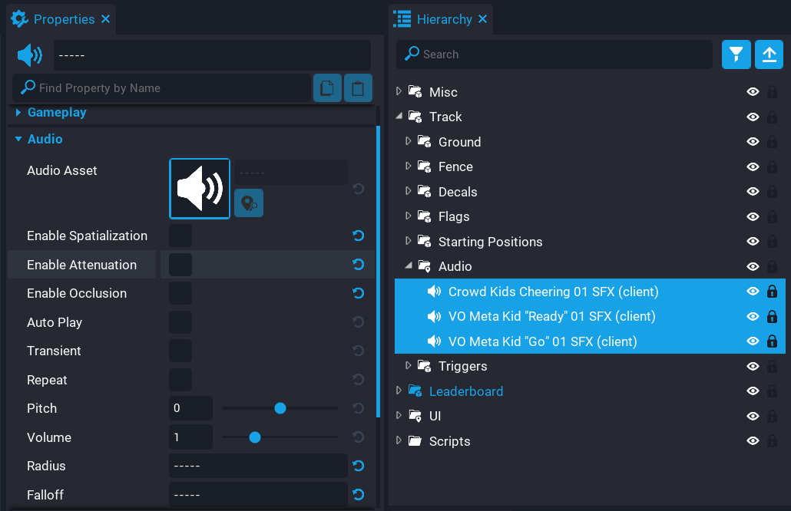{: .center loading="lazy" }

Next, you need to add the audio and finish line trigger as custom properties on the **RaceManager_Client** script.

1. Drag and drop the audio for **Get Ready** as a custom property and rename it to **readySnd**.
2. Drag and drop the audio for **Go** as a custom property and rename it to **goSnd**.
3. Drag and drop the audio for crossing the finish line as a custom property and rename it to **cheerSnd**.
4. Drag and drop the finish line trigger as a custom property and rename it to **finishTrigger**.

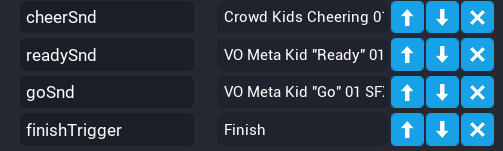{: .center loading="lazy" }

You need to edit the **RaceManager_Client** script to play the audio at certain points of the race.

```lua linenums="1"
local CHEER_SND = script:GetCustomProperty("cheerSnd"):WaitForObject()
local READY_SND = script:GetCustomProperty("readySnd"):WaitForObject()
local GO_SND = script:GetCustomProperty("goSnd"):WaitForObject()
local FINISH_TRIGGER = script:GetCustomProperty("finishTrigger"):WaitForObject()
```

Add the above code to the top of your script under the other variables.

```lua linenums="1" hl_lines="4"
local function GetReady()
    UpdateActiveSplit()

    READY_SND:Play()
    GET_READY.text = "Get Ready!"
end
```

Add line 4 to the `GetReady` function so that when the player is notified to get ready, it will play the `READY_SND`.

```lua linenums="1" hl_lines="2"
local function Go()
    GO_SND:Play()
    GET_READY.text = "Go!"
    timerStarted = true

    Task.Wait(1)

    GET_READY.text = ""
end
```

Add line 2 to the `Go` function that will play the `GO_SND` when the player can start running the race.

```lua linenums="1" hl_lines="10"
local function RaceFinished(finalTime)
    local formatted_time = string.format("%.3f", finalTime)

    LAST_TIME.text = "Last Time: " .. formatted_time
    RACE_TIME.text = formatted_time

    timerStarted = false
    timer = 0

    CHEER_SND:Play()

    Task.Wait(2)

    ClearActiveSplit()
    currentSplit = 0
end
```

Add line 10 to the `RaceFinished` function so that when the player has overlapped the finish line trigger, it will play the `CHEER_SND`.

Enter **Play** mode and listen to the new sound effects added at the start of the race and when crossing the finish line.

<div class="mt-video" style="width:100%">
    <video muted autoplay playsinline controls loop class="center" style="width:100%">
        <source src="/img/RaceTimerTutorial/audio_cues.mp4" type="video/mp4" />
    </video>
</div>

Enable the sound on the video above to hear sound effects.

### The Updated RaceManager_Client Script

??? "RaceManager_Client"
    ```lua linenums="1"
    --[[
        This script handles a few different things for the player.

            - Letting them know when to go (with audio cue).
            - Client side timer for the player to see while racing.
            - Best time displayed by reading the players private network data.
            - Playing a finished VFX and audio when crossing the finish line.
            - Setting / clear current split time and updating the split time.
    ]]

    local GET_READY = script:GetCustomProperty("getReady"):WaitForObject()
    local RACE_TIME = script:GetCustomProperty("raceTime"):WaitForObject()
    local BEST_TIME = script:GetCustomProperty("bestTime"):WaitForObject()
    local LAST_TIME = script:GetCustomProperty("lastTime"):WaitForObject()
    local SPLITS_PANEL = script:GetCustomProperty("splitsPanel"):WaitForObject()
    local SPLIT_TRIGGERS = script:GetCustomProperty("splitTriggers"):WaitForObject()
    local SPLIT_ENTRY = script:GetCustomProperty("splitEntry")
    local CHEER_SND = script:GetCustomProperty("cheerSnd"):WaitForObject()
    local READY_SND = script:GetCustomProperty("readySnd"):WaitForObject()
    local GO_SND = script:GetCustomProperty("goSnd"):WaitForObject()
    local FINISH_TRIGGER = script:GetCustomProperty("finishTrigger"):WaitForObject()

    local timerStarted = false
    local timer = 0
    local localPlayer = Game.GetLocalPlayer()

    local splits = {}
    local currentSplit = 0

    function Tick(dt)

        --[[
            If the race has started then increment the "timer" by adding
            the delta time between ticks.
        ]]

        if(timerStarted) then

            --[[
                Using string.format will display a nicely formatted time to the player.
                In this case the precision is set to 3, so for example 8.765.
            ]]

            RACE_TIME.text = string.format("%.3f", timer)
            timer = timer + dt
        end
    end

    --[[
        Resets the current active split text color in the UI to white only if the "currentSplit"
        the player has gone through is not the first, because there is no previous split.
    ]]

    local function ClearActiveSplit()
        if(currentSplit > 0) then
            splits[currentSplit].raceTime:SetColor(Color.WHITE)
            splits[currentSplit].splitTime:SetColor(Color.WHITE)
            splits[currentSplit].splitName:SetColor(Color.WHITE)
        end
    end

    --[[
        A nice way to visually see in the UI which split the player is
        currently on.
    ]]

    local function UpdateActiveSplit()
        ClearActiveSplit()

        if currentSplit >= #splits then
            return
        end

        currentSplit = currentSplit + 1
        splits[currentSplit].raceTime:SetColor(Color.YELLOW)
        splits[currentSplit].splitTime:SetColor(Color.YELLOW)
        splits[currentSplit].splitName:SetColor(Color.YELLOW)
    end

    local function GetReady()
        UpdateActiveSplit()

        READY_SND:Play()
        GET_READY.text = "Get Ready!"
    end

    --[[
        When the race is started the "timerStarted" variable is set to true so
        the "Tick" function can handle updating the race timer in the UI for the
        player.
    ]]

    local function Go()
        GO_SND:Play()
        GET_READY.text = "Go!"
        timerStarted = true

        Task.Wait(1)

        GET_READY.text = ""
    end

    --[[
        Sets "timerStarted" to false so the race timer in the UI is stopped.

        The "timer" gets reset for the next race, otherwise it would continue
        increasing.

        Since the race has stopped, the race timer in the UI also gets reset.
    ]]

    local function StopRace()
        timerStarted = false
        timer = 0
        RACE_TIME.text = "0.000"

        ClearActiveSplit()
        currentSplit = 0
    end

    --[[
        When the race is finished the players time is received and displayed to the player.
        The reason for this is because the timer on the server is more accurate then what is
        on the client (player).

        Since the race has finished, the "timer" can be reset for the next race and also stop
        the timer from continuing to be incremented in the "Tick" function.
    ]]

    local function RaceFinished(finalTime)
        local formatted_time = string.format("%.3f", finalTime)

        LAST_TIME.text = "Last Time: " .. formatted_time
        RACE_TIME.text = formatted_time

        timerStarted = false
        timer = 0

        CHEER_SND:Play()

        Task.Wait(2)

        ClearActiveSplit()
        currentSplit = 0
    end

    --[[
        Sets the time for the current split trigger the player has overlapped.
    ]]

    local function SetSplitTime(index, splitTime, raceTime)
        if splits[index] ~= nil then
            UpdateActiveSplit()

            splits[index].splitTime.text = string.format("%.3f", splitTime)
            splits[index].raceTime.text = string.format("%.3f", raceTime)
        end
    end

    -- Events

    Events.Connect("GetReady", GetReady)
    Events.Connect("Go", Go)
    Events.Connect("StopRace", StopRace)
    Events.Connect("RaceFinished", RaceFinished)
    Events.Connect("SetSplitTime", SetSplitTime)

    -- Private network data handling for the player

    local function UpdateFromNetworkData(key)
        local data = localPlayer:GetPrivateNetworkedData(key)

        if key == "bestTime" then
            if data ~= nil and data > 0 then
                BEST_TIME.text = string.format("Best Time: %.3f", data)
            else
                BEST_TIME.text = ""
            end
        end
    end

    local function OnPrivateDataChanged(player, key)
        UpdateFromNetworkData(key)
    end

    localPlayer.privateNetworkedDataChangedEvent:Connect(OnPrivateDataChanged)

    for i, key in ipairs(localPlayer:GetPrivateNetworkedDataKeys()) do
        UpdateFromNetworkData(key)
    end

    -- Setup splits for the UI which are done dynamically for ease.

    local offsetY = 0
    local children = SPLIT_TRIGGERS:GetChildren()

    children[#children + 1] = FINISH_TRIGGER

    for i, t in ipairs(children) do
        local entry = World.SpawnAsset(SPLIT_ENTRY, {

            parent = SPLITS_PANEL

        })

        entry:FindChildByName("Split Name").text = t.name

        entry.y = offsetY
        offsetY = offsetY + 42

        splits[i] = {

            splitTime = entry:FindChildByName("Split Time"),
            raceTime = entry:FindChildByName("Race Time"),
            splitName = entry:FindChildByName("Split Name")

        }
    end

    --[[
        The UI panel which displays the best time and splits has the height dynamically set.
        This is done by getting the parent (panel) height and adding the height of the
        child (42) times the amount of children that started in the panel.
    ]]

    SPLITS_PANEL.parent.height = SPLITS_PANEL.parent.height + (#children * 42)
    ```

### Add Effects

Finally let's add a simple effect that plays when the player finishes the race.

1. Create a **Client Context** folder and rename it to **Effects**.
2. Find the **Confetti** effect in the **Core Content** panel and place it into the **Effects** folder.
3. Drag and drop the effect onto the **RaceManager_Client** script as a custom property and rename it to **confettiVFX**.

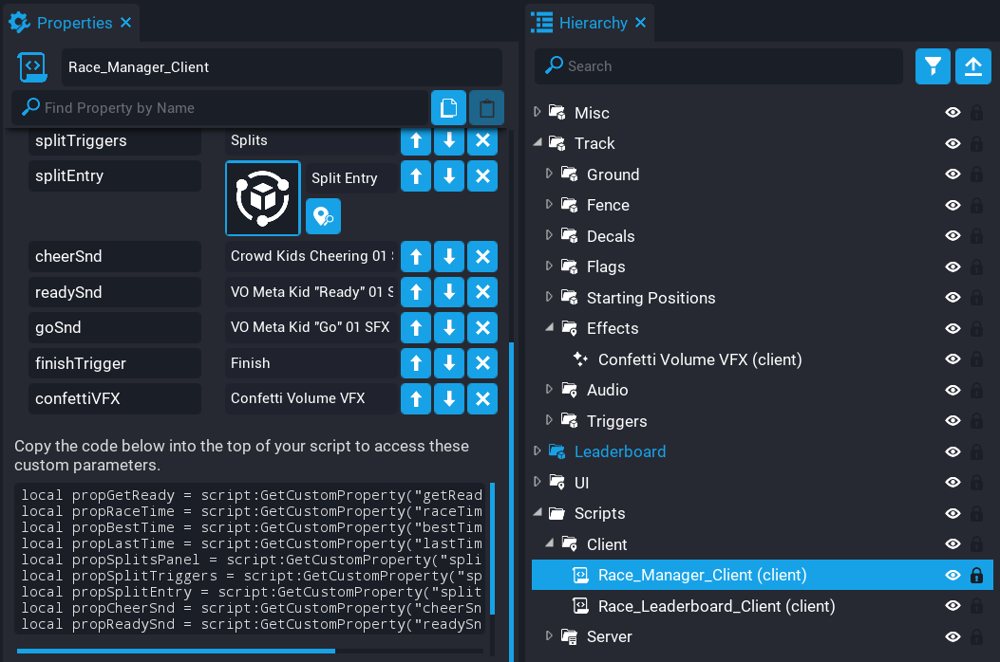{: .center loading="lazy" }

```lua linenums="1"
local CONFETTI_VFX = script:GetCustomProperty("confettiVFX"):WaitForObject()
```

Add the above code to the top of the script just below the other variables.

```lua linenums="1" hl_lines="11 18"
local function RaceFinished(finalTime)
    local formatted_time = string.format("%.3f", finalTime)

    LAST_TIME.text = "Last Time: " .. formatted_time
    RACE_TIME.text = formatted_time

    timerStarted = false
    timer = 0

    CHEER_SND:Play()
    CONFETTI_VFX:Play()

    Task.Wait(2)

    ClearActiveSplit()
    currentSplit = 0

    CONFETTI_VFX:Stop()
end
```

Add the lines on line 11 and 18 to play and stop the confetti. When the player crosses the finish line the confetti will be played. 2 seconds later it will stop ready for the next race.

Enter **Play** mode and cross the finish line to see the confetti effect.

<div class="mt-video" style="width:100%">
    <video muted autoplay playsinline controls loop class="center" style="width:100%">
        <source src="/img/RaceTimerTutorial/finished_effect.mp4" type="video/mp4" />
    </video>
</div>

Enable the sound on the video above to hear sound effects.

### The Final RaceManager_Client Script

??? "RaceManager_Client"
    ```lua linenums="1"
    --[[
        This script handles a few different things for the player.

            - Letting them know when to go (with audio cue).
            - Client side timer for the player to see while racing.
            - Best time displayed by reading the players private network data.
            - Playing a finished VFX and audio when crossing the finish line.
            - Setting / clear current split time and updating the split time.
    ]]

    local GET_READY = script:GetCustomProperty("getReady"):WaitForObject()
    local RACE_TIME = script:GetCustomProperty("raceTime"):WaitForObject()
    local BEST_TIME = script:GetCustomProperty("bestTime"):WaitForObject()
    local LAST_TIME = script:GetCustomProperty("lastTime"):WaitForObject()
    local SPLITS_PANEL = script:GetCustomProperty("splitsPanel"):WaitForObject()
    local SPLIT_TRIGGERS = script:GetCustomProperty("splitTriggers"):WaitForObject()
    local SPLIT_ENTRY = script:GetCustomProperty("splitEntry")
    local CHEER_SND = script:GetCustomProperty("cheerSnd"):WaitForObject()
    local READY_SND = script:GetCustomProperty("readySnd"):WaitForObject()
    local GO_SND = script:GetCustomProperty("goSnd"):WaitForObject()
    local FINISH_TRIGGER = script:GetCustomProperty("finishTrigger"):WaitForObject()
    local CONFETTI_VFX = script:GetCustomProperty("confettiVFX"):WaitForObject()

    local timerStarted = false
    local timer = 0
    local localPlayer = Game.GetLocalPlayer()

    local splits = {}
    local currentSplit = 0

    function Tick(dt)

        --[[
            If the race has started then increment the "timer" by adding
            the delta time between ticks.
        ]]

        if(timerStarted) then

            --[[
                Using string.format will display a nicely formatted time to the player.
                In this case the precision is set to 3, so for example 8.765.
            ]]

            RACE_TIME.text = string.format("%.3f", timer)
            timer = timer + dt
        end
    end

    --[[
        Resets the current active split text color in the UI to white only if the "currentSplit"
        the player has gone through is not the first, because there is no previous split.
    ]]

    local function ClearActiveSplit()
        if(currentSplit > 0) then
            splits[currentSplit].raceTime:SetColor(Color.WHITE)
            splits[currentSplit].splitTime:SetColor(Color.WHITE)
            splits[currentSplit].splitName:SetColor(Color.WHITE)
        end
    end

    --[[
        A nice way to visually see in the UI which split the player is
        currently on.
    ]]

    local function UpdateActiveSplit()
        ClearActiveSplit()

        if currentSplit >= #splits then
            return
        end

        currentSplit = currentSplit + 1
        splits[currentSplit].raceTime:SetColor(Color.YELLOW)
        splits[currentSplit].splitTime:SetColor(Color.YELLOW)
        splits[currentSplit].splitName:SetColor(Color.YELLOW)
    end

    local function GetReady()
        UpdateActiveSplit()

        READY_SND:Play()
        GET_READY.text = "Get Ready!"
    end

    --[[
        When the race is started the "timerStarted" variable is set to true so
        the "Tick" function can handle updating the race timer in the UI for the
        player.
    ]]

    local function Go()
        GO_SND:Play()
        GET_READY.text = "Go!"
        timerStarted = true

        Task.Wait(1)

        GET_READY.text = ""
    end

    --[[
        Sets "timerStarted" to false so the race timer in the UI is stopped.

        The "timer" gets reset for the next race, otherwise it would continue
        increasing.

        Since the race has stopped, the race timer in the UI also gets reset.
    ]]

    local function StopRace()
        timerStarted = false
        timer = 0
        RACE_TIME.text = "0.000"

        ClearActiveSplit()
        currentSplit = 0
    end

    --[[
        When the race is finished the players time is received and displayed to the player.
        The reason for this is because the timer on the server is more accurate then what is
        on the client (player).

        Since the race has finished, the "timer" can be reset for the next race and also stop
        the timer from continuing to be incremented in the "Tick" function.
    ]]

    local function RaceFinished(finalTime)
        local formatted_time = string.format("%.3f", finalTime)

        LAST_TIME.text = "Last Time: " .. formatted_time
        RACE_TIME.text = formatted_time

        timerStarted = false
        timer = 0

        CHEER_SND:Play()
        CONFETTI_VFX:Play()

        Task.Wait(2)

        ClearActiveSplit()
        currentSplit = 0

        CONFETTI_VFX:Stop()
    end

    --[[
        Sets the time for the current split trigger the player has overlapped.
    ]]

    local function SetSplitTime(index, splitTime, raceTime)
        if splits[index] ~= nil then
            UpdateActiveSplit()

            splits[index].splitTime.text = string.format("%.3f", splitTime)
            splits[index].raceTime.text = string.format("%.3f", raceTime)
        end
    end

    -- Events

    Events.Connect("GetReady", GetReady)
    Events.Connect("Go", Go)
    Events.Connect("StopRace", StopRace)
    Events.Connect("RaceFinished", RaceFinished)
    Events.Connect("SetSplitTime", SetSplitTime)

    -- Private network data handling for the player

    local function UpdateFromNetworkData(key)
        local data = localPlayer:GetPrivateNetworkedData(key)

        if key == "bestTime" then
            if data ~= nil and data > 0 then
                BEST_TIME.text = string.format("Best Time: %.3f", data)
            else
                BEST_TIME.text = ""
            end
        end
    end

    local function OnPrivateDataChanged(player, key)
        UpdateFromNetworkData(key)
    end

    localPlayer.privateNetworkedDataChangedEvent:Connect(OnPrivateDataChanged)

    for i, key in ipairs(localPlayer:GetPrivateNetworkedDataKeys()) do
        UpdateFromNetworkData(key)
    end

    -- Setup splits for the UI which are done dynamically for ease.

    local offsetY = 0
    local children = SPLIT_TRIGGERS:GetChildren()

    children[#children + 1] = FINISH_TRIGGER

    for i, t in ipairs(children) do
        local entry = World.SpawnAsset(SPLIT_ENTRY, {

            parent = SPLITS_PANEL

        })

        entry:FindChildByName("Split Name").text = t.name

        entry.y = offsetY
        offsetY = offsetY + 42

        splits[i] = {

            splitTime = entry:FindChildByName("Split Time"),
            raceTime = entry:FindChildByName("Race Time"),
            splitName = entry:FindChildByName("Split Name")

        }
    end

    --[[
        The UI panel which displays the best time and splits has the height dynamically set.
        This is done by getting the parent (panel) height and adding the height of the
        child (42) times the amount of children that started in the panel.
    ]]

    SPLITS_PANEL.parent.height = SPLITS_PANEL.parent.height + (#children * 42)
    ```

## Finished Project

The finished project for this tutorial is available to play and edit.

<https://www.coregames.com/games/b2376e/example-project-race-timer>

## Summary

Timers are used in a wide range of games for many different things. Armed with the knowledge in this tutorial you can apply these new skills for creating accurate times to your own games.

Breaking down a feature to see what components may be needed is a good way to see that not everything is as complex as it first may seem.

Try changing the race track, add a few turns, elevation changes so that it's more interesting to players.

Here are some ideas that you could consider implementing:

- Assign lane positions per player
- Lobby timer
- More interesting track
- In race leaderboard
- Race winner notification
- Total wins leaderboard
- Sprinting upgrades

Share your creations with the Core Creators Discord community.

<https://discord.gg/core-creators>
