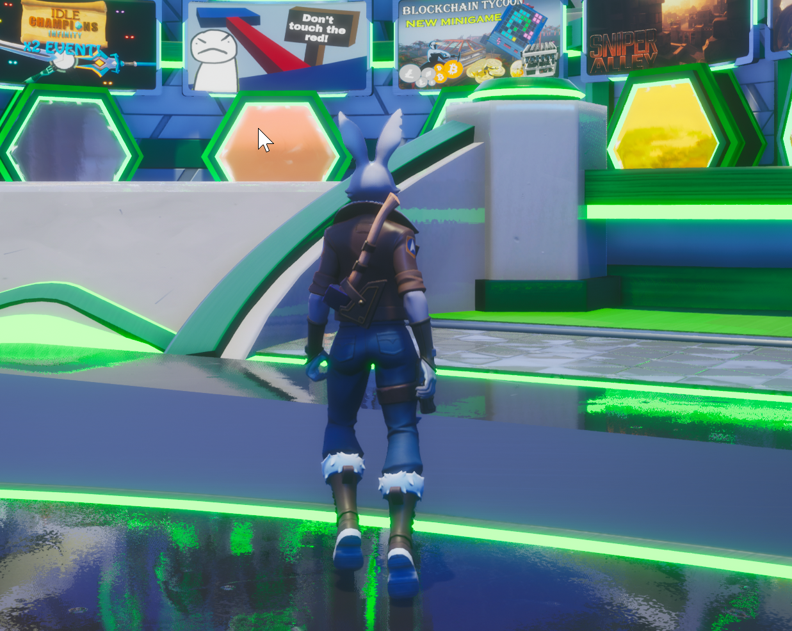

# Racing Tutorial

## Opening the Framework

### Open the Core Editor

1. Select the **CREATE** menu.
2. 
 
### Select the Racing Framework

<!-- TODO: Match the name exactly -->

---

## Learn More

