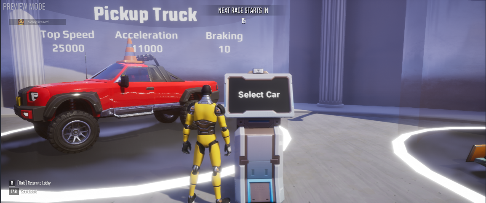
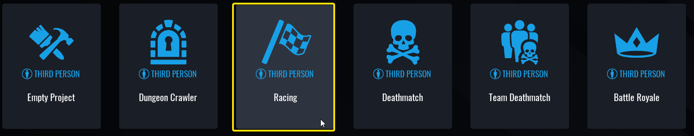
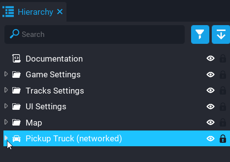
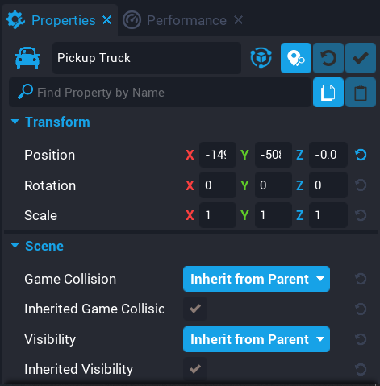
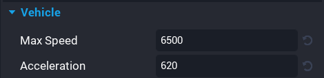
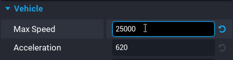
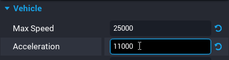
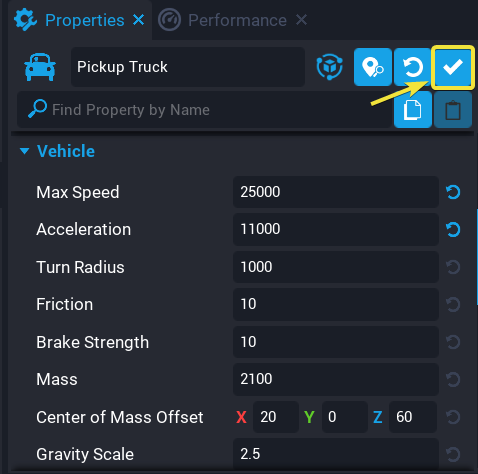

# Create a Racing Game in Core

## Overview

The **Racing Framework** provides everything you need to start making your first racing game in Core. This tutorial will give you the tools you need to modify the cars and racetracks in the Racing Framework.

{: .center loading="lazy"}

## Create a Racing Framework Game

* Create a new project
* Click on the **View Frameworks** button
* Select the **Racing Framework**

{: .center loading="lazy"}

{: .center loading="lazy"}

## Testing the Racing Framework

After creating your **Racing Framework** game you should play it to make sure that everything is working. Playing the **Racing Framework** game will also familiarize you with how the system functions.

## Changing the Truck

In this section you will modify the **Pickup Truck** from the **Racing Framework**. The modifications you will make to the **Pickup Truck** can also be made to any other cars in the **Racing Framework**.

### Adding the Pickup Truck into the scene

 You first need to add the **Pickup Truck** into your hierarchy before you can modify the **Pickup Truck** template.

1. Open the **Project Content** window
2. Click on **My Templates**
3. Click on the **Cars** tab
4. Drag the **Pickup Truck** template into your **Main Viewport**

You will now see a list of car templates in the bottom window. These car templates are the same cars that you can find in the car selection area in your **Racing Framework** game.

    <video autoplay loop muted playsinline poster="/img/EditorManual/Abilities/Gem.png" class = "center" style="width:100%">
        <source src="/img/RacingTutorial/DragCarIntoHierarchy.mp4" type="video/mp4" />
    </video>

## Changing the Look of the Pickup Truck

### Opening up the Truck

The first change to the **Pickup Truck** will change what the **Pickup Truck** looks like. You will be adding a cone on top of the **Pickup Truck**. Using the following steps you can change the **Pickup Truck** to look like anything.

!!!tip
    Click on the
    {: loading="lazy" style="height:2em; width:auto" .image-inline-text}
    icon or the {: loading="lazy" style="height:2em; width:auto" .image-inline-text} icon to switch the view type in the **Project Content**, **Core Content** or **Imported Content** windows.

You first need to expand the **Pickup Truck** in your hierarchy so that you can see what is inside of it. Click on the triangle next to the word **Pickup Truck** to open up the **Pickup Truck** in your hierarchy.

1. Open the **Client Context** folder
2. Open the folder named **Geo**
3. Open the folder named **Body**
4. Open the **Urban Car - Truck Lifted 01 (Prop)** folder
5. Open the folder named **Body**

    <video autoplay loop muted playsinline poster="/img/EditorManual/Abilities/Gem.png" class = "center">
        <source src="/img/RacingTutorial/ExpandTruckHierarchy.mp4" type="video/mp4" />
    </video>

The **Body** folder contains all of the pieces that make up the main body of the **Pickup Truck**. You will be adding a cone into this **Body** folder.

### Finding and Adding the Cone

You now will have to find the cone asset from the **Core Content** window.

1. Click on the **Core Content** window
2. Click on **3D Objects** tab
3. Click on the **Art Objects** tab
4. Click on the **Props** tab
5. Click on the **Urban** tab
6. Click on the **Street** tab

    <video autoplay loop muted playsinline poster="/img/EditorManual/Abilities/Gem.png" class = "center" style="width:100%">
        <source src="/img/RacingTutorial/FindingTheCone.mp4" type="video/mp4" />
    </video>

Now that you have found the cone asset. Drag the cone asset into the **Body** folder of your **Pickup Truck**. You will see a popup window that says **DEINSTANCE TEMPLATE** at the top. Click on the **Deinstance** button.

    <video autoplay loop muted playsinline poster="/img/EditorManual/Abilities/Gem.png" class = "center" style="width:100%">
        <source src="/img/RacingTutorial/AddingConeToTruck.mp4" type="video/mp4" />
    </video>

The **Pickup Truck (networked)** should now be a teal color. The teal color indicates that an object in your hierarchy is a deinstanced template.

The cone is now a part of the **Pickup Truck**. The cone was given the name **Road Cone 01 (client)**. Move the **Road Cone 01 (client)** on top of the **Pickup Truck**.

    <video autoplay loop muted playsinline poster="/img/EditorManual/Abilities/Gem.png" class = "center" style="width:100%">
        <source src="/img/RacingTutorial/MoveConeOnTruck.mp4" type="video/mp4" />
    </video>

## What is a Template?

A template is similar to a blueprint. A template tells Core what objects need to be instantiated when we spawn the template. You have been modifying the **Pickup Truck** template. In the Racing Game Kit in you can see multiple instances of this **Pickup Truck** template. One instance of the **Pickup Truck** template can be found at the vehicle select area. At the start of the race, one **Pickup Truck** template is spawned for each player that selects the **Pickup Truck**.

To modify a template you first have to deinstance the template (a deinstanced template will be teal). You deinstanced the **Pickup Truck** template so that you could modify the **Pickup Truck**.

## Updating the Pickup Truck Template

After you have modified the template you have to update it. One way to update a template is to select a teal object from the template and press the {: loading="lazy" style="height:2em; width:auto" .image-inline-text} icon.

Another way to update a template is to right click on one of the teal objects and select **Update Template From This** from the pop up menu.

    <video autoplay loop muted playsinline poster="/img/EditorManual/Abilities/Gem.png" class = "center">
        <source src="/img/RacingTutorial/UpdateTemplate.mp4" type="video/mp4" />
    </video>

 You must save your project after updating a template. You can save your project by pressing ++ctrl++ + ++s++.

## Modifying the Speed of the Pickup Truck

You are not limited to only changing the appearance of the **Pickup Truck**. You can also modify different properties of the **Pickup Truck**. Specifically, you will be changing the **Max Speed** and **Acceleration** property of the **Pickup Truck** to increase the speed of the **Pickup Truck**.

To modify the **Max Speed** and **Acceleration** properties, you have to click on the object named **Pickup Truck (networked)**. You can find the **Pickup Truck (networked)** in your **Hierarchy** window.

{: .center loading="lazy"}

Now that you have the **Pickup Truck (networked)** selected. In the bottom right of your screen you will see a window named **Properties**. The **Properties** window contains all of the different properties of an object.

{: .center loading="lazy"}

You need to scroll down in the **Properties** window until you a section named **Vehicle**. In the **Vehicle** section you will see two properties **Max Speed** and **Acceleration**. The **Max Speed** property controls the maximum speed of the **Pickup Truck**. The **Acceleration** property of the **Pickup Truck** controls the acceleration of the **Pickup Truck**.

{: .center loading="lazy"}

Double click number 6500. Then, input a value of 25000 for the **Max Speed** property. Next, set the **Acceleration** property to 11000.

{: .center loading="lazy"}

{: .center loading="lazy"}

Finally, click on the update template icon. This will update the **Pickup Truck** template to reflect the changes you made.

{: .center loading="lazy"}

You can now delete the **Pickup Truck (networked)** object in your hierarchy by clicking on it and pressing the ++backspace** key.

## Changing the Track

This section will cover the steps necessary to modify any track from the **Racing Framework**.

### Changing the Track Shape

In this section, you will be removing a portion of the track to change its shape.

{: .center loading="lazy"}

The <u>**Blue**{: style="color: rgb(23,159,227)"}</u> section represents track that will be removed from the minimap. The <u>**Orange**{: style="color: rgb(255,153,0)"}</u> section represents the track section that you will add to the track and minimap.

You will use the hotkey actions below to do the following:

1. Delete the buildings on top of the detour
2. Remove the Railings on the Curves of the track
3. Reposition the track to fill in the <u>**Orange**{: style="color: rgb(255,153,0)"}</u> section

Use the ++left-button++ of the mouse to select objects in the **Main Viewport**.

Press the ++backspace++ key to delete selected objects.

Hold the ++ctrl++ key to select multiple objects in the **Main Viewport**.

Use the ++ctrl++ + ++w++ keys to duplicate a selected object or group of selected objects.

Press the ++e++ key to display the rotate tool for a selected object.

Press the ++w++ key to display the positioning tool for a selected object.

First, you will remove the buildings that are on top of the <u>**Orange**{: style="color: rgb(255,153,0)"}</u> section.

    <video autoplay loop muted playsinline poster="/img/EditorManual/Abilities/Gem.png" class = "center" style="width:100%">
        <source src="/img/RacingTutorial/DeleteBuildings.mp4" type="video/mp4" />
    </video>

Next, you will remove the railings on the track.

    <video autoplay loop muted playsinline poster="/img/EditorManual/Abilities/Gem.png" class = "center" style="width:100%">
        <source src="/img/RacingTutorial/RemoveRailing.mp4" type="video/mp4" />
    </video>

Next, you will rotate the curved track.

    <video autoplay loop muted playsinline poster="/img/EditorManual/Abilities/Gem.png" class = "center" style="width:100%">
        <source src="/img/RacingTutorial/RotateRoad.mp4" type="video/mp4" />
    </video>

Next, you will reposition and duplicate the track section to fill in the gap.

    <video autoplay loop muted playsinline poster="/img/EditorManual/Abilities/Gem.png" class = "center" style="width:100%">
        <source src="/img/RacingTutorial/RepositionRoad.mp4" type="video/mp4" />
    </video>

### Changing the Minimap

After you have modified the track, you will need modify the minimap to display your changes to the track.

!!!tip
    Press the ++v++ key to show the **Trigger** objects in the **Main Viewport**.

The minimap uses waypoints to determine how to draw the minimap. Each waypoint is represented by a **Trigger** object. Changing the position of each **Trigger** will change the rotation and position of each road drawn on the minimap.

You will first need to open the folder named **Waypoints** that contains the triggers used as waypoints.

1. Open the **Tracks Settings** folder
2. Open the **Track 1** folder
3. Open the **Track 1 Settings** folder
4. Open the **Waypoints** folder

    <video autoplay loop muted playsinline poster="/img/EditorManual/Abilities/Gem.png" class = "center" >
        <source src="/img/RacingTutorial/OpenWaypointsFolder.mp4" type="video/mp4" />
    </video>

The minimap will draw a road that connects each **Trigger** to the **Trigger** below it in the **Hierarchy** window. You will be removing 3 waypoints from the **Waypoints** folder so that the minimap draws your modified version of the track.

    <video autoplay loop muted playsinline poster="/img/EditorManual/Abilities/Gem.png" class = "center" style="width:100%">
        <source src="/img/RacingTutorial/RemoveTriggers.mp4" type="video/mp4" />
    </video>

## Learn More

[Templates](template_reference.md) | [Environment Art](environment_art.md)
