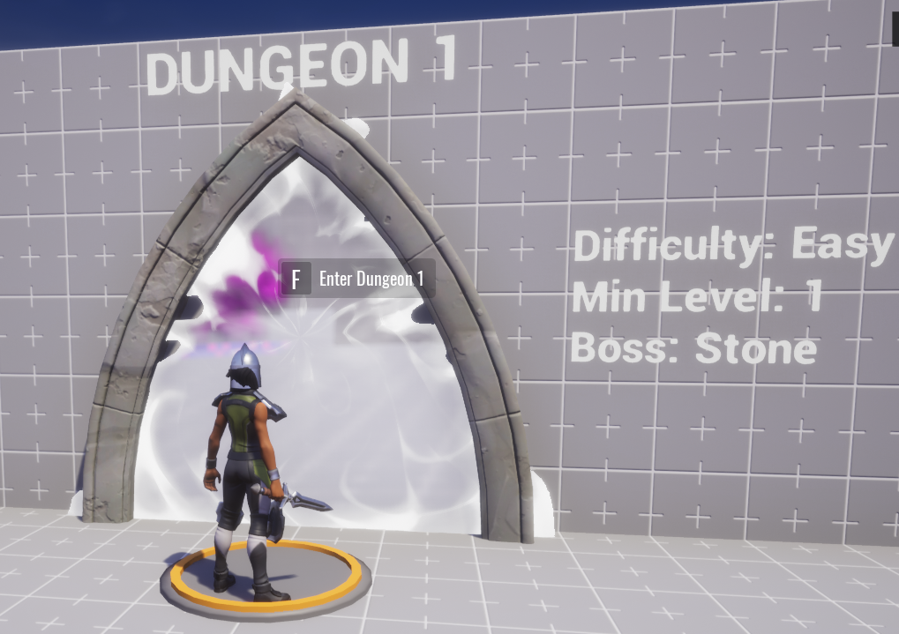

## Parts of the Framework

### Framework Documentation

This section contains two scripts, **DocumentationFrameworkOverview** and **DocumentationNPCKit**. These do not contain code, but instead have instructions on how to use this framework, and how to use the non-player character enemies in the dungeon (NPC's). You can also [read this documentation online](rpg_framework_documentation.md).

### Game Settings

This section contains the existing logic of the game.

- **Game Settings** has options for in-game chat, player death behavior, and most importantly the **Enable Player Storage** setting which is necessary to save player's levels, gold, and equipment.
- **Team Settings** is used to create two teams, one for all of the players, and another for all of the enemies.
- The **ResourcePersisterServer** script keeps track of players' gold, even when they disconnect and reconnect later.
- The **EquipmentPersistentStarterServer** gives players the same weapons they had last when they disconnect and reconnect.
- **Basic Level Progression** allows players to increase in level with experience (XP), gaining more hit points (HP). In the **Levels List** folder, there are objects for each level with custom properties that allow you to change how much **RequiredXP** players need to reach the level, and what the player's **MaxHP** will be when they level up.
- The **Loot Drop Factory** template includes logic to make enemies give items to players when they are defeated. Inside this template are folders of the **Common**, **Uncommon**, and **Rare** drops which can be modified to change the rewards that players get, and how likely they are to appear.
- **Combat Dependencies** contains the scripts that allow enemy AI's to fight and take damage.
- **Third Person Camera Settings** has options for how the camera is controlled in game. You could trade out this object for one of the other **Camera Settings** objects in **Core Content** for a totally different player experience.

<!--  TODO -->

### UI Settings

This section includes all the of the information displayed on the screen to tell players about their health, XP, coins, abilities, and which location they are in. You can change the way these are displayed. Check out the Core [UI Reference](ui_reference.md) to learn more about using the 2D User Interface elements.

### Map

The **Map** folder contains all of the objects you can see in the game. This is the section you will modify in this tutorial

- The **Environment** folder contains the sky template, which is currently the only source of light for the game.
- The **Lobby**  folder is the heart of the project. It has folders of all the example pieces, the shop, teleporters to the dungeons, and all the explanatory text that you can currently see in the world.
- The **Dungeons** folder contains the enemies and obstacles that make up each of the three dungeons
- The **Wall** and **Ground** folders contain all the objects that make up the ground and outer walls.
- The **Kill Zone** is a trigger that kills any player that gets outside of the boundaries of the dungeon, so that they can be reset back into the game rather than stuck outside of it.

### NavMesh

This folder contains a script that uses **Plain** objects to determine where the enemies can go. This is invisible by default, and we will make it visible in order to be able to build around the AI behavior, and modify it as necessary.

## Testing the Base Game

### Start a Preview

If **Multiplayer Preview Mode** is enabled, turn it off now to preview the game with just yourself.

1. Click  to turn it gray and turn off Multiplayer Preview Mode.
    {: .image-inline-text .image-background}

2. Press  to start the preview.
    {: .image-inline-text .image-background}

### Framework Documentation

This section contains two scripts, **DocumentationFrameworkOverview** and **DocumentationNPCKit**. These do not contain code, but instead have instructions on how to use this framework, and how to use the non-player character enemies in the dungeon (NPC's). You can also read this documentation online here.

### Game Settings

This section contains the existing logic of the game.

- **Game Settings** has options for in-game chat, player death behavior, and most importantly the **Enable Player Storage** setting which is necessary to save player's levels, gold, and equipment.
- **Team Settings** is used to create two teams, one for all of the players, and another for all of the enemies.
- The **ResourcePersisterServer** script keeps track of players' gold, even when they disconnect and reconnect later.
- The **EquipmentPersistentStarterServer** gives players the same weapons they had last when they disconnect and reconnect.
- **Basic Level Progression** allows players to increase in level with experience (XP), gaining more hit points (HP). In the **Levels List** folder, there are objects for each level with custom properties that allow you to change how much **RequiredXP** players need to reach the level, and what the player's **MaxHP** will be when they level up.
- The **Loot Drop Factory** template includes logic to make enemies give items to players when they are defeated. Inside this template are folders of the **Common**, **Uncommon**, and **Rare** drops which can be modified to change the rewards that players get, and how likely they are to appear.
- **Combat Dependencies** contains the scripts that allow enemy AI's to fight and take damage.
- **Third Person Camera Settings** has options for how the camera is controlled in game. You could trade out this object for one of the other **Camera Settings** objects in **Core Content** for a totally different player experience.

{: .center loading="lazy" }

### UI Settings

This section includes all the of the information displayed on the screen to tell players about their health, XP, coins, abilities, and which location they are in. You can change the way these are displayed. Check out the Core [UI Reference](ui_reference.md) to learn more about using the 2D User Interface elements.

### Map

The **Map** folder contains all of the objects you can see in the game. This is the section you will modify in this tutorial

- The **Environment** folder contains the sky template, which is currently the only source of light for the game.
- The **Lobby**  folder is the heart of the project. It has folders of all the example pieces, the shop, teleporters to the dungeons, and all the explanatory text that you can currently see in the world.
- The **Dungeons** folder contains the enemies and obstacles that make up each of the three dungeons
- The **Wall** and **Ground** folders contain all the objects that make up the ground and outer walls.
- The **Kill Zone** is a trigger that kills any player that gets outside of the boundaries of the dungeon, so that they can be reset back into the game rather than stuck outside of it.

### NavMesh

This folder contains a script that uses **Plain** objects to determine where the enemies can go. This is invisible by default, and we will make it visible in order to be able to build around the AI behavior, and modify it as necessary.

## Testing the Base Game

### Start a Preview

If **Multiplayer Preview Mode** is enabled, turn it off now to preview the game with just yourself.

1. Click  to turn it gray and turn off Multiplayer Preview Mode.
    {: .image-inline-text .image-background}

2. Press  to start the preview.
    {: .image-inline-text .image-background}

### Player Stats

The UI elements on the screen should now show information specific to your player.

- In the top left corner, you should see a list of players and their levels, that will just be you at level 1.
- In the bottom left corner, you have a **Basic Dagger**, 100 **HP**, and 0 **XP**.
- In the bottom right corner, you have the ability to **Stab** using **M1**, which is the left mouse button.
- In the top right corner, you have 0 **gold**, represented by a yellow coin icon.

{: .center loading="lazy" }

<!-- ### The Portal to Core Haven

Behind the place where you spawned into the game, you should see a hallway leading to a giant magical doorway.

 

Games made for the D&D Contest will all be connected through a D&D Hub World, and this portal allows players to return to the Hub World. TODO: Add content -->

### Sample Objects

#### Castle Tileset

Outside the walls of the lobby, you should see various castle parts. These are all available in **Core Content**. You can see them by opening the **3D Objects** folder in **Core Content** navigation, then opening **Tilesets** and **Fantasy**.

The **Castle** section holds the parts you see outside the walls, and the **Templates** section has some example builds using those pieces

#### Fantasy Props

On the right side of the Lobby you should see different chests, potions and candles showing off the available fantasy props. These can also be found in **Core Content** by opening the **3D Objects** fp;der. and then **Props** and **Fantasy**.

### Weapons Shop and Costumes Shop

As you return to the Lobby, you should see items along the wall on your left, representing a **Costumes Shop** and a **Weapons Shop**.

<!--  TODO -->

There are two upgrades you can afford right now, for 0 gold:

#### Walk up to the **Soldier Costume** and press ++F++ to equip it

{: .center loading="lazy" }

#### Next, find the Basic 1H Sword and press ++F++ to equip it

{: .center loading="lazy" }

### The First Dungeon

You are now ready for your first adventure! Stand on the platform in front of **Dungeon 1**, and press ++F++ to teleport inside.

{: .center loading="lazy" }

As you play the dungeon, you should notice a few things:

- Enemies will chase after you, but only if you are in their line of sight.
- Killing enemies drops loot, but not always, since "Nothing" is one of the common possibilities in the **Loot Table**.
- Killing enemies also gives you XP so that you can level up.
- At the end of the dungeon, you should see a door to a boss fight.

Good luck on your adventure!
