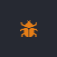

# Script Debugger

## Overview

Sometimes when you write code, it doesn't always behave as expected. Those unexpected results can lead to parts of your game being broken for your players, and potentially ruin the experience. Spending time looking for those errors in your script can be very time consuming. This is where the **Script Debugger** in **Core** can help you narrow down where in your script the error occurred.

In this tutorial, you are going to learn how to use the **Script Debugger** in **Core**.

You will learn the following:

- What is a **Script Debugger**
- How to open the **Script Debugger**
- How to enable and disabled the **Script Debugger**
- How to add and remove breakpoints
- How to step into, over, and out of scripts
- How to inspect objects to see what data they hold

## What is a Script Debugger?

The **Script Debugger** in **Core** is a tool used to examine the state of your game while it is running. The **Script Debugger** can be set to pause the game at specific points in your script by setting **breakpoints**, so that you can inspect the values of variables and objects. Using the **Script Debugger**, can allow you to step through your scripts slowly to determine where an issue may be in your game.

There are different ways that you can debug your game to find issues (also know as **Bugs**). A common way to is to use the `print` function to print out to the **Event Log**, however, this can be a slow process when more complex errors occur in your game, so using a debugger could save you a lot of time.

## Open Script Debugger

!!! info "Script Debugger and External Editors"
    The **Script Debugger** only works with the **Script Editor** in **Core**, and not external editors. This isn't a problem when debugging, because scripts in **Core** can be opened up with the **Script Editor** by right clicking on the script and selecting **Edit Script** from the menu.

From the **Window** menu, select **Script Debugger** to open up the **Script Debugger** window.

{: .center loading="lazy" }

## Enable Script Debugger

The **Script Debugger** needs to be enabled so any breakpoints added, will pause the execution of the game, which allows you to inspect specific areas of interest in your script that may contain an issue.

Click on the icon to enable the **Script Debugger**. When enabled, the icon will turn red , indicating the **Script Debugger** is turned on. With the **Script Debugger** now turned on, any breakpoints added will pause execution of the game.
{: .image-inline-text .image-background }

!!! info "When disabling the **Script Debugger**, all breakpoints will also be disabled. This is useful, because you don't need to remove all your breakpoints. Next time you enable the **Script Debugger**, the breakpoints will be enabled."

## Enable Pause on Error

The **Script Debugger** has the option to automatically pause the game when an error has occurred. This can be useful to have enabled when scripts in your game are causing an error, so that you can debug any variables or objects that relate to the error occurring. Click on the icon, the icon will change to red , indicating that the **Script Debugger** will pause on error.
{: .image-inline-text .image-background }

## Use Breakpoints

In this section you will learn how to add and remove breakpoints.

A breakpoint is a marker you can set for a specific line in your script. More than one marker can be set in a script, but only one can be set for each line. Markers can be set by left clicking with the mouse in the far left margin of the **Script Editor**.

### Create a Script

To use the **Script Debugger**, you need a script with some code so breakpoints can be added to pause execution.

1. Create a new script and place it into your **Hierarchy**
2. Right click on the script in the **Hierarchy**, select **Edit Script** from the menu.
3. Add the following code to the new script created.

```lua
local animals = { "Cat", "Dog", "Rabbit", "Mouse" }
local randomIndex = math.random(#animals)
local animal = animals[randomIndex]

print("Animal is: " .. animal)
```

The above code prints out a random animal name from the array of animals stored in the `animals` table.

### Add a Breakpoint

You need to add a breakpoint so the **Script Debugger** knows where to pause execution. You can add a breakpoint by left clicking with your mouse in the far left margin of the **Script Editor**. On clicking in the margin, a red circle will be added to the margin, indicating that line has a breakpoint.

{: .center loading="lazy" }

1. Edit Script
2. Add a breakpoint to line 2 of the script
3. Play the game
4. Step into the script by clicking {: .image-inline-text .image-background }
5. Inspect the `randomIndex` variable
6. Inspect the `animals` table
7. Resume execution by clicking {: .image-inline-text .image-background }

The **Script Debugger** will show you which line is next, by showing a green arrow in the left margin of the **Script Editor**. The line indicated with the green arrow has not be executed, you will need to step through your script to execute the next line that contains the green arrow.

As you use the **Script Debugger**, you will see how easy it is to inspect variables and objects to see what data is contained in them. In the case of the above script, you will see what index is stored in `randomIndex`, and what entries are in the `animals` table.

<div class="mt-video" style="width:100%">
    <video autoplay muted playsinline controls loop class="center" style="width:100%">
        <source src="/img/ScriptDebugger/random_index_breakpoint.mp4" type="video/mp4" />
    </video>
</div>

### Remove a Breakpoint

Removing a breakpoint works the same as adding a breakpoint. Click on the red circle in the far left margin of **Script Editor** to remove a  breakpoint. When you play the game, the **Script Debugger** will not pause execution if no breakpoints are present.

1. Edit Script
2. Click on the breakpoint on line 2

!!! tip "Disable Script Debugger to Keep Breakpoints"
    There may be times where you need to keep all the breakpoints you have added, but want the game to execute as normal. In this case, you can disable the **Script Debugger** without removing the breakpoints by clicking on {: .image-inline-text .image-background }.

<div class="mt-video" style="width:100%">
    <video autoplay muted playsinline controls loop class="center" style="width:100%">
        <source src="/img/ScriptDebugger/remove_breakpoint.mp4" type="video/mp4" />
    </video>
</div>

## Step Through a Script

Stepping through a script is a key part of debugging, as it allows you to walk through each line of your script to inspect the variables and objects to see what is contained in them. In this section you learn the different stepping methods for stepping over your script.

## Add Functions to the Script

Currently, you have been debugging a simple script. You need to add a few functions to the script so that you can test out the various stepping methods.

```lua
local animals = { "Cat", "Dog", "Rabbit", "Mouse" }

-- Get a random index from the array passed in

local function GetRandomIndex(array)
    local totalItems = #array

    return math.random(totalItems)
end

-- Get an animal from the array based on the index passed in

local function GetAnimal(randomIndex)
    if animals[randomIndex] ~= nil then
        return animals[randomIndex]
    end

    return "No Animal Found: " .. tostring(randomIndex)
end

local animalIndex = GetRandomIndex(animals)
local animal = GetAnimal(animalIndex)

print("Animal is: " .. animal)
```

The script above does the same job as before, the difference is this time, is getting a random index and the animal from the array is handled by the 2 functions `GetRandomIndex` and `GetAnimal`.

### Add Breakpoint

If you have any breakpoints, remove them. You are going to add a new breakpoint to different line.

1. Edit Script
2. Add a breakpoint to line 21

{: .center loading="lazy" }

### Step Into

**Step Into** will be frequently used, as you can use it to step through a script line by line. This also includes functions. If a function is about to be called, and you want to debug the code in that function, the next step is to go into that function and debug it line by line by using **Step Into**.

1. Play the game
2. Click on {: .image-inline-text .image-background } to step through the script

Keep an eye on the green arrow in the left margin, see how it moves from line 21, to line 6 when you **Step Into** the `GetRandomIndex` function. Same happens when you reach line 22, the green arrow in the left margin will jump to line 14 of the `GetAnimal` function.

<div class="mt-video" style="width:100%">
    <video autoplay muted playsinline controls loop class="center" style="width:100%">
        <source src="/img/ScriptDebugger/step_into.mp4" type="video/mp4" />
    </video>
</div>

### Step Over

Sometimes you may not want to step into a function, especially if you have big functions, or functions that are calling other functions. This is where **Step Over** becomes useful. When used, the **Script Debugger** will execute the function as one complete step, and move to the next line.

1. Play the game
2. Click on {: .image-inline-text .image-background } to step over the `GetRandomIndex` function
3. Click on {: .image-inline-text .image-background } to step into the `GetAnimal` function

The green arrow in the left margin moves to line 22 when stepping over. Before, when using **Step Into**, it would move the green arrow into the `GetRandomIndex` function. Also, when stepping through the `GetAnimal` function, the **Script Debugger** steps out of the function when it executes line 15. This is because the function `GetAnimal` returned because the if condition on line 14 is true. If the condition was false, then the **Script Debugger** would have moved to line 18.

<div class="mt-video" style="width:100%">
    <video autoplay muted playsinline controls loop class="center" style="width:100%">
        <source src="/img/ScriptDebugger/step_over.mp4" type="video/mp4" />
    </video>
</div>

### Step Out

**Step Out** is used when you are done debugging a function step by step, and just want the **Script Debugger** to run the entire function. This useful when you are stepping into a function and only care about debugging part of it.

1. Play the game
2. Click on {: .image-inline-text .image-background } to step into the `GetRandomIndex` function
3. Click on {: .image-inline-text .image-background } to step out of the `GetRandomIndex` function

When stepping out of the `GetRandomIndex` function, the green arrow jumps from line 6, to line 22.

<div class="mt-video" style="width:100%">
    <video autoplay muted playsinline controls loop class="center" style="width:100%">
        <source src="/img/ScriptDebugger/step_out.mp4" type="video/mp4" />
    </video>
</div>

## Select a Script Task

When your project gets bigger, more scripts are created to handle different parts of your game. You can add breakpoints to different scripts, and the **Script Debugger** will pause execution for whichever script is running first that has a breakpoint set. You can step through other scripts that have not been completed. This can be done from **Script Task** drop down in the **Script Debugger** window.

The **Script Task** drop down will list all the scripts, and also tell you which one is currently running, and which have completed.

{: .center loading="lazy" }

??? Warning "Script Execution Order"
    Do not rely on the script execution order in preview to be the same for the live version of your game. In some cases, scripts may not be in the order as you expect, especially with networked contexts.

### Add a New Script

To be able to change task from the **Script Task** drop down, you need more than one script in the **Hierarchy**.

Create a new script in your **Hierarchy**, and add the following code to it.

```lua
local function OnPlayerJoined(player)
    print("Player Joined: ", player.name)
end

local function OnPlayerLeft(player)
    print("Player Left: ", player.name)
end

Game.playerJoinedEvent:Connect(OnPlayerJoined)
Game.playerLeftEvent:Connect(OnPlayerLeft)
```

### Switch Script Task

Make sure that at least one of the scripts in the **Hierarchy** has a breakpoint, otherwise the **Script Debugger** will not pause execution.

1. Play the game
2. Step through the first script
3. Select the second script from the **Script Task** drop down
4. Step through the second script

In the **Script Task** dropdown, the **Script Debugger** will update the tasks status as they are running, scheduled, and when they have completed.

<div class="mt-video" style="width:100%">
    <video autoplay muted playsinline controls loop class="center" style="width:100%">
        <source src="/img/ScriptDebugger/script_task.mp4" type="video/mp4" />
    </video>
</div>

## Stack Frames

The **Stack Frames** panel in the **Script Debugger** window, shows the function calls that are currently on the stack for the current running script task. The **Stack Frames** panel shows the order in which the functions are getting called, which is a good way to see the execution flow of the script for the current task.

For example, in the picture below, you can see the execution flow for the current running script. Functions in the stack can be clicked on to inspect the variables and objects.

{: .center loading="lazy" }

## Summary

The **Script Debugger** is a great tool to have in your toolbox for when your game gets complex, and you get issues in your code that is very hard to track down. It can help reduce the the amount of time spent looking for errors, which will help you speed up your development.

Using the **Script Debugger** can be used as a way to learn about the various objects in **Core**, by inspecting those objects you can learn what data is held in them.
