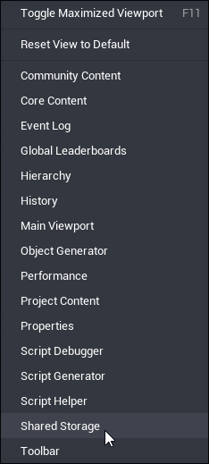
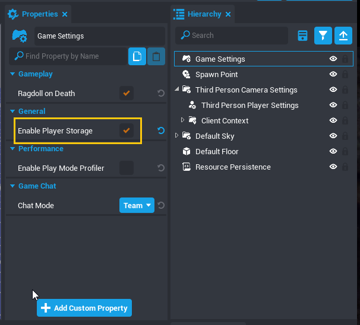
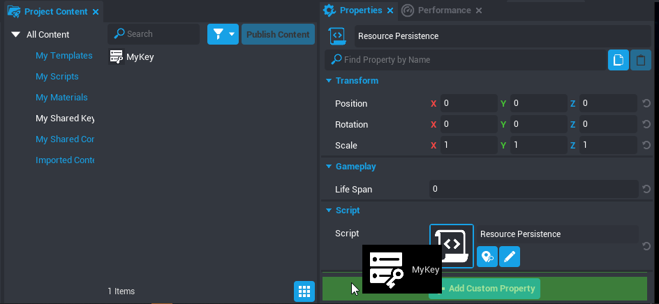
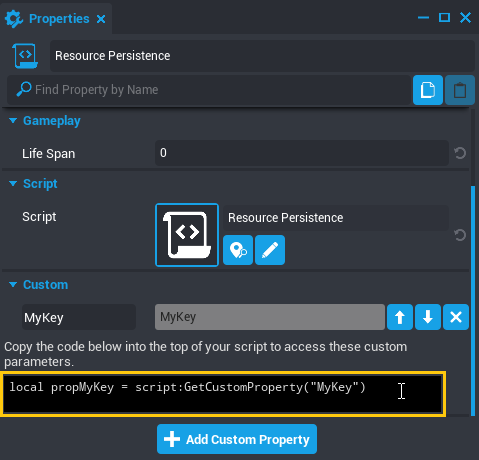

# Shared Storage

> Shared storage lets you access persistent player data tables across multiple games.

## Introduction

The same way [Peristent Storage](persistent_storage.md) allows you to save player data between play sessions, **Shared Storage** allows you to use that data in multiple Core games, make it possible for developers to create complete ecosystems of Core games where players have the same resources, equipment, or any other value that would create a meaningful difference in the player experience.

**Shared Storage** allows you to create storage tables, called **Shared Keys** that are associated with your account, rather than a specific game. You can have **up to 8** of these tables, and in each project you can select which keys are active through the **Shared Storage** window. Active keys can be found in the **Project Content** window in the **My Shared Keys** folder, and are accessed in scripts by their [**Net Reference**](core_api.md#netreference).

### Account-Level Tables

Because Shared Storage keys are associated with an account, they can only be used in games published by the same creator. This also means that projects created from open games that use Cross-Game Storage will need to have their own keys made by the new creator and connected to each of the games.

### Creating Multiple Levels Using Shared Data

**Cross-Game** storage can be used to easily create multiple levels of the same game, by publishing the secondary levels privately, and creating portals between the games. However, each of these levels is still its own game, which means that any chance that is made that needs to be in all levels will need to be individually implemented in each project.

## Using Shared Storage Keys

### Create a Key

Shared storage tables are created as **Keys** through the **Shared Storage** window, and keys will be accessible in all projects as long as you are logged in to your account.

{: .center loading="lazy" }

1. In the top menu bar, open the **View** menu and select **Shared Storage** to open the window.
2. In the bottom of the **Shared Storage** window click the **Create New Shared Key** button.
3. Give the key a name and press **Create**.

### Enable Storage

Storage is not enabled by default, and must be turned on for any project that will use shared data tables.

1. Select the **Game Settings** object in the **Hierarchy** and open the **Properties** window.
2. In the **General** section, check the box next to **Enable Player Storage**.

{: .center loading="lazy" }

### Save Player Data

Keys that you create in a project will be enabled by default, but you can enable them in other projects through the **Shared Storage** window.

#### Find a Shared Key in Project Content

All keys that are active in your project can be found in **Project Content** in the section called **My Shared Keys**.

#### Get a NetReference to a Key

To save data to a shared storage table, you will need to use its **NetReference** to refer to it in a script. See the [Core API](core_api.md#netreference) for more information about this object type.

{: .center loading="lazy" }

1. Select the script that will save data across games in the **Hierarchy**, and open the **Properties** window.
2. Open the **My Shared Keys** section of **Project Content**.
3. Select and drag the key onto the **Custom Properties** panel of the script **Properties** to add it as a custom property.
4. Copy the variable generated in the script's **Properties** window into the script itself.

{: .center loading="lazy" }

#### Save Data to a Shared Table

Shared Data tables work the same way as Persistent Storage. One table can be used to save all of your player data, and data is associated with players.

You can learn more about the **Storage** namespace on [the Core API](core_api.md#storage).

To save data for a player:

1. Add the Shared Data Key as a Custom Property to the script's **Properties**.
2. Add the variable reference to the Custom Property to the script's properties.
3. Create a variable for the player's data table and assign it equal to `Storage.GetSharedPlayerData()`.
4. Change a property of that table.
5. Reassign the table to the player's storage with `Storage.SetSharedPlayerData()`.

To learn more, check out the [example snippets with shared storage](examples.md).

### Activate Keys Across Games

In each game where you want to reference a Shared Data Table, you will need to activate that table for the project, as well as enabling **Player Storage**.

---

## Learn More

[Shared Storage on the Core API](core_api.md#storage) | [Shared Storage Examples](https://docs.coregames.com/api/examples#sharedstorage) | [NetReference on the Core API](https://docs.coregames.com/core_api#netreference) | [Persistent Storage Reference](persistent_storage.md)
