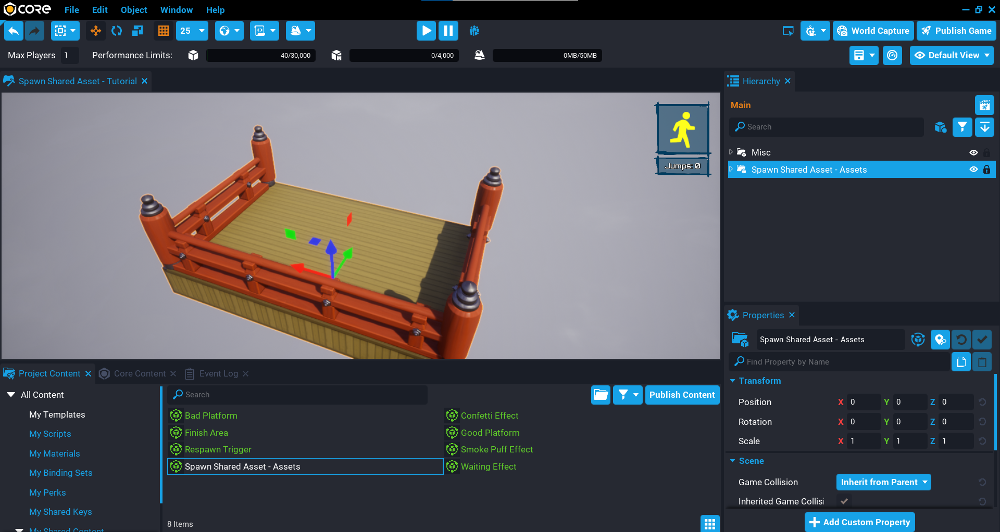
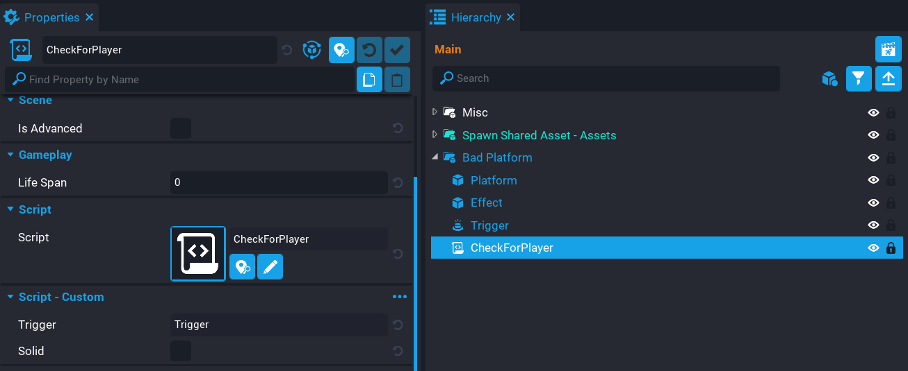

# SpawnSharedAsset

## Overview

In this tutorial you are going to create a procedural puzzle game where players need to jump from one platform to the other. The goal is to get to the finish area in the least amount of jumps. You will be learning how to use [Spawn Shared Asset](../references/spawned_shared_assets/) to create a new puzzle each time the player reaches the finish.

<div class="mt-video" style="width:100%">
    <video autoplay muted playsinline controls loop class="center" style="width:100%">
        <source src="/img/SpawnSharedAsset/preview.mp4" type="video/mp4" />
    </video>
</div>

* **Completion Time:** ~1 hour
* **Knowledge Level:** It is recommended to have completed the [Scripting Beginner](lua_basics_helloworld.md) and [Scripting Intermediate](lua_basics_lightbulb.md) tutorials.
* **Skills you will learn:**
    * Spawning shared assets.
    * Removing shared assets.

---

## Import Asset from Community Content

You will be importing an asset from **Community Content** that will contain the assets needed to build the puzzle game. You will be modifying some of these assets so they include scripts for the logic of the puzzle game.

1. Open the **Community Content** window.
2. Search for `Spawn Shared Asset` by **CoreAcademy**.
3. Click **Import**.

{: .center loading="lazy" }

## Testing Static Context Scripts

When using [Spawn Shared Asset](../api/networkcontext.md), a [Networked Static Context](../references/networking.md) is required, this reduces the amount of networked objects in your game, and the assets being spawned are cheaper than if they were networked.

Because the template is spawned on the server and client, testing any script logic from within the static context may not behave as you expect. This is because the assets are spawned on the server and the client, and in local preview mode, it is a server and client combined. So it is recommended to test in multiplayer preview so the server and client are separate.

## Add Assets Template to Hierarchy

1. Click the **Project Content** tab.
2. Click **My Templates** under **All Content**.
3. Add the template **Spawn Shared Asset - Assets** into the **Hierarchy**.
4. Deinstance the **Spawn Shared Asset - Assets** template in the **Hierarchy**.

{: .center loading="lazy" }

## Create Networked Static Context

When spawning shared assets, they need to go into a networked **Static Context**. A static context is a good choice when creating procedural content, as it will reduce the amount of networked objects in your game. Objects spawned inside a static context can not be moved or modified, however, as a unit they can be moved.

1. Create a **Static Context** and name it `Static Container`.
2. Enable **Networking** on the **Static Container**.

{: .center loading="lazy" }

## Create GeneratePuzzleServer Script

Create a new script called `GeneratePuzzleServer` and place it in the **Default Context**. The main responsibility of this script will be to create a random puzzle each time the game starts. It will spawn platforms that are good and bad that the player will be able to jump on.

### Add Custom Properties

The **GeneratePuzzleServer** script needs to know what to spawn, and where to spawn them from. So you will need to add some custom properties that the script will be able to access later.

1. Add the **Static Container** as a custom property.
2. Find the group **Start Area** in the **Hierarchy** and add it as a custom property.
3. Find the **Finish Area** template in **Project Content** and add it as a custom property.
4. Find the **Good Platform** template in **Project Content** and add it as a custom property.
5. Find the **Bad Platform** template in **Project Content** and add it as a custom property.
6. Find the **Respawn Trigger** template in **Project Content** and add it as a custom property.

{: .center loading="lazy" }

### Edit GeneratePuzzleServer Script

Open up the **GeneratePuzzleServer** script and add the references to the custom properties you added.

```lua
local STATIC_CONTAINER = script:GetCustomProperty("StaticContainer"):WaitForObject()
local START_AREA = script:GetCustomProperty("StartArea"):WaitForObject()
local FINISH_AREA = script:GetCustomProperty("FinishArea")
local RESPAWN_TRIGGER = script:GetCustomProperty("RespawnTrigger")
```

The platform custom properties need to be added to a new table. This is because later on you will be picking one of these platforms randomly, so having them in a table will be easier to pick from.

```lua
local PLATFORMS = {

    script:GetCustomProperty("GoodPlatform"),
    script:GetCustomProperty("BadPlatform")

}
```

#### Add Variables

Add the following variables to the script.

```lua
local forward = START_AREA:GetTransform():GetForwardVector() -- (1)
local right = START_AREA:GetTransform():GetRightVector() -- (2)
local up = START_AREA:GetTransform():GetUpVector() -- (3)
local startPos = START_AREA:GetWorldPosition() -- (4)
local total = 6 -- (5)
local forwardDistBetween = 620 -- (6)
local leftDistanceBetween = 180 -- (7)

local sharedAssets = {} -- (8)
local puzzleCreated = false -- (9)
```

1. Objects that have position, scale, and rotation, has a [Transform](../api/transform.md). No matter what the rotation of the `START_AREA` is, the platforms will always spawn in the forward direction. By pressing ++T++ you can see the transform gizmo change from world space to local space. {: .center loading="lazy" }
2. There will be 2 platforms to pick between to jump on, you will need to offset one of them, so we can do that using the right direction.
3. The up direction will be used to handle moving this up or down in the local up (Z) direction of the object.
4. Store the `START_AREA` world position, as it will be used to offset the platforms from the `START_AREA` position.
5. The total amount of platforms to spawn in the forward direction. The higher the number the longer it will take to get across.
6. The forward distance between the platforms. The smaller the distance, the easier it will be to jump. Making this too small could lead to players jumping more than 1 platform.
7. The distance between the right platform and the left platform.
8. A table that will hold a reference to all the shared assets that are spawned so they can be destroyed later when creating a new puzzle.
9. A boolean that will stop the level from being recreated when other players join.

#### Create DisablePlayerJump Function

The `DisablePlayerJump` function will stop the player from being able to jump by setting the `maxJumpCount` property on the `player` to `0`. This function is called when the player enters the trigger of a platform.

```lua
local function DisablePlayerJump(player)
    player.maxJumpCount = 0
    Events.BroadcastToPlayer(player, "PlayerUIShowStill") -- (1)
end
```

1. A broadcast to the player who overlapped the trigger is done to show them they can not move. This will update the icon in the player's UI.

#### Create EnablePlayerJump Function

The `EnablePlayerJump` function will allow the player to jump again. This can be done by setting the `maxJumpcount` property on the `player` to `1`. This function is called after a certain amount of time has passed when the player has overlapped a trigger of a platform.

```lua
local function EnablePlayerJump(player)
    player.maxJumpCount = 1
    Events.BroadcastToPlayer(player, "PlayerUIShowMove") -- (1)
end
```

1. A broadcast to the player who overlapped the trigger is done to show them they can now move. This will update the icon in the player's UI.

#### Create RespawnPlayer Function

The `RespawnPlayer` function will kill the player by calling the `Die` function. This is done if the player falls off a platform and enters the respawn trigger below all the platforms.

```lua
local function RespawnPlayer(trigger, obj) -- (1)
    if Object.IsValid(obj) and obj:IsA("Player") then -- (2)
        obj:Die()
        EnablePlayerJump(obj) -- (3)
    end
end
```

1. The `obj` parameter is the object that overlapped the respawn trigger.
2. You need to check if the `obj` is valid and is a `Player`.
3. Make sure to enable the player's jump after they have died, or they will be stuck at the starting area.

#### Create CreateFinishArea Function

The `CreateFinishArea` function will spawn an instance of the `FINISH_AREA` that is a shared asset. This is placed in the correct position based on the `total` number of platforms, including the `forwardDistBetween` value. This is because it allows for the puzzle to be generated at any size, and supports any rotation.

When spawning a shared asset, the function [`SpawnSharedAsset`](../api/networkcontext.md) is called from the **Network Context**. So in this case, that context is the `STATIC_CONTAINER`. The `SpawnSharedAsset` works similar to [`SpawnAsset`](../api/world.md) where the first argument is the asset to spawn, and the second argument is an optional table where you can set the transform properties. The big benefit of using `SpawnSharedAsset` is that the networking is cheaper, and all the synchronization between the server and the client is handled for you.

After the `SpawnSharedAsset` has been called, you will not be able to modify the spawned asset, so you will need to do all your transform operations in the optional table argument.

```lua
local function CreateFinishArea()
    return STATIC_CONTAINER:SpawnSharedAsset(FINISH_AREA, { -- (1)

        position = startPos + (forward * (total + 1) * forwardDistBetween),
        rotation = START_AREA:GetWorldRotation() -- (2)

    })
end
```

1. The spawned asset needs to be returned so that it can be used later.
2. Match the rotation of the `START_AREA` so it all lines up correctly.

#### Create CreateRespawnTrigger Function

The game needs a respawn trigger for when the player falls off a platform. By doing some calculations, you can scale up the trigger to match the size of the puzzle area along with a little padding of `30` units in each direction.

The spawned asset is then inserted into the `sharedAssets` table for later use when needing to destroy it.

```lua
local function CreateRespawnTrigger(finishArea) -- (1)
    local finishPos = finishArea:GetWorldPosition()
    local centerPos = (finishPos - startPos) / 2 -- (2)
    local diff = (finishPos - startPos)
    local scale = Vector3.New(math.abs(diff.x) / 100, math.abs(diff.y) / 100, 1)

    local respawnTrigger = STATIC_CONTAINER:SpawnSharedAsset(RESPAWN_TRIGGER, {

        scale = scale + (forward * 30) + (up * 2) + (right * 30), -- (3)
        position = centerPos - (up * 400) -- (4)

    })

    respawnTrigger.beginOverlapEvent:Connect(RespawnPlayer) -- (5)
    table.insert(sharedAssets, respawnTrigger)
end
```

1. The `finishArea` parameter is the spawned asset that is passed in from the `CreatePuzzle` function.
2. Get the center position between the starting area and finish area.
3. Scale the trigger so that it matches the puzzle area, but include a bit of padding to prevent players jumping further then the dimensions of the trigger.
4. Move the trigger down in the world by applying a negative `up` direction.
5. Connect the `beginOverlapEvent` to detect when the player has entered the trigger volume.

#### Create CreatePuzzle Function

The `CreatePuzzle` function is responsible for creating the platforms, respawn trigger, and the finish area, which are all shared assets that become a child of the `STATIC_CONTAINER`.

The function will loop a certain amount of times based on the value of the `total` variable at the top of the script. For each iteration of the loop, 2 platforms will be created so there is a right and a left platform. Inside the loop, a `randomIndex` is created so that a random platform from the `PLATFORMS` table is selected. Each shared asset is then put into `sharedAssets` table for later use.

```lua
local function CreatePuzzle()
    puzzleCreated = true -- (1)

    for i = 1, total do
        local randomIndex = math.random(2)
        local position = startPos + (forward * i * forwardDistBetween)
        local platformLeft = STATIC_CONTAINER:SpawnSharedAsset(PLATFORMS[randomIndex], {

            position = position + (-right * leftDistanceBetween) -- (2)

        })

        local platformRight = STATIC_CONTAINER:SpawnSharedAsset(PLATFORMS[randomIndex == 2 and 1 or 2], { -- (3)

            position = position + (right * leftDistanceBetween) -- (4)

        })

        table.insert(sharedAssets, platformRight)
        table.insert(sharedAssets, platformLeft)

        Task.Wait(.1) -- (5)
    end

    local finishArea = CreateFinishArea()

    table.insert(sharedAssets, finishArea)
    CreateRespawnTrigger(finishArea)
end
```

1. Set the `puzzleCreated` boolean to true to prevent other players recreating the puzzle when they join the game.
2. Spawn this platform in the negative right direction so the platform is spaced apart from the right platform.
3. You always need a good and bad platform, so you need to check what `randomIndex` is and get the opposite platform.
4. Set the position of the right platform by moving it by the `leftDistanceBetween` amount along the `right` direction.
5. Wait a small amount of time to give a nicer effect when spawning in the pairs of platforms.

#### Create PlayerJoined Function

When a player joins the game, the `PlayerJoined` function will be called. It will place the player at a specific spawn point that has a **Spawn Key** of `Start Area`. If this is the first player that has joined the game, then the puzzle will be created, otherwise return.

```lua
local function PlayerJoined(player)
    player:Spawn({ spawnKey = "Start Area"} )

    if puzzleCreated then
        return
    end

    DisablePlayerJump(player)
    CreatePuzzle()
    EnablePlayerJump(player)
end
```

#### Create DestroyPlatform Function

The `DestroyPlatform` function will be called if the player lands on a bad platform. All shared assets that were spawned when creating the puzzle were put into the `sharedAssets` table which is an array. By looping over the table you can check the platform exists and destroy it using `DestroySharedAsset` function.

The `DestroySharedAsset` function is called from the network context, in this case it is the `STATIC_CONTAINER`. By passing in the shared asset to be destroyed, it will be removed from the server and the client for you.

```lua
local function DestroyPlatform(obj, player)
    for i, platform in ipairs(sharedAssets) do
        if platform == obj then
            STATIC_CONTAINER:DestroySharedAsset(obj)
        end
    end
end
```

#### Create RestartGame Function

If the player reaches the finish area, after 4 seconds the game will restart. All the spawn assets that were created are removed using `DestroySharedAsset`, and then a new puzzle is created by calling `CreatePuzzle`.

```lua
local function RestartGame()
    Task.Wait(4)

    for index, player in ipairs(Game.GetPlayers()) do
        DisablePlayerJump(player) -- (1)
        player:SetResource("jumps", 0) -- (2)
        player:Spawn() -- (3)
    end

    for index, asset in pairs(sharedAssets) do
        if Object.IsValid(asset) then
            STATIC_CONTAINER:DestroySharedAsset(asset)
        end
    end

    CreatePuzzle()

    for index, player in ipairs(Game.GetPlayers()) do
        EnablePlayerJump(player) -- (4)
    end
end
```

1. Disable the player's jump while the puzzle is being destroyed and recreated.
2. Reset the player's total jumps for this puzzle.
3. Respawn the player back to at the start area.
4. Enable the player's jump so they can play again now that the puzzle has been created.

#### Create IncrementJumps Function

When a player jumps on to a platform, their total jumps resource is incremented by `1`.

```lua
local function IncrementJumps(player)
    player:AddResource("jumps", 1)
end
```

#### Connect playerJoinedEvent

Connect the `playerJoinedEvent` so when a player joins the game the `PlayerJoined` function will be called.

```lua
Game.playerJoinedEvent:Connect(PlayerJoined)
```

#### Connect Broadcast Events

Connect up all the broadcasts that the script will listen for.

```lua
Events.Connect("DisablePlayerJump", DisablePlayerJump)
Events.Connect("EnablePlayerJump", EnablePlayerJump)
Events.Connect("DestroyPlatform", DestroyPlatform)
Events.Connect("RestartGame", RestartGame)
Events.Connect("IncrementJumps", IncrementJumps)
```

### The GeneratePuzzleServer Script

??? "GeneratePuzzleServer"
    ```lua
    local STATIC_CONTAINER = script:GetCustomProperty("StaticContainer"):WaitForObject()
    local START_AREA = script:GetCustomProperty("StartArea"):WaitForObject()
    local FINISH_AREA = script:GetCustomProperty("FinishArea")
    local RESPAWN_TRIGGER = script:GetCustomProperty("RespawnTrigger")

    local PLATFORMS = {

        script:GetCustomProperty("GoodPlatform"),
        script:GetCustomProperty("BadPlatform")

    }

    local forward = START_AREA:GetTransform():GetForwardVector()
    local right = START_AREA:GetTransform():GetRightVector()
    local up = START_AREA:GetTransform():GetUpVector()
    local startPos = START_AREA:GetWorldPosition()
    local total = 6
    local forwardDistBetween = 620
    local leftDistanceBetween = 180

    local sharedAssets = {}
    local puzzleCreated = false

    local function DisablePlayerJump(player)
        player.maxJumpCount = 0
        Events.BroadcastToPlayer(player, "PlayerUIShowStill")
    end

    local function EnablePlayerJump(player)
        player.maxJumpCount = 1
        Events.BroadcastToPlayer(player, "PlayerUIShowMove")
    end

    local function RespawnPlayer(trigger, obj)
        if Object.IsValid(obj) and obj:IsA("Player") then
            obj:Die()
            EnablePlayerJump(obj)
        end
    end

    local function CreateFinishArea()
        return STATIC_CONTAINER:SpawnSharedAsset(FINISH_AREA, {

            position = startPos + (forward * (total + 1) * forwardDistBetween),
            rotation = START_AREA:GetWorldRotation()

        })
    end

    local function CreateRespawnTrigger(finishArea)
        local finishPos = finishArea:GetWorldPosition()
        local centerPos = (finishPos - startPos) / 2
        local diff = (finishPos - startPos)
        local scale = Vector3.New(math.abs(diff.x) / 100, math.abs(diff.y) / 100, 1)

        local respawnTrigger = STATIC_CONTAINER:SpawnSharedAsset(RESPAWN_TRIGGER, {

            scale = scale + (forward * 30) + (up * 2) + (right * 30),
            position = centerPos - (up * 400)

        })

        respawnTrigger.beginOverlapEvent:Connect(RespawnPlayer)
        table.insert(sharedAssets, respawnTrigger)
    end

    local function CreatePuzzle()
        puzzleCreated = true

        for i = 1, total do
            local randomIndex = math.random(2)
            local position = startPos + (forward * i * forwardDistBetween)
            local platformLeft = STATIC_CONTAINER:SpawnSharedAsset(PLATFORMS[randomIndex], {

                position = position + (-right * leftDistanceBetween)

            })

            local platformRight = STATIC_CONTAINER:SpawnSharedAsset(PLATFORMS[randomIndex == 2 and 1 or 2], {

                position = position + (right * leftDistanceBetween)

            })

            table.insert(sharedAssets, platformRight)
            table.insert(sharedAssets, platformLeft)

            Task.Wait(.1)
        end

        local finishArea = CreateFinishArea()

        table.insert(sharedAssets, finishArea)
        CreateRespawnTrigger(finishArea)
    end

    local function PlayerJoined(player)
        player:Spawn({ spawnKey = "Start Area"} )

        if puzzleCreated then
            return
        end

        DisablePlayerJump(player)
        CreatePuzzle()
        EnablePlayerJump(player)
    end

    local function DestroyPlatform(obj, player)
        for i, platform in ipairs(sharedAssets) do
            if platform == obj then
                STATIC_CONTAINER:DestroySharedAsset(obj)
            end
        end
    end

    local function RestartGame()
        Task.Wait(4)

        for index, player in ipairs(Game.GetPlayers()) do
            DisablePlayerJump(player)
            player:SetResource("jumps", 0)
            player:Spawn()
        end

        for index, asset in pairs(sharedAssets) do
            if Object.IsValid(asset) then
                STATIC_CONTAINER:DestroySharedAsset(asset)
            end
        end

        CreatePuzzle()

        for index, player in ipairs(Game.GetPlayers()) do
            EnablePlayerJump(player)
        end
    end

    local function IncrementJumps(player)
        player:AddResource("jumps", 1)
    end

    Game.playerJoinedEvent:Connect(PlayerJoined)

    Events.Connect("DisablePlayerJump", DisablePlayerJump)
    Events.Connect("EnablePlayerJump", EnablePlayerJump)
    Events.Connect("DestroyPlatform", DestroyPlatform)
    Events.Connect("RestartGame", RestartGame)
    Events.Connect("IncrementJumps", IncrementJumps)
    ```

### Test the Game

Test the game to make sure the following work.

- Platforms spawn correctly in pairs.
- Finish area spawns at the correct place.
- Player respawning works when falling off a platform.

<div class="mt-video" style="width:100%">
    <video autoplay muted playsinline controls loop class="center" style="width:100%">
        <source src="/img/SpawnSharedAsset/test_creating.mp4" type="video/mp4" />
    </video>
</div>

## Create CheckForPlayer Script

Create a new script called **CheckForPlayer**. This script will be placed inside the **Bad Platform** and **Good Platform**. It will handle checking if a player has entered the trigger volume and react based on the type of platform it is in.

In **Project Content** select the **CheckForPlayer** script, and add 2 new custom properties.

1. A **Core Object Reference** called `Trigger`.
2. A **Boolean** property called `Solid`.

{: .center loading="lazy" }

### Add CheckForPlayer Script to Bad Platform

The **Bad Platform** template needs to have the **CheckForPlayer** script added, along with the properties set.

1. Drag the **Bad Platform** template from **Project Content** into the **Hierarchy** and deinstance it.
2. Drag the **CheckForPlayer** script from **Project Content** into the **Bad Platform** group.
3. Find the **Trigger** inside the **Bad Platform** group and add it to the **Trigger** custom property.
4. Set the boolean **Solid** to **false** (unchecked).
5. Update the **Bad Platform** template and delete it from the **Hierarchy**.

{: .center loading="lazy" }

### Add CheckForPlayer Script to Good Platform

The **Good Platform** template needs to have the **CheckForPlayer** script added, along with the properties set.

1. Drag the **Good Platform** template from **Project Content** into the **Hierarchy** and deinstance it.
2. Drag the **CheckForPlayer** script from **Project Content** into the **Good Platform** group.
3. Find the **Trigger** inside the **Good Platform** group and add it to the **Trigger** custom property.
4. Set the boolean **Solid** to **true** (checked).
5. Update the **Good Platform** template and delete it from the **Hierarchy**.

{: .center loading="lazy" }

### Edit CheckForPlayer Script

The **CheckForPlayer** script will handle what happens to the player when they enter the trigger for the platform. If the script has the property **Solid** set to **false** (unchecked), then the player will fall through the platform. Each platform the player lands on will disable that player's jump for a small amount of time to prevent them from quickly jumping from one platform to the other. This adds a little bit of suspense when landing on a platform.

Open up the **CheckForPlayer** script and add the following property references so you have a reference to the trigger for the platform, and if it is solid or not.

```lua
local TRIGGER = script:GetCustomProperty("Trigger"):WaitForObject()
local SOLID = script:GetCustomProperty("Solid")
```

#### Create BeginOverlap Function

The `BeginOverlap` function will check if a player is in the trigger volume.

A script in a static context is created on the server and client, so you will need to check which [environment](../api/environment.md) the script is in. In this case, if the environment is the client, then you broadcast to the event `PlatformLandedOn` so an effect can be played when the player lands on the platform. If the platform is not solid, then a broadcast to the `PlatformLaugh` event is done to play a sound.

When the environment is the server, you can broadcast to a server script that will disable the player's jump, and increment their jump resource amount. If the platform is not solid, then the shared asset is destroyed, otherwise the player's jump is enabled again.

Being able to check what environment the script is being run in is a great way to handle logic that need to be done in a specific context.

```lua
local function BeginOverlap(trigger, obj)
    if Object.IsValid(obj) and obj:IsA("Player") then
        if Environment.IsClient() then -- (1)
            Events.Broadcast("PlatformLandedOn", script.parent:GetWorldPosition())

            if not SOLID then
                Task.Wait(1.5)
                Events.Broadcast("PlatformLaugh")
            end
        elseif Environment.IsServer() then -- (2)
            Events.Broadcast("DisablePlayerJump", obj)
            Events.Broadcast("IncrementJumps", obj)
            Task.Wait(1.5)

            if not SOLID then
                Events.Broadcast("DestroyPlatform", script.parent, obj)
            else
                Events.Broadcast("EnablePlayerJump", obj)
            end
        end
    end
end
```

1. The code below will only run on the client.
2. The code below will only run on the server.

#### Connect Trigger Event

Connect up the `beginOverlapEvent` so that when the player overlaps the trigger, the `BeginOverlap` function is called.

```lua
TRIGGER.beginOverlapEvent:Connect(BeginOverlap)
```

### The CheckForPlayer Script

??? "CheckForPlayer"
    ```lua
    local TRIGGER = script:GetCustomProperty("Trigger"):WaitForObject()
    local SOLID = script:GetCustomProperty("Solid")

    local function BeginOverlap(trigger, obj)
        if Object.IsValid(obj) and obj:IsA("Player") then
            if Environment.IsClient() then
                Events.Broadcast("PlatformLandedOn", script.parent:GetWorldPosition())

                if not SOLID then
                    Task.Wait(1.5)
                    Events.Broadcast("PlatformLaugh")
                end
            elseif Environment.IsServer() then
                Events.Broadcast("DisablePlayerJump", obj)
                Events.Broadcast("IncrementJumps", obj)
                Task.Wait(1.5)

                if not SOLID then
                    Events.Broadcast("DestroyPlatform", script.parent, obj)
                else
                    Events.Broadcast("EnablePlayerJump", obj)
                end
            end
        end
    end

    TRIGGER.beginOverlapEvent:Connect(BeginOverlap)
    ```

### Test the Game

Test the game and make sure that for each pair of platforms moving forward, one of the platforms is destroyed.

!!! tip "For the moment you can continue to test in local preview mode, but later on when you write the client code that plays effects, you will need to test in multiplayer preview mode."

<div class="mt-video" style="width:100%">
    <video autoplay muted playsinline controls loop class="center" style="width:100%">
        <source src="/img/SpawnSharedAsset/test_creating.mp4" type="video/mp4" />
    </video>
</div>

## Create UpdatePlayerUIClient Script

The player will need to know how many jumps they are currently at, and when they can jump. The UI will display an image for the player when they can jump, and when they can not jump.

Create a new script called `UpdatePlayerUIClient`, and place it into the **Client** folder in the **Hierarchy**. This script will need references to some of the UI elements that come with the asset template.

1. Find the **Move** image object in the **Hierarchy** and add it as a custom property.
2. Find the **Still** image object in the **Hierarchy** and add it as a custom property.
3. Find the **Jumps Amount** text object in the **Hierarchy** and add it as a custom property.

{: .center loading="lazy" }

### Edit UpdatePlayerUIClient Script

Open up the **UpdatePlayerUIClient** script and add the references to the properties so you can update the various UI components.

```lua
local MOVE = script:GetCustomProperty("Move"):WaitForObject()
local STILL = script:GetCustomProperty("Still"):WaitForObject()
local JUMPS_AMOUNT = script:GetCustomProperty("JumpsAmount"):WaitForObject()
```

#### Add Variables

You will need a reference to the local player so you can get that player's resources.

```lua
local localPlayer = Game.GetLocalPlayer()
```

#### Create ShowMove Function

The `ShowMove` function will turn on the visibility of the `MOVE` image and turn off the visibility of the `STILL` image. This will indicate to the player they can now move.

```lua
local function ShowMove()
    MOVE.visibility = Visibility.FORCE_ON
    STILL.visibility = Visibility.FORCE_OFF
end
```

#### Create ShowStill Function

The `ShowStill` function will turn on the visibility of the `STILL` image and turn off the visibility of the `MOVE` image. This will indicate to the player they shouldn't try to jump, because their jump is disabled for a short amount of time.

```lua
local function ShowStill()
    MOVE.visibility = Visibility.FORCE_OFF
    STILL.visibility = Visibility.FORCE_ON
end
```

#### Connect resourceChangedEvent

To display the amount of jumps the player has done, you need to listen for when the player's resources has changed. This can be done by using the `resourceChangedEvent` and checking if the resource is `jumps`, and then updating the `JUMPS_AMOUNT` text with the `newAmount`.

```lua
localPlayer.resourceChangedEvent:Connect(function(player, resource, newAmount)
    if resource == "jumps" then
        JUMPS_AMOUNT.text = "Jumps: " .. tostring(newAmount)
    end
end)
```

#### Connect Broadcast Events

Connect up the broadcast events that the server will broadcast to the client to handle updating the UI for when to jump and not jump.

```lua
Events.Connect("PlayerUIShowMove", ShowMove)
Events.Connect("PlayerUIShowStill", ShowStill)
```

### The UpdatePlayerUIClient Script

??? "UpdatePlayerUIClient"
    ```lua
    local MOVE = script:GetCustomProperty("Move"):WaitForObject()
    local STILL = script:GetCustomProperty("Still"):WaitForObject()
    local JUMPS_AMOUNT = script:GetCustomProperty("JumpsAmount"):WaitForObject()

    local localPlayer = Game.GetLocalPlayer()

    local function ShowMove()
        MOVE.visibility = Visibility.FORCE_ON
        STILL.visibility = Visibility.FORCE_OFF
    end

    local function ShowStill()
        MOVE.visibility = Visibility.FORCE_OFF
        STILL.visibility = Visibility.FORCE_ON
    end

    localPlayer.resourceChangedEvent:Connect(function(player, resource, newAmount)
        if resource == "jumps" then
            JUMPS_AMOUNT.text = "Jumps: " .. tostring(newAmount)
        end
    end)

    Events.Connect("PlayerUIShowMove", ShowMove)
    Events.Connect("PlayerUIShowStill", ShowStill)
    ```

### Test the Game

Test the game and make sure the following work.

- When jumping on to a platform, the UI for the jump and still images change.
- The total jumps for the player is incremented for each platform.

<div class="mt-video" style="width:100%">
    <video autoplay muted playsinline controls loop class="center" style="width:100%">
        <source src="/img/SpawnSharedAsset/client_ui_test.mp4" type="video/mp4" />
    </video>
</div>

## Create FinishArea Script

Create a new script called `FinishArea`. This script will need to be placed inside the **Finish Area** template so it can detect when a player has entered the trigger to play some effects and restart the game.

### Update Finish Area Template

1. Drag the **Finish Area** template from **Project Content** in to the **Hierarchy** and deinstance it.
2. Drag the script **FinishArea** into the **Finish Area** group in the **Hierarchy**.
3. Add the **Trigger** to the **FinishArea** script as a custom property.
4. Update the **Finish Area** template and delete it from the **Hierarchy**.

{: .center loading="lazy" }

### Edit FinishArea Script

Open up the **FinishArea** script and add the reference to the trigger which will be used to detect when a player has entered the finish area.

```lua
local TRIGGER = script:GetCustomProperty("Trigger"):WaitForObject()
```

### Create OnEnterTrigger Function

The `OnEnterTrigger` function will check what environment.

- If the script is being run in the server environment, then it will restart the game.
- If the script is being run in the client environment, then it will play the finish area effect.

```lua
local function OnEnterTrigger(trigger, obj)
    if Object.IsValid(obj) and obj:IsA("Player") then
        if Environment.IsServer() then
            Events.Broadcast("RestartGame")
        elseif Environment.IsClient() then
            Events.Broadcast("PlayFinishArea", script.parent:GetWorldPosition(), script.parent:GetWorldScale()) -- (1)
        end
    end
end
```

1. The position and scale of the finish area is sent to the client script to scale the effect to the correct size.

### Connect beginOverlapEvent

Connect the `beginOverlapEvent` so that when a player enters the trigger volume, it will call the `OnEnterTrigger` function.

```lua
TRIGGER.beginOverlapEvent:Connect(OnEnterTrigger)
```

### The FinishArea Script

??? "FinishArea"
    ```lua
    local TRIGGER = script:GetCustomProperty("Trigger"):WaitForObject()

    local function OnEnterTrigger(trigger, obj)
        if Object.IsValid(obj) and obj:IsA("Player") then
            if Environment.IsServer() then
                Events.Broadcast("RestartGame")
            elseif Environment.IsClient() then
                Events.Broadcast("PlayFinishArea", script.parent:GetWorldPosition(), script.parent:GetWorldScale())
            end
        end
    end

    TRIGGER.beginOverlapEvent:Connect(OnEnterTrigger)
    ```

### Test the Game

Test the game to make sure the game is restarted when the player gets to the finish area.

<div class="mt-video" style="width:100%">
    <video autoplay muted playsinline controls loop class="center" style="width:100%">
        <source src="/img/SpawnSharedAsset/test_finish_area.mp4" type="video/mp4" />
    </video>
</div>

## Create EffectManagerClient Script

Create a new script called `EffectManagerClient` and place it into the **Client** folder. This script handles playing audio and effects by listening for broadcasts.

### Add Custom Properties

The **EffectManagerClient** script needs to know which effects to spawn, and which audio to play. So you will need to create some custom properties.

1. Add the **Smoke Puff Effect** template from **Project Content** as a custom property.
2. Add the **Waiting Effect** template from **Project Content** as a custom property.
3. Add the **Confetti Effect** template from **Project Content** as a custom property.
4. Add the **Landed Audio** from the **Audio** group in the **Hierarchy** as a custom property.
5. Add the **Laugh Audio** from the **Audio** group in the **Hierarchy** as a custom property.
6. Add the **Cheer Audio** from the **Audio** group in the **Hierarchy** as a custom property.

{: .center loading="lazy" }

### Edit the EffectManagerClient Script

Open up the **EffectManagerClient** script and add the references to the properties on the script.

```lua
local SMOKE_VFX = script:GetCustomProperty("SmokePuffEffect")
local CONFETTI_VFX = script:GetCustomProperty("ConfettiEffect")
local WAITING_VFX = script:GetCustomProperty("WaitingEffect")
local LANDED_AUDIO = script:GetCustomProperty("LandedAudio"):WaitForObject()
local LAUGH_AUDIO = script:GetCustomProperty("LaughAudio"):WaitForObject()
local CHEER_AUDIO = script:GetCustomProperty("CheerAudio"):WaitForObject()
```

#### Create OnLanded Function

The `OnLanded` function will spawn the `SMOKE_VFX` and `WAITING_VFX` based on the `position` of the platform. The `LANDED_AUDIO` is also played when the player lands on a platform.

```lua
local function OnLanded(position)
    World.SpawnAsset(SMOKE_VFX, { position = position + (Vector3.UP * 15), parent = script.parent })
    World.SpawnAsset(WAITING_VFX, { position = position + (Vector3.UP * 15), parent = script.parent })
    LANDED_AUDIO:Play()
end
```

#### Create Laugh Function

The `Laugh` function will play the `LAUGH_AUDIO` when the player is on a bad platform that gets destroyed.

```lua
local function Laugh()
    LAUGH_AUDIO:Play()
end
```

#### Create PlayFinishArea Function

The `PlayFinishArea` function will spawn the `CONFETTI_VFX` at the finish area. It will scale and position the effect volume based on the scale and position of the finish area. After 4 seconds the vfx will be destroyed, which at that point the game will restart.

```lua
local function PlayFinishArea(position, scale)
    local vfx = World.SpawnAsset(CONFETTI_VFX, {

        position = position + (Vector3.UP * 300),
        scale = Vector3.New(scale.x * 10, scale.y * 10, 5),
        parent = script.parent

    })

    CHEER_AUDIO:Play()
    Task.Wait(4)
    vfx:Destroy()
end
```

#### Connect Broadcast Events

Connect up the broadcast events.

```lua
Events.Connect("PlatformLandedOn", OnLanded)
Events.Connect("PlatformLaugh", Laugh)
Events.Connect("PlayFinishArea", PlayFinishArea)
```

### The EffectManagerClient Script

??? "EffectManagerClient"
    ```lua
    local SMOKE_VFX = script:GetCustomProperty("SmokePuffEffect")
    local CONFETTI_VFX = script:GetCustomProperty("ConfettiEffect")
    local WAITING_VFX = script:GetCustomProperty("WaitingEffect")
    local LANDED_AUDIO = script:GetCustomProperty("LandedAudio"):WaitForObject()
    local LAUGH_AUDIO = script:GetCustomProperty("LaughAudio"):WaitForObject()
    local CHEER_AUDIO = script:GetCustomProperty("CheerAudio"):WaitForObject()

    local function OnLanded(position)
        World.SpawnAsset(SMOKE_VFX, { position = position + (Vector3.UP * 15), parent = script.parent })
        World.SpawnAsset(WAITING_VFX, { position = position + (Vector3.UP * 15), parent = script.parent })
        LANDED_AUDIO:Play()
    end

    local function Laugh()
        LAUGH_AUDIO:Play()
    end

    local function PlayFinishArea(position, scale)
        local vfx = World.SpawnAsset(CONFETTI_VFX, {

            position = position + (Vector3.UP * 300),
            scale = Vector3.New(scale.x * 10, scale.y * 10, 5),
            parent = script.parent

        })

        CHEER_AUDIO:Play()
        Task.Wait(4)
        vfx:Destroy()
    end

    Events.Connect("PlatformLandedOn", OnLanded)
    Events.Connect("PlatformLaugh", Laugh)
    Events.Connect("PlayFinishArea", PlayFinishArea)
    ```

### Test the Game

When testing the game this time, make sure to test in multiplayer preview mode, because due to how static context scripts work in local preview mode, none of the client effects or audio will be played.

Make sure the following work:

1. When landing on a platform the 2 effects and audio is played.
2. When falling off a platform, the laugh audio is played.
3. When reaching the finish area, the confetti and cheer audio is played.
4. After 4 seconds of reaching the finish area, the confetti effect is destroyed.

<div class="mt-video" style="width:100%">
    <video autoplay muted playsinline controls loop class="center" style="width:100%">
        <source src="/img/SpawnSharedAsset/finish.mp4" type="video/mp4" />
    </video>
</div>

## Summary

Using **Spawn Shared Asset** is great for procedural content like the puzzle in this tutorial, it's much cheaper on the networking cost, and much easier to keep the server and client in sync using the API methods for spawning and destroying shared assets. It adds a replay value for players, because the puzzle is always changing.

There are a lot of game genres that can benefit from procedural content, such as dungeon crawlers, mazes etc.

Consider improving the game by adding additional features:

- Leaderboards to track the total jumps overall players have done.
- Persistent storage to keep track of the player's lowest jump amount for a puzzle.
- Puzzle hazards the player must overcome to get to the next platform.

<!--## Feedback and Questions

For feedback and questions, join the discussion on this tutorial's [forum thread]().-->

## Learn More

[Spawn Shared Assets Reference](../references/spawned_shared_assets.md) | [Networkcontext API](../api/networkcontext.md) | [Networking Reference](../references/networking.md) | [Environment API](../api/environment.md)
