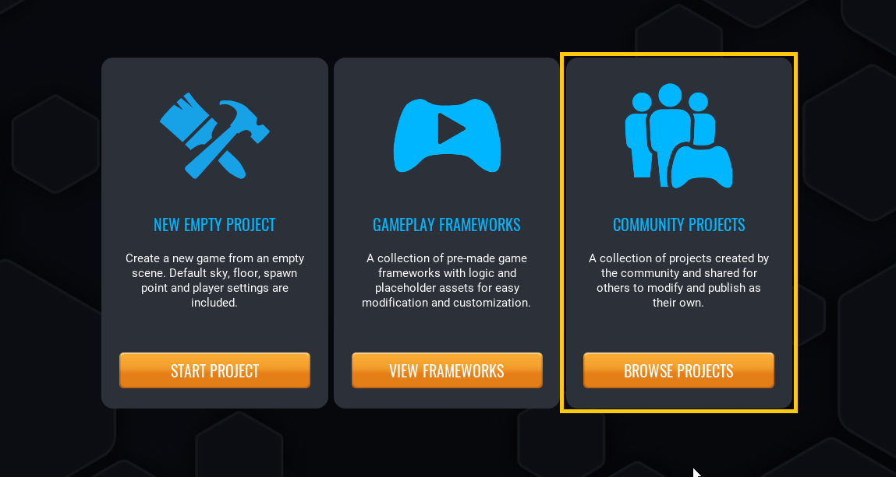
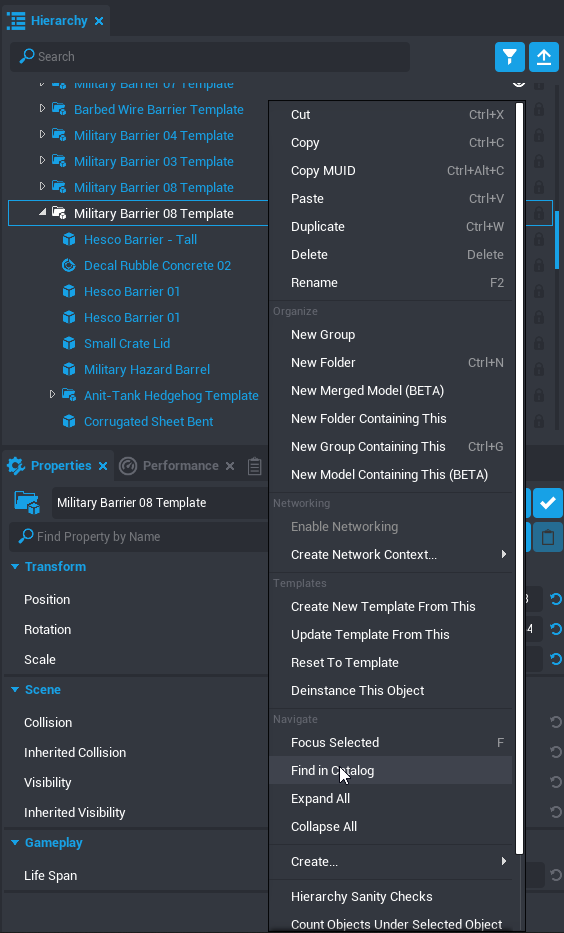

# Survival Framework

## Overview

The **Survival Jam Kit** is an open **Community Project** designed to support the [Survival Contest](https://fall2020jam.coregames.com/).

The project includes many systems that are typical of the Survival genre, including hunger, thirst, and stamina meters, breakable shelters, crafting systems, and save points. It also includes a vast number of Post Apocalyptic artistic assets from telephone pole tiles a complete abandoned military base.

## Using the Kit

### Download from Community Projects

The Survival Jam Kit was made as a game open for editing that can be found in **Community Projects**.

{: .center loading="lazy" }

To create a copy to edit:

1. In the **Create** tab, select **Create New**.
2. In the **Community Projects** option, select **Browse Projects**.
3. Type ``Survival`` into the search, and select the project titled **Survival-Framework**.
4. Give it the name of your project in the **Name** field and press **Download.**

{: .center loading="lazy" }

### Testing the Game

Once you have the **Survival Framework** downloaded, you should start out by testing it to understand the various systems at play.

In the bottom left corner, you should see the meter bars for four resources, **Health**, **Hunger**, **Thirst**, and **Sprint**. You can hold the ++Shift++ key as you are moving to increase your speed and deplete the **Sprint** bar.

In the bottom right corner you should see controls for several different systems in the game.

- Press ++I++ to see an inventory.
- Press ++X++ to see crafting recipes.
- The ++L++ key will allow you to loot when it is available.
- Press the ++M++ key to see a Map.

### Changing Systems

Each of the gameplay systems in the project has an explanation on how to use them **Documentation** folder. Select any of the **README** files to learn how to create new crafting recipes, items, or NPC's.

### Changing the Map

The map is created by a camera positioned high above the scene, with some One0Sided Planes used to give it the framing that you can see from above but not below.

As you change the project, the map will automatically show those changes, but you may want to modify the World Text that labels different areas.

1. Open the **UI** folder to find the **Map** folder.
2. Inside of **Map**, open the **Client Context** folder to find the **Map Mode** folder.
3. The **Map Post Processing** folder includes most of the information you will need to change to change the map.
4. Open the **Borders** folder to change the appearance of the frame that you see in the map view.
5. Open the **Locations** folder to change the name and position of the different labeled areas in the world.

### Finding Templates for Art Assets

If you find a model in the world that you would like to copy and use elsewhere, you can always duplicate it with ++Ctrl+W++, but you may also want to find the template that it was made from in **Project Content**.

{: .center loading="lazy" }

1. Click on an object in the scene.
2. Find the parent that is the **Template** by looking up in the Hierarchy. If you have **Group Select Mode** enabled you may select this automatically.
3. Right-click the template and select **Find in Catalog**.
4. The template will now be selected in **Project Content**, and you can export it, drag out new copies, or use the ++X++ key to spawn new copies at your mouse position in the scene.

!!! hint
    You can use the **Left Arrow** key to select a parent of an object that is selected in the **Hierarchy**.

## Learn More

[Survival Contest](https://fall2020jam.coregames.com/) | [Template Reference](template_reference.md)
