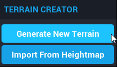
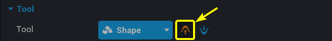
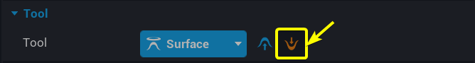
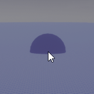
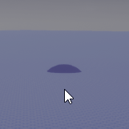
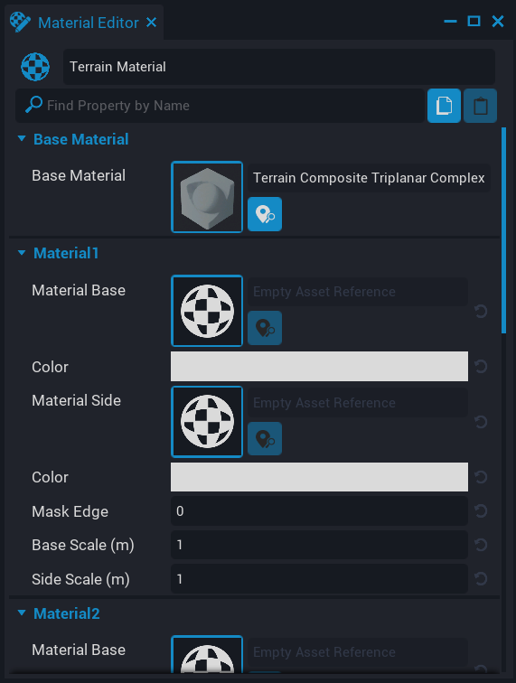
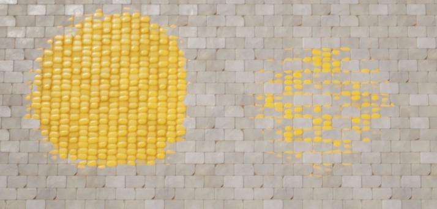
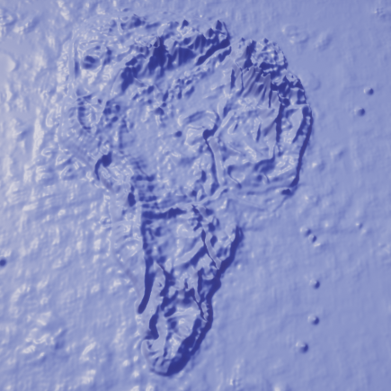
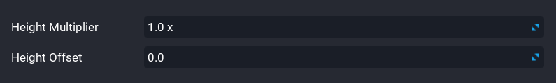

# Terrain in Core

## Overview

Terrain is an import aspect of almost all games. Terrain gives games life and immerses players in the world that you have created. Generating terrain was a difficult task in which teams of artists had to collaborate to produce realistic landscapes. With the **Terrain Creator** in **Core** you can do the work of multiple environment artists in a fraction of the time. The **Terrain Creator** gives you access to multiple pre-made landscapes that you can easily modify and sculpt.

## Creating Terrain

First click on the {: loading="lazy" style="height:2em; width:auto" .image-inline-text} icon at the top of your screen.

{: .center loading="lazy" }

After you click on the {: loading="lazy" style="height:2em; width:auto" .image-inline-text} you will see a small dropdown menu called **Terrain Creator**. Click on the **Generate New Terrain** button.

{: .center loading="lazy"}

### The Terrain Generator

After clicking on the **Generate New Terrain** button you will see popup window called **GENERATE NEW TERRAIN**. This window contains a multitude of settings that you can use to create your own custom terrain.

On the left left side of the **GENERATE NEW TERRAIN** window you will see a list of different terrains. In the center of the **GENERATE NEW TERRAIN** window you will see two seconds, **General** and **Parameters**.

{: .center loading="lazy"}

### Terrain Size

The **General** section contains settings that will apply to all types of terrain. The **Voxel Size** setting determines how large the voxels of your terrain will be. A voxel is like a 3D pixel. The smaller your voxels are, the more detail your terrain can have. The **Terrain Size** setting determines how many voxels your terrain will have. The more voxels you have, the larger your terrain can be. The downside of increasing the number of voxels is that you use up more of your limited terrain memory space. You are limited between 50MB and 100MB of terrain memory space depending on the maximum number of players for your game

The **Parameters** section contains settings that will vary depending on the terrain type you are using. For example, the **Cube World** is the only terrain type with the **Edge Length** parameter.

### Terrain Types

Below are some sample images of what some of the terrain types.

<!-- TODO: Fix centering of table elements -->

Ravines          |  Rolling Hills          | Rocky Meadow
:---------------:|:-----------------------:|:------------:
{: loading="lazy" style="max-width:15em" .center} |{: loading="lazy" style="max-width:15em" .center}| {: loading="lazy" style="max-width:15em" .center}

After you have filled your the settings for your terrain, clicking on the **Generate** button to create your terrain object. It will appear in your **Hierarchy** window and should be visible in your **Main Viewport**.

{: .center loading="lazy"}

Your **Terrain** object in your **Hierarchy** window will probably appear **red**{: style="color: red"}. This will not stop your game from running. Your **Terrain**  object in the **Hierarchy** window appears to be **red**{: style="color: red"} is because your **Terrain** object is missing a material. Assignment of materials to terrain will be addressed later in this reference guide.

!!!tip
    Double click on the **Terrain** object in your hierarchy to bring it into view in your **Main Viewport**.

## Sculpting

Now that you have generated your **Terrain** object you may still want to make changes to the shape of your **Terrain**. To make manual changes to terrain you can use the **Sculpt** tool. To access the **Sculpt** tool, click on tour **Terrain** object. You should now see a window named **Properties** at the bottom right of your screen

{: .center loading="lazy"}

Now, click on the **Sculpt** button. This will switch you into **Sculpt** mode allowing you to manually reshape the terrain.

{: .center loading="lazy"}

Now, when you click and hold the ++left-button++ of your mouse in the **Main Viewport**, the terrain will extrude toward you.

    <video autoplay loop muted playsinline poster="/img/EditorManual/Abilities/Gem.png" class = "center">
        <source src="/img/TerrainReference/SculptTerrainSmiley.mp4" type="video/mp4" />
    </video>

### Additive Sculpting

Additive sculpting allows you to add the terrain by creating new terrain under your brush. This is useful when you want to manually add terrain features the protrude out of the terrain. This feature exists on both the **Surface** and **Shape** tools. To enable **Additive Sculpting**, click on the {: loading="lazy" style="height:2em; width:auto" .image-inline-text} icon.

{: .center loading="lazy"}

    <video autoplay loop muted playsinline poster="/img/EditorManual/Abilities/Gem.png" class = "center" style="width:50%">
        <source src="/img/TerrainReference/SculptTerrainSmiley.mp4" type="video/mp4" />
    </video>

### Destructive Sculpting

Destructive sculpting allows you to indent terrain by removing terrain under your brush. This tool is extremely useful for creating caves and ravines. This setting exists on both the **Surface** and **Shape** tools. To enable **Destructive Sculpting**, click on the {: loading="lazy" style="height:2em; width:auto" .image-inline-text} icon.

{: .center loading="lazy"}

    <video autoplay loop muted playsinline poster="/img/EditorManual/Abilities/Gem.png" class = "center" style="width:50%">
        <source src="/img/TerrainReference/DestructiveModeTool.mp4" type="video/mp4" />
    </video>

## Brush Tools

When editing terrain there are multiple tools that you can use to modify your terrain. Three tools that you will use often are the **Surface**, **Shape**, and **Smooth** tools.

### Surface Tool

The **Surface** tool is allows you to protrude or indent terrain over an area on the surface of the terrain.

### Shape Tool

The **Shape** tool allows you to use a 3D shape as a brush. The default shape is the a sphere. To change the default shape, double click on the current shape.

{: .center loading="lazy"}

You will see a window named **STATIC MESH PICKER** pop up in the middle of your screen. This window contains a list of all the 3D models that Core has available. Select one of the models, and then press the **Done** button.

    <video autoplay loop muted playsinline poster="/img/EditorManual/Abilities/Gem.png" class = "center" style="width:50%">
        <source src="/img/TerrainReference/SelectArch.mp4" type="video/mp4" />
    </video>

#### Shape Tool Alignment

In the **Brush** section of the **Shape** tool properties window there is an property called **Alignment**. The **Alignment** property determines where the brush can paint. There are four different alignment settings: **Surface**, **View**, **Ground**, and **Up**.

To change the **Alignment** of your brush, press on the button with your current alignment. Then, select an alignment option from the dropdown menu.

For example, if your current brush alignment is **Surface** and you wanted to switch to the **View** alignment, you would click on the blue **Surface** button. Then, you would click on the option named **View** from the drop down menu.

{: .center loading="lazy"}

#### Surface Alignment

The **Surface** alignment attaches your brush to the surface of the terrain you are drawing on. This allows you to easily add terrain features such as hills and mountains.

#### Other Alignments

The **View**, **Ground**, and **Up** alignments work differently from the **Surface** alignment because they allow you to create terrain in the air by drawing on an invisible drawing plane.

<!-- TODO: Fix centering of table elements -->

|View Alignment       | Ground Alignment | Up Alignment|
|:-------------------:|:----------------:|:-------------:|
|{style="width:15em"}|{style="width:15em"}|{style="width:15em"}
|The drawing plane is aligned with the camera|The drawing plane is parallel to the ground|The drawing plane always points towards the camera and is up right|
|
<video autoplay loop muted playsinline poster="/img/EditorManual/Abilities/Gem.png" class = "center" style="width:15em"><source src="/img/TerrainReference/ViewMode.mp4" type="video/mp4" /></video>
|
<video autoplay loop muted playsinline poster="/img/EditorManual/Abilities/Gem.png" class = "center" style="width:15em"><source src="/img/TerrainReference/GroundMode.mp4" type="video/mp4" /></video>
|
<video autoplay loop muted playsinline poster="/img/EditorManual/Abilities/Gem.png" class = "center" style="width:15em"><source src="/img/TerrainReference/UpMode.mp4" type="video/mp4" /></video>
|

The **green**{: style="color: green"} dashed lines in the diagrams above represent the **Camera Distance** property. The **Camera Distance** property determines how the drawing plane should be from the camera. To access the **Camera Distance** property you must first enable the **Air Mode** property. Enabling the **Air Mode** setting will give you control over how far away the draw plane is an allow your brush to completely ignore terrain when using the draw plane. The distance between the draw plane and the camera is represented by the **Camera Distance** property.

    <video autoplay loop muted playsinline poster="/img/EditorManual/Abilities/Gem.png" class = "center" style="width:50%">
        <source src="/img/TerrainReference/EnableAirMode.mp4" type="video/mp4" />
    </video>

Below is a side by side comparison between **Air Mode** being disabled and **Air Mode** being enabled. When **Air Mode** is disabled, the brush sticks to the surface of the terrain. When **Air Mode** is enabled, the brush ignores the terrain and sticks to the draw plane.

{: style="width:20%"}
{: style="width:20%"}
_Air Mode Disabled (left) vs Air Mode Enabled (right)_
{: .image-cluster}

### Smooth Tool

The **Smooth** tool will smooth terrain with sharp edges. Great tool for removing unnatural edges from your terrain.

### Paint Tool

An important feature of terrain is being able to change the material(s) applied to the terrain. The Material system for terrain will allow you to paint four different materials on your terrain.

The **Paint** tool allows you to manually paint textures onto your terrain. This is extremely useful for creating features like roads and rocky patches. Before you start painting you must select up to four materials to paint with. These materials are similar to the color palette a painter uses.

#### Generating Materials

To select materials to paint with you must first navigate to the **Paint** table. First, select your **Terrain** object in the **Hierarchy** window. Then, click on the **Paint** button in the **Properties** window of your terrain.

{: .center loading="lazy"}

You will most likely see a window with the message:
**The terrain material is not paintable!**{ style="color:red}
This message is warning you that your terrain does not have a material associate with it. TO fix this, click on the button with the text **Create new terrain material**.

{: .center loading="lazy"}

You will now see a pop up window named **Material Editor** in the center of your screen. The **Material Editor** window contains the settings that you need to change the materials for the terrain.

{: .center loading="lazy}

In the **Material Editor** there are four sections that correspond to the four different materials you have available when painting on the terrain:

- **Material1**
- **Material2**
- **Material3**
- **Material4**

To set one of these materials, double click on the checkered sphere image.

{: .center loading="lazy"}

In the center of your screen you will see a pop up window named **MATERIAL PICKER**. Click on one of the available materials and then click on the **Done** button.

{: .center loading="lazy"}

The **Material Base** property determines what material will be displayed on the top of the terrain. The **Material Side** property determines what material will be displayed on the side of terrain. This is useful for determining how steep terrain features such as cliff faces will look.

{: .center loading="lazy"}

Each of the four materials has its own **Material Side** property that you can set allowing for plenty of variability when it comes to designing steep terrain.

#### Switching Materials

After you have picked the eight materials (there are four base materials and four side materials) you can click on the {: loading="lazy" style="height:2em; width:auto" .image-inline-text} icon.

{: .center loading="lazy"}

After you select a material click and hold the ++left-button++ of your mouse in the **Main Viewport**. The material you have select will fill in the spot under your mouse over time.

    <video autoplay loop muted playsinline poster="/img/EditorManual/Abilities/Gem.png" class = "center" style="width:50%">
        <source src="/img/TerrainReference/UsePaintTool.mp4" type="video/mp4" />
    </video>

You may have noticed how the materials appear to have depth to them. For example in the video above, the dirt material will sometimes display below the materials. This is due to the fact that the materials built into **Core** have a depth property associated with each pixel. In the image below, the second **Food Corn 01** material is at 100% strength on the left and completely covers the **Bricks Worn Stone 01** material. On the right side, the **Food Corn 01** material is at 50% strength on only partially covers the **Bricks Worn Stone 01** material depending on which spots of the **Food Corn 01** material are highest.

{: .center loading="lazy"}
*_100% Strength Food Corn 01 material (left)_ vs _50% strength Food Corn 01 material (right)_*
{: .image-cluster}

You can further see this effect by using the **Debug Mode** in the terrain editor. In the **Paint** tab there is setting named **Show Debug Materials**. Click on the box next to **Show Debug Materials** to enter debug mode for the terrain.

{: .center loading="lazy"}

Below is the side by side comparison of the **Food Corn 01** at 100% and the **Food Corn 01** material at 50%. Since the **Food Corn 01** material is the second material, the **Food Corn 01** material appears as the color **green**{: style="color:green"}. On the right side the terrain is 50% **Food Corn 01** material and 50% **Bricks Worn Stone 01** causing it to appear a mix of **green**{: style="color:green"} and **red**{: style="color:red"} which is a **yellow**{: style="color:#d6d041"} color.

{: .center loading="lazy"}

## Heightmaps

Heightmaps allow creators to create terrain from images. The brightness of each pixel controls how tall the point of terrain associated with that pixel will be.

### Formatting Heightmaps

Heightmap images need to square **gray-scaled** `.png` images. The **Terrain Generator** will only accept heightmap images of the following sizes:

- (128 x 128)
- (256 x 256)
- (512 x 512)
- (1024 x 1024)

!!!tip
    There are multiple websites you can use to convert `.png` images to **gray-scale** images. You can find a link to one of those websites here: <https://onlinepngtools.com/convert-png-to-grayscale>

### Importing Heightmaps

To create a terrain object from a heightmap first click on the {: loading="lazy" style="height:2em; width:auto" .image-inline-text} icon. Then click on the **Import From Heightmap** button that appears in the **TERRAIN CREATOR** window.

{.center loading="lazy"}

After clicking on the **Import From Heightmap** window, you will see a window called **IMPORT TERRAIN HEIGHTMAP** pop up in the center of the screen. This window allows you to modify how the terrain is influenced by the heightmap.

{: .center loading="lazy"}

The source image was generously provided by the creator **docbdesign**.

*_Heightmap Source Image (left)_ vs. _Terrain Generated from Heightmap (right)_*
{: .image-cluster}

The **Voxel Size** setting determines how large the voxels of the terrain will be. Smaller voxel sizes will shrink your terrain but increase the amount of detail.

{: .center loading="lazy"}

The **Height Multiplier** setting changes how much influence the brightness of a pixel has on the height of terrain.
The **Height Offset** setting determines what the default height of the terrain is.

{: .center loading="lazy"}

## Weightmap

Weightmaps are similar to heightmaps. Weightmaps store material data for terrain in the form of a `.png` file. To understand how this works it is important to know how data is stored in a `.png` file. The pixels in most `.png` files are made up of four color channels: **red**{: style="color:red"}, **green**{: style="color:green"}, **blue**{: style="color:blue"}, and **alpha**. The strength of these color channels determine the color of each pixel in a `.png` image. For example, a high **red**{: style="color:red"} channel and **blue**{: style="color:blue"} channel value will create a **magenta**{: style="color:magenta"} colored pixel. The **alpha** channel is used to determine the transparency of a specific pixel in a `.png` image. The image below demonstrates how differing the strength of the **red**{: style="color:red"}, **green**{: style="color:green"}, and **blue**{: style="color:blue"} channels can create the **orange**{style="color:orange"} color in the Core logo.

{: .center loading="lazy"}

Weightmaps use these four color channels to paint the terrain. Weightmaps tie each of the four color channels the four materials associate dwith your terrain.

- The **red**{: style="color:red"} channel is tied to the _first_ material
- The **green**{: style="color:green"} channel is tied to the _second_ material
- The **blue**{: style="color:blue"} channel is tied to the _third_ material
- The **alpha** channel is tied to the _fourth_ material

    

        
    

    

        
    

    <em>
        <em>Materials Applied to the terrain</em> (left) vs. <em>Source Weightmap (right)</em>
    </em>

!!!note
    If the weightmap `.png` file you made uses the **alpha** channel, then you must enable the **Import Alpha Channel** property in the **IMPORT TERRAIN HEIGHTMAP** window before generating your terrain.

    {: .center loading="lazy" style="max-height:14em"}
