

# Terrain in Core

## Overview

Terrain is an import aspect of almost all games. Terrain gives games life and immerses players in the world that you have created. Generating terrain is often a difficult task in which teams of artists had to collaborate to produce realistic landscapes. With the **Terrain Creator** in **Core** you can do the work of multiple environment artists in a fraction of the time. The **Terrain Creator** gives you access to multiple pre-made landscapes that you can easily modify and sculpt.

## Creating Terrain

First click on the  icon at the top of your screen.
{: .image-inline-text .image-background }

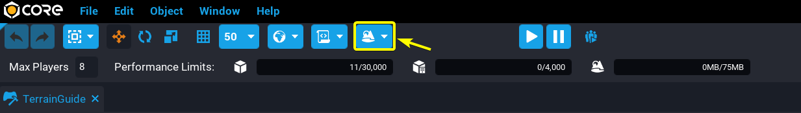{: .center loading="lazy" }

After you click on the  you will see a small dropdown menu called **Terrain Creator**. Click on the **Generate New Terrain** button.
{: .image-inline-text .image-background }

{: .center loading="lazy" }

### The Terrain Generator

After clicking on the **Generate New Terrain** button you will see popup window called **GENERATE NEW TERRAIN**. This window contains a multitude of settings that you can use to create your own custom terrain.

On the left left side of the **GENERATE NEW TERRAIN** window you will see a list of different terrains. In the center of the **GENERATE NEW TERRAIN** window you will see two sections, **General** and **Parameters**.

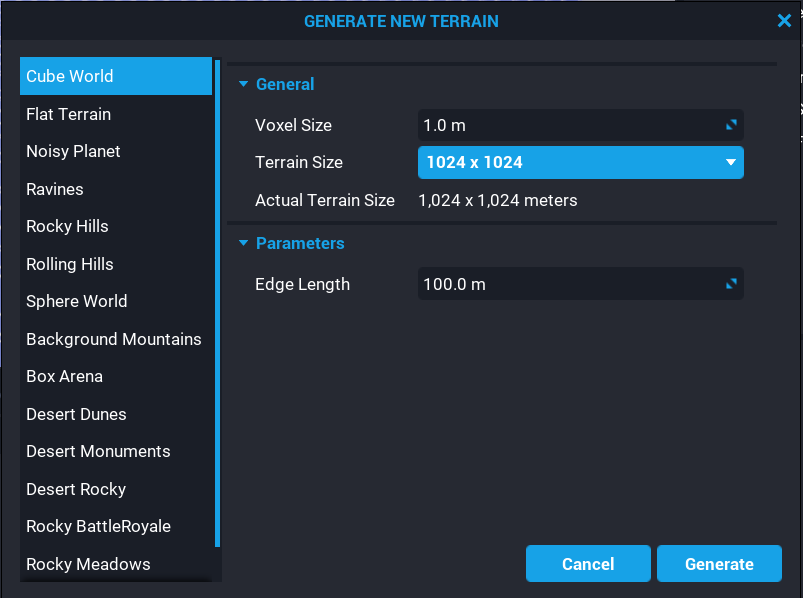{: .center loading="lazy" }

### Terrain Settings

The **General** section contains settings that will apply to all types of terrain. The **Voxel Size** setting determines how large the voxels of your terrain will be. A voxel is like a 3D pixel. The smaller your voxels are, the more detail your terrain can have. The **Terrain Size** setting determines how many voxels your terrain will have. The more voxels you have, the larger your terrain can be. The downside of increasing the number of voxels is that you use up more of your limited terrain memory space. You are limited between 50MB and 100MB of terrain memory space depending on the maximum number of players for your game.

The **Parameters** section contains settings that will vary depending on the terrain type you are using. For example, the **Cube World** is the only terrain type with the **Edge Length** setting.

### Terrain Types

Below are three sample images of what the different terrain types look like.

| Ravines          |  Rolling Hills          | Rocky Meadow |
|:----------------:|:-----------------------:|:------------:|
{: loading="lazy" style="max-width:15em" .center} |{: loading="lazy" style="max-width:15em" .center }| {: loading="lazy" style="max-width:15em" .center }

After you have modified the settings for your terrain, click on the **Generate** button to create your terrain object. It will appear in your **Hierarchy** window and should be visible in your **Main Viewport**.

{: .center loading="lazy" }

Your **Terrain** object in your **Hierarchy** window will probably appear **red**{: .Color_RED }. This will not stop your game from running. Your **Terrain**  object in the **Hierarchy** window appears to be **red**{: .Color_RED } is because your **Terrain** object is missing a material. Assignment of materials to terrain will be addressed later in this reference guide.

!!!tip
    Double click on the **Terrain** object in your hierarchy to bring it into view in your **Main Viewport**.

## Sculpting

Now that you have generated your **Terrain** object you may still want to make changes to the shape of your **Terrain**. You can use the **Sculpt** tool to manually change the shape of your terrain. Click on your **Terrain** object in the **Hierarchy** window to access the **Sculpt** tool. You should now see a window named **Properties** at the bottom right of your screen

{: .center loading="lazy" }

Now, click on the **Sculpt** tab. This will switch you into **Sculpt** mode allowing you to manually reshape the terrain.

{: .center loading="lazy" }

Now, when you click and hold the ++left-button++ of your mouse in the **Main Viewport**, the terrain will extrude toward you.

    <video autoplay loop muted playsinline poster="/img/EditorManual/Abilities/Gem.png" class = "center">
        <source src="/img/TerrainReference/SculptTerrainSmiley.mp4" type="video/mp4" />
    </video>

### Additive Sculpting

Additive sculpting allows you to add the terrain by creating new terrain under your brush. This is useful when you want to manually add terrain features the protrude out of the terrain. This feature exists on both the **Surface** and **Shape** tools. To enable **Additive Sculpting**, click on the  icon.
{: .image-inline-text .image-background }

{: .center loading="lazy" }

    <video autoplay loop muted playsinline poster="/img/EditorManual/Abilities/Gem.png" class = "center" style="width:50%">
        <source src="/img/TerrainReference/SculptTerrainSmiley.mp4" type="video/mp4" />
    </video>

### Destructive Sculpting

Destructive sculpting allows you to indent terrain by removing terrain under your brush. This tool is extremely useful for creating caves and ravines. This setting exists on both the **Surface** and **Shape** tools. To enable **Destructive Sculpting**, click on the  icon.
{: .image-inline-text .image-background }

{: .center loading="lazy" }

    <video autoplay loop muted playsinline poster="/img/EditorManual/Abilities/Gem.png" class = "center" style="width:50%">
        <source src="/img/TerrainReference/DestructiveModeTool.mp4" type="video/mp4" />
    </video>

## Brush Tools

When editing terrain there are multiple tools that you can use to modify your terrain. Three tools that you will use often are the **Surface**, **Shape**, and **Smooth** tools. To change the brush tool, you must click on the button with the name of your current brush tool. You will see a drop down menu filled with the different brush tools. Now, click on the brush tool that you want to use.

{: .center loading="lazy" }

### Surface Tool

The **Surface** tool is allows you to protrude or indent terrain over an area on the surface of the terrain.

### Shape Tool

The **Shape** tool allows you to use a 3D shape as a brush. The default shape is the a sphere. To change the default shape, double click on the current shape.

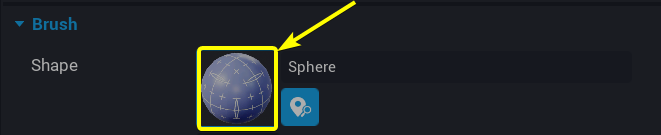{: .center loading="lazy" }

You will see a window named **STATIC MESH PICKER** pop up in the middle of your screen. This window contains a list of all the 3D models that Core has available. Select one of the models, and then press the **Done** button.

    <video autoplay loop muted playsinline poster="/img/EditorManual/Abilities/Gem.png" class = "center" style="width:50%">
        <source src="/img/TerrainReference/SelectArchFromStaticMeshes.mp4" type="video/mp4" />
    </video>

#### Shape Tool Alignment

In the **Brush** section of the **Shape** brush tool properties window there is an property called **Alignment**. The **Alignment** property determines where the brush can paint. There are four different alignment settings: **Surface**, **View**, **Ground**, and **Up**.

To change the **Alignment** of your brush, press on the button with your current alignment. Then, select an alignment option from the dropdown menu.

For example, if your current brush alignment is **Surface** and you wanted to switch to the **View** alignment, you would click on the blue **Surface** button. Then, you would click on the option named **View** from the drop down menu.

{: .center loading="lazy" }

#### Surface Alignment

The **Surface** alignment attaches your brush to the surface of the terrain you are drawing on. This allows you to easily add terrain features such as hills and mountains.

#### Other Alignments

The **View**, **Ground**, and **Up** alignments work differently from the **Surface** alignment because they allow you to create terrain in the air by drawing on an invisible drawing plane.

| View Alignment      | Ground Alignment | Up Alignment|
|:-------------------:|:----------------:|:-------------:|
|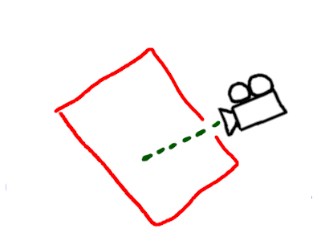{: style="width:15em" }|{: style="width:15em" }|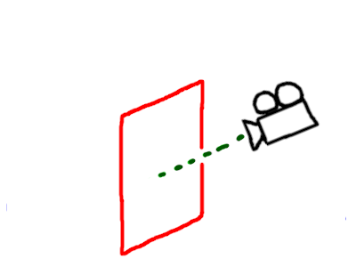{: style="width:15em" }
|The drawing plane is aligned with the camera|The drawing plane is parallel to the ground|The drawing plane always points towards the camera and is upright|
|
<video autoplay loop muted playsinline poster="/img/EditorManual/Abilities/Gem.png" class = "center" style="width:15em"><source src="/img/TerrainReference/ViewMode.mp4" type="video/mp4" /></video>
|
<video autoplay loop muted playsinline poster="/img/EditorManual/Abilities/Gem.png" class = "center" style="width:15em"><source src="/img/TerrainReference/GroundMode.mp4" type="video/mp4" /></video>
|
<video autoplay loop muted playsinline poster="/img/EditorManual/Abilities/Gem.png" class = "center" style="width:15em"><source src="/img/TerrainReference/UpMode.mp4" type="video/mp4" /></video>
|

The **green**{: style="color: green" } dashed lines in the diagrams above represent the **Camera Distance** property. The **Camera Distance** property determines how far the drawing plane should be from the camera. To access the **Camera Distance** property you must first enable the **Air Mode** property. Enabling the **Air Mode** setting will give you control over how far away the draw plane is an allow your brush to completely ignore terrain when using the drawing plane.

    <video autoplay loop muted playsinline poster="/img/EditorManual/Abilities/Gem.png" class = "center" style="width:50%">
        <source src="/img/TerrainReference/EnableAirMode.mp4" type="video/mp4" />
    </video>

Below is a side by side comparison between **Air Mode** being disabled and **Air Mode** being enabled. When **Air Mode** is disabled, the brush sticks to the surface of the terrain. When **Air Mode** is enabled, the brush ignores the terrain and sticks to the draw plane.

{: style="width:20%" }
{: style="width:20%" }
_Air Mode Disabled (left) vs Air Mode Enabled (right)_
{: .image-cluster }

### Smooth Tool

The **Smooth** tool will smooth terrain with sharp edges. This tool is very useful for removing unnatural edges from your terrain.

### Paint Tool

An important feature of terrain is being able to change the material(s) applied to the terrain. The material system for terrain will allow you to paint up to four different materials on your terrain.

The **Paint** tool allows you to manually paint textures onto your terrain. This is extremely useful for creating features like roads and rocky patches. Before you start painting you must select up to four materials to paint with. These materials will act like a color palette that you can use when painting on your terrain.

#### Generating Materials

To select materials to paint with you must first navigate to the **Paint** table. Click on your **Terrain** object in the **Hierarchy** window. Then, click on the **Paint** button in the **Properties** window of your **Terrain** object.

{: .center loading="lazy" }

You will most likely see a window with the message:
**The terrain material is not paintable!**{: .Color_RED }

This message is warning you that your **Terrain** object does not have a material associated with it. To fix this, click on the **Create new terrain material** button.

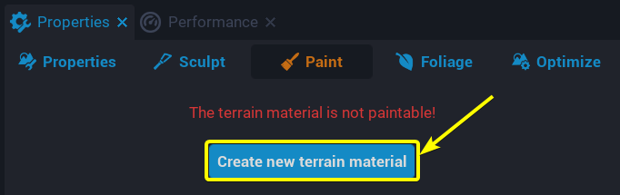{: .center loading="lazy" }

You will now see a pop up window named **Material Editor** in the center of your screen. The **Material Editor** window contains the settings that you need to change the materials for your **Terrain** object.

{: .center loading="lazy}

In the **Material Editor** there are four sections that correspond to the four different materials you have available when painting on terrain:

- **Material1**
- **Material2**
- **Material3**
- **Material4**

To set one of these materials, double click on the checkered sphere image.

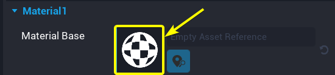{: .center loading="lazy" }

In the center of your screen you will see a pop up window named **MATERIAL PICKER**. Click a material you want to use and then click on the **Done** button.

    <video autoplay loop muted playsinline poster="/img/EditorManual/Abilities/Gem.png" class = "center" style="width:50%">
        <source src="/img/TerrainReference/MaterialPicker.mp4" type="video/mp4" />
    </video>

The **Material Base** property determines what material will be displayed on the top of your **Terrain** object. The **Material Side** property determines what material will be displayed on the side of  your **Terrain** object. This is useful for controlling what steep terrain features such as cliff faces will look like.

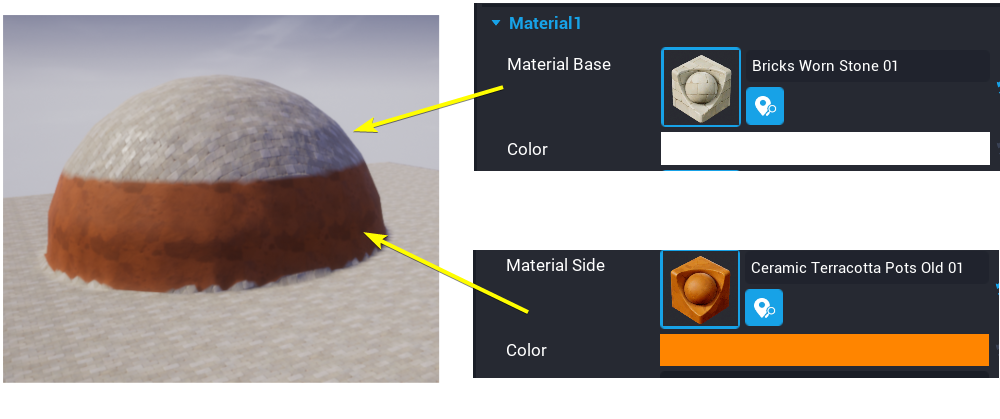{: .center loading="lazy" }

Each of the four materials has its own **Material Side** property that you can set allowing for plenty of variability when designing steep terrain.

#### Switching Materials

After you have picked the eight materials (there are four base materials and four side materials) you can click on the  icon.
{: .image-inline-text .image-background }

{: .center loading="lazy" }

After you select a material, click and hold the ++left-button++ of your mouse in the **Main Viewport**. The material you have select will fill in the area of terrain under your mouse over a period time.

    <video autoplay loop muted playsinline poster="/img/EditorManual/Abilities/Gem.png" class = "center" style="width:50%">
        <source src="/img/TerrainReference/UsePaintTool.mp4" type="video/mp4" />
    </video>

You may have noticed how the materials appear to have depth to them. For example in the video above, the dirt material will sometimes display below the stone material. This is due to the fact that the materials built into **Core** have a depth property associated with each pixel. In the image below, the left side **Food Corn 01** material is at 100% strength on the left and completely covers the **Bricks Worn Stone 01** material. On the right side, the **Food Corn 01** material is at 50% strength on only partially covers the **Bricks Worn Stone 01** material depending on which spots of the **Food Corn 01** material are highest.

{: .center loading="lazy" }
*100% Strength Food Corn 01 material (left) vs 50% strength Food Corn 01 material (right)*
{: .image-cluster }

You can see the strength of materials by using the **Debug Mode** in the terrain editor. In the **Paint** tab there is setting named **Show Debug Materials**. Click on the box next to **Show Debug Materials** to enter debug mode for the terrain.

{: .center loading="lazy" }

Below is the side by side comparison of the **Food Corn 01** at 100% and the **Food Corn 01** material at 50%. Since the **Bricks Worn Stone 01** material is the _first_ terrain material, the **Bricks Worn Stone 01** material appears as the color **red**{: .Color_RED }. Since the **Food Corn 01** material is the_second_terrain material, the **Food Corn 01** material appears as the color **green**{: .Color_GREEN }. The reasoning for these colorings will be further covered in the [Weightmaps](#Weightmaps) section. On the right side, the terrain is 50% **Food Corn 01** material and 50% **Bricks Worn Stone 01** causing it to appear a mix of **green**{: .Color_GREEN } and **red**{: .Color_RED } which is a **yellow**{: .Color_YELLOW } color.

{: .center loading="lazy" }

## Foliage Tool

An extremely import feature of any terrain is Foliage. In the Core Terrain System, foliage are simple objects that are generated at random positions on a specific terrain material. In most cases, foliage takes the form of trees, boulders, and bushes. The foliage system allows you to generate and place the objects automatically instead of placing them by hand. Each foliage object is tied to a specific terrain material. Foliage objects will only spawn on the terrain material they are associated with.

To use foliage, you must first select your **Terrain** object in the hierarchy window. Next, click on the **Foliage** tab in the properties window. This will open the **Foliage** editor for your terrain,

{: .center loading="lazy" }

{: .center loading="lazy" }

### Adding Foliage

To add a new foliage object, click on the **Add Foliage** button. You will now see a pop up window in the center of your screen named **STATIC MESH PICKER**. Select a mesh from this window and then click on the **Done** button.

{: .center loading="lazy" }

    <video autoplay loop muted playsinline poster="/img/EditorManual/Abilities/Gem.png" class = "center" style="width:50%">
        <source src="/img/TerrainReference/SelectArchFromStaticMeshes.mp4" type="video/mp4" />
    </video>

!!!note
    When adding foliage you can only use assets from the    **STATIC MESH PICKER**. You are not be able to use your own templates as foliage.

You should now see the object you selected as foliage spread randomly throughout your terrain. By default, the foliage you added will be associated with your _first_ material. This means that the foliage you just made will only appear on terrain areas covered by your _first_ material.

{: .center loading="lazy" }

### Removing Foliage

To remove foliage, right click on then foliage object. Then select the **Remove** option from the drop down list.

    <video autoplay loop muted playsinline poster="/img/EditorManual/Abilities/Gem.png" class = "center" style="width:50%">
        <source src="/img/TerrainReference/RemoveFoliage.mp4" type="video/mp4" />
    </video>

### Foliage Properties

#### Material Channel

Foliage objects come with many different properties that you can modify. The **Material Channel** property allows you to control which terrain material your foliage will spawn on top of. To modify this property, you must first click on your foliage object. Then, you must select one of the four terrain materials you want your foliage to be spawned on.

    <video autoplay loop muted playsinline poster="/img/EditorManual/Abilities/Gem.png" class = "center" style="width:50%">
        <source src="/img/TerrainReference/SwitchFoliageMaterialAssociation.mp4" type="video/mp4" />
    </video>

#### Spawn Settings

The **Distance Between Instances** property controls how densely one type of foliage is placed. The higher the **Distance Between Instances** the more space there will be between instances of that foliage.

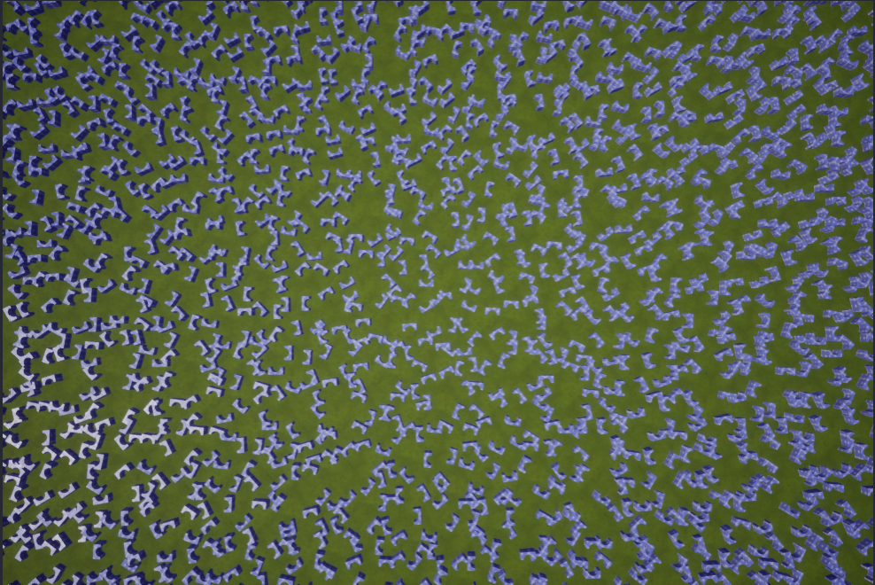{: style="width:45%" }
{: style="width:45%" }
<em><strong>Distance Between Instances</strong> of <code>2 meters</code> (left) vs. <strong>Distance Between Instances</strong> of `7 meters` (right)</em>
{: .image-cluster }

The **Surface Alignment** property determines how the foliage will be oriented when generated. There are three different alignment options: **Align to terrain Up**, **Align to surface**, and **Random Align**. The **Align to terrain Up** option will align the foliage with the z-axis of the terrain. The **Align to surface** option will align the foliage perpendicularly to the slope of the specific point of terrain that the foliage instance is on. The **Random Align** will randomly assign the **Align to surface** or **Align to terrain up** for each foliage instance.

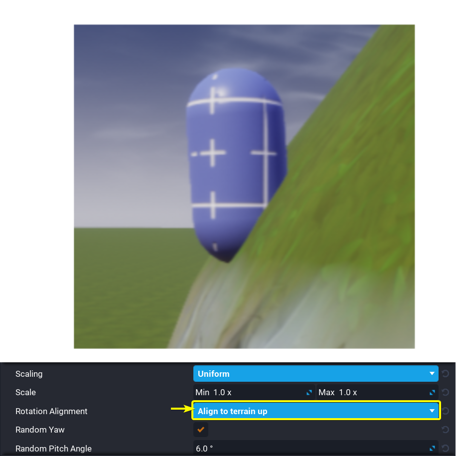{: style="width:45%" }
{: style="width:45%" }
*Up Alignment (left) vs. Surface Alignment (right)*
{: .image-cluster }

The **Ground Slope Angle** controls the type of slope the foliage is allowed to spawn on. This is often used to prevent foliage like trees from spawning on the side of a cliffs. The **Group Slope Angle** property has two settings. The first setting is the minimum slope angle. The second setting is the maximum slope angle. The table below demonstrates how manipulating the first and second settings for the **Ground Slop Angle** property changes the locations that foliage spawns at.

| 0° - 30°  |  30° - 90° | 0° - 90° | 90° - 180° |
|:---------:|:----------:|:--------:|:----------:|
| {: style="min-width:15em" } | {: style="min-width:15em" } | 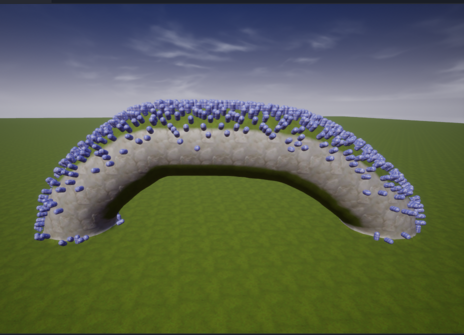{: style="min-width:15em" } | {: style="min-width:15em" } |

The **Local Z-Offset** property moves the foliage upwards or downwards based on the local z-axis of the foliage.

{: .center loading="lazy" }

{: .center loading="lazy" }

The **Global Z-Offset** property moves the foliage upwards or downwards based on the global z-axis of your game.

{: .center loading="lazy" }

{: .center loading="lazy" }

The **Random Yaw** property determines if the foliage objects should be randomly rotated around their local z-axis.

{: .center loading="lazy" }

The **Scaling** property allows for fine control over the minimum and maximum scales of each axis (X, Y, and Z) of every generated foliage object. There are three different scaling modes to choose from: **Free**, **Uniform**, and **XY Lock**. Each scaling mode allows you to manipulate the minimum and maximum scales for different combinations of the X, Y, and Z axes.

| Scaling Type   | Scaling Settings |
|:---------------|:----------------:|
| Free           | {: style="max-width: 100%" } |
| Uniform        | 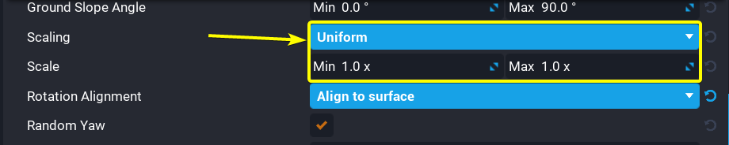{: style="max-width: 100%" } |
| XY Lock        | 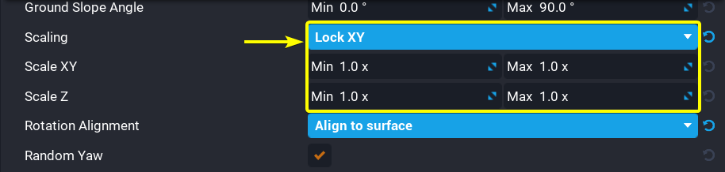{: style="max-width: 100%" } |

The **Height** property determines at what altitude the foliage can spawn. This property is extremely useful when creating terrain with bodies of water. You can use this property to prevent trees or bushes from spawning below the water level. There are two settings for this property. The first setting is the minimum height. The second setting is the maximum height.

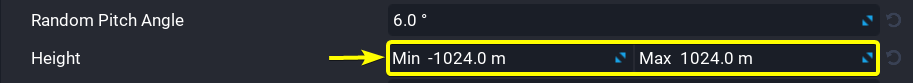{: .center loading="lazy" }

#### Foliage Materials

For additional customization, foliage objects have one or more material slots that you can manipulate to change the materials applied to your foliage objects. To change a material applied to the foliage, you must click on your foliage object in the **Foliage** tab. Then, double click on the material icon of a material slot belonging to your foliage object.

{: .center loading="lazy" }

You will see a window named **MATERIAL PICKER** appear in the center of your screen. Click on a material from the **MATERIAL PICKER** window, then click on the **Done** button. That material you selected will now be assigned to the material slot of your foliage object.

    <video autoplay loop muted playsinline poster="/img/EditorManual/Abilities/Gem.png" class = "center" style="width:50%">
        <source src="/img/TerrainReference/MaterialPicker.mp4" type="video/mp4" />
    </video>

#### Render Settings

The **Spawn Distance** setting controls the maximum distance that foliage can be rendered at. Below is a comparison between a **Spawn Distance** of `96 meters` and `128 meters`.

{: style="width:45%" }
{: style="width:45%" }
*Spawn Distance of `96 meters` (left) vs. Spawn Distance of `128 meters` (right)*
{: .image-cluster }

The **Cull Distance** property determines how **Core** will remove the foliage from view. This is done to decrease the time required to render all of the foliage on terrain. There are two settings for this property. The first setting determines the distance from the camera at which the foliage begins to disappear from view. The second setting determines the distance from the camera at which foliage will stop being drawn.

{: .center loading="lazy" }

The **Cast Shadows** property determines if the foliage should cast shadows. Enabling this property will increase the time required to render all of the foliage. A comparison between disabling **Cast Shadows** and enabling **Cast Shadows** can be seen below.

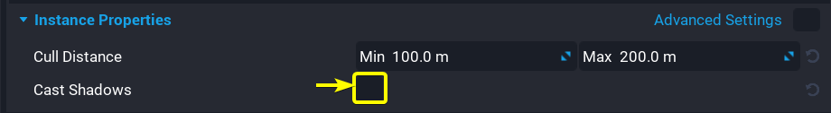{: .center loading="lazy" }

{: style="width:20%" }
{: style="width:20%" }
*_Shadows Disabled (left) vs. Shadows Enabled (right)_*
{: .image-cluster }

### Optimize Tool

When designing terrain it is important to keep in mind the memory limit of your terrain. As you add more features and foliage to your terrain, the terrain will take up more memory on your computer. There is a bar at the top of your screen that indicates the remaining memory space you have for terrain in your current game.

{: .center loading="lazy" }

If this bar is ever **red**{: .Color_RED }, then you will need to decrease the memory used by your terrain.

{: .center loading="lazy" }

You can use the **Optimize** tool to reduce the memory used by your terrain.

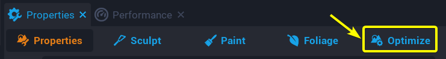{: .center loading="lazy" }

There are two options to reduce the memory used by your terrain: **Optimize** and **Simplify Voxels**. The **Optimize** option will attempt to reduce the memory used by your terrain without reducing the detail of your terrain. To **Optimize** your terrain, click on the **Optimize** button.

{: .center loading="lazy" }

The **Simplify Voxels** option is more effective than the **Optimize** option however, the **Simplify Voxels** option can reduce the detail of your terrain. To **Simplify Voxels** of your terrain, you must click on the **Simplify Voxels** button.

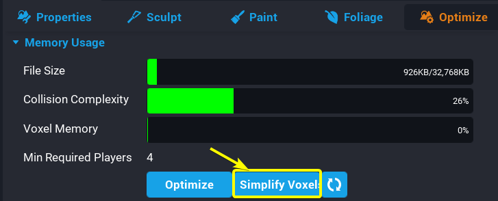{: .center loading="lazy" }

## Heightmaps

Heightmaps allow creators to generate terrain objects from `.png` images. The brightness of each pixel in the `.png` image controls how tall the point of terrain associated with that pixel will be.

### Formatting Heightmaps

Heightmap images need to square **gray-scaled** `.png` images. The **Terrain Generator** will only accept heightmap images of the following sizes:

- 128 x 128
- 256 x 256
- 512 x 512
- 1024 x 1024

!!!tip "There are multiple [websites](https://onlinepngtools.com/convert-png-to-grayscale) you can use to convert `.png` images to **gray-scale** images."

### Importing Heightmaps

To create a terrain object from a heightmap, first click on the  icon. Then, click on the **Import From Heightmap** button that appears in the **TERRAIN CREATOR** window.
{: .image-inline-text .image-background }

{: .center loading="lazy" }

After clicking on the **Import From Heightmap** window, you will see a window called **IMPORT TERRAIN HEIGHTMAP** pop up in the center of the screen. This window allows you to modify how the terrain is influenced by the heightmap.Below is an example of a heightmap `.png` file.

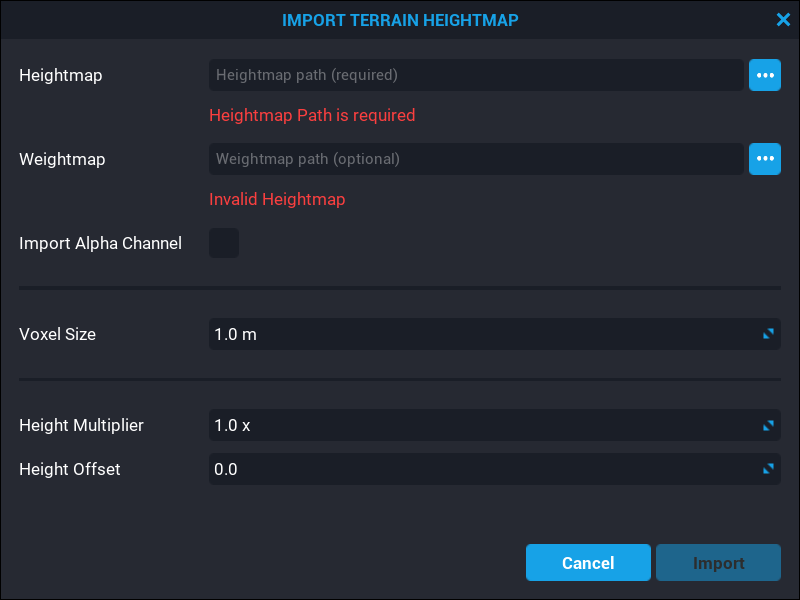{: .center loading="lazy" }

The heightmap image was generously provided by the **Core** creator **docbdesign**.

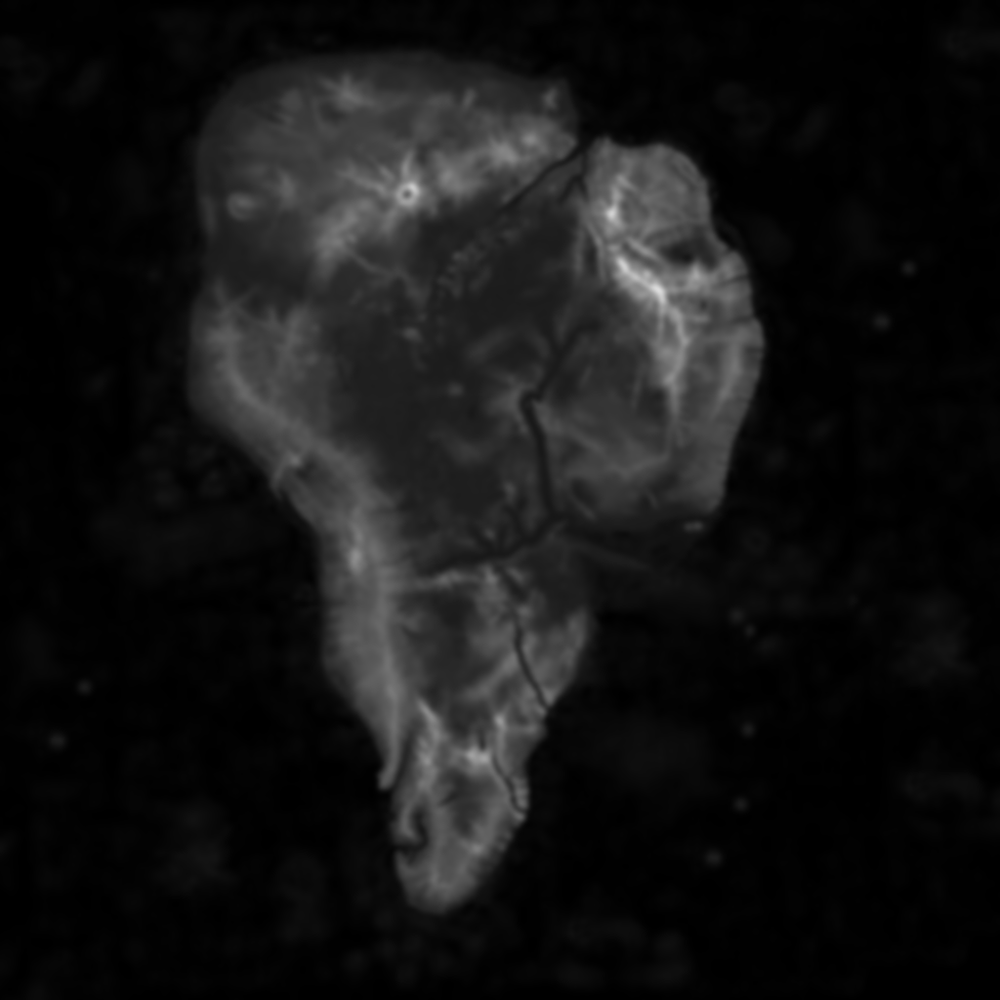

*Heightmap Source Image (left) vs. Terrain Generated from Heightmap (right)*
{: .image-cluster }

The **Voxel Size** setting determines how large the voxels of the terrain will be. Smaller voxel sizes will shrink your terrain but increase the amount of detail.

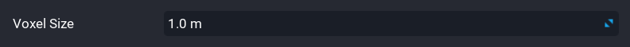{: .center loading="lazy" }

The **Height Multiplier** setting changes how much influence the brightness of a pixel has on the height of the generated terrain.

The **Height Offset** setting determines what the default height of the generated terrain will be.

{: .center loading="lazy" }

To import your heightmap, click on the the icon next to **Heightmap** field. You will see a **File Explorer** window open which will allow you to select a `.png` file from your file system. Double click on your `.png` to import it. Then, click on the **Import** button in the **IMPORT TERRAIN HEIGHTMAP** window to import your heightmap.
{: .image-inline-text .image-background }

{: .center loading="lazy" }

{: .center loading="lazy" }

## Weightmaps

Weightmaps are similar to heightmaps. Weightmaps store material data for terrain in the form of a `.png` file. To understand how this works it is important to know how data is stored in a `.png` file. The pixels in most `.png` files are made up of four color channels: **red**{: .Color_RED }, **green**{: .Color_GREEN }, **blue**{: .Color_BLUE }, and **alpha**. The strength of these color channels determine the color of each pixel in a `.png` image. For example, a high **red**{: .Color_RED } channel and **blue**{: .Color_BLUE } channel value will create a **magenta**{: .Color_MAGENTA } colored pixel. The **alpha** channel is used to determine the transparency of a specific pixel in a `.png` image. The image below demonstrates how differing the strength of the **red**{: .Color_RED }, **green**{: .Color_GREEN }, and **blue**{: .Color_BLUE } channels can create the **orange**{style="color:orange"} color in the Core logo.

{: .center loading="lazy" }

Weightmaps use these four color channels to automatically paint the terrain. Weightmaps tie each of the four color channels of your `.png` file to the four materials associated with your terrain.

- The **red**{: .Color_RED } channel is tied to the *first* material
- The **green**{: .Color_GREEN } channel is tied to the *second* material
- The **blue**{: .Color_BLUE } channel is tied to the *third* material
- The **alpha** channel is tied to the *fourth* material

    

        
    

    

        
    

    <em>
        <em>Materials Applied to the terrain</em> (left) vs. <em>Source Weightmap (right)</em>
    </em>

!!!note
    If your weightmap `.png` file uses the **alpha** channel, then you must enable the **Import Alpha Channel** property in the **IMPORT TERRAIN HEIGHTMAP** window before generating your terrain.

    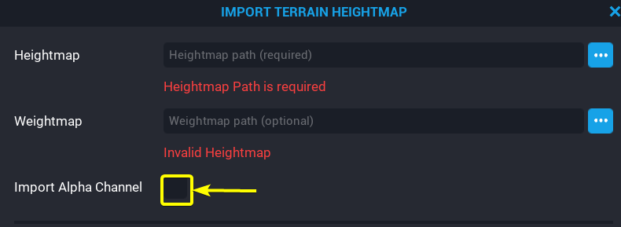{: .center loading="lazy" style="max-height:14em" }

To import your weightmap, you must follow the same steps you followed for importing the heightmap. In the **IMPORT TERRAIN HEIGHTMAP** window click on the icon next to the **Weightmap** field and select an `.png` file for your weightmap. Then click on the **Import** button.
{: .image-inline-text .image-background }

{: .center loading="lazy" }

{: .center loading="lazy" }

Weightmap images need to square `.png` images. The **Terrain Generator** will only accept weightmap images of the following sizes:

- 128 x 128
- 256 x 256
- 512 x 512
- 1024 x 1024
