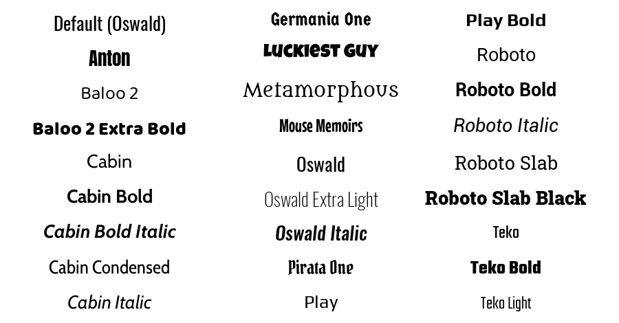

# User Interfaces in Core

## Overview

UI in Core includes all the 2D elements that can be used to build menus, notifications, dialogue boxes, and head's up display's (HUD's). Creating UI Elements is mostly a drag-and-drop process, where any UI element added to the scene

## Client-Server Communication

UI Elements can only be accessed by [client-side Scripts](networking.md). This means that for UI interactions to affect Networked objects, or have other in-game effects that are not strictly client-side, it is necessary to create **Event Broadcasts** to communicate between server and client. See the [Events namespace](../api/events.md) for more information and examples.

## UI Container Types

UI Containers have a **Content Type** which allow creators to specify the way the UI works and optimize performance. By default, UI Containers will haver the **Dynamic** type, but can be made more performant by changing their type to **Static** in instances where they do not need to move.

### UI Type Definitions

- **Static**: Used for any UI that does not need to move.
- **Dynamic**: Used for any UI that will move.
- **Texture**: For extremely complex UI with many elements to be rendered as a single texture, like Minimap UI.

!!! warning "Texture Content Type"
    The **Texture** Content Type has greater cost than the other UI Container Content Types, but this cost is fixed. It is recommended to only use **one** Texture per project.

## UI Properties

### UI Control Properties

[UIControl](../api/uicontrol.md) is the parent of all UI elements, and these properties apply to almost all UI elements in Core.

| Property | Definition |
| --- | --- |
| **X and Y Offset** | The distance from the anchor origin that the UI widget will display |
| **Width and Height** | Size of this UI element |
| **Rotation Angle** | Rotation angle using the anchor point as the pivot |
| **Inherit Parent Width and Height** | Whether the widget stretches in size to fit the transformations of the parent |
| **Adjust Self Size to Inherited Size** |  When the *Inherit Parent Size* boxes is checked on, adds the dimensions on this UI element to the dimensions of the parent element |
| **Anchor** | Which corner, edge, or center the element is the origin, for positioning and rotation |
| **Dock** | Which corner, edge, or center of the parent the anchor is relative to. |

### UI Text Box Properties

**UI Text Boxes** can have different colors, fonts and display options, depending on the space they need to occupy.

| Property | Definition |
| --- | --- |
| **Text** | The string of text that gets displayed |
| **Color** | The color of the font |
| **Size** | The size of the font |
| **Font** | The typeface used for the text |
| **Justification** | the alignment of the text within the text box |
| **Wrap Text** | Whether or not the text starts on a new line when it exceeds the width of the box |
| **Clip Text** | Whether or not text that exceeds the box size will be hidden. |

## UI Text Fonts

{: .center loading="lazy"}

### Change a Font on UI Text

Like Materials on static mesh objects, there are two ways to change the font of UI text, either by dragging from the **Fonts** section of **Core Content** or by selecting from the **Property Window**, and double-clicking the icon in the **Font** property.

---

## Learn More

[UIControl](../api/uicontrol.md) | [UIText](../api/uitext.md) | [Events](../api/events.md)
