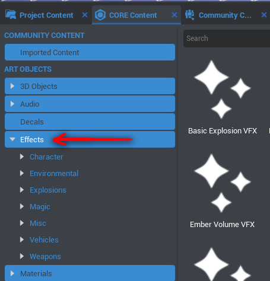
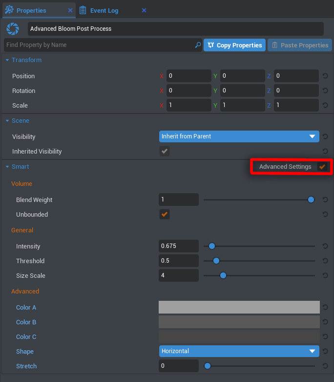
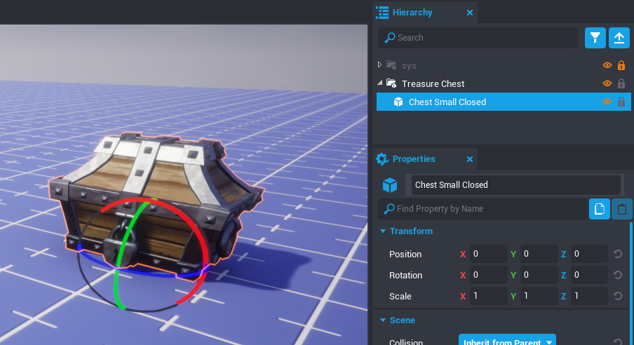
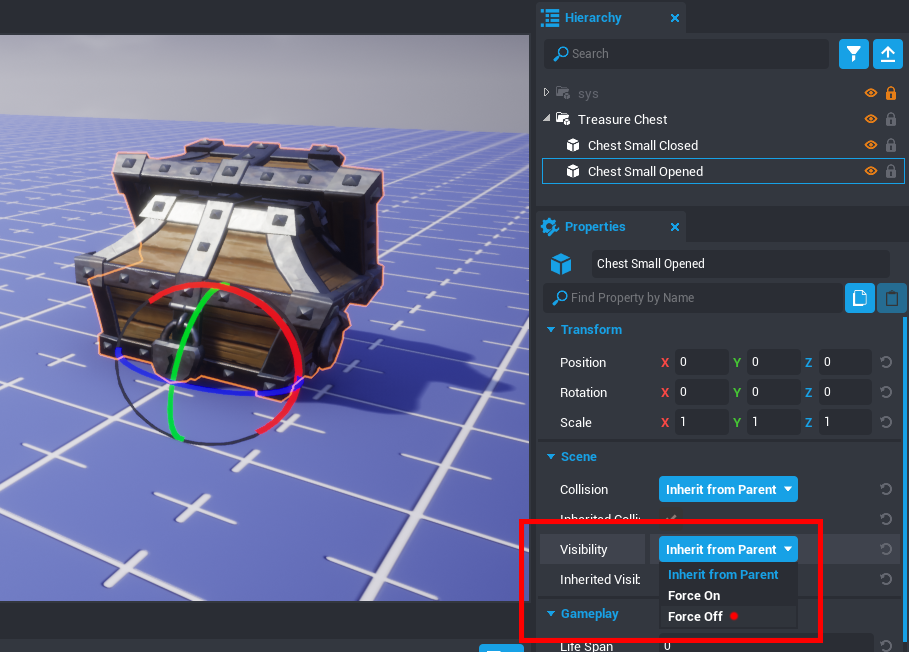
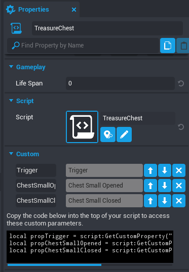
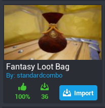
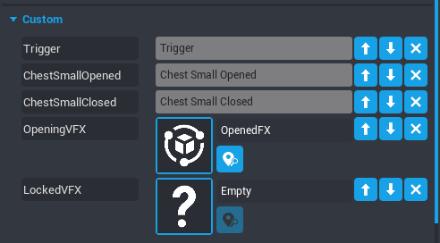

# Visual Effects in Core

## Overview

A huge benefit to Core is the vast amount of visual effects that are built-in and easily editable. You get to start with high quality effects that already exist, and truly make them your own.

Our team at Manticore has built a huge level map that you can explore at any time to see just *some* of the ways that all of our different visual effects (often shorted to VFX) could be used.

To get a tour of what is possible with visual effects in Core, run around this map and then come back to this tutorial to learn how to make a couple of the effects found on this map!

- **[Click here to go to the VFX level map page.](https://www.coregames.com/games/e38551f434b14eee989a08cd5f98c31d)**

While the map explains many useful things about how to use all the visual effects, this page includes tutorials on how to make wicked cool VFX in Core using Lua.

<div class="figure-block">
    <figure>
        <video autoplay loop muted playsinline poster="/img/EditorManual/Abilities/Gem.png">
            <source src="/img/VFXtutorial/vfxTrails.webm" type="video/webm" alt="Whispy Trail VFX"/>
            <source src="/img/VFXtutorial/vfxTrails.mp4" type="video/mp4" alt="Whispy Trail VFX"/>
        </video>
        <figcaption><em>Trail VFX in Core</em></figcaption>
    </figure>
</div>

## Dozens of Built-In Effects

Core comes with all sorts of visual effects built-in, all with different parameters for altering how they look and move.

To find all these visual effect objects, navigate to the Core Content tab and click on the **"Effects"** section.

This window can also be accessed via the dropdown menu "**Window -> Core Content**".

{: .center loading="lazy"}

Currently, there are **7 different sections** that contain effects you can use right away:

- **Character**
    - These vfx are specifically human or character-focused.
- **Environment**
    - Elemental effects, and effects that are more nature-oriented.
- **Explosions**
    - Definitely things that blow up!
- **Magic**
    - More ethereal and sparkly effects.
- **Misc**
    - Things that don't fit into the other categories--weird stuff!
- **Vehicles**
    - Effects designed to enhance movement and show physical power.
- **Weapons**
    - These effects were designed specifically with the weapon system, and to go along with attacks.

!!! tip
    Don't be afraid to use any effect for any purpose--don't let categories restrict your creativity!

These larger categories can be found by clicking the little drop down arrow on the left side of the Effects button label. Each of these categories also have subcategories, that can be opened the same way:

{: .center loading="lazy" }

To check out what any of these VFX objects do, drag one into your viewport or Hierarchy. In most cases it will start playing immediately, but for one-off animations, you'll probably want to reactivate them multiple times to see what they do.

All VFX have a ***Play*** button at the top of their **Properties** window, so to check out what an explosion looks like, drag it into your scene and hit the Properties' *Play* button!

### Special Effect Materials

Besides all of the more literal visual effects that Core includes, there is also a categorey of **Materials** that lend themselves nicely to VFX, the SpecialEffects materials:

{: .center loading="lazy" }

Use these in combination with the Effects objects to get even more variety out of what you can make.

### Post Processing Effects

Another category of effects that can make huge changes to your map are **post process effects**. As their name implies, these are applied on top of everything else in your game at the end, so they can be used to change everything visually about the game at once.

{: .center loading="lazy" }
{: .center loading="lazy" }
{: .center loading="lazy" }

To find all our Post Process Effects, check out the Post Processing section of Core Content.

{: .center loading="lazy" }

You'll probably want to always use some combination of these--the amount they can level-up a map visually is huge!

---

## Tutorial Videos

<lite-youtube videoid="99gf9fuLAFI" playlabel="Core VFX Series: Part 1"></lite-youtube>
{: .video-container }

<lite-youtube videoid="MSso2Jq66gg" playlabel="Core VFX Series: Part 2"></lite-youtube>
{: .video-container }

## Tutorials

While you can use the video above if that is your preference, we'll next go over different effects in a written tutorial.

### Post Processing Effects

Just like in the video, let's start with the most dramatic and easy of the visual effects you can use in Core: **Post Process Effects**!

Post process effects can make very dramatic changes to a map with very little work. You can use as many of them as you want in combination, but this can eventually get tricky when you've got dozens. There are two main ways to use a post process effect: as an unbounded effect, or a bounded effect.

- **Unbounded** post process volumes are limitless in size, and encompass the entire map.
- **Bounded** post process volumes use a cube volume to determine what space that post processing effects in the world.

Several post processing effects have both a regular version and an **advanced** version. Use whichever suits your needs, but in this tutorial we'll go over the advanced versions of these effects.

**Time to complete:** 10 minutes

**Skills you will gain:**

- how to edit post process effects in Core
- how to layer post process effects together

{: .center loading="lazy" }

#### Advanced Bloom Post Process

**Bloom** is, basically, a glow effect. It gives everything that emits light in your scene a sort of magical halo, as though the atmosphere has thickened.

The best way to test post process effects is on an already decorated map with some variety in it. For this tutorial, I grabbed some templates from Community Content. Almost all (if not truly all) of these templates were made by students at Cogswell College during Global Game Jam 2020.

!!! info Those creator usernames are: JaineRoss, mjcortes782, trimun, and TSMVayne.

{: .center loading="lazy" }

1. Start by dragging the **Advanced Bloom Post Process** effect into the project Hierarchy. With default settings, it'll just make a subtle change.

    {: .center loading="lazy" }

    The overall scene is darker and the contrast is higher. Even though it is called *bloom*, by default it seems to have decreased the bloom from our first scene.

2. Click on the **Advanced Bloom Post Process** effect in the Hierarchy, and check out the Properties window. We can mess with all sorts of values in here.

    To expose all the options we want to change, check the **Advanced Settings** box to make sure it is on.

    {: .center loading="lazy" }

    Wiggle all those settings around to see what happens! Trying yourself can be the best way to understand what is happening.

3. I'll first show you the settings I chose, and then explain a bit about them. I chose these properties:

    {: .center loading="lazy" }

    Which makes my map look like this:

    {: .center loading="lazy" }

    As you can see, you can go pretty intense with this effect. I went super dramatic to showcase just how much can change, but feel free to find the right balance for your project.

4. Each of the properties you can change has a tooltip to explain what it does. Hover over the name of the property to see the tooltip.

    In general though, **Blend Weight** is the strength of the entire effect on the scene. It is essentially a slider from *off* to *on*.

    That is different from **Intensity**, which controls the strength of the bloom itself. This has a cap on the slider, but you can type in any number you want to increase the intensity even more. While I was able to drag the slider to 15, I instead typed in a value of 100 to make things ridiculous and blown out. And it's fun--who knows, maybe you'll think of a cool place to use something like this!

    {: .center loading="lazy" }

    !!! tip
        There are a lot of properties in Core that can be *overdriven*. This means you can manually type in a number higher than what the slider allows. This usually works for properties that act as a multiplier, like the *Intensity* in this case.

    The other fun properties to change on this post process effect are the different **colors**. This can really change the mood of the entire scene, and is a fun way to affect temperature.

    Have fun experimenting with different settings! If you don't see a change immediately, try changing the number very dramatically to get an idea of what is happening.

#### Ambient Occlusion Post Process

**Ambient Occlusion** (often abbreviated to AO) can be generally referred to as contact shadows. In the real world, when two objects are close together, less light is able to reach the cracks between them. So, to simulate this virtually, we use ambient occlusion!

I'm going to start visually from scratch with this one, so I am back to the first image:

{: .center loading="lazy" }

1. Drag the **Ambient Occlusion Post Process** into the project Hierarchy from Core Content to get started. The default settings give a subtle effect, but it still makes a difference.

    {: .center loading="lazy" }

    The main noticeable part of the change in this image is underneath the roof close to the camera. It becomes darker, and the shadows of the beams on the ceiling are more dramatic.

2. In the Properties window, make sure to turn on the **Advanced Settings** button to have access to everything.

3. In this case, I want to make the AO dramatic for the scene, so I cranked up the settings. This creates really obvious contact shadows, which grounds everything together. It creates a feeling that things were built intentionally this way, which can help eliminate the feeling of kitbashing one might have in their scene.

    Notice the dark shadows under the roof beams, and the darker shadows on the rubble pile on the left.

    {: .center loading="lazy" }

    For this particular dramatic AO effect, I used these settings:

    {: .center loading="lazy" }

    Adjust the settings to whatever feel best for your scene and mood.

#### Ambient Occlusion Recolor Post Process

Something particularly fun and weird you can do with the Ambient Occlusion we made is **recolor** it. This can create some really wacky effects, or in general set a specific color palette for a project.

We're going to continue with the end result of the Ambient Occlusion section, so that we have existing ambient occlusion to recolor! The Ambient Occlusion Recolor Post Process **only works in combination** with the Ambient Occlusion Post Process.

{: .center loading="lazy" }
{: .center loading="lazy" }

1. Drag the Ambient Occlusion Recolor Post Process into the Hierarchy. This should result in something like the second image above.

    By default it starts with the color brown, which gives a warm darkness to the whole scene. You can alter this to suit whatever helps your scene--perhaps a dark blue would help instead to balance an already warm scene.

These other two images below are a general explanation, and you don't need to do them for the tutorial. Knowing how to achieve these weird effects is good though!

{: .center loading="lazy" }

Turning on the **Use Two Colors** option will give you a second color option, and using the Color Balance slider you can choose which color is more prominent in the scene. This gives you really strong control over the color palette, and lets you do particularly odd and unique things. Such as making weird radioactive shadows, if that's what makes you happy.

{: .center loading="lazy" }

The other particularly interesting setting on the recolor post process is modifying **Blend Weight**. The lower this number is, the more intense this glow effect is. This could be used to showcase damage increasing on the player, or maybe a world on fire... whatever you can imagine!

#### Lensflare Post Process

{: .center loading="lazy" }

In real life, a **lens flare** is a streak of light glare and sometimes a light shape floating in an image. This happens when light hits a camera lens and scatters around within all the parts that make up the lens. For some photographers, it can be annoying, but in general it is an unavoidable aspect of filming light.

In the virtual world, adding it in can make a scene feel more realistic and grand.

We'll start this section using two of the effects that we made earlier: the Advanced Bloom Post Process and the Ambient Occlusion Post Process **both turned on**.

{: .center loading="lazy" }
{: .center loading="lazy" }

1. Drag the **Lensflare Post Process** into your Hierarchy, and you should get something like the second photo above.

    For my scene at this particular angle, the lens flares were not very visible, so I turned the intensity up to 5. This made the shapes much more visible.

    {: .center loading="lazy" }

2. Try turning up different settings. The **Intensity**, **Bokeh Size**, and **Threshold** can all be *overdriven* to create the look you are going for.

3. The **Shape** property can be the most fun to change for the theming of your game. In particular, hearts are fun:

    {: .center loading="lazy" }

    The above image also had increases to Intensity and the Bokeh Size.

Now you know how to control several different post process effects. Each one in Core Content has slightly different base settings and options, but now you have enough knowledge to understand how the others work too. Have fun experimenting!

---

### Visual Effects

The next section of this tutorial focuses exclusively on VFX! Just like the video above, we will be making an interactable treasure chest and using the Core built-in resource system.

Core includes the benefit of having an ever-expanding list of visual effect objects to work with, and thanks to the template system, we can combine these in even more unique ways to achieve whatever your vision may be.

We'll be making a treasure chest that requires an item to open!

**Time to complete:** 20 minutes

**Knowledge Level:** No knowledge required, but this tutorial will use some simple Lua scripting. If you've never programmed before, you might want to check out the **[Lua](lua_basics_lightbulb.md)** tutorial first.

**Skills you will gain:**

- how to play a visual effect on a trigger (at a specific moment)
- how to play a sound effect on a trigger
- how to use community content
- how to give the player resources
- how to combine visual effect objects with sound effects

{: .center loading="lazy" }

To start, open up a new project or whatever project you'd like to make this treasure chest in.

#### Setting up the Treasure Chest

1. Navigate to the **Core Content** window.

    !!! info
        If it is not already open in your Editor's UI, you can open it up by clicking **Window > Core Content** in the top menu bar.

2. Type "chest" into the search bar within that window.

    {: .center loading="lazy" }

3. Click on and drag the **Chest Small Closed** into your project viewport.

4. Right click that chest in your project **Hierarchy**, and click "New Group Containing This". Name this group "Treasure Chest".

    The transform data on the Small Chest Closed (seen in the **Properties** window while the object is selected) should now be all at default of 0,0,0. All the position data should now be on the parent group that we just created.

    {: .center loading="lazy" }

5. Next, drag a **Small Chest Opened** from Core Content into that group we created.

    This will place the opened chest in the exact same spot as the closed chest.

6. With the Chest Small Opened selected in the project Hierarchy, navigate to the Properties window.

    Scroll down to the section called *Scene*. In here, change the setting for **Visibility** from *Inherit from Parent* to *Force Off*. We're going to hide this chest and unhide it later when we want the chest to be opened.

    {: .center loading="lazy" }

7. Click the button at the top left of the Core Editor to create a new script; let's call it `TreasureChest`.

    {: .center loading="lazy" }

    Drag this script into your TreasureChest group in the Hierarchy.

8. In the **Core Content** window, search for "trigger". Click and drag the object that shows up into the TreasureChest group in your project Hierarchy.

    !!! note
        Overall in your group structure, it's typically best practice to keep your scripts at the top. You're most likely to want to click on them again later, so keeping them at the top helps them be easier to find!

9. With the Trigger selected in the Hierarchy, check out the **Properties** window. Scroll down to the **Gameplay** section.

    1. Find the *Interactable* property. Turn this on.

        !!! tip
            A trigger can operate in two distinct ways. If **Interactable** is *on*, it will turn into a player-confirmed switch. This means the player will have to walk up to it and press ++F++ to cause the trigger to active its functions. This works perfectly for things like switches or dialogue.

            If **Interactable** is *off*, the functions connected to the trigger will happen instantly whenever a player simply walks into a trigger. This case is more useful for things like traps, or in general things you don't want the player to know about or have to think about activating.

    2. In the *Interaction Label* property, type "Open."

    At this stage, if you press play to try it out, you'll notice that walking up to the treasure chest prompts you to press ++F++ to open the chest, but when you press it nothing happens.

    That's where the cool stuff we're going to make comes in!

    !!! tip
        Make sure your spawn point and treasure chest are not overlapping. Otherwise, when you press play, you might be stuck inside the chest!

        Press ++V++ to toggle gizmos on and off to see both the spawn point and the trigger we created.

10. First, in order to use that trigger in our script, we need to access it. Select your `TreasureChest` script in the Hierarchy. While it is selected, click and drag the trigger onto the Properties window for the script.

    This adds the trigger as a *custom property* on the `TreasureChest` script. Custom properties are wonderfully simple ways to use any part of the project or hierarchy that you need to in your code.

    Do this same action--dragging the objects from the Hierarchy into the script Properties window--for the Chest Small Opened and the Chest Small Closed.

    {: .center loading="lazy" }

11. We need two other custom properties on our script. At the bottom of the Properties window, click the "Add Custom Property" button. Choose the type AssetReference, as we'll be adding something here that we haven't created yet. Name this one **OpeningVFX**, and the second one (also an AssetReference type) **LockedVFX**.

12. Now that we've got everything we need, double click the `TreasureChest` script to open it up!

#### Writing the Interaction Script

1. We'll want all those custom properties we created. To use the code for accessing them, copy it from the Properties window of the script.

    1. A handy prepared snippet of code for everything you need is listed beneath the custom properties of the script. Right click in this black box of text, and click *select all*, then again and click *copy*.

    2. Now in your script, right click to paste everything in there.

    3. With all these variables pasted in, your script should look like this:

        ```lua
        local propTrigger = script:GetCustomProperty("Trigger"):WaitForObject()
        local propChestSmallOpened = script:GetCustomProperty("ChestSmallOpened"):WaitForObject()
        local propChestSmallClosed = script:GetCustomProperty("ChestSmallClosed"):WaitForObject()
        local propOpeningVFX = script:GetCustomProperty("OpeningVFX")
        local propLockedVFX = script:GetCustomProperty("LockedVFX")
        ```

2. Next we need to create a function for the moment the player interacts with the treasure chest. This is what happens when the player presses ++F++ when prompted by the trigger we placed.

    In your script, beneath all those *variables* we just pasted in, add this code:

    ```lua
    local function OnSwitchInteraction(theTrigger, player)
        UI.PrintToScreen("Hi! You've triggered an event.")
    end
    ```

    Right now all this does is print directly on our screen the message we type in. Super simple to get it going!

3. So now we have the function, but in order for it to work when we press play, it needs to be connected to the *event* called **interactedEvent** of the trigger.

    Copy this code into the end of your script to do this:

    ```lua
    propTrigger.interactedEvent:Connect(OnSwitchInteraction)
    ```

    !!! info
        *Events* are built-into many objects in Core. To read more about different events on various objects, check out the [API Overview](../api/index.md).

4. Now try pressing Play!

    When you walk up to the treasure chest and interact with it by pressing ++F++, our message appears on the screen. Woohoo!

    Now it'd be real cool if this treasure chest required an item to open it. So, let's create that item!

#### Creating a Pickup to Unlock the Chest

1. [Community Content](community_content.md) is an insanely valuable resource for making your life easier. Other users (and even you too if you want!) post creations that they have made for anyone to use. This helps people who prefer to program still have quality and varied art models to use in their games, and art people who need coding help the types of resources to do that.

    In our case, we want an item the player can pick up. Luckily, there is something like that already on Community Content!

    Navigate to the **Community Content** tab. Type "loot" into the search bar, and import the **Fantasy Loot Bag** by standardcombo. We're going to repurpose this!

    {: .center loading="lazy" }

2. Click over to the **Core Content** tab. You'll see an **Imported Content** section, and within it, the Fantasy Loot Bag! Click this to drag the **green**{: style="color: var(--core-color-published)"} Loot Bag object into your viewport or project Hierarchy.

    Move it around so that it's somewhere you can see it and get to it.

3. Press play to check out how it works by default! When you walk up to it, it'll prompt you with " Press F to pick up" and if you do, there is a sound effect and flash of light that happens while your character does an animation to grab it.

    Depending on where the Loot Bag is in relation to the player, a different animation will play.

    <div class="figure-block">
    <figure>
        <video autoplay loop muted playsinline poster="/img/EditorManual/Abilities/Gem.png">
            <source src="/img/VFXtutorial/vfx6_FantasyLootBagPickup.webm" type="video/webm" alt="Varied Animations"/>
            <source src="/img/VFXtutorial/vfx6_FantasyLootBagPickup.mp4" type="video/mp4" alt="Varied Animations"/>
        </video>
        <figcaption><em>The varied animations of the Fantasy Loot Bag</em></figcaption>
    </figure>
    </div>

    There's several things we're going to change about the Loot Bag to suit our needs here with the Treasure Chest.

4. Click the Loot Bag in the **Hierarchy**, and drop down the folder structure to see the contents. We're looking for the **Trigger** right now. Click this, and check out the **Properties** tab. Scroll down to the Gameplay section, and uncheck the box for *Interactable*.

    Now when a player walks over it, they will instantly grab it, rather than have to press ++F++ first.

5. We can use whatever art we want in this object, so instead of a coin pouch let's try... a crowbar. For prying that chest open with!

    Beneath that trigger, there is a *ClientContext* folder. Within this folder are all the objects that make up the visual component of the Loot Bag. Don't delete the whole folder, but delete all of these contents so that we can start fresh.

6. Click over to the Core Content tab, and type "crowbar" into the search box.

    Drag the red object that shows up into the ClientContext folder that we just emptied. Now our Loot Bag is a crowbar!

    {: .center loading="lazy" }

    Check that all the transforms on the Client Context folder are at 0,0,0 to be sure the crowbar is at the right size and location.

7. The only other important thing we'll want to change is on the **root folder** of the Loot Bag object.

    One of the custom properties is called "ResourceName". Be default it is "Gold" and therefore that's what resource is given to the player when they pick it up. We want this to be a crowbar... so let's just call it `Crowbar`!

    !!! tip
        Make sure to pay attention to your casing of a resource. The resource "Crowbar" is completely different from "crowbar".

Now when walking up the crowbar, the player will automaticall pick it up! But, it still has the coin sound effect by default, and that feels pretty weird with this object. So, let's create a new effect to play!

#### Creating a Pickup Effect Template

1. To start creating an effects template, let's create a folder. Right click in the empty space of the Hierarchy to create a New Folder. Name it "CrowbarPickupFX".

    1. In **Core Content**, search "step metal hollow" and drag the `Footstep Metal Hollow 01 SFX` onto that new folder we made.

    2. Next look up "gear movement shuffle light" in Core Content and drag `Gear Movement Shuffle Light 01 SFX` into the folder as well.

    3. Right click the **CrowbarPickupFX** folder, and select "Enable Networking" to enable this and all children to be networked. This means the state of it is known by the server, and all game clients.

    4. Select both of those sound effects we added at once, and in the **Properties** window, turn the *Auto Play* box on. We want these sounds to play the moment they are created.

        !!! tip
            {: .center loading="lazy" }
            The top right of the Properties window includes a play button for testing a sound. If you turn Apply Effects on, it will take into account whatever you change about the Properties!

    5. Scroll up a bit in the Properties window, and set the Life Span to 2.

    6. Now we've got it all set! To use it in other places, we're going to make it into a template. Right click the root folder, and select "Create New Template from This". Now we have a custom sound effect template to use anywhere!

    7. Since all templates in the Hierarchy are only *instances* of a template saved into Project Content, we can delete this one. We want our script to spawn the sound effect at the right moment.

2. Click back onto the Loot Bag object. In the Properties window, notice the custom property "PickupFX".

    In the Project Content tab, find your new CrowbarPickupFX template. Drag this into that custom property on the Loot Bag.

    {: .center loading="lazy" }

3. Now when you press play to test, it should play your new sound effect when picking up the crowbar. Ta-da!

4. Now we come back to scripting. We need to make sure the player has the crowbar when trying to open the treasure chest in our interaction code we wrote earlier.

    Replace all the code of your `OnSwitchInteraction` function with this:

    ```lua
    local function OnSwitchInteraction(theTrigger, player)
        if player:GetResource("Crowbar") > 0 then
            player:RemoveResource("Crowbar", 1)
            propChestSmallClosed.visibility = Visibility.FORCE_OFF
            propChestSmallOpened.visibility = Visibility.INHERIT
        else
            UI.PrintToScreen("No crowbar")
        end
    end
    ```

    This adds an *if statement* inside our trigger. If the player has a crowbar, then it will take that crowbar away from the player and swap which chest is visible, effectively switching to the open treasure chest form.

    If the player has zero or less crowbars (if it were physically possible to have negative crowbars), it prints that out onto the screen.

5. Now we just want to make sure that our **TreasureChest** root group has networking *enabled*. Right click it do enable this.

    <div class="figure-block">
    <figure>
        <video autoplay loop muted playsinline poster="/img/EditorManual/Abilities/Gem.png">
            <source src="/img/VFXtutorial/vfx10_FirstWholeLoop.webm" type="video/webm" alt="The basic loop of the treasure chest."/>
            <source src="/img/VFXtutorial/vfx10_FirstWholeLoop.mp4" type="video/mp4" alt="The basic loop of the treasure chest."/>
        </video>
        <figcaption><em>It works--but it looks basic.</em></figcaption>
    </figure>
    </div>

Now if we test it--everything works correctly! But it sure looks plain and that feels bad. Let's add more effects to improve this.

#### Creating the Opening and Locked Effects

1. Create two new folders in the project Hierarchy by right clicking in the open space. Name one `OpenedFX` and the other `LockedFX`.

2. We'll start with the opening effect. In Core Content, search for "health spiral". Drag what shows up into the `OpenedFX` group--We're gonna modify some properties on it to use.

    All of these settings will be found in the Properties window with the Health Spiral VFX selected in the project Hierarchy.

    1. Scroll down to the section called "Smart" and change the **Radius** to 7.5 to be wider.
    2. Increase the **Spiral Speed** to 8.
    3. Set the **Ring Life** to 1. So we've got a neat visual effect now!
    4. Now we need some sound effects: search for `Meta Fantasy Treasure 01 SFX` in Core Content and the `Object Fantasy Treasure Chest Open 01 SFX` and drag each one into the `OpenedFX` folder.
    5. Select both of these effects in the Hierarchy, and turn **Autoplay** on for both in the Properties window.
    6. Give each one a **Life Span** of 2.

3. Now that we've got all the contents of our new effect set up, we need to enable networking on its root folder via the right-click menu.

4. Right click this group and create a template from it. After making it into a template, delete it from the project Hierarchy.

5. Click back onto the `TreasureChest` script from earlier. Drag your new effect into the custom property for the **OpeningVFX** on the `TreasureChest` script.

    {: .center loading="lazy" }

6. Now we need to spawn this effect in our code!

    By adding this new code to spawn our effect and destroy the trigger, your function should look like this:

    ```lua
    local function OnSwitchInteraction(theTrigger, player)
        if player:GetResource("Crowbar") > 0 then
            player:RemoveResource("Crowbar", 1)
            propChestSmallClosed.visibility = Visibility.FORCE_OFF
            propChestSmallOpened.visibility = Visibility.INHERIT
            World.SpawnAsset(propOpeningVFX, {position = theTrigger:GetWorldPosition()})
            theTrigger:Destroy()
        else
            UI.PrintToScreen("No crowbar")
        end
    end
    ```

    Notice that we are destroying the trigger at this step so we don't need to worry about reinteracting with it or being prompted on-screen with "Open" still.

    Test it out! Now the opening effect that we made should play when opening the chest. This helps the action to feel more intentional and rewarding as a player.

    <div class="figure-block">
    <figure>
        <video autoplay loop muted playsinline poster="/img/EditorManual/Abilities/Gem.png">
            <source src="/img/VFXtutorial/vfx11_OpeningFX.webm" type="video/webm" alt="The basic loop of the treasure chest."/>
            <source src="/img/VFXtutorial/vfx11_OpeningFX.mp4" type="video/mp4" alt="The basic loop of the treasure chest."/>
        </video>
        <figcaption><em>Now we've got a sparkly little opening effect!</em></figcaption>
    </figure>
    </div>

7. Next let's create the `LockedFX` for when a player tries to open the chest without having the crowbar first.

    1. In **Core Content**, search for "impact lines" and drag the result into your `LockedFX` folder. This gives us a visual component.
    2. Next search Core Content for a "Mechanical Gear Lock 01" to be the audio part of this effect. Drag it into the `LockedFX` folder.
    3. Change this audio object *Auto Play* property to be on.

8. Now we've got all the parts, but we need to enable networking on the root folder first via the right-click menu.

9. Right click to turn this `LockedFX` object into a new template.

10. Just like before, delete this first instance from your project Hierarchy. Click that `TreasureChest` script and drag our new `LockedFX` template into the custom property we created called `LockedVFX`.

11. We want this `LockedFX` template to spawn when the player doesn't have a crowbar, so let's replace the `UI.PrintToScreen()` line with lines to spawn the template.

    This will make your whole `OnSwitchInteraction()` function look like this:

    ```lua
    local function OnSwitchInteraction(theTrigger, player)
        if player:GetResource("Crowbar") > 0 then
            player:RemoveResource("Crowbar", 1)
            propChestSmallClosed.visibility = Visibility.FORCE_OFF
            propChestSmallOpened.visibility = Visibility.INHERIT
            World.SpawnAsset(propOpeningVFX, {position = theTrigger:GetWorldPosition()})
            theTrigger:Destroy()
        else
            World.SpawnAsset(propLockedVFX, {position = theTrigger:GetWorldPosition()})
        end
    end
    ```

    <div class="figure-block">
    <figure>
        <video autoplay loop muted playsinline poster="/img/EditorManual/Abilities/Gem.png">
            <source src="/img/VFXtutorial/vfx11_LockedFX.webm" type="video/webm" alt="The basic loop of the treasure chest."/>
            <source src="/img/VFXtutorial/vfx11_LockedFX.mp4" type="video/mp4" alt="The basic loop of the treasure chest."/>
        </video>
        <figcaption><em>This makes it easier to tell that the player is indeed interacting with the chest--just not in the right way.</em></figcaption>
    </figure>
    </div>

Now you've got some basic effects set up for your treasure chest! You have learned how to create effect templates by combining various visual effects with sound effects, and how to spawn them at specific times! Go forth, and make more awesome stuff.

## More Tips & Info

In most cases you won't need to code to use the visual effects in Core. Often times templates will have a custom property for more effect templates, so you can make your own effects as templates and just drag and drop them into other content--just like the Fantasy Loot Bag we used.

There are so many ways that you can make effects unique. By combining several of them, changing their properties dramatically, and using them connected through code you can change the timing and positions of effects in whatever ways you can dream up.
