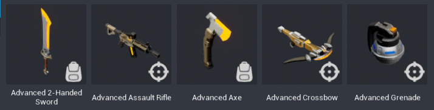

# Weapons Reference

## Introduction

**Weapons**, the fun devices of destruction found across many Core games, are a specific type of Core Object that includes features like ammo, reloading, and calculating where a projectile hits.

### Types of Weapons

Not everything that can be used as a weapon is actually a **Weapon** object in Core. In **Core Content**, the **Game Components** section has a category called **Weapons** with a variety of different types of weapons that you can drag and drop into your game.

{: .center loading="lazy"}

In the **Game Components** weapon templates, the weapons that use projectiles, like the guns and the grenades use the {: style="height:34px" } Weapon icon, and melee weapons, that do damage based on whether or not the weapon collides with the player, use the {: style="height:34px" } Equipment icon.
{: .image-inline-text .image-background }

This reference covers the Weapon type of object, but it is not the only way to create a tool used for combat, and a Weapon can be used to do many things besides damage.

### Scripting Weapons

Weapons have specialized properties, functions, and events that allow creators to script behavior based on the ammunition available and projectile behavior. To learn more, see the [Weapons section of the Core API](https://docs.coregames.com/core_api/#weapon)

## The Empty Weapon Object

There are two ways to create weapons in Core: modifying one of the weapon templates that is included in Core Content, or using an empty Weapon Gameplay Object and creating one from scratch.

The empty Weapon object can be found in **Core Content** in the **Gameplay Objects** section.

To learn how to make a weapon from scratch using this gameplay object, see the [Basic Weapons Tutorial](weapons_tutorial.md), which will cover how to create a weapon that can be picked up and used. To make this weapon also *damage players*, see the [Advanced Abilities Tutorial](https://docs.coregames.com/tutorials/abilities_advanced/).

Making a weapon this way allows you to create unique and creative weapon behavior. For more conventional video game guns, however, it is much more efficient to modify an existing weapon template.

## Modifying a Weapon Template

Using a Core Weapon template as a starting point is a great way to ensure that weapons will have all the features players expect, while allowing you to change the appearance, behavior, and visual and sound effects of the weapon.

### Basic and Advanced Weapon Templates

To find the weapon templates, open the **Core Content** window, and find the **Game Components** section, which contains a **Weapons** section. Each of the Weapons here will be either **Basic** or **Advanced.**

**Basic** weapons include appropriate ability timings, animations, and ammo for the type of weapon, but do not have the scripts that let them damage players. To create a weapon that damages the players, use the **Advanced** weapon templates instead.

### Parts of an Advanced Weapon

This section will explain the purpose of each part of an Advanced weapon, using the **Advanced Pistol** as an example.

#### Server Context

This section contains scripts that will help calculate where projectiles actually hit based on the player's position and movement at the time, and calculate the damage that they should do.

#### Client Context

This folder contains two subfolders. **Scripts** contains scripts that control the player's experience of using the weapon, like playing the effects for when a player shoots, or picks up the weapon.

The **Geo** folder contains the actual model (the "geometry") for the gun. You can place a new model in this folder to easily swap out the appearance for a completely different weapon.

### Using the Properties Window

With the outermost folder of the weapon selected, in this case **Advanced Pistol (networked)**, you can see the all the properties available to change to customize the weapon, divided into different sections.

!!! tip
    Hover the mouse over any property to see a tooltip explaining what it does.

- **Projectile**, controls the way the projectile moves once it is spawned.
- **VisualEffects** contains Effects templates that are spawned at different stages of using the weapon. This can include **both visual and audio effects**.
- **Ammo** has properties that change how often the player will need to reload, and has the visual and sound effects for these actions.
- **Spread** has different options to change the accuracy of the weapon.
- **Ability** has references to the two abilities that are part of the weapon, **Shoot** and **Reload**.
- **Custom** will contain different properties depending on the weapon, but will allow you different options like whether or not players automatically reload, the keys players use to zoom and aim, and the visual and sound effects that play when the weapon gets picked up.

## Changing a Weapon Template and Other Game Behavior

### Automatically Pick Up Weapons

By default, a player equips a weapon by walking into its **PickupTrigger** and pressing the interact key. You can change this to instead give the weapon to the player as soon as they enter the trigger.

1. In the weapon template in the **Hierarchy**, select the {: style="height:34px" } trigger object, usually called **Pickup Trigger**.
{: .image-inline-text .image-background }
2. To change the message it shows the player before the interact to pick up the weapon, change the **Interaction Label** property.
3. To make the weapon automatically equip instead, uncheck the box for **Interactable**.

### Stop Player Movement while Reloading

Reloading is controlled by an ability called **Reload**, and you can change the animation that is played, what they player can do at the same time, and how long it takes to reload.

1. In the weapon template in the **Hierarchy**, select the {: style="height:34px" } **Reload** ability, and open the **Properties** window.
{: .image-inline-text .image-background }
2. Scroll down to the **Execute** section, and uncheck the boxes for **Can Move** and **Can Jump**.

### Chance the Appearance of the Weapon

Changing a weapon's appearance is as easy as putting a new model in the **Geo** folder of the **Client Context** folder, but it can be useful to keep the current geometry to make sure your weapon is lined up correctly.

1. In the weapon template in the **Hierarchy**, select the **Client Context** folder, and the **Geo** folder inside of it.
2. Select all the objects inside of this folder, and temporarily add them to a group by right-clicking and select **New Group Containing These.**
3. Add your new model to the folder, and rotate, reposition, and scale it until it matches the original weapon geometry.
4. Test the appearance by toggling visibility on the group for the first model, and when you are finished positioning it, select that group and press the ++Delete++ key to remove it.

### Change the Visual and Sound Effects

Visual and Audio effects are grouped together into **Networked Templates** to be spawned by the weapon when it is used. You will create this group, make it into a Networked template, and then add it to the Weapon.

#### Create the FX Template

1. Select the effects you would like to use for a particular part of the weapon use from the **Effects** and **Audio** sections of **Core Content**, and drag them into the Hierarchy.

!!! tip
    You can preview an audio effect by selecting it in **Core Content** and pressing the **Play** button that appears in the **Properties** window.
2. Select all the effects to be added to your group, then right click and select **Create Network Context** and **New Client Context Containing These**
3. Right click the Client Context folder that is created, and select **New Group Containing This**, and give it a name so it is easy to determine which part of the weapon actions should use it, like ``CustomMuzzleFlash`` for a muzzle flash VFX and SFX.
4. Make sure each of the effects in the Client Context has the **Auto Play** property checked, so that it will play when the whole group is spawned by the weapon.
5. Right click the outer group and select **Enable Networking**, so that the template can be spawned.
6. Right click again and select **Create New Template From This**.

#### Adding the FX Template to the Weapon

1. Delete the FX template from the **Hierarchy** once you have made it a template. It can now be found in the **Project Content** window.
2. Select your weapon in the **Hierarchy**, and scroll down to the **VisualEffects** section to find property that contains the template you are replacing, like **Muzzle Flash Template**.
3. Drag the template from **Project Content** over the {: style="height:34px" } Template icon to replace the current template with your newly created one.
{: .image-inline-text .image-background }

### Change the Reticle

The reticle is another template that can be changed using the same process as with the visual effects, except that it uses a UI icon.

#### Creating the Reticle Template

1. In **Core Content**, open the **UI Textures** tab to find the **Reticles** section, and select and drag a new reticle into the **Main Viewport** or **Hierarchy**.
2. Select the reticle inside of **UI Container** in the **Hierarchy**, and open the **Properties** window.
3. Change the **Anchor** and **Dock** properties to **Middle Center** to move the reticle to the center of the screen.
4. Change the **Width**, **Height**, and **Color** properties to change the reticle size and color.
5. Right click the **UI Container** for the reticle in the Hierarchy and select **Enable Networking**.
6. Right click the Client Context folder that is created, and select **New Group Containing This**, and give it a name so it is easy to determine which part of the weapon actions should use it, like ``CustomMuzzleFlash`` for a muzzle flash VFX and SFX.
7. Right click again and select **Create New Template From This**.

#### Adding the Reticle Template to the Weapon

1. Delete the reticle template from the **Hierarchy** once you have made it a template. It can now be found in the **Project Content** window.
2. Select your weapon in the **Hierarchy**, and scroll down to the bottom of the **Custom** section to find the **ReticleTemplate** property.
3. Drag the template from **Project Content** over the {: style="height:34px" } Template icon to replace the current template with your newly created one.
{: .image-inline-text .image-background }

### Give Players a Weapon When Joining the Game

There are several ways to make sure players start with weapons. This example will use the **Static Player Equipment** game component. Just like with the effects and UI, you will need to create a template, this time for the entire weapon to make it a property on the **Static Player Equipment** component

1. Right click the weapon in Hierarchy, select **Create New Template From This**, and name your new weapon.
2. You can now find the weapon in **Project Content**, so you can delete it from the **Hierarchy**.
3. In **Core Content**, open the **Game Components** section, then the **Logic** section, and finally the **General** section.
4. Find the **Static Player Equipment** object and drag it into the Hierarchy.
5. Select the **Static Player Equipment** object and open the **Properties** window.
6. Drag the weapon template from **Project Content** to the **EquipmentTemplate** property.

---

## Learn More

[Basic Weapons Tutorial](weapons_tutorial.md) | [Abilities and Equipment Tutorial](abilities.md) | [Advanced Abilities Tutorial](abilities_advanced.md)
